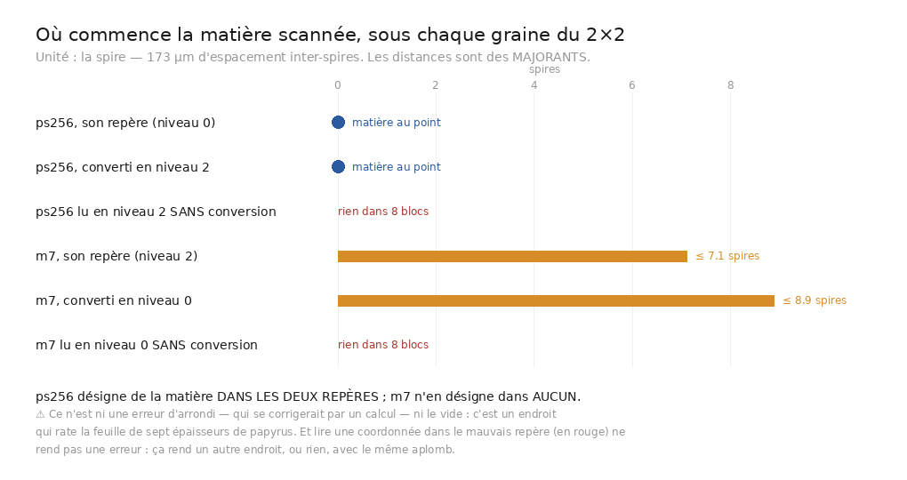
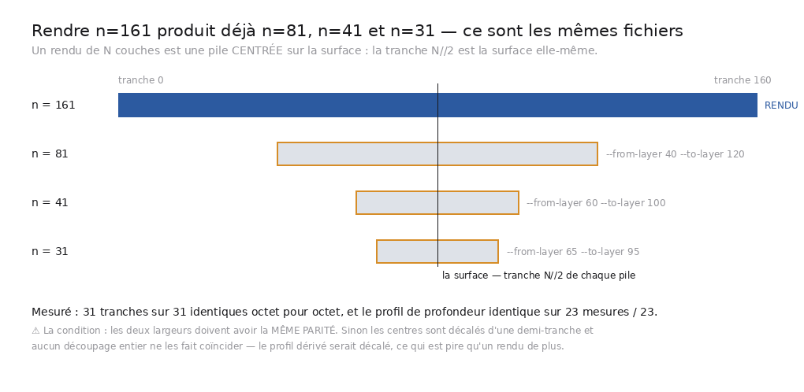
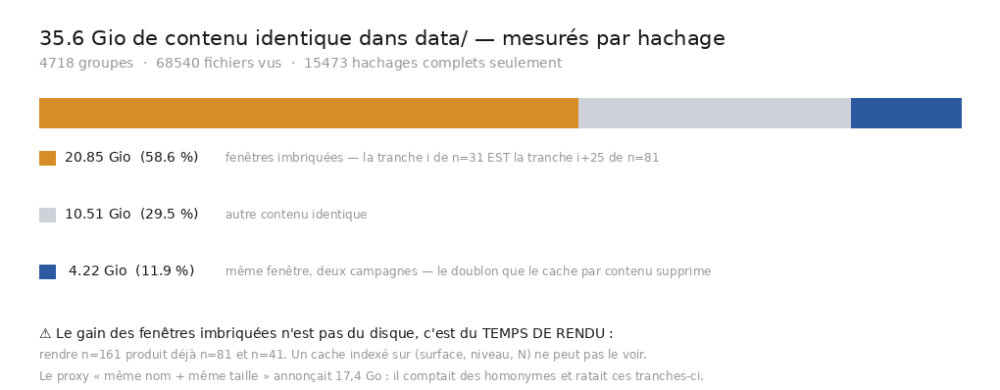
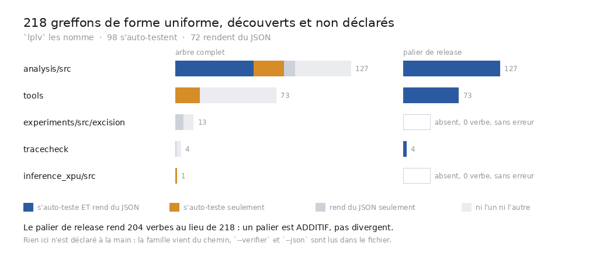

# Reprise de session

Document de passation. ⚠ Le bloc **REPRISE** ci-dessous est l'état courant ; le reste est
l'historique, daté, et se lit ensuite.

---

---

## ⚠⚠⚠ UN RUN OUBLIÉ A ÉCRASÉ UN RÉSULTAT FRAIS — et `temoins.sh` a maintenant un verrou

`temoins.sh` **écrit** `docs/mesures/temoins.json` à la fin. Deux runs concurrents courent donc
dessus, et c'est **le plus LENT qui gagne** : un run lancé *avant* une correction peut écraser
le résultat vert d'un run lancé *après*. Vu en vrai le 2026-08-26 — un run oublié en
arrière-plan a remis `"echecs": 2` par-dessus un `"echecs": 0` frais, **plusieurs minutes
après le commit**.

⭐ C'est le cousin du piège déjà consigné ici (« un log périmé lu comme un résultat »), en pire :
là c'était une *lecture* périmée, ici c'est une **écriture** périmée. Aucune vigilance ne
protège de ça — seul un verrou le peut. `temoins.sh` refuse désormais de démarrer si un autre
run vit (verrou par PID, vérifié avec `kill -0`, donc un verrou orphelin ne bloque pas le
dépôt ; `--sans-verrou` pour le cas où on sait ce qu'on fait). Sondé : le second run refuse et
le dit, le verrou se libère à la sortie.

---

## ⭐⭐⭐⭐ `data/` RANGÉ — 43,4 Gio effacés, et la règle qui l'autorise

189 Gio → **146 Gio**, 81 dossiers → **61**. Rien n'a été effacé au jugé : `a_supprimer()`
(`src/depot/donnees_sans_appelant.py`) applique deux classes, et **aucune** ne touche un
dossier que quelque chose nomme.

| classe | dossiers | poids | la raison |
|---|---:|---:|---|
| **muette** | 7 | 1,94 Gio | rien ne la nomme **et** elle ne dit pas d'où elle vient |
| **dépensée** | 16 | 41,4 Gio | rien ne la nomme, elle dit d'où elle vient, **et son résultat est publié** |
| gardée | 6 | 7,2 Gio | tracée mais rien de publié — l'effacer emporterait une mesure |

⭐ **La première classe est la règle de l'auteur, écrite en code** : *« si on ne sait plus du
tout d'où ça vient ni ce que c'est, on peut le supprimer, parce que de toute façon on ne
sait pas »*. Un dossier de mesure porte sa propre trace — un `meta.json` qui nomme son parent
(`decoupe_de`, `projete_de`), un `seed.json` qui donne sa graine, un `.log` qui garde la
commande. Aucun des trois ⇒ ni rejouable, ni vérifiable, ni explicable.

⭐⭐ **La seconde est plus intéressante, et c'est elle qui pèse** : une campagne dont le
chiffre vit dans `docs/mesures/` et que `verifier_chiffres.py` recalcule **a rendu ce qu'elle
avait à rendre**. Chaque suppression a été vérifiée en nommant le fichier de résultat qui la
justifie — `ext_budget` → `extension_ext_budget_gen200.json`, `spires_pic025` →
`spire_pic025_spire00.json`, et ainsi de suite pour les seize.

⚠ Et `data/meshes` est **gardé** alors que rien ne le nomme : `docs/journaux/ppm_convert.log`
dit ce que c'est (`20230909121925.tifxyz`, le maillage du segment publié) et par quoi il se
refait (`src/outils/ppm_to_tifxyz.py`). Ce n'est pas « on ne sait pas », c'est « on sait, et
personne ne s'en sert en ce moment ».

### ⭐ « Fusionner ce qu'on peut » — mesuré, et la réponse n'est pas une suppression

`contenu_en_double.py` sur les 146 Gio : **71 970 fichiers, 3 782 groupes identiques,
15,56 Gio récupérables**. Le partage est ce qui décide de la suite :

| motif | poids | ce que c'est |
|---|---:|---|
| `fenetres_imbriquees` | **8,51 Gio** | `rendu_31/20.tif` **est** `rendu_81/45.tif` — une fenêtre étroite est déjà dans la large |
| `autre` | 7,05 Gio | des clones tiers (`data/repos/`), un PDF stocké trois fois, des rendus documentés |

⭐⭐ **Et la fusion des 8,51 Gio n'est pas un `rm`, c'est le raccourci de rendu du chantier A**
(`sous_fenetre.py`, `DERIVER=1`) : une fenêtre étroite se **dérive** de la large, octet pour
octet. ⚠ Mais il est **câblé et sondé, jamais exercé sur un vrai rendu** — effacer les
fenêtres étroites en pariant dessus serait faire confiance à une machinerie qu'aucune mesure
n'a encore fait tourner. Le gain est nommé, chiffré, et attend son premier vrai rendu.

⚠ Les 7,05 Gio restants ne sont pas non plus à effacer : `data/repos/` se reclone
(`src/outils/clone_repos.sh`), et les rendus qui s'y trouvent — `m7_c0/rendu_161`,
`leur_graine/rendu_161` — sont l'**objet même** de `54` et `51`. Effacer une preuve pour
gagner du disque, c'est effacer la mesure.

### ⚠ Ce que je n'ai PAS fait, et pourquoi

**Grouper `data/` en sous-dossiers** (`data/chaine/`, `data/paris4/`, `data/spires/`). Mesuré :
69 citations à réécrire pour 14 dossiers — mais surtout, **le préfixe EST déjà le groupe** et
il trie ensemble, et deux noms de la famille sont des frères par conception : `data/spires` et
`data/spires_dedans` existent tous les deux, `data/second_axe` et `data/second_axe_41` aussi.
Les imbriquer forcerait à renommer l'aîné. Le rangement se paierait en citations de blocs
« Reproduire » qui produisent des chiffres publiés, pour un gain d'affichage.

---

## ⭐⭐⭐⭐⭐ TROIS DOSSIERS — `src/`, `docs/`, `data/`, et rien d'autre

`tracecheck/`, `experiments/`, `inference_xpu/`, `apprendre/`, `article/`, `artefacts/`,
`repos/`, `site/` et `soumission/` sont **repliés**. La racine ne porte plus que trois
dossiers et les fichiers qui doivent y être (`README`, `LICENSE`, `pyproject.toml`, `lplv`).

| ce qui était à la racine | où c'est | pourquoi là |
|---|---|---|
| `tracecheck/` | `src/tracecheck/` | c'est du code de ce dépôt |
| `experiments/src/excision/` | `src/excision/` | idem, et son `pyproject` est replié dans celui de la racine |
| `inference_xpu/` | `src/xpu/` | son `pyproject` **reste avec son code** : torch/XPU épingle Python 3.13 et un index maison |
| `apprendre/` | `src/apprendre/` | à plat, comme toutes les familles |
| `article/` | `docs/article/` | c'est un document |
| `artefacts/` | `data/artefacts/` | ce sont des données |
| `repos/`, `site/`, `soumission/` | `data/` | tout ça se retélécharge |

⭐ **Le signe que la disposition est juste, c'est que trois listes se sont RÉDUITES.**
`lplv.FAMILLES` passe de cinq motifs à **deux** (`src/*/*.py`, `src/*/*.sh`),
`artefacts_orphelins.SOURCES` de quatre entrées à **une**, et `temoins.sh` perd ses **six**
changements de projet — il n'y a plus qu'un environnement à part, celui de `src/xpu`. Chacune
de ces listes ENREGISTRAIT la dispersion.

### ⚠⚠ Ce que le repli a cassé, et qu'il a fallu réparer

- **La liste blanche de la release se serait élargie toute seule.** Elle gardait `src` en
  bloc et laissait dehors `experiments/` et `inference_xpu/`, qui étaient des dossiers de
  premier niveau. Devenus des familles de `src/`, ils y seraient entrés — **6,3 Gio
  d'environnement torch dans la release, sans qu'une ligne ne change**. Les familles sont
  désormais listées **une par une**, et un contrôle échoue si `src` réapparaît en bloc.
- ⚠⚠⚠ **Un contrôle est passé de 90 secondes à plus de 47 MINUTES** — et il n'a jamais rendu
  la main. `artefacts_orphelins` faisait `rglob("*")` sur `src/`, qui contient maintenant
  `src/xpu/.venv` : 8 885 fichiers de `site-packages` lus, puis cherchés dans un corpus de
  centaines de mégaoctets. Élagué à la traversée. **Troisième fois que ce dépôt paie un
  `rglob` non élagué**, et la règle est maintenant écrite dans les deux walkers concernés.
- **Huit verbes qu'on ne pouvait pas exécuter.** Replier `apprendre/` a fait entrer huit
  **scènes Manim** dans le glob des verbes — or une scène n'a pas de ligne de commande, donc
  `lplv <scène> --help` échouait. ⭐ La règle qui les écarte est **dérivée, pas une liste
  d'exceptions** : un programme a une garde `__main__` ou du travail au niveau du module.
  Mesurée sur l'arbre, elle écarte exactement neuf fichiers — les huit scènes **plus**
  `telecharger.py`, une bibliothèque qu'une liste de dossiers aurait ratée.
- **`deplacer.py` refusait son propre travail correct.** Ranger `article/` sous `docs/`
  produit un chemin neuf qui **contient** l'ancien, donc chaque citation déjà réécrite était
  recomptée comme pendante : **40 fausses pendantes**. ⚠ Et ma première correction — refuser
  un `/` précédé d'un mot — cassait `"$ROOT/analysis/src/x.py"`, une citation parfaitement
  légitime ; deux contrôles l'ont dit tout de suite. Le masquage se fait donc là où l'outil
  connaît les **deux** chemins, pas dans le motif qui n'en connaît qu'un.
- **Un manque de dépendance rendu visible.** `src/volume/region_locale.py` importe `zarr`, et
  la racine ne le déclarait pas : il ne marchait **que lancé depuis `experiments/`**,
  c'est-à-dire par accident de répertoire courant. ⚠ Et `zarr` 2.x exige `numcodecs < 0.16`
  (`cbuffer_sizes` a disparu en 0.16) — l'environnement qui marchait portait 0.15.1, la
  racine 0.16.5.

⚠ L'environnement de `experiments/` est **supprimé** (350 Mio) : ses dépendances sont dans le
`pyproject.toml` de la racine, donc `src/excision/` tourne dans l'environnement principal —
vérifié en important `radial`, `proximity`, `fusions` et `zarr` depuis lui. Les deux
environnements qui restent le sont parce qu'ils **ne peuvent pas** fusionner : `src/xpu/.venv`
(torch/XPU, Python 3.13, index maison) et `src/apprendre/.venv` (manim).

---

## ⭐⭐⭐⭐⭐ LA CHAÎNE **GLISSE** HORS DE LA FEUILLE CONNUE — elle n'y SAUTE pas

Et on le sait **sans encre et sans rendre un seul voxel**. Le raisonnement qui manquait tient
en une phrase : le point de départ est un morceau d'un segment **publié**, donc la bonne
feuille est connue sur **toute l'emprise de ce segment**, pas seulement sous le morceau. Il
suffit de demander, maillon par maillon, à quelle distance de cette surface la chaîne est.
`src/nappe/couverture_publiee.py`, quelques secondes.

| maillon | parcouru | encore SUR la surface | **écart signé** | même côté |
|---:|---:|---:|---:|---:|
| 1 | 96 µm | **100,0 %** | −0,1 vox | 57 % |
| 8 | 768 µm | 56,3 % | −5,1 | 63 % |
| 20 | 1 920 µm | 45,4 % | −11,7 | 72 % |
| **60** | **5 760 µm** | ⚠ **27,2 %** | ⚠ **−28,8 vox = −69 µm** | **73 %** |

⭐⭐⭐ **Lisse, monotone, et du même côté pour 73 % des points.** Ce n'est ni un gauchissement
(qui s'écarterait des deux côtés) ni un saut de spire (qui serait une marche brusque). C'est
une **dérive systématique**, et les deux pannes n'ont pas le même remède.

⭐⭐ **Contre les seuils du dépôt, pas contre un nombre choisi** : `carte_segments.py` publie
40 µm (même feuille, raccordable) et 250 µm (feuilles voisines). À 5,76 mm la chaîne est à
**69 µm** — sortie de la première bande vers 3,5 mm, **encore loin** de la seconde. Elle n'a
donc **pas changé de feuille** ; elle n'est simplement plus raccordable à celle-ci. Et la
dérive **décélère** : 15,9 → 14,6 → 12,0 µm par mm parcouru.

### ⚠⚠ Deux explications concurrentes, écartées par la mesure

1. **« Elle sort par le bord du segment publié. »** Pas exotique : le morceau part à
   **29 cases du bord** (1,4 mm) et la chaîne parcourt 5,76 mm. Mesuré : **0,0 %** des points
   ont leur plus proche voisin sur la bordure jusqu'à 2,9 mm, **0,1 %** à 5,76 mm.
2. **« C'est latéral, pas de la profondeur. »** L'écart total (48,0 vox) et l'écart **projeté
   sur la normale** (28,8) sont mesurés séparément. La composante normale est réelle.

⚠⚠⚠ **Et ma première version du contrôle nº 1 NE POUVAIT PAS se déclencher** : elle
définissait le bord par la **forme** de la grille, or le maillage publié laisse une marge vide
de **cinq cases** — donc « 0 % au bord » était vrai **par construction**. C'est une sonde qui
l'a dit. Le bord est maintenant *là où le valide s'arrête* (une case valide qui touche une case
invalide) : exact, tient compte des trous, **aucune marge à choisir**.

### ⚠ Ce que ça ne dit toujours pas, et où la découverte commence

L'encre reste nécessaire pour savoir si le **texte** suit — mais cette mesure la **cible** :
la couverture s'effondre vers le **maillon 8**, donc c'est là qu'un rendu de plusieurs heures
vaut son prix, et pas au maillon 1 où la surface est encore à 100 % sur du terrain connu.

⚠ Feasibilité du rendu, mesurée : la boîte niveau 0 d'un maillon vaut **643 Gvox** au maillon 1
et **3 417 Gvox** au 60, et **aucun volume niveau 0 de ce rouleau n'est local**. Le rendu est
une opération **réseau**, pas de calcul.

⚠⚠ **Piège d'outillage payé en enregistrant la batterie** : `temoins.sh` **change de projet en
changeant de répertoire** (`cd "$ROOT/experiments"`, `cd "$ROOT/inference_xpu"`), donc
*l'endroit* où une batterie est enregistrée décide de *l'environnement* qu'elle reçoit.
`src/excision/` n'a pas PIL : une figure dont la batterie **dessine vraiment** y échoue sur un
`ModuleNotFoundError` qui ne dit rien de la figure. Les figures voisines de cette région s'en
tirent parce qu'elles importent PIL **à l'intérieur d'une fonction** — donc leur batterie ne
dessine pas, ce qui est exactement ce qu'on ne veut pas. Les deux nouvelles batteries sont
enregistrées dans la région `$ROOT`, et la raison est écrite sur place.

---

## ⭐⭐⭐⭐⭐ `docs/` EST RANGÉ — 522 fichiers à la racine → 58, et l'audit que ça a forcé

`docs/` : **58 documents**, plus `mesures/` (384), `journaux/` (79), `registres/` (1),
`images/` (77) et les treize dossiers de campagne, déjà rangés par rouleau.

⭐ **Une nature n'est pas une extension, c'est un usage**, et c'est mesuré : les `.json` sont
cités **77 fois** par les documents, les `.log` **jamais**. Deuxième signal concordant et
indépendant : les `.log` sont gitignorés. Et un **registre** bat son extension —
`murs_et_causes.tsv` est tenu à la main, donc une purge des sorties ne doit pas l'emporter.

### ⚠⚠ Ce que le rangement a forcé à auditer, et qui était CASSÉ avant lui

- **Tous les chiffres publiés du dépôt étaient à une réorganisation d'être « vérifiés » par
  personne.** `verifier_chiffres.py` lisait ses 50 mesures en `racine / "docs" / "x.json"`,
  écrit **quarante-quatre fois** — deux littéraux séparés, donc invisibles à toute réécriture
  textuelle — et chaque lecture est gardée par `if p.exists():`. Un `docs/` rangé aurait fait
  sauter cinquante sources **en restant vert**. Le remède n'est pas quarante-quatre
  réparations : c'est **dire l'endroit une seule fois** (`DOSSIER_MESURES`) et **enregistrer**
  ce qu'on a cherché. Mesuré : 50 sources, 0 manquante, avant comme après le déplacement.
- **81 fichiers seraient entrés dans le dépôt sans un mot.** `.gitignore` dit `/docs/*.log`,
  une règle **ancrée** : les journaux déplacés en sortent, donc entrent dans le suivi.
- **`git mv` refuse un fichier qu'il ne suit pas, et refuse au MILIEU du plan** : 14 fichiers
  déplacés puis un arrêt sec sur le premier `.log`.

### ⭐ Le danger visé, attrapé sur le premier vrai usage

Une citation morte se voit ; un **écrivain** non réparé recrée la mesure à la racine, à côté du
fichier rangé — **deux fichiers pour une mesure**, l'un frais et l'autre mort, sans qu'aucune
sortie ne change. `mentions_a_lancien_endroit()` a trouvé **cinq blocs « Reproduire » du
document 44** qui écrivent `$PWD/docs/chaine_*.json`, des fichiers *qui n'existent pas encore*
— donc invisibles pour tout outil qui ne connaît que ce qui est là. 19 endroits réparés.

### ⚠ Deux contradictions internes des outils

- `deplacer.py` **refusait de laisser une citation qu'il avait décidé exprès de ne pas
  réparer** : sa règle dit qu'un chemin écrit dans un résultat publié ne se réécrit pas, et son
  contrôle final le comptait comme pendant. Aucun plan touchant un fichier nommé dans un
  résultat ne pouvait aboutir — un refus que personne ne peut satisfaire. 125 chemins de cette
  classe ici, dont un recensement qui en cite 51. Ils sont **nommés dans le rapport**, et une
  citation dans un fichier qui n'est PAS un enregistrement fait toujours refuser.
- La docstring de `REGISTRES` **promettait une vérification qui n'existait pas**. En l'écrivant,
  elle a corrigé sa propre liste : `verbes.json` est lu comme une entrée par `lplv` mais
  **produit** par `./lplv --verbes --json`. Le classer en registre l'aurait mis hors de portée
  d'une purge de sorties alors que c'en est une.

### ⚠⚠ CORRECTION — ma section d'hier disait l'inverse, et c'est l'auteur qui a tranché

J'avais écrit que les six dossiers restants avaient chacun « une raison » de rester : un
environnement de dépendances, un livrable, des données versionnées. **L'auteur a redemandé le
repli deux fois**, et il avait raison sur le fond : une raison de rester n'est pas la même
chose qu'une raison d'être à la RACINE. Un environnement de dépendances peut vivre **avec son
code** (`src/xpu/pyproject.toml`), un livrable est un document (`docs/article/`), et des
données versionnées sont des données (`data/artefacts/`, avec l'exception `.gitignore` qui
va avec). Les trois « raisons » étaient des raisons de ne pas fusionner les
environnements — pas de garder neuf dossiers de premier niveau.

### ⚠⚠ Deux réponses à « qu'est-ce qu'un script de ce dépôt », et elles avaient divergé

`lplv.FAMILLES` nomme **cinq** familles (`src/`, `src/tracecheck/`, `src/xpu/`,
`src/excision/src/`) pendant qu'`appelants.py` jugeait **`src/` seul**, en dur. Donc `lplv`
savait lancer un verbe dont le garde-fou ne se demandait jamais si quelque chose l'exécutait :
**un orphelin hors de `src/` était invisible par construction**. Mesuré après unification :
**214 → 233 scripts jugés**, **27 → 31 orphelins**, les quatre nouveaux tous hors de `src/`.

⚠ Et `FAMILLES` n'est pas « tout le Python du dépôt » : `src/apprendre/*.py` en est
**délibérément** absent. Ce sont des définitions de scènes Manim, exécutées par
`manim <fichier> <Scene>`, pas des programmes — en faire des verbes créerait des verbes qui
échouent sur `lplv <verbe> --help`. La raison est écrite là où quelqu'un voudra les ajouter.

### ⚠⚠ CHANTIER B — la mesure CONTREDIT le plan, et c'est le plan qui cède

Le plan disait « un dossier par ROULEAU ». Mesuré avant d'y toucher :

- `data/` est **entièrement gitignoré** — **0 fichier suivi par git**. Le réorganiser ne change
  rien pour qui clone le dépôt ; ça ne touche que la machine de l'auteur.
- **11 des 81 dossiers seulement nomment un rouleau.** Les 86 % restants sont des
  *expériences* (`chaine_*`, `spires_*`, `ext_*`), et les forcer sous un rouleau serait faux.
- `data/trace/` groupe **déjà** par rouleau à l'intérieur — le rouleau est une SUBDIVISION
  d'une expérience, pas l'inverse.
- Coût : 296 citations sur 64 chemins distincts, plus 177 Gio à déplacer.

⭐ Donc le déplacement est cher, risqué, et n'achète rien de visible. Ce que `data/` appelle
vraiment, à 177 Gio, c'est **« qu'est-ce que je peux effacer »**.

**`src/depot/donnees_sans_appelant.py` répond, et le chiffre est là : 50,6 Gio.**

| classe | dossiers | poids | ce que ça veut dire |
|---|---:|---:|---|
| orphelins | 25 | **44,3 Gio** | aucun script, aucun document ne les nomme |
| en journal seulement | 3 | **6,3 Gio** | un journal se souvient d'eux ; aucun code vivant |
| vivants | 52 | — | nommés par un script ou un document |

⚠⚠ **NOMMER N'EST PAS EFFACER, et l'outil n'efface jamais.** Un dossier que rien ne nomme peut
être une entrée téléchargée une fois, ou le résultat d'une campagne qu'on n'a pas encore
écrite. Dire « périmé » et remplacer sont deux actes — même discipline que
`fraicheur_des_figures.py`, qui ne touche jamais `docs/images/`.

⚠ Et la nuance qui rend le verdict utilisable : un dossier nommé **seulement dans un journal**
n'est pas nommé par du code vivant. Un journal prouve un usage *passé*, pas un besoin
*présent* — les confondre ferait effacer ce qui permet de recouper une campagne déjà publiée.

⚠ Le nom nu ne compte pas, seul le chemin `data/<nom>` compte : `data/out` et `data/trace`
portent des mots courants, et chercher « out » les déclarerait vivants depuis n'importe quelle
prose. Même discipline que le préfixe d'identifiant, qui n'en est un que si un document en
définit un membre. Sondé dans les deux sens.

---

> ⚠⚠ **Un test cassé par un `push`, pas par un commit.** `permalien.py` vérifiait le genre
> d'un dossier au commit publié en nommant `analysis` — vrai jusqu'au rangement, et **faux dès
> que `origin/main` a rattrapé HEAD**. Le contrôle est passé rouge sans qu'une ligne de
> `permalien.py` ait bougé. La leçon : une fixture qui nomme un chemin doit viser un chemin
> **stable dans le commit visé**, et le vérifier au lieu de le supposer — c'est ce que fait
> désormais le contrôle « le dossier témoin existe bien dans le commit visé », ajouté à côté.

## ⭐⭐⭐⭐⭐ LE REGISTRE N'A PLUS AUCUNE CAUSE OUVERTE — la graine rate de SEPT SPIRES



La dernière cause ouverte du dépôt — *« la graine, c'est-à-dire l'endroit »* — est **fermée par
la mesure**. `54` avait écrit le préalable (*sonder la graine avant de payer le tracé*) et
`matiere_au_point.py` répondait **oui ou non**. Mais « non » recouvrait deux situations qui ne
demandent pas la même chose : une graine **à côté** de la feuille, qu'un calcul corrige, et une
graine **dans le vide**, que rien ne sauve.

| sonde | distance à la matière |
|---|---:|
| `ps256` dans son repère (L0) | **0 µm** |
| `ps256` converti en L2 | **0 µm** |
| `m7` **dans son propre repère** (L2) | ≈ **7,1 spires** |
| `m7` converti en L0 | ≈ **8,9 spires** |
| l'un ou l'autre lu **sans conversion** | rien dans 8 blocs, 4 913 requêtes |

⭐⭐⭐ **`ps256` désigne de la matière dans LES DEUX repères ; `m7` n'en désigne dans AUCUN.**
Ce n'est donc pas un défaut de conversion : convertie correctement, elle rate quand même.
À 173 µm d'espacement inter-spires, elle rate la feuille de **sept épaisseurs de papyrus**.

⭐ **Ce que ça ferme** : l'endroit explique la famille `m7` — ses traces n'ont jamais eu de
feuille à suivre. C'est la **cause** de la note de portée de `54` (*« les trois quarts du
maillage tombent hors du volume »*) : c'est le **point de départ** qui est dehors.

⚠ **Ce que ça ne ferme pas** : le mur. `ps256` part **sur** de la matière et ses traces portent
quand même quatre à cinq fois moins de structure que le segment publié.

⚠⚠ Et lire une coordonnée dans le mauvais repère **ne rend pas une erreur** : 4 913 blocs
parcourus sans rien trouver, sans un refus ni un avertissement — *un autre endroit, ou rien,
avec le même aplomb*.

**Registre : 30 causes, 19 éliminées, 10 confirmées, 1 bloquée, ZÉRO ouverte.**

⚠ Trois fois dans la même passe, un contrôle a cherché son propre motif dans le fichier qui le
contient. La parade n'est pas un meilleur motif : c'est de faire de la chose contrôlée une
**donnée** (`LEGENDE`, `GLYPHES_ABSENTS`) au lieu d'un texte à grepper.

---

## ⭐⭐⭐⭐⭐ LE RACCOURCI EST CÂBLÉ — et il est incapable d'empirer les choses

`profiler_une_surface.sh` demande son plan à `sous_fenetre.py --shell`, rend les fenêtres
`RENDRE` d'abord, **garde leur pile** tant que des filles peuvent en dériver, puis dérive.
Sur la série du dépôt : **3 rendus évités sur 4**.

⭐ **Trois replis, chacun bruyant** — plan incalculable, pile absente ou inexploitable,
dérivation échouée — et chacun retombe sur *rendre comme avant*. On ne peut donc jamais
**perdre** une fenêtre à cause du raccourci ; au pire on ne gagne rien. `DERIVER=0` le
désactive sans le retirer.

⚠ **Un seul site de dépôt dans le cache**, portant sa garde chez lui (`deposer_cache`). Il y en
avait deux, et deux sites finissent par ne plus poser la même garde : celui qu'on oublie dépose
un profil à moitié écrit que **toutes** les campagnes suivantes reliront comme un résultat.

### ⚠⚠ Quatre de mes contrôles ne pouvaient pas échouer

Le témoin est passé de 33 à 50 contrôles, et **quatre des premiers étaient faux** :

- comparer des **numéros de ligne** pour dire « après » — muet dès que l'appel passe dans une
  fonction → remplacé par la propriété (le dépôt est **gardé** par un profil non vide) ;
- `chk '[ $? = 0 ]'` — `$?` lit le retour du **harnais**, pas de la fonction → capturé tout de
  suite ;
- grepper le fichier **qui contient le contrôle** → grepper le corps **privé de son témoin**,
  plus un contrôle qui vérifie que l'exclusion marche ;
- des motifs qui matchaient la **prose du commentaire** → des motifs qui visent le **site
  d'appel**.

⚠ Deux pièges de shell : un motif traversant `chk` → `eval` → `grep` voit son `${…}` devenir une
**ancre de fin de ligne** ; et `grep -qF "--shell"` prend `--shell` pour une **option**.

⚠ **Câblé et sondé, pas encore exercé sur un vrai rendu.** La première campagne de convergence
sera la mesure.

---

## ⭐⭐⭐⭐⭐ LE RACCOURCI DE RENDU — éprouvé par 13 agents, il tient



**Rendre n=161 produit déjà n=81, n=41 et n=31.** Ce sont **les mêmes fichiers**, pas des images
qui se ressemblent : un rendu de N couches est une pile **centrée** sur la surface, donc deux
fenêtres rendues au même endroit partagent toutes les tranches de la plus étroite.

⭐ **Et il n'y avait rien à construire** : `depth_profile.py` porte déjà `--from-layer`,
`--to-layer`, `--traced-layer`. Ce qui manquait était l'**arithmétique dite une fois** —
`src/depot/sous_fenetre.py`. Sur la série du dépôt : **3 rendus évités sur 4**.

**8 mesures indépendantes + 5 tentatives de réfutation** (13 agents, 2,95 M tokens) :
**6 sites confirment**, chacun **toutes** ses tranches identiques octet pour octet et **23
mesures de profil sur 23**, zéro différence. **Aucun ne réfute.** Les 2 restants sont
IMPOSSIBLE pour des raisons de **données**.

### ⚠⚠ Trois choses que je n'aurais pas trouvées seul

1. **Une borne que RIEN ne vérifiait** : `--from-layer` désigne des **numéros de fichier**, pas
   des positions. Sur une pile trouée, la sous-plage rend un profil **plus court, en silence**.
   `verifier_pile` refuse désormais — et une pile du dépôt utilise vraiment trois chiffres
   (`060.tif`), donc le contrôle porte sur l'**ensemble des numéros**, pas sur les noms.
2. **Un piège de l'instrument** : la **console** imprime les indices de pic en **ABSOLU**, le
   **JSON** les stocke **RELATIFS**. Trois vérificateurs ont failli conclure à une réfutation en
   lisant « couche 42 » contre « couche 17 » — un écart qui est exactement le décalage de
   fenêtre. Ce n'était dit nulle part ; ça l'est maintenant.
3. **1,89 Gio de TIFF illisibles** : `data/leur_graine/rendu_161`, 161 fichiers, en-tête `II*\0`
   correct puis offset d'IFD **nul**. [`51`](docs/51_une_pente_a_deux_appuis.md) disait « le
   profil **survivant** » sans nommer ce qui avait tué l'autre. ⚠ Ce n'est **pas** la panne de
   [`54`](docs/54_cinq_rendus_vides.md) : celles-là s'ouvrent et sont noires, celle-ci ne
   s'ouvre pas.

⭐ Le réfuteur « arithmétique » a **redérivé indépendamment** la condition de parité que
`peut_deriver` portait déjà : le décalage est `N//2 − N//2`, pas `(N_large − N_étroite)/2`. La
réfutation a validé le module en tombant sur la formulation naïve de ma consigne.

⚠ **Pas encore câblé** dans `profiler_une_surface.sh` : il faudrait garder le rendu large vivant
pendant toute la boucle, alors que le script le supprime à chaque tour (562 Mo par pile). C'est
un changement d'ordonnancement **et** de disposition disque dans un script qui produit des
résultats publiés. L'arithmétique, elle, est livrée et éprouvée.

---

## ⭐⭐⭐⭐ CHANTIER A — le doublonnage mesuré, et une découverte qui vaut du TEMPS



**35,58 Gio de contenu identique** dans `data/`, mesurés **par hachage** sur 68 540 fichiers.
⚠ Le proxy « même nom + même taille » du plan annonçait 17,4 Go et se trompait **dans les deux
sens** : il comptait des chunks zarr homonymes de contenu différent, et il ratait l'essentiel.

⭐⭐ **58,6 % ne sont pas un doublon de campagne, ce sont des FENÊTRES IMBRIQUÉES.** Une fenêtre
de 31 couches est le **centre** d'une fenêtre de 81 rendue au même endroit : la tranche `i` de
l'une **est** la tranche `i+25` de l'autre, au bit près. Les paires trouvées sont exactement la
série de convergence — **(31, 81)** sur 2232 groupes, **(41, 161)** sur 861.

| motif | poids |
|---|---:|
| **fenêtres imbriquées** | **20,85 Gio** |
| autre | 10,51 Gio |
| même fenêtre, deux campagnes | 4,22 Gio |

⭐ **Le gain n'est donc pas du disque, c'est le temps de rendu de toute campagne de
convergence** : rendre n=161 produit **déjà** n=81 et n=41. ⚠⚠ Et le cache qu'on vient
d'écrire, indexé sur (surface, niveau, N), **ne peut pas le voir** — seul un cache par
**tranche** le verrait. C'est la marche suivante, et elle n'est pas faite.

**Le cache par contenu est livré** (`src/depot/empreinte_surface.py` +
`src/outils/profiler_une_surface.sh`). ⚠ Exclu de la clé, chacun une panne évitée : la **date**
(recopier une surface la change sans changer un octet), le **chemin absolu** (deux machines ne
partageraient jamais un cache), l'**ordre du système de fichiers** (le tri est ce qui fait
d'une clé une clé). ⚠ **Non exercé sur un vrai rendu** : la porte de sortie du plan demande
quinze minutes et un volume distant. Ce qui est vérifié est la forme — compteurs imprimés,
dépôt **après** le profil, clé venant de l'instrument.

⚠ **Rien n'est supprimé** : l'outil mesure et nomme. Un effacement n'est pas réversible.

---

## ⭐⭐⭐⭐⭐ LE DÉPÔT EST RANGÉ — `src/` en dix familles, 1011 citations réécrites

`analysis/src` (126 fichiers à plat) et `tools/` (73) sont devenus **`src/`**, en dix familles.
Détail et mesures : [`56`](docs/56_le_grand_menage.md).



```
src/outils/ 61   src/figures/ 37   src/nappe/ 22   src/volume/ 15   src/graine/ 15
src/encre/  13   src/campagnes/ 12  src/tables/ 10  src/depot/  8   src/commun/  8
```

⭐ **`src/commun/` est une mesure, pas un fourre-tout** : les modules importés par leurs
frères. ⚠ Ma première mesure en annonçait 8 et elle était **fausse** — ancrée sur `^import x`,
donc aveugle à `import x  # commentaire`. Le remède n'a pas été de mieux compter mais de
**cesser de compter** : chaque module met toutes les familles sur son chemin, donc un
reclassement futur ne casse aucun import.

⚠⚠ **Mon estimation disait ~490 citations, la mesure en a trouvé 1011.** Deux fois plus. Plus
62 scripts shell qui remontaient d'un cran vers la racine, 50 `sys.path` qui supposaient un
dossier plat, et 12 chemins **assemblés** qu'aucune réécriture textuelle ne peut voir —
`src/depot/deplacer.py` les NOMME au lieu de les taire.

**37 échecs → 0**, et aucun trouvé en relisant : les extraits en ligne de `temoins.sh`
pointaient chacun vers un dossier ; mon insertion de `sys.path` **ignorait l'indentation** (18
occurrences indentées → `IndentationError`) ; sept chemins assemblés ; et le témoin de
`lancer.sh` a attrapé que le **gel** d'un script doit vivre à la profondeur que ce script
suppose — les scripts remontant de deux crans, `.lances/` devient `.lances/gel/`.

⚠ **N'ont PAS bougé** : `src/tracecheck/` (le livrable que l'article décrit), `src/excision/` et
`src/xpu/` (chacun son environnement). Décision par dossier, pas coup de balai.

**Tout passe par `./lplv`** — `./lplv --help`, `./lplv <verbe> --help`, `./lplv --version` —
donc plus personne n'a besoin de connaître un chemin, et un reclassement futur est invisible.

---

## ⭐⭐⭐⭐ CHANTIER C LIVRÉ — `lplv`, le point d'entrée que 218 greffons attendaient

Le chantier C de [`56`](docs/56_le_grand_menage.md). **Aucune architecture n'a été créée ici :
elle a été constatée et nommée.**


**218 verbes, zéro nom ambigu, 98 qui s'auto-testent, 72 qui rendent du JSON.** Rien n'est
déclaré à la main — la famille vient du chemin, `--verifier` et `--json` sont lus dans le
fichier, et le résumé est la première ligne de docstring, c'est-à-dire **exactement la chaîne
que le module donne déjà à son `argparse`**.

```bash
./lplv --help              # les verbes, chacun avec sa propre première ligne
./lplv <verbe> --help      # SON aide, produite par lui-même
./lplv --version           # de quel palier il s'agit
```

⭐ **`lplv <verbe> --help` EXÉCUTE le module.** Re-lire son `argparse` pour en refabriquer une
aide produirait une seconde description libre de dériver — la panne exacte que ce point d'entrée
existe pour empêcher (skill `doc-derivee`, cran 2).

**Les paliers tombent tout seuls, mesuré** : l'arbre allégé de la release, construit dans un
dossier temporaire depuis la seule liste `GARDES`, rend **204 verbes au lieu de 218**, sans
erreur ni configuration. Et un verbe absent de ce palier ne répond **pas** « commande
inconnue » : il dit qu'il existe ailleurs, nomme son dossier, et sort en 3 au lieu de 2.

### `inference/` est parti aussi — et c'est une CORRECTION de ma conclusion de la veille

J'avais écrit qu'il restait, sur l'argument de son README (témoin CPU du ×4,5 iGPU). L'auteur a
objecté que le témoin devait être un **mode**, pas un dossier. Il a raison, et la mesure va plus
loin : deux dossiers, c'étaient **deux constructions de torch différentes**, donc la comparaison
mélangeait l'appareil ET la build. `infer_ink.py` prend désormais `--device auto`, et la règle
qui en fait un pipeline adaptatif plutôt que silencieux est : **« auto » retombe, « xpu »
REFUSE**. Le choix est une fonction pure — 10 contrôles hors ligne, sans GPU, sans torch.

### ⚠ Ce qui est demandé et PAS fait, avec son coût mesuré

L'auteur veut **un seul `src/` avec des sous-dossiers et un namespace**. C'est le bon état final
et `lplv` est précisément ce qui le rend abordable — mais c'est un chantier à part, mesuré :
**~490 citations de chemin** (178 dans `tools/*.sh`, 227 dans `docs/*.md`, 86 dans `temoins.sh`),
plus 24 imports entre frères et 51 `sys.path.insert`. Il lui faut son propre outil de réécriture,
qui **refuse** de laisser une citation pendante. Familles dérivées des préfixes réels :
`figure_*` 38, `table_*` 10, `campagne_*` 12.

---

## ⭐⭐⭐ MÉNAGE — état au 2026-08-25 (nuit) : `htr/` retiré, les 25 emprunts repointés

Premier morceau du grand ménage ([`56`](docs/56_le_grand_menage.md)). Deux modules neufs, une
suppression, et **deux chiffres du plan corrigés d'un facteur quatre**.

### Ce qui est parti, et ce qui reste — avec la raison à chaque fois

| | verdict | preuve |
|---|---|---|
| `htr/` | **retiré** | un seul fichier, remplacé par `src/encre/structure.py`, **zéro site d'appel** sous quelque orthographe |
| `inference/` | **reste**, venv retiré | son README argumente qu'il est le **témoin CPU** du ×4,5 iGPU validé à sortie identique ; `pyproject`+`uv.lock` versionnés → rejouable |
| `src/xpu/` | **reste entier** | c'est l'environnement de l'encre, et l'encre est le prochain chantier nommé |

### ⚠⚠ Deux mesures qui contredisent le plan

**`du` ment ici d'un facteur quatre.** `uv` installe en **liens durs** vers `~/.cache/uv`, donc
un fichier de venv est un *nom de plus* sur des octets déjà là. Retirer `htr/` + `inference/.venv`
libère **0,15 Gio tout de suite**, 4,09 de plus **seulement après `uv cache prune`** (non lancé :
c'est une ressource partagée avec la machine, pas une décision du dépôt), et 3,06 **jamais**.
Soit 4,24 Gio, pas 16,6. Calcul dans l'arbre : `src/depot/poids_recuperable.py`.

**Les « 25 sites d'appel » d'`inference/` étaient des EMPRUNTS, pas des besoins.** Le motif écrit
partout — *« le seul environnement porteur de Pillow »* — était faux (la racine déclare
`pillow>=10.0`) et **nuisible** : `inference/` n'a pas `numcodecs`, le trou exact qui avait fait
conclure à tort qu'une graine n'était pas couverte. Les 25 sont repointés sur la racine ; les
**11 batteries** concernées passent depuis là.

### ⭐ `src/depot/permalien.py` — l'outil que les chantiers B et D réutiliseront

Son invariant : *un permalien ne vaut que si son commit est **sur le distant** et que le chemin
**existe** à ce commit.* ⚠ `HEAD` était **43 commits en avance** sur `origin/main` — un lien vers
`HEAD` aurait rendu 404 partout ailleurs qu'ici, et la panne ne se serait vue qu'après un push.
⚠⚠ Et **ce dépôt est privé** (mesuré : racine 404 sans session, dépôt public du même compte 200),
donc le lien vaut pour l'auteur et pas pour un lecteur extérieur — d'où le contrôle qu'il porte
le commit et le chemin **verbatim**, pour que `git show <commit>:<chemin>` s'en déduise hors ligne.

⚠ **La vraie montagne n'est pas là** : 203 Gio de dépôt, dont **177 dans `data/`**. Les venvs
sont 2 % du problème ; le levier reste le chantier A (97 Gio de rendus recalculés).

---

## ⭐⭐⭐⭐ REPRISE — état au 2026-08-25 (soir) : LA CHAÎNE TANGENTIELLE MARCHE

Le mur « l'extension tangentielle est un point fixe » a **une** cause qui marche, et elle a
**deux conditions qui se composent**. Détail complet : [`44`](docs/44_ou_la_chaine_se_trouve.md).

### Les deux corrections, et pourquoi il fallait les deux

1. **Un pas FIXE en voxels** (`PAS_VOX`), pas un pas de grille. Un pas de grille couvre
   `pas × longueur moyenne de tangente`, donc un maillage qui cisaille **s'envoie lui-même
   plus loin au coup suivant** : boucle de rétroaction, mesurée à 95 → **650 µm** en dix
   maillons. À pas fixe : **96,0 µm exactement sur vingt maillons**, boîte ×1,92, tous les
   points gardés.
2. **Un RECALAGE sur la matière à chaque maillon** (`RECALER=1`) : chaque point ramené sur la
   crête du champ de distance de la prédiction, le long de la normale du **maillage**.

⭐ **Le résultat, jugé contre le plancher du hasard mesuré à chaque distance :**

| parcouru | pas fixe seul | **les deux** |
|---:|---:|---:|
| 480 µm | +24,1 | +24,4 |
| **768 µm** | ⚠⚠ **+1,5** (mort) | ⭐⭐ **+19,0** |
| 1 920 µm | ⚠⚠ **−1,7** (mort) | ⭐⭐ **+15,1** |
| 3 840 µm | — | ⭐⭐ **+9,2** |
| **5 760 µm** | — | ⭐⭐⭐ **+6,9** |

**Poussée à SOIXANTE maillons, elle tient 5,76 mm** et ne meurt pas : l'avantage s'affaiblit de
+30 à +7, mais la pente **s'aplatit** sur le dernier millimètre (+6,7 puis +6,9). Plateau bas,
pas chute. Le segment publié, pour référence, est à +30,6.

⚠ **Coût** : 95 min pour les maillons 31→60, et ça ralentit (33 s au maillon 2, 114 s au 30)
parce que la boîte englobante grossit — **×5,32** à 60 maillons. Le pas fixe tient la
**distance**, pas la **forme**.

⚠⚠ **Réserve de portée** : tout part d'un **morceau de segment publié**, pas d'une de nos
traces. C'est ce qui rend la mesure propre, et c'est aussi un point de départ privilégié.

### ⚠⚠ Ce qui rend ces nombres lisibles, et sans quoi ils ne le sont pas

Un « % de points posés sur la matière » **ne veut rien dire seul** : une nappe jetée n'importe
où dans un volume dont un quart est de la matière en trouve sous une partie de ses points.
`--plancher` mesure ce hasard — **la même nappe translatée au hasard**, plusieurs tirages,
graine fixée — et **par maillage**, parce que la densité locale varie de onze points le long
d'une seule chaîne.

⭐ Il a corrigé une conclusion que je venais de publier : « à 1 920 µm un seul bond garde plus
de matière que vingt maillons » (46,1 contre 35,4 %) était **faux** — les deux sont au niveau
du hasard, +1,6 et −1,7. Ce n'était pas un croisement, c'était deux mesures mortes comparées
sur une échelle brute.

⭐ Et la circularité a été **contrôlée** : mesurer la projection **avant** son recalage donne
+19,1 et +15,3 contre +19,0 et +15,1 après. Identique à la première décimale, alors que la
demande de déplacement passe de 1,6 / 3,4 voxels à 0,06.

### ⚠ Ce que ça ne dit PAS

Que la chaîne suit la **bonne** feuille. Elle est sur *du* papyrus, franchement au-dessus du
hasard, sur près de deux millimètres. Savoir si c'est la feuille qui prolonge le texte demande
de l'**encre** — tâche ouverte de [`43`](docs/43_la_chaine_des_spires.md).

### Registre des murs

**30 causes sur 4 murs — 19 éliminées, 9 confirmées, 1 ouverte, 1 bloquée.**
La seule cause encore ouverte est **« la graine, c'est-à-dire l'endroit »**, sur le mur
« le tracé ne suit pas de feuille » ([`54`](docs/54_cinq_rendus_vides.md)).

---

## ⭐ REPRISE — état au 2026-08-25

### ⭐⭐⭐ Le dernier résultat : enchaîner la projection tangentielle MARCHE, et c'est borné

Trois mesures, dont deux ne coûtent **aucun rendu**. Détail complet :
[`44`](docs/44_ou_la_chaine_se_trouve.md) §7.

1. **À distance égale, la chaîne bat le bond.** À 478 µm, là où une projection unique
   **quitte sa feuille** (18,4 % de pic au bord, contre 0 à 6 % partout avant), la chaîne de
   cinq maillons de 95 µm y est **encore** : **2,0 %** de pic au bord et **+31 %** d'amplitude
   (0,1491 contre 0,1140).
2. **Et l'horizon est chiffré : six maillons, 580 µm.** Vingt maillons projetés en quelques
   secondes : marche droite jusqu'au 6ᵉ, puis emballement — au 20ᵉ il ne reste **615 points
   valides sur 14 280**. ⚠⚠ Une nappe de `PHercParis4` fait des dizaines de millimètres de
   tour : **580 µm est le centième d'un tour**, donc une chaîne **purement géométrique** ne
   fera jamais le tour d'une feuille.
3. **⚠⚠ CORRECTION d'un verdict antérieur** : « enchaîner est strictement pire qu'un seul
   bond » appartenait au **PAS** et non à l'enchaînement. À 95 µm par maillon, trois maillons
   étalent la boîte **×1,01** — exactement comme le bond direct de même longueur.

### ⭐⭐ L'instrument qui a tout permis, et il est gratuit

`--pas` est un pas de **grille**, donc la distance couverte vaut `pas × longueur de tangente` :
un maillage qui cisaille **couvre de plus en plus de terrain à commande constante**. La chaîne
de 238 µm a parcouru **2 044 µm et non 1 190**. Ce nombre est déjà écrit dans chaque
`meta.json` (`pas_voxels`, et désormais le cumul `parcouru_vox`), donc **une chaîne se réfute
sans rendu** :

```bash
SOURCE=… PAS=2 MAILLONS=20 PROFILS=0 DEST=… src/outils/chainer_tangentiel.sh
```

⚠ Nécessaire, pas suffisant : une chaîne peut garder un pas parfait en marchant droit hors de
sa feuille. Cette voie ne peut que **réfuter**, et c'est ce qui la rend bon marché.

### ⭐ La marche suivante, nommée avec son grounding

Recoller la nappe sur la **matière** entre les maillons. Ce n'est pas spéculatif :
[`41`](docs/41_marcher_le_long_dune_nappe.md) §6 fait déjà ce geste (transformée de distance +
recentrage sur la crête) et atteint **≈ 2,4 mm**, s'arrêtant *parce que le bloc se termine*.
⚠ Réserve : deux rouleaux, deux échelles — ce qui se compare, ce sont les **natures d'arrêt**.
La pièce manquante existe : `src/commun/suivre_nappe.py` expose `champ_de_distance`,
`normale_locale` et **`recentrer`**. ⚠ Contrainte : la boîte de notre nappe fait ~10 milliards
de voxels au niveau 0, donc il faut travailler au **niveau 2** de la pyramide (~156 Mio).

⚠⚠ **Ce n'est PAS `--correct` du traceur officiel**, déjà mesuré insuffisant par
[`43`](docs/43_la_chaine_des_spires.md) (« +0,89 au mieux »). Corriger une trace **après**
qu'elle a poussé et recaler une nappe **avant** de la reprojeter sont deux gestes différents.

### ⚠⚠ Six batteries n'avaient jamais tourné — le lanceur se vérifie maintenant lui-même

`src/outils/temoins.sh` tenait ses lignes de lancement **à la main**, donc la liste avait dérivé :
six fichiers sur quatre-vingt-dix portaient une batterie que personne ne lançait, et quatre
d'entre elles imprimaient « tous les témoins passent » là où le lanceur cherche `ALL PASS`.
Un garde-fou neuf (**« batteries non lancées »**) fait échouer le run si un fichier qui *gère*
`--verifier` n'est lancé par personne. ⚠ Le garde-fou « scripts sans appelant » ne pouvait pas
l'attraper : **une mention dans un document compte comme un appelant**.

---

## ⭐ REPRISE — état au 2026-08-23

Ce bloc est en tête pour une raison : c'est ce qu'il faut lire en premier après une coupure.

### Le prompt de la boucle, gardé ici parce qu'il se perd ailleurs

⚠ Il vit dans l'historique d'une session, donc il disparaît avec elle. Copié verbatim :

```
/loop continue à vider les tâches et tenter d'atteindre le graal; n'oublie cependant pas de mettre à jour la documentation et que chaque script dans le terminal peut être perdu, donc s'il mérite d'être du vrai code n'hésite pas. et également que c'est bien les illustrations/figures/images dans les doc.
```

Quatre exigences permanentes : **(a)** vider le registre de tâches et viser le graal,
**(b)** tenir la documentation à jour, **(c)** tout script de terminal qui mérite d'être du
vrai code doit le devenir — un script perdu est une mesure perdue, **(d)** les
illustrations, figures et images des documents comptent.

### Où en est le dépôt

`MasterLaplace/LplVesuvius`, **privé**, `main` à jour. Une branche `release/progress-prize`
et un tag `v0.1.0-progress` portent la vue allégée : 922 fichiers sur 1116, 26 Mo. Elle se
reconstruit en une commande et **ne se tague que si sa batterie passe** :

```bash
src/outils/faire_la_release.sh v0.1.1-progress
git push origin release/progress-prize && git push origin v0.1.1-progress
```

### ⚠⚠ Le cadrage, qui n'a jamais changé

**L'objectif est le Grand Prix, quel que soit le temps que ça prend.** Le Progress Prize est
un jalon en chemin, pas la cible. Ne jamais rédiger comme si l'échéance du 31 août fermait
quoi que ce soit.

### Les quatre murs, mesurés, sur lesquels le travail continue

> ⭐⭐ **La feuille de route est [`55`](docs/55_les_murs_et_leurs_causes.md)** — un tableau par
> mur, une ligne par **cause candidate**, avec son verdict et le document qui le porte.
> **26 causes, 16 éliminées, 7 confirmées, 2 ouvertes, 1 bloquée.** Un mur n'est pas une tâche, c'est un
> espace de causes dont on retire une entrée à la fois : lister des tâches laisse croire qu'on
> avance quand on tourne, lister des éliminations montre l'espace rétrécir.
>
> ⚠ Le document est **rendu** depuis `docs/registres/murs_et_causes.tsv` et **gardé** : chaque ligne
> doit pointer vers un document qui contient encore son ancre, et la batterie compare le rendu
> au fichier. C'est la panne d'`EXTRACTION.md` — une table tenue à la main qui dérive en
> silence — rendue impossible.


| mur | ce qui est mesuré | document |
|---|---|---|
| le tracé ne suit pas de feuille | ⭐⭐ **la surface est EN TRAVERS de l'empilement, et ça se VOIT** : à étendue égale, une couche publiée montre une feuille de face, les nôtres des spires coupées en travers. Relief 0,79 et 0,87 contre 0,16 et 0,20. ⚠ Sur 27 séries, une seule porte un verdict α ; à 100,8, 384 et 796,8 µm, **100 % des fenêtres ont leur pic sur un bord de pile** | [`54`](docs/54_cinq_rendus_vides.md) §3 quinquies, [`53`](docs/53_le_temoin_positif_du_rendu.md), [`51`](docs/51_une_pente_a_deux_appuis.md) |
| les patchs publiés ne se recollent pas | un patch PAR feuille, paire la plus proche à 79 µm ≈ 2× le seuil | [`44`](docs/44_ou_la_chaine_se_trouve.md) |
| l'extension tangentielle est un point fixe | le cycle rogner-étendre converge vers ~6 cm². ⭐⭐ La projection **tangentielle** a **deux seuils** : contraste maximal vers **240 µm**, nappe encore sur sa feuille jusqu'à **~380 µm**. ⭐⭐⭐ **Enchaîner à PETIT pas est un levier qui MARCHE** : à 478 µm, là où un seul bond quitte sa feuille (**18,4 %** de pic au bord), la chaîne y est encore (**2,0 %**) avec +31 % d'amplitude. ⚠ Mais **borné** — au 6ᵉ maillon le pas s'emballe, l'horizon est **580 µm**, soit **1/100 de tour**. ⚠⚠ Le « strictement pire » mesuré à 238 µm par maillon appartenait au **pas**, pas à l'enchaînement | [`44`](docs/44_ou_la_chaine_se_trouve.md) §7 |
| la chaîne casse au sixième tour | et la repousse la coupe au troisième | [`43`](docs/43_la_chaine_des_spires.md) |

### Ce qui vient d'être fermé

- ⚠⚠ **Une pente a deux appuis, et vingt séries rendaient le même nombre.** Le refus « profil
  plat » de `49` agrège les amplitudes par un **maximum** — juste pour « y a-t-il quelque
  chose ici », faux pour « quelle est la pente ». `src/graine/appui_de_pente.py`
  (37 témoins) classe chaque appui et transforme un écart au bord en **borne signée** plutôt
  qu'en refus : appui étroit au bord ⇒ α majorant ⇒ une convergence tient ; appui large ⇒
  minorant ⇒ une condamnation tient ; les deux ⇒ rien. Sur 132 séries : 92 exactes,
  14 majorants, 0 minorant, 26 sans appui qui porte, **33 verdicts tombent**, 7 sauvés par le
  signe, et **0 des 75 convergentes** n'est perdue — parce que le seul signe observé préserve
  exactement ce qui est sous le seuil. ⭐⭐ **Vingt séries rendent +1,0135**, qui est
  `log(192/48)/log(161/41)`, l'identité du couple de fenêtres. Voir
  [`51`](docs/51_une_pente_a_deux_appuis.md).

- **Le plafond de générations ne fabriquait pas le résultat** : à budget ×3,3 l'aire est
  ×11,5 mais α passe de +0,89 à +0,95, **sous le bruit du tireur** (0,16). Voir
  [`50`](docs/50_le_rendu_attendait_la_memoire.md) §8. ⚠ Un seul tirage par budget, donc on
  ne peut pas *affirmer* que le budget est sans effet, seulement qu'on ne le voit pas.
- **La pyramide préserve α** : 0,02 d'écart entre niveaux 0 et 1 sur la petite surface, 0,06
  entre 1 et 2 sur la grande, pour une résolution de 0,20. Le plancher dépend de la
  **surface** : `depth_profile` refuse une image plus petite que sa fenêtre de 1024 px.
- **Le critère auto-référentiel a sa définition** : `src/graine/critere_relatif.py`
  (23 témoins). Ce n'est pas un critère de plus, c'est **le test qu'un candidat doit
  passer** — β = log(C₁/C₀)/log(n₁/n₀), lu comme α. ⚠ Appliqué au matériel réel : **une
  seule grandeur sur treize se lit en absolu** (`tiers_central`, 11 séries). Le profil
  n'offre pas de second critère absolu, ce qui **renforce** `47` au lieu de le lever.

### Ce que la nuit du 2026-08-24 a ajouté

- ⚠⚠ **Une fenêtre a DEUX bords.** Une fenêtre de N tranches centrée sur `couche_tracee`
  n'est pas symétrique quand N est pair : 40 tranches centrées sur la 20e atteignent 20
  couches d'un côté et **19** de l'autre. Comparer l'écart à la seule demi-fenêtre déclarait
  « intérieur » un écart posé sur l'autre bord — et allait faire publier α = +1,06 comme le
  premier α de ce rouleau dont les deux appuis mesurent. C'est `au_bord = 1,0` dans le
  profil, contre un verdict qui disait l'inverse, qui a tranché.
- ⚠ **Une série de plus de deux fenêtres a plusieurs couples.** Prendre les extrêmes
  maximise le bras de levier et peut réintroduire un appui vide : sur la campagne au
  niveau 2 (11, 41, 81, 83 couches) ça jetait le couple 41/83 qu'un rendu venait de payer.
  `juger_serie` retient le plus large couple **dont les deux bouts mesurent**, et dit lequel.
- ⚠ **Deux conventions de rangement des profils** coexistent, et une seule était vue :
  `audit_profils_plats.serie_de` les réconcilie, **niveau de pyramide inclus dans la clé**.
- ⭐ **Le niveau 2 coûte huit fois moins que le niveau 1** pour le même couple physique :
  6 h 30 contre ~11 min, mesuré. Le vérifier avant de lancer un rendu long.
- ⚠ **`profiler_une_surface.sh` refuse maintenant AVANT de rendre** un couple dont le
  rapport sera jugé insuffisant — une fenêtre de N tranches vaut `2*(N//2)+1` couches, donc
  40/81 tranches se lit 41/81, rapport 1,98, refusé après deux rendus payés.
- ⭐ **`rendre_surveille.sh` journalise son propre débit.** Sans ça j'ai mesuré à la main,
  avec une horloge que je ne contrôlais pas, et conclu « bloqué à 0,6 Kio/s » sur un rendu
  qui avançait à 89.

#### ⭐⭐ Le résultat de la nuit : 0 sur 75 contre 34 sur 63

« La fenêtre étroite montre-t-elle du relief » est **binaire, posée à l'intérieur de chaque
fenêtre** — ni seuil à régler, ni profondeurs à apparier, ni pente à poser sur deux appuis.
**Aucune** des 75 séries qui convergent n'a de fenêtre étroite plate ; **34 des 63**
condamnées en ont une. Suffisant, pas nécessaire. Le signal est entré dans l'outil public
(`tracecheck` publie `relief`), qui publiait jusque-là le moins bon des deux
(`edge_pinned`). Détail : [`51`](docs/51_une_pente_a_deux_appuis.md).

#### ⚠⚠⚠ LA RÈGLE À NE PAS ROUVRIR : une grandeur appartient à sa géométrie de lecture

**Trois fois dans la même nuit** j'ai déplacé un nombre hors de la géométrie qui l'avait
produit, et **aucune** n'a été trouvée par relecture — les trois par une mesure qui ne
collait pas :

1. le seuil de **2,25×** du README, mesuré en fenêtres de 1024 px, offert à un outil qui lit
   des morceaux de 128 px ;
2. les **taux d'erreur** comparant `relief` et `edge_pinned`, mesurés sur des piles rendues
   et présentés comme une propriété de l'outil ;
3. la **profondeur du corpus**, que j'ai déclarée « 65 couches » quand elle vaut **109**.

Le relief dépend de la profondeur (exposant **+1,01**) **et** de l'étendue dans le plan
(exposant **−0,830**, rapport ×3,16 entre 1024 et 256 px). La règle est désormais dans le
code à trois endroits plutôt que dans ma vigilance :

- `tracecheck` **écrit** `layers` et `window_px` dans son CSV ;
- `calibration_corpus.py` **refuse** deux géométries dans un fichier, et marque celle qu'on
  lui déclare à la main ;
- `figure_calibration.py` **l'imprime** sur le dessin.

#### ⭐ La calibration de `Scroll1`, et ce qu'elle ouvre

`tracecheck --all --csv` juge tous les segments publiés d'un rouleau en ~1,2 min chacun, sans
rien télécharger. Sur `Scroll1`, 80 segments à 128 px × 109 couches : relief **0,040 à
0,975**, médiane **0,744**, **aucun** sous le plancher. Détail et figure :
[`52`](docs/52_calibrer_sur_son_corpus.md).

⚠⚠ **Le refus a payé au premier usage réel** : un corpus publié n'est PAS homogène — 80
segments à 109 couches et **un à 6**. Une distribution unique les aurait fondus.

#### ⭐⭐⭐ ET C'EST FAIT : `Scroll 1` EST `PHercParis4`

L'alias de l'outil le dit — le corpus calibré **est** celui du rouleau qui nous résiste. Les
huit candidats relus **à la géométrie du corpus** (128 px × 109 couches, `src/outils/situer_nos_traces.sh`) :

| candidats | relief | ×plancher | rang sur 80 |
|---|---:|---:|---|
| ~~`m7` c0…c4~~ | ~~**0,0000**~~ | — | ⚠⚠ **retiré, voir ci-dessous** |
| `ps256` c0…c2 | 0,164 – 0,198 | ×8,2 – ×9,9 | **1** |

⚠⚠ **CORRIGÉ le 2026-08-24 — la ligne `m7` mesurait du VIDE.** Cette entrée affirmait que
« les cinq `m7` lisent zéro à toutes les géométries essayées, donc leur platitude est réelle
et non un artefact de fenêtre ». **Faux.** Les cinq piles rendues sont **entièrement noires**
(max 0, 0,0 % de pixels allumés, sur 161 couches) parce que leur maillage est écrit dans le
volume au **niveau 2** et a été rendu contre le **niveau 0** — le moteur a échantillonné des
coordonnées au quart de leur vraie position, donc dans le vide. Et l'instrument a compté
« 49 fenêtres avec matière » sur ces images noires, son seuil de matière étant **relatif au
maximum de la pile** : sur un tableau de zéros, `>= 0,5 × 0` est vrai partout.
⭐ Rebasé ×4 et rendu au niveau 2, `m7_c0` rend **max 255, 24,4 % de pixels allumés** : la
surface existe. **La coupure entre les deux familles de prédiction n'est plus établie**, et
cinq traces reviennent dans le jeu — elles n'ont jamais été lues. Détail, correctif et
batteries : [`54`](docs/54_cinq_rendus_vides.md).

⭐ Ce qui **reste** vrai : les trois `ps256` lisent de la structure (0,164 – 0,198, rang 1/80)
et restent au bas de leur propre rouleau. Leur maillage était dans la bonne frame, et le
correctif de l'instrument ne déplace pas leur chiffre d'un dix-millième.

#### ⭐⭐⭐ Et le témoin positif tranche : notre chaîne de rendu est FIDÈLE

La question que le classement n'avait jamais posée — *nos piles sont-elles comparables aux
piles publiées ?* — a sa réponse. Un maillage **publié** (segment `20230702185753`, format
`tifxyz` identique au nôtre), découpé à la taille de nos candidats, rendu **par notre chaîne**,
relu à 128 px × 109 couches :

| | relief | ×plancher | rang sur 80 |
|---|---:|---:|---|
| **notre rendu du maillage publié** | **0,8726** | **×43,6** | **72ᵉ sur 80** |
| le segment d'origine, tel que publié | 0,7912 | — | — |
| corpus, médiane | 0,7441 | — | — |
| nos `ps256` | 0,164 – 0,198 | ×8,2 – ×9,9 | 1ᵉʳ |

Le critère avait été **écrit et commité avant la mesure** ([`53`](docs/53_le_temoin_positif_du_rendu.md)
§3) : revenir dans la distribution ⇒ la chaîne est fidèle. Il revient **au-dessus de la
médiane**. Donc le déficit de relief de nos traces est une propriété de **nos traces**, pas de
notre instrument.

⚠ Coût : 80 min de rendu, 399 Mo, pour un morceau de 2380 × 2400 px sur 161 couches. Les trois
autres morceaux découpés n'ont pas été rendus — le critère ne demandait pas quatre points.

#### ⭐⭐⭐ La première VRAIE lecture d'une trace `m7` réfute la coupure

Le sondage disait **où** le maillage `m7` a de la matière. Ce morceau-là (30 × 30 points,
9 sondages sur 9 dans la matière) a été rendu au niveau 0 dans le repère rebasé — 2400 ×
2400 px, 161 couches, 600 Mo, 87,1 % de pixels allumés — puis relu à la géométrie du corpus :

| | relief | ×plancher | rang sur 80 |
|---|---:|---:|---|
| **`m7_c0`, enfin lisible** | **0,1589** | ×7,9 | **1ᵉʳ sur 80** |
| nos `ps256` | 0,164 – 0,198 | ×8,2 – ×9,9 | 1ᵉʳ sur 80 |
| corpus, médiane | 0,7441 | ×37,2 | — |
| maillage **publié** via notre chaîne | 0,8726 | ×43,6 | 72ᵉ sur 80 |

⭐⭐ **`m7` et `ps256` sont au même endroit.** La « coupure nette entre les deux familles de
prédiction » n'est pas seulement non établie : elle est **réfutée**. ⚠ Portée : cet énoncé
porte sur le morceau de `m7` **qui a de la matière**, pas sur le maillage entier, dont les
trois quarts tombent hors du volume scanné.

⭐ **Le mur se dit maintenant en une phrase au lieu de deux** : nos traces, quelle que soit la
prédiction dont elles sortent, portent **quatre à cinq fois moins** de structure en profondeur
que l'avant-dernier segment publié de leur propre rouleau — pendant qu'un maillage publié
passé par la même chaîne revient **au-dessus de la médiane**.

#### ⚠⚠⚠ TROIS conséquences du même oubli, et la troisième fausse toutes les aires

Le **niveau de la prédiction** n'était propagé nulle part, et trois choses en dépendaient :

1. **la graine** — un nombre L2 lu comme un nombre L0 désigne un point au quart de sa
   position, dans le vide → 13 rendus noirs ;
2. **le maillage** — il sort dans le repère de la prédiction, donc un rendu contre le scan
   tombe dans le vide même avec une graine valide (démontré en production le 2026-08-24) ;
3. ⚠⚠ **l'aire** — le traceur écrit `voxelsize` dans son `seed.json` et s'en sert pour
   `min_area_cm` **et** pour convertir en cm². On y écrivait 2,4 µm quelle que soit la
   prédiction ; un voxel `m7` fait **9,6 µm**, donc chaque aire est fausse d'un facteur
   **seize**.

| trace | pas de grille réel | aire annoncée | **aire réelle** |
|---|---:|---:|---:|
| `ps256` (L0) | 48 µm | 0,317 cm² | **0,317 cm²** |
| `m7` (L2) | **192 µm** | 0,317 cm² | ⚠⚠ **5,079 cm²** |

⭐⭐ Les deux se sont arrêtées au **même nombre de points** parce que `min_area_cm: 0.3` était
évalué dans deux unités. Le tableau de [`48`](docs/48_ou_monter_lexperience.md) §4, qui annonce
0,317 cm² des deux côtés, n'était pas un contrôle : c'était le même plancher dans deux systèmes.

⚠ **La comparaison « prédiction contre prédiction, au même endroit » reste donc à faire**, avec
des aires réellement appariées. Les trois correctifs sont dans `src/outils/tracer_une_graine.sh`.

#### ⚠⚠ CORRECTION — c'est la GRAINE, pas le maillage, et une requête HTTP l'aurait dit

J'ai écrit que « le maillage `m7` est écrit au niveau 2 et rendu contre le niveau 0 ». Le
rapport de formes valait bien 4, mais c'était un **corrélat**, pas le mécanisme. Deux cellules
du 2×2 le prouvent l'une par l'autre : `ps256_sur_graine_m7` ouvre le volume **pleine
résolution** et produit quand même un maillage dans le vide, tandis que `m7_sur_graine_ps256`
ouvre le volume **L2** avec une graine hors de ses bornes et produit un maillage **avec
matière**. **Le maillage suit le repère de la GRAINE**, pas celui du volume ouvert.

| graine | ce qu'il y a là (un bloc zarr) | ce que le traceur en a fait |
|---|---|---|
| `ps256` `[10752, 10616, 38740]` | valeur 34, bloc allumé à **100 %** | 8 traces avec matière |
| `m7` `[2924, 5324, 9260]` | ⚠⚠ **bloc absent du dépôt** | **13 rendus noirs** |

⚠⚠ Le traceur imprime `value is 0` puis `empty space tracing` et pousse quand même — sur les
**quatre** cellules, celles qui marchent comprises, donc cette ligne ne discrimine rien.

⭐⭐⭐ **Et le 2×2 croisé n'était pas en position de conclure** : sa colonne « graine `m7` »
tenait un **nombre** constant, pas un **endroit**. Préalable qui en sort, et il coûte une
requête : **sonder la graine dans le volume scanné avant de payer un tracé**
(`src/nappe/matiere_au_point.py`).

#### ⭐⭐⭐ ET EN REGARDANT : ce ne sont pas des feuilles, ce sont des spires en travers

Question de l'auteur devant la figure des piles vides : *« un jour on aura une vue des vraies
feuilles aplaties ou bien ? »*. Le dépôt mesurait le relief depuis des semaines **sans jamais
mettre une couche publiée à côté d'une des nôtres**. Fait, à étendue égale (512 voxels de
côté, 1,2 mm) et avec **la même chaîne de rendu** pour les trois dernières :

| vignette | ce qu'on voit | relief |
|---|---|---:|
| référence publiée | une **feuille de face** : fibres, mouchetures, déchirures | 0,791 |
| maillage publié, **notre** rendu | une feuille aussi : couverture continue, fibres | 0,873 |
| `ps256_c0` | des **rubans clairs séparés de vide**, des dizaines, parallèles | 0,198 |
| `m7_c0` | la même chose, plus serrée | 0,159 |

⭐⭐ **Ce ne sont pas deux qualités du même objet, ce sont deux objets.** Nos traces ne suivent
pas une feuille, elles en **traversent plusieurs**. Et c'est exactement ce que le relief disait
en moins lisible : une surface posée sur une feuille traverse air → papyrus → air, donc grande
amplitude ; une surface transverse rencontre du papyrus à toutes les profondeurs, donc profil
plat.

⚠ **La réponse à la question posée est NON** : ce dépôt n'a jamais produit une vue de vraie
feuille aplatie. Il en a mesuré l'absence de plusieurs façons sans jamais la regarder.
Figure et détail : [`54`](docs/54_cinq_rendus_vides.md) §3 quinquies.

#### ⭐ L'audit du dépôt entier : 31 piles vides sur 322, et le rayon de souffle est borné

322 piles rendues (175 Go) lues une couche sur quarante : **291 avec matière, 31 noires**,
9 illisibles (rendu en cours). Les 31 se rangent en **deux causes** : 29 viennent d'une graine
`m7` (repère de niveau 2), et 2 sont `boucle/corrige_nappe_gen1_poids100`, un **aplatissement
dégénéré** — grille 364 × 14, plan `x` entièrement négatif, zéro point valide sur 5096. ⭐ Aucun
document ne cite cette dernière. Détail : [`54`](docs/54_cinq_rendus_vides.md) §5.

⚠⚠ Corollaire à ne pas oublier : « nos traces sont plates » vaut pour `m7`, **pas** pour
`ps256` — lues à 1024 px elles donnaient 0,046, lues à 128 px elles donnent 0,198. Détail :
[`52`](docs/52_calibrer_sur_son_corpus.md) §6.

### ⚠ Les pièges qui se sont repayés, et leur remède définitif

- ⚠⚠ **`a && b && nohup c &` met TOUTE la liste en tâche de fond**, pas seulement `c`. Deux
  conséquences, et la seconde coûte cher : les variables affectées dans la chaîne
  n'atteignent jamais le shell appelant (symptôme : un `tail "$W/rendu.log"` qui lit
  `/rendu.log`), et surtout on n'a plus de poignée propre sur le processus. Payé le
  2026-08-24 : un rendu lancé ainsi a tourné **58 minutes** en écrivant dans un répertoire
  que j'avais supprimé, à manger 2,3 Go de RSS et la moitié de la bande passante, pendant
  que je cherchais pourquoi tout était lent. **Supprimer la sortie d'un rendu ne l'arrête
  pas.** Lancer en tâche de fond par l'outil prévu, et tuer **par PID**.

- ⚠⚠ **Une courbe se juge là où elle change — donc trois points ne suffisent jamais.** Payé
  **trois fois sur la MÊME courbe** le 2026-08-25 : à 3 points la portée tangentielle
  paraissait une pente monotone, à 6 un plateau suivi d'une falaise, à 9 un maximum suivi
  d'une descente douce **plus** une rupture ailleurs. Chaque forme était plausible et
  publiable, et chaque forme était fausse. ⭐ Le remède n'est pas « prendre plus de points »
  mais **densifier là où la forme bouge**, et l'admettre tant qu'on ne l'a pas fait.
- **`pkill -f` et `pgrep -f` matchent leur propre ligne de commande.** Payé **sept fois**,
  dont deux où mon shell est mort (exit 144) — la seconde le 2026-08-24, dans un
  `for p in $(pgrep -f …)` dont la boucle m'a tué moi-même. ⭐ Le remède qui marche vraiment
  n'est pas « tuer par PID » mais **ne pas chercher par ligne de commande** :
  `ps -eo pid,etime,comm | grep -E "vc_render|vc_grow"` ne peut pas se matcher lui-même,
  parce que `comm` est le nom court du binaire et non la ligne complète.
- **Une sonde qui scanne son propre fichier se matche elle-même.** Payé cinq fois. Le remède
  n'est pas de couper le motif : c'est de l'**ancrer sur la syntaxe** (début de ligne,
  position de commande).
- **Éditer un script pendant qu'il tourne le casse** : `bash` lit par offset, une insertion
  décale les octets et il reprend au milieu d'un token.
- **Un auto-test qui écrit sa fixture à un chemin FIXE ne supporte pas deux exécutions.**
  `src/outils/temoins_release.sh` a un verrou ; `src/outils/temoins.sh` n'en a pas encore.
- **Un échec avec un code de retour zéro n'est pas un échec** : c'est le lecteur qui se
  trompe de convention.
- **Une sonde qui cite son propre motif se matche elle-même** (septième fois, 2026-08-23 :
  la garde anti-`@f$` citait le marqueur dans son commentaire et voyait `temoins.sh`). Le
  remède n'est pas d'exclure le fichier — ça l'aveuglerait à une vraie occurrence — mais de
  **composer la chaîne à l'exécution**, pour qu'elle n'existe nulle part dans la source.
- **Les formules des documents s'écrivent entre dollars**, jamais avec le marqueur Doxygen,
  qui s'affiche littéralement. Repris par l'auteur ; `temoins.sh` le garde désormais.

### La règle de commit, désormais vérifiée

`type(scope): sujet`, **en anglais**, **zéro tiret cadratin**. Types : `chore clean docs feat
fix measure mesure perf resultat test`. `src/outils/format_des_commits.sh` (14 contrôles) le
vérifie, et la détection du français est déléguée à `src/encre/langue.py`.

### Vérifier que tout va bien, en deux commandes

```bash
./src/outils/temoins.sh            # tout, hors ligne
./src/outils/temoins_release.sh    # ce que la release livre, avec son verrou
```


## 0. ⚠⚠ LE CADRAGE — à lire avant tout le reste

Recadré par l'auteur le 2026-08-19, après qu'une première roadmap se soit trompée de
problème. **Ce projet ne vise ni à traduire, ni à transcrire, ni à dérouler 53 rouleaux
sur cette machine, ni à scanner, ni à entraîner un gros modèle.**

**Il vise à fermer la chaîne GÉOMÉTRIQUE** : une pipeline assez intelligente pour
cartographier un papyrus cabossé et carbonisé, **automatiquement**, par l'algorithmique
et par l'optimisation extrême là où ça bloque — puis **la leur donner à lancer**, pour
que les chercheurs fassent le calcul et la lecture à leur échelle.

⭐ Et c'est exactement ce que le prix demande, mot pour mot : *« The unrolling pipeline
should be **fully automated** »*, *« **or renders with ink** »*, et *« consider a **Docker
image that we can easily run** to reproduce your work »*. Les 775 heures d'annotation de
l'état de l'art ne sont **pas une barrière à l'entrée — elles sont la cible à
supprimer**.

> ⚠ Un concours open source ne se conçoit pas pour n'être gagnable que par qui possède des
> H100 et des téraoctets. Ce qu'il récompense est une **méthode que d'autres peuvent
> rejouer**.

Détail complet : [`31`](docs/31_roadmap.md).

## 1. ⭐⭐ L'OBJECTIF — et ce n'est pas le texte

> **Le but est le DÉROULEMENT, pas la lecture.** Traduire n'est pas notre métier.
> Repérer quelques lettres sert à **s'assurer que le rouleau assemblé et déroulé fait
> du sens** — l'encre est la **règle graduée**, pas l'ouvrage.
> *(cadrage de l'auteur, 2026-08-17)*

| famille | rôle |
|---|---|
| fusions, onde radiale, dépliage polaire, proximité géométrique, direction des fibres | **le travail** |
| détection d'encre, juge calibré, second rouleau | **l'instrument** |

⚠ Pousser l'AUC plus haut, chercher un meilleur détecteur d'encre ou faire transcrire
davantage **ne sert pas** l'objectif.

## 2bis. ⏳ REPRENDRE ICI — 2026-08-20, fin de journée

**Deux campagnes tournent en fond** (détachées, elles survivent à la fermeture de la session) :

```bash
tail -f docs/journaux/convergence_essais.log     # essai_ng2 puis essai_scale1, 4 rendus
ps -eo pid,etime,args | grep '\.lances/'   # ce qui vit encore
```

### Ce que la journée a établi, dans l'ordre où ça s'enchaîne

1. ⭐⭐⭐ **[`38`](docs/38_ce_qui_bouge_avec_la_fenetre.md) — le test de convergence.** On rend
   la même surface dans des fenêtres de plus en plus profondes. Un bon segment officiel garde
   sa distance (**α = +0,00**) ; nos traces la voient **suivre la fenêtre** (**α = +1,01**,
   jusqu'à 691 µm sans rien trouver). Aucun seuil, aucune vérité terrain, aucune échelle.
   **Toutes les distances publiées avant sont sans objet pour nos traces.**
2. **Ce que ça veut dire physiquement** : profil plat = la normale reste dans la même
   matière = **notre surface est une coupe radiale** à travers le rouleau. C'est ce que
   montre `docs/images/38_en_travers.png` à côté de `36_papyrus_PHerc1447.png`.
3. ⚠ **Cinq causes éliminées par mesure** : la graine (on a rejoué **la leur**), la
   prédiction (planarité 0,993 au point — `sonder_point.py`), la longueur (0,98 cm² échoue
   comme 23), le sens de la normale (identique avec `--flip-normals`), les paramètres
   (fichier minimal identique au leur → 23,05 cm² contre leurs 3,95).
4. ⭐⭐ **[`39`](docs/39_le_seam_de_correction.md) — le seam** : `vc_grow_seg_from_seed
   --resume --rewind-gen --correct <points.json>` prend une **liste de points 3D**. Chaque
   maillon existe **sauf un** : *dire où la surface aurait dû passer*.
5. ⚠⚠ **M1ter répondu, négativement, et disculpé** : le modèle du Grand Prize 2023 sort une
   **constante** sur un rouleau du prix (σ **45×** plus petit qu'où il marche) — et **le
   volume publié donne la même**, donc notre chaîne n'y est pour rien.

### Le lot en cours, et pourquoi

⭐ **L'hypothèse qui inverse** (`src/outils/convergence_des_essais.sh`, en fond) : une coupe
radiale **ne peut pas** se croiser elle-même ; une surface qui suit une spire revient près
d'elle-même à chaque tour. Nous aurions donc jeté les bonnes traces. `essai_ng2`
(112 139 croisements, poussée **avec** les vraies grilles de normales) est le candidat.
✅ **Rendu le 2026-08-20 au soir, et le résultat va dans le sens de l'hypothèse** :
`essai_scale1` (**0** croisement) donne **α = +0,99**, `essai_ng2` (**112 139**) donne
**α = +0,65**. Celui que le filtre condamne est le moins radial des deux.
⚠ Mais +0,65 n'est pas +0,00 : un intermédiaire n'est pas un demi-succès. Et ce qui joue
contre reste vrai — le segment officiel converge **sans** compte de croisements
catastrophique, donc « beaucoup de croisements » est au mieux un *symptôme*, jamais un
critère. Détail : [`38`](docs/38_ce_qui_bouge_avec_la_fenetre.md) §« l'hypothèse qui inverse ».

### ✅ Fait le 2026-08-20 au soir — la cible existe en image

⭐⭐⭐ **[`40`](docs/40_le_rouleau_entier.md) : 44 spires consécutives de `PHerc0172`, sans un
trou**, assemblées depuis les cartes d'encre publiées (`src/outils/mosaique_rouleau.sh`,
`src/volume/assembler_mosaique.py`, 18 témoins). 21 Mo téléchargés, ~3 min, **rien de
tracé ni rendu ici**.

⚠ **Le déroulement est le leur ; l'ordre est le nôtre.** Ce n'est pas un résultat de la
chaîne — c'est la **référence** qu'elle doit égaler, et jusqu'ici « ça marche » n'avait rien
à quoi se comparer.

⚠⚠ **Et ça referme la piste A** : la mosaïque est possible exactement là où le travail est
déjà fait (`PHerc0172` 53 segments, `PHerc0139` 38, `PHercParis4` 80) et **impossible sur les
rouleaux du prix** — `PHerc1447` publie 4 volumes de surface et **zéro** carte d'encre,
`PHerc0800` et `PHerc1203` ne publient ni l'un ni l'autre. Passer notre modèle sur ces 8
volumes reste faisable, mais `36` §5bis a déjà mesuré qu'il y sort une **constante**, et le
volume *publié* donne la même — donc la piste A n'est pas courte, elle est **bouchée à son
extrémité**.

### ✅ Fait dans la foulée — la piste B est construite (pas encore branchée)

⭐⭐⭐ **[`41`](docs/41_marcher_le_long_dune_nappe.md) : `src/commun/suivre_nappe.py`**,
24 témoins. Marche le long d'une nappe (tenseur de structure → normale, recentrage
sous-voxel sur la crête, reprojection de la direction à chaque pas) et écrit un
`PointCollections` que `--correct` sait relire — format **lu dans la source**, ordre des
points signifiant, coordonnées en (x, y, z).

⚠⚠ **Témoin négatif mesuré** : « au plus proche », sur deux spires à 4 voxels avec un trou
de 17, quitte sa nappe de **5,94 voxels** (au-delà de la voisine) là où la marche sur crête
reste à **0,67**. Facteur 9. Et le chemin naïf reste **connexe et plausible** — rien dans sa
forme ne le trahit.

⭐⭐⭐ **LA CAUSE CANDIDATE, LUE DANS LA SOURCE DU TRACEUR** (et elle CORRIGE une première
version de moi : j'avais accusé le masque binaire, à tort — le traceur en calcule
lui-même un champ de distance **signé**, `get_or_compute_sdt_chunk`).

`vc_grow_seg_from_seed` est un moindres carrés Ceres à **douze familles de résidus**, aux
poids par défaut `SNAP 0,1 · NORMAL 10 · DIST 1 · STRAIGHT 0,2 · DIRECTION 1 · SDIR 1 ·
CORRECTION 1`, et **`SURFACE_SDT 0`, `SPACELINE 0`, `REFERENCE_RAY 0`, `PATCH_NORMAL 0`**.
Trois verrous décident lesquels s'appliquent :

| terme | exige | nos runs de base |
|---|---|---|
| `NORMAL`, `SNAP` | `normal_grid_path` — `GrowPatch.cpp:2050` sort sans elle | **absent** |
| `DIRECTION` | `direction_fields` | **absents** |
| `SURFACE_SDT` | `sdt_weight` > 0 (`GrowPatch.cpp:1789`) | **0 par défaut** |

⚠⚠ **CORRECTION, une heure plus tard : « il ne reste que `DIST` et `STRAIGHT` » est trop
fort et j'avais écrit ça.** La doc officielle du traceur décrit le processus général comme
*« optimize a surface from a thresholded surface prediction »*, et `thresholdedDistance`
(`GrowPatch.cpp:3078`) **est** une transformée de distance. Il existe donc un terme de
données primaire que je n'ai pas su suivre jusqu'aux résidus (l'interpolateur est construit
lignes 3563/4804/4938, je n'ai pas trouvé où il entre dans l'optimisation).
⚠ **C'est la deuxième fois dans la même journée que je transforme « j'ai trouvé un
interrupteur éteint » en « rien n'est allumé ».** Le motif est à surveiller.

**Ce qui reste vérifié** : trois leviers de données sont **éteints chez nous**, et aucun de
nos 17 `seed.json` ne règle `sdt_weight`. C'est assez pour justifier l'expérience, pas pour
annoncer la cause.
⭐ Cohérent avec la mesure : `essai_ng2`, seul essai poussé avec une grille de normales, est
le moins radial (α = +0,65 contre +0,99 et +1,01).

⚠ **Deux leviers JAMAIS essayés ici** (vérifié sur les 17 `seed.json` de
`data/trace/PHerc0358/essai_*`) : **`sdt_weight`**, et **les fibres horizontales ET
verticales ENSEMBLE** (`normal` seul, `horizontal` seul, `vertical` seul ont été testés,
jamais la paire — alors que c'est la paire qui définit les axes u, v de la feuille).

⚠⚠ **CONTRAINTE MACHINE, MESURÉE, QUI COMMANDE TOUTE CAMPAGNE** : un seul
`vc_render_tifxyz` culmine à **16,7 Gio de RSS** sur une machine qui a **31 Gio**. Deux
rendus ne tiennent donc pas, et le processus qui meurt est **celui qui demande de la
mémoire ensuite**, pas celui qui l'a prise — le 2026-08-21, trois campagnes en parallèle
ont fait tuer une *trace* à la génération 104, sans erreur lisible, à l'autre bout du
pipeline. Le symptôme apparaît chez la victime, jamais chez le coupable.
⭐ Remède structurel plutôt qu'une note : **`src/outils/lancer.sh` REFUSE** un second exemplaire
du même script quand un tourne (`--apres <pid>` pour enchaîner, `LANCER_FORCE=1` pour
passer outre). Sondé : le refus se déclenche.

⚠ Et deux exemplaires du même script sont pires que deux campagnes différentes : ils
partagent leur répertoire de sortie, donc l'un lit les fichiers à moitié écrits de l'autre.
Même famille que « deux écrivains, un fichier de log » — payé le même jour sur
`temoins.sh`, dont la sortie mélangée annonçait **à la fois** « TOUS LES TÉMOINS PASSENT »
et « 1 batterie en échec », avec des NUL entre les deux.

⭐⭐⭐ **RÉSULTAT DU 2026-08-21 — la boucle tourne, et 318 points ne suffisent pas**
([`42`](docs/42_la_boucle_tourne_et_ne_suffit_pas.md)). Le seam `--resume --rewind-gen
--correct` **fonctionne mécaniquement** : la reprise lit le fichier et produit une surface
différente. Mais à conception appariée (même graine, même volume, mêmes paramètres, seuls
les points diffèrent) :

| | aire | croisements | **α** |
|---|---:|---:|---:|
| témoin | 19,82 cm² | **0** | **+0,98** |
| corrigé, 318 points | 20,65 cm² | **11 753** | **+1,03** |

⚠⚠ La correction change la trace et **pas sa nature**. Diagnostic mesuré : **318 points de
passage contre 56 630 points de grille** (0,56 % de la surface) avec un `correction_weight`
qui vaut **1,0 par défaut**, le même ordre que `DIST` qui s'applique partout. Un coup de
pouce local, pas une réorientation.
⭐ Levier suivant, jamais réglé ici : **`correction_weight`** — balayage `POIDS="1 100"`
ajouté à `src/outils/boucle_de_correction.sh`, chaîné derrière le run en cours.

⚠ Et ça retire son dernier appui à **l'hypothèse qui inverse** : une trace passe de 0 à
11 753 croisements sans que α s'améliore. Beaucoup de croisements n'est ni un symptôme de
bon suivi ni son contraire.

## ⭐⭐⭐ RÉSULTAT DU 2026-08-21 — LA CHAÎNE TIENT SIX TOURS

[`43`](docs/43_la_chaine_des_spires.md). Un segment officiel qui converge, puis **six spires
générées** par `mode: gen_neighbor`, chacune source de la suivante, toutes jugées dans les
mêmes fenêtres :

| spire | aire | 31 c | 81 c | **α** | verdict |
|---|---:|---:|---:|---:|---|
| 00 (officiel) | 7,12 cm² | 17,28 | 17,28 | **+0,000** | converge |
| 01 | 6,71 | 90,72 | 90,72 | **+0,000** | converge |
| 02 | 6,35 | 43,20 | 51,84 | +0,190 | converge |
| 03 | 6,14 | 12,96 | 21,60 | +0,532 | intermédiaire |
| 04 | 5,89 | 77,76 | 77,76 | **+0,000** | converge |
| 05 | 5,64 | 129,60 | 172,80 | +0,300 | intermédiaire |
| **06** | 5,39 | 69,12 | **285,12** | **+1,475** | ⚠⚠ **suit la fenêtre** |

⭐⭐⭐ **Première fois de tout ce dépôt qu'une surface que NOUS produisons converge.** Les
dix-sept essais en `mode: seed`, les quatre rembobinages corrigés, les deux semis et les deux
poids sont tous à α ≈ 1 sans exception. Ici six d'affilée ne le sont pas.

⚠ **α dit qu'une feuille est à portée, pas que c'est la bonne** : la spire 01 converge à
90,72 µm, pas à 17. Et α sur deux fenêtres ne discrimine pas à ±0,2 près — ce qui est solide,
c'est l'écart entre 0,00–0,53 et **1,475**.

⭐⭐ **L'érosion est mesurée et borne la chaîne avant la qualité** : la grille rétrécit de
**4,0 % par tour** (162×149 → 141×130, 7,12 → 5,39 cm²). À ce rythme, **la moitié est perdue
en douze tours**. Ce qui manque est une **repousse** entre deux tours — c'est-à-dire ce que
`mode: seed` sait faire et que la chaîne n'utilise pas.

⚠⚠ **LA REPOUSSE : mesurée, et elle échange de la surface contre de la convergence.**
Comparaison appariée sur la spire 01 (même départ, même sens, mêmes fenêtres ; seule la
repousse change) :

| spire 01 | grille | aire | 31 c | 81 c | **α** |
|---|---|---:|---:|---:|---:|
| sans repousse | 157×145 | 6,71 cm² | 90,72 | 90,72 | **+0,000** converge |
| repoussée (20 gén.) | **212×200** | **12,47 cm²** | 86,40 | **129,60** | **+0,422** intermédiaire |

La repousse **rend** la surface (près du double, bien au-delà de ce que l'érosion avait pris)
et **dégrade** la convergence. Le détail dit où : la fenêtre 31 s'améliore un peu, la 81 se
dégrade nettement — c'est **la part regagnée qui tire la mesure**.
⭐ Donc **l'érosion n'est pas un défaut à corriger, c'est le prix de rester sur la feuille** —
au moins avec ce repousseur, qui est le traceur non contraint de `42`.
⚠ Une seule paire pour l'instant ; la campagne continue.
⭐ La suite n'est pas « repousser plus » mais **repousser sous contrainte** : les points de
passage de `41` existent, `correction_weight` existe, et la repousse corrigée est la seule
combinaison des deux qui n'ait pas été essayée.

**Ce qui reste ouvert** : pourquoi la 7ᵉ casse (`neighbor_max_distance`,
`neighbor_min_clearance`) · repousser entre deux tours · le sens `in` · et la validation par
**l'encre**, parce que α ne dit pas qu'on lit du texte.

⭐⭐⭐ **LA SORTIE PAR LE HAUT, trouvée dans la source et jamais lancée ici** :
`mode: "gen_neighbor"` (`vc_grow_seg_from_seed.cpp:625`) prend une surface par `--resume`,
tire un rayon depuis chaque sommet le long de la normale et s'arrête sur la matière suivante
— **il construit la spire voisine**. C'est le « wrap by wrap copy tool » du papier, public.
Et il part d'un segment **officiel qui converge déjà** (α = +0,00), donc il n'a rien à
redresser. `src/outils/spire_suivante.sh` demande : **la convergence survit-elle à
l'enchaînement, et sur combien de spires ?** En file derrière le balayage.

⚠⚠ **PIÈGE DE DIAGNOSTIC PAYÉ LE 2026-08-21, ET IL FABRIQUE UN FAUX RÉSULTAT.**
`ps` affiche un **sous-shell bash avec la ligne de commande de son parent**. Deux lignes
identiques — même script gelé, même environnement — ne sont donc PAS forcément deux
instances : c'est souvent une instance et son sous-shell. Le seul indice était le temps
écoulé (`01:25` contre `00:00`).

J'ai lu ça comme un doublon et j'ai tué le « doublon ». C'était le
`vc_grow_seg_from_seed` de la cellule `corrige_nappe_gen1_poids1`, et le journal a alors
écrit **« AUCUN MAILLAGE — la reprise corrigée ne produit rien »** : un verdict **faux**,
d'apparence normale, sur une cellule qui n'avait simplement pas eu le temps de finir. La
cellule a été supprimée pour être refaite.

⭐ Remède : lire l'**arbre** (`ps -eo pid,ppid,etime,args | awk '$2==<pid>'`) avant de
conclure au doublon, et se rappeler qu'une campagne de ce dépôt lance des sous-shells à
chaque étape. Même famille que `pkill -f` qui matche sa propre ligne de commande.

⚠ Et le pendant structurel, déjà corrigé : **supprimer un artefact n'arrête pas le travail**
— le cache d'un rendu EST le signal d'arrêt du script, donc l'effacer fait tout refaire.
Une décision humaine d'abandon s'écrit dans un fichier que le script LIT
(`<cellule>/ABANDONNE`), jamais déduite d'une absence.

⏳ **CAMPAGNES** (détachées) :
```bash
tail -f .lances/convergence_des_essais-20260820-*.log   # les 17 essais de 26, rejugés
tail -f .lances/leviers_de_perte-20260820-*.log         # sdt_weight et les fibres h+v
```
La première est la **piste C** (relire `26` au test de convergence), la seconde teste les
deux leviers. Conception appariée : même graine (5842 5839 7386), même volume, mêmes
générations, une seule clé change à la fois.

⚠ **Reste aussi** : donner les points à `--resume --rewind-gen --correct`, puis juger au
test de convergence de `38`.

⚠⚠ **Piège payé, et il est générique** : `decode` (`src/commun/zarr_depth.py`) rendait
`None` aussi bien pour « ce chunk n'existe pas » que pour « je ne sais pas le décompresser »
— alors que sa propre docstring promettait de les distinguer. `numcodecs` manque dans
`inference/`, donc tous les chunks blosc sont revenus vides et j'ai **mesuré, puis écrit**,
que la graine n'était pas couverte par la prédiction publiée. Elle l'était. Corrigé : ça
**lève** `CodecIndisponible`. ⚠ Les lectures zarr se font depuis **`src/excision/`**.

### ⭐⭐ SUITE DU 2026-08-21 — le pas du rayon, puis OÙ la chaîne se trouve

**1. Le pas du rayon est LE levier, et ma conclusion provisoire était fausse.**
`neighbor_step` 1,0 → 0,5 → 0,25. Chaînes complètes, jugées dans les mêmes fenêtres :

| spire | pas 1,0 | pas 0,5 | **pas 0,25** |
|---|---:|---:|---:|
| 06 | **+1,475** ⚠⚠ | +0,583 | **+0,246** |
| 07 | — | — | **+0,702** ⚠⚠ |
| 08 | — | — | **+1,321** ⚠⚠ |
| | 4/7, 1 casse | 6/7, 0 casse | **6/9, casse au 07** |

> **Halver le pas ne supprime pas la rupture : il la repousse d'un tour.**

⚠⚠ **La leçon de méthode, payée cher** : après trois tours identiques j'ai publié « le pas du
rayon ne change rien ». Faux. **Les premiers tours d'une chaîne ne discriminent pas** — une
chaîne ne se juge qu'au tour où la référence cède. Corollaire : une campagne d'enchaînement
doit aller **jusqu'à la rupture de la référence**, sinon elle mesure le début facile.

**2. ⭐⭐ [`44`](docs/44_ou_la_chaine_se_trouve.md) — où la chaîne se trouve dans le rouleau.**
Nouvel instrument `src/nappe/geometrie_chaine.py` (39 témoins). Mesure sans connaître l'axe
du rouleau : une ligne de grille circonférentielle **tourne**, une ligne axiale est **droite**.

| ce qui est mesuré | valeur | portée |
|---|---|---|
| écart entre nappes | **113 µm** (100 à 138) | ⭐ le seul chiffre qui dise que la chaîne avance d'**une feuille à la fois** |
| érosion de l'aire **utile** | **15,6 % / tour** | ⚠ **corrige** les 4,0 % de `43`, qui portaient sur l'aire de GRILLE |
| sommets valides | **58 % → 23 %** | la grille se **creuse** autant qu'elle rétrécit |
| couverture angulaire | **10 % d'un tour** | il en faudrait **au moins 8** côte à côte pour fermer un tour |
| rayon d'une nappe | **REFUSÉ**, 9/9 | deux estimateurs en désaccord d'un **facteur 2** ; le gondolement (0,5 mm) est 10× l'écart entre nappes, donc un cercle n'est pas un modèle de cette surface |

**3. ⚠⚠ Deux résultats NÉGATIFS qui changent la suite.**

- **La tâche « recoller les spires en un morceau déroulé » était MAL POSÉE.** `gen_neighbor`
  avance radialement, donc les nappes occupent la **même** fenêtre angulaire à 113 µm l'une de
  l'autre. Dans un rouleau déroulé, deux nappes consécutives sont séparées par **une
  circonférence entière** — celle qu'on ne possède pas. Une chaîne radiale est une
  **colonne**. Il faut une chaîne **tangentielle**, qui suit UNE feuille autour du tour, et
  **elle n'a jamais été tentée**. C'est elle qui produirait un morceau de rouleau déroulé.
- **« La rupture est une érosion » est RÉFUTÉE.** `juge_a_un_rendu.py` généralisé à cinq
  candidats plus un **contrôle** : le simple **numéro** de la spire prédit α à ρ = **+0,534**
  (p = 0,001, 4 condamnées signalées sur 4), mieux que l'érosion (+0,415), l'arc (+0,444),
  l'aire (+0,445) et les deux proxys qui coûtent un rendu. Tout ce qui a été mesuré n'est
  qu'un proxy de la **profondeur dans la chaîne**. Contre-exemple qui ferme la porte :
  `spires_repousse/spire03` a **93 %** de sommets valides et α = **+1,461**.

⚠ Trois défauts de l'instrument trouvés par les vraies données, pas par relecture : la
sentinelle d'invalidité vaut **`-1`** et non `(0,0,0)` (mon témoin testait ma propre
hypothèse) ; une spire porte **deux** maillages (`trace/neighbor_out_*` poussé, `plat/`
aplati) ; et l'axe circonférentiel est en **colonnes** pour `spire00`, en **rangées** pour les
autres — le décider une fois rendait des rayons de **312 mètres**.

### Les deux pistes qui restent, par coût croissant

| # | quoi | pourquoi maintenant |
|---|---|---|
| **B** | écrire le producteur de points de correction **depuis la prédiction** (planarité 0,993) plutôt que depuis le volume (plat) | c'est le seul maillon manquant de `39` |
| **C** | relire tous les essais de `26` au test de convergence | ses conclusions ont été prises sur des critères aveugles à la coupe radiale |

⚠ **Une fenêtre de volume de surface tombe le plus souvent dans le vide** (piège nº 27) :
`zarr_vers_couches.py` imprime la couverture et alerte sous 5 %. Trouver la matière avant de
sonder.

## 2. ⚠ CE QUI TOURNE (2026-08-19, soirée)

⏳ **`src/campagnes/campagne_pas.sh`** — le balayage de `step_size` sur PHerc0358, deux graines
(`pas/` et `pas_mauvaise_graine/`). Reprenable. C'est **T1f**.
✅ **Rendu** : sur les deux graines, 4 pas sur 5 donnent **zéro** auto-intersection
(`26` §9). `pas_5` des deux campagnes tournait encore au moment d'écrire.

⚠⚠ **Et une mesure lancée dans la foulée a coûté deux explications** :
[`30`](docs/30_le_traceur_est_un_tirage.md). La graine de `24`, rejouée **quatorze fois à
paramètres identiques**, rend **treize traces propres sur quatorze** — quand `24` en avait
une à **240 auto-intersections**, que le maillage archivé porte toujours. La mesure est
fidèle ; **c'est la trace qui n'est pas reproductible**. Ni le diagnostic de `24` (les
champs de direction) ni celui de `25` (le bloc plein) n'expliquent donc les 240.
**Un seul tracé n'est pas une mesure** — et personne dans la littérature ne répète.

> ⚠⚠ **Un bug de ce script a été attrapé pendant qu'il tournait, et il aurait produit un
> faux positif.** `timeout 3600` a tué `pas_5` à la génération 406 sur 480 — la trace
> croissait très bien (1437 mm² au journal) — donc aucun maillage écrit, donc
> `aire_cm2: 0` **et `transverse: 0`**, c'est-à-dire *exactement le résultat qu'on
> espère*, enregistré pour un run qui n'a rien produit. Corrigé : le code de sortie de
> `timeout` est lu, un champ `statut` (ok/timeout/sans_maillage) entre dans le résumé, la
> garde de reprise n'accepte que `ok`, et le budget de temps **suit** la cible de
> générations au lieu d'être constant — un budget constant favorisait mécaniquement les
> grands pas, donc biaisait la grandeur comparée. **`pas_5` est à refaire.**
>
> ⚠ Le script a été **basculé par `mv`**, pas édité en place : bash lit un script par
> offset au fil de l'exécution, et l'instance en cours aurait repris au milieu d'un token.

Toutes les autres campagnes ont rendu : celle des graines (13 rouleaux) et les six
variantes de `direction_fields`. ⚠ VSCode a été fermé pendant les dernières — **aucune
n'a été perdue**, elles avaient toutes fini leurs 118 générations. Vérifier l'**état des
fichiers** avant de conclure qu'un lot est mort : un `ps` vide ne dit rien de ce qui a
été écrit.

```bash
ps -eo etime,pcpu,cmd | grep -E "[z]arr_depth|[c]hamp_correction|[v]c_grow|[v]c_render"
```

⚠ **Juger sur un fichier de résultat, jamais sur une notification**, et **vérifier
l'horodatage d'un log avant d'en citer le verdict** — un log vieux de sept heures a déjà
été lu comme un résultat frais. ⚠ Python **bufferise** : lancer avec `python -u`.

⚠⚠ **`kill $!` sur un `nohup uv run … &` ne tue que le WRAPPER** ; le travailleur est un
petit-fils et il survit, en continuant d'écrire dans le `--out` qu'on croyait abandonné.
Payé **deux fois dans la même heure**. Tuer le petit-fils via `ps -eo pid,ppid,args`.

⚠ Pour libérer la machine : `kill -STOP` les calculs, tuer les `curl` — c'est la **bande
passante** qui fait bégayer un Zoom. Toutes les campagnes sont **reprenables** (un fichier
par segment).

## 2bis. ⭐ La liste de ce qui reste ouvert

**Trois batchs, tous clos** : [`13`](docs/13_batch_epuisement.md) *(fermer ce qui était
ouvert)*, [`18`](docs/18_batch_produire.md) *(produire, pas juger)*,
[`22`](docs/22_batch_repliquer.md) *(un résultat sur un corpus n'est pas un résultat)*.

⭐⭐ **Et le 22 a viré ailleurs qu'où il visait.** Il devait consolider la règle de `19` ;
il l'a **réfutée hors de Scroll 1**, puis a débouché sur autre chose : **VC3D est
construit**, la chaîne officielle est pilotable en ligne de commande, et
[`24`](docs/24_premiere_trace_rouleau_du_prix.md) a tracé un **rouleau du Grand Prize**.

⭐⭐ **Et le lot du 19 août après-midi a fermé T1**, avec deux corrections que la mesure a
imposées : [`25`](docs/25_une_graine_choisie_sur_la_planeite.md). Le critère de graine passe
sur la **planéité locale**, la campagne appariée sur **13 rouleaux du prix** donne
p = 0,0225 sur l'aire — et **zéro auto-intersection des deux côtés**, donc le « 240 → 0 »
de `24` est l'accident d'un seul rouleau. Le vrai coupable de `24` est ailleurs et il est
nommé : sa graine était dans un bloc **entièrement plein** (occupation 1,000), donc sans
géométrie à suivre.

> **Le prochain lot n'est plus un batch de mesure.** Il est décrit au §7.

⭐⭐ **Et depuis le 2026-08-19, tout ce qui reste est consolidé en un seul endroit :**
[`29`](docs/29_ce_qui_reste.md). Les 34 documents ont été lus **intégralement** — onze
lecteurs, ligne à ligne, pas de `grep` — et les **525** énoncés de travail ouvert relevés
y sont repliés en une trentaine d'entrées, chacune sourcée en `fichier:ligne`.

> ⭐⭐⭐ **Le reste le plus profond n'est pas au bout de la chaîne, il est dessous** :
> *« une surface propre donne un meilleur texte » est une affirmation sur le pipeline, et
> **elle n'est pas prouvée**.* (`03`:133-137). Tout l'appareil d'instruments de ce dépôt
> la suppose — et `28` montre que **personne dans le domaine ne l'a mesurée** non plus.

## 2ter. ⭐⭐ La littérature primaire, lue en entier le 2026-08-19

`06` §0 notait **deux** papiers « à lire ». Il y en avait **trois**, et le troisième est
le plus important. Tout est dans [`27`](docs/27_ce_que_la_litterature_dit.md) ; voici ce
qu'un repreneur doit savoir avant d'ouvrir quoi que ce soit d'autre.

**Un rouleau scellé a été entièrement déroulé et lu** — PHerc. 1667, arXiv 2606.29085,
27 juin 2026, 27 auteurs. 31 spires, 1231 cm², 22 colonnes, huit papyrologues.

**Et le problème reste ouvert**, dit par la même équipe un mois plus tard
(`/2026_open_problems`, 10 juillet 2026) : *« No method yet traces a complete, correct
surface through a scroll automatically. »*

⭐⭐ **Le chiffre qui réconcilie les deux, et qui cadre tout le reste** : *« ~25 hours per
wrap of manual annotation »*. **31 spires ≈ 775 heures d'humain.** Le Grand Prize 2027 en
tolère **huit**. Facteur **~100**.

⚠⚠ **Et le fait qui justifie ce dépôt** : dans cet article, **« sheet switches »
n'apparaît qu'UNE fois**, dans la liste des goulots non résolus. Le seul rempart contre
une trace fautive est *« regions **judged** geometrically consistent with a single
sheet »* — un masque d'approbation posé à la main. **Aucun taux d'erreur de traçage n'est
publié**, ni avant ni après correction. La grandeur que nos instruments produisent
n'existe nulle part dans la littérature.

⭐ La page officielle nomme la case en toutes lettres, deux fois :
- tableau des goulots, ligne *Sheet switches* → ce qui aiderait : *« Stronger local
  continuity constraints and **conservative failure detection** »* ;
- appel à contribution nº 2 : *« help with **automatic topology repair** — building tools
  that catch mesh-tracing errors like holes, mergers, and sheet switches **without a human
  checking every traced piece of surface by hand** »*.

**Trois corrections que cette lecture a imposées dans nos documents** :

| doc | ce qui était écrit | ce qui est mesuré |
|---|---|---|
| `27` §1 | cible de **4 µm** de résolution latérale, facteur 2,2 | **~1 µm** (*« on the order of 1 µm or finer »*), facteur **8,6–9,4**. Le 4 µm n'est **nulle part** dans le papier — écrit depuis le résumé |
| `00` §2, `01` §3 | le spiral fitting est **immunisé** au saut de spire *par construction* | Henderson mesure **WJF = 3,20 %** et écrit *« the surface sometimes wanders between two true windings »*. La garantie est **topologique**, pas sémantique |
| `00` §9.4 | **trois** instruments condamnent la trace de `24` | **deux** — la jambe « profondeur » a été retirée (`24` §2, `25` §5) et ce paragraphe la propageait |

⚠ **La leçon de méthode** : la première version de `27` était écrite depuis les
**résumés**. Elle portait un chiffre faux, une paraphrase entre guillemets, et reprenait
à son compte une affirmation qu'un des papiers réfute avec un nombre. *Un résumé dit ce
qu'un papier revendique, pas ce qu'il mesure.*

⭐ **Reste nommé** : le quatrième article, *EduceLab-Scrolls* (arXiv 2304.02084, 2023),
n'est **pas lu**. C'est le jeu de données des scans à 7,91 µm et la base de [P2].

## 3. Le projet

`~/LplVesuvius` — Vesuvius Challenge vu depuis Laplace. Contexte non versionné dans
`PRIVE.md` (gitignoré). **Budget disque** : 100 Go, ~52 Go utilisés.

⚠ Aucun remote git configuré. Ne jamais pousser.

### Ordre de lecture

| doc | contenu |
|---|---|
| `00` | point d'entrée : la chaîne, les acteurs, les prix |
| `01`–`05` | le goulot, l'inventaire, la reproduction `windcheck`, l'excision |
| **`06`** | **le carnet de mesures** — faites, en attente, écartées |
| `07` | la réparation ne déplace pas le défaut |
| `08`, `10` | ⭐ la passe d'encre : **AUC 0,925** sur un segment entier |
| `09` | juge par modèle : 3 juges mécaniques en échec, 1 calibré qui marche |
| **`11`** | ⭐ **onde radiale, dépliage polaire, fusions localisées en 3D, la dérive** |
| **`12`** | ⭐⭐ **la profondeur de surface : qualité de tracé SANS vérité terrain** — lire le §10 d'abord, l'instrument a été corrigé deux fois |
| **`13`** | **la liste du batch d'épuisement**, cochée au fur et à mesure |
| `14` | ⭐ la direction des fibres — ❌ **réfutée**, le signe s'inverse quand n monte |
| `16` | ⭐ quel rouleau du prix attaquer — `PHerc0358`, désigné par la mesure |
| `17` | ❌ le saut de spire par la phase — **échec définitif** (§10) |
| **`18`** | ✅ batch **clos** : produire, pas juger |
| **`15`** | ⭐ **ce qui est soumissionnable**, trié contre les critères écrits du concours |
| **`19`** | ⭐⭐ **la première règle qui CHANGE une décision** — p = 0,0005 contre 2000 permutations |
| **`20`** | ⭐⭐ **le champ de correction** : l'erreur d'une trace est structurée, et **translater ne la répare pas** |
| **`21`** | **le brouillon de la soumission**, résultats négatifs compris. ⚠ Ses chiffres sont gardés par `verifier_chiffres.py`, lancé dans `src/outils/temoins.sh` |
| `22` | le batch « répliquer » — clos, et il a réfuté ce qu'il devait consolider |
| `23` | ⭐ **l'inventaire des 13 rouleaux du prix** — 10 n'ont AUCUN segment |
| **`24`** | ⭐⭐ **la première trace d'un rouleau du prix**, condamnée par nos instruments avant le rendu. ⚠ Son §2 est **corrigé** : le verdict tient sur deux instruments, pas trois |
| **`25`** | ⭐⭐ **la graine choisie sur la planéité** — et la réplication sur 12 rouleaux qui a corrigé la revendication deux fois |
| **`26`** | ⭐⭐ **ce qui gouverne la trajectoire du traceur** — et les deux mécanismes qui ne la gouvernent pas, contrats dérivés et encodage mesuré. ⚠ Son §4 est **corrigé** : douze poids de perte, pas dix, et deux des noms annoncés n'existaient pas |
| **`27`** | ⭐⭐ **les trois articles primaires, lus en entier** — un rouleau lu de bout en bout, ~25 h d'humain par spire, et la garantie du spiral fitting qui est topologique et non sémantique |
| **`28`** | ⭐⭐ **le paysage du contrôle qualité** — ce qui existe, ce qui a été refusé, et la limite mesurée de la détection par la géométrie seule |
| **`29`** | ⭐ **le registre consolidé de tout ce qui reste** — 525 énoncés repliés, sourcés en `fichier:ligne`. **Commencer par là pour choisir un lot** |
| **`30`** | ⚠⚠ **le traceur est un TIRAGE** — 13 traces propres sur 14 à paramètres identiques, quand `24` en avait une à 240. Coûte deux explications causales, rapporte un levier |
| **`31`** | ⭐⭐ **la roadmap** — le Grand Prize est un prix d'**algorithmique de géométrie**, pas de lecture, et son critère d'acceptation est une **image Docker qu'ils lancent**. Ce que le Laplace Project a déjà résolu et qui transfère |
| **`32`** | ⭐ **EduceLab-Scrolls, le papier fondateur** — ce qu'il a posé, et les contrôles négatifs qu'il n'a pas faits (dont un témoin parfait que son pipeline **jette**) |

## 4. L'outillage, et comment le relancer

```bash
./src/outils/temoins.sh                      # 132 batteries, 3476 contrôles hors ligne, tous verts
./src/outils/dossier_soumission.sh           # le dossier qui PART : texte + figures + journal
                                        # ⚠ la liste des figures est DÉRIVÉE du texte, et le
                                        # script refuse un dossier incomplet (sonde faite)
./src/outils/mirror_site.sh                  # miroir + contrôle de couverture
./src/outils/fetch_layers.sh <url> <dest> <largeur> <de> <a>   # couches, reprenable
./src/outils/ppm_to_tifxyz.py <in.ppm> <out.tifxyz>            # .ppm de VC -> tifxyz
./src/outils/survey_fusions.sh <out> <bandes> <par> <pas>      # fusions, niveau 2
./src/outils/bandes_niveau0.sh                                 # bandes niveau 0, hors site
./src/outils/fetch_traces.py <index.json> <corpus> <dest>      # traces tifxyz, SANS aws
./src/outils/lister_volumes_surface.sh <rouleau> <sortie>      # qui publie un volume Zarr
./src/outils/fetch_cartes_encre.sh <rouleau> <dest>            # cartes d'encre PUBLIEES
./src/outils/reprendre.sh                                      # degeler apres un kill -STOP
./src/campagnes/campagne_champ.sh <rouleau> <motif> <voxel_um>    # champ de correction, REPRENABLE
./src/campagnes/campagne_dense.sh <rouleau> <motif> <dest>        # part de matiere, 392 points
./src/outils/etat_rouleaux_prix.sh                             # ⭐ l'inventaire des 13

cd experiments   # geometrie
uv run python src/excision/radial.py {centre|compter|profil|deplier|axe} …
uv run python src/excision/fusions.py {controle|ecarts-controle|densite|ecarts} …
uv run python src/excision/fusion_scan.py …               # persistance en z
uv run python src/excision/track_z.py <scans.json> …      # appariement PREDICTIF
uv run python src/excision/baseline_sweep.py <traces> <out.jsonl>   # references locales
uv run python src/excision/variant_correlate.py <sweep> <index.json>
uv run python src/excision/pyramid.py <volume>            # separabilite par niveau
uv run python src/excision/sensibilite_centre.py <nom> <volume>    # l'invariant tient-il ?
uv run python src/excision/shape.py {degradation|ellipticite} <volume>
uv run python -m excision.proximity <mesh.tifxyz> --json

cd inference_xpu # encre
uv run python src/infer_ink.py <layers> --model … --device xpu --out out.npy
uv run python ../analysis/src/{evaluate_segment,render_segment,structure}.py …
uv run python src/encre/judge_api.py --list-models
uv run python src/encre/judge_api.py <pred.npy> --bands-only   # sans cle
uv run python src/volume/depth_profile.py <couches…> --grid     # qualite de trace
uv run python src/commun/zarr_depth.py <cle .zarr> --courbe --fils 16   # ⭐ x8,35
uv run python src/nappe/fiber_orientation.py <cle .zarr>       # ⭐ fibres
uv run python src/commun/croiser_instruments.py <index.json> <mesures.json>
uv run python src/nappe/champ_correction.py <cle .zarr> --voxel-um 2.4  # ⭐⭐ REPARABLE ?
uv run python src/nappe/champ_correction.py <cle .zarr> --voxel-um 2.4 \
    --fenetres docs/champ_X/fenetres      # ⭐⭐ le champ FENETRE PAR FENETRE (R2)
uv run python src/depot/chemins_des_scripts.py --verifier  # aucun script n'ecrit dehors
uv run python src/encre/croiser_encre.py <profondeur.json> <cartes/>    # ⭐⭐ la DECISION
uv run python src/tables/table_champ.py <champs/> --encre <rapport.json>
uv run python src/nappe/resolution_phase.py <saut_spire/>
uv run python src/commun/trouver_graine.py <prediction .zarr>    # ⭐ graine A DISTANCE
uv run python src/volume/regarder_rendu.py <render/> --png-dir …  # apercus + stats
uv run python src/encre/tester_prediction_50um.py <rapport.json>
uv run python src/nappe/robustesse_material.py <A> <B>
uv run python src/depot/verifier_chiffres.py <docs…>            # fraicheur
uv run python src/volume/compare_maps.py <a.npy> <b.npy>
uv run python src/encre/proximity_vs_ink.py <mesh> <pred> <labels>
```

### ⭐⭐ VC3D — la chaîne de production, construite le 2026-08-19

**44 outils en ligne de commande** *(compté le 2026-08-19 : `ls /usr/local/bin/vc_* | wc -l`)* sous `/usr/local/bin/vc_*`, plus le GUI `VC3D`.
Construits depuis `data/repos/villa/volume-cartographer/build_from_src_debian.sh`
(⚠ demande `sudo`, **31 paquets** dans sa liste principale — mesuré le 2026-08-19 sur `volume-cartographer/build_from_src_debian.sh`, qui fait par ailleurs **trois** appels `apt` distincts ; « 17 » était faux).

```bash
vc_grow_seg_from_seed -v <zarr|URL> -t <dir> -p seed.json -s <x> <y> <z>
vc_tifxyz_selfcross --surface <tifxyz> -o rapport.json    # auto-intersections
vc_flatten -i <tifxyz> -o <tifxyz_flat>
vc_render_tifxyz -v <cache> --remote-url <URL> --scale 1 -g 0 \
    -s <flat> --tif-output <dir> -n 21 --auto-crop
```

⭐ **`-v` accepte `https://` pour le traçage** : le volume de 893 Go n'est **jamais**
téléchargé. ⚠ Mais `vc_render_tifxyz` veut un chemin **local** en `-v` — c'est
`--remote-url` qui fait le streaming, et `-v` désigne alors le **cache**.

⚠⚠ **Trois pièges silencieux, chacun ressemblant à un succès** :
1. **`voxelsize` vaut 0 par défaut** dans `seed.json` → l'aire en cm² est nulle *par
   construction* et toute surface est rejetée (« area 0 below min_area_cm ») ;
2. **`--segment-name` fait écrire DANS `-t`** — il tente de remplacer le répertoire
   courant par lui-même ;
3. **`[tif] all slices exist, skipping`** saute par-dessus les fichiers **tronqués** d'un
   run tué. Effacer le répertoire de sortie avant de relancer.

### Matériel

| voie | verdict |
|---|---|
| **iGPU Arc via `torch 2.9.1+xpu`** | ✅ ×4,5, sortie identique au CPU à 4,9e-6 |
| NPU | ❌ non exposé à WSL2 |
| OpenVINO | ❌ ne convertit pas ce modèle |

⚠ `sudo apt install intel-opencl-icd libze-intel-gpu1 libze1`. Le nom
`intel-level-zero-gpu` **n'existe pas** sous Ubuntu 26.04 et apt annule **toute** la
transaction sur un nom inconnu.

## 5. Les résultats acquis

### Géométrie — le travail

1. **Onde radiale** : **176 spires** (max sur 20 tranches), rayon 25,1 mm →
   **~13,9 m** de papyrus. ⚠ Borne **inférieure** : deux feuilles fondues comptent
   pour une. Longueur **axiale** du rouleau : 164 mm ; diamètre 48 mm.
2. **Invariant fort** : rayon / feuilles = **142,8 µm, cv 1,8 %** sur toute la hauteur,
   alors que chaque grandeur varie de 4-5 %. Profil en **U** (25,1 → 21,3 → 24,3 mm).
3. **Le rouleau est écrasé** : rapport d'axes **1,26 à 1,57**, le plus au milieu.
   ⚠ Le périmètre perd quand même 9 % — écrasement **et** perte, aucune écartée.
4. **Fusions localisées en 3D** : 4 candidats vers 17 mm, persistants à **p = 0,0001**
   (coupes à 0,8 mm), et **18 %** de colocation sur le rouleau entier par bandes.
   Le défaut **migre** : +2,4 mm de rayon et +38° sur 2,4 mm de hauteur.
   ⚠ L'inclinaison de l'axe est **écartée** — elle joue en sens opposé (−0,47 mm).
5. **Le niveau 2 de la pyramide suffit** : **89 %** des murs pour **33 Gio au lieu de
   2100**. Falaise entre les niveaux 2 et 3. ⚠ C'est un **crible** : les deux niveaux
   ne trouvent pas les mêmes sites (fond 10,3 % contre 6,6 %), donc tout candidat se
   confirme au niveau 0.
6. **Théorie du dommage de l'auteur** : à moitié. Cœur dégradé (−20 %), extérieur à
   peine (−5 à 8 %). **Pas un U.** ⚠ Bonne nouvelle : ce qu'on a perdu du **début**
   des textes est moindre que craint.

7. ⭐ **Le défaut DÉRIVE, et le crible ne peut pas le voir** (`11` §11). Appariement
    **prédictif** — même tolérance, seul le *centre* de la fenêtre devient une
    prédiction. Le site du §7 forme une piste de **5 coupes traversant 4,75 mm de
    rayon** (dérive **1,50 mm/mm**) contre 3 coupes / 1,42 mm à fenêtre fixe,
    **p = 0,0010** (0,005 après Bonferroni). ⚠⚠ Le niveau 2 est **aveugle** à ce site :
    même plage de z, niveau 0 à 77–88 % du tour, niveau 2 rien entre 74 % et 88 %. Les
    **18 %** de colocation du balayage portent sur une **autre population**.
8. ⚠ **La migration n'est PAS la règle.** Une seconde bande au niveau 0 (z 3188→3988)
    a ses sites **stationnaires** : piste la plus longue plate à 0,47 mm, p = 0,74. Le
    site à z ≈ 7000 est particulier.
9. ⭐⭐ **Un chunk Zarr = une colonne de profondeur entière, pour 1,78 Mo et 1,03 s.**
   Les volumes de surface sont publiés en OME-Zarr non compressé, chunks
   `[109, 128, 128]`. Une campagne qui demandait **32 Go par segment** en demande
   quelques mégaoctets. Conséquences : **81 segments** de Scroll 1 avec volume de
   surface, **80 avec une carte d'encre publiée** (récupérées — le résultat sans lancer
   43 min d'inférence), **3 campagnes** de scan (45,5 / 2,4 / 1,13 µm) dont 37 segments
   les ont toutes, et **aucune troncature** du profil. Ça débloque `12` §5 *et* `06` §3.6.

10. ⭐⭐ **La profondeur de surface** (`12`) — une mesure de **qualité de tracé** qui ne
   demande **ni vérité terrain, ni modèle, ni juge**, et se calcule **avant** toute
   inférence. La grandeur est l'**écart entre le pic d'intensité et la surface tracée**,
   en µm : `20231022170901` **24 µm**, `20230909121925` (AUC 0,925) **32 µm**,
   Scroll 4 **63 µm** (p90 **134**). ⚠ Ces trois chiffres sont des **bornes
   inférieures** — la fenêtre 15–40 tronque, et 37 % des fenêtres de Scroll 4 y sont
   écrêtées. Sur la pile complète de Scroll 4, **61 %** des fenêtres ont leur pic **à un
   bord** : la feuille est hors du volume de surface.
   ⚠⚠ **L'instrument a été corrigé DEUX fois le même jour** (`12` §10), et aucun défaut
   n'a été trouvé en relisant : (a) le **contraste** ne localise pas la matière — sur un
   volume à 2,4 µm sa courbe est un **U**, maximal aux deux bords et minimal dans la
   feuille, parce qu'il suit les interfaces et le bruit ; l'**intensité** localise ;
   (b) « tiers central » se rapportait à la **fenêtre lue**, qui n'est pas centrée sur
   la couche tracée — d'où l'écart en µm.
   ⚠ **Correction d'une de mes conclusions du même jour** : j'avais annoncé « l'écart
   vaut une épaisseur de feuille, donc saut de spire » en important le pas de PHerc0172
   vers PHerc1667. Piège nº 6. La pile complète le dément : les deux blocs sont séparés
   de plus de 64 voxels.

### Encre — l'instrument

11. **AUC 0,925** sur 44,7 M de pixels d'un segment entier, contrôle mélangé à **0,500**.
   9,2 cm de grec lisible. ⚠ Orientation de lecture = **rotation 270°**.
12. **Juge de langue calibré** : **15/16, zéro fabrication**, lisibilité séparant sans
   chevauchement le vierge (0–1) du texte (3–6). Protocole : `data/juge/PROTOCOLE.md`.

13. ⚠⚠ **Rien de lisible sur Scroll 4, et la cause est EN AMONT du modèle** (`09` §12,
   `12`). Deux passes complètes (couches 15–40 puis 0–25, ~43 min chacune). Le juge
   calibré : lisibilité **1–3** sur la première, **refus de tous les panneaux** sur la
   seconde, quand le calibrage sépare vierge **0–1** de texte **3–6**. Recentrer les
   couches n'a rien sauvé (les deux cartes : rho **+0,700**, **88,7 %** d'accord).
   ⚠⚠ Et ça ne pouvait pas marcher : sur **61 %** du segment le cœur de matière est
   **hors des 65 couches**. On ne détecte pas d'encre sur une surface que le volume de
   surface ne contient pas. ⚠ Limite du protocole mesurée au passage : **la lecture
   d'un panneau dépend de son voisin** (même image, 1 puis 2 puis 0 glyphes, à
   température zéro).

### 2026-08-19 — de juger à décider

17. ⭐⭐ **La première règle qui change une décision** (`19`). Écarter les **20 %** de
   segments dont le volume de surface porte le moins de matière (`avec_matiere`) fait
   monter le contraste d'encre médian du corpus de **+0,381**, contre **2000
   permutations** de même effectif : **p = 0,0005**. Cible = les **cartes d'encre
   publiées**, donc la sortie d'un **autre** pipeline. Coût : **36 requêtes** par segment,
   **avant** toute inférence.
   ⭐ Ce qui la défend est sa **forme** : un plateau contigu **15–25 %**, encadré par 5 %
   qui ne fait rien (p = 0,054) et 30 % qui se dégrade. Un réglage sur-ajusté ferait un
   **pic** — même critère que le seuil d'un tiers de `07` §8.
   ⚠⚠ Le **confond de taille était réel** (emprise ↔ écart +0,384, emprise ↔ encre
   +0,463) et la corrélation **partielle le RENFORCE** au lieu de le dissoudre
   (−0,315 → **−0,382**, p = 0,0005). C'est le contraire d'un effet de taille.
   ⚠ Confond non levé, et il faut le dire : une carte vide peut vouloir dire « la trace a
   raté » **ou** « ce papyrus est vierge ». C'est un **tri de corpus**, pas un diagnostic.
   ⚠⚠ **ET LA RÉPLICATION ÉCHOUE SUR SCROLL 5** (`19` §11) : rho **−0,217** (p = 0,12),
   décision p = 0,84. Deux mesures qualifient ce zéro. **(a)** La cible y est plate —
   contraste sur un facteur 1,25 contre 5,1 sur Scroll 1, étendue relative **4,6× plus
   petite** — donc le test est **non concluant**, pas réfutant. **(b)** Et sur Scroll 1 la
   règle sépare une **CLASSE**, pas un gradient : retirer les 16 segments sous un contraste
   de 3,0 fait tomber rho de **+0,539 à +0,190 (p = 0,13, ns)**. ⚠⚠ **Et le test apparié a réfuté l'explication (a)** (`19` §12) : PHerc0139, à la **même**
   résolution que Scroll 1 et avec une étendue **plus grande** (1,628 contre 1,008), rend
   quand même **−0,229**. L'effet de plancher couvrait un corpus sur trois. **La règle est
   une propriété du corpus publié de Scroll 1, pas du problème** — elle y reste solide,
   c'est sa PORTÉE qui tombe.
   ⭐ **Robustesse vérifiée** (`19` §10) : re-mesuré à **5,4× la densité de sondage**
   (72 → 392 fenêtres), l'accord des classements vaut **+0,841** (témoin 0,223) et le
   **plateau 15–25 % survit intact**. ⚠⚠ Un premier contrôle avait conclu l'inverse
   (+0,280) — il comparait deux **grandeurs différentes**, et j'ai passé une heure à
   affaiblir un résultat juste. **La prudence n'est pas une méthode.**

18. ⭐⭐ **Le champ de correction** (`20`) : l'erreur d'une trace est **structurée** —
   **150 segments sur 152**, sur **trois** rouleaux, battent leur propre témoin de mélange
   (80/80, 19/19, 51/53).
   ⭐⭐ Et le chiffre qui décide de la production : une **translation** du maillage
   n'enlèverait que **21,7 / 35,3 / 28,6 %** de l'erreur (Scroll 1 / 4 / 5). Le bon remède
   est un **gauchissement**, pas une translation.
   ⚠ Un **seul** segment de Scroll 5 rendait 0,67 et j'avais restreint la conclusion à
   deux rouleaux ; les 53 rendent 28,6 %. **Une contre-indication vue sur un point a
   fondu** — la règle « n = 1 n'est pas un résultat » vaut dans les deux sens.
   ⚠ Saut de feuille : **1/80** sur Scroll 1 et **0/53** sur Scroll 5, chacun contre le pas
   mesuré **sur ce rouleau-là**.
   ⚠ Le champ **ne prédit pas** l'encre (rho −0,023 à n = 80, où 0,31 est détectable)
   mais **prédit les croisements** (résiduel **+0,428**, p = 0,0012, n = 54) : un défaut
   de la **TRACE**, pas du **RÉSULTAT** — mesuré des deux côtés.
   ⚠⚠ **Piège nº 6 commis puis attrapé dans la même séance** : j'ai appliqué le pas de
   PHerc0172 (142,8 µm) à des segments de PHercParis4 (**172,8 µm** mesuré), ce qui
   gonflait le compte de sauts de feuille d'un facteur 4. `--pas-um` **n'a plus de
   défaut** et le compte n'est pas rendu sans lui.

19. ⭐ **L'échelle est réelle, pas promise** : `--fils` sur le lecteur Zarr donne **×8,35**
   mesuré (21,80 s → 2,61 s), sortie **bit pour bit identique**. Le modèle de coût
   divisait par 16 — corrigé : les **800 rouleaux de la villa** se jugent en **0,9 h**,
   pas 0,5 h. Un modèle de coût qui se flatte n'est pas un modèle de coût.

19bis. ⚠⚠ **La prédiction des 50 µm de `12` est testée, et elle se scinde en trois**
   (`12` §13). Le **sens tient** (4,93 contre 5,91, p = 0,017). Le **seuil tombe** : au
   balayage, 60 µm est pire que 50 **et** que 70 — une courbe qui monte, redescend et
   remonte n'a pas de point de coupure, c'est le contraire du plateau de `07` §8. Et la
   **forme forte est réfutée** : l'écart médian du corpus vaut **67,2 µm**, donc le seuil
   condamnerait 64 segments sur 80 qui portent visiblement de l'encre, et **8 %** seulement
   de ceux qui le dépassent tombent dans le premier décile contre 10 % attendus au hasard.

19ter. ✅ **L'invariant tient à un centre faux** (`11` §12) : déplacer le centre de
   **3,16 mm** — 22 écarts inter-feuilles — bouge l'invariant de **1,75 %** au maximum,
   soit **sous** le cv de 1,8 %. `06` §2.3 est donc clos **sans ombilic**, lequel n'est de
   toute façon pas publié (zéro occurrence sur 4 corpus).
   ⚠⚠ **Deux artefacts traversés avant d'y arriver, et ils se ressemblent** : au niveau 2
   les seuils de comptage trouvaient 42 feuilles au lieu de 176 (piège nº 1) ; à **3
   tranches** le bruit d'échantillonnage produisait **5,65 %** et une « marche » nette dès
   la plus petite perturbation, avec une explication toute prête. À 6 tranches, plus rien.
   **Un effet réel ne fond pas quand on l'échantillonne mieux.**

20. ❌ **Le saut de spire par la phase est mort définitivement** (`17` §10). Le volume
   `cos` n'est publié qu'aux niveaux **3, 4, 5** — le niveau 3 EST le plus fin, donc
   « refaire au niveau 0 » n'avait pas d'objet. Et la quantification n'écrase rien :
   marche médiane **12,2 / 255**, **0 trace sur 38** à médiane nulle.

### 2026-08-19 (fin) — de juger à produire

21. ⚠⚠ **LA RÈGLE DE `19` NE RÉPLIQUE PAS** (`19` §11–§12). Testée sur **110 segments** de
   trois autres rouleaux, mêmes outils, même définition :

   | corpus | n | voxel | étendue de la cible | rho |
   |---|---:|---:|---:|---:|
   | **Scroll 1** | 80 | 2,4 µm | 1,008 | **+0,539** |
   | **PHerc0139** | 38 | **2,399 µm** | **1,628** | **−0,229** |
   | PHerc1667 | 19 | 2,399 µm | 0,720 | +0,425 |
   | PHerc0172 | 53 | 7,91 µm | 0,220 | −0,217 |

   ⚠ Ma première explication (effet de plancher) couvrait **un corpus sur trois** :
   PHerc0139 est à la même résolution que Scroll 1, a une étendue **plus grande**, et rend
   le signe opposé. **La règle est une propriété du corpus publié de Scroll 1.**
   ⚠⚠ Et sur Scroll 1 même, elle sépare une **CLASSE** et non un gradient : retirer les 16
   segments quasi vierges fait tomber rho de **+0,539 à +0,190 (p = 0,13, ns)**.
   ⭐ La revendication corrigée est **meilleure** : « je repère une classe d'échecs avant
   que vous payiez l'inférence » est le goulot que le concours nomme mot pour mot.

22. ⭐⭐ **UNE TRACE PRODUITE SUR UN ROULEAU DU GRAND PRIZE** (`24`). `PHerc0358`, l'un des
   **dix** des treize sans aucun segment publié : **8,48 cm²** en **13,9 s** de calcul, le
   volume de 893 Go n'étant jamais téléchargé. Puis aplati et rendu, 29,4 × 29,2 mm.
   ⚠ **La trace est mauvaise** — elle coupe à travers les spires. Ce qui compte est
   **comment on le sait** : trois mesures indépendantes, **deux avant l'image**.
   240 auto-intersections à pénétration 200 µm (> 1 écart inter-feuilles) ; **64 %** des
   fenêtres piquant au bord de la pile, distribution **bimodale** (15 à la couche 0, 9 à
   la 20, une au milieu) — la signature d'une surface posée **entre** deux feuilles.
   ⭐ **C'est la validation qui manquait** : les instruments jugeaient le travail des
   autres ; ils viennent de condamner le nôtre, en 0,05 s, avant le rendu.
   ⚠⚠ **Cause FAUSSE, mesurée trois fois négative par `26` avec son contrôle positif.**
   La vraie cause de `24` est une graine dans un bloc entièrement plein (occupation
   1,000, tenseur nul), cf `25`. Texte d'origine, gardé pour la trace du raisonnement :
   « cause identifiée : `direction_fields` absent, donc **aucune information
   d'orientation** — et une surface qui coupe les spires satisfait la prédiction seuillée
   autant qu'une qui en suit une.

23. ⭐ **L'inventaire des treize** (`23`) : **dix rouleaux n'ont AUCUN segment**, et les
   treize publient tous volume + prédiction de surface + `normal-grids` + `lasagna`.
   `PHerc1447` en a 16, `PHerc0800` 6, `PHerc1203` 1. Et `PHerc1447` est le **seul** à
   publier des volumes de surface (4, à 8,64 µm) : nos instruments y trouvent
   immédiatement un segment **hors du papyrus** (9 % de matière contre 51–59 %, 17,4 % au
   bord, écart +86 µm).

24. ⚠ **La migration est l'exception** (`11` §13) : 2 bandes sur 6, Fisher p = 0,079 — et
   le **témoin positif** (bande E, autour du site connu) ressort à p = 0,0285 avec une
   dérive de 1,20 mm/mm. La méthode retrouve la migration là où elle existe, donc les
   quatre bandes muettes sont de **vrais** négatifs.

25. ⚠⚠ **La prédiction des 50 µm est testée et scindée en trois** (`12` §13) : le **sens**
   tient (4,93 contre 5,91, p = 0,017), le **seuil** tombe (60 µm est pire que 50 *et* que
   70 — une courbe qui monte, redescend et remonte n'a pas de point de coupure), et la
   **forme forte est réfutée** (l'écart médian du corpus vaut 67,2 µm, donc le seuil
   condamnerait 64 segments sur 80 qui portent visiblement de l'encre).

### La jonction, et le domaine de définition

14. ⚠⚠ **La métrique de proximité a un DOMAINE DE DÉFINITION** (`07` §7). Elle exige une
   trace qui **repasse au-dessus d'elle-même** : sur les 53 traces de Scroll 5, **44
   rendent zéro cellule**, et la coupure est exactement à **un tour** (mesurées
   2,99–9,07, écartées 0,50–**1,00**). Ce n'est pas « moins bon sur un second rouleau »,
   c'est **inapplicable** à cette population. ⚠ Les 9 mesurables sont neuf morceaux du
   **même** segment : n = 1. ⭐ Le vrai second rouleau est PHerc0139 / PHerc1667 /
   PHerc0814, majoritairement au-dessus d'un tour — traces récupérées.
15. ✅ **Le seuil d'un tiers de `07` : ni arbitraire, ni supprimable** (`07` §8). Aucune
   grandeur sans seuil ne l'égale (**+0,340** et **−0,512** contre **+0,769**) — le
   signal est dans la queue extrême. Ce qui le défend est un **plateau** : rho 0,759 à
   0,779 de 0,15 à 0,40, un facteur **2,7**, puis effondrement. Un réglage sur-ajusté
   ferait un **pic**.

16. ⚠⚠ **La proximité géométrique ne prédit PAS la lisibilité.** rho **+0,019** à
   n = 89 tuiles (contrôle plat), et à ce n la mesure détecterait un rho de 0,3.
   La métrique de `07` corrèle avec les croisements publiés (+0,77) mais pas avec le
   résultat : **elle mesure un défaut de la TRACE, pas du RÉSULTAT**. Elle reste un
   contrôle qualité de trace bon marché ; elle n'est pas un argument sur le rendu.
   ⚠ Une seule trace — la seule qui ait maillage **et** encre.

## 6. ⚠ Le cap n'est PAS franchi

> **On ne publie rien sans une passe complète — rouleau déroulé, texte extrait, soumis
> à un expert qui dise si ça fait sens — et sur plusieurs rouleaux.**

Trois juges mécaniques ont échoué : Kraken (aucun modèle entraîné sur papyri), score
structurel sur région, score structurel sur segment entier. ⚠ La dernière cause est
définitive : **ce type de segment ne porte que 4 à 5 lignes de texte**, et les glyphes
**fusionnent** au seuil du modèle. Le juge calibré de `09` est le seul disponible.

## 7. ⏳ CE QUI RESTE — et le prochain lot n'est plus une mesure

⭐⭐ **Le cadrage a changé le 2026-08-19.** Objectif de l'auteur : *tout publiable pour le
31 août, les confirmations viennent après*. Et la lecture de la page des prix a corrigé la
cible — le pool ouvert fait **2 140 000 $** et le Grand Prize n'est pas le seul lot :

| prix | montant | ce qu'il faut | échéance |
|---|---:|---|---|
| **First Letters** | **50 000 $ × 10 rouleaux** | **10 lettres dans UNE zone de 4 cm²** | 25 juin 2027 |
| **Titre de PHerc. Paris 4** | **50 000 $** | l'image du titre, lisible par leurs papyrologues | 25 juin 2027 |
| Progress Prize | 20 000 $ / mois | la meilleure soumission du mois | **31 août** |
| Grand Prize | 800 000 $ | **100 %** du recto, intégré VC3D, ≤ 8 h d'annotation | 25 juin 2027 |

> ⭐ *« Sometimes ink is visible **directly in the flattened render, with no model at all**…
> **that by itself qualifies for the prize**. »* — donc l'étape suivante n'est pas
> d'entraîner, c'est de **regarder**.

| # | quoi | blocage |
|---|---|---|
| ~~T1~~ | ~~faire suivre une feuille au traceur~~ | ✅ **fermé le 2026-08-19** — mais en **deux moitiés**, et une seule est faite (`25`). *Où l'on part* est réglé ; *comment on avance* ne l'est pas |
| ~~T1b~~ | ~~brancher `direction_fields`~~ | ✅ **fait, et le résultat est un NÉGATIF** (`26`) : le contrat est dérivé, l'encodage mesuré sur 3 rouleaux, le champ se charge — et la croissance est **identique au centième**, même avec les axes délibérément permutés. Il n'agit que dans l'étape finale, où il fait empirer |
| ~~T1c~~ | ~~brancher `NormalGridVolume`~~ | ✅ **fait — second négatif** (`26` §7). La clé est **`normal_grid_path`** et elle est bien lue ; avec 1,53 Go de vraies grilles la vitesse tombe **×29** et la trajectoire ne bouge pas d'un centième **sur les 118 générations** ; l'étape finale, elle, rend **112 139** auto-intersections contre zéro. ⭐ Raison : les `.normal-grids` sont **dérivées de la prédiction que le traceur suit déjà** — les lui rendre est une tautologie |
| ~~T1d~~ | ~~régler `direction_weight`~~ | ✅ fait, jusqu'à ×100 : rien ne bouge (`26` §3) |
| ~~T1e~~ | ~~générer des grilles depuis le volume masqué~~ | ✅ **fait — troisième négatif** (`26` §8). 3,44 Go de volume en boîte à coordonnées absolues, 36 dalles sur 238, 4 608 tranches de grilles : **×17 de ralentissement, trajectoire identique**. Une information qui ne vient PAS de la prédiction ne change pas plus la trajectoire |
| **T1f** ⭐ | ce qui reste : la trajectoire ne répond qu'à **`step_size`** et à la **prédiction**. Explorer `step_size`, ou attaquer la prédiction elle-même | ⚠ ne PAS re-tenter les champs et les grilles : trois négatifs mesurés, chacun avec son contrôle |
| — | ⭐⭐ **le bilan qui cadre la suite** (`26` §8) : la trajectoire ne répond qu'à `step_size` et à la prédiction. Ni les champs, ni les grilles, ni les poids ne la déplacent — **la graine reste le seul levier mesuré** |
| ~~T2~~ | ~~rejouer la boucle sur d'autres rouleaux~~ | ✅ **fait** — `src/campagnes/campagne_graines.sh`, 12 rouleaux, appariée, reprenable |
| **T3** ⭐ | le **titre de Scroll 1** — *« looking somewhere new »* | c'est un problème de **recherche** sur le corpus où tous nos instruments marchent |
| T4 | finir et envoyer la soumission Progress Prize | ⏳ le texte existe (`21`), les chiffres sont gardés, il reste à publier le dépôt et à joindre les figures |
| R2 | exporter le champ de correction en coordonnées de fenêtre | — |
| — | le **pas inter-feuilles de PHerc1667** | ⚠ aucune prédiction de surface publiée pour ce rouleau : on ne juge pas ses sauts de feuille |
| — | le trend **position dans le rouleau** ↔ résiduel | ⚠ **NON établi** : trois corpus, trois motifs différents |

## 7bis. ⭐ T1 — ce qui a été fait, et ce qui reste (mis à jour le 2026-08-19)

> ✅ **La moitié « où l'on part » est faite** : `src/commun/trouver_graine.py` classe sur
> la planéité locale, `tracecheck.py --seed` la publie, et la campagne appariée sur
> 13 rouleaux la valide (`25`). ⚠ **La moitié « comment on avance » ne l'est pas** — voir
> T1b. ⚠ Ce qui suit est le contexte d'origine. **Il ne reste PAS exact en entier** :
> les trois pistes qu'il propose ont été mesurées négatives (`26`), et les chiffres de
> grilles qu'il cite ont été corrigés. Gardé pour la trace du raisonnement, pas comme
> consigne.

### Le contexte d'origine

**L'état exact** : la chaîne tourne de bout en bout (`docs/24`), les artefacts sont dans
[`data/artefacts/PHerc0358/`](data/artefacts/PHerc0358/) (2,2 Mo, dont le maillage et les paramètres
qui marchent), et **le seul défaut connu est que le traceur n'a aucune information
d'orientation**.

### Ce qui est établi et n'est pas à refaire

| fait | où |
|---|---|
| VC3D et ses 44 outils CLI sont installés sous `/usr/local/bin/` | §4 |
| `vc_grow_seg_from_seed -v` accepte `https://` — le volume n'est jamais téléchargé | `24` §1 |
| `seed.json` **doit** porter `"voxelsize"`, sinon tout est rejeté à 0 cm² | `24` §1 |
| la graine `1544 1544 7768` (ordre **x y z**) donne 8,48 cm² en 13,9 s | `data/artefacts/PHerc0358/` |
| la trace obtenue **coupe les spires** — 240 auto-intersections, 64 % de pics au bord | `24` §2 |
| `PHerc0358` est le rouleau **le moins difficile** des treize | `16` |
| **dix** rouleaux sur treize n'ont aucun segment | `23` |

### Les trois pistes, dans l'ordre du moins cher

1. ⭐ **Une graine choisie sur la PLANÉITÉ locale**, pas sur la valeur de voisinage.
   `src/commun/trouver_graine.py` classe aujourd'hui par la moyenne d'un cube 5³ — ce qui
   trouve « beaucoup de surface », y compris une **jonction** entre spires. Ce qu'il faut
   est un endroit où la prédiction forme un **plan** : mesurer l'anisotropie locale (le
   tenseur de structure de `src/nappe/fiber_orientation.py` sait déjà le faire) et
   retenir les points les plus plans. **Aucune donnée nouvelle à télécharger.**
2. **`step_size` réduit** (défaut 20) : moins de liberté par pas, donc moins de chances de
   sauter. Un essai coûte ~15 min.
3. **`direction_fields`**. ⚠ Deux obstacles vérifiés : le paramètre attend un chemin
   **local** (`std::filesystem::path`, pas d'URL) et la disposition `<zarr>/{x,y,z}/<niveau>`,
   alors que les `normal-grids` publiées (⚠ **10,40 Go**, pas 182 Mo — inventaire de `26` §6) sont en `xy/ xz/ yz/`. Il faut soit les
   convertir, soit les régénérer avec `vc_gen_normalgrids`, qui est installé.

### La boucle complète, une fois une trace obtenue

```bash
cd ~/LplVesuvius/data/trace/PHerc0358
S=".../surfaces/20250821151737-surface-...-th0.2.zarr"     # prediction
V=".../volumes/20250821151737-9.362um-1.2m-113keV-masked.zarr"
vc_grow_seg_from_seed -v "$S" -t . -p seed.json -s <x> <y> <z>
vc_tifxyz_selfcross --surface auto_grown_* -o selfcross.json   # ⚠ JUGER AVANT DE RENDRE
vc_flatten -i auto_grown_* -o flat
rm -rf render && vc_render_tifxyz -v cache_vol --remote-url "$V" --scale 1 -g 0 \
    -s flat --tif-output render -n 21 --slice-step 1 --auto-crop
cd ~/LplVesuvius/inference_xpu
uv run python src/volume/depth_profile.py data/trace/PHerc0358/render \
    --grid --step 400 --traced-layer 10 --voxel-um 9.362
uv run python src/volume/regarder_rendu.py data/trace/PHerc0358/render --png-dir data/trace/PHerc0358/png
```

⭐ **Le critère de succès est mesurable avant de regarder** : une bonne trace doit rendre
la part de pics **au bord** BASSE et le pic **centré**. La mauvaise trace de `24` donne
**64 % au bord, 16 % au centre, distribution bimodale**. C'est le nombre à faire descendre.

⚠ Et le but n'est que **4 cm²** avec 10 lettres — la trace ratée en faisait déjà 8,48.

## 8. ⚠ Les pièges payés, à ne pas repayer

**Mesure**
1. **Un seuil calé sur le niveau 0 ne se transporte pas** à une résolution réduite —
   réduire *moyenne* les voxels et remonte le fond. (« 53 feuilles au niveau 1 ».)
2. **Une valeur identique partout** = saturation contre sa propre borne. (Axe long à
   22,7 mm sur les 8 coupes.)
3. **Comparer une grandeur à elle-même.** (Mon « périmètre » valait 2π × rayon moyen.)
4. **Échantillonner à l'échelle de l'objet** et non de la structure cherchée : coupes
   à 22 mm pour un défaut millimétrique → verdict inversé.
5. **Décimer mange la queue** : −60 % du signal, parce qu'il *est* dans la queue.
6. **Un chiffre emprunté n'est pas une mesure** (« 300 µm entre spires »).
7. ⚠⚠ **Une référence locale doit être LARGE là où l'anomalie est PETITE.** Une boule
   3D autour d'un site de croisement est pleine de ce site : l'anomalie normalise sa
   propre référence. Mesuré : boule/bande = **1,001** partout, **0,766** aux cellules
   signalées, 43 traces sur 45, Wilcoxon **p = 1,4e-09** (`07` §6).
8. **Un seuil calibré sur un segment ne se transporte pas** : `TEXT_BANDS`/`BLANK_BANDS`
   sont des lignes mesurées sur `20230909121925`. Ailleurs, `--auto-bands`.
9. ⚠ **Un « témoin » où le détecteur trouve du signal n'est pas un témoin.** Refuser
   d'en rendre plutôt que d'en rendre de faux (`--blank-ceiling`).

**Outillage**
9bis. ⚠⚠ **`pgrep -x <nom>` échoue en silence au-delà de 15 caractères.** Linux tronque
    `comm` à 15 octets, donc `pgrep -x vc_render_tifxyz` ne matche **jamais** — et une
    boucle d'attente bâtie dessus sort **immédiatement**. Symptôme : on lit un TIFF dont
    l'IFD vaut `0x00000000`, c'est-à-dire un rendu à moitié écrit qui ressemble à un rendu
    fini. Attendre **par PID** (`while kill -0 $PID`), ou matcher le nom tronqué.
9ter. ⚠⚠ **Un argmax sur un échantillon nombreux sature contre la borne du score.** Le
    maximum de 13 824 blocs pour un score borné par 1 vaut ~1 quel que soit le terrain.
    C'est le piège nº 2 à un étage de plus, et je l'ai écrit **dans le fichier qui
    documentait déjà le piège**. Classer sur une **moyenne de voisinage**, pas sur un max.
9quater. ⚠⚠ **Une fenêtre plus étroite que la structure mesurée ne peut rien voir.** 21
    couches à 9,362 µm valent ±94 µm, soit une **demi**-distance inter-feuilles : le profil
    est plat à 1,5 %, et l'argmax d'un profil plat sort **aux deux bords**, ce qui imite
    une bimodalité. Vérifier l'**amplitude** avant de lire une position de pic.
9quinquies. ⚠⚠ **Un entier nu dans une recherche littérale ne peut pas être absent.**
    `verifier_chiffres` cherchait « 80 » et « 10 » dans des documents en prose : trouvés
    toujours, donc contrôles incapables d'échouer — **deux entrées antérieures** étaient
    concernées. Un chiffre se garde **avec son contexte** (« 80 segments »), jamais nu.
9septies. ⚠⚠ **Un processus par requête coûte une poignée de main TLS par requête.**
    41 538 chunks avec un `curl` par chunk : **7 chunks/s**. Avec un pool de connexions
    **persistantes** — une par fil, gardée ouverte sur des milliers de requêtes —
    **195 à 209 chunks/s**, soit **×28**. C'est la **latence** qui coûte, pas le débit.
    ⚠ LplKnowledge avait mesuré ×7,9 sur la même bascule (binaire `curl` → `libcurl`).
    ⚠⚠ **Ma première mesure du gain était fausse — ×6,8 — parce qu'elle a été prise
    pendant que les `curl` de l'ancienne version tournaient encore.** Un chiffre mesuré
    sous contention n'est pas le chiffre : arrêter l'ancien avant de mesurer le nouveau.
9octies. ⚠⚠ **`&&` après une commande qui échoue coupe la chaîne — et le commit ment.**
    `git rm … && python3 - <<EOF … EOF` : le `git rm` a refusé (modifications locales),
    donc le patch n'a **jamais** été appliqué, et le message de commit décrivait un
    changement absent. C'est le piège nº 18 sous un nouveau costume. Vérifier l'effet,
    pas le code de retour de la dernière commande.
9sexies. ⚠⚠ **`vc_grow_seg_from_seed` n'est pas reproductible**, même en `thread_limit: 1`
    (la valeur que VC3D utilise) : quatre exécutions de la même graine rendent quatre
    aires, à 0,08 % près. Les quatre rendent **0 auto-intersection** — donc juger par un
    **invariant**, jamais par l'artefact.
10. ⚠⚠ **Un outil validé sur 300 K cellules ne tient pas sur 21 M** : un `cKDTree`
   global y prend des gigaoctets et **a fait tomber la machine trois fois**. Découper
   en **blocs 3D** (validé à 0,0 % d'écart), jamais en tuiles de paramétrisation —
   la métrique cherche justement les points loin en paramétrisation et proches en 3D.
11. **`pkill -f` / `pgrep -f` matchent leur propre ligne de commande** (payé 4×).
12. **Le code de sortie d'un pipeline est celui de sa DERNIÈRE commande** (payé 3×).
13. **Chemin relatif après un `cd`** : `mkdir` à un endroit, écriture à un autre →
    10 bandes calculées puis perdues.
14. **Éditer un script pendant qu'il tourne** le casse (bash lit par offset).
15. **Une boucle d'attente sans borne** survit à la disparition de ce qu'elle attend
    (payé : 3 h 19).
16. **`aws s3 cp --include` énumère TOUT le préfixe.**
17. **Vérifier l'alignement avant toute comparaison d'images** (remplissage à 512).
18. ⚠ **`cd` dans un `&&` qui échoue coupe la chaîne** : le patch ne s'applique pas et
    la commande suivante tourne sur l'ancien code, dont la sortie a l'air plausible.
    Chemins **absolus** dans les scripts de patch (payé 3× le 2026-08-18).
19. **Mesurer là où la mesure a eu lieu** : le profil de profondeur a d'abord été pris
    à `left 2000` quand l'inférence tournait à `left 17000`, et il a répondu l'inverse.
20. ⚠⚠ **Afficher la courbe avant de croire son argmax.** Le contraste local a servi
    d'instrument jusqu'à ce qu'on trace sa courbe : sur un volume à 2,4 µm c'est un
    **U**, maximal aux deux bords et minimal dans la feuille — il suit les interfaces et
    le bruit. L'intensité localise la matière ; le contraste non. Les deux coïncidaient
    à 7,91 µm, donc rien ne les distinguait.
21. **Une statistique « relative à la fenêtre » n'est pas comparable entre fenêtres.**
    Le « tiers central » de la fenêtre 15–40 n'est pas centré sur la couche tracée 32,
    alors qu'il l'est sur un volume de surface. Rapporter un **écart à la trace en µm**.
22. **Une mesure « entre voisins » exige des voisins** : la première version tirait des
    fenêtres à vingt chunks d'écart et rendait `NaN` sur **0 paire comparée**.
23. ⚠ **Un zéro se rapporte avec sa puissance, et la puissance dit quoi faire.** À
    n = 12, seul un rho ≥ 0,73 est détectable : un +0,330 n'est alors ni confirmé ni
    infirmé, et la réponse est d'aller chercher n ≈ 70 — pas de conclure.
24. ⚠⚠ **Le piège nº 6 se repaie même en le connaissant** (2026-08-19). J'ai pris
    l'invariant de **PHerc0172** (142,8 µm) comme seuil pour des segments de
    **PHercParis4**, dont le pas mesuré vaut **172,8 µm** — quatre segments signalés au
    lieu d'un. Le remède n'est pas une note, c'est **retirer le défaut du paramètre** :
    sans `--pas-um`, l'outil ne rend plus le compte du tout.
25. ⚠⚠ **Un modèle de coût qui se flatte n'est pas un modèle de coût.** Le tableau
    d'échelle divisait par 16 fils ; la mesure dit **×8,35**. 0,5 h annoncé, 0,9 h réel.
26. ⚠ **Fermer un confond d'un seul côté ne le ferme pas.** Savoir que l'encre suit
    l'emprise ne suffit pas : il faut aussi savoir si le **critère** la suit. Les deux
    branches existaient (+0,463 et +0,384) — seule la corrélation **partielle** a tranché,
    et elle a **renforcé** la relation au lieu de la dissoudre.
27. ⚠ **Un échantillonnage régulier tombe dans le remplissage.** Un volume de surface est
    majoritairement du vide : des blocs posés à intervalles réguliers ont rendu **6
    fenêtres utiles sur 96**. Il faut **trouver la matière avant de la sonder**.
28quater. ⚠⚠ **Un outil qui saute ses sorties existantes saute aussi ses sorties
    CORROMPUES.** `vc_render_tifxyz` a affiché « all slices exist, skipping » sur 21 TIFF
    **tronqués** laissés par un run tué — et ça ressemble parfaitement à un rendu réussi.
    Effacer le répertoire de sortie avant de relancer.
28ter. ⚠⚠ **Un défaut par défaut peut annuler une vérification entière.** `voxelsize` vaut
    **0** dans les paramètres de `vc_grow_seg_from_seed`, donc l'aire en cm² est nulle *par
    construction* et **toute** surface est rejetée avec « area 0 below min_area_cm ». Le
    message accuse la surface ; le fautif est le paramètre absent.
28bis. ⚠⚠ **`kill $!` sur un `nohup uv run … &` ne tue que le WRAPPER.** Le vrai
    travailleur est un petit-fils (`uv run` → `python`), il survit, et il continue
    d'écrire dans le `--out` qu'on croyait abandonné. Payé **deux fois dans la même
    heure** : deux campagnes orphelines ont brûlé de la bande passante pendant 37 minutes
    en doublonnant celles qu'on venait de relancer, et le symptôme était une campagne
    « lente » et non une campagne fantôme. Remède : `ps -eo pid,ppid,etime,args` puis tuer
    **le petit-fils**, ou lancer avec `setsid` et tuer le groupe.
29. ⚠⚠ **Une réponse S3 contient le PRÉFIXE INTERROGÉ** en plus de ses sous-préfixes.
    Compter les lignes sans l'exclure décale une table de **un partout** — et une table
    décalée d'un cran ressemble parfaitement à une table juste.
30. ⚠⚠ **Un contrôle de robustesse doit d'abord prouver qu'il compare LA MÊME GRANDEUR.**
    J'ai passé une heure à affaiblir un résultat juste parce que je comparais un
    `avec_matiere` neutre à un mélange repérage+blocs. **La prudence n'est pas une
    méthode** : affaiblir semblait la position sûre, et c'est ce qui l'a rendu difficile
    à voir.
31. ⚠⚠ **Trop peu d'échantillons fabriquent des effets qui n'existent pas, avec leur
    explication toute prête.** À 3 tranches, la sensibilité du centre donnait **5,65 %** et
    une « marche » nette dès la plus petite perturbation, expliquée par « la mesure compte
    des pics, donc elle procède par marches ». À 6 tranches : **1,75 %**, aucune marche.
28. ⚠ Deux corrections de nom vérifiées sur le fichier plutôt que devinées : `events` est
    un **compte** dans l'index de `windcheck`, pas une liste ; et le volume `cos` du
    `lasagna` déclare ses niveaux dans son `.zattrs` — il n'en a pas de plus fin que 3.


**Ajoutés le 2026-08-19 (soirée)**
32. ⚠⚠ **Un run TUÉ enregistré comme une mesure — et sa valeur était le résultat
    espéré.** `timeout 3600` a tué `pas_5` à la génération 406 sur 480 ; sans maillage
    écrit, le script a enregistré `aire_cm2: 0` **et `transverse: 0`**. Or zéro
    auto-intersection est exactement ce qu'on cherche. **Un échec et un succès parfait
    avaient la même représentation.** Remède : lire le code de sortie (124 = tué), écrire
    un `statut` explicite, et ne laisser la garde de reprise accepter que `ok`.
33. ⚠ **Un budget de temps CONSTANT biaise la grandeur comparée.** Le même `timeout 3600`
    pour tous les pas favorise mécaniquement les grands, qui font moins de générations. Un
    budget doit suivre la cible.
34. ⚠⚠ **Un fichier vide dit deux choses.** `volumes_surface_PHerc0800.txt` était
    versionné vide, et signifiait à la fois « ce rouleau ne publie aucun volume » et « le
    listage a échoué » — le script tronquait la sortie **avant** d'interroger S3. Remède :
    tester la source avant d'écrire, et faire porter au fichier une ligne qui **dit** son
    résultat, y compris quand il est zéro.
35. ⚠ **`awk '$3>0'` compare NUMÉRIQUEMENT dès qu'un champ commence par un chiffre.** Un
    en-tête tabulé dont le 3ᵉ champ était une date `2026-08-19` passait le filtre et
    ressortait comme une ligne de données. Attrapé par le contrôle, pas par la relecture.
    Un en-tête de commentaire ne doit porter **aucun séparateur de champ**.
36. ⚠⚠ **Lire un papier depuis son résumé produit des chiffres faux.** La première version
    de `27` annonçait une « cible de 4 µm » absente du texte (la vraie est ~1 µm), une
    paraphrase entre guillemets, et reprenait une affirmation qu'un des papiers réfute
    avec un nombre. **Un résumé dit ce qu'un papier revendique, pas ce qu'il mesure** — et
    ce qui compte est presque toujours dans les tableaux, les limites, ou le code publié.
37. ⚠ **Le code publié d'un papier dit ce que le papier ne dit pas.** `fit_spiral.py` porte
    trois réserves en commentaire sur sa propre métrique (mesure en espace spirale, biais
    par densité, vérité terrain qui **saute elle-même** d'une spire) dont aucune n'est dans
    l'article. Cloner le dépôt d'une méthode qu'on cite coûte trente secondes.
38bis. ⚠⚠ **La chaîne magique d'un harnais de test ne doit apparaître QU'à la ligne de
    verdict.** `src/outils/temoins.sh` déclarait une batterie verte en cherchant `ALL PASS`
    *n'importe où* dans sa sortie, et **perdait le code de sortie dans le tube**. Deux
    batteries écrites le même jour sont passées au vert **en échouant** : l'une imprimait
    `ALL PASS (1 failures, …)` dans son bloc d'échec, l'autre recopiait la ligne de
    référence d'une **autre** suite. Fermé structurellement : `run()` exige désormais
    **code de sortie 0 ET** `ALL PASS`, et lit le **dernier** match, pas le premier.
39. ⚠⚠ **Un artefact de mesure doit porter CE SUR QUOI il a été pris.** Payé **trois
    fois** le même jour : `docs/mesures/sweep_PHerc1667.jsonl` n'enregistre ni le zarr ni la taille
    de voxel, donc `07` §11 attribue à PHerc1667 une résolution de **7,91 µm** que le
    bucket ne publie pas ; `docs/carte_difficulte/*.json` n'enregistre pas le nombre de
    chunks, donc `16` cite le nombre **nominal** du script ; et l'artefact des fibres
    n'enregistre pas la liste des segments, donc `14` annonce **12** au-dessus d'un tableau
    de **11**. Remède : la provenance (résolution, liste, comptes) va dans l'artefact, pas
    dans la phrase qui le cite.
40. ⚠⚠ **Un artefact versionné sans producteur dans l'arbre est une anecdote.** Six
    fichiers de mesure l'étaient — `src/depot/artefacts_orphelins.py` les a trouvés et
    est désormais une batterie de `temoins.sh`. ⚠ Sa première version signalait **389
    orphelins sur 568** parce qu'elle cherchait le nom de fichier seul, alors qu'un
    artefact par segment est nommé d'après le segment : *une alerte qui désigne les deux
    tiers du corpus ne désigne rien.*
41. ⚠ **Les backticks d'un message de commit sont exécutés par le shell.** Un
    `git commit -m "… \`timeout 3600\` …"` a lancé `timeout` et laissé des trous dans le
    message. Passer par `git commit -F fichier`.

**Ajoutés le 2026-08-20**
42. ⚠⚠ **Un verdict et une absence de mesure peuvent sortir par le même champ.**
    `vc_tifxyz_selfcross` rend `clean_of_transverse_self_intersection: true` avec
    `pairs_tested: 0` dès que son filtre `--maxedge` a jeté tous les quads — ce qui arrive
    **au réglage par défaut** sur un maillage à pas ≥ 60. Un portail bâti sur
    `--fail-on-crossing` laisserait alors passer n'importe quelle surface, avec le code de
    sortie 0 que le script attend. Six scripts d'ici lisaient ce rapport sans regarder
    `pairs_tested`. Remède : un **seul** lecteur, qui **refuse** au lieu de rendre un zéro
    assorti d'une réserve (`src/nappe/lire_selfcross.py`, `34`).
43. ⚠⚠ **Un compte n'est pas comparable entre deux résolutions de la chose qui compte.**
    Le même maillage, décimé sans que sa géométrie change, passe de **240** croisements à
    123, 72, 49. « Zéro au pas 40 » vaut donc moins que « zéro au pas 20 », et l'écart est
    mesuré (`34` §3). La règle générale : avant de comparer deux comptes, vérifier que
    l'**instrument** avait la même sensibilité des deux côtés.
44. ⚠⚠ **Une proportion sans son effectif ordonne ce qui n'est pas ordonné.** `16`
    classait treize rouleaux sur des parts de 4 à 24 %, mesurées sur **15 à 35 fenêtres**.
    Aucune des 78 paires n'est séparée, et le « 0 % » du témoin est compatible avec 14 %
    (`33`). Publier une part **sans son intervalle** est ce qui a rendu ce classement
    crédible pendant deux jours.
45. ⚠⚠ **Éditer un script pendant qu'il tourne le casse** — payé le 2026-08-20 sur
    `campagne_tirages.sh`, alors que le piège est écrit dans le `CLAUDE.md` de l'espace de
    travail. `bash` lit par offset : la campagne a fini son rouleau courant puis est morte
    sur « syntax error near unexpected token `done` ». Les 48 tirages déjà écrits étaient
    bons — vérifié, pas supposé, par un **contrôle d'intégrité** ajouté dans
    `table_tirages.py` : le résumé est une copie, le rapport `selfcross.json` est le
    record, et un désaccord est imprimé plutôt que résolu en silence.
46. ⚠⚠ **Une garde qui refuse pour une raison fausse est pire qu'une garde absente.**
    `campagne_tirages.sh` comparait deux tailles de voxel **comme du texte** et a sauté
    `PHerc0268` et `PHerc0800` en annonçant « 8.640 µm ≠ 8.64 µm ». Elle avait l'air de
    protéger la comparabilité des aires ; elle retirait des données.
47. ⚠ **Une étiquette sur un seul échantillon ne peut pas être fausse.** Mon propre
    dépouillement a affiché « reproductible » pour un rouleau qui n'avait qu'**un** tirage
    — l'aire y est trivialement identique à elle-même. Toute statistique de dispersion
    doit exiger n ≥ 2 et dire « non concluant » sinon.

**Ajoutés le 2026-08-20 (après-midi)**
48. ⚠⚠ **Une hypothèse vérifiée pour un producteur, utilisée pour un autre.** `12` §13
    vérifie sérieusement — 98 segments — que la couche tracée est au milieu de la pile, mais
    sur les **volumes de surface publiés**. Nos piles viennent de `vc_flatten` →
    `vc_render_tifxyz`, et le transport n'était dit nulle part. ⭐ Le contrôle a **réfuté**
    le soupçon (14,3 µm sur le même segment), et c'est le bon dénouement : la question
    méritait d'être posée, et sa réponse est maintenant écrite au lieu d'être supposée.
49. ⚠⚠ **Un exemplaire d'une classe n'est pas la classe.** `25` a retiré un critère parce
    qu'**un** segment officiel y échouait. Les quatre segments publiés du même rouleau vont
    de **18 % à 68 %**, et le quatrième s'appelle `z_dbg_gen_00320`. Avant d'appeler quelque
    chose « la référence », regarder combien il y en a et comment ils se distribuent.
50. ⚠ **Un chemin S3 se LISTE, il ne se devine pas.** J'ai supposé
    `<segment>/<segment>.tifxyz/` — la convention d'un maillage local — là où le bucket range
    sous `mesh/tifxyz/`. Le script a échoué sur « meta.json absent », message qui accuse le
    segment quand le fautif est le chemin. ⭐ Et le listage a rendu un fait qu'aucune
    supposition n'aurait donné : le dépôt publie aussi un `_flattened.obj`, donc leur chaîne
    aplatit comme la nôtre.
51. ⚠⚠ **Deux instruments qui mesurent la même chose n'écrivent pas les mêmes noms de
    champs.** `zarr_depth.py` écrit `ecart_a_la_trace` et un `layers` **entier** ;
    `depth_profile.py` écrit `ecart_trace_um_median` et un `layers` **liste**. Le rapport de
    l'expérience décisive supposait les seconds partout et levait un `TypeError` sur
    `len(int)` — donc **l'expérience ne rendait rien alors que ses deux moitiés avaient
    abouti**. Un lecteur qui joint deux producteurs doit réconcilier explicitement.
52. ⚠ **Une légende écrite à la main sur une figure juste.** Deux fois le même jour :
    « 11ᵉ » là où l'artefact dit 10ᵉ, et « il ne l'est sur aucun des quatre » là où la figure
    montrait le contraire sur une ligne. Les comptes et les rangs d'une légende se
    **dérivent des données**, comme le reste.
53. ⚠ **Le piège nº 41 se repaie en le connaissant** : les backticks d'un message de commit
    sont exécutés par le shell, et deux numéros de document ont disparu du message. Toujours
    `git commit -F fichier`, y compris quand le message paraît anodin.
54. ⭐ **Le remède structurel a fonctionné le jour même.** `src/outils/lancer.sh` gèle une copie
    avant de lancer ; corriger `campagne_second_axe.sh` **pendant qu'elle tournait** n'a rien
    cassé, là où la même chose avait tué deux campagnes le matin.

**Ajoutés le 2026-08-20 (soir) — et le premier est la leçon du jour**
55. ⭐⭐⭐ **Quand trois statistiques différentes dépendent toutes du réglage, la dépendance
    EST le signal.** En une après-midi, trois hypothèses sont tombées pour la même raison :
    l'écart à la trace suivait la fenêtre de rendu, l'écart *en spires* aussi, et la part de
    fenêtres plates aussi. La quatrième tentative n'a pas cherché une meilleure statistique —
    elle a **mesuré la dépendance** : une surface qui suit sa feuille garde sa distance quand
    la fenêtre triple (α = +0,00), la nôtre la suit (α = +1,01). ⭐ Le meilleur instrument du
    dépôt est sorti de l'échec des trois précédents, et il n'a ni seuil, ni vérité terrain,
    ni échelle. **Avant de chercher une statistique de plus, regarder ce que les échecs ont
    en commun.**
56. ⚠⚠ **Une valeur non censurée peut quand même suivre son plafond.** Le refus « écart ==
    plafond » ne suffisait pas : des valeurs à **90–94 %** de leur portée paraissaient
    mesurées et ne l'étaient pas. La règle générale : une mesure bornée par un réglage doit
    être écartée bien avant sa borne, et le seuil (80 %) doit être écrit dans l'instrument,
    pas dans la tête de qui le lit.
57. ⚠ **Deux refus peuvent se subsumer sans qu'on le voie.** Le refus de non-convergence
    couvre entièrement celui de censure — une valeur censurée vaut 100 % de sa portée — donc
    retirer la censure du filtre laissait le témoin **vert**. Trouvé par sonde, pas par
    relecture. Le remède n'est pas de choisir : c'est d'**asserter la subsomption**, et de
    garder les deux messages parce que « censuré » se lit mieux que « 100 % ».
58. ⚠ **Une métadonnée publiée peut porter la recette entière.** Le `meta.json` d'un segment
    officiel est dépouillé, mais `mesh/intermediate/tifxyz_original/meta.json` porte **la
    graine, le mode, les paramètres et le nombre de générations**. Regarder les
    intermédiaires avant de conclure qu'une provenance n'est pas publiée.


60. ⚠⚠ **Un chien de garde peut surveiller la mauvaise chose et tuer ce qui va bien.** Ma
    première version de `src/outils/rendre_surveille.sh` abandonnait un rendu dont la **sortie**
    ne grossissait plus. Or `vc_render_tifxyz` télécharge tout avant d'écrire : mesuré,
    `rchar` passait de 6,56 à 8,21 Mo en douze secondes pendant que `wchar` restait à 500
    octets et la sortie à 328. Le garde aurait tué un rendu sain et on en aurait conclu
    « injouable » sur un rendu qui marchait. ⭐ Surveiller l'**activité du processus**
    (`/proc/<pid>/io`, somme lecture + écriture) et pas son résultat.
    ⚠⚠ **Et le chiffre que j'en avais tiré était faux.** J'ai annoncé « plus de douze
    heures » à partir d'**un seul échantillon de quinze minutes** à 57 Ko/s ; le rendu
    suivant, même échelle et même volume, a fait **1108 Kio/s** — vingt fois plus. Une
    extrapolation depuis un point n'est pas une mesure, et j'ai arrêté une campagne
    là-dessus. ⭐ C'est le rapport de débit du chien de garde lui-même qui l'a corrigé :
    l'instrument construit pour diagnostiquer le problème a démenti le diagnostic.
61. ⚠⚠ **α ≈ 1 a deux causes, et le verdict n'en nommait qu'une.** Un profil plat n'a pas de
    pic, donc l'écart rapporté est le **bord de la fenêtre** — et le rapport de deux bords
    vaut le rapport des fenêtres, donc α = 1 **par identité arithmétique**. Le verdict
    imprimait quand même « le pic s'éloigne avec la fenêtre », une phrase sur un objet qui
    n'existe pas. Voir [`49`](docs/49_alpha_ne_separe_pas_deux_pannes.md). ⭐ Aucun verdict de
    convergence n'est touché — mesuré, 0 série convergente sur 107.
62. ⚠⚠ **Une fixture écrite d'après le code ne prouve que leur accord.** Mon lecteur de
    `table_tirages.json` cherchait la clé `tirages` (le fichier a `n`), a rendu **zéro
    rouleau traçable**, et le verdict « les deux ensembles sont disjoints » en découlait,
    parfaitement confiant — un ensemble vide le satisfait. Le témoin n'a rien vu parce que sa
    fixture utilisait la clé supposée. ⭐ Remède : le lecteur **refuse** au lieu de rendre
    vide, et une sonde tourne sur le **vrai fichier de résultat**.
62 bis. ⚠⚠ **`lancer.sh` gèle le script de campagne, PAS ses helpers.** Une campagne qui
    appelle `src/outils/rendre_surveille.sh` par chemin le relit **pendant** qu'on l'édite, et
    bash lit un script *par offset* : le run en cours s'est mis à exécuter des morceaux du
    bloc `--verifier` que je venais d'insérer (`v: command not found`). C'est le piège nº 45
    par une porte que le gel ne ferme pas. La règle pratique reste la même — **ne pas éditer
    un script pendant qu'un run l'utilise**, helper compris.
62 ter. ⚠⚠ **Une campagne relancée dans la même destination détruit la preuve d'un tableau
    publié.** `data/spires_pas025/spire03` porte des profils de 14 h 29 quand le verdict que
    `43` tabule date de 08 h 02 le même jour — et le traceur étant un tirage, ce n'est pas le
    même résultat. Les **verdicts** survivent dans `docs/`, les profils non. La règle « un run
    prend sa propre destination » ne vaut pas que pour des paramètres différents : elle vaut
    pour un run aux **mêmes** paramètres. ⭐ Corollaire pour qui lit un audit de l'arbre : un
    écart avec un document publié n'est pas forcément une erreur du document — regarder les
    horodatages d'abord.
62 quater. ⚠⚠ **Conclure à une absence depuis UNE SEULE orthographe.** Payé deux fois dans
    le même quart d'heure sur `21`. (a) J'ai grepé `^> #### ` et conclu « il n'y a pas de
    section 13 » — elle existe, écrite `### ` hors de la citation. (b) J'ai cherché
    « 0 candidat » dans un texte **anglais** et conclu que son contenu manquait — il est là,
    sous « 105 pairs » et « 79 µm ». ⚠⚠⚠ Et la première m'a fait *renuméroter* un schéma
    parfaitement cohérent : le « doublon 10 » est un **10 bis**, annoncé par un séparateur
    juste au-dessus que mon motif ne voyait pas. ⭐ Chercher le **contenu** avant de conclure
    à l'absence d'une **forme** — et, devant une incohérence apparente dans un document
    ancien, se demander d'abord si c'est le motif de recherche qui est trop étroit.
63. ⚠ **Ne pas anticiper un compte, même juste.** Écrire dans les documents le total qu'on
    prévoit pour le run courant le fait échouer — la garde compare aux totaux du run
    **précédent**. Prédiction 46/1348, mesure 46/1348, batterie rouge quand même. Lancer,
    **lire**, écrire, et le run suivant confirme.
64. ⚠ **Recopier un nombre, c'est perdre ce qui l'accompagne.** J'ai passé les écarts au juge
    de convergence par `--serie "41:48.0,161:192.0"` et perdu, au passage, l'amplitude et la
    part au bord que le profil portait — donc le juge n'a pas pu refuser. Le chemin
    `--profil` construit la série depuis les fichiers eux-mêmes.
65. ⚠ **Un résumé identique à la décimale est un résultat ET le symptôme d'une colonne
    recopiée deux fois**, et rien dans le tableau ne les distingue. `04` donnait la même
    moyenne, médiane, quartiles et σ aux deux populations. ⭐ L'instrument compare désormais
    les **multiensembles** de valeurs et refuse de dessiner si ce sont les mêmes données.
66. ⚠⚠ **Un budget choisi sur un coût faux devient un résultat.** Toutes les traces jamais
    faites sur `PHercParis4` s'arrêtent à la génération 59, et leurs aires coïncident à
    quatre chiffres — 0,3174 à 0,3182 cm², **0,25 % d'écart** — pour des graines séparées par
    des kilovoxels, dans deux prédictions différentes. Elles mesurent le **plafond**, pas la
    donnée. Or ce plafond de 60 a été fixé le jour où j'estimais le rendu à **57 Kio/s**, une
    extrapolation faite sur *un* échantillon ; la mesure l'a corrigé à **1108–5861 Kio/s**,
    vingt à cent fois plus vite. ⭐ **La leçon n'est pas « 60 était trop petit »** — on ne le
    sait pas encore, `src/outils/plafond_generations.sh` le mesure. Elle est plus gênante : un
    réglage pris pour une raison qui a cessé d'être vraie ne se signale jamais tout seul, et
    la **cohérence** des résultats qu'il produit est précisément ce qui le rend invisible.
    Sept traces d'accord à quatre chiffres ressemblent à une mesure robuste. ⚠ Corollaire :
    quand des runs indépendants s'accordent **au-delà de ce que leur bruit permet**, ce n'est
    pas une bonne nouvelle, c'est un réglage partagé qui parle à leur place. Ce qui l'a
    attrapé : avoir regardé une colonne qui n'était le sujet d'aucune question.
67. ⚠⚠ **Une sonde qui scanne son propre fichier ne doit jamais contenir son motif en
    clair.** Payé **trois fois** dans la même session : `pkill -f "validate.sh"` a tué mon
    propre shell ; `grep -q vc_grow_seg_from_seed` dans une sonde « aucune trace n'est
    réécrite ici » a signalé une duplication qui n'existait pas ; puis `grep -q
    rendre_surveille` dans une sonde « ce fichier ne rend pas lui-même ». À chaque fois le
    symptôme est le même et il est trompeur : **la sonde échoue sur un fichier correct**, et
    on part chercher le défaut dans le code au lieu de la sonde. ⭐ Remède : couper le motif
    en deux morceaux concaténés (`"tranches_au""_niveau"`), ce que le shell recolle et que
    le fichier ne contient donc pas d'un bloc. Corollaire plus général : quand une
    vérification échoue sur quelque chose qu'on vient d'écrire correctement, **suspecter la
    vérification avant le code**.


### ⭐⭐ 2026-08-22 (fin) — la voie du raccordement est fermée, et deux gardes de plus

**Le résultat, pour 4,5 Mo.** `vc_merge_tifxyz` sait raccorder des surfaces mais exige qu'elles
se **recouvrent**. Le dépôt public de `PHerc1447` publie **15 segments** — ce dépôt n'en avait
jamais utilisé qu'un. 51 de leurs 105 paires se recouvrent par boîte englobante, beaucoup à
90–100 %, mais un recouvrement de boîtes ne distingue pas « deux patchs d'une feuille » de
« deux nappes voisines » : à 113 µm d'écart elles occupent presque le même volume. Le
discriminant est la **distance médiane point-à-point** :

| écart médian | ce que ça veut dire | paires |
|---|---|---:|
| < 40 µm | patchs de la **même feuille**, raccordables | ⚠⚠ **0** |
| 40 à 250 µm | nappes **voisines** | 2 *(79 et 89 µm)* |
| ≥ 318 µm | plusieurs feuilles | 45 mesurées + 4 hors de portée |

> **La segmentation publiée de ce rouleau est un ensemble d'échantillons UN PATCH PAR
> FEUILLE, pas le pavage d'une feuille.** Les deux voies vers une bande continue sont donc
> mesurées et fermées : l'extension tangentielle converge vers un point fixe (~6 cm²), et le
> raccordement n'a aucun candidat. Outil : `src/commun/carte_segments.py` — il refait la
> carte en une commande le jour où le dépôt public grandit.

**⚠⚠ Un chiffre publié la veille était faux, et c'est la garde qui l'a dit.** Le tableau
annonçait 49 paires éloignées : il supposait que les 51 recouvrantes avaient toutes été
mesurées, alors que 4 ne l'ont pas été. `ecart_entre` rendait `None` pour **trois** raisons
— maillage illisible, patch trop maigre, *aucun point à moins de 432 µm* — et seule la
troisième est une mesure (« ces deux nappes sont loin »). Il rend désormais une **raison** à
côté de sa valeur, et `verifier_chiffres.py` recompte les quatre bandes depuis le JSON.
⭐ Le témoin a gagné la sonde qui manquait : les bandes doivent **totaliser** les paires
jugeables.

**⚠⚠ Et une garde neuve, parce que le dossier PART.** Les chiffres de
[`21`](docs/21_texte_de_soumission.md) sont recopiés **à l'anglaise** (`12.97`) depuis une
prose française (`12,97`) : la recherche « ce chiffre existe quelque part » était donc
satisfaite par le document **source**, et une faute de frappe à la recopie passait au vert.
`verifier_chiffres.py --soumission docs/21…md` exige que les chiffres cités par le corps
soient trouvés **dans ce document-là**. Sonde faite : transposer `12,97` en `12,79` dans une
copie fait échouer le contrôle. Câblé dans `src/outils/temoins.sh`.

**Le dossier est à jour** : la section 12 affirmait « aucun mode de l'outil ne fait de chaîne
tangentielle **aujourd'hui** » — réfuté par nos propres mesures depuis. Elle renvoie
maintenant à une **section 13** qui publie l'extension (×3 d'aire utile à α = +0,000), son
non-déterminisme corrigé, le point fixe du cycle, et la fermeture du raccordement.

⭐ Figure neuve : `docs/images/44_ecarts_segments.png`. Un compte de zéro se lit comme un
résultat faible ; la distribution montre un **trou d'un facteur deux** sous le seuil — la
paire la plus proche du rouleau est encore à 79 µm.

**Vérifié** : `src/outils/temoins.sh` — **TOUS LES TEMOINS PASSENT**, `93 chiffres retrouvés`
(contre 68 en début de session), 0 script sans appelant, 0 artefact sans producteur.
⚠ Les deux JSON `docs/cycle2_gen10*.json` étaient orphelins : leur producteur
`src/outils/juger_rognages.sh` existait mais l'**étiquette** (`cycle2_`), qui fait partie du nom du
résultat, ne vivait que dans un terminal. Les deux invocations réelles sont écrites dans le
script.

### ⭐⭐ MATIN DU 2026-08-22 — ce que l'extension tangentielle sait faire, et où elle s'arrête

Suite du bloc ci-dessous. Toutes les mesures sont sous graine et `thread_limit: 1`, donc
rejouables ; l'outil est `src/outils/etendre_nappe.sh`.

| surface | aire utile | croisements | α | **pic au bord** |
|---|---:|---:|---:|---:|
| segment officiel (départ) | 4,28 cm² | — | +0,000 | **0 %** |
| **extension, budget 100** | ⭐ **12,97 cm²** | **0** | ⭐ **+0,000** | 9 % |
| extension, budget 50 | 7,54 cm² | 0 | +0,000 | 12 % |
| budget 200 **d'un coup** | 28,62 cm² | 25 036 | ⚠ +1,313 | 30 % |
| budget 200 **en deux fois 100** | 50,30 cm² | 4 996 | ⚠ +1,040 | ⚠⚠ 56 % |
| budget 400 d'un coup | 78,30 cm² | 168 104 | *(non jugé)* | — |

**Ce qui est acquis :**
- ⭐ **Une extension triple la surface utile sans quitter la feuille** — 4,28 → 12,97 cm², arc
  21,9 → 37,2 mm, sommets valides 59 → 96 %, α = +0,000, reproduit **quatre fois**. C'est la
  première fois qu'une surface que nous produisons **gagne** de la surface (la chaîne radiale
  en perd 15,6 % par tour).
- ⚠ **Le gros budget ne tient pas.** Doubler le budget double l'aire et détruit la
  convergence : la surface **se replie sur elle-même** (25 036 auto-intersections).
- ⚠ **Enchaîner aide beaucoup et ne suffit pas.** Même budget final atteint en deux séances :
  +76 % d'aire et **cinq fois moins** de croisements qu'en une seule — mais toujours en
  travers.
- ⚠⚠ **Le budget est CUMULATIF** (`generations`, compté depuis le compteur de la surface
  reprise) : « enchaîner à budget constant » n'existe pas, le pas *I* doit viser *I × G*.

**⚠⚠ ET UNE LIMITE DE L'INSTRUMENT, trouvée en REGARDANT une figure :** α est une **médiane**,
donc il cache une minorité. L'extension à α = +0,000 a **9 % de fenêtres dont le pic tombe au
bord** — une périphérie sans feuille à portée, visible sur le rendu et invisible dans le
verdict. Pire : la chaîne à deux pas a un **meilleur α** (+1,040 contre +1,313) et une part au
bord **presque doublée** (56 % contre 30 %). **Une médiane peut s'améliorer pendant qu'une
minorité empire.**
⭐ Corrigé structurellement : `test_convergence.py --au-bord` attache une **réserve** à tout
verdict au-delà de 5 %, et les deux scripts de campagne la transmettent. Tout verdict α du
dépôt hérite de cette limite ; désormais il la porte.
⚠ Réserve sur la réserve : `au_bord_relief` est une **fraction**, donc sensible au rapport
périmètre/aire — mais la source, qui est la plus petite, est à 0 %, donc la taille n'explique
pas tout. À ne pas comparer entre surfaces de tailles très différentes sans y penser.

**⏳ En cours** : chaîne à pas de 50 (quatre pas cumulatifs). Si l'amélioration continue quand
le pas diminue, il existe une taille de pas qui tient et la bande peut grandir.

### ⭐⭐⭐ NUIT DU 2026-08-22 — la chaîne TANGENTIELLE, et un non-déterminisme trouvé

**Le contexte** : [`44`](docs/44_ou_la_chaine_se_trouve.md) §7 a établi qu'une chaîne radiale
(`gen_neighbor`) est une **colonne**, pas une bande — donc pour un morceau de rouleau déroulé
il faut étendre une nappe le long d'elle-même, et aucun mode de l'outil ne le fait
explicitement. `mode: resume` est le seul candidat.

**Le résultat, reproductible** : `src/outils/etendre_nappe.sh` étend le segment officiel qui
converge.

| | aire utile | sommets valides | arc | % d'un tour | α |
|---|---:|---:|---:|---:|---:|
| source officielle | 4,28 cm² | 59 % | 21,9 mm | 11,5 % | +0,000 |
| **extension** | ⭐ **12,97 cm²** | ⭐ **96 %** | ⭐ **37,2 mm** | **14,5 %** | ⭐ **+0,000** |

⭐⭐ **Première fois dans ce dépôt qu'une surface que nous produisons GAGNE de la surface** — la
chaîne radiale en perd 15,6 % par tour. Et elle rebouche ses trous (59 → 96 %), et son arc
grandit de 70 %, ce qui est la grandeur qui compte pour le graal.

**⚠⚠⚠ TROIS PIÈGES TROUVÉS EN Y ARRIVANT, tous dans la source :**

1. **`resume_generations` n'est lu par personne.** L'application écrit cette clé
   (`--resume-generations`, app :308) et `GrowPatch.cpp` lit `params.value("generations", 100)`
   (:3428). Dans GrowPatch, `resume_generations` n'est qu'une **variable locale** (le canal de
   générations par sommet, :3493). Donc la campagne `spires_repousse` (`resume_generations: 20`)
   et mon balayage (1, 3, 10) ont **tous** tourné à 100 générations — le journal le dit :
   « gen 96, 97, 98, 99 ». Un paramètre mort qui a l'air vivant : présent dans l'aide, dans le
   méta du maillage, dans nos scripts.
2. ⚠⚠⚠ **`mode: resume` N'ÉTAIT PAS DÉTERMINISTE.** Le générateur des perturbations est
   `thread_local` et, sans graine, semé par `std::random_device` (:99-107) ; les runs
   tournaient sur **22 threads OpenMP** alors que l'outil écrit lui-même *« tracing does not
   scale past a few threads (VC3D uses 1) »*. Mesuré : trois exécutions aux paramètres
   effectifs identiques ont donné **0, 596 et 0** auto-intersections et α = +0,000 / **+0,422**
   / +0,000.
   **Correctif vérifié** : `VC_GROWPATCH_RNG_SEED` (variable d'ENVIRONNEMENT, pas une clé de
   params) + `thread_limit: 1` → deux exécutions identiques donnent un maillage **identique
   octet pour octet**, 13,024947 cm² d'aire de méta des deux côtés (à ne pas confondre avec l'aire UTILE, 12,97 cm²).
3. **Ce que ça fait aux résultats passés** : ⭐ les 17 essais de `42` en sortent *renforcés*
   (17 tirages indépendants tous à α ≈ 1 échantillonnent la distribution) ; ⚠ mais l'unique
   point à +0,422 de la repousse est un tirage, donc **« resume sur une surface projetée
   dérive » n'est PAS établi** — à refaire sous graine.
   ⭐ La chaîne radiale n'est pas concernée : `gen_neighbor` n'a aucun aléa (vérifié), d'où ses
   maillages identiques au bit entre campagnes.

**Restant** : le vrai balayage de `generations` (100 mesuré, 200 et 400 à faire) — c'est le
budget d'extension, et le ×3 ci-dessus a été obtenu avec sa valeur **par défaut**.

### ⭐⭐⭐ RÉSULTAT DU 2026-08-21 (nuit) — ce n'est pas le PAS, c'est la PORTÉE

Le mécanisme de la courbe en U est lu dans `vc_grow_seg_from_seed.cpp` : `neighbor_exit_count`
(défaut 1) compte des **pas** et non une distance, donc la portée physique du test de sortie
du rayon vaut `exit_count × neighbor_step` — 8,6 µm à pas 1,0, **1,1 µm à pas 0,125**. À pas
fin, un seul échantillon sous-voxel interpolé suffit à déclarer « j'ai quitté la nappe », et le
rayon peut sortir puis rentrer dans **la même feuille**.

**Prédiction lancée, falsifiable des deux côtés, CONFIRMÉE** :

| campagne | pas | **portée** | α moyen | α pire tour | verdicts fragiles |
|---|---:|---:|---:|---:|---:|
| défauts | 1,0 | 1,0 | +0,357 | +1,475 | 1/7 |
| défauts | 0,5 | 0,5 | +0,129 | +0,583 | 1/7 |
| défauts | **0,25** | **0,25** | ⭐ **+0,102** | ⭐ **+0,246** | 1/9 |
| défauts | 0,125 | 0,125 | +0,327 | +0,758 | **4/11** |
| **`exit_count=2`** | **0,125** | **0,25** | ⭐ **+0,130** | +0,350 | ⭐ **0/10** |

⭐⭐ **À pas égal, changer la seule portée fait passer l'α de +0,327 à +0,130.** Deux campagnes
dont les pas diffèrent d'un facteur 2 mais qui partagent la portée 0,25 donnent le même α, et
**deux de leurs spires sont identiques au millième** (02 à +0,202, 06 à +0,246).

> **Ce n'est pas le pas qui a un optimum, c'est la PORTÉE.** Le pas peut donc être affiné
> librement — ce qui localise mieux la nappe — à condition de relever `exit_count` du même
> facteur.

⭐ Et la campagne compensée est **la seule dont aucun verdict n'est fragile** (0/10 contre 4/11
pour la même chaîne aux défauts) : tenir la portée ne fait pas que baisser les α, ça rend les
verdicts tranchés.

⚠ **Ce qui reste ouvert** : où est l'optimum de la portée. Quatre valeurs mesurées seulement
(0,125 / 0,25 / 0,5 / 1,0), et `neighbor_exit_threshold` (défaut `threshold × 0,5`) n'a jamais
été touché — la portée optimale peut dépendre de lui.

⚠ `src/outils/spire_suivante.sh` expose `SORTIE_PAS`, `FENETRE_PIC`, `DEGAGEMENT`, `DISTANCE_MAX`
et n'écrit un réglage dans le JSON **que s'il est demandé** — c'est ce qui permet à
`table_chaine.py --comparer` de lire dans le `meta.json` si une campagne est compensée ou non,
au lieu de le déduire du nom du dossier.

### ⭐⭐⭐ RÉSULTAT DU 2026-08-21 (fin) — le pas du rayon a un OPTIMUM

Quatre campagnes d'enchaînement, comparées **à profondeur égale** (7 premiers tours) et
**sans aucun seuil** — que des α et des aires, jamais un compte de verdicts :

| pas du rayon | α moyen | α du pire tour | érosion/tour |
|---|---:|---:|---:|
| 1,0 | +0,357 | **+1,475** | 4,0 % |
| 0,5 | +0,129 | +0,583 | 4,0 % |
| **0,25** | ⭐ **+0,102** | ⭐ **+0,246** | 4,0 % |
| 0,125 | +0,327 | +0,758 | 4,0 % |

⭐ **Courbe en U sur un facteur 8.** Trop grossier et trop fin sont tous deux trois fois
pires, et 0,125 est presque aussi mauvais que 1,0. Donc « halver encore » n'est PAS la voie —
la prédiction « chaque halvage achète un tour » est réfutée.

⭐⭐ **Et l'érosion refuse de bouger** : 4,0 % par tour dans les quatre cas (12,8 à 13,0 % sur
l'aire *utile*), et l'écart entre nappes reste à 102–116 µm partout.

> **Le pas du rayon décide OÙ la surface se pose, pas combien elle en perd.**

⚠⚠ **Deux artefacts de comparaison, et ils allaient dans le sens de mes hypothèses.**
- L'érosion lue sur *toute* la longueur de chaque chaîne allait de 13,2 à 18,0 % et semblait
  suivre le pas. À profondeur égale : 12,8 à 13,0 %. **Toute la tendance était l'artefact de
  chaînes de longueurs différentes** — le même confondant que celui qui a réfuté « la rupture
  est une érosion ». D'où `geometrie_chaine.py --tours N` et `table_chaine.py --comparer`.
- J'ai supposé qu'un pas trop fin faisait s'arrêter le rayon **avant** la nappe suivante.
  Mesuré : 115 µm à pas 0,125, indistinguable des 113 et 114. **Réfuté.** À profondeur égale
  la tendance existe (116 → 102 µm) mais est minuscule. **Le mécanisme reste inconnu**, et
  les leviers non sondés sont `neighbor_max_distance`, `neighbor_threshold`,
  `neighbor_min_clearance`.

⚠ **Une revendication publiée le matin a été RETIRÉE le soir.** « Halver le pas repousse la
rupture d'un tour » reposait sur `pas025_spire07`, α = +0,702 pour un seuil de 0,700 — **deux
millièmes**, quand l'instrument ne discrimine pas à ±0,2 près. C'est ce qui a produit le
recensement de fragilité (10 verdicts sur 55) et la règle : **comparer des α, jamais des
comptes de franchissements de seuil.**

**Ajoutés le 2026-08-21 (soir)**
59. ⚠⚠ **Une provenance inventée est pire que la coquille qu'elle explique.** `44` a été
    écrite avec `@f$…@f$` pour ses maths en ligne, et les délimiteurs se sont affichés
    **littéralement** en plein milieu d'une phrase. Signalé par l'auteur, pas par un contrôle.
    ⚠⚠ **Ce qui compte n'est pas la coquille, c'est ce que j'ai raconté ensuite.** J'ai
    justifié l'erreur par « `@f$` est la syntaxe Doxygen, correcte dans `LplKernel_Book.md`
    parce que Doxygen la traite ». **Faux, et l'auteur l'a relevé.** Mesuré dans le livre :
    `@f$` y apparaît **zéro fois**, tandis que l'inline `$…$` y est utilisé **73 fois** et
    `$$…$$` **22 fois**. La syntaxe ne venait de nulle part dans cet espace de travail — je
    l'ai importée d'une habitude générale et je lui ai fabriqué une provenance plausible au
    lieu de la vérifier. Un `grep -c` de trois secondes aurait suffi.
    ⚠ Et j'ai enchaîné une deuxième erreur du même genre : mon premier grep a « trouvé » six
    documents de LplVesuvius en `$…$`, et j'ai écrit qu'il y avait une convention établie.
    C'étaient des **variables shell** (`$PWD`, `$SCROLL`) dans des blocs de code. Compter des
    motifs sans les lire.
    ⚠ Conséquence du diagnostic faux : j'ai replié toutes les maths en bloc « par prudence,
    faute de pouvoir vérifier l'inline ». La prudence portait sur une prémisse fausse — la
    convention existait, mesurable, avec 73 précédents dans le document phare du projet.
    **Convention à suivre, désormais mesurée** : inline `$…$`, display `$$…$$`, jamais `@f$`.
    ⭐ La règle générale : quand une erreur de syntaxe se corrige, **vérifier la convention
    plutôt que l'expliquer**. Une explication qui sonne juste est ce qui empêche de regarder.

## ⭐⭐⭐ 2026-08-22, soirée — le registre est vide, et α a perdu une certitude

### ⏳ CE QUI TOURNE, et quoi en faire

```bash
tail -f .lances/tracer_prediction_paris4-20260822-213653.log   # 12 cellules, ~5 min chacune
python3 src/encre/comparer_predictions.py --docs docs --json docs/mesures/paris4_2x2.json
```

Le **2×2 répété** : les deux prédictions de `PHercParis4` × les deux graines × **trois
tirages**, à 60 générations et à l'échelle 1. Il écrit ses verdicts dans
`docs/prediction_paris4_<prédiction>_sur_graine_<graine>_r<n>.json`, et l'instrument
ci-dessus les croise.

### ✅ TERMINÉ le 2026-08-22 au soir — 16 cellules, quatre tirages chacune

| | graine `ps256` | graine `m7` |
|---|---|---|
| **`ps256`** | médiane **+1,05**, étendue 0,18 | ⚠⚠ **4 indécidables** |
| **`m7`** | médiane **+0,99**, étendue 0,07 | ⚠⚠ **4 indécidables** |

⭐⭐ **Effet prédiction : 0,06**, loin sous le bruit de 0,20 — et il a **rétréci** depuis
0,17 en répétant, ce qui est le comportement d'une différence due au bruit. **Effet endroit :
catégorique**, les huit indécidables du même côté.

> ⭐ **Conclusion pratique** : il n'y a pas de prédiction à choisir, prendre l'une ou l'autre.
> Ce qui décide est la **graine**, et c'est là que l'effort doit aller. ⚠ Les deux α
> mesurables valent ≈ 1 : indistinguables *et* mauvaises à cet endroit.

⭐ **La première passe (un tirage par cellule) avait déjà conclu** — l'effet est **l'endroit**,
pas la prédiction : α = +1,12 et +0,95 à la graine de `ps256` (écart 0,17, **sous** le bruit
de 0,20), et les **deux** prédictions rendent un profil **plat** à la graine de `m7`. Les
répétitions servent à savoir si ce 0,17 tient : mesuré sur la première cellule, l'étendue
intra-cellule vaut déjà **0,89 à 1,12**, donc il est probable que non.

⚠ **Ce qu'il ne faut pas en conclure** : « les deux prédictions se valent ». Les deux α
mesurables valent **≈ 1**, donc elles sont indistinguables *et* mauvaises à cet endroit. La
suite utile n'est pas de choisir une prédiction — c'est de chercher une meilleure **graine**.

### Le registre de [`29`](docs/29_ce_qui_reste.md) est vidé de ce qui était actionnable

| | |
|---|---|
| **M7** | ✅ [`45`](docs/45_consistent_with_quantifie.md) — « consistent with » quantifié |
| **M8** | ✅ [`46`](docs/46_le_temoin_negatif.md) — le témoin négatif |
| **N1** | ✅ graines **et** tirages de `PHerc1203` : 13 rouleaux, 78 tirages, 5/13 bascules |
| **N3** | ✅ la troncature explique stabilité **et** propreté |
| **N4** | ✅ [`47`](docs/47_le_critere_doit_etre_relatif.md) — la question se dissout |

### Les quatre constats de la journée, du plus dur au plus fin

1. ⚠⚠⚠ **[`49`](docs/49_alpha_ne_separe_pas_deux_pannes.md) — α ≈ 1 a deux causes.** Un pic
   qui recule et un profil **plat** donnent le même verdict, et le second sort par identité
   arithmétique. Audit des **217 profils** : 20 séries sur 107 ne séparent pas les deux.
   ⭐ Mesuré : le plus petit α non discriminant vaut **+0,8729**, le plus grand α convergent
   **+0,4222** — **0 verdict positif n'est touché**, les deux populations ne se recouvrent
   pas. C'est la *formulation* qui sur-affirmait.
2. ⭐⭐ **[`46`](docs/46_le_temoin_negatif.md) — le modèle rend la même carte sur une feuille
   et sur une coupe en travers** (ρ = +0,9979, écart 2,9 % contre 95,4 % si étrangères), avec
   deux entrées distinctes de 11,0 %. La thèse forte est **hors de portée** (le détecteur est
   inerte ici, σ = 1,7 % de sa valeur utile) et l'instrument **refuse** de la conclure.
3. ⭐⭐ **[`48`](docs/48_ou_monter_lexperience.md) — traçable et lisible sont disjoints.**
   13 rouleaux contre 3, intersection **vide**. L'expérience « réparer sert-il ? » doit être
   montée sur `PHercParis4`. ⚠ Et le rendu à 2,4 µm coûte **plus de douze heures** par fenêtre
   à l'échelle 1 — mesuré sur `/proc/<pid>/io`, pas estimé.
4. ⭐ **[`04`](docs/04_experience_excision.md) recalculé** : U, p et δ reproduits exactement,
   plus une réserve neuve — le niveau 0 est du **vide** et pèse 3,4 % ; sans lui p = 0,504 et
   la conclusion **survit**.

### Ce qui a changé dans l'outillage, et qu'il faut connaître

- `test_convergence.py` a un chemin **`--profil`** : il lit l'écart, l'amplitude et la part au
  bord dans le même fichier, donc il peut **refuser**. Le préférer à `--serie`.
- `verifier_chiffres.py` a enfin **son propre auto-test** (`--verifier`), dit **où** vit une
  valeur périmée, et liste les documents dont **aucun** chiffre n'est gardé (7 sur ~50).
- `src/outils/rendre_surveille.sh` abandonne un rendu inactif **en rapportant son débit**.
- `src/outils/dossier_soumission.sh` rassemble ce qui part, la liste des figures **dérivée du
  texte**, et refuse un dossier incomplet.
- L'article fait **17 pages** et se reconstruit par `./docs/article/build.sh`.

## 9. Règles de mesure tenues ici

1. **Aucun seuil absolu** sur une grandeur physique — normaliser, ou être **ordinal**.
2. **Vérifier le confond avant de conclure.**
3. **Un contrôle qui ne peut pas échouer ne prouve rien** : témoin apparié + cas négatif.
4. **Mesurer d'abord, expliquer ensuite.** La lecture du code a produit une hypothèse
   fausse à chaque fois qu'elle a précédé l'instrument.
5. ⚠⚠ **Un chiffre publié dont le calcul n'est pas dans l'arbre n'est pas un résultat,
   c'est une anecdote.** Payé : l'onde radiale a dû être récupérée du transcript.
6. **Une idée testée et écartée est un actif** — à condition que la *raison* soit
   écrite. Quatre formulations des fusions, trois échecs, et c'est le troisième qui a
   désigné la bonne méthode.
7. **Rapporter la puissance avec un zéro** : « pas de corrélation » ne veut rien dire
   sans le rho que la taille d'échantillon permettait de détecter.
