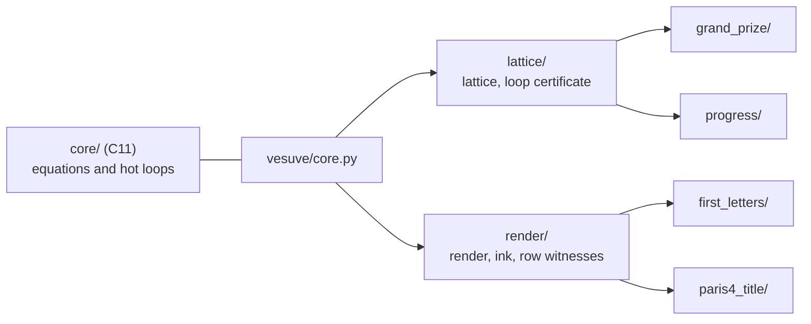

# vesuve

One program, one pipeline per Vesuvius Challenge prize. It runs what the LplVesuvius research validated,
shows every equation it applies, and says at which stage each pipeline stops and why.

The Grand Prize comes down to one question: what can replace the person who corrects the transfer from one
winding to the next? Here is the answer this program runs. The lattice gives a step for every seam between
neighbouring chunks. The consensus of five neighbouring lines removes each line's own noise. And a loop
whose closure stays under half a sheet at every cut of its profile certifies that its two paths stayed on
the same winding (`docs/archive/244`, `246`).

## Two branches

- **`main`** is this program: what the research validated, ported, tested and released.
- **`experimental`** is the laboratory it comes from. It is a series of dated slices, numbered up to 294
  so far, each one a measurement with its figure, the failed ideas included. Every path of the form
  `docs/…` or `src/…` cited on this page lives on that branch. A piece moves to `main` through a pull
  request, once there is a published number to test it against.

## Start in five minutes

```bash
make                                          # the C core, with its symbols (make test runs it under sanitizers)
uv run vesuve demo                            # Grand Prize and Progress, on the embedded segment
uv run vesuve demo --data path/to/data        # all four prizes, given the local inputs the demo names
uv run vesuve read outputs/demo/grand-prize
```

With Docker, the image builds and tests the C core before it installs anything:

```bash
docker build -t vesuve .
docker run --rm --user "$(id -u):$(id -g)" -v "$PWD/outputs:/outputs" vesuve
```

Options, defaults and exit codes are in `vesuve --help` and `vesuve <prize> --help`, so this page does not
repeat them. Each run writes `report.json` into its output folder, plus a `report.md` rendered from it.

## What each pipeline produces today

Measured on real data. The reports are in [`examples/`](examples/README.md).

| prize | command | what it writes | where it stops, and why |
|---|---|---|---|
| **Grand Prize** | `vesuve grand-prize` | a per-chunk certificate mask, the certified surface as tifxyz with `approval.tif`, the published ink map under the mask | one published segment: 6333 of 97771 chunks certified. To judge the rest it still has to read 111 bands (24263 chunks, about 21 min at 16 threads). There is no `column_NN.tifxyz` because columns need legible ink |
| **Progress** | `vesuve progress` | where a published segment changes winding | column 260, rows 26 to 223, crossing half a sheet at cuts 163, 173 and 203. It cannot tell a misread column from material that really diverges |
| **First Letters** | `vesuve first-letters` | a 4 cm² window chosen on papyrus alone, the fibre render, a view without the model, the model's ink, row witnesses, a 1 cm scale bar | on PHerc1447 the 2023 model shows no periodic rows at any angle (`R1-F20`), so it claims no letters |
| **Paris 4 title** | `vesuve paris4-title` | the last written column of the innermost band, and the region after it where an end-title would sit | on the well-registered revision it finds a short last column whose lines fill the top fifth. Nobody has read the crops yet |

## How it is built



- **The C core** has one function per equation (the half sheet, `n_max = (δ/σ)²`, the noise triangle, the
  convergence test, the Fresnel number, the AUC) and the loops where the time goes: the texture filter, the
  border profiles as exact sums, the cross-correlation step, trilinear sampling. It depends on libc and libm
  only, and compiles with `-Wall -Wextra -Wpedantic -Wconversion -Werror`.
- **Each prize has its own package.** Anything two prizes share lives in `lattice/` or `render/`. A prize
  never imports another one, and `tests/test_architecture.py` fails if it does.
- **The formulary is a module.** [`FORMULARY.md`](FORMULARY.md) is rendered from it
  (`vesuve formulas --markdown`), and a test fails when the page is stale.

## What is checked, and against what

Each ported piece is compared with the function that produced the published numbers on the `experimental`
branch. The tests live in `tests/`, and `.github/workflows/tests.yml` runs them twice on every pull
request, with warnings treated as errors.

- The C kernels are checked on thousands of random inputs: the step of a cut, the seam step, the border
  profiles bit for bit, the texture filter on layers bunched around its 0.15 floor, the Fresnel number of 59
  published scans bit for bit, the AUC with ties.
- A published band is read again over the network. Every step, cross step and refusal count comes out
  identical, 20 times faster than the research reader (19 chunks/s against 1.03 s per chunk).
- The hand-free procedure is replayed from 112 published bands. It gives back the published journal entry
  by entry, the same 111 requests and 6333 covered chunks, then twelve fabricated footprints, round after
  round.
- The row test and the TimeSformer sweep are checked against their producers.

Every test was probed by breaking the rule it guards, and each one turned red.

## What it refuses to do

- **Read text.** It claims no letter, no title, no word. It says where to look and what its witnesses are
  worth.
- **Unroll a scroll or generate a surface.** The segment, its surface volume and every ink map it reads
  were made by the Vesuvius Challenge team. What it adds is a verdict on them: which chunks stayed on one
  winding, where a published segment changed winding, where to look for a title. It answers the Grand Prize
  question from the side that checks the transfer from one winding to the next, and does not make that
  transfer.
- **Pick a window where the ink looks strong.** Windows are chosen on papyrus coverage alone.
- **Turn a failure into a zero.** A stage it cannot decide says why, a network failure is never reported as
  an absence, and a missing file is named.

## Where things live

| path | what it holds |
|---|---|
| `core/` | the C core: `include/vesuve.h`, `src/`, `tests/` |
| `vesuve/` | the Python package: shared services, then one package per prize |
| `vesuve/research.py` | the one place where the research's French keys become this program's names |
| `vesuve/data/` | what the pipelines need from the research tree, extracted by `tools/extract_from_research.py` |
| `tests/` | the tests. Parity tests run against a working copy of `experimental` (`VESUVE_RESEARCH`), heavy data (`VESUVE_DATA`) and the network (`VESUVE_NETWORK=1`), and are skipped with the reason when those are missing |
| `examples/` | a dated run of the four pipelines, reports and previews |
| `CONTRIBUTING.md` | how a change goes in: issue, branch, pull request, changelog, version |
