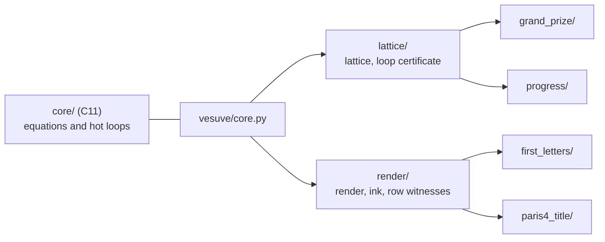

# vesuve

One program, one pipeline per Vesuvius Challenge prize. It runs what the LplVesuvius research validated,
shows every equation it applies, and says at which stage each pipeline stops and why.

The Grand Prize comes down to one question: what can replace the person who corrects the transfer from one
winding to the next? Here is the answer this program runs. The lattice gives a step for every seam between
neighbouring chunks. The consensus of five neighbouring lines removes each line's own noise. And a loop
whose closure stays under half a sheet at every cut of its profile certifies that its two paths stayed on
the same winding (`docs/archive/244`, `246`).

Since 0.2.0 it also corrects that transfer where it goes wrong, still without a hand. It walks the sheet on the
reference and on the produced winding, anchors their difference on the neighbouring blocks, and brings a point back
by one winding when a slip explains its departure better than the noise does. On the one segment where this was
validated, that turns 163 misses into right points for 41 right points turned into misses (`docs/archive/275`). On a
band where it was not, it says so and writes nothing.

The transfer it corrects is computed here, from the samples of the published surface prediction `m7` (embedded, or read
again with `--read-prediction`): along the normal of each point of
the segment's mesh, one cell in eight, the first sheet after the segment's own, then a vote of the neighbours
(`docs/archive/247`). That gives a depth at each of those points, not a whole winding surface. On the segment, where the
rules were written, it lands on the right winding for 0.9214 of the 39865 points that have a judge (of the 62815 points of the one-in-eight grid), where a
fixed step lands for 0.7613; on the central slice of a band where they were not, 0.915 against 0.8208
(`docs/archive/247`, `R4-F413`). It gives back the transfer the research saved, point for point.

## Two branches

- **`main`** is this program: what the research validated, ported, tested and released.
- **`experimental`** is the laboratory it comes from. It is a series of dated slices, numbered up to 295
  so far, each one a measurement with its figure, the failed ideas included. Every path of the form
  `docs/…` or `src/…` cited on this page lives on that branch. A piece moves to `main` through a pull
  request, once there is a published number to test it against.

## Start in five minutes

```bash
make                                          # the C core, with its symbols (make test runs it under sanitizers)
uv run vesuve demo                            # Grand Prize and Progress, on the embedded segment
uv run vesuve demo --data path/to/data        # all four prizes, given the local inputs the demo names
uv run vesuve read outputs/demo/grand-prize
```

With Docker, the image builds and tests the C core before it installs anything:

```bash
docker build -t vesuve .
docker run --rm --user "$(id -u):$(id -g)" -v "$PWD/outputs:/outputs" vesuve
```

The `render` target puts the same program on top of ScrollPrize/villa's published image, which carries
`vc_render_tifxyz`, so that `grand-prize --render` runs in a container (the image weighs 12 GB):

```bash
docker build --target render -t vesuve:render .
docker run --rm --user "$(id -u):$(id -g)" -v "$PWD/outputs:/outputs" -v "$PWD/cache:/cache" vesuve:render
```

Options, defaults and exit codes are in `vesuve --help` and `vesuve <prize> --help`, so this page does not
repeat them. Each run writes `report.json` into its output folder, plus a `report.md` rendered from it.

## What each pipeline produces today

Measured on real data. The reports are in [`examples/`](examples/README.md).

| prize | command | what it writes | where it stops, and why |
|---|---|---|---|
| **Grand Prize** | `vesuve grand-prize` | a per-chunk certificate mask, the certified surface as tifxyz with `approval.tif`, the published ink map under the mask, and the transfer to the next winding corrected without a hand (`corrected_transfer.npy`, `correction.json`) | one published segment: 6333 of 97771 chunks certified. To judge the rest it still has to read 111 bands (24263 chunks, about 21 min at 16 threads). The correction gains 122 points net on 340 blocks (sign test p = 2.04e-18). By default it replays the step tables the research rendered; `--render` makes them here, which needs `vc_render_tifxyz` and about 320 GB read from the raw scan. Over the whole segment it made the same 680 tables and the same corrected transfer, byte for byte, in 5 h on three cores ([`examples/grand-prize-render/`](examples/grand-prize-render/report.md)). There is no `column_NN.tifxyz` because columns need legible ink. Stage TJ says where the segment passes over the winding it produced (a median of 0.0222 of a block) and, given ink readings, judges the text there; it claims nothing elsewhere |
| **Progress** | `vesuve progress` | where a published segment changes winding | column 260, rows 26 to 223, crossing half a sheet at cuts 163, 173 and 203. It cannot tell a misread column from material that really diverges |
| **First Letters** | `vesuve first-letters` | a 4 cm² window chosen on papyrus alone, the fibre render, a view without the model, the model's ink, row witnesses, a 1 cm scale bar | on PHerc1447 the 2023 model shows no periodic rows at any angle (`R1-F20`), so it claims no letters |
| **Paris 4 title** | `vesuve paris4-title` | the last written column of the innermost band, and the region after it where an end-title would sit | on the well-registered revision it finds a short last column whose lines fill the top fifth. Nobody has read the crops yet |

## How it is built



- **The C core** has one function per equation (the half sheet, `n_max = (δ/σ)²`, the noise triangle, the
  convergence test, the Fresnel number, the AUC) and the loops where the time goes: the texture filter, the
  border profiles as exact sums, the cross-correlation step, trilinear sampling. It depends on libc and libm
  only, and compiles with `-Wall -Wextra -Wpedantic -Wconversion -Werror`.
- **Each prize has its own package.** Anything two prizes share lives in `lattice/` or `render/`. A prize
  never imports another one, and `tests/test_architecture.py` fails if it does.
- **The formulary is a module.** [`FORMULARY.md`](FORMULARY.md) is rendered from it
  (`vesuve formulas --markdown`), and a test fails when the page is stale.

## What is checked, and against what

Each ported piece is compared with the function that produced the published numbers on the `experimental`
branch. The tests live in `tests/`, and `.github/workflows/tests.yml` runs them twice on every pull
request, with warnings treated as errors.

- The C kernels are checked on thousands of random inputs: the step of a cut, the seam step, the border
  profiles bit for bit, the texture filter on layers bunched around its 0.15 floor, the Fresnel number of 59
  published scans bit for bit, the AUC with ties.
- A published band is read again over the network. Every step, cross step and refusal count comes out
  identical, 20 times faster than the research reader (19 chunks/s against 1.03 s per chunk).
- The hand-free procedure is replayed from 112 published bands. It gives back the published journal entry
  by entry, the same 111 requests and 6333 covered chunks, then twelve fabricated footprints, round after
  round.
- The transfer to the next winding is computed from the embedded samples of the prediction. It gives back the
  transfers the research saved on the segment and on the band, point for point within a millionth of a voxel, and
  the shares on the right winding `247` published, over the 39865 points that have a judge (0.9214 with the vote, 0.9119 without, 0.7613 for a fixed step).
  `--read-prediction` reads the samples again from the public prediction. That this reading gives back the embedded
  samples is checked, with `VESUVE_NETWORK=1`, on 100 rays spread over the segment that each see a sheet, not on every
  ray; the whole reading has not been compared with the embedded samples.
- The judge of the text of the produced winding (`296`) measures, from the two embedded meshes, where the segment
  passes over the winding produced from it: the six blocks it would read, and their near shares (0.7511 down to
  0.6476), are the research's, and so is the median of the 340 blocks, 0.0222. Given the research's readings of the ink
  it gives back 0.8331 against 0.1166 and 0.1037 on the same six blocks, after a calibration at 0.9593 (`R4-F477`;
  `tests/test_ink_judge.py`, with `VESUVE_RESEARCH` and `VESUVE_DATA`). It does not read the ink with
  `scrollprize/ink_canonical_2um` itself (1.55 GB, torch): `--ink-readings DIR` takes the readings, and without them
  the stage gives the coverage and says that no text is judged.
- The chain of windings grown from the prediction `m7` (`vesuve/chain/`: the criterion that needs no referent, the
  regrowth by one mesh, the chain) is replayed on PHercParis4, seeds 1 to 8, both sides, eight jumps: it gives back the
  chain the research published jump by jump (where each surface comes from, its points, whether the criterion holds
  it), the strict reading against the published windings finds 27 of the 28 judged jumps right on seeds 4 to 8
  (`R4-F551`), and on seeds 4 and 7 its surfaces are the research's, point for point (`tests/test_chain_validation.py`,
  with `VESUVE_RESEARCH`, `VESUVE_DATA` and `VESUVE_HEAVY=1`, about five minutes). It is a library: no pipeline stage or
  command runs it yet. Where its criterion was not validated is in its report (`vesuve/chain/report.py`): PHercParis4
  seeds 1 to 3, where the published windings overlap and it holds 17 of 21 wrong jumps (`R4-F538`), and PHerc0358,
  where nothing but the criterion judges the chain (`R4-F552`).
- The correction of the transfer is replayed from the embedded step tables. It gives back what `275` and `281`
  published block by block (340 and 84 blocks), and the corrected transfer it writes corrects the same points as
  the one the research saved, to within a millionth of a voxel. The judges only score: replaced by noise, they change the counts and not one corrected point.
- What `--render` makes is compared with what the research made, on the research's own files
  (`tools/check_against_research.py`): the two surfaces are identical to the research's meshes, the step tables of
  block `(16, 256)` are identical seam for seam on both surfaces, and a pile rendered here from a fresh mirror is
  identical to the research's, voxel for voxel (457 179 136 voxels).
- The row test and the TimeSformer sweep are checked against their producers.

Every test was probed by breaking the rule it guards, and each one turned red.

## What it refuses to do

- **Read text.** It claims no letter, no title, no word. It says where to look and what its witnesses are
  worth.
- **Unroll a scroll or generate a surface.** The segment, its surface volume and every ink map it reads
  were made by the Vesuvius Challenge team, and the transfer to the next winding follows their surface
  prediction. What it adds is a verdict on them: which chunks stayed on one winding, where a published segment
  changed winding, which points of the transfer slipped by one winding and where they belong, where to look for
  a title.
- **Claim a correction outside the conditions it was validated under.** A block is corrected only when it has
  neighbours along both axes: with east-west neighbours alone, the research measured the gain to vanish. That
  condition is necessary and not sufficient. On a taller slice of the same band, blocks with neighbours on all four
  sides still gain nothing that chance does not explain (`docs/archive/295`). The correction is validated on one
  segment, and the program does not pretend otherwise.
- **Pick a window where the ink looks strong.** Windows are chosen on papyrus coverage alone.
- **Turn a failure into a zero.** A stage it cannot decide says why, a network failure is never reported as
  an absence, and a missing file is named.

## Where things live

| path | what it holds |
|---|---|
| `core/` | the C core: `include/vesuve.h`, `src/`, `tests/` |
| `vesuve/` | the Python package: shared services, then one package per prize |
| `vesuve/research.py` | the one place where the research's French keys become this program's names |
| `vesuve/data/` | what the pipelines need from the research tree, extracted by `tools/extract_from_research.py` |
| `vesuve/transfer/` | the transfer to the next winding, computed from the prediction, and its hand-free correction |
| `tests/` | the tests. Parity tests run against a working copy of `experimental` (`VESUVE_RESEARCH`), heavy data (`VESUVE_DATA`) and the network (`VESUVE_NETWORK=1`), and are skipped with the reason when those are missing |
| `examples/` | a dated run of the four pipelines, reports and previews |
| `CONTRIBUTING.md` | how a change goes in: issue, branch, pull request, changelog, version |
| `SUBMISSION.md` | the Progress Prize submission: what was done, on which data, and the evidence |
