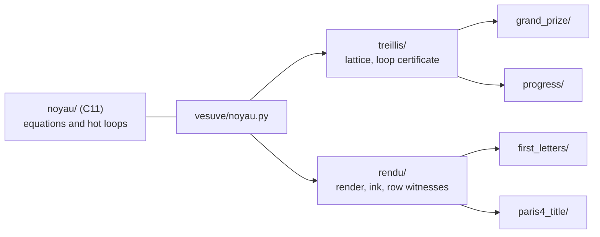

# vesuve — one program, one pipeline per Vesuvius Challenge prize

**What LplVesuvius validated, executed prize by prize, with every equation shown and the exact stage
where each pipeline stops.**

The Grand Prize asks one question: *what replaces the human who corrects the transfer from one winding
to the next?* The answer this program executes: the lattice gives a step for every seam between
neighbouring chunks, the consensus of five neighbouring lines removes each line's own noise, and **a loop
that closes under half a sheet at every cut of its profile certifies that its two paths did not change
winding** (`docs/archive/244`, `246`).

## Two branches

- **`main`** is this program: what the research validated, ported, tested and released.
- **`experimental`** is the laboratory it comes from: 246 dated slices, each one a measurement with
  its figure, including every idea that failed. Every path of the form `docs/…` or `src/…` cited here refers
  to that branch. A piece reaches `main` by a pull request, once it has a published number to be tested
  against.

## Start in five minutes

```bash
make                                   # the C core, with its symbols (make test: under sanitizers)
uv run vesuve demo                     # Grand Prize and Progress, on the embedded segment
uv run vesuve demo --donnees path/to/data   # all four prizes, given the local inputs the demo names
uv run vesuve lire sorties/demo/grand-prize
```

Or with Docker, which builds and tests the C core before installing anything:

```bash
docker build -t vesuve .
docker run --rm --user "$(id -u):$(id -g)" -v "$PWD/sorties:/sorties" vesuve
```

Every option, default and exit code is in `vesuve --help` and `vesuve <prize> --help`; this page lists none of
them. Each run writes `rapport.json` and a derived `rapport.md` into its output directory.

## What each pipeline produces today

Measured on real data; the reports are in [`exemples/`](exemples/README.md).

| prize | command | what it outputs | where it stops, and why |
|---|---|---|---|
| **Grand Prize** | `vesuve grand-prize` | per-chunk certificate mask, the certified surface as tifxyz with `approval.tif`, the published ink map under the mask | one published segment: 6333 of 97771 chunks certified; 111 bands (24263 chunks, about 21 min at 16 threads) are still to read to judge the rest; no `column_NN.tifxyz`, because columns need legible ink |
| **Progress** | `vesuve progress` | where a published segment changes winding | names column 260, rows 26 to 223, crossing half a sheet at cuts 163, 173 and 203; cannot tell a misread column from diverging material |
| **First Letters** | `vesuve first-letters` | a 4 cm² window chosen on papyrus alone, fibre render, model-free view, model ink, row witnesses, 1 cm scale bar | on PHerc1447 the 2023 model shows no periodic rows at any angle, as measured (`R1-F20`): no letters are claimed |
| **Paris 4 title** | `vesuve paris4-title` | the last written column of the innermost band and the region after it, where an end-title would be | finds a short last column (its lines fill the top fifth) on the well-registered revision; nobody has read the crops yet |

## How it is built



- **The C core** holds one function per equation (the half sheet, `n_max = (δ/σ)²`, the noise triangle, the
  convergence test, the Fresnel number, the AUC) and the loops where time goes (the texture filter, border
  profiles as exact sums, the cross-correlation step, trilinear sampling). No dependency beyond libc and libm,
  compiled with `-Wall -Wextra -Wpedantic -Wconversion -Werror`.
- **One package per prize**; what two prizes share lives in `treillis/` or `rendu/`. A prize never imports
  another prize, and `tests/test_architecture.py` fails if one does.
- **The formulary** is a module, [`FORMULAIRE.md`](FORMULAIRE.md) is rendered from it
  (`vesuve formules --markdown`), and a test fails when it is stale.

## What is verified, and against what

Every ported piece is compared with **the very function that produced the published numbers** on the
`experimental` branch (`tests/`, run twice on every pull request by `.github/workflows/tests.yml`, warnings as errors):

- the C kernels, on thousands of random inputs: the step of a cut, the seam step, the border profiles bit for
  bit, the texture filter on layers crowded around its 0.15 floor, the Fresnel number of 59 published scans
  bit for bit, the AUC with ties;
- a published band re-read over the network: every step, cross step and refusal count identical, 20 times
  faster than the research reader (19 chunks/s against 1.03 s per chunk);
- the hand-free procedure replayed from 112 published bands: the published journal entry by entry, the same
  111 demands and 6333 covered chunks, then twelve fabricated footprints round after round;
- the row test and the TimeSformer sweep against their producers.

Each test was probed by breaking the rule it guards, and turned red.

## What it refuses to do

- **It does not read text.** No letter, no title, no word is claimed; the program says where to look and what
  its witnesses are worth.
- **It does not unroll a scroll, and it generates no surface.** The segment, its surface volume and every ink
  map it reads were produced by the Vesuvius Challenge team. What it adds is a verdict on them: which chunks
  stayed on one winding, where a published segment changed winding, where to look for a title. The Grand
  Prize question is answered on the *checking* side of the transfer from one winding to the next, not on the
  side that makes it.
- **It does not choose a window where the ink looks strong.** Windows are chosen on papyrus coverage alone.
- **It does not turn a failure into a zero.** An undecidable stage says why, a network failure is never an
  absence, and a missing file is named.

## Where things live

| path | what it holds |
|---|---|
| `noyau/` | the C core: `include/vesuve.h`, `src/`, `tests/` |
| `vesuve/` | the Python package: shared services, then one package per prize |
| `vesuve/donnees/` | what the pipelines need from the research tree, extracted by `outils/extraire_du_depot.py` |
| `tests/` | the tests; parity tests run against a working copy of `experimental` (`VESUVE_RECHERCHE`), heavy data (`VESUVE_DONNEES`) and the network (`VESUVE_RESEAU=1`), and are skipped with the reason otherwise |
| `exemples/` | a dated run of the four pipelines, reports and previews |
| `CONTRIBUTING.md` | how a change flows: issue, branch, pull request, changelog, version |
