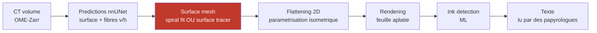

# LplVesuvius

Espace de travail pour le **Vesuvius Challenge** (<https://scrollprize.org>), vu depuis
le projet Laplace : les papyrus d'Herculanum carbonisés en 79 sont un corpus qui
n'existe pas encore sous forme numérique, et le débloquer agrandit directement ce
que `LplKnowledge` peut ingérer.

> **Position dans la chaîne Laplace.** Le déroulage produit du *texte grec ancien
> avec une provenance* : rouleau, position dans la spire, campagne de scan. C'est
> exactement la matière que `harvest::Tei` sait déjà lire et que `corpus::Locus`
> sait déjà adresser — donc le raccordement en aval est un lecteur de plus, pas une
> architecture de plus. Ce dépôt s'arrête au texte ; l'ingestion reste chez
> LplKnowledge.

---

## Ce que le concours a résolu, et ce qui reste

La chaîne complète va du volume tomographique au texte lisible :



**L'étage rouge est le seul qui bloque encore.** L'encre est résolue (Grand Prize
2023), la lecture est faite par des experts humains qui n'attendent que les images.
Ce qui coûte, c'est d'isoler la **2-variété** — la feuille de papyrus — dans un
volume où les spires se touchent, se compriment et se déchirent.

Deux familles s'y affrontent aujourd'hui :

| approche | sens | intervention humaine | faiblesse |
|---|---|---|---|
| **Spiral fitting** | descendante, globale | quasi nulle | suppose une spirale ; encaisse mal les déchirures |
| **Surface tracer** | ascendante, locale | **~4 h par soumission** | dérive, et surtout *sheet switching* |

Le **sheet switching** est le mode de panne dominant : la surface ajustée saute
d'une spire à la suivante, et le résultat reste une surface parfaitement plausible
— continue, lisse, sans rien qui signale l'erreur. C'est le motif que ce projet
connaît par cœur : *une sortie fausse qui ressemble exactement à une sortie juste*.
Toute automatisation qui ne mesure pas la cohérence de l'enroulement sera verte
pour une mauvaise raison.

### Les sept problèmes ouverts (2026)

1. **Régions comprimées** — le papyrus tassé diffuse le faisceau ; dégât fait au scan.
2. **Topologie de surface** — garder la connectivité correcte en zone dense/courbe.
3. **Connectivité de maillage** — détecter et réparer trous, fusions, sauts de spire *sans inspection humaine*.
4. **Qualité des étiquettes** — le modèle apprend une représentation imparfaite du trait physique. **Nommé comme un des goulots principaux.**
5. **Traçage de fibres** — suivre une fibre sur une longue distance donne de la connectivité.
6. **Généralisation inter-rouleaux** de la détection d'encre.
7. **Optimisation du spiral fit** — métriques d'évaluation, fonctions de coût, contraintes de *winding number* automatiques.

Les problèmes **2, 3 et 7** sont ceux où nos compétences tombent le plus juste :
ce sont des questions de géométrie déterministe et de vérification, pas de
puissance de modèle.

---

## Arborescence

```
LplVesuvius/
├── site/     miroir local de scrollprize.org (wget, robots.txt respecte)
├── repos/    depots clones (voir tools/repos.tsv)
├── data/     donnees telechargees (VIDE par defaut, cf. plus bas)
├── docs/     notes, logs de recuperation
└── tools/    manifeste + scripts de recuperation
```

## Reproduire l'environnement

```bash
./tools/clone_repos.sh      # tous les depots
./tools/clone_repos.sh 1    # seulement le coeur + deroulage/segmentation
```

Le manifeste `tools/repos.tsv` classe les dépôts par *tier* : `0` officiel,
`1` déroulage/segmentation (notre cible), `2` encre, `3` outillage.

## Les données

Deux hôtes, **aucune inscription requise**, licence **CC-BY-NC 4.0** :

- `s3://vesuvius-challenge-open-data/` — miroir web
  <https://vesuvius-challenge-open-data.s3.us-east-1.amazonaws.com/index.html>
- <https://dl.ash2txt.org/> — jeux de données curés

Disposition par échantillon : `{SAMPLE_ID}/{volumes,segments,representations}/`.
Formats : volumes en **OME-Zarr** (ou piles TIFF), géométrie en **OBJ** ou
**TIFXYZ**, métadonnées JSON.

> ⚠ **`data/` est vide et gitignoré, délibérément.** Les ordres de grandeur :
> la région *grand-prize-banner* seule pèse **77 Go** en Zarr et **390 Go** en pile
> TIFF, et le jeu `spiral-input` de Paris4 **49,6 Go**. On télécharge par fenêtre,
> pour une question précise — jamais « le corpus ». C'est la même discipline que le
> catalogue de LplKnowledge : indexer sans rapatrier.

Jeux curés utiles pour la segmentation automatique :

| jeu | contenu | où |
|---|---|---|
| `spiral-input` | patches de surface + annotations de spires (27 k vérifiés / 204 k non vérifiés sur Paris4) | `dl.ash2txt.org/datasets/spiral_datasets/PHercParis4/` |
| `surface-labels` | surfaces recto voxelisées + volume | HF `buckets/scrollprize/datasets` (branche `surfaces`) |
| `ink-labels` | masques d'encre alignés | HF, branche `ink` |

## Licence et citation

Les données sont **CC-BY-NC 4.0** : usage non commercial, attribution obligatoire.
Cette contrainte se propage à tout ce que le corpus Laplace en dérive — à traiter
comme un fait de provenance, pas comme une note de bas de page. C'est précisément
ce que `SourceV1` existe pour porter.

---

## Par ou commencer

| document | ce qu'il contient |
|---|---|
| **[`docs/00_etat_de_lart.md`](docs/00_etat_de_lart.md)** | **le point d'entree** : la chaine, les acteurs, ce qui est prouve, les prix |
| [`docs/01_goulot_deroulage.md`](docs/01_goulot_deroulage.md) | le goulot, les pistes, et pourquoi la premiere a ete abandonnee |
| [`docs/02_inventaire_mesure.md`](docs/02_inventaire_mesure.md) | ce qui existe et ce qu'on peut se permettre, chiffres mesures |
| [`docs/03_reproduction_windcheck.md`](docs/03_reproduction_windcheck.md) | l'etat de l'art **reproduit**, pas seulement lu |
| [`docs/04_experience_excision.md`](docs/04_experience_excision.md) | l'experience et son resultat : H0 non rejetee, 75 810 cellules |
| [`docs/05_le_predicat_est_trop_etroit.md`](docs/05_le_predicat_est_trop_etroit.md) | **le resultat qui ouvre la suite** : la reparation laisse le defaut en place |
| [`docs/06_mesures_a_faire.md`](docs/06_mesures_a_faire.md) | **le carnet de mesures** : faites, en attente, ecartees, avec les regles apprises |

## Rejouer

Tout ce qui est affirme dans `docs/` se regenere. Dans l'ordre :

```bash
./tools/mirror_site.sh              # miroir + controle de couverture (sort non nul si incomplet)
./tools/clone_repos.sh              # les 33 depots
./tools/s3_size.py PHerc0332/ --depth 1   # tailles S3, sans rien telecharger

cd repos/windcheck                  # l'etat de l'art, reproduit
uv sync && uv pip install awscli
clang++ -O3 -std=c++17 -pthread -o engines/selfcross engines/selfcross.cpp
uv run pytest -q
uv run python -m windcheck.fetch --sample PHerc0172
uv run python -m windcheck.fetch --sample PHerc0172 --skip-download --verify

cd ../../experiments                # notre mesure
uv sync
./run_measure.sh                    # echantillonne le CT aux cellules excisees
uv run python -m excision.analyse ../docs/excision_samples.tsv
```

⚠ Le client `aws` est requis par le recuperateur de `windcheck` et n'est pas dans
ses dependances declarees. Il est installe dans SON environnement plutot que
contourne par un telechargeur maison : un ecart de resultat deviendrait sinon
indistinguable d'un ecart de recuperation.

## Etat de la recuperation (2026-08-16)

| element | etat |
|---|---|
| Miroir du site | **81 / 81 pages** du sitemap, 228 Mo |
| Depots clones | **33**, 2,4 Go |
| Echec | `lukeboi/scroll-viewer` — 404, depot retire du public (le site le reference encore) |
| Total sur disque | 2,6 Go |

Note : `repos/villa/scrollprize.org/docs/` contient le **source markdown du site**
(34 fichiers). Pour lire, c'est superieur au miroir HTML ; le miroir sert a figer
un etat date et a travailler hors ligne.

Lire ensuite : [`docs/01_goulot_deroulage.md`](docs/01_goulot_deroulage.md).
