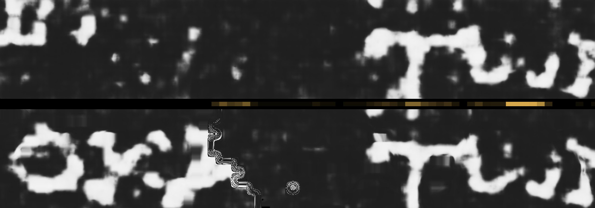

# Submission: September 2026 Progress Prizes

**vesuve 0.3.0** is one Docker image with one pipeline per prize, built on a
series of dated research slices, 402 so far. Its main result this month: on a published PHercParis4 segment, it
corrects the transfer from one winding to the next without a human. It takes the right decision four times as often
as the wrong one (163 against 41, sign test p = 2e-18), and the judges are used only to score. It also computes
everything that correction reads: the transfer itself, from the published surface prediction `m7`, within a millionth
of a voxel of the research's; and the step tables, from the published mesh and the raw scan, which give the
research's corrected transfer back byte for byte. And
where it can be checked, the winding it produces carries the right text: the ink read on it matches the ink the segment
itself carries at that place, 0.83 against 0.12 and 0.10 for two controls. On a band where the same procedure does
not hold, the program measures that and writes nothing.

Every number below links to the file that produces it. The research lives on the
[`experimental`](https://github.com/MasterLaplace/LplVesuvius/tree/experimental) branch, in French; this branch,
`main`, is the program, in English.

## The four questions of the form

### 1. Which scroll data

- **PHercParis4, segment `20230702185753`**: its surface volume
  (`2.4um-0.22m-78keV-volume-20260411134726.zarr`), read chunk by chunk from the public bucket; its published mesh;
  its published ink map; the next winding that the segment's own tracer drew by hand, used as the judge; and, for
  `--render`, the raw scan the segment was cut from (`volumes/20260411134726-2.400um-0.2m-78keV-masked.zarr`); and the
  published surface prediction `m7`, sampled along the normals of the mesh (embedded, or read again from the bucket
  with `--read-prediction`).
- **PHercParis4, band `20260623142658-w028-037`**: where the correction was measured not to hold.
- **PHerc1447, segment `20250702235910`**, for First Letters, and the innermost published PHercParis4 bands
  (`w010-027`) for the title search.

### 2. How it raises the odds of reading a scroll

The [Open Problems](https://scrollprize.org/2026_open_problems) page names sheet switches as a bottleneck and asks for
"conservative failure detection". Today a human finds where a surface jumped to the next winding and fixes it. This
program does two parts of that job without a human, on real data:

- **It certifies where a surface stayed on one winding.** Loops closed on the lattice of steps between neighbouring
  chunks certify 6333 of the 97771 chunks of the segment, with no hand in any decision, and it names the 111 bands
  (24263 chunks) it would still have to read to judge the rest
  ([`246`](https://github.com/MasterLaplace/LplVesuvius/blob/experimental/docs/archive/246_la_couverture_sans_main.md),
  fact `R4-F410`; replayed by `tests/test_embedded_data.py`).
- **It produces the next winding.** Along the normal of each point of the mesh, it takes the first sheet the published
  prediction `m7` marks after the surface's own, then lets the neighbours vote: 0.9214 of the points land on the right
  winding, against 0.7613 for a fixed step
  ([`247`](https://github.com/MasterLaplace/LplVesuvius/blob/experimental/docs/archive/247_le_transfert_retrouve_t_il_la_spire_voisine.md),
  fact `R4-F412`). The program gives back the research's transfer point for point, within a millionth of a voxel, on
  the segment and on the band, and the correction run on it gives back 163 for 41 (`tests/test_next_winding.py`).
- **It corrects the transfer to the next winding where a point slipped.** It walks the sheet on the reference and on
  the produced winding, anchors their difference on the neighbouring blocks, and brings a point back by one winding
  when a slip explains its departure better than the noise. On 340 blocks it corrects 495 points: 163 misses become
  right and 41 right points become misses, a net gain of 122
  ([`275`](https://github.com/MasterLaplace/LplVesuvius/blob/experimental/docs/archive/275_la_procedure_sans_juge_tient_elle_sur_le_segment_entier.md),
  fact `R4-F456`). The sign test gives p = 2.04e-18 on the points and 2.25e-05 on the blocks, 42 blocks up and 11
  down ([`290`](https://github.com/MasterLaplace/LplVesuvius/blob/experimental/docs/archive/290_les_gains_publies_se_distinguent_ils_du_hasard.md),
  fact `R4-F471`).

- **It checks the produced winding by the text it carries.** The segment makes more than one turn, so in places it
  passes over the very winding the transfer produces, one turn further along its own surface. There, the segment's
  published ink map says what text the produced winding must carry: a judge without a hand, which knows nothing of the
  transfer. We read the ink of the produced winding with the model that made the published map
  (`scrollprize/ink_canonical_2um`), on six blocks chosen from the meshes alone before any ink was read on them. Where
  the segment passes within half a sheet, our reading and the published map at the counterpart correlate at **0.83**,
  against **0.12** for the text of the starting winding and **0.10** for the counterpart shifted by a letter; each
  block alone lies between 0.68 and 0.92
  ([`296`](https://github.com/MasterLaplace/LplVesuvius/blob/experimental/docs/archive/296_le_tour_produit_porte_t_il_le_texte_du_segment.md), fact `R4-F477`).
  The reading is first calibrated on the traced winding: 0.96 against the published map. One jump further along the
  chain, the text still follows: 0.87, against 0.29 at best for three controls
  ([`297`](https://github.com/MasterLaplace/LplVesuvius/blob/experimental/docs/archive/297_le_texte_suit_il_la_chaine_au_dela_du_premier_saut.md),
  fact `R4-F478`); one more jump and it decides nothing, 0.45 against 0.40. This judge is research, not yet in the
  program.

  

  *Top: the ink read on the produced winding, over a 29.5 × 4.9 mm strip of row 176. Bottom: the published ink map where
  the segment passes over that winding. Between them, in amber, where the segment passes within half a sheet, the only
  place where the comparison judges anything. This strip was looked at before the slice was written, and the slice says
  so; the six blocks behind the 0.83 were not.*

The gain has to be read at its real size. Most transferred points were already right, so over the whole segment the
share on the right winding moves from 0.9303 to 0.9334. What matters is that the decision to move a point is taken
without a judge and is right far more often than wrong, which is the property a human corrector provides.

### 3. What it enables that was not possible before

- **A verdict on a published surface without ground truth.** Which chunks stayed on one winding, and where a
  published segment changed winding: `vesuve progress` names column 260, rows 26 to 223, where the loop's cumulative
  closure crosses half a sheet at cuts 163, 173 and 203 ([`examples/progress/report.md`](examples/progress/report.md),
  facts `R4-F401`, `R4-F406`).
- **A correction of the next winding that says where it holds.** The same procedure on the band `w028-037` gives 15
  misses made right for 25 rights made misses (p = 0.154,
  [`281`](https://github.com/MasterLaplace/LplVesuvius/blob/experimental/docs/archive/281_la_procedure_sans_juge_tient_elle_sur_la_bande.md)).
  Four more slices measured why. With neighbours to the east and west only, even the segment's gain falls from 122 to
  5 ([`291`](https://github.com/MasterLaplace/LplVesuvius/blob/experimental/docs/archive/291_la_procedure_tient_elle_sur_le_segment_avec_ses_seuls_voisins_est_et_ouest.md)),
  and the anchor carries the loss ([`292`](https://github.com/MasterLaplace/LplVesuvius/blob/experimental/docs/archive/292_lancre_est_ouest_suffit_elle_a_perdre_le_gain_du_segment.md)).
  Yet giving the band's blocks neighbours to the north and south does not bring its gain back: 7 for 5, p = 0.774
  ([`295`](https://github.com/MasterLaplace/LplVesuvius/blob/experimental/docs/archive/295_une_marche_dans_les_deux_directions_rend_elle_son_gain_a_la_bande.md)).
  The program therefore writes corrections only for blocks with neighbours along both axes, and its report says that
  this condition is necessary and not sufficient: the correction is validated on one segment.
- **Every equation in one place.** [`FORMULARY.md`](FORMULARY.md) is rendered from the code: each equation, the fact
  that carries it, and the research file that established it.

### 4. The evidence

- **The published numbers, replayed.** Each port is tested against the research function that produced the
  number. The correction gives back what `275` and `281` published, block by block, and the corrected transfer it
  writes corrects the same points as the one the research saved, to within a millionth of a voxel
  (`tests/test_correction.py`). The transfer it computes from the prediction is the one the research saved, and a rule
  broken on purpose loses the right winding (`tests/test_next_winding.py`).
- **The inputs, made again from public data.** `vesuve grand-prize --render` renders two piles per block through
  `vc_render_tifxyz`, from the published mesh and the raw scan, and reads the step tables from them. Over the whole
  segment (5 h 09 on three cores, 288 GB read) its 680 tables equal the research's seam for seam, 334 171 seams with
  none different, and the correction run on them writes a corrected transfer whose SHA-256 is the research's
  ([`examples/grand-prize-render/report.md`](examples/grand-prize-render/report.md)).
- **The judges never decide.** Replaced by noise, they change the counts and not one corrected point (same file).
- **Tests that can fail.** Rules were broken on purpose to check that their tests turn red. An anchor that keeps its
  own block, or a decision that favours the slip, makes four correction tests fail, the published counts and the
  saved bytes among them. On the research side, a figure's title check first passed against a frozen number, because
  the published gains happen to be 2 and 0; it was rewritten until the frozen title failed (`295` §5).
- **Negative results kept.** The band, the east-west anchor, the taller band: each is a dated slice with its
  measurement, its figure and its registry fact.
- **A run anyone can make.** `docker run` reproduces the Grand Prize and Progress reports from the embedded data,
  offline; the dated reports are in [`examples/`](examples/README.md).

## Checking it yourself

```bash
make test                                  # the C core under AddressSanitizer and UndefinedBehaviorSanitizer
uv run vesuve grand-prize --no-surface     # the certificate and the correction, about 20 s
uv run vesuve grand-prize --render --no-ink --no-surface --output outputs/render  # needs vc_render_tifxyz: about 5 h
uv run vesuve read outputs/grand-prize     # the stages, the requirements, where it stops
uv run vesuve formulas                     # every equation it applies
```

With the research next to it, the parity tests compare each port with its producer:

```bash
git worktree add ../research experimental
VESUVE_RESEARCH=../research uv run --extra tests pytest -q -rs
```

## What it does not do

- It does not unroll a scroll. It certifies and corrects surfaces others traced, on one segment of PHercParis4,
  which is not one of the thirteen scrolls of the 2027 Grand Prize.
- Its default Docker image does not render the step tables the correction reads; it replays the tables it embeds,
  which are the same ones. `--render` makes them, with `vc_render_tifxyz`, about 320 GB read from the raw scan and
  about 5 h. The image's `render` target carries villa's published renderer, which is older than the research's:
  on the last row its tables differ by at most 0.00065 voxel, and the correction decides every block alike.
- It does not read text. First Letters on PHerc1447 finds no periodic rows under the 2023 model (`R1-F20`), and the
  Paris 4 title search shows where an end-title would be, for a papyrologist to judge.

## A guide to the `experimental` branch

The research is a series of dated slices. Each asks one question and answers it with a measurement.

| where | what |
|---|---|
| `docs/archive/NNN_*.md` | one slice: the question, what was declared before measuring, the result, what it does not say |
| `docs/mesures/*.json` | the measurement of a slice, written by its script |
| `src/<family>/<slice>.py` | the script; `--verifier` runs its battery of checks, `--json` writes its measurement |
| `docs/images/NNN_*.png` | the figure, drawn from the measurement by `src/figures/` |
| `docs/rapports/REGISTRE_faits.tsv` | every fact (`R4-F456`...), its value, its status and the slice that carries it |
| `src/depot/verifier_chiffres.py` | checks that each number of a document is the one its measurement holds |

The slices of this submission: `244` and `246` for the certificate, `247` and `248` for the transfer and its judges,
`260` to `265` for the walk, the anchor and the decision, `275` for the whole segment, `281` and `291` to `295` for
where it does not hold, `290` for the sign test, `296` and `297` for the ink of the produced windings.
