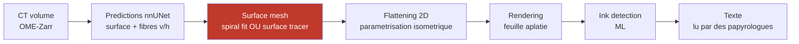

# LplVesuvius

> ⭐ **L'objectif est le DÉROULEMENT, pas la lecture.** Traduire n'est pas le métier de
> ce dépôt. Repérer quelques lettres sert à vérifier que le rouleau assemblé et déroulé
> fait du sens : l'encre est la **règle graduée**, pas l'ouvrage. *(cadrage de
> l'auteur, 2026-08-17 — voir `HANDOFF.md` §1bis)*


Espace de travail pour le **Vesuvius Challenge** (<https://scrollprize.org>), vu depuis
le projet Laplace : les papyrus d'Herculanum carbonisés en 79 sont un corpus qui
n'existe pas encore sous forme numérique, et le débloquer agrandit directement ce
que `LplKnowledge` peut ingérer.

> **Position dans la chaîne Laplace.** Le déroulage produit du *texte grec ancien
> avec une provenance* : rouleau, position dans la spire, campagne de scan. C'est
> exactement la matière que `harvest::Tei` sait déjà lire et que `corpus::Locus`
> sait déjà adresser — donc le raccordement en aval est un lecteur de plus, pas une
> architecture de plus. Ce dépôt s'arrête au texte ; l'ingestion reste chez
> LplKnowledge.

---

## ⭐⭐ Où en est le déroulement (2026-08-20)

**La chaîne complète tourne** — `trace → auto-intersection → aplatissement → rendu` — sur un
rouleau du Grand Prize que personne n'avait touché (`24`), et sur un segment officiel d'un
autre (`36`). Elle produit du papyrus : treillis de fibres croisées, trous, bords déchirés.


⚠⚠ **Mais nos propres traces ne suivent aucune feuille**, et c'est maintenant mesuré sans
seuil ni vérité terrain. En élargissant la fenêtre de rendu, la distance à la matière la plus
proche **reste identique** sur une bonne surface (α = +0,00) et **suit la fenêtre** sur les
nôtres (α = +1,01) — à quatre spires de portée, le pic n'a toujours rien trouvé
([`38`](docs/38_ce_qui_bouge_avec_la_fenetre.md)).

| ce qui marche | ce qui ne marche pas encore |
|---|---|
| dérouler, aplatir, rendre — de bout en bout | poser la surface **sur** une feuille **en partant d'une graine** — dix-sept essais, tous à α ≈ 1 ([`42`](docs/42_la_boucle_tourne_et_ne_suffit_pas.md)) |
| juger une trace sans vérité terrain (3 instruments) | l'encre : le modèle de 2023 sort une **constante** à 8,6 µm ([`36`](docs/36_lorigine_de_la_pile.md) §5bis) |
| ⭐⭐⭐ **savoir ce qui décide où la surface se pose** : la **portée physique** du test de sortie, à tenir entre **0,25 et 0,5 voxel** — le pas peut être affiné librement si `exit_count` suit ([`43`](docs/43_la_chaine_des_spires.md) §6quinquies) | distinguer À L'INTÉRIEUR du bassin : quatre campagnes y tiennent dans une largeur de résolution, donc il faudrait plus de deux fenêtres par verdict |
| ⭐⭐⭐ **enchaîner spire après spire** — 9 tours, **6 convergent** au pas de rayon 0,25 ([`43`](docs/43_la_chaine_des_spires.md)) | savoir POURQUOI une spire casse : l'érosion est **réfutée**, le meilleur prédicteur est le simple **numéro** de la spire ([`44`](docs/44_ou_la_chaine_se_trouve.md) §8) |
| ⭐⭐ **savoir où la chaîne est dans le rouleau** : écart entre nappes **113 µm**, donc elle avance bien d'**une feuille à la fois** ([`44`](docs/44_ou_la_chaine_se_trouve.md)) | enchaîner l'extension tangentielle : un seul pas est mesuré, et une chaîne demande que le pas suivant parte de l'étendue |
| ⭐⭐⭐ **ÉTENDRE une nappe le long d'elle-même** : la surface utile passe de **4,28 à 12,97 cm²** et l'arc de 21,9 à **37,2 mm**, à **α = +0,000** — la première fois qu'une surface que nous produisons **gagne** de la surface ([`44`](docs/44_ou_la_chaine_se_trouve.md)) | — |
| ⭐⭐ **rendre le traçage par croissance REPRODUCTIBLE** : `VC_GROWPATCH_RNG_SEED` + `thread_limit: 1` → maillages identiques octet pour octet ([`44`](docs/44_ou_la_chaine_se_trouve.md)) | savoir si la repousse d'une surface *projetée* dérive vraiment : son unique point est un tirage d'avant le correctif |
| ⭐⭐ **quantifier le « consistent with »** du papier fondateur : épaisseur de trait **AUC 0,857**, netteté du pic **0,753** suivent le contraste d'encre publié — et la **séparation des lignes va contre** (0,319) ([`45`](docs/45_consistent_with_quantifie.md)) | le transport vers une région **sans** vérité du même objet, qui est le geste que le papier revendique |
| ⭐⭐ **un contrôle négatif par construction** : une trace à α ≈ 1 prouve géométriquement qu'aucune feuille n'est à portée, et le détecteur y rend **la même carte** que sur une vraie feuille (ρ = +0,9979) ([`46`](docs/46_le_temoin_negatif.md)) | la thèse forte — qu'il *signale* de l'encre là où il n'y en a pas : sur ce rouleau il n'en signale nulle part |
| ⭐⭐ **savoir qu'un seuil absolu compare des réglages** : 13 traces sur 16 butent sur le plafond du rendu, qui double avec la profondeur ([`47`](docs/47_le_critere_doit_etre_relatif.md)) | construire le critère **auto-référentiel** qui remplacerait ce seuil — il faut des traces non censurées aux deux profondeurs, et le dépôt en a deux |
| ⭐⭐⭐ **α ≈ 1 a DEUX causes** — un pic qui recule, et aucun pic du tout — et l'audit des **217 profils** dit lesquelles : 20 séries sur 107, **0 verdict positif touché** ([`49`](docs/49_alpha_ne_separe_pas_deux_pannes.md)) | — |
| ⭐ **savoir où monter l'expérience « réparer sert-il ? »** : traçables et lisibles sont **disjoints** (13 contre 3), donc c'est `PHercParis4` ([`48`](docs/48_ou_monter_lexperience.md)) | la monter : il faut une trace fautive, sa réparation, et un aval qui **réponde** — la condition se vérifie en une inférence |
| ⭐⭐ **un rendu peut être limité par une ressource que personne ne mesure** : 28,2 Go de RSS sur 32, 3,4 Go en swap, **23,7 % d'un cœur sur 22** — le cache de chunks vaut 16 Go par défaut et aucun des 28 appels du dépôt ne le réglait ([`50`](docs/50_le_rendu_attendait_la_memoire.md)) | — |
| ⭐⭐⭐ **le plafond de générations ne fabriquait PAS le résultat négatif** : à budget ×3,3 l'aire est ×11,5 mais α passe de **+0,89 à +0,95**, sous le bruit du tireur (0,16) ([`50`](docs/50_le_rendu_attendait_la_memoire.md) §8) | ⚠ un seul tirage par budget : on ne peut pas AFFIRMER que le budget est sans effet, seulement qu'on ne le voit pas |
| ⭐⭐ **une pente à deux appuis** : vingt runs indépendants, graines séparées par des kilovoxels et deux prédictions, et l'appui du bas a une RAISON et non un simple constat ([`51`](docs/51_une_pente_a_deux_appuis.md)) | — |
| ⭐⭐ **un relief se lit sur une moyenne de patch, donc il dépend de la FENÊTRE** : notre trace lue à 1024 px paraissait plate et ne l'est pas — un seuil calibré sur un instrument ne veut rien dire sur un autre ([`52`](docs/52_calibrer_sur_son_corpus.md)) | ⚠ la conséquence porte au-delà : toute grandeur de contraste se compare **à l'intérieur** d'un instrument, jamais entre deux |
| ⭐⭐ **notre chaîne de rendu n'écrase pas le relief** : un morceau de segment PUBLIÉ, passé par elle, revient au-dessus de la médiane de son propre corpus ([`53`](docs/53_le_temoin_positif_du_rendu.md)) | ⭐ le critère avait été écrit **avant** la mesure, et l'ordre est visible dans l'historique du dépôt |
| ⭐⭐⭐ **le vide suit la GRAINE, pas la prédiction** — et `m7` et `ps256` sont au même endroit, donc ce ne sont pas deux qualités d'un objet mais deux objets ([`54`](docs/54_cinq_rendus_vides.md)) | ⚠⚠ à relire depuis [`60`](docs/60_la_constante_qui_rendait_le_modele_muet.md) : ces rendus sont des piles uint8, montrées au modèle 257 fois trop sombres |
| ⚠⚠⚠ **trente-neuf batteries sur cent cinq ne pouvaient pas ÉCHOUER** : le verdict imprimait « ALL PASS » et rendait 0 inconditionnellement, donc le compte d'échecs était tenu, imprimé et jeté ([`61`](docs/61_les_batteries_qui_ne_pouvaient_pas_echouer.md)) | ⭐ aucune ne cachait d'échec réel — le défaut n'avait pas encore coûté un faux vert. ⚠ Les batteries en **shell** restent à instruire |
| ⚠⚠⚠ **une CONSTANTE rendait le modèle muet, et elle a fondé un résultat négatif publié** : `load_layer_stack` normalisait par `65535`, juste pour du uint16, alors que **211 des 214 piles de l'arbre sont uint8** — elles arrivaient au modèle 257 fois trop sombres. `PHerc1447` passe de σ **0,0171** à **0,6558**, soit **1,2×** le témoin ([`60`](docs/60_la_constante_qui_rendait_le_modele_muet.md)) | ⚠⚠ M1ter est ROUVERT, `46` est à refaire, `54` est à relire. ⭐ Répondre n'est pas lire : la fenêtre suivante doit être assez large pour porter des lettres |
| ⭐⭐⭐ **la RÉSOLUTION n'explique pas l'inertie du modèle d'encre** : le témoin où il atteint AUC 0,925 est à **9 %** des conditions de `PHerc1447` sur les deux axes (506,2 contre 553,0 µm par tuile, 205,7 contre 224,6 µm de profondeur), et dix fois cet écart ne rend qu'un facteur **2,1** sur les **45** à expliquer ([`58`](docs/58_resolution_ou_rouleau.md)) | ⚠ le chiffre qui portait la question était faux — `36` §5bis disait 2,4 µm là où le volume déclare **7,91** |
| ⭐⭐ **qu'un corpus se range en TROIS états et pas deux** : sur 45 rouleaux, **31 n'ont aucun segment publié** — personne ne les a tentés. Ranger ceux-là avec « pas d'encre » fait rendre p = 0,0081 à un partage qui, restreint aux rouleaux **tentés**, rend **p = 0,50** ([`59`](docs/59_la_campagne_plutot_que_le_rouleau.md)) | ⚠⚠ la piste « la campagne de scan explique l'inertie » **ne tient pas** : le scan fin suit l'attention portée à un rouleau, pas sa lisibilité. « Ce rouleau-ci » reste la seule cause en lice |
| ⭐⭐ **et aucun des treize rouleaux du prix ne publie de détection d'encre** — dix des treize n'ont **aucun segment publié**, trois ont été tracés sans rendre d'encre ([`59`](docs/59_la_campagne_plutot_que_le_rouleau.md) §5) | — |

⚠ **Trois documents manquent à cette table, et c'est délibéré** : `55` est *rendu* depuis le
registre des murs, `56` est un plan, `57` répond à une question sur les tâches. Aucun ne
porte une affirmation sur le rouleau, donc les y ranger ferait passer une note de travail
pour un résultat.

⭐ **L'objectif est donc nommable** : pas « réduire l'écart », mais **faire converger la
mesure**. Une trace qui converge suit une feuille, quelle que soit sa valeur.

⭐⭐ **Et une cause candidate est apparue, lue dans la source du traceur**
([`41`](docs/41_marcher_le_long_dune_nappe.md) §6ter) : `vc_grow_seg_from_seed` est un
moindres carrés à **douze familles de résidus**, et dans nos runs de base **trois des quatre
termes qui regardent les données sont inactifs** — `SURFACE_SDT` a un poids nul par défaut,
`NORMAL`/`SNAP` exigent une grille de normales, `DIRECTION` des champs de direction. ⚠ Dire
qu'il ne reste alors *que* de la géométrie serait trop fort — un quatrième terme existe dont
je n'ai pas su suivre le fil (`41` §6ter) — mais **trois leviers de données sont bien
éteints chez nous**, et aucun de nos 17 essais ne règle `sdt_weight`.
⚠ Hypothèse, pas conclusion — `src/outils/leviers_de_perte.sh` la mesure, à conception appariée.

### ⭐⭐⭐ Et voici notre chaîne, six tours


Sept bandes : un segment officiel qui converge, puis **six spires que nous avons générées**
(`mode: gen_neighbor`), chacune source de la suivante. **4 sur 7 convergent**, la 7ᵉ casse
(α = +1,475), et la dégradation se **voit** — le treillis de fibres cède la place à des
plages grises lisses.

⭐⭐⭐ **Et un seul paramètre décide de tout — mais ce n'est pas celui qu'on croyait.** L'α
moyen suit la **portée physique** du test de sortie du rayon (`exit_count × pas`), pas la
finesse du pas : deux campagnes dont les pas diffèrent d'un facteur deux mais qui partagent la
portée 0,25 donnent le même α (+0,102 et +0,130), et **à pas égal, changer la seule portée
fait passer l'α de +0,327 à +0,130**. Le mécanisme est lu dans la source — `exit_count` compte
des *pas* et non une distance :


### ⭐⭐⭐ Et une nappe qui GRANDIT au lieu de s'éroder

Toute la chaîne radiale **perd** de la surface — 15,6 % d'aire utile par tour. Étendre une
nappe le long d'elle-même fait l'inverse, et sans quitter sa feuille :

| | aire utile | sommets valides | arc | α |
|---|---:|---:|---:|---:|
| segment officiel de départ | 4,28 cm² | 59 % | 21,9 mm | +0,000 |
| **après extension** | ⭐ **12,97 cm²** | ⭐ **96 %** | ⭐ **37,2 mm** | ⭐ **+0,000** |

Elle ne fait pas qu'ajouter de la grille : elle **rebouche ses trous** (59 → 96 % de sommets
valides), et son arc grandit de 70 % — c'est-à-dire qu'elle couvre plus d'un **tour**, la
grandeur qui bloquait le déroulement. Détail : [`44`](docs/44_ou_la_chaine_se_trouve.md).

⚠ Obtenu après avoir trouvé que `mode: resume` **n'était pas déterministe** (générateur
`thread_local` semé par `std::random_device`, 22 threads OpenMP). Avec
`VC_GROWPATCH_RNG_SEED` et `thread_limit: 1`, deux exécutions donnent des maillages
identiques **octet pour octet** — et le résultat tient.

Les neuf nappes de la campagne radiale optimale, rendues :


⚠ Ce que ces neuf bandes **sont** est maintenant mesuré, et ce n'est pas un morceau de rouleau
déroulé : c'est une **colonne** de neuf feuilles dans une même fenêtre angulaire, à 113 µm
l'une de l'autre, chacune couvrant **10 % d'un tour**. Il en faudrait au moins huit côte à côte
pour fermer un seul tour.


Détail : [`43`](docs/43_la_chaine_des_spires.md) et [`44`](docs/44_ou_la_chaine_se_trouve.md).

### Et voici la cible, assemblée


**44 spires consécutives d'un rouleau, sans un trou** ([`40`](docs/40_le_rouleau_entier.md)).
⚠ Chaque bande est déroulée et lue **par l'équipe du concours** ; ce dépôt n'ajoute que
l'ordre. C'est la référence contre laquelle mesurer une chaîne automatique — jusqu'ici,
« ça marche » n'avait rien à quoi se comparer.

---

## Ce que le concours a résolu, et ce qui reste

La chaîne complète va du volume tomographique au texte lisible :



**L'étage rouge est le seul qui bloque encore.** Ce qui coûte, c'est d'isoler la
**2-variété** — la feuille de papyrus — dans un volume où les spires se touchent, se
compriment et se déchirent.

> ⭐⭐ **Où en est le domaine, août 2026.** Un rouleau scellé a été **entièrement déroulé
> et lu** — PHerc. 1667, arXiv 2606.29085, juin 2026 : 31 spires, 1231 cm², 22 colonnes.
> Et l'équipe écrit un mois plus tard : *« **No method yet traces a complete, correct
> surface through a scroll automatically.** »*
>
> Le chiffre qui réconcilie les deux est enfoui dans « Statistics and reproducibility » :
> ***~25 heures d'annotation manuelle par spire***, soit **~775 h** pour ce rouleau. Le
> Grand Prize 2027 en tolère **huit**. Détail : [`docs/27`](docs/27_ce_que_la_litterature_dit.md).

⚠ **Et « l'encre est résolue » est faux**, contrairement à ce que ce paragraphe disait
avant le 2026-08-19 : *« Ink segmentation remains **weak**, varies across ink recipes and
local degradation states »* (même article). Ce qui est acquis, c'est qu'elle **marche
quand la géométrie est bonne** — ce qui renvoie au même étage rouge.

Deux familles s'y affrontent aujourd'hui :

| approche | sens | intervention humaine | faiblesse |
|---|---|---|---|
| **Spiral fitting** | descendante, globale | quasi nulle | suppose une spirale ; encaisse mal les déchirures |
| **Surface tracer** | ascendante, locale | **~4 h par soumission** | dérive, et surtout *sheet switching* |

Le **sheet switching** est le mode de panne dominant : la surface ajustée saute
d'une spire à la suivante, et le résultat reste une surface parfaitement plausible
— continue, lisse, sans rien qui signale l'erreur. C'est le motif que ce projet
connaît par cœur : *une sortie fausse qui ressemble exactement à une sortie juste*.
Toute automatisation qui ne mesure pas la cohérence de l'enroulement sera verte
pour une mauvaise raison.

### Les sept problèmes ouverts (2026)

1. **Régions comprimées** — le papyrus tassé diffuse le faisceau ; dégât fait au scan.
2. **Topologie de surface** — garder la connectivité correcte en zone dense/courbe.
3. **Connectivité de maillage** — détecter et réparer trous, fusions, sauts de spire *sans inspection humaine*.
4. **Qualité des étiquettes** — le modèle apprend une représentation imparfaite du trait physique. **Nommé comme un des goulots principaux.**
5. **Traçage de fibres** — suivre une fibre sur une longue distance donne de la connectivité.
6. **Généralisation inter-rouleaux** de la détection d'encre.
7. **Optimisation du spiral fit** — métriques d'évaluation, fonctions de coût, contraintes de *winding number* automatiques.

Les problèmes **2, 3 et 7** sont ceux où nos compétences tombent le plus juste :
ce sont des questions de géométrie déterministe et de vérification, pas de
puissance de modèle.

---

## Arborescence

> ⚠ Ce bloc décrit l'état APRÈS le repli du 2026-08-26 (trois dossiers). Il en annonçait
> quatre auparavant, dont un `tools/` qui n'existe plus.

```
LplVesuvius/
├── src/      tout ce que le dépôt lance, en familles (outils/, nappe/, encre/, …)
├── docs/     les documents, plus mesures/ journaux/ registres/ images/ article/
└── data/     tout ce qui se retélécharge : repos/, site/, volumes, rendus
             (VIDE par défaut, cf. plus bas ; sauf data/artefacts/, versionné)
```

## Reproduire l'environnement

```bash
./src/outils/clone_repos.sh      # tous les depots
./src/outils/clone_repos.sh 1    # seulement le coeur + deroulage/segmentation
```

Le manifeste `src/outils/repos.tsv` classe les dépôts par *tier* : `0` officiel,
`1` déroulage/segmentation (notre cible), `2` encre, `3` outillage.

## Les données

Deux hôtes, **aucune inscription requise**, licence **CC-BY-NC 4.0** :

- `s3://vesuvius-challenge-open-data/` — miroir web
  <https://vesuvius-challenge-open-data.s3.us-east-1.amazonaws.com/index.html>
- <https://dl.ash2txt.org/> — jeux de données curés

Disposition par échantillon : `{SAMPLE_ID}/{volumes,segments,representations}/`.
Formats : volumes en **OME-Zarr** (ou piles TIFF), géométrie en **OBJ** ou
**TIFXYZ**, métadonnées JSON.

> ⚠ **`data/` est vide et gitignoré, délibérément.** Les ordres de grandeur :
> la région *grand-prize-banner* seule pèse **77 Go** en Zarr et **390 Go** en pile
> TIFF, et le jeu `spiral-input` de Paris4 **49,6 Go**. On télécharge par fenêtre,
> pour une question précise — jamais « le corpus ». C'est la même discipline que le
> catalogue de LplKnowledge : indexer sans rapatrier.

Jeux curés utiles pour la segmentation automatique :

| jeu | contenu | où |
|---|---|---|
| `spiral-input` | patches de surface + annotations de spires (27 k vérifiés / 204 k non vérifiés sur Paris4) | `dl.ash2txt.org/datasets/spiral_datasets/PHercParis4/` |
| `surface-labels` | surfaces recto voxelisées + volume | HF `buckets/scrollprize/datasets` (branche `surfaces`) |
| `ink-labels` | masques d'encre alignés | HF, branche `ink` |

## Licence et citation

Les données sont **CC-BY-NC 4.0** : usage non commercial, attribution obligatoire.
Cette contrainte se propage à tout ce que le corpus Laplace en dérive — à traiter
comme un fait de provenance, pas comme une note de bas de page. C'est précisément
ce que `SourceV1` existe pour porter.

---

## Reprise de session

**[`HANDOFF.md`](HANDOFF.md)** — etat complet, processus en cours, pieges, et la suite
priorisee. A lire en premier si vous reprenez ce chantier.

## Par ou commencer

| document | ce qu'il contient |
|---|---|
| **[`docs/00_etat_de_lart.md`](docs/00_etat_de_lart.md)** | **le point d'entree** : la chaine, les acteurs, ce qui est prouve, les prix |
| [`docs/01_goulot_deroulage.md`](docs/01_goulot_deroulage.md) | le goulot, les pistes, et pourquoi la premiere a ete abandonnee |
| [`docs/02_inventaire_mesure.md`](docs/02_inventaire_mesure.md) | ce qui existe et ce qu'on peut se permettre, chiffres mesures |
| [`docs/03_reproduction_windcheck.md`](docs/03_reproduction_windcheck.md) | l'etat de l'art **reproduit**, pas seulement lu |
| [`docs/04_experience_excision.md`](docs/04_experience_excision.md) | l'experience et son resultat : H0 non rejetee, 75 810 cellules |
| [`docs/05_le_predicat_est_trop_etroit.md`](docs/05_le_predicat_est_trop_etroit.md) | **le resultat qui ouvre la suite** : la reparation laisse le defaut en place |
| [`docs/06_mesures_a_faire.md`](docs/06_mesures_a_faire.md) | **le carnet de mesures** : faites, en attente, ecartees, avec les regles apprises |
| [`docs/08_premiere_passe_complete.md`](docs/08_premiere_passe_complete.md) | ⭐ **la passe complete** : des couches aux lettres grecques, AUC 0,92 hors entrainement |
| [`docs/07_reparee_nest_pas_propre.md`](docs/07_reparee_nest_pas_propre.md) | ⭐ **le resultat** : une trace reparee passe le recensement sans etre saine — et §7 : la metrique est **inapplicable** sous un tour de couverture |
| [`docs/09_protocole_jugement_modele.md`](docs/09_protocole_jugement_modele.md) | juger un rendu par un modele de langue : 3 juges mecaniques en echec, 1 calibre qui marche |
| [`docs/10_segment_complet.md`](docs/10_segment_complet.md) | la passe sur un segment entier : **AUC 0,925** sur 44,7 M de pixels |
| [`docs/11_onde_radiale_et_fusions.md`](docs/11_onde_radiale_et_fusions.md) | ⭐ onde radiale, depliage polaire, fusions localisees en 3D, et le defaut qui **derive** |
| **[`docs/12_profondeur_de_surface.md`](docs/12_profondeur_de_surface.md)** | ⭐⭐ **un instrument de qualite de trace sans verite terrain, sans modele et sans juge** — lire le §10 en premier |
| **[`docs/13_batch_epuisement.md`](docs/13_batch_epuisement.md)** | la liste de ce qui reste ouvert, et elle se coche la |
| [`docs/14_direction_des_fibres.md`](docs/14_direction_des_fibres.md) | ⭐ probleme ouvert nº 5 : l'orientation des fibres comme separateur de feuilles |
| [`docs/15_soumission_progress_prize.md`](docs/15_soumission_progress_prize.md) | ce qui est soumissionnable, trie contre les criteres. ⚠ **se declare perime sur deux points** |
| [`docs/16_carte_difficulte_rouleaux_du_prix.md`](docs/16_carte_difficulte_rouleaux_du_prix.md) | quel rouleau du prix attaquer, mesure sur le volume brut |
| [`docs/17_saut_de_spire_par_la_phase.md`](docs/17_saut_de_spire_par_la_phase.md) | ❌ le saut de spire par la phase — **echec definitif**, et pourquoi |
| [`docs/18_batch_produire.md`](docs/18_batch_produire.md) · [`19`](docs/19_ecarter_avant_de_payer.md) · [`22`](docs/22_batch_repliquer.md) | trois batchs clos : produire, ecarter avant de payer, repliquer |
| [`docs/20_le_champ_de_correction.md`](docs/20_le_champ_de_correction.md) | ⭐ l'erreur d'une trace est **structuree**, et translater ne la repare pas |
| [`docs/21_texte_de_soumission.md`](docs/21_texte_de_soumission.md) | le brouillon de soumission, resultats negatifs compris |
| [`docs/23_rouleaux_du_prix_traces.md`](docs/23_rouleaux_du_prix_traces.md) | l'inventaire des 13 : **dix** n'ont aucun segment publie |
| **[`docs/24_premiere_trace_rouleau_du_prix.md`](docs/24_premiere_trace_rouleau_du_prix.md)** | ⭐⭐ **la premiere trace d'un rouleau du prix**, condamnee par nos instruments avant le rendu |
| **[`docs/25_une_graine_choisie_sur_la_planeite.md`](docs/25_une_graine_choisie_sur_la_planeite.md)** | ⭐⭐ **ou commencer une trace** — critere de planeite, replique sur 12 rouleaux |
| **[`docs/26_le_champ_de_direction.md`](docs/26_le_champ_de_direction.md)** | ⭐⭐ **ce qui gouverne la trajectoire du traceur**, et les trois mecanismes qui ne la gouvernent pas |
| **[`docs/27_ce_que_la_litterature_dit.md`](docs/27_ce_que_la_litterature_dit.md)** | ⭐⭐ **les trois articles primaires, lus en entier** — et [`32`](docs/32_educelab_le_papier_fondateur.md) pour le quatrieme |
| **[`docs/28_le_paysage_du_controle_qualite.md`](docs/28_le_paysage_du_controle_qualite.md)** | ⭐⭐ **ce qui existe deja**, ce qui a ete refuse, et la limite **mesuree** de la geometrie seule |
| **[`docs/29_ce_qui_reste.md`](docs/29_ce_qui_reste.md)** | ⭐ **le registre consolide** — 525 enonces replies, sources en `fichier:ligne`. Par ou choisir un lot |
| **[`docs/30_le_traceur_est_un_tirage.md`](docs/30_le_traceur_est_un_tirage.md)** | ⚠⚠ **13 traces propres sur 14** a parametres identiques — un seul trace n'est pas une mesure |
| **[`docs/31_roadmap.md`](docs/31_roadmap.md)** | ⭐⭐ **la roadmap** : le Grand Prize est un prix d'**algorithmique de geometrie**, et son critere d'acceptation est une image Docker qu'ils lancent |
| **[`docs/33_la_carte_nest_pas_resolue.md`](docs/33_la_carte_nest_pas_resolue.md)** | ⚠⚠ le classement des 13 rouleaux de [`16`](docs/16_carte_difficulte_rouleaux_du_prix.md) **ne separe aucune des 78 paires** — et ce qu'il faudrait pour trancher : 50 fenetres |
| **[`docs/34_un_verdict_qui_ne_mesure_rien.md`](docs/34_un_verdict_qui_ne_mesure_rien.md)** | ⚠⚠ `vc_tifxyz_selfcross` peut declarer une surface **propre en n'ayant teste aucune paire** — et la perte de sensibilite mesuree quand un maillage grossit |
| **[`docs/35_le_tirage_sur_douze_rouleaux.md`](docs/35_le_tirage_sur_douze_rouleaux.md)** | ⭐⭐ **78 tirages, 13 rouleaux, parametres identiques** : 5 rouleaux ou le VERDICT bascule, 0 reproductible, et l'aire ne signale pas le mauvais tirage |
| **[`docs/36_lorigine_de_la_pile.md`](docs/36_lorigine_de_la_pile.md)** | ⭐⭐ **une hypothese testee et REFUTEE** — et ce qu'elle a trouve a la place : « officiel » n'est pas synonyme de « bon », un rouleau publie des segments de 18 % a 68 % |
| **[`docs/37_les_deux_axes_ne_saccordent_pas.md`](docs/37_les_deux_axes_ne_saccordent_pas.md)** | ⭐⭐ **selectionner sur un axe et valider sur l'autre** : teste, et les deux juges ne se recoupent pas — 1 accord sur 8 |
| **[`docs/38_ce_qui_bouge_avec_la_fenetre.md`](docs/38_ce_qui_bouge_avec_la_fenetre.md)** | ⭐⭐⭐ **un test de trace sans seuil, sans verite terrain et sans echelle** — ne de trois hypotheses refutees : une bonne surface garde sa distance quand la fenetre s'elargit, la notre la suit (α = +0,00 contre +1,01) |
| **[`docs/39_le_seam_de_correction.md`](docs/39_le_seam_de_correction.md)** | ⭐⭐ **ou l'humain se branche** : `--resume --rewind-gen --correct` prend une liste de POINTS 3D. Le trou restant est etroit et nomme — dire ou la surface aurait du passer |
| **[`docs/40_le_rouleau_entier.md`](docs/40_le_rouleau_entier.md)** | ⭐⭐⭐ **la cible, en une image** : 44 spires consecutives d'un rouleau, sans un trou, assemblees depuis les cartes d'encre publiees. Le deroulement est le leur, l'ordre est le notre — et c'est la reference que notre chaine doit egaler |
| **[`docs/41_marcher_le_long_dune_nappe.md`](docs/41_marcher_le_long_dune_nappe.md)** | ⭐⭐⭐ **le maillon manquant de `39`, construit** : suivre une nappe par tenseur de structure + recentrage sur la crete, et ecrire les points de passage que `--correct` sait relire. Temoin negatif : « au plus proche » quitte sa spire de 5,9 voxels la ou la marche reste a 0,67 |
| **[`docs/42_la_boucle_tourne_et_ne_suffit_pas.md`](docs/42_la_boucle_tourne_et_ne_suffit_pas.md)** | ⭐⭐⭐ **la boucle de correction entiere, exercee pour la premiere fois** : le seam fonctionne, la trace change (0 → 11 753 croisements) et son α NE change pas (+0,98 → +1,03). 318 points contre 56 630 : un coup de pouce local, pas une reorientation |
| **[`docs/43_la_chaine_des_spires.md`](docs/43_la_chaine_des_spires.md)** | ⭐⭐⭐ **la chaine tient plusieurs tours, puis casse** : un segment officiel qui converge, puis jusqu'a huit spires generees par `mode: gen_neighbor`. Au pas de rayon 0,25, **6 sur 9 convergent** et la rupture tombe au tour 07 (α = +0,702 puis +1,321) au lieu du tour 06. Premiere fois qu'une surface que NOUS produisons converge — et la lecon de methode : **les premiers tours d'une chaine ne discriminent pas** |
| **[`docs/44_ou_la_chaine_se_trouve.md`](docs/44_ou_la_chaine_se_trouve.md)** | ⭐⭐ **ou la chaine est dans le rouleau**, mesure sans connaitre l'axe : ecart entre nappes **113 µm** (elle avance d'une feuille a la fois), erosion de l'aire UTILE **15,6 % par tour** (et non 4,0 %, qui portait sur la grille), chaque fenetre couvre **10 % d'un tour**. Deux resultats negatifs qui comptent : le **rayon** d'une nappe est refuse (deux estimateurs en desaccord d'un facteur deux) et l'hypothese « la rupture est une erosion » est **refutee** par le simple numero de spire |

## Rejouer

Tout ce qui est affirme dans `docs/` se regenere. Dans l'ordre :

```bash
./src/outils/temoins.sh                  # ⭐ TOUS les temoins hors ligne, en une commande
./src/outils/mirror_site.sh              # miroir + controle de couverture (sort non nul si incomplet)
./src/outils/clone_repos.sh              # les 33 depots
./src/outils/s3_size.py PHerc0332/ --depth 1   # tailles S3, sans rien telecharger

cd data/repos/windcheck                  # l'etat de l'art, reproduit
uv sync && uv pip install awscli
clang++ -O3 -std=c++17 -pthread -o engines/selfcross engines/selfcross.cpp
uv run pytest -q
uv run python -m windcheck.fetch --sample PHerc0172
uv run python -m windcheck.fetch --sample PHerc0172 --skip-download --verify

cd "$ROOT"                # notre mesure
uv sync
./src/excision/run_measure.sh       # echantillonne le CT aux cellules excisees
uv run python -m excision.analyse docs/mesures/excision_samples.tsv
```

### Recuperer de la donnee sans `aws`

⚠ Le client `aws` est requis par le recuperateur de `windcheck` et n'est pas dans ses
dependances declarees. Il est installe dans SON environnement plutot que contourne :
un ecart de resultat deviendrait sinon indistinguable d'un ecart de recuperation.

⚠ **Pour tout le reste, `aws` est inutile** — le bucket est public en HTTPS et son API
de listage accepte un prefixe par segment, donc on n'enumere pas tout (piege nº 16 :
`aws s3 cp --include` enumere le prefixe entier avant de filtrer).

```bash
./src/outils/fetch_traces.py data/repos/windcheck/results/index.json PHerc0139 data/traces/PHerc0139
./src/outils/lister_volumes_surface.sh PHercParis4    # qui publie un volume de surface Zarr
./src/outils/fetch_cartes_encre.sh PHercParis4        # les cartes d'encre PUBLIEES
./src/outils/fetch_layers.sh <url> <dest> <largeur> <de> <a>   # couches, reprenable
```

### Les instruments de qualite de trace

Ils ne demandent **ni verite terrain, ni modele d'encre, ni juge** — c'est ce qui les
rend utilisables sur n'importe quel segment publie.

```bash
# profondeur de surface : ou est la feuille par rapport a la trace
uv run python src/volume/depth_profile.py <couches...> --grid --from-layer 15 --to-layer 40
uv run python src/commun/zarr_depth.py <cle S3 du .zarr> --windows 25 --courbe
# direction des fibres : deux fenetres voisines sur la meme feuille doivent s'accorder
uv run python src/nappe/fiber_orientation.py <cle S3 du .zarr> --windows 36
```

⭐ **Un chunk Zarr = une colonne de profondeur entiere, pour 1,78 Mo et 1,03 s.** C'est
ce qui fait passer une campagne sur corpus de « 32 Go par segment » a « quelques
mega-octets ».

### La chaine de production, et les gardes du depot

```bash
./src/outils/temoins.sh                  # 52 batteries, 1469 controles hors ligne, tous verts
                                    # ⚠ ces deux chiffres sont ECRITS PAR LE SCRIPT dans
                                    # docs/mesures/temoins.json et gardes comme tous les autres :
                                    # la version precedente disait 18 et 741, recopies a
                                    # la main et donc faux depuis longtemps

# rassembler ce qui PART : le texte, ses figures, le journal des chiffres. La liste des
# figures est DERIVEE du document, et le script REFUSE un dossier incomplet
./src/outils/dossier_soumission.sh

# « consistent with » quantifie : interligne, echelle, couverture, epaisseur de trait,
# mesures sans lire une lettre (docs/45)
./src/outils/lancer.sh --fond src/campagnes/campagne_typographie.sh

# le temoin negatif que le domaine n'a pas : une surface dont la GEOMETRIE prouve qu'aucune
# feuille n'est a portee (alpha = +1,01), contre le segment officiel du meme rouleau
# (alpha = +0,00). Meme volume, meme modele, meme region, meme pas (docs/46)
./src/outils/lancer.sh --fond src/campagnes/campagne_temoin_negatif.sh

# un critere mesure a une profondeur juge-t-il une trace rendue a une autre ? (docs/47)
# la reponse est non : 13 traces sur 16 butent sur le plafond du rendu, donc un seuil
# absolu compare des reglages et pas des surfaces
python3 src/graine/derive_avec_profondeur.py --docs docs/mesures --json docs/mesures/derive_profondeur.json

# ou l'experience « reparer sert-il ? » peut-elle etre montee ? les rouleaux qu'on sait
# TRACER et ceux dont la sortie publiee porte du TEXTE sont disjoints (docs/48)
python3 src/graine/eligibilite_aval.py --docs docs/mesures --sonder --json docs/mesures/eligibilite_aval.json

# α ≈ 1 a DEUX causes : un pic qui recule, et aucun pic du tout. Un profil plat rapporte le
# bord de la fenetre, donc α = 1 par identite arithmetique (docs/49)
python3 src/commun/audit_profils_plats.py --racine . --json docs/mesures/audit_profils.json

# la carte des segments publies d'un rouleau : y a-t-il deux patchs d'UNE MEME feuille ?
uv run python src/commun/carte_segments.py --rouleau PHerc1447 \
     --telecharger data/segments_officiels --json docs/mesures/segments_PHerc1447.json

# les instruments qui jugent une TRACE, sans verite terrain
vc_tifxyz_selfcross --surface <mesh.tifxyz> -o rapport.json   # exit 3 si defaut
uv run python src/tracecheck/tracecheck.py --seed <zarr> ...      # ou commencer

# les gardes qui empechent une doc de pourrir
python3 src/nappe/poids_growpatch.py --verifier     # la table des poids vient du SOURCE
python3 src/depot/artefacts_orphelins.py --verifier # tout artefact a un producteur
python3 src/graine/compter_corpus.py                 # les comptes viennent des artefacts
python3 src/tracecheck/mutation.py                         # chaque detecteur est PORTEUR
python3 src/nappe/lire_selfcross.py --verifier       # un verdict qui n'a rien teste est REFUSE
uv run python src/depot/verifier_chiffres.py docs/*.md \
     --soumission docs/21_texte_de_soumission.md          # 254 chiffres recalcules depuis 57 fichiers de resultat
```

⚠⚠ **Les cinq derniers ne mesurent rien du papyrus** — ils mesurent le depot. Ils
existent parce que chacun a attrape une faute reelle : une table de poids recopiee a la
main et fausse, six artefacts dont le script etait reste dans un terminal, un compteur
« par fenetre » migre dans une phrase qui parlait de « segments », deux batteries qui
imprimaient `ALL PASS` **en echouant**, et un outil officiel qui declare une surface
`clean` avec `pairs_tested: 0` ([`34`](docs/34_un_verdict_qui_ne_mesure_rien.md)).

## Etat de la recuperation (2026-08-19)

| element | etat |
|---|---|
| Miroir du site | **81 / 81 pages** du sitemap, 228 Mo |
| Depots clones | **35** (+ `spiral-fitting` et `tifxyz-surgeon`, ajoutes le 2026-08-19), 13 Go |
| Couches rendues | 3 segments (Scroll 1 x2, Scroll 4 avec la pile **complete** 0-64), 32 Go |
| Traces `tifxyz` | Scroll 1 (55) + Scroll 5 (53) via `windcheck`, plus PHerc0139 / PHerc1667 / PHerc0814 |
| Cartes d'encre publiees | **80 / 80** segments de Scroll 1 |
| Volumes de surface reperes | **81** segments Scroll 1, **46** volumes Scroll 4, 3 campagnes (45,5 / 2,4 / 1,13 µm) |
| Echec | `lukeboi/scroll-viewer` — 404, depot retire du public (le site le reference encore) |
| Total sur disque | ⚠ **103G** hors `.git` — **le plafond de 100 Go est franchi** |

> ⚠⚠ **Mesuré le 2026-08-19 : 103G, contre « ~76 Go » annoncé ici.** Le seul dossier
> `data/` en fait **79 Go**, soit plus que le total que cette ligne annonçait — donc le
> chiffre n'avait pas été repris depuis plusieurs campagnes. Il reste **797 Go libres**
> sur le disque, donc rien n'est en danger ; ce qui est en cause est le **plafond que le
> dépôt s'était donné**, et il faut soit le relever explicitement, soit reprendre les
> ~8 Go d'expériences closes de `26` (`data/ngrid_*`, `data/volume_PHerc0358`), qui sont
> reproductibles par téléchargement.

Note : `data/repos/villa/scrollprize.org/docs/` contient le **source markdown du site**
(34 fichiers). Pour lire, c'est superieur au miroir HTML ; le miroir sert a figer
un etat date et a travailler hors ligne.

Lire ensuite : [`docs/01_goulot_deroulage.md`](docs/01_goulot_deroulage.md).
