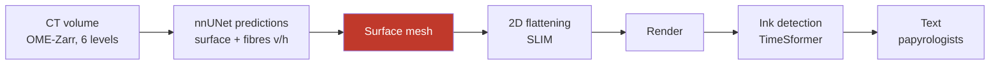

# État de l'art du déroulage virtuel — Vesuvius Challenge

Consolidé le 2026-08-17. **Sourcé** : chaque affirmation renvoie soit à une page du
site (miroir local complet, 81/81), soit au dépôt qui la porte (33 clonés), soit à
une mesure faite ici et rejouable. Les affirmations non vérifiées sont marquées.

> Ce document est le point d'entrée. Les notes de travail détaillées sont dans
> `01` (le goulot), `02` (inventaire mesuré), `03` (reproduction), `04` (expérience).

---

## 0. ⭐⭐ Où en est le domaine — août 2026

Ajouté le 2026-08-19, après lecture intégrale des **trois** articles primaires
([`27`](27_ce_que_la_litterature_dit.md)). Ce document est un état de l'art et il ne
disait pas le fait le plus important du champ.

**Un rouleau scellé a été entièrement déroulé et lu.** PHerc. 1667, publié le 27 juin
2026 (arXiv 2606.29085, 27 auteurs, l'équipe entière du concours) : 31 spires,
**1231 cm²**, **22 colonnes**, transcrites par huit papyrologues. C'est une première, et
elle est réelle.

**Et le problème reste ouvert.** L'équipe l'écrit elle-même, un mois plus tard, sur sa
page technique (`/2026_open_problems`, 10 juillet 2026) :

> *« We are **no longer asking whether** a sealed Herculaneum scroll can be read. It can.
> The harder question is how to make the same process work **automatically, reliably, and
> at scale** for every scroll. »*

> *« **No method yet traces a complete, correct surface through a scroll
> automatically** »* — encadré « ⚠️ Open problem » de la même page.

⭐⭐ **Le chiffre qui réconcilie les deux** est enfoui dans la sous-section « Statistics
and reproducibility » de l'article :

> *« a wrap by wrap copy tool combined with **~25 hours per wrap of manual annotation** »*

**31 spires × 25 h ≈ 775 heures d'annotation humaine** pour ce seul rouleau. Le Grand
Prize 2027 en tolère **huit**. Un facteur **~100** sépare l'état de l'art de ce qui est
demandé pour juin 2027.

### Ce qui est résolu, ce qui ne l'est pas

| | état |
|---|---|
| **Scanner** un rouleau avec assez de signal | ✅ **résolu** — protocole BM18/ESRF : 2,4 µm, 0,22 m, 78 keV, Paganin δ/β = 1000. Sur PHerc. Paris 4, l'encre devient **directement visible dans le volume** |
| **Lire** l'encre quand la géométrie est bonne | ✅ largement — modèles entraînés sur fragments, généralisation *zero-shot* démontrée sur deux rouleaux non vus |
| **Aplatir** une surface correcte | ✅ SLIM |
| **Tracer** une surface complète et correcte | ❌ **non résolu** — « the first [bottleneck] is **geometric** » |
| **Détecter automatiquement** qu'une trace a fauté | ❌ **rien n'existe** — le rempart est un masque d'approbation posé à la main, région par région |
| **Généraliser** à un autre rouleau | ❌ *« does not imply that all sealed Herculaneum rolls are automatically readable »* |

⚠⚠ **Et voici le fait qui justifie ce dépôt** : dans l'article qui vient de lire un
rouleau entier, **« sheet switches » n'apparaît qu'une seule fois**, dans la liste des
goulots non résolus — et **aucun taux d'erreur de traçage n'est publié**, ni avant ni
après correction manuelle. La grandeur que nos instruments produisent n'existe nulle part
dans la littérature.

⭐ Le tableau des goulots de `/2026_open_problems` le formule en termes d'action :

> **Sheet switches** — *« Meshes can jump from one wrap to another. »*
> Approche actuelle : *« VC3D inspection and **manual correction** »*.
> Ce qui aiderait : *« Stronger local continuity constraints and **conservative failure
> detection** »*.

Et l'un des six appels à contribution de la même page :

> *« help with **automatic topology repair** — building tools that catch mesh-tracing
> errors like **holes, mergers, and sheet switches without a human checking every traced
> piece of surface by hand**. »*

⚠ **Portée honnête de cette lecture** : elle dit que la case est ouverte, pas que nous
l'occupons. Ce dépôt a des instruments qui jugent une trace sans vérité terrain (`03`,
`12`, `07`) et **une** trace produite puis condamnée par eux (`24`). Ce qu'il n'a pas
encore, c'est une **amélioration** — voir §9.4.

---

## 1. La chaîne, et le seul étage qui bloque

| étage | état | référence |
|---|---|---|
| Prédictions (surface, fibres) | **automatique** | `villa`, nnUNet |
| **Maillage de la surface** | **le goulot** | `/unwrapping` |
| Aplatissement 2D | **automatique** | `slim-flatboi`, SLIM |
| Rendu | **automatique** | Volume Cartographer |
| Détection d'encre | ⚠ **pas « résolu »** : *« ink segmentation remains **weak**, varies across ink recipes and local degradation states »* (`27` §3). Ce qui est acquis, c'est qu'elle **marche quand la géométrie est bonne** — et la généralisation inter-rouleaux est un goulot déclaré | `Vesuvius-Grandprize-Winner` |
| Lecture | humaine, experte, **en attente d'images** | — |

Le problème n'est pas de trouver *de la* surface — nnUNet le fait bien — mais de
décider **quelle surface est laquelle**. Deux spires voisines sont à 300 µm ; une
feuille fait 40 µm. Là où le rouleau est comprimé, cet écart tombe à zéro.

**Le mode de panne central est le *sheet switching*** : la surface suivie saute
d'une spire à la suivante, et le résultat reste continu, lisse et plausible. Le
texte rendu mélange alors deux passages distants de plusieurs centimètres, et le
seul détecteur fiable aujourd'hui est un humain qui lit du grec.

## 2. Les deux familles de mailleurs

| | **Spiral fitting** | **Surface tracer** |
|---|---|---|
| sens | descendante, globale | ascendante, locale |
| principe | spirale canonique 2D déformée en 3D par champ de flot | patches semés puis crus et recollés |
| humain | **quasi nul** | **~4 h par soumission** |
| force | sortie **garantie** être une nappe unique, manifold, sans auto-intersection | épouse la vraie géométrie, même pathologique |
| faiblesse | **suppose** la spirale : déchirures, décollements, cœur effondré | dérive |
| code | `villa/volume-cartographer/apps/diffusion/spiral*.{hpp,cpp}` (Ceres) | `villa`, VC3D |

⚠⚠ **Correction du 2026-08-19 : « immunisé au sheet switching par construction » était
FAUX**, et c'est le papier de la méthode qui le dit. La garantie du spiral fitting est
**topologique, pas sémantique** : elle assure que la sortie **est** une nappe, jamais
que c'est **la bonne** nappe. Henderson mesure lui-même un *winding jump fraction* de
**3,20 %** et écrit, dans ses limites : *« when paths are contradictory due to imperfect
U-Net predictions, **the surface sometimes wanders between two true windings, instead of
committing to one** »*. Détail et chiffres : [`27`](27_ce_que_la_litterature_dit.md) §2.

> ⭐ Ce que la méthode fait réellement, c'est **convertir** un saut *topologique*
> (fragment, non-manifold, recollage faux) en une **dérive de recalage** — une nappe
> propre, continue, et par endroits sur la mauvaise spire. C'est un progrès réel : une
> erreur qui reste une nappe unique est diagnosticable et bornée. Ce n'est pas une
> élimination.

L'un porte une contrainte globale sans souplesse locale, l'autre l'inverse. Ce qui
manque entre les deux est le **numéro d'enroulement** (*winding number*) — la seule
quantité qui rende le sheet switching *nommable* : deux points d'une même feuille
le partagent, un saut de spire l'incrémente.

⚠ **Le winding est déjà calculé**, contrairement à ce qu'on lit souvent :
`villa/lasagna/` en fait un métier entier (`labels_to_winding_volume.py`,
`opt_loss_winding_volume.py`, `opt_loss_winding_density.py`) et
`vc_diffuse_winding.cpp` le diffuse dans le volume. Le problème ouvert nº7 réclame
plus étroit et plus dur : **des métriques d'évaluation et l'introduction
automatique de la contrainte**. Le manque est du côté *juger*, pas *produire*.

## 3. Les sept problèmes ouverts (2026)

Source : `/2026_open_problems`.

1. **Régions comprimées** — dégât fait au scan, rien en aval ne le défait.
2. **Topologie de surface** — connectivité correcte en zone dense et courbe.
3. **Connectivité de maillage** — détecter et réparer trous, fusions, sauts de spire *sans inspection humaine*.
4. **Qualité des étiquettes** — « one of the main unwrapping bottlenecks », dit par les organisateurs.
5. **Traçage de fibres** — la connectivité longue distance.
6. **Généralisation inter-rouleaux** de la détection d'encre.
7. **Optimisation du spiral fit** — métriques, fonctions de coût, contraintes de winding automatiques.

## 4. Qui fait quoi, et jusqu'où c'est prouvé

### L'automatisation la plus avancée

**`vesuvius-automesh`** est le point le plus avancé de l'automatisation complète :
**279,4 cm² de surface rendue vérifiée**, soit ~4× les segments tracés à la main,
**sans aucune annotation manuelle et sans GPU**, en streamant le CT depuis S3.
Validation contre la vérité humaine : les fenêtres les mieux recouvrantes suivent
la surface tracée par un humain à **28–41 µm de médiane** — l'épaisseur d'une
feuille, quand la spire voisine est à 300 µm.

⚠ Et sa discipline est aussi importante que son résultat : **61 fenêtres sur 106**
seulement passent le contrôle de topologie indépendant, et *seule cette aire est
revendiquée*. C'est la règle « ne revendique que ce que tu as vérifié », appliquée
à la géométrie.

**`scrollfiesta`** est l'autre mailleur communautaire, en **C++/CMake**, et sa liste
de cibles est un programme de vérification à elle seule : `wind_audit`,
`manifold_check`, `seam_audit`, `orient_audit`, `developability`,
`pinhole_verdict`, `pred_reject`.

### Les vérificateurs — six, et c'est saturé

| dépôt | ce qu'il fait | échelle prouvée |
|---|---|---|
| `spiralcheck` | évaluation *held-out* de fits pleine longueur | écrit **pour** l'item « meilleures suites d'évaluation » |
| `winding-sync` | contraintes de winding depuis le CT, sans humain | 910 germes, 1583 contraintes (PHerc0358) |
| `herculaneum-scroll-tools` | annotateur + vérificateur de winding, QA de cohérence CT | **125/125**, phantom fractions sur les 36 échantillons m7 |
| `windcheck` | recensement d'auto-intersection | **284** traces statuées, 274 avec référence propre |
| `tifxyz-doctor` | préflight de contrat, diagnostic géométrique | **450** racines recensées |
| `winding-ruler` | apport réel des annotations de winding | voir §5 |

⚠ **Écrire un septième vérificateur serait un doublon.** Cette conclusion a coûté
une réévaluation complète de notre plan initial, et elle est la principale raison
d'être de ce document.

## 5. Le trou réel : personne ne ferme la boucle

Les six s'arrêtent au même endroit, et **chacun l'écrit dans son propre README** :

- **`windcheck`** : « Whether removing it improves ink, texturing, merging or
  tracing **has not been measured**. »
- **`winding-sync`** : « Relative structure validated ; **absolute winding counts
  not yet calibrated**. »
- **`winding-ruler`**, le plus instructif : les annotations humaines de winding sont
  **statistiquement redondantes** là où les patches vérifiés sont denses (+3 à 5 pp
  seulement là où ils s'éclaircissent), et **trois générateurs de contraintes
  successivement meilleurs dégradent tous le fit**. Les auteurs ont pré-enregistré
  une explication — la résolution de matérialisation — et l'ont **falsifiée
  eux-mêmes** (93,0 % grossier contre 88,3 % fin).

Autrement dit : **le champ sait détecter, il ne sait pas encore montrer que corriger
sert.** Et *mieux contraindre empire le résultat* est un paradoxe ouvert, pas un
détail de réglage.

C'est aussi exactement le critère des Progress Prizes : « amélioration
**quantitative** sur données réelles ».

## 6. Les données, mesurées

Détail et méthode dans `02_inventaire_mesure.md` ; outil : `src/outils/s3_size.py`.

- **45 échantillons** publiés (35 rouleaux, 10 fragments), **310 segments**.
  ⚠ **33 sur 45 n'ont aucune surface tracée** ; quatre échantillons concentrent
  210 des 310 segments.
- Ce qui sépare un échantillon tracé d'un vierge est la **résolution du scan**
  (1,129 µm et mieux → tracé ; 8,64–9,36 µm → zéro), pas sa taille ni son état.
  ⚠ Corrélation, sens indéterminé : on a peut-être choisi de rescanner finement
  les rouleaux prometteurs.
- **Trois échelles** par rouleau : surfaces ~220 Mio, prédictions ~19,6 Gio,
  volume ~2,1 Tio.
- ⚠ Le volume est une **pyramide à six niveaux** : le rouleau **entier en 3D** tient
  dans **33 Gio au niveau 2** (9,6 µm), où une feuille fait ~4 voxels et l'écart
  entre spires ~31. Toute la géométrie est donc accessible ; seule l'encre exige le
  niveau 0.
- Licence **CC-BY-NC 4.0**, aucune inscription.

## 7. Où nous en sommes

**Reproduit et vérifié** (`03_reproduction_windcheck.md`) :

- `windcheck` monte, compile son noyau C++, **364 tests passés** (80 sautés, non
  comptés) ; données **VERIFIED, all files match**.
- Niveau 1 : leur résultat publié (4 et 7 contacts) **reproduit exactement**.
- Niveau 2 : recensement indépendant sur les octets relus → **0 contact**.
- Niveau 3 : **53/53 verdicts et 53/53 comptes de triangles concordants** avec leur
  publication, sur tout le corpus Scroll 5.
- Les 53 réparations tournent, **52 nettoyées, 1 déjà propre, 0 échec**.

**Mesuré et non publié ailleurs** :

- Les traces `auto_grown` sont **~9× plus atteintes** que les autres (192 événements
  de croisement en médiane contre 21). ⚠ Non normalisé par l'aire — elles sont aussi
  les plus grandes.
- Ampleur réelle de l'excision : **0,16 % de l'aire en médiane**, 0,51 % en moyenne,
  jusqu'à 2,79 %. ⚠ Le segment donné en exemple par le README (0,001 %) est **le
  moins touché des 52** — une intuition bâtie dessus est fausse.

**Premier chiffre sur une question que six outils posent et qu'aucun ne referme**
(détail et méthode dans `04`) : les cellules que `windcheck` retire sont
**indiscernables**, dans le CT, du papyrus qu'il garde. Sur 52 segments,
75 810 cellules excisées contre 303 235 témoins appariés : moyenne 72,1 des deux
côtés, médiane 65 des deux côtés, **p = 0,859**, delta de Cliff **−0,000**.
H₀ n'est pas rejetée.

Le défaut géométrique est réel, mais il n'a **pas** de contrepartie matérielle à
l'endroit excisé. Si l'auto-intersection nuit en aval, c'est par la **topologie**,
pas par le contenu ponctuel — ce qui écarte une explication et en désigne une autre.
⚠ Portée : un rouleau, une campagne de scan, un outil de réparation.

## 8. Prix ouverts

| prix | montant | échéance |
|---|---|---|
| **Progress Prizes** (mensuels) | **20 k$ garantis/mois** + lots 0,5 à 20 k$ | **fin de chaque mois** |
| First Letters | 50 k$ par rouleau (≤ 500 k$) | 25 juin 2027 |
| Titre de PHerc. Paris 4 | 50 k$ | 25 juin 2027 |
| Grand Prize 2027 | 1 M$ | 25 juin 2027 |

Critères des Progress Prizes, mot pour mot : contribution open source sur un
problème de la *wishlist*, **amélioration quantitative sur données réelles**,
correction de bugs d'outils réellement utilisés, **documentation qui permet à
d'autres d'appliquer le travail**.

---

## 9. Ce qui a bougé depuis — bilan au 2026-08-18

Ce document a été consolidé le 2026-08-17. **91 des 99 commits du dépôt** sont
postérieurs, 49 fichiers créés, 12 outils d'analyse, **58 contrôles hors ligne**. Voici
le bilan, mesuré contre les repères posés ci-dessus et pas contre une impression.

### 9.1 ⭐⭐ Le trou du §5 : on y est allé, et la réponse est NON

Le §5 dit que **personne ne ferme la boucle** — *le champ sait détecter, il ne sait pas
montrer que corriger sert*. C'est le seul endroit du document qui désignait un vide
plutôt qu'un encombrement, et c'est là qu'on a travaillé.

**La boucle est fermée dans un sens, et elle rend un négatif étayé** (`06` §3.8,
`10` §5) : corrélation par tuile entre l'anomalie géométrique de `07` et l'accord
encre-prédite ↔ étiquetage-humain, sur le seul segment qui ait **et** un maillage **et**
une carte d'encre. **rho +0,019 à n = 89**, contrôle plat, et à ce n la mesure
détecterait un rho de 0,3 à 80 % de puissance.

> **La métrique mesure un défaut de la TRACE, pas du RÉSULTAT.**

⚠ C'est un résultat, pas un échec — mais il faut le nommer pour ce qu'il est : il
**resserre** le §5 au lieu de le refermer. `windcheck` écrit « whether removing it
improves ink has not been measured » ; on peut maintenant ajouter que **l'anomalie
elle-même ne prédit pas la lisibilité**, ce qui rend l'hypothèse « la réparer
améliorera l'encre » moins probable, sans la trancher.

### 9.2 Ce qui a avancé, problème ouvert par problème ouvert

| # | problème (§3) | où on en est |
|---|---|---|
| 1 | régions comprimées | **rien** |
| 2 | topologie de surface | **rien** |
| 3 | connectivité : trous, fusions, sauts de spire **sans humain** | ⭐ **fusions localisées en 3D** et persistantes (p = 0,0001), défaut qui **dérive** de 1,50 mm de rayon par mm de hauteur (`11`) — mais dans le **volume**, pas encore sur un maillage |
| 4 | qualité des étiquettes (« main bottleneck » selon les organisateurs) | ⭐⭐ **un instrument neuf** : `12` mesure l'écart entre la feuille et la surface tracée, **sans vérité terrain, sans modèle d'encre, sans juge, et avant toute inférence** |
| 5 | traçage de fibres | ❌ **réfuté** (`14`) : l'orientation est mesurable (cohérence 0,64) mais le signe s'**inverse** de n = 12 (+0,330) à n = 54 (**−0,192**). ⚠ Le site en fait pourtant *le* critère visuel — l'idée est bonne et **notre mesure ne l'était pas** |
| 6 | généralisation inter-rouleaux de l'encre | ⭐ **un mécanisme concret** : sur Scroll 4 le modèle ne rend rien de lisible, et la cause est **en amont** — sur 61 % du segment la feuille est **hors du volume de surface**. Avant d'invoquer un décalage de domaine, vérifier que la surface est là |
| 7 | métriques d'évaluation | ⭐ la métrique de `07` a désormais son **domaine de définition** (> 1 tour de couverture), son **seuil justifié** (plateau de 0,15 à 0,40, facteur 2,7), et une **réplication** : rho **+0,700, p = 0,0012** sur PHerc1667 |

### 9.3 ⭐ Ce qui n'existait dans aucun des six vérificateurs du §4

Le §4 conclut qu'**écrire un septième vérificateur serait un doublon**. Ce qui a été
construit n'en est pas un — les six travaillent tous sur la **géométrie du maillage**,
et celui-ci lit **le volume de surface lui-même** :

**`12` — la profondeur de surface.** Écart entre le pic d'intensité et la couche tracée.
Scroll 1 : **24 et 32 µm**. Scroll 4 : **63 µm**, p90 **134 µm**, et 61 % des fenêtres
ont leur pic **à un bord** de la pile, c'est-à-dire hors du volume.

Trois propriétés qui le distinguent des six :

1. il ne demande **ni vérité terrain, ni encre, ni humain** ;
2. il se calcule **avant** l'inférence — deux passes de 43 minutes ont été dépensées sur
   un segment dont on pouvait prédire le résultat ;
3. ⭐⭐ il coûte **1,78 Mo et 1,03 s par fenêtre**, parce qu'un chunk OME-Zarr contient
   toute la colonne de profondeur. La même mesure par téléchargement des couches coûte
   **32 Go par segment** — un rapport de **18 000**, et c'est ce qui rend une campagne
   sur corpus possible du tout.

### 9.4 ⚠ Ce qui NE remplit toujours pas le critère des Progress Prizes

Le §8 cite le critère mot pour mot : **« amélioration quantitative sur données
réelles »**.

> ⚠⚠ **On a des mesures et des instruments, pas une amélioration.** Aucun maillage n'a
> été rendu meilleur. Tout ce qui précède se range dans « **juger** », et le §2 dit
> justement que *le manque est du côté juger, pas produire* — donc c'est le bon endroit,
> mais ce n'est pas encore ce que le prix demande.

⭐ **Mis à jour le 2026-08-19 — un maillage a été PRODUIT, et jugé** (`24`). `PHerc0358`,
l'un des **dix** rouleaux du Grand Prize sans aucun segment publié, est tracé
(**8,48 cm²**, 13,9 s), aplati et rendu (29,4 × 29,2 mm), le volume de 893 Go n'étant
jamais téléchargé.

> ⚠ **Et la trace est mauvaise** — elle coupe à travers les spires. Ce qui compte est
> **comment on le sait** : **240 auto-intersections** à pénétration maximale **200 µm**,
> mesurées en 0,05 s **avant tout rendu**, sur un rouleau dont l'écart inter-feuilles
> est de 187 µm — donc une traversée, pas un frôlement. Puis l'image, qui confirme.
> Les instruments jugeaient le travail des autres ; ils viennent de condamner le nôtre,
> avant le rendu. **C'est la validation qui manquait**, et elle est arrivée par un échec.
>
> ⚠⚠ **Corrigé le 2026-08-19.** Ce paragraphe annonçait **trois** mesures indépendantes,
> dont « 64 % des fenêtres piquant au bord » et une « distribution bimodale ». Cette
> troisième jambe a été **retirée** (`24` §2, `25` §5) : la fenêtre de 21 couches ne fait
> que ±94 µm, soit une **demi**-distance inter-feuilles, et **61 % des profils y sont
> plats** (amplitude médiane 1,5 %) — l'argmax d'un profil plat est du bruit, et le bruit
> sort aux deux bords, ce qui *fabrique* la bimodalité. Et sur une fenêtre assez large,
> la trace **officielle** d'un rouleau du prix échoue le même critère plus mal que la
> nôtre. Le verdict tient sur **deux** instruments, pas trois — et c'est précisément
> pourquoi il en fallait plusieurs.

Ce qui manquerait pour y arriver, dans l'ordre du moins cher au plus cher :

1. ✅ **finir les campagnes en cours** — *fait le 2026-08-18* : profondeur sur **80**
   segments, fibres sur **80**. La première tient, la seconde s'est **inversée** ;
2. ✅ **montrer qu'un instrument change une décision** — *fait le 2026-08-19* (`19`) :
   écarter les 20 % de segments dont le volume de surface porte le moins de matière fait
   monter le contraste d'encre médian de **+0,381**, p = **0,0005** contre 2000
   permutations de même effectif, et le seuil est défendu par un **plateau** (15–25 %) ;
3. ⏳ **corriger une trace** et montrer le gain — le vrai « produire ». Deux moitiés,
   et la première est tombée le 2026-08-19 :
   - ✅ **savoir quelle réparation vaut la peine** : `champ_correction.py` sépare ce qu'une
     médiane confond — un **décalage rigide**, réparable par une translation, d'une
     **déformation locale**, qui ne l'est pas. Mesuré sur **trois** rouleaux : une
     translation n'enlèverait que **21,7 / 35,3 / 28,6 %** de l'erreur (`20`) ;
   - ⏳ **appliquer** la correction. ⚠⚠ `20` §4 écrivait que c'était hors de portée « parce
     que la chaîne maillage → rendu n'est pas ici ». **C'était faux, et corrigé le jour
     même** : 32 dépôts sont clonés dont le monorepo officiel, VC3D est construit, et
     `24` pilote la chaîne complète de bout en bout.

### 9.5 Les repères du §7 restent vrais, et se sont étendus

Tout ce que `07` (« où nous en sommes ») affirmait tient toujours. S'y ajoutent :
**AUC 0,925** sur 44,7 M de pixels d'un segment entier avec contrôle mélangé à 0,500
(`10`), un **juge de langue calibré** à 15/16 sans fabrication (`09`), l'**onde
radiale** et ses 176 spires avec un invariant à **cv 1,8 %** (`11`), et le corpus est
passé de 2,6 Go à **~76 Go** dont **80 cartes d'encre publiées** et 71 traces de trois
corpus jamais utilisés ici.

⚠ **Une correction du §6 de ce document, puis une correction de cette correction.**
Le §6 dit que la résolution du scan sépare les échantillons tracés des vierges. J'ai cru
mesurer qu'elle séparait aussi **la métrique de `07` elle-même** — répliquant à 7,91 µm
(Scroll 1 +0,769, PHerc1667 +0,700) et pas à 9,362 µm (PHerc0139 +0,284).

**C'était le RAYON, pas la résolution** (`07` §9). Le rayon de recherche était fixé en
voxels, donc à 9,362 µm il couvrait 749 µm, c'est-à-dire **plusieurs écarts
inter-feuilles** : il trouvait la spire voisine — de la géométrie parfaitement normale —
et noyait l'anomalie dedans. Dérivé du pas mesuré ailleurs et avant (**142,8 µm,
cv 1,8 %**, `11` §3) :

| corpus | rayon en voxels | **rayon physique** |
|---|---:|---:|
| Scroll 1 (7,91 µm) | +0,769 | **+0,840** (p = 1,1e-12) |
| **PHerc0139 (9,362 µm)** | +0,284 *(p = 0,093)* | **+0,666** (p = 2,3e-05) |
| PHerc1667 (7,91 µm) | +0,700 | +0,579 (p = 0,019) |

⭐ **Le gain est le plus grand exactement là où le prix se joue** : les 13 rouleaux
éligibles sont tous scannés à 8,640–9,362 µm. ⚠ PHerc1667 **baisse**, et c'est le plus
petit corpus — deux sur trois s'améliorent, à rapporter tel quel plutôt qu'à moyenner.
