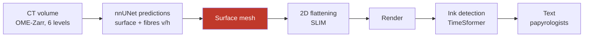

# État de l'art du déroulage virtuel — Vesuvius Challenge

Consolidé le 2026-08-17. **Sourcé** : chaque affirmation renvoie soit à une page du
site (miroir local complet, 81/81), soit au dépôt qui la porte (33 clonés), soit à
une mesure faite ici et rejouable. Les affirmations non vérifiées sont marquées.

> Ce document est le point d'entrée. Les notes de travail détaillées sont dans
> `01` (le goulot), `02` (inventaire mesuré), `03` (reproduction), `04` (expérience).

---

## 1. La chaîne, et le seul étage qui bloque

| étage | état | référence |
|---|---|---|
| Prédictions (surface, fibres) | **automatique** | `villa`, nnUNet |
| **Maillage de la surface** | **le goulot** | `/unwrapping` |
| Aplatissement 2D | **automatique** | `slim-flatboi`, SLIM |
| Rendu | **automatique** | Volume Cartographer |
| Détection d'encre | **résolu** (Grand Prize 2023) | `Vesuvius-Grandprize-Winner` |
| Lecture | humaine, experte, **en attente d'images** | — |

Le problème n'est pas de trouver *de la* surface — nnUNet le fait bien — mais de
décider **quelle surface est laquelle**. Deux spires voisines sont à 300 µm ; une
feuille fait 40 µm. Là où le rouleau est comprimé, cet écart tombe à zéro.

**Le mode de panne central est le *sheet switching*** : la surface suivie saute
d'une spire à la suivante, et le résultat reste continu, lisse et plausible. Le
texte rendu mélange alors deux passages distants de plusieurs centimètres, et le
seul détecteur fiable aujourd'hui est un humain qui lit du grec.

## 2. Les deux familles de mailleurs

| | **Spiral fitting** | **Surface tracer** |
|---|---|---|
| sens | descendante, globale | ascendante, locale |
| principe | spirale canonique 2D déformée en 3D par champ de flot | patches semés puis crus et recollés |
| humain | **quasi nul** | **~4 h par soumission** |
| force | immunisé au sheet switching *par construction* | épouse la vraie géométrie, même pathologique |
| faiblesse | **suppose** la spirale : déchirures, décollements, cœur effondré | dérive |
| code | `villa/volume-cartographer/apps/diffusion/spiral*.{hpp,cpp}` (Ceres) | `villa`, VC3D |

L'un porte une contrainte globale sans souplesse locale, l'autre l'inverse. Ce qui
manque entre les deux est le **numéro d'enroulement** (*winding number*) — la seule
quantité qui rende le sheet switching *nommable* : deux points d'une même feuille
le partagent, un saut de spire l'incrémente.

⚠ **Le winding est déjà calculé**, contrairement à ce qu'on lit souvent :
`villa/lasagna/` en fait un métier entier (`labels_to_winding_volume.py`,
`opt_loss_winding_volume.py`, `opt_loss_winding_density.py`) et
`vc_diffuse_winding.cpp` le diffuse dans le volume. Le problème ouvert nº7 réclame
plus étroit et plus dur : **des métriques d'évaluation et l'introduction
automatique de la contrainte**. Le manque est du côté *juger*, pas *produire*.

## 3. Les sept problèmes ouverts (2026)

Source : `/2026_open_problems`.

1. **Régions comprimées** — dégât fait au scan, rien en aval ne le défait.
2. **Topologie de surface** — connectivité correcte en zone dense et courbe.
3. **Connectivité de maillage** — détecter et réparer trous, fusions, sauts de spire *sans inspection humaine*.
4. **Qualité des étiquettes** — « one of the main unwrapping bottlenecks », dit par les organisateurs.
5. **Traçage de fibres** — la connectivité longue distance.
6. **Généralisation inter-rouleaux** de la détection d'encre.
7. **Optimisation du spiral fit** — métriques, fonctions de coût, contraintes de winding automatiques.

## 4. Qui fait quoi, et jusqu'où c'est prouvé

### L'automatisation la plus avancée

**`vesuvius-automesh`** est le point le plus avancé de l'automatisation complète :
**279,4 cm² de surface rendue vérifiée**, soit ~4× les segments tracés à la main,
**sans aucune annotation manuelle et sans GPU**, en streamant le CT depuis S3.
Validation contre la vérité humaine : les fenêtres les mieux recouvrantes suivent
la surface tracée par un humain à **28–41 µm de médiane** — l'épaisseur d'une
feuille, quand la spire voisine est à 300 µm.

⚠ Et sa discipline est aussi importante que son résultat : **61 fenêtres sur 106**
seulement passent le contrôle de topologie indépendant, et *seule cette aire est
revendiquée*. C'est la règle « ne revendique que ce que tu as vérifié », appliquée
à la géométrie.

**`scrollfiesta`** est l'autre mailleur communautaire, en **C++/CMake**, et sa liste
de cibles est un programme de vérification à elle seule : `wind_audit`,
`manifold_check`, `seam_audit`, `orient_audit`, `developability`,
`pinhole_verdict`, `pred_reject`.

### Les vérificateurs — six, et c'est saturé

| dépôt | ce qu'il fait | échelle prouvée |
|---|---|---|
| `spiralcheck` | évaluation *held-out* de fits pleine longueur | écrit **pour** l'item « meilleures suites d'évaluation » |
| `winding-sync` | contraintes de winding depuis le CT, sans humain | 910 germes, 1583 contraintes (PHerc0358) |
| `herculaneum-scroll-tools` | annotateur + vérificateur de winding, QA de cohérence CT | **125/125**, phantom fractions sur les 36 échantillons m7 |
| `windcheck` | recensement d'auto-intersection | **284** traces statuées, 274 avec référence propre |
| `tifxyz-doctor` | préflight de contrat, diagnostic géométrique | **450** racines recensées |
| `winding-ruler` | apport réel des annotations de winding | voir §5 |

⚠ **Écrire un septième vérificateur serait un doublon.** Cette conclusion a coûté
une réévaluation complète de notre plan initial, et elle est la principale raison
d'être de ce document.

## 5. Le trou réel : personne ne ferme la boucle

Les six s'arrêtent au même endroit, et **chacun l'écrit dans son propre README** :

- **`windcheck`** : « Whether removing it improves ink, texturing, merging or
  tracing **has not been measured**. »
- **`winding-sync`** : « Relative structure validated ; **absolute winding counts
  not yet calibrated**. »
- **`winding-ruler`**, le plus instructif : les annotations humaines de winding sont
  **statistiquement redondantes** là où les patches vérifiés sont denses (+3 à 5 pp
  seulement là où ils s'éclaircissent), et **trois générateurs de contraintes
  successivement meilleurs dégradent tous le fit**. Les auteurs ont pré-enregistré
  une explication — la résolution de matérialisation — et l'ont **falsifiée
  eux-mêmes** (93,0 % grossier contre 88,3 % fin).

Autrement dit : **le champ sait détecter, il ne sait pas encore montrer que corriger
sert.** Et *mieux contraindre empire le résultat* est un paradoxe ouvert, pas un
détail de réglage.

C'est aussi exactement le critère des Progress Prizes : « amélioration
**quantitative** sur données réelles ».

## 6. Les données, mesurées

Détail et méthode dans `02_inventaire_mesure.md` ; outil : `tools/s3_size.py`.

- **45 échantillons** publiés (35 rouleaux, 10 fragments), **310 segments**.
  ⚠ **33 sur 45 n'ont aucune surface tracée** ; quatre échantillons concentrent
  210 des 310 segments.
- Ce qui sépare un échantillon tracé d'un vierge est la **résolution du scan**
  (1,129 µm et mieux → tracé ; 8,64–9,36 µm → zéro), pas sa taille ni son état.
  ⚠ Corrélation, sens indéterminé : on a peut-être choisi de rescanner finement
  les rouleaux prometteurs.
- **Trois échelles** par rouleau : surfaces ~220 Mio, prédictions ~19,6 Gio,
  volume ~2,1 Tio.
- ⚠ Le volume est une **pyramide à six niveaux** : le rouleau **entier en 3D** tient
  dans **33 Gio au niveau 2** (9,6 µm), où une feuille fait ~4 voxels et l'écart
  entre spires ~31. Toute la géométrie est donc accessible ; seule l'encre exige le
  niveau 0.
- Licence **CC-BY-NC 4.0**, aucune inscription.

## 7. Où nous en sommes

**Reproduit et vérifié** (`03_reproduction_windcheck.md`) :

- `windcheck` monte, compile son noyau C++, **364 tests passés** (80 sautés, non
  comptés) ; données **VERIFIED, all files match**.
- Niveau 1 : leur résultat publié (4 et 7 contacts) **reproduit exactement**.
- Niveau 2 : recensement indépendant sur les octets relus → **0 contact**.
- Niveau 3 : **53/53 verdicts et 53/53 comptes de triangles concordants** avec leur
  publication, sur tout le corpus Scroll 5.
- Les 53 réparations tournent, **52 nettoyées, 1 déjà propre, 0 échec**.

**Mesuré et non publié ailleurs** :

- Les traces `auto_grown` sont **~9× plus atteintes** que les autres (192 événements
  de croisement en médiane contre 21). ⚠ Non normalisé par l'aire — elles sont aussi
  les plus grandes.
- Ampleur réelle de l'excision : **0,16 % de l'aire en médiane**, 0,51 % en moyenne,
  jusqu'à 2,79 %. ⚠ Le segment donné en exemple par le README (0,001 %) est **le
  moins touché des 52** — une intuition bâtie dessus est fausse.

**Premier chiffre sur une question que six outils posent et qu'aucun ne referme**
(détail et méthode dans `04`) : les cellules que `windcheck` retire sont
**indiscernables**, dans le CT, du papyrus qu'il garde. Sur 52 segments,
75 810 cellules excisées contre 303 235 témoins appariés : moyenne 72,1 des deux
côtés, médiane 65 des deux côtés, **p = 0,859**, delta de Cliff **−0,000**.
H₀ n'est pas rejetée.

Le défaut géométrique est réel, mais il n'a **pas** de contrepartie matérielle à
l'endroit excisé. Si l'auto-intersection nuit en aval, c'est par la **topologie**,
pas par le contenu ponctuel — ce qui écarte une explication et en désigne une autre.
⚠ Portée : un rouleau, une campagne de scan, un outil de réparation.

## 8. Prix ouverts

| prix | montant | échéance |
|---|---|---|
| **Progress Prizes** (mensuels) | **20 k$ garantis/mois** + lots 0,5 à 20 k$ | **fin de chaque mois** |
| First Letters | 50 k$ par rouleau (≤ 500 k$) | 25 juin 2027 |
| Titre de PHerc. Paris 4 | 50 k$ | 25 juin 2027 |
| Grand Prize 2027 | 1 M$ | 25 juin 2027 |

Critères des Progress Prizes, mot pour mot : contribution open source sur un
problème de la *wishlist*, **amélioration quantitative sur données réelles**,
correction de bugs d'outils réellement utilisés, **documentation qui permet à
d'autres d'appliquer le travail**.
