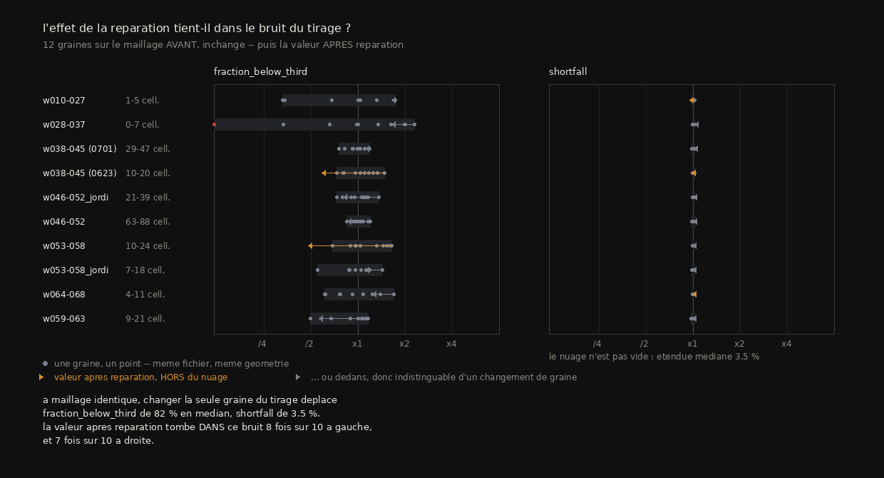
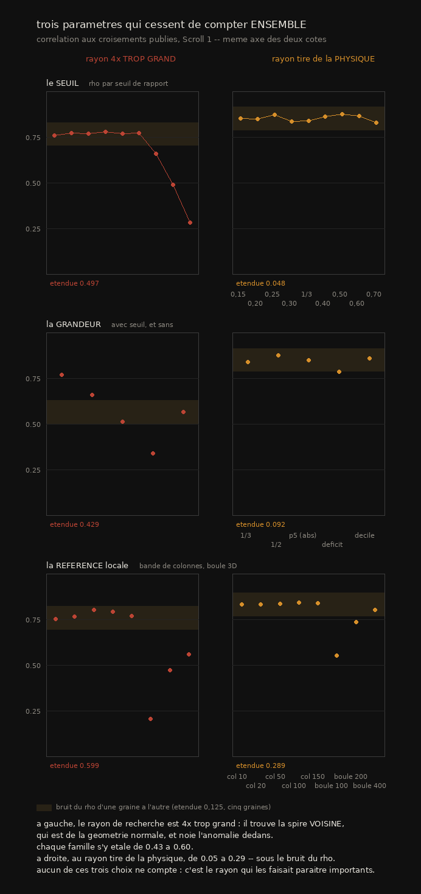
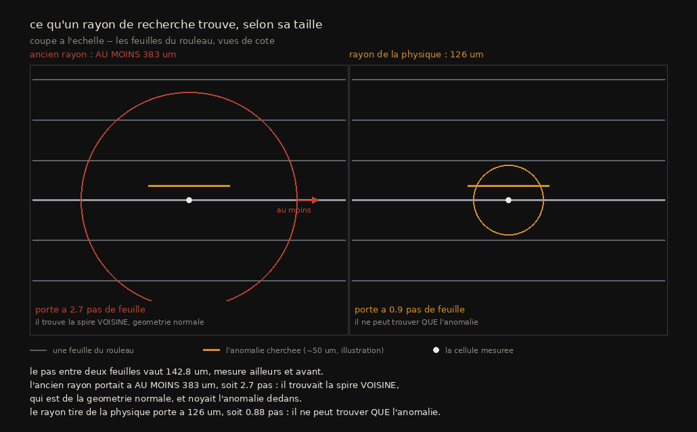
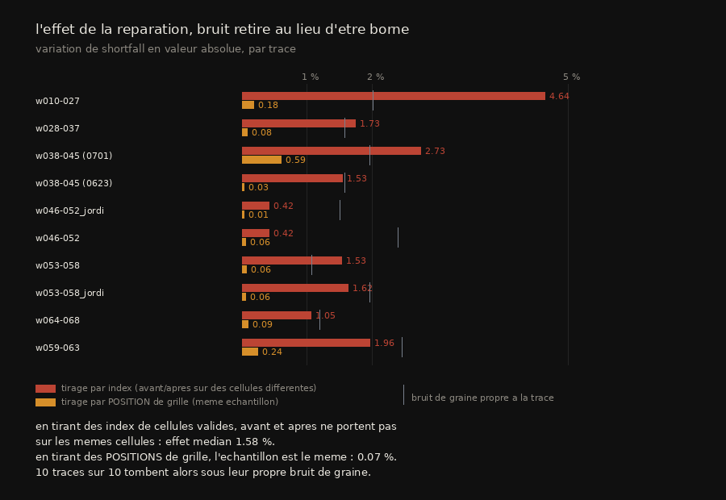

# La réparation ne déplace pas le défaut : une mesure qui le montre

> ⚠⚠⚠ **CONCLUSION CENTRALE DÉSTABILISÉE LE 2026-09-03, et pas par une relecture.**
> Ce document publie que la réparation « ne déplace pas » la proximité anormale — **0,37 →
> 0,38 %**, mesuré sur **une** trace de Scroll 1 dont la réparation retirait **0,12 %** de
> l'aire. En voulant garder ce chiffre pour l'article, il a fallu le rendre recalculable :
> réparer une trace et remesurer. **Il ne se généralise pas.**
>
> Mesuré sur les deux traces de Scroll 5 dont la couverture dépasse un tour — les seules où
> la métrique s'applique, cf. §7 — la réparation **fait baisser** la proximité :
>
> | trace | cellules retirées | `fbt` avant → après | variation |
> |---|---:|---|---:|
> | `auto_grown_…_1` (27 416 contacts) | 0,20 % | 1,464 → 0,735 % | **−49,8 %** |
> | `auto_grown_…_7` | 0,67 % | 3,483 → 2,707 % | **−22,3 %** |
> | `w038-045` (ce document) | 0,12 % | 0,370 → 0,380 % | +2,7 % |
>
> ⚠ Et ce n'est **pas proportionnel à ce qui est retiré** : la trace qui perd le **moins** de
> cellules perd le **plus** d'anomalie. Les deux explications simples tombent donc ensemble.
>
> ⚠⚠ **Le cas discriminant n'est pas montable sur ce corpus** : il faudrait une trace **peu**
> atteinte, or §7 établit que la métrique exige plus d'un tour de couverture et que sur ce
> rouleau **toutes** les traces longues sont les `auto_grown`, qui sont les plus atteintes.
> C'est le confond de §7, qui mord ici une seconde fois.
>
> ⭐ Ce qui reste établi de ce document : la **corrélation** (ρ = +0,769 sur 46 traces, à
> longueur contrôlée) et le **rayon dérivé de la physique**. Ce qui tombe : la phrase
> « réparée n'est pas propre » au sens où ce titre la porte.
> Mesure : [`mesures/reparation_deplace_la_proximite.json`](mesures/reparation_deplace_la_proximite.json).

2026-08-17. Résultat sur PHercParis4 (Scroll 1), 46 traces mesurées.
Rejouable : `src/excision/src/excision/{proximity,correlate}.py`.

> **En une phrase** : la réparation d'auto-intersection ramène les contacts à zéro
> et **ne change pas** la proximité anormale entre régions non adjacentes. La mesure
> corrèle fortement avec les croisements (rho 0,77, y compris à longueur contrôlée)
> mais **ne sépare pas** proprement les traces saines des réparées — c'est un
> indicateur continu, pas un classifieur.

---

## 1. Le dispositif, et pourquoi il est honnête

Trois traces du **même rouleau**, de **longueur quasi identique** (7,66 / 7,82 /
7,92 tours), donc le confond longueur/qualité identifié en `05` §1 est neutralisé
par construction. Deux d'entre elles couvrent **la même région** (`w038-045`) et
diffèrent d'un facteur **8** en nombre de croisements.

| trace | tours | croisements publiés | rôle |
|---|---|---|---|
| `20231022170901` | 7,66 | **0** | témoin : long **et** propre |
| `20260623143441-w038-045` | 7,82 | 52 | même région, peu atteinte |
| `20260701183126-w038-045` | 7,92 | **408** | même région, très atteinte |

⚠ Données vérifiées **par leur comportement** et non par un manifeste de hashes
(perdu à l'arrêt du récupérateur) : les comptes de triangles concordent exactement
avec la publication (1 047 154 · 3 615 528 · 5 850 912), et les contacts sur la
diagonale publiée aussi (1 584 · 11 673). C'est une vérification plus forte qu'une
somme de contrôle — elle prouve que la donnée est *juste*, pas seulement *intacte*.

## 2. La métrique ordonne correctement, à longueur contrôlée

`fraction_below_third` = part des cellules dont la distance à une partie **non
adjacente** vaut moins du tiers de l'espacement **local**.

| trace | croisements | espacement médian | cellules sous ⅓ |
|---|---|---|---|
| témoin | 0 | 160 µm | **0,09 %** |
| `w038-045` peu atteinte | 52 | 140 µm | 0,15 % |
| `w038-045` très atteinte | 408 | 138 µm | **0,37 %** |

Monotone avec le nombre de croisements, à longueur égale. La métrique mesure donc
la **qualité**, pas la longueur.

## 3. ⭐ Le test qui tranche : elle survit à la réparation

L'objection sérieuse était qu'une métrique de proximité **re-détecte simplement les
croisements** — un site de croisement *est* une approche rapprochée. Ce serait alors
une version dégradée du recensement, sans valeur propre.

Le test : mesurer la trace **réparée**, celle dont le recensement dit désormais zéro.

| état | recensement | espacement | cellules sous ⅓ |
|---|---|---|---|
| avant | **11 673 contacts**, *NOT clean* | 138 µm | 0,37 % |
| **après réparation** | **0 contact**, *clean* | 138 µm | **0,38 %** |
| témoin jamais atteint | 0 contact, *clean* | 160 µm | **0,09 %** |

La réparation retire **3 689 quads** (0,12 % de l'aire), fait tomber les contacts de
11 673 à **zéro**, et la métrique **ne bouge pas** (0,37 → 0,38 %).

> **Passer le recensement d'auto-intersection ne change rien à cette mesure.** La
> réparation ramène les contacts à zéro et laisse la proximité intacte.

C'est le résultat de `05` §4 généralisé : autre rouleau, trace entière, et cette
fois sur un vrai maillage réparé plutôt que sur des sites de croisement isolés.

### ⚠⚠ Correction : « quatre fois au-dessus d'une trace saine » était faux

Cette section a d'abord conclu que la trace réparée (0,38 %) valait **quatre fois**
une trace saine (0,09 %). C'était une comparaison à **un seul** témoin, qui se
trouvait être bas. Mesuré ensuite sur les **7 traces à zéro croisement** de Scroll 1
(mesure `06` 3.9) :

| population | médiane | étendue |
|---|---|---|
| zéro croisement (n = 7) | 0,090 % | **0,020 – 0,372 %** |
| avec croisements (n = 39) | 0,230 % | 0,040 – … |

Une trace parfaitement propre peut donc atteindre **0,372 %**, et la réparée
(0,38 %) est **à peine au-dessus**, pas hors norme. Les distributions se recouvrent :
seules **36 %** des traces atteintes dépassent la pire des saines.

**L'énoncé qui survit** : la réparation **ne déplace pas** la mesure (0,37 → 0,38 %),
donc la métrique voit quelque chose que le recensement ne voit pas. **L'énoncé qui
tombe** : que cette mesure sépare proprement « réparée » de « saine ». Elle ne le
fait pas — c'est un indicateur continu corrélé, pas un classifieur.

## 4. Pourquoi la mesure est construite ainsi

Trois décisions, chacune imposée par une erreur payée avant elle :

1. **Non adjacent se juge dans la PARAMÉTRISATION**, pas dans l'espace. Deux
   cellules voisines dans l'image sont censées être voisines en 3D ; les compter
   noierait le signal sous la continuité ordinaire de la surface.
2. **Normalisation par l'espacement LOCAL**, jamais par une constante. Mesuré :
   l'espacement va de 101 µm (p5) à 303 µm (p90) selon l'endroit, et croît de
   **28 %** du cœur vers l'extérieur (`05` §4bis, `06` 1.11). Une constante
   empruntée à un autre rouleau avait déjà produit une conclusion fausse.
3. **La médiane, pas la moyenne**, pour la référence locale : la grandeur cherchée
   est une queue basse, et une moyenne se laisse tirer par ce qu'on veut détecter.

Ni volume, ni modèle, ni étiquette : la trace seule suffit. Arbre k-d, 0,4 s de
construction sur 1,6 M de points.

## 4bis. La corrélation, sur 46 traces

La §2 portait sur 3 traces. Étendu à **toutes** les traces mesurables de Scroll 1
(46 sur 55 ; les 9 restantes couvrent moins d'un tour, donc ne peuvent pas revenir
près d'elles-mêmes) :

| corrélation de Spearman | rho | p |
|---|---|---|
| proximité ~ **croisements** | **+0,769** | 4,3e-10 |
| proximité ~ **longueur** | −0,232 | 0,12 *(non significatif)* |
| longueur ~ croisements | +0,050 | *le confond, ici absent* |

⚠ **Le confond de `05` n'existe pas dans Scroll 1** (rho = 0,05 entre longueur et
croisements). C'était une particularité de Scroll 5, où les seules traces longues
étaient aussi les seules automatiques.

À longueur contrôlée, par tercile de couverture :

| tercile | couverture | n | rho |
|---|---|---|---|
| 1 | 0,26 – 2,03 tours | 16 | **+0,820** |
| 2 | 2,03 – 3,97 tours | 15 | **+0,944** |
| 3 | 3,98 – 18,03 tours | 15 | **+0,739** |

Fort et significatif dans les trois. La métrique porte donc sur la **qualité**.

Rangs de Spearman et non Pearson : quelques traces portent des centaines de
croisements et la plupart aucun, donc une corrélation linéaire mesurerait surtout
la queue.

## 5. ⚠ Ce que ça ne prouve pas encore

- **La corrélation est établie (46 traces), la séparation ne l'est pas.** La
  métrique est un indicateur continu, pas un classifieur : voir la correction du §3.
- Un seul rouleau, une seule campagne de scan. Scroll 5 se comporte différemment
  (le confond y existe), donc rien ne dit que ces chiffres voyagent.
- ✅ **Le seuil d'un tiers : tranché le 2026-08-18** (voir §8). Il ne peut pas être
  supprimé — aucune grandeur sans seuil ne l'égale — et ce qui le défend est un
  **plateau** de 0,15 à 0,40. Ce n'est pas un paramètre réglé, c'est un **sélecteur de
  queue**, et le plateau montre que la sélection est robuste.
- **On ne sait pas si ces approches nuisent au texte.** C'est la même frontière que
  `04` : on mesure une anomalie géométrique, pas une perte de lisibilité. Le lien
  reste à établir.
- **Aucun plancher** : les 7 traces à zéro croisement s'étalent de 0,020 % à
  0,372 %, un facteur 18. Ce que la mesure attrape sur une trace sans croisement
  reste inexpliqué — vraies approches légitimes, ou bruit de la mesure.

## 6. Ce que ça vaut pour le concours

Les critères des Progress Prizes demandent une **amélioration quantitative sur
données réelles**, sur un problème de la *wishlist*. Les problèmes ouverts nº3
(« détecter et réparer trous, fusions et sauts de spire **sans inspection
humaine** ») et nº7 (« **métriques d'évaluation** ») sont exactement ceci.

Et le résultat a la forme utile : il ne dit pas « notre outil est meilleur », il dit
**« la vérification que tout le monde utilise laisse passer quelque chose, voici la
mesure et voici le contrôle »**.

⚠ En l'état ce n'est pas encore soumissionnable : il manque le seuil non arbitraire
(`06` 3.7) et un second rouleau. Ce qui est acquis, c'est la mesure et son contrôle
négatif — pas encore un outil que quelqu'un d'autre voudrait lancer.

---

## 6. ⚠⚠ La référence locale : le défaut est réel, le remède de principe est faux

2026-08-18. `06` §3.2 avait établi que la ligne de base « locale » de `proximity.py`
n'est pas locale : ±150 colonnes couvrent **96,9 % d'un tour**, et le rayon y varie de
**8,62 mm**, soit 59,5 % de l'étendue radiale. Le constat tient. Ce qui suit est ce
qu'on en fait.

### Le remède évident, et sa mesure

La grandeur mesurée est une **distance 3D**, donc son voisinage de référence devrait
l'être — une boule est locale en rayon par construction, et n'exige pas de connaître
l'axe du rouleau (que `06` §2.3 n'a toujours pas établi). Sur les mêmes 46 traces,
même grandeur, seule la définition de la référence change :

| référence | rho ~ croisements | p | couverture |
|---|---:|---:|---:|
| colonnes ±50 | **+0,805** | 1,6e-11 | 100 % |
| colonnes ±100 | +0,793 | 5,3e-11 | 100 % |
| **colonnes ±150** *(actuelle)* | **+0,769** | 4,3e-10 | 100 % |
| colonnes ±20 | +0,765 | 5,8e-10 | 100 % |
| colonnes ±10 | +0,755 | 1,4e-09 | 100 % |
| boule 400 vx | +0,560 | 5,3e-05 | 100 % |
| boule 200 vx | +0,474 | 8,8e-04 | 94 % |
| boule 100 vx | +0,206 | 0,17 | 24 % |

**Le remède de principe rend la métrique nettement pire**, et les fenêtres en colonnes
forment un **plateau** de ±10 à ±150 : la largeur n'est pas le facteur limitant. Un
gain de +0,036 en passant de 150 à 50 ne vaut pas qu'on retienne 50 — ce serait
retenir la valeur qui a le mieux marché sur ces 46 traces, exactement le piège que
`06` §3.7 évite pour le seuil.

### Deux mesures, et non deux explications

**(1) La non-localité est sans conséquence.** Rapport boule/bande sur les cellules
ordinaires : **1,001** en médiane sur **45 traces**, intervalle p10–p90
**[0,995 ; 1,015]**. Les deux références donnent le même
espacement typique — donc l'espacement ne varie pas assez avec le rayon pour que la
largeur de la fenêtre compte. Le rayon varie beaucoup dans la fenêtre ; l'espacement,
non. C'est cohérent avec l'invariant fort de `11` §3 (rayon / feuilles constant à
**cv 1,8 %**), même si celui-là est mesuré sur un autre rouleau et le long de *z*.

**(2) Et la boule détruit le contraste, spécifiquement là où il est.** Rapport
boule/bande **aux cellules signalées** : **0,766** en médiane, intervalle p10–p90
**[0,454 ; 0,945]**, et l'effondrement est spécifique sur **43 traces sur 45**
(Wilcoxon apparié, **p = 1,4e-09**). Un site de
croisement est une région 3D **compacte** où les cellules sont anormalement proches ;
une boule centrée dessus est donc remplie d'autres cellules du même site, la médiane
tombe à la valeur anormale, et **l'anomalie normalise sa propre référence**.

⚠ La bande de colonnes n'a pas ce défaut pour une raison précise : elle est **étroite
en colonne mais entière en ligne**. Elle traverse tout le segment, donc l'essentiel de
son contenu vient de régions saines même quand son centre est sur une anomalie.

> ⚠⚠ **La leçon, et elle dépasse ce fichier : une référence locale doit être LARGE
> dans la direction où l'anomalie est PETITE.** Être local dans toutes les dimensions
> de l'anomalie, c'est mesurer l'anomalie contre elle-même.

⚠ Deux traces sur 45 vont dans l'autre sens. Et l'ampleur — **23 %** de baisse de
référence aux cellules signalées, contre **0,1 %** partout ailleurs — explique la
**direction** du résultat ; qu'elle suffise à expliquer toute la chute de rho de 0,805
à 0,560 n'est pas établi par cette mesure seule.

⚠ Ce que le contraste des deux chiffres rend difficile à contester : la référence en
boule n'est pas globalement plus basse (elle est à **0,1 %** de la bande partout
ailleurs), elle ne s'effondre **qu'aux endroits qui portent le signal**. Une baisse
uniforme aurait été un décalage d'échelle, sans effet sur un rang de Spearman.

### Reproduire

```bash
uv run python src/excision/baseline_sweep.py \
    data/repos/windcheck/data/scroll1_tifxyz docs/mesures/baseline_sweep_scroll1.jsonl
uv run python src/excision/variant_correlate.py \
    docs/mesures/baseline_sweep_scroll1.jsonl data/repos/windcheck/results/index.json
```

---

## 7. 🎯 Le second rouleau : la métrique n'est pas *moins bonne*, elle est **inapplicable**

2026-08-18. `06` §C et le §5 ci-dessus réclamaient un second rouleau. Les 53 traces de
Scroll 5 (PHerc0172) étaient déjà sur disque. Le résultat n'est pas celui qu'on
attendait.

### Ce que la mesure a rendu

Sur les 53 traces, **9 seulement** ont produit une mesure. Les 44 autres : **zéro
cellule mesurée** — pas « peu », zéro.

Et les 9 survivantes sont `auto_grown_20251115002740308_{0..8}` : **neuf morceaux du
même segment**, créés à la même seconde. Ce n'est pas n = 9, c'est **n = 1**.

### ⚠⚠ La coupure est exactement à un tour

| | couverture, en tours |
|---|---|
| les 9 **mesurées** | **2,99 à 9,07** |
| les 44 **écartées** | **0,50 à 1,00** |

Une trace qui ne fait pas un tour **ne peut pas se recouvrir** : il n'existe alors
aucune paire de cellules éloignées dans la paramétrisation et proches en 3D, et c'est
exactement ce que la métrique mesure. Elle ne rend pas un mauvais chiffre — elle ne rend
**rien**.

> **La métrique de `07` exige une trace qui repasse au-dessus d'elle-même.** Ce n'est
> pas un réglage, c'est sa définition. Et personne ne l'avait écrit.

### Ce que ça change

- **`06` §C est répondu**, mais pas comme prévu : le problème n'est pas que les chiffres
  ne voyagent pas, c'est que la population de traces de Scroll 5 est majoritairement
  **hors du domaine de définition** (médiane **0,92 tour**).
- **Le confond longueur/qualité de `05` s'explique** : sur Scroll 5, seules les traces
  longues sont mesurables, donc toute corrélation y est confondue par construction.
- ⚠ La corrélation observée sur ces 9 morceaux (**rho +0,433, p = 0,244**) ne doit pas
  être citée : n = 1 observation indépendante, et aucune trace à zéro croisement.

### 🎯 Et le vrai second rouleau est ailleurs

L'index publié couvre **cinq** corpus, avec des populations très différentes :

| corpus | traces | tours (médiane) | **> 1 tour** |
|---|---:|---:|---:|
| PHerc0814 | 13 | 3,10 | **12** |
| PHerc1667 | 20 | 1,29 | **17** |
| PHerc0139 | 38 | 1,11 | **35** |
| Scroll 1 | 55 | 2,70 | 37 |
| **Scroll 5** | 53 | **0,92** | **10** |

Les trois corpus jamais utilisés sont **majoritairement mesurables**. C'est là qu'est le
test, et leurs traces se récupèrent depuis le bucket ouvert
(`src/outils/fetch_traces.py`) — `aws` est absent, mais l'API de listage HTTPS accepte un
préfixe par segment, donc on n'énumère pas tout (piège nº 16).

⚠ **Une règle d'applicabilité doit être posée dans l'outil**, pas seulement écrite ici :
une trace sous un tour de couverture doit être **refusée avec sa raison**, pas rendre
« 0 cellule mesurée » — un message qui ressemble à une panne.


---

## 8. ~~✅ Le seuil d'un tiers : ni arbitraire, ni supprimable~~ — ⚠⚠⚠ **PÉRIMÉ, voir §11**

> ⚠⚠⚠ **Tout ce qui suit est mesuré à l'ANCIEN rayon de recherche**, celui que le §9 établit
> quatre fois trop grand. Les nombres sont exacts et reproductibles sur leur fichier — c'est
> vérifié — mais ils portent sur un instrument que ce document a corrigé **plus bas**, et
> personne ne les a rejoués. Au bon rayon, **les deux moitiés de l'argument tombent** : l'écart
> entre `fraction_below_third` et `shortfall` passe de 0,429 à 0,054, et le « plateau puis
> effondrement » devient un plateau **sur toute la plage**. Le seuil ne sélectionne aucun régime.
> Gardé tel quel pour comparaison, comme toute figure datée de ce dépôt. → [§11](#11--le-9-a-corrigé-linstrument-et-na-re-mesuré-quune-colonne)

`06` §3.7 l'avait entamé, le §5 ci-dessus le réclamait encore. Tranché.

### Aucune grandeur sans seuil ne l'égale

Mêmes 46 traces, même référence, seule la grandeur corrélée change :

| grandeur | seuil ? | rho ~ croisements |
|---|---|---:|
| `fraction_below_third` | oui, 1/3 | **+0,769** |
| `fraction_below_half` | oui, 1/2 | +0,659 |
| `ratio_p5` (5ᵉ centile du rapport) | **non** — un centile, pas une valeur | **−0,512** |
| `shortfall` (déficit moyen) | **non** | **+0,340** |

Le déficit moyen perd **plus de la moitié** de la corrélation : il est dilué par la
masse des cellules normales. **Le signal est dans la queue extrême**, et toute
statistique qui moyenne sur la distribution entière l'y noie.

⚠ Le centile (`ratio_p5`) est la meilleure des grandeurs sans seuil de valeur, et il
reste loin derrière. Ce n'est donc pas « on n'a pas trouvé la bonne » : c'est que la
grandeur utile *est* une fraction de queue.

### Ce qui le défend : un plateau, pas un réglage

Balayage du seuil sur les mêmes traces :

| seuil | 0,15 | 0,20 | 0,25 | 0,30 | 1/3 | 0,40 | 0,50 | 0,60 | 0,70 |
|---|---:|---:|---:|---:|---:|---:|---:|---:|---:|
| rho | 0,759 | 0,773 | 0,770 | **0,779** | 0,769 | 0,774 | 0,659 | 0,488 | 0,282 |

**De 0,15 à 0,40 — un facteur 2,7 sur le seuil — le rho ne bouge pas** (0,759 à 0,779).
Puis il s'effondre. Un paramètre sur-ajusté produirait un **pic** ; celui-ci produit un
plateau, et 1/3 est simplement dedans.

> **Un seuil qu'on peut multiplier par 2,7 sans que le résultat bouge n'est pas un
> réglage.** C'est le bord d'un régime, et le nommer 1/3 ou 1/4 est indifférent.

⚠ Ce qui **reste** vrai du §5 : le seuil sélectionne une queue dont on ne sait toujours
pas ce qu'elle contient sur une trace sans croisement (facteur 18 entre les 7 traces à
zéro croisement). Le plateau justifie le *choix* du seuil, pas l'interprétation de ce
qu'il attrape.

---

## 9. ⭐⭐ Le rayon de recherche était 4× trop grand — et le bon vient de la physique

2026-08-18. Trouvé en cherchant pourquoi la métrique réplique sur PHerc1667 (+0,700) et
pas sur PHerc0139 (+0,284). J'ai d'abord cru à un effet de **résolution du scan**. Le
contrôle l'a réfuté.

### Le contrôle qui sépare deux explications

Le rayon de recherche est en **voxels**, donc sa valeur *physique* dépend de la
campagne : 80 voxels font **749 µm** à 9,362 µm et **192 µm** à 2,403 µm. Deux lectures
possibles — (a) la résolution fine résout mieux la géométrie, (b) 749 µm est simplement
trop grand. Elles se séparent en balayant le rayon **sur la donnée grossière** :

| rayon | physique | rho ~ croisements | p | traces |
|---|---:|---:|---:|---:|
| 10 vx | 94 µm | +0,446 | 0,064 | 18 |
| **20 vx** | **187 µm** | **+0,609** | **1,3e-04** | 34 |
| 40 vx | 374 µm | +0,459 | 0,0056 | 35 |
| 80 vx *(valeur en vigueur)* | 749 µm | +0,284 | 0,093 | 36 |
| 160 vx | 1498 µm | **−0,143** | 0,407 | 36 |

**Ce n'est pas la résolution : c'est le rayon.** Et au-delà, la corrélation **s'inverse**.

⚠ L'explication est physique et se dit en une phrase : un rayon de 749 µm couvre
**plusieurs écarts inter-feuilles**. Il trouve donc la spire voisine — qui est de la
géométrie parfaitement normale — et noie l'anomalie dedans.

⚠ Un rayon trop petit coûte des traces : à 94 µm, 18 traces sur 36 ne rendent plus
aucune mesure.

### ⚠⚠ Et le bon rayon a été choisi par la PHYSIQUE, pas par la courbe

Balayer puis retenir le meilleur, c'est exactement le sur-ajustement que le §8 évite
pour le seuil. Le pas inter-feuilles a été **mesuré ailleurs et avant** — **142,8 µm,
cv 1,8 %** (`11` §3) — donc ce nombre ne vient pas de cette corrélation et **peut la
faire échouer**.

| corpus | rayon en vigueur (80 vx) | **rayon physique** (142,8 µm) |
|---|---:|---:|
| **Scroll 1** (7,91 µm → 18 vx) | +0,769 | **+0,840**  (p = 1,1e-12) |
| **PHerc0139** (9,362 µm → 15 vx) | +0,284 | **+0,666**  (p = 2,3e-05) |
| ⚠ PHerc1667 (**résolution à vérifier**) | +0,700 | +0,579  (p = 0,019) |

⚠⚠⚠ **LA CORRECTION CI-DESSOUS ÉTAIT ELLE-MÊME FAUSSE — annulée le 2026-09-03.**
Elle disait : *« PHerc1667 n'a AUCUN volume à 7,91 µm. Vérifié sur le bucket : il n'en publie
que deux, 2,399 µm et 1,129 µm (`docs/mesures/volumes_surface_PHerc1667.txt` le dit aussi). »*

`PHerc1667` publie **quatre** scans, dont `20231117161658-**7.910um**-53keV`, et le maillage
que ce balayage a lu s'appelle `20240304141531-on-**20231117161658-7.91um**.tifxyz`. **La
ligne PHerc1667 de ce tableau est donc lisible**, et l'annulation qui suivait tombe avec sa
prémisse.

⚠ La cause : `volumes_surface_PHerc1667.txt` liste des **volumes de surface** — le tomogramme
rééchantillonné sur les couches d'un *segment* — pas des **scans**. Un rouleau peut avoir un
scan sans qu'aucun segment n'y soit rendu, et c'est exactement le cas ici. Conclure sur le
corpus depuis cette vue-là était une erreur de catégorie.

⭐ **Troisième occurrence du même angle mort** — après `59` (un seul layout du bucket) et
`67` §4.2 (un seul des deux serveurs). Trois fois, c'est une famille, donc un garde-fou
plutôt qu'une troisième correction : `src/volume/ou_vit_ce_rouleau.py` juxtapose les quatre
sources et **nomme les désaccords**. Sur `PHerc1667` il rapporte que 7,91 µm est vue par
trois sources et absente d'une seule — celle qui a trompé ce paragraphe. Les deux autres lignes du tableau se
tiennent — leur rayon physique est d'environ **140 µm** (18 × 7,91 et 15 × 9,362) — mais
celle-ci ne peut pas être lue :

- si le rayon **physique** de 140 µm a été appliqué, il vaut **~58 voxels** à 2,399 µm, pas 18 ;
- si **18 voxels** ont été appliqués tels quels, le rayon physique n'était que de **43 µm**,
  soit trois fois moins que sur les deux autres rouleaux — et la comparaison n'est plus appariée.

~~L'artefact `docs/mesures/sweep_PHerc1667.jsonl` **n'enregistre ni le zarr ni la taille de
voxel**, donc rien ici ne tranche. ✅ **À rejouer en enregistrant la résolution**~~ — et c'est
aussi une leçon d'outillage : *un artefact de mesure doit porter la résolution sur laquelle il a
été pris.*

> ⚠⚠⚠ **2026-09-04 — L'ARTEFACT L'ENREGISTRAIT DÉJÀ, et il tranche.** Le fichier date du
> **2026-08-26**, ce paragraphe du **2026-09-03**, et il déclare son échelle :
> `voxel_um 7,91 · search_radius_vox 80 · search_radius_um 632,8 · variante "7.91um"`. Son
> jumeau `sweep_1667_pas.jsonl` déclare `18 vox = 142,4 µm`. **Les deux branches ci-dessus
> supposent 2,399 µm par voxel, donc les deux tombent** : à 7,91 µm, 18 voxels font **142,4 µm**,
> apparié aux **142,8** de Scroll 1 (18,05 × 7,91) et aux **~140** de PHerc0139 (15 × 9,362) —
> les trois à moins de 2 µm l'un de l'autre. **La ligne `PHerc1667` du tableau est lisible**, et
> sa conclusion tient : deux rouleaux sur trois s'améliorent, le troisième se dégrade.
>
> ⚠ Ce qui reste vrai de la phrase barrée, c'est la moitié « ni le zarr » — l'artefact écrit une
> **racine de traces** (`data/traces/PHerc1667`), pas un chemin de volume. Mais c'est la taille
> de voxel qui manquait pour trancher, et elle est là. Vérifié par
> `src/excision/le_rayon_des_mesures.py`, qui **assure** que le rayon fin y vaut bien un pas de
> feuille — le contrôle tomberait si une régénération perdait la déclaration.
>
> ⭐ **Et la leçon d'outillage, elle, n'avait jamais été appliquée à `proximity.py`.**
> `baseline_sweep.py` écrit son bloc `echelle` depuis août ; `proximity.py` n'écrivait rien, et
> c'est exactement ce qui a coûté toute l'archéologie du §11 — il a fallu **retrouver** le rayon
> dans les distances au lieu de le lire. Les deux écrivent désormais le **même** bloc, sous le
> même nom et avec les mêmes clefs communes.

> **Sur Scroll 1, le rayon issu de la physique (+0,840) bat le meilleur rayon du
> balayage (+0,829 à 16 voxels).** Un paramètre choisi sans regarder la réponse fait
> mieux que celui choisi en la regardant : ce n'est plus un réglage, c'est une
> constante physique du problème.

⚠ **PHerc1667 baisse** (+0,700 → +0,579), et c'est le plus petit corpus (n passe de 18
à 16). Deux corpus sur trois s'améliorent, le troisième se dégrade — à rapporter tel
quel, pas à moyenner.

### 🎯 Et le gain est le plus grand là où le prix se joue

Le gain massif est sur **PHerc0139, à 9,362 µm** : de **non significatif** (p = 0,093)
à **p = 2,3e-05**. Or les **13 rouleaux éligibles au Grand Prize 2027 sont tous scannés
à 8,640–9,362 µm**, et le règlement interdit d'utiliser des scans plus fins du même
rouleau. C'est exactement le régime où la correction compte.

### Reproduire

```bash
uv run python src/excision/baseline_sweep.py <traces> <sortie.jsonl> --search-radius 18
uv run python src/excision/variant_correlate.py <sortie.jsonl> \
    data/repos/windcheck/results/index.json --corpus "Scroll 1"
```

---

## 8. ⭐⭐⭐ La population « non montable » existe — et le SIGNE n'est pas stable

> 2026-09-04. Mesure : `src/excision/reparation_et_proximite.py` (6 contrôles),
> `docs/mesures/reparation_et_proximite_scroll1.json`.

### ⚠⚠⚠ D'abord : la mesure qui a déstabilisé ce document n'avait AUCUN producteur

`reparation_deplace_la_proximite.json` porte le résultat qui a renversé la conclusion centrale
de ce document, et **rien dans `src/` ne le produisait** — il a été fait au terminal. Une mesure
qui renverse une conclusion et qu'on ne peut pas relancer est le pire cas de la dette `D3`,
parce qu'elle a l'air solide. Le script existe désormais, et c'est lui qui a permis la suite.

### ⭐⭐ Le blocage venait d'une généralisation depuis le mauvais rouleau

Le §7 conclut que le cas discriminant *« n'est pas montable sur ce corpus »* : il faudrait une
trace **peu atteinte** ET dépassant un tour, or sur `PHerc0172` toutes les traces longues sont
les `auto_grown`. **C'est vrai de `PHerc0172`.** Le recensement de `windcheck` dit autre chose
des autres :

| corpus | traces | sales | span médian |
|---|---:|---:|---:|
| **Scroll 1 (PHercParis4)** | 55 | **48** | **2,70 tours** |
| `PHerc0814` | 13 | 11 | **3,10 tours** |
| `PHerc0172` *(celui du §7)* | 53 | 52 | 0,92 tour |

**34 traces de Scroll 1 sont éligibles** (sales **et** au-dessus de la coupure d'un tour), contre
10 sur le rouleau du §7. La population déclarée absente existe, curatée, et elle est **locale**.

### ⚠⚠ Et le confond de l'en-tête est plus large qu'il ne le dit

Sa table compare deux `auto_grown` de `PHerc0172` (qui chutent) à une trace **curatée de
`PHercParis4`** (qui ne bouge pas) — donc à travers **deux rouleaux ET deux provenances**.

### ⭐⭐⭐ Mesuré à provenance égale : le signe change

| trace | tours | quads retirés | avant | après | Δ |
|---|---:|---:|---:|---:|---:|
| `w010-027` | 18,03 | 528 | 0,040 % | 0,201 % | **+398,2 %** |
| `w028-037` | 9,76 | 269 | 0,064 % | 0,053 % | **−17,1 %** |

Même rouleau, même provenance, même réparation, et **l'une monte d'un facteur quatre pendant
que l'autre baisse**. Ce n'est donc pas la *proportionnalité* qui manque, comme l'en-tête le
conclut — **c'est le signe lui-même qui n'est pas stable**.

⚠ **n = 2.** Le contrôle est écrit pour **tomber** si un run futur les voyait toutes aller dans
le même sens : ce serait le résultat, et l'outil existe pour l'obtenir sur les 34.

### ⚠⚠ Deux défauts à moi, attrapés en chemin

1. **Le maillage n'est pas à la racine d'une trace** mais sous `<trace>/mesh/<…>.tifxyz/` — la
   **même** disposition que les segments publiés de `PHerc0172`, résolue ici pour la troisième
   fois. Mon premier appel passait la racine, `proximity.py` répondait « plan absent », et le
   résultat était une paire manquante **en silence**. Chaque saut est désormais **rapporté**.
2. ⚠⚠⚠ **Deux noms de clef faux dans le certificat** : j'avais écrit `removed_quads` et
   `retained_area_pct`, il porte `n_removed_quads` et `retained_area_fraction`. Un `.get()` sur
   une clef absente rend `None`, que l'affichage montrait comme **0 quad retiré** — donc « la
   réparation n'a rien fait » alors qu'elle avait retiré 528 quads. Les clefs sont maintenant
   **vérifiées**, et leur absence est une erreur.

⚠ Et un contrôle que j'ai fait avant de conclure : `proximity.py` prend un `--sample` et un
`--seed`, donc l'instabilité pouvait être du bruit d'échantillonnage. **Trois runs sur le même
maillage rendent `0,000638` à l'identique** — il est déterministe, et les écarts sont réels.

---

## 10. ⚠⚠⚠ Le contrôle du §8 était satisfait par la panne qu'il devait attraper

> 2026-09-04. Mesures : `src/excision/le_bruit_de_lechantillon.py` (10 contrôles),
> `docs/mesures/le_bruit_de_lechantillon.json`. Figure :
> `src/figures/figure_bruit_de_lechantillon.py` (14 contrôles).

Le §8 ci-dessus se termine par ceci, que j'ai écrit **avant de conclure**, et qui a l'air d'une
précaution :

> ⚠ Et un contrôle que j'ai fait avant de conclure : `proximity.py` prend un `--sample` et un
> `--seed`, donc l'instabilité pouvait être du bruit d'échantillonnage. **Trois runs sur le même
> maillage rendent `0,000638` à l'identique** — il est déterministe, et les écarts sont réels.

**Ce contrôle ne pouvait rendre qu'un seul résultat.** Trois exécutions de la *même* commande, sur
le *même* maillage, avec la *même* graine : `proximity.py` est déterministe, donc il rend
évidemment trois fois le même nombre. J'ai vérifié la **reproductibilité** et j'en ai conclu la
**stabilité sous ré-échantillonnage**, qui est une autre propriété. C'est le péché capital de ce
dépôt — *une vérification satisfaite par la panne qu'elle devait attraper* — commis dans le
paragraphe même qui se donnait pour une précaution.

### ⚠⚠ Le tirage n'est pas apparié, alors que la mesure se dit appariée

`proximity.py` tire son échantillon ainsi :

```python
sample = generator.choice(points.shape[0], take, replace=False)
```

La graine est fixe, donc le tirage est reproductible **à maillage égal**. Or la réparation
**retire des quads** : `points.shape[0]` change, donc `choice` rend un **autre sous-ensemble**.
« Avant » et « après » ne sont pas mesurés sur les mêmes cellules. Ce sont deux
sous-échantillons différents d'un phénomène **spatialement groupé** — un pli est une région, pas
un point — et c'est exactement la condition dans laquelle une régression vers la moyenne fabrique
des changements de signe.

### ⭐⭐⭐ Le bon contrôle : ne changer QUE la graine

Douze graines, **le même fichier**, aucune réparation. Toute variation observée est celle du
tirage, par construction : il n'existe aucune autre cause possible.

| trace | cellules sous le tiers | étendue de `fbt` | Δ publiée (avant→après) | étendue de `shortfall` |
|---|---:|---:|---:|---:|
| `w010-027` | **1 – 5** | **140 %** | +398 % | 4,0 % |
| `w028-037` | **0 – 7** | **229 %** | −17 % | 3,2 % |
| `w038-045` *(0701)* | 29 – 47 | 44 % | −3 % | 3,9 % |
| `w038-045` *(0623)* | 10 – 20 | 75 % | −47 % | 3,2 % |
| `w046-052_jordi` | 21 – 39 | 63 % | −11 % | 3,0 % |
| `w046-052` | 63 – 88 | 35 % | −9 % | 4,8 % |
| `w053-058` | 10 – 24 | 96 % | −70 % | 2,1 % |
| `w053-058_jordi` | 7 – 18 | 88 % | −22 % | 3,9 % |
| `w064-068` | 4 – 11 | 108 % | +101 % | 2,4 % |
| `w059-063` | 9 – 21 | 67 % | −47 % | 4,9 % |

> **Sur 9 traces sur 10, changer la seule graine déplace `fraction_below_third` d'au moins autant
> que la réparation.** La table (avant, après) du §8 ne peut donc pas porter d'énoncé sur le signe.

### ⚠⚠ Une fraction dont le numérateur tient sur un chiffre n'est pas une fraction

`fbt_avant = 0,0004037` et `1 / 0,0004037 = 2477`, qui est exactement le nombre de cellules
`usable` de ce maillage : **une cellule**. La variation la plus spectaculaire de la table — les
+398 % — est le passage d'un compte à un chiffre à un autre compte à un chiffre.

⚠ Et l'échantillon **effectif** n'est pas celui qu'on demande : sur 20 000 cellules tirées, seules
celles qui ont un vis-à-vis non adjacent dans le rayon sont mesurables — de **2 418 à 13 732**
selon la trace, soit un **facteur 5,7**. Le dénominateur n'est donc pas une constante : « 0,04 % »
sur deux traces ne désigne pas le même compte. Et la variation publiée la plus forte tombe
justement sur l'échantillon le plus maigre — ce n'est pas une coïncidence, c'est le même fait.

### ⭐⭐ La réconciliation avec le §8 *(le premier, l. 341)* : c'est la TÂCHE qui a changé

Le premier §8 valide `fraction_below_third` par un rho de **+0,769** sur 46 traces et montre
qu'aucune grandeur sans seuil ne l'égale (`shortfall` n'y fait que +0,340). **Ce document a
raison.** Ce qui est mesuré ici est une autre propriété. Les deux ne se contredisent pas — ce sont
les deux moitiés du même fait : `fbt` a un **gros signal ET un gros bruit**.

| | grandeur | mesuré |
|---|---|---:|
| signal, **entre** traces | écart des valeurs d'une trace à l'autre | **403 %** |
| bruit de graine | étendue à maillage identique | **82 %** |
| signal, **avant/après** | effet médian de la réparation | **35 %** |

Entre traces le signal écrase le bruit, donc le classement tient. Avant/après, le signal est
**plus petit** que le bruit, donc rien ne se lit. La réparation retire environ **0,03 % de
l'aire** : attendre d'un tel geste qu'il déplace une statistique de plus que sa propre dispersion
d'échantillonnage était optimiste.

> ⭐ L'erreur n'était pas de choisir cette colonne. C'était de transporter une grandeur validée
> pour **ORDONNER** vers une tâche de **DIFFÉRENCE**.

### ✅ La colonne qui tient, et elle est déjà publiée par l'outil

`proximity.py` rend `shortfall` — le déficit moyen sous 1 — dont sa propre docstring dit qu'il
*« utilise TOUTE la queue basse et pondère chaque cellule par son écart : il n'y a aucune coupure
à choisir »*. Une moyenne sur des milliers de cellules ne peut pas sauter d'un facteur parce
qu'une cellule est entrée ou sortie du tirage, et la mesure le confirme : **son étendue de graine
reste sous 5 % partout** (pire cas 4,9 %), contre 35 à 229 % pour `fbt`.



*Douze graines sur le maillage **avant**, inchangé — puis la valeur **après** réparation. À
gauche les nuages sont larges et la flèche tombe dedans **8 fois sur 10** ; à droite le même axe
fait s'effondrer le nuage en un trait. Les deux panneaux partagent l'échelle exprès : en donner
une propre à chacun ferait paraître `shortfall` aussi dispersé que l'autre colonne, ce qui est la
façon la plus courante de faire mentir un graphique sans écrire un seul chiffre faux.*

### ⭐⭐⭐ Et sur la colonne qui tient, la réparation ne déplace RIEN de mesurable

La question du §8 rejouée sur `shortfall`, mêmes dix paires, même réparation :

| trace | Δ `fbt` | Δ `shortfall` |
|---|---:|---:|
| `w010-027` | +398,2 % | **−4,6 %** |
| `w028-037` | −17,1 % | +1,7 % |
| `w038-045` *(0701)* | +21,2 % | +2,7 % |
| `w038-045` *(0623)* | −46,6 % | −1,5 % |
| `w046-052_jordi` | −11,1 % | −0,4 % |
| `w046-052` | −8,9 % | +0,4 % |
| `w053-058` | −69,9 % | −1,5 % |
| `w053-058_jordi` | −22,4 % | −1,6 % |
| `w064-068` | +101,1 % | −1,1 % |
| `w059-063` | −46,8 % | −2,0 % |

**Zéro paire sur dix dépasse le bruit de graine** (±5 %), et le signe est mélangé — 3 en hausse,
7 en baisse. Confrontée au bruit de **sa propre** trace plutôt qu'à un plafond commun, la
majorité reste dedans (4 sur 10 en sortent, dans les deux sens).

> ⭐ **Le titre d'origine de ce document est donc restauré** — *« la réparation ne déplace pas le
> défaut »* — mais pour une raison bien meilleure que celle qu'il donnait. Ce qui l'avait
> « renversé » était une mesure sans producteur, prise sur une colonne dominée par son propre
> bruit d'échantillonnage.

⚠ *Ne déplace rien de mesurable* n'est pas *ne fait rien*. Ce qui est établi est une **borne** :
si la réparation a un effet sur cette grandeur, il est inférieur à environ 5 %, c'est-à-dire à la
dispersion d'un tirage de 20 000 cellules. Le distinguer demanderait un tirage plus grand, ou un
tirage **apparié** — c'est-à-dire mesuré sur les cellules qui survivent à la réparation, des deux
côtés.

### ⚠⚠⚠ « La réparation n'est pas déterministe » — affirmé, rétracté, puis RÉTABLI par la mesure

Trois passages sur la même phrase, et c'est la mesure qui a tranché à chaque fois.

**1.** En relançant le lot pour ajouter `shortfall`, le même appel `windcheck transform` sur la
même trace rend **3 696** quads retirés puis **3 698** (`w038-045`, 0701). J'écris que la
réparation n'est pas déterministe — depuis **deux sorties de terminal**, c'est-à-dire depuis la
dette `D3` que cette section dénonce.

**2.** Le mode `--determinisme` est écrit pour mettre ça dans l'arbre. À **trois** répétitions il
rend trois certificats **identiques**, et je rétracte.

**3.** À **six** répétitions :

| réparation | 1 | 2 | 3 | 4 | 5 | 6 |
|---|---:|---:|---:|---:|---:|---:|
| quads retirés | 3 698 | 3 696 | 3 696 | 3 696 | **3 691** | 3 696 |

**Trois certificats distincts.** La première affirmation était juste, la rétractation était
fausse — et elle l'était **par chance**.

> ⭐ Le commentaire de la rétractation disait pourtant, en toutes lettres : *« trois répétitions
> sont une preuve faible de déterminisme : elles excluent "différent à chaque fois", pas
> "différent de temps en temps" »*. Il avait raison, et j'ai quand même laissé ce document s'y
> appuyer. **Une réserve écrite ne dispense pas de la mesure qu'elle appelle.**

⚠ Et le **3 691** corrige un second point que j'avais avancé : ce n'est pas une bascule entre
**deux** valeurs, donc pas une égalité tranchée par un ordre de parcours. Ce que la mesure établit
est plus modeste — la variation existe, elle est **bornée à sept quads sur ~3 695, soit 0,19 %**,
et sa cause reste inconnue.

### ⭐⭐⭐ Et la cause est nommée par l'outil lui-même — dans sa politique gelée

Le remède de [`44`](44_ou_la_chaine_se_trouve.md) — graine posée plus `thread_limit: 1`, qui y
avait rendu un traceur reproductible — était la première hypothèse. **Testée, réfutée** : à
`--threads 1`, huit réparations rendent encore **trois** géométries (3691, 3696, 3698), dans le
même petit ensemble et avec la même modale. Ni le parallélisme, donc ; et pas du bruit flottant
non plus, puisque les valeurs sont **discrètes**.

⚠ Je lisais quatre champs d'un certificat qui en porte cent. Il déclare :

```
selection.selection_status:                mixed
selection.method_mix.exact_optimal:        163
selection.method_mix.greedy_feasible:       18
selection.minimum_area_claim_admissible:   False
selection.timings.phase_exact_s:           133.2
```

L'excision est une **optimisation** résolue composante par composante, et la politique gelée de
`windcheck` (`excise.py`, `round28-greedy-first-v1`) dit le reste :

> `improvement_budget_s_per_segment: 120.0` — *« SEGMENT-WIDE wall-clock budget shared by all
> components, **never a per-component budget** »*

**Un budget d'horloge.** Combien de composantes atteignent le solveur exact dépend de la vitesse
de la machine à cet instant — mesuré : `phase_exact_s` vaut 128 à 134 s contre un budget de 120.

### La corrélation, mesurée

| quads retirés | composantes exactes | au glouton | runs |
|---:|---:|---:|---:|
| **3 696** | 163 | 18 | 5 |
| **3 691** | **164** | **17** | 1 |

**Une composante de plus résolue à l'optimum, cinq quads de moins retirés** — le solveur exact
trouve une excision plus petite que le glouton, ce qui est sa raison d'être. Et le contrôle est
écrit **direction-agnostique** : *à même mélange de méthodes, la géométrie doit être la même*.
Elle l'est.

### ✅ Ce n'est donc pas un défaut, c'est une propriété déclarée

La `failure_rule` de la politique le dit sans détour :

> *« an optimization failure — solver error, time limit, infeasible rounding, exhausted budget —
> **NEVER removes the feasible incumbent; it costs an optimality claim, never an artifact** »*

La sortie est **toujours valide** ; seule son **optimalité** varie. `windcheck` est honnête, et
`minimum_area_claim_admissible: False` l'annonce à chaque certificat.

⚠ Conséquence pratique : **aucun drapeau utilisateur ne peut rendre `windcheck transform`
bit-reproductible**, le budget vivant dans la politique gelée. Le remède est de **réparer une
fois et garder la sortie** — ce que fait déjà chaque paire du §12, dont le résultat tient donc.

⚠⚠ Et une correction de méthode à moi, dans la foulée : j'avais asserté que les deux séries
tombent sur le **même ensemble** de valeurs. Un second échantillon l'a fait tomber (3 698 n'est
pas réapparu). Exiger que deux échantillons d'un **tirage** coïncident, c'est asserter une
propriété que le système n'a pas. Ce qui se défend est l'inclusion dans un petit ensemble commun,
et le fait que leur **union** en compte au moins trois — donc pas une bascule binaire.

⚠⚠ **Ce que ça change pour le §12, et ce que ça ne change pas.** Chaque paire (avant, après) fait
**une seule** réparation, donc les deux mesures d'une paire portent bien sur le même maillage
réparé : le résultat tient. Ce que la non-reproductibilité borne, c'est le **sens du mot « la »
réparation** — il n'y en a pas une, il y en a une famille, et le Δ mesuré est celui d'un tirage
dans cette famille. C'est cohérent avec le fait que `w038-045` (0701) soit la seule trace dont
l'effet dépasse 0,3 % : c'est aussi la seule dont le compte de quads bouge d'une exécution à
l'autre.

### ⚠⚠ Deux hypothèses mortes, écrites pour qu'on ne les refasse pas

En cherchant si le défaut **se généralise** aux deux autres consommateurs de cette colonne
(`correlate.py`, `baseline_sweep.py`, qui font tous deux un travail *entre* traces) :

1. *« changer la graine ne réordonne pas les traces »* — **faux** sur ces dix traces : rho de
   rangs 0,697 au pire, 0,879 en médiane sur 11 graines ;
2. *« le désordre vient des traces dont le compte est à un chiffre »* — **faux aussi** : les
   retirer donne 0,700 contre 0,697, soit rien.

⚠ Mais ces dix traces sont choisies par leur **couverture**, donc resserrées, et un classement se
dégrade d'autant plus vite que les valeurs sont proches : elles ne disent rien de la population du
premier §8, qui en compte 46 et s'étale bien plus large. Conclure d'ici sur là-bas serait le piège
que ce dépôt a déjà payé. À la troisième tentative on prend un **instrument** plutôt qu'une
troisième hypothèse : `--population` rappelle `correlate.py` à plusieurs graines sur les 46.

### ⚠⚠⚠ Et le garde qui existe pour ce péché ne pouvait pas le voir

`src/depot/batteries_incapables_dechouer.py` est écrit **exactement** pour attraper une
vérification qui ne peut rendre qu'un résultat, et il rend `147 batteries Python, 0 incapables
d'échouer` — y compris sur ce lot. Il n'a rien manqué : le contrôle fautif n'était **pas une
batterie**. C'était trois commandes tapées au terminal, dont seule la *conclusion* a été écrite
dans ce document.

> C'est la leçon de `D3` déplacée d'un cran. On savait qu'une **mesure** sans producteur ne peut
> pas être relancée ; celle-ci ajoute qu'un **contrôle** sans producteur ne peut pas être audité.
> Un garde ne voit que ce qui est dans l'arbre.

Le contrôle correct est désormais un mode d'un fichier versionné, et il tourne dans `temoins.sh`.

### ⚠ Un risque latent, vérifié et non réalisé

`run_proximity.sh` choisit le maillage d'une trace par `ls -d "$seg"mesh/*.tifxyz | head -1`,
**sans écarter** les variantes `tifxyz_flattened` / `tifxyz_normalized` — une proximité calculée
sur des coordonnées dépliées serait parfaitement plausible et fausse. Vérifié sur le corpus
publié : **aucune des traces de Scroll 1 ne porte plus d'un maillage**, donc `head -1` y est sans
ambiguïté et `proximity_scroll1.jsonl` est sain. Le risque est latent, pas réalisé — la règle est
écrite dans `maillage_de` côté Python, où les deux mesures de ce lot la partagent.

### Reproduire

```bash
uv run python src/excision/le_bruit_de_lechantillon.py --graines 12 \
    --json docs/mesures/le_bruit_de_lechantillon.json
uv run python src/excision/le_bruit_de_lechantillon.py --verifier
uv run python src/figures/figure_bruit_de_lechantillon.py \
    --sortie docs/images/07_bruit_de_lechantillon.png
```

---

## 11. ⭐⭐⭐ Le §9 a corrigé l'instrument, et n'a re-mesuré qu'une colonne

> 2026-09-04. Mesure : `src/excision/le_seuil_au_bon_rayon.py` (12 contrôles),
> `docs/mesures/le_seuil_au_bon_rayon.json`, sur `docs/mesures/proximity_scroll1_rayon_corrige.jsonl`.

Le §9 établit que le rayon de recherche était **4× trop grand** — il trouvait la spire
**voisine**, qui est de la géométrie parfaitement normale, et noyait l'anomalie dedans — puis
publie le gain pour `fraction_below_third` seule : +0,769 → **+0,840** sur Scroll 1. Le §8, qui
est *au-dessus* dans ce document et compare les **grandeurs entre elles**, n'a jamais été rejoué.

Son fichier de mesure porte donc encore l'ancien rayon, et ça se voit sur une seule trace :

| `w010-027` | `proximity_scroll1.jsonl` | instrument corrigé |
|---|---:|---:|
| cellules mesurées | **19 702** | **2 487** |
| espacement médian | **260,8 µm** | **117,9 µm** |

### ⚠⚠⚠ Et personne ne l'a rejoué parce que le producteur NE TOURNAIT PLUS

`src/excision/run_proximity.sh` est le producteur de `proximity_scroll1.jsonl`, donc de tout
l'arc d'excision. Il appelait `python -m excision.proximity`, qui ne résout plus
(`No module named 'excision'`) — et il redirigeait l'erreur vers `/dev/null` en comptant l'échec
comme *« trop courte, ou maillage absent »*. Un run qui ne mesurait **rien** rendait donc
`0 mesurées, 55 sans mesure` **et sortait en 0**.

> C'est le mode d'échec que ce dépôt connaît par cœur : **une panne totale qui ressemble à une
> population vide.** Et sa conséquence est celle-ci — le fichier n'a pas été régénéré après la
> correction de rayon, parce que la commande écrite dans `06` pour le régénérer ne marchait pas.

Corrigé : appel par chemin, le code 3 (moins d'un tour, hors domaine) compté **à part** des vraies
pannes qui sont désormais **rapportées avec leur sortie d'erreur**, et **un run qui ne mesure rien
ne sort plus en 0**. Résultat sur le corpus : `44 mesurées · 11 hors domaine · 0 en panne`.

### Le contrôle qui valide l'outil avant ses résultats

Le producteur retrouve **les quatre nombres du §8** en lisant *son* fichier : +0,7689, +0,6589,
−0,5123, +0,3400. S'il ne les retrouvait pas, aucune de ses autres colonnes ne vaudrait rien.

### ⭐⭐⭐ Au bon rayon, la conclusion du §8 s'inverse

| grandeur | seuil ? | ancien rayon | **rayon corrigé** |
|---|---|---:|---:|
| `fraction_below_third` | oui, 1/3 | +0,769 | **+0,840** |
| `fraction_below_half` | oui, 1/2 | +0,659 | **+0,877** |
| `ratio_p5` | non (un centile) | −0,512 | **−0,851** |
| `shortfall` | **non, aucune coupure** | **+0,340** | **+0,785** |
| `shortfall_worst_decile` | non | +0,567 | **+0,860** |

Le §8 conclut *« aucune grandeur sans seuil ne l'égale »* et en tire que le seuil **n'est pas
supprimable**. Au rayon corrigé, l'écart entre `fraction_below_third` et `shortfall` tombe de
**0,429 à 0,054**, et c'est bien la grandeur **moyennée** qui gagne le plus à la correction
(+0,445 contre +0,071) — ce qui est exactement le mécanisme que le §9 décrit : une dilution frappe
une moyenne sur toute la queue bien plus fort qu'un compte dans la queue extrême.

### Et le « plateau puis effondrement » disparaît

| seuil | 0,15 | 0,20 | 0,25 | 0,30 | 1/3 | 0,40 | 0,50 | 0,60 | 0,70 |
|---|---:|---:|---:|---:|---:|---:|---:|---:|---:|
| ancien rayon | 0,759 | 0,773 | 0,770 | 0,779 | 0,769 | 0,774 | 0,659 | 0,488 | **0,282** |
| **rayon corrigé** | 0,854 | 0,850 | 0,874 | 0,838 | 0,840 | 0,864 | 0,877 | 0,867 | **0,829** |

L'argument du §8 est *un plateau suivi d'un effondrement*, donc 1/3 serait « le bord d'un
régime ». **La chute vaut 0,477 à l'ancien rayon et 0,025 au bon.** Il n'y a plus de bord : rho
reste plat sur toute la plage testée.

> ⭐ Le seuil ne sélectionne aucun régime — **il ne fait rien**. L'effondrement était l'artefact
> du rayon trop grand : à 749 µm un seuil lâche admettait la spire voisine, qui est de la
> géométrie normale ; à 142,8 µm il n'y a plus de spire voisine dans le rayon à admettre.

### ⚠⚠ Et la garde contre la sur-lecture, qui est indispensable ici

Les valeurs corrigées s'étalent de **0,785 à 0,877**, soit **0,092** — or chaque rho est lui-même
un tirage d'étendue **0,125** (§10, cinq graines). **Aucun classement entre ces grandeurs n'est
lisible** : ni « le demi bat le tiers », ni l'inverse. Ce qui se lit, c'est qu'elles sont
**équivalentes**, ce qui est précisément l'inverse de la conclusion du §8.

⚠ **Ce que ça ne dit pas** : quel rayon est le bon. Le §9 l'a tranché ailleurs et avant, par la
physique (pas inter-feuilles 142,8 µm, cv 1,8 %, `11` §3), ce qui est ce qui rend ce choix non
ajustable. Cette section prend l'instrument tel que le §9 l'a laissé.

⚠ Les deux colonnes ne portent pas sur exactement la même population : **46 traces** à l'ancien
rayon contre **44** au corrigé. Un rayon plus grand trouve un vis-à-vis pour plus de traces, donc
deux traces sortent du domaine quand il rétrécit. C'est une conséquence de la correction, pas un
biais du comparatif — mais le comparatif n'est pas parfaitement apparié, et ça se dit.

### ⭐⭐⭐ Le même effondrement sur un TROISIÈME paramètre : la référence locale

`06` §3.2 conclut que le remède de principe — une référence en **boule 3D**, locale en rayon par
construction — rend la métrique *« nettement PIRE »*. Ce verdict est mesuré sur
`baseline_sweep_scroll1.jsonl`, que la section suivante classe **AUTRE rayon**. Rejoué :

| variante | ancien rayon | **rayon corrigé** | couverture |
|---|---:|---:|---:|
| `colonnes_150` | +0,769 | **+0,840** | 100 % |
| `colonnes_50` | +0,805 | +0,838 | 100 % |
| `colonnes_10` | +0,755 | +0,834 | 99,8 % |
| `boule_400` | **+0,560** | **+0,803** | 98,5 % |
| `boule_200` | **+0,474** | **+0,738** | 76,1 % |
| `boule_100` | +0,206 | +0,555 | **20,7 %** |

**Le verdict survit, la marge s'effondre.** La bande reste devant la boule, mais l'écart
`colonnes_150` − `boule_400` passe de **0,209 à 0,036** — sous le bruit du rho (0,125). Et la
**largeur** de la bande cesse elle aussi de compter : l'étendue des variantes en colonnes passe
de 0,050 à **0,010**.

⚠ La différence qui **reste** n'est pas le rho, c'est la **couverture** : une boule étroite ne
mesure qu'un cinquième des cellules, et aucune correction de rayon ne répare ça. Conclure « les
deux se valent » depuis une égalité de rho serait faux.



*Les six panneaux partagent le même axe, et la bande claire est le bruit du rho d'une graine à
l'autre. À gauche, chaque famille s'étale de 0,43 à 0,60 ; à droite, de 0,05 à 0,29 — et
l'essentiel de ce qui reste à droite est la boule de rayon 100, qui ne mesure qu'un cinquième des
cellules. ⚠ Seul le balayage de seuil est **ordonné**, donc seul lui est relié : tracer une ligne
entre « 1/3, 1/2, p5, déficit » dessinerait une tendance que personne n'a mesurée.*

> ⭐ **Trois paramètres cessent de compter en même temps** — le seuil, la grandeur, la référence
> locale. Ce n'est donc aucun des trois qui était mal choisi : c'est le **rayon** qui les faisait
> paraître importants. Un rayon quatre fois trop grand injecte une erreur structurée — la spire
> voisine — et toute variation de normalisation ou de seuil ne changeait que la **part de cette
> erreur qui fuyait**. Corrigé, il n'y a plus rien à laisser fuir.

### ✅ Et l'explication du §6, elle, SURVIT — plus forte

Le §6 explique *pourquoi* la boule est en retard : un site de croisement est une région 3D
compacte, donc une boule centrée dessus est pleine d'autres cellules du même site — **l'anomalie
normalise sa propre référence**. `baseline_sweep.py` écrit ce test dans sa propre docstring :
*« si elle baisse autant partout, l'explication est fausse »*.

⚠⚠ Cette mesure **n'avait aucun consommateur** : le bloc `contamination` est écrit par
`baseline_sweep.py` depuis toujours et rien dans `src/` ne le relisait. Les quatre nombres du §6
venaient du terminal. Le lecteur existe désormais, et il les **retrouve exactement** sur leur
fichier — c'est ce qui valide tout ce qu'il dit du fichier corrigé.

| | ancien rayon | **rayon corrigé** |
|---|---:|---:|
| boule / bande, **partout** | 1,001 | 0,994 |
| boule / bande, **aux cellules signalées** | **0,766** | **0,750** |
| traces où la boule s'effondre spécifiquement | 43 / 45 | **34 / 34** |
| Wilcoxon apparié | 1,4e-09 | **1,2e-10** |

> ⭐ **Le mécanisme n'était pas un artefact du rayon.** Il tient au rayon corrigé, et même mieux —
> **toutes** les traces au lieu de 43 sur 45. Ce qui a disparu est sa **conséquence** sur la
> corrélation : il reste bien moins d'erreur totale à dégrader, donc une référence légèrement
> contaminée arrive quand même près du plafond.

⚠ Les deux faits doivent être tenus ensemble, et c'est ce qui fait la nuance : *le §6 avait
raison sur la cause, et « nettement pire » n'était vrai que de l'ancien instrument.*

### Et le mécanisme se dessine, à l'échelle mesurée

Un fichier de mesure dit lui-même jusqu'où son rayon portait : une distance rendue par
`proximity.py` est **plafonnée par le rayon**, donc la plus grande médiane du fichier en est un
**minorant**. Aucune date, aucun journal.

| | minorant du rayon | en pas de feuille |
|---|---:|---:|
| `proximity_scroll1.jsonl` *(celui du §8)* | **≥ 382,6 µm** | **2,7 pas** |
| au rayon corrigé | 125,8 µm | **0,88 pas** |



*Coupe à l'échelle, pas de feuille **142,8 µm** mesuré ailleurs et avant (`11` §3, cv 1,8 %) — ce
qui est précisément ce qui rend le rayon corrigé non ajustable, puisqu'il ne vient pas de la
corrélation qu'il améliore. À gauche le cercle engloutit plusieurs feuilles : ce qu'il trouve de
plus proche est la **spire voisine**, géométrie parfaitement normale. À droite il n'atteint même
pas la feuille suivante, donc la seule chose qu'il peut trouver est l'anomalie. ⚠ Le cercle de
gauche est un **minorant** — la flèche le dit — et l'anomalie de ~50 µm est une illustration,
pas une mesure.*

### ⚠⚠ Et les fichiers se datent EUX-MÊMES : trois autres portent l'ancien rayon

Un fichier de mesure ne porte pas son instrument, et aucune date n'est fiable — un fichier se
copie, se déplace, se régénère sans que son horodatage le dise. Mais la réponse est **dans la
donnée** : `measured`, le nombre de cellules qui ont trouvé un vis-à-vis **dans le rayon**, est
une fonction du rayon à maillage fixé. Deux fichiers qui portent le même `measured` pour une même
trace ont été mesurés au même rayon, quel qu'il soit.

`src/excision/le_rayon_des_mesures.py` compare tous les `docs/mesures/*.jsonl` à la référence
corrigée. Sur les traces partagées, l'ancien rayon mesure **2,10 fois plus** de cellules, et
**aucune** trace ne coïncide :

| fichier | traces communes | au même compte | verdict |
|---|---:|---:|---|
| `proximity_scroll1.jsonl` *(celui du §8)* | 44 | **0** | **AUTRE rayon** |
| `baseline_sweep_scroll1.jsonl` | 44 | **0** | **AUTRE rayon** |
| `contamination_scroll1.jsonl` | 9 | **0** | **AUTRE rayon** |
| `sweep_s1_r*.jsonl` | 44 | 0 | autre rayon — **c'est leur sujet** |
| `sweep_PHerc*.jsonl`, `baseline_sweep_scroll5` | 0 | — | autre rouleau, pas un désaccord |

⚠ Les `sweep_*_rNN` **balaient** le rayon exprès et leur nom le dit : un rayon différent y est le
sujet de la mesure, pas un défaut. L'outil **rapporte**, il ne juge pas — c'est un lecteur qui
décide si un fichier est périmé pour ce qu'il en fait. Ce qui est neuf, c'est que
`baseline_sweep_scroll1` et `contamination_scroll1` sont dans le même cas que le §8 : **à
rejouer avant d'en citer un chiffre**.

### ⭐ La conséquence pratique, pour tout ce qui vient après

**`shortfall` devient la colonne de référence.** Elle ordonne aussi bien
(médiane +0,765 contre +0,780 sur cinq graines), et son bruit d'échantillonnage est **4,5 fois
plus serré** (étendue de rho 0,028 contre 0,125 ; étendue par trace < 5 % contre 35 à 229 %).
Pour toute question de **différence** — « ce traitement a-t-il amélioré cette surface ? », qui est
la question que la chaîne de déroulage pose en boucle — c'est la seule des deux qui puisse
répondre.

### Reproduire

```bash
# ⚠ Le fichier de mesure au bon rayon est REGENERABLE : son producteur ne tournait plus.
./src/excision/run_proximity.sh data/repos/windcheck/data/scroll1_tifxyz \
    docs/mesures/proximity_scroll1_rayon_corrige.jsonl
uv run python src/excision/le_seuil_au_bon_rayon.py --json docs/mesures/le_seuil_au_bon_rayon.json
uv run python src/excision/le_seuil_au_bon_rayon.py --verifier
```

---

## 12. ⭐⭐⭐ Le bruit RETIRÉ au lieu d'être borné — et la réponse devient nette

> 2026-09-04. Mesure : `src/excision/reparation_et_proximite.py --apparie` (14 contrôles),
> `docs/mesures/reparation_et_proximite_scroll1_apparie.json`. Figure :
> `src/figures/figure_tirage_apparie.py` (9 contrôles).

Le §10 rend une **borne** — si la réparation déplace la proximité, c'est de moins que la
dispersion d'un tirage. Une borne est un aveu d'instrument, pas un résultat. Le §11 dit pourquoi
l'instrument était faible ; celui-ci retire la cause.

### La grille ne change pas, et ça se mesure

Le tirage par défaut fait `choice(points.shape[0], take)` : il indexe les cellules **valides**,
dont le nombre change dès qu'une réparation retire des quads. Mais la **grille de
paramétrisation**, elle, est intacte — mesuré sur `w064-068` :

| | avant | après |
|---|---:|---:|
| grille | **756 × 2940** | **756 × 2940** |
| cellules valides | 1 999 850 | 1 999 708 |

**142 cellules perdues sur deux millions.** Donc la cellule (i, j) d'avant *est* celle d'après, et
tirer des **positions** plutôt que des index rend le même échantillon des deux côtés **par
construction**.

⚠ Le bruit ne disparaît pas tout à fait : les quelques cellules devenues invalides sortent d'un
seul côté. C'est de l'ordre du centième de pour cent de l'échantillon, **quatre ordres de grandeur
sous le bruit qu'il remplace**, et c'est dit plutôt que tu.

⚠⚠ **Aucune troncature.** Garder « les N premières valides » réintroduirait exactement le défaut :
une cellule qui disparaît décale toutes les suivantes. Le tirage est un **ensemble de positions**,
chaque côté garde celles qui sont valides chez lui, et le compte retenu est rapporté.

⚠ Le mode est **opt-in** (`--tirage-par-position`), et pas par prudence : changer le tirage par
défaut déplacerait **toute** mesure publiée de ce dépôt. Le mode voyage dans le bloc `echelle`
avec le rayon — deux fichiers tirés différemment ne se comparent pas, et rien d'autre ne le dirait.

### ⭐⭐⭐ Le résultat : l'effet s'effondre d'un facteur 22

| trace | cellules avant→après | Δ `shortfall` (index) | **Δ `shortfall` (position)** |
|---|---:|---:|---:|
| `w010-027` | **4 → 4** | −4,64 % | **+0,18 %** |
| `w028-037` | **2 → 2** | +1,73 % | **−0,08 %** |
| `w038-045` *(0701)* | 42 → 39 | +2,73 % | **−0,59 %** |
| `w038-045` *(0623)* | **9 → 9** | −1,53 % | **−0,03 %** |
| `w046-052_jordi` | **25 → 25** | −0,42 % | **−0,01 %** |
| `w046-052` | **66 → 66** | +0,42 % | **−0,06 %** |
| `w053-058` | **12 → 12** | −1,53 % | **−0,06 %** |
| `w053-058_jordi` | **16 → 16** | −1,62 % | **−0,06 %** |
| `w064-068` | 5 → 4 | −1,05 % | **−0,09 %** |
| `w059-063` | 15 → 13 | −1,96 % | **−0,24 %** |

**Effet médian : 1,58 % → 0,07 %.** Et **10 traces sur 10** tombent alors sous leur *propre* bruit
de graine, là où 4 sur 10 en sortaient.

> ⭐⭐ Et le plus parlant n'est pas le pourcentage : c'est la colonne des **comptes**. À échantillon
> égal, **7 traces sur 10 comptent exactement les mêmes cellules sous le tiers avant et après**.
> Les trois autres bougent de 1 à 3 cellules. La réparation retire des centaines à des milliers de
> quads et **ne déplace aucune des cellules que la métrique signale**.



*Deux barres par trace, même axe. Le trait vertical est le bruit de graine **propre à chaque
trace** — un plafond commun serait généreux pour les traces calmes et sévère pour les agitées. En
rouge le tirage par index, où avant et après ne portent pas sur les mêmes cellules ; en ambre le
tirage par position, où c'est le même échantillon.*

### Ce que ça établit, et ce que ça n'établit pas

✅ **La conclusion-titre de ce document est confirmée**, cette fois avec un instrument capable de
la contredire : *la réparation ne déplace pas le défaut*. La borne passe de **~5 %** à **0,6 %**
au pire et **0,07 %** en médiane.

⚠ Ce n'est toujours pas *« ne fait rien »* : c'est *« ne déplace pas CETTE grandeur »*. La
réparation supprime bien les contacts d'auto-intersection — le §3 le mesure, 11 673 → 0 — et
retire de 269 à 3 698 quads. Ce qu'elle ne change pas, c'est la **proximité anormale entre
régions non adjacentes**, qui est une autre propriété du même maillage.

⚠ Et une trace mérite d'être regardée : `w038-045` (0701) est la seule dont l'effet dépasse
0,3 %, et c'est aussi celle dont le compte de quads retirés **n'est pas reproductible** — six
réparations rendent 3 691, 3 696 et 3 698 (§10). Une part de son Δ pourrait n'être que cette
différence.

⚠⚠ Ce que la non-reproductibilité borne, ce n'est **pas** ce résultat : chaque paire fait **une
seule** réparation, donc ses deux mesures portent bien sur le même maillage réparé. Ce qu'elle
borne est le sens du mot « la » réparation — il n'y en a pas une, il y en a une famille, et ce
qui est mesuré ici est le Δ d'un **tirage** dans cette famille.

### Reproduire

```bash
uv run python src/excision/reparation_et_proximite.py --corpus scroll1 --limite 10 --apparie \
    --json docs/mesures/reparation_et_proximite_scroll1_apparie.json
uv run python src/excision/reparation_et_proximite.py --verifier
uv run python src/figures/figure_tirage_apparie.py --sortie docs/images/07_tirage_apparie.png
```
