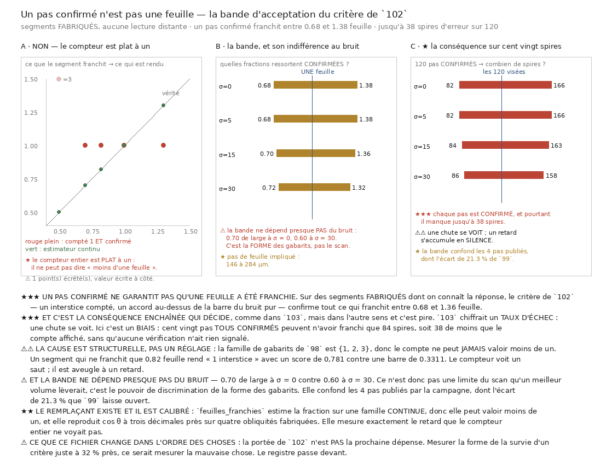

# 104 — Un pas confirmé n'est pas une feuille : la bande d'acceptation, et son biais silencieux

> ⛔⛔⛔ **Un pas confirmé ne garantit pas qu'une feuille a été franchie.** Le critère de `102`
> confirme tout ce qui franchit entre **0,68** et **1,38** feuille — soit un pas de feuille
> implicite de **144 à 293 µm** là où le nominal est 173.
>
> ⭐⭐⭐ **Et c'est la conséquence enchaînée qui décide, comme dans `103`, mais dans l'autre sens
> et c'est pire.** `103` chiffrait un **taux d'échec** : une chute se voit. Ici c'est un **biais** :
> cent vingt pas **tous confirmés** peuvent n'avoir franchi que **82 spires**, soit **38 de moins**
> que le compte affiché, sans qu'aucune vérification n'ait rien signalé.
>
> ⭐⭐ **Le remplaçant existe et il est calibré** : une famille **continue** rend la fraction, donc
> elle peut valoir moins de un, et elle reproduit `cos θ` à trois décimales près sur quatre
> obliquités fabriquées.



## 1. Pourquoi ce fichier, et c'est un contrôle qui l'impose

La suite annoncée après `103` était de relever la borne de `102` en payant trente pas au prix
plein. En construisant l'instrument qui devait la rendre lisible — un **registre** des feuilles
franchies, l'équivalent gratuit de ce que l'humain dit quand il corrige un transfert, *« tu es sur
la spire n »* — le contrôle de calibration a réfuté l'instrument **au premier lancement**, et en le
réfutant il a montré un défaut bien plus lourd dans le critère de `102` lui-même.

⚠ Ce fichier ne lit **pas une seule fois** le volume distant. La question porte sur le **critère**,
pas sur le rouleau : elle se tranche sur des segments dont on connaît la réponse. `103` a montré
qu'un bord se compte sur le corpus entier ; ici il n'y a pas de bord à compter, il y a un
instrument à calibrer, et un instrument se calibre sur du connu.

## 2. ⛔⛔⛔ Le compteur ne sait pas dire « moins d'une feuille »

La famille de gabarits de `98` est **{1, 2, 3}** — et « zéro interstice » n'y est pas exprimable,
délibérément et pour une raison écrite dans son propre fichier : un segment qui reste sur la même
feuille est plat, donc de norme nulle après centrage, donc sans accord possible. La conséquence
n'avait pas été tirée : **le compte ne peut jamais valoir moins de un.**

| feuille réellement franchie | compte entier | score | passe la barre ? | estimateur continu |
|---:|---:|---:|:---:|---:|
| 0,50 | 3 | 0,000 | non | **0,500** |
| 0,70 | **1** | 0,427 | **OUI** | **0,700** |
| 0,82 | **1** | 0,781 | **OUI** | **0,820** |
| 1,00 | 1 | 1,000 | OUI | 1,000 |
| 1,30 | **1** | 0,583 | **OUI** | **1,300** |

⛔⛔ **Et ce n'est pas seulement inexprimable : ça PASSE.** Un segment qui ne franchit que
**0,82** feuille rend « 1 interstice » avec un score de **0,781**, très au-dessus de la barre du
bruit pur (**0,3311**). Le compteur voit un **saut** — 2 ou 3 — et il est **aveugle à un retard**.

## 3. ⛔⛔⛔ La bande d'acceptation, mesurée

On balaie la fraction de feuille réellement franchie, on applique les **trois** conditions de `102`
telles quelles, et on publie l'intervalle où un pas ressort **confirmé** à la majorité des tirages.

| bruit σ | fraction basse | haute | largeur | spires après 120 pas | pas de feuille impliqué |
|---:|---:|---:|---:|:---:|:---:|
| 0 | **0,68** | 1,38 | 0,70 | **82 à 166** | 144 à 293 µm |
| 5 | 0,68 | 1,38 | 0,70 | 82 à 166 | 144 à 293 µm |
| 15 | 0,70 | 1,36 | 0,66 | 84 à 163 | 146 à 284 µm |
| 30 | 0,72 | 1,32 | 0,60 | 86 à 158 | 151 à 276 µm |

⚠⚠ **Et le fait qui surprend est que la bande ne dépend presque pas du bruit** — 0,70 de large à
σ = 0 contre 0,60 à σ = 30, et elle **se resserre** quand le bruit monte, parce que le bruit pousse
les scores limites sous la barre. Ce n'est donc **pas** une limite du scan qu'un meilleur volume
lèverait : c'est le pouvoir de discrimination de la **forme** des gabarits.

## 4. ⭐⭐⭐ La conséquence enchaînée, et pourquoi elle est pire qu'un taux d'échec

Si un pas confirmé ne franchit que $f$ feuille, alors $n$ pas confirmés n'en franchissent que
$n \cdot f$, et **chaque pas est confirmé**. Pour les cent vingt spires du graal :

$$ 120 \times 0{,}68 = 82 \quad \text{spires, soit } 38 \text{ de moins que le compte affiché.} $$

⭐⭐⭐ **C'est la même arithmétique que `103` et elle mord dans l'autre sens.** `103` chiffrait
$1-(1-p)^6$, la part des marches abîmées par un **taux d'échec** — et une chute se voit : le
marcheur s'arrête, le compteur de pas confirmés le dit. Ici il s'agit d'un **biais** : rien ne
s'arrête, rien n'est signalé, et un déroulage qui se croit à la spire 120 est à la spire 82.
**Une chute se voit ; un retard s'accumule en silence.**

⚠ Et l'erreur n'est pas symétrique en conséquence : 166 spires pour 120 pas veut dire que le
marcheur a **sauté** des feuilles, ce que le compteur *peut* voir (il rend 2 ou 3). C'est
l'extrémité **basse** de la bande qui est invisible, et c'est celle qui compte.

## 5. ⚠⚠ Ce que la bande ne distingue pas, et le lien avec la question ouverte de `99`

À σ = 15 la bande implique un pas de feuille entre **146,3** et **284,3 µm**, soit une tolérance de
**±94,3 %**. Les quatre pas que la campagne a publiés y tombent **tous** :

| pas publié | valeur | dans la bande ? |
|---|---:|:---:|
| nominal | 173,0 µm | oui |
| que la matière montre (`99`) | 198,9 µm | oui |
| que la matière montre au bord (`99`) | 214,1 µm | oui |
| des transferts humains (`deux_humains`) | 164,0 µm | oui |

⛔ **Donc le critère de vérification est aveugle à l'écart de 21,3 % que `99` laisse ouvert.** Ce
fichier ne l'explique pas — mais il dit ce qu'aucune des tranches `99` à `101` ne disait : *on ne
peut pas argumenter sur le pas à partir d'un pas confirmé*, la tolérance du critère étant quatre
fois plus large que l'écart discuté.

## 6. ⭐⭐ Le remplaçant, et il est calibré plutôt qu'affirmé

`feuilles_franchies` (dans `98`, à côté du compteur qu'elle remplace) estime la fraction sur une
famille **continue** de gabarits, donc elle peut valoir moins de un. Sur des piles fabriquées
obliques la réponse est connue d'avance — avancer du pas nominal le long du rayon sur une pile à
$\theta$ franchit $\cos\theta$ feuille — et l'estimateur la rend à **0,0022** près sur quatre
obliquités (0°, 20°, 35°, 50°). C'est cette prédiction extérieure qui le transforme d'idée en
instrument.

⚠⚠ **Deux gardes, pour deux pannes, et aucune ne couvre l'autre.**
- **Sous** la fenêtre, le score ne garde **rien** : un segment ne franchissant que 0,20 feuille
  ressort à 0,350 avec un score de **0,996**. Seul le drapeau de **butée** le dit.
- **Loin au-delà**, c'est l'inverse : l'ajustement n'accroche plus, l'argmax est arbitraire et
  n'est **pas** en butée — c'est le **score** qui écarte (0,050 à six périodes).

⚠ **Et chaque famille porte la barre de sa forme.** J'avais écrit ici qu'une famille continue
« trouve toujours une fréquence qui colle, donc son score ne peut pas servir de garde ». La mesure
dit autre chose : son p99 sur du bruit pur vaut **0,4018** contre **0,3475** pour la famille à trois
gabarits — plus haut, comme 1142 gabarits doivent l'être, mais de **15,6 %** seulement. Son score
**est** utilisable, à condition de ne pas emprunter la barre de `accord`.

## 7. ⭐ Ce que cette tranche change dans l'ordre des choses

⛔ **La portée de `102` n'est PAS la prochaine dépense.** Mesurer la forme de la survie d'un critère
juste à 32 % près, ce serait mesurer la mauvaise chose. Le registre passe devant.

⚠⚠ **Et les lignes déjà payées de `102` ne peuvent pas répondre à sa place**, ce qui est mesuré et
non supposé. Une médiane de quatre valeurs ne livre que $a_2 \le m \le a_3$ : la survie n'y est
bornée qu'à **0,5** près, donc un risque par pas **constant** de **0,056 à 0,546** y est également
compatible.

| pas | survie basse | survie haute | largeur |
|---:|---:|---:|---:|
| 1 | 0,429 | 0,929 | 0,500 |
| 3 | 0,161 | 0,589 | 0,429 |
| 6 | 0,018 | 0,321 | 0,304 |

⭐ **La leçon est générale et elle a coûté sept heures** : **un agrégat ne se désagrège pas.**
`102` a marché 224 fois en gardant une médiane par bande ; les étapes existaient, elles n'ont pas
été écrites, et aucune relecture ne les rend.

⚠ Le prix de la mesure de portée est chiffré d'avance depuis le coût mesuré par `103` : **5,35 h**
pour 840 étapes, que ce soit **28 × 3 × 10** (84 marches) ou **28 × 1 × 30** (28 marches). À budget
égal la couverture rend **trois fois plus** de chutes, donc c'est elle qu'il faudra payer — après
le registre.

## 8. Ce que cette tranche ne dit pas

- Elle ne mesure **pas** la fraction réellement franchie sur le vrai volume : `102` n'a pas gardé
  ses segments, et la relire coûterait la course entière. Ce que la bande donne est la **tolérance
  du critère**, pas le biais effectif du rouleau.
- Elle ne dit **pas** que le biais est systématique. Un retard aléatoire de moyenne nulle
  s'accumulerait en $\sqrt{n}$ et resterait tolérable ; c'est un **biais** qui coûte $n$. Lequel des
  deux se produit est exactement ce que le registre continu mesurera.
- Elle ne remplace **pas** `accord` pour la question « la matière a-t-elle répondu » : la famille à
  trois gabarits garde ce rôle, et les deux barres sont distinctes.

## Reproduire

```bash
uv run python src/nappe/combien_dinterstices_traverses.py --verifier
uv run python src/nappe/un_pas_confirme_nest_pas_une_feuille.py --verifier
uv run python src/nappe/un_pas_confirme_nest_pas_une_feuille.py \
    --json docs/mesures/un_pas_confirme_nest_pas_une_feuille.json
uv run python src/figures/figure_un_pas_confirme_nest_pas_une_feuille.py --verifier
```
