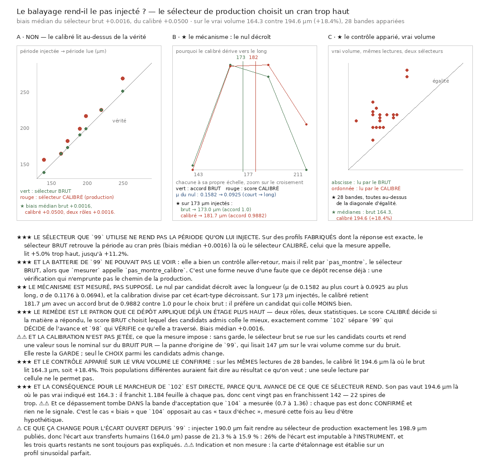

# 105 — Le balayage rend-il le pas injecté ? Le sélecteur de production choisit un cran trop haut

> ⛔⛔⛔ **Non.** Sur des profils **fabriqués** dont la réponse est exacte, le sélecteur **brut**
> retrouve la période au cran près (biais médian **+0,0016**) là où le sélecteur **calibré** — celui
> que `99` appelle réellement — lit **+5,0 %** trop haut, jusqu'à **+11,2 %**.
>
> ⛔⛔⛔ **Et la batterie de `99` ne pouvait pas le voir** : son contrôle aller-retour relit par
> `pas_montre`, le sélecteur **brut**, alors que `mesurer` appelle `pas_montre_calibre`. *Une
> vérification qui n'emprunte pas le chemin de la production.*
>
> ⭐⭐⭐ **Sur le vrai volume, contrôle apparié, 28 bandes × 120 cellules, mêmes lectures** : le
> calibré lit **194,6 µm** là où le brut lit **164,3** — soit **+18,4 %**. Et **164,3 µm** tombe sur
> la même case de grille que le pas des transferts humains (**164,0**).
>
> ⭐⭐⭐ **Conséquence directe pour le marcheur de `102`**, qui avance de ce que ce sélecteur rend :
> il franchit **1,184 feuille par pas**, donc cent vingt pas en franchissent **142** — **22 spires
> de trop** — et ce dépassement tombe **dans** la bande d'acceptation que `104` a mesurée, donc
> **chaque pas est confirmé et rien ne le signale**.



## 1. Pourquoi ce fichier, et c'est un contrôle fabriqué qui l'a ouvert

En calibrant un instrument sur un empilement **fabriqué** de pas **173,0 µm exactement**, le
minimum est ressorti à **181,7** — un cran de balayage au-dessus, sur une donnée sans le moindre
bruit. Un instrument qui ne rend pas ce qu'on lui injecte ne mesure pas ce qu'il prétend mesurer.

## 2. ⛔⛔⛔ Le contrôle de `99` exerce un autre chemin que sa mesure

`99` a bien un contrôle aller-retour — *« un pas injecté de X µm est retrouvé au cran près »* — et
il relit par **`pas_montre`**. Sa mesure, elle, appelle **`pas_montre_calibre`**. Le seul contrôle
capable de voir ce défaut regarde donc à côté.

⭐ C'est une forme neuve d'une faute que ce dépôt recense déjà sous *« une vérification incapable
d'échouer »* : ici elle peut échouer, mais **pas sur le code qui tourne**. La première assertion de
ce fichier est donc que le sélecteur audité **est** celui de la production, comparé sortie pour
sortie.

## 3. ⛔⛔ L'aller-retour, sur des périodes dont la réponse est exacte

| injecté | **brut** | **calibré** | **deux rôles** | dans la grille ? |
|---:|---:|---:|---:|:---:|
| 164,0 | 164,3 (+0,002) | 164,3 (+0,002) | 164,3 (+0,002) | non |
| **173,0** | **173,0 (+0,000)** | **181,7 (+0,050)** | **173,0 (+0,000)** | **oui** |
| 190,0 | 190,3 (+0,002) | 198,9 (+0,047) | 190,3 (+0,002) | non |
| 198,9 | 198,9 (+0,000) | 216,2 (+0,087) | 198,9 (+0,000) | non |
| 250,0 | 250,9 (+0,003) | 268,2 (+0,073) | 250,9 (+0,003) | non |

Biais relatif médian sur toute la grille : **brut +0,0016**, **calibré +0,0500**, **deux rôles
+0,0016**, et le calibré monte jusqu'à **+0,112**.

⚠ Une période **qui est un candidat** doit ressortir elle-même. Le brut le fait ; le calibré non.

## 4. ⭐⭐⭐ Le mécanisme, mesuré et non supposé

Le nul par candidat **décroît avec la longueur** — un segment court rééchantillonné est
sur-échantillonné, donc plus lisse, donc il corrèle mieux :

| candidat | $\mu$ du nul | $\sigma$ du nul |
|---|---:|---:|
| le plus court (86,5 µm) | **0,1582** | **0,1176** |
| le plus long (346,0 µm) | **0,0925** | **0,0694** |

et la calibration divise par cet écart-type décroissant. Sur **173 µm** injectés :

| sélecteur | candidat retenu | accord **brut** de ce candidat |
|---|---:|---:|
| brut | 173,0 µm | **1,0000** |
| calibré | **181,7 µm** | **0,9882** |

⭐⭐⭐ **Le calibré retient donc un candidat qui colle MOINS bien.** Ce n'est pas du bruit, c'est de
l'arithmétique : la calibration est juste pour la question *« ce candidat dépasse-t-il le bruit ? »*
et fausse pour la question *« lequel colle le mieux ? »*. **Deux questions, une seule statistique.**

## 5. ⭐⭐⭐ Le remède : deux rôles, deux statistiques

Le score **calibré** décide si la matière a répondu ; le score **brut** choisit lequel des candidats
**admis** colle le mieux. C'est exactement la séparation que `102` a imposée un étage plus haut,
entre `99` qui **décide** de l'avance et `98` qui **vérifie** ce qu'elle a traversé.

⚠⚠ **Et la calibration n'est pas jetée**, ce que la mesure impose : sans garde, le sélecteur brut se
rue sur les candidats courts et rend une valeur **sous le nominal** sur du **bruit pur** — la panne
d'origine de `99`, qui lisait 147 µm sur le vrai volume comme sur du bruit. Elle reste la **garde** ;
seul le **choix** parmi les candidats admis change. Le sélecteur à deux rôles **refuse** d'ailleurs
d'être appelé sans barre, plutôt que de retomber silencieusement sur le brut.

## 6. ⭐⭐⭐ Le contrôle apparié sur le vrai volume

28 bandes × 120 cellules, **une seule lecture par cellule**, trois sélecteurs qui choisissent dans
les **mêmes** profils, sous la **même** garde. 156 s de mesure.

| | brut | calibré | deux rôles |
|---|---:|---:|---:|
| cœur | 155,7 | 181,7 | 155,7 |
| milieu | 164,3 | 198,9 | 164,3 |
| bord | 168,7 | 196,8 | 168,7 |
| **toutes bandes** | **164,3** | **194,6** | **164,3** |

> ⭐ **+30,3 µm, soit +18,4 %**, sur les mêmes profils. Et **28 bandes sur 28** sont au-dessus de la
> diagonale d'égalité : l'effet est uniforme, pas un accident de quelques bandes.

⚠⚠ **Le pilote à deux bandes disait +6,75 %.** Le corpus dit **+18,4 %**, soit près de trois fois
plus. C'est la leçon de `103` qui se rejoue, cette fois en ma faveur — et elle vaut dans les deux
sens : *on ne publie pas sur les bandes qu'on a sondées*.

## 7. ⭐⭐⭐ Le contrôle qui autorise à publier la nouvelle valeur

Une valeur plus proche des transferts humains **qui serait un artefact du sélecteur** serait la pire
issue possible. `99` impose à sa longueur de **différer de celle que le même sélecteur rend sur du
bruit pur** ; ce contrôle est refait **pour chacun des trois**, sous la même garde :

| sélecteur | réel | nul | D | p | diffère ? |
|---|---:|---:|---:|---|:---:|
| brut | 164,3 | 259,5 | 0,706 | 9,66e-08 | oui |
| calibré | 194,6 | 276,8 | 0,638 | 2,86e-06 | oui |
| **deux rôles** | **164,3** | **276,8** | **0,738** | **1,65e-08** | **oui** |

⭐⭐ **Le remède a la séparation la plus FORTE des trois.** Le nombre court n'est donc pas ce que le
bruit produit — il en est plus loin que ne l'était le nombre publié.

## 8. ⚠⚠ Ce que cela fait à l'écart ouvert depuis `99`, et une tension à dire

Deux estimations, et elles **ne s'accordent pas** :

- **Par inversion de la carte d'étalonnage fabriquée** : injecter **190,0 µm** fait rendre au
  sélecteur de production exactement les **198,9** que `99` publie, donc l'écart aux transferts
  humains passerait de **21,3 %** à **15,9 %** — **25,5 %** de l'écart imputable à l'instrument.
- **Par le contrôle apparié sur le vrai volume** : le remède lit **164,3 µm**, ce qui tombe sur la
  même case de grille que les **164,0** des transferts humains.

⚠⚠⚠ **La seconde est la mesure, la première est une indication** — et leur désaccord est
lui-même informatif : la carte d'étalonnage est établie sur un profil **sinusoïdal parfait**, où le
biais du calibré vaut +5 %, alors que sur les profils **réels** il vaut **+18,4 %**. Les profils
réels ne se comportent donc pas comme des sinusoïdes, et l'inversion fabriquée est une **borne
inférieure** de la part imputable à l'instrument.

⚠ **Et la précision revendiquée est celle de la grille, pas de la décimale** : le cran du balayage
vaut **8,65 µm**, soit 5,3 % du pas. Dire que 164,3 et 164,0 « s'accordent » veut dire *dans la même
case*, pas *à 0,2 % près*.

⭐⭐ **Le sens de l'écart au nominal s'inverse** : `99` publiait un pas **supérieur** au nominal de
173 (×1,15) ; corrigé, il lui est **inférieur** (×0,95).

## 9. ⭐⭐⭐ La conséquence pour le marcheur, et c'est le lien avec `104`

Le marcheur de `102` avance de ce que `pas_que_la_matiere_dicte` rend, donc du sélecteur **calibré**.

$$ \frac{194{,}6}{164{,}3} = 1{,}184 \text{ feuille par pas} \qquad\Rightarrow\qquad 120 \text{ pas} = 142 \text{ spires} $$

**22 spires de trop sur cent vingt.** Et `104` a mesuré que le critère de confirmation accepte tout
ce qui franchit entre **0,70** et **1,36** feuille : **1,184 est dedans**, donc **chaque pas est
confirmé et rien ne le signale**.

⭐⭐⭐ **C'est exactement le cas « biais » que `104` opposait au cas « taux d'échec », mesuré cette
fois au lieu d'être hypothétique.** `104` disait qu'un déroulage pouvait se croire à la spire 120 en
étant à 82 ; `105` mesure le contraire de signe — il serait à **142** — et pour la même raison :
*une chute se voit, un décalage s'accumule en silence*.

## 10. Ce que cette tranche ne dit pas

- Elle ne dit **pas** que le pas de la matière **vaut** 164,3 µm. Elle dit que le sélecteur qui rend
  ce qu'on lui injecte lit 164,3 là où celui de la production lit 194,6, sur les mêmes profils.
- Elle ne **corrige pas** les mesures antérieures : `99`, `100`, `101` et `102` ont tous été
  calculés avec le sélecteur biaisé, et les republier demande de les relancer, pas de les diviser
  par un facteur.
- Elle ne dit **rien** de l'anomalie que `100` laisse ouverte — la période presque identique dans
  deux directions séparées de 34°, qu'un empilement parallèle interdit. ⚠ Mais elle la rend plus
  urgente : si le sélecteur dérive, la comparaison de deux directions faite avec lui hérite de
  cette dérive.
- ⚠ Le biais mesuré est celui de **ce** fragment, de **cette** fenêtre de balayage (86,5 à 346,0 µm,
  31 candidats) et de **ce** cran (8,65 µm). Une fenêtre plus fine ou plus large aurait un autre nul
  par candidat, donc un autre biais.

## Reproduire

```bash
uv run python src/nappe/le_balayage_rend_il_le_pas_injecte.py --verifier
uv run python src/nappe/le_balayage_rend_il_le_pas_injecte.py --cellules 120 \
    --json docs/mesures/le_balayage_rend_il_le_pas_injecte.json
uv run python src/figures/figure_le_balayage_rend_il_le_pas_injecte.py --verifier
```
