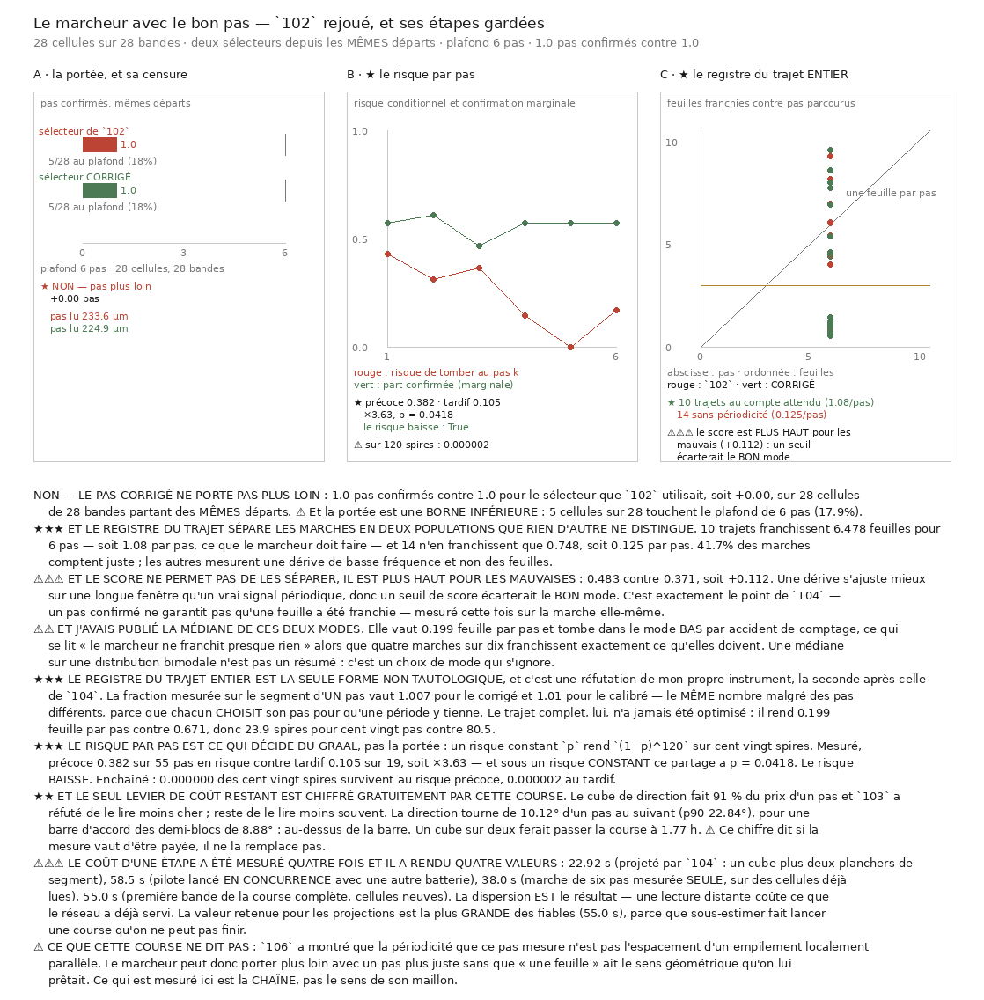

# 107 — Le marcheur avec le bon pas : deux populations que rien d'autre ne distingue

> ⛔ **Le pas corrigé ne porte pas plus loin** : **1,0** pas confirmés contre **1,0**, sur 28
> cellules de 28 bandes partant des mêmes départs. ⚠ Et la portée est une **borne inférieure** :
> 5 cellules sur 28 touchent le plafond de six pas (**17,9 %**).
>
> ⭐⭐⭐ **Mais le risque par pas BAISSE, et c'est le premier résultat structurel positif de la
> campagne.** Précoce **0,382** sur 55 pas en risque, tardif **0,105** sur 19 — soit **×3,63**, et
> sous un risque **constant** ce partage a **p = 0,0418**. *La difficulté est de s'accrocher, pas de
> porter.* ⚠ Mais enchaîné, même le risque tardif tue : **0,000002** des cent vingt spires survivent.
>
> ⭐⭐⭐ **Et le registre du trajet entier sépare les marches en DEUX populations que rien d'autre ne
> distingue** : **10** trajets franchissent **6,478** feuilles pour six pas — **1,08 par pas**, ce
> que le marcheur doit faire — et **14** n'en franchissent que **0,748**, soit **0,125 par pas**.
>
> ⚠⚠⚠ **Et le score ne permet pas de les séparer : il est PLUS HAUT pour les mauvaises**
> (**0,483** contre **0,371**). Un seuil de score écarterait donc le **bon** mode.



## 1. Pourquoi ce fichier, et trois tranches l'imposent

`102` a mesuré que la matière porte deux pas confirmés, avec un marcheur dont `105` a montré que le
pas est **+18,4 % trop grand**. Refaire la marche avec le sélecteur corrigé est la relance qui
compte, parce que c'est celle qui **est** le graal — les autres rendraient des nombres justes pour
une quantité dont `106` a montré que le sens reste ouvert.

⭐⭐ **Et elle répond en même temps aux deux questions que `104` a laissées, parce que cette fois les
étapes sont gardées.** `102` a marché 224 fois en ne conservant qu'une médiane par bande ; *un
agrégat ne se désagrège pas*, et aucune relecture ne rend ce qui n'a pas été écrit.

⭐⭐⭐ **La comparaison est appariée par le DÉPART**, la seule forme honnête pour une marche : les
deux marcheurs partent de la même cellule avec le même sens, puis divergent parce que leurs pas les
mènent ailleurs. Apparier les *lectures* est impossible pour une marche ; apparier les départs l'est,
et `102` le faisait déjà entre le marcheur et le témoin naïf.

## 2. ⭐⭐⭐ Le risque par pas, et c'est lui qui décide

| pas | en risque | tombées | risque | part confirmée |
|---:|---:|---:|---:|---:|
| 1 | 28 | 12 | **0,429** | 0,571 |
| 2 | 16 | 5 | 0,312 | 0,607 |
| 3 | 11 | 4 | 0,364 | 0,464 |
| 4 | 7 | 1 | **0,143** | 0,571 |
| 5 | 6 | 0 | **0,000** | 0,571 |
| 6 | 6 | 1 | 0,167 | 0,571 |

Précoce (pas 1 à 3) **0,382**, tardif (pas 4 à 6) **0,105**, rapport **×3,63**, et
**p = 0,0418** sous un risque constant.

> ⭐ **Le risque baisse.** La difficulté est de **s'accrocher**, pas de **porter** — donc le remède
> est un meilleur départ, pas un meilleur marcheur.

⚠⚠ **Mais il ne baisse pas assez, et c'est l'arithmétique qui tranche** : $(1-0{,}105)^{120} =
2\cdot10^{-6}$. Même le risque tardif tue cent vingt spires enchaînées.

⚠ Et les deux tiers sont **déclarés dans la signature**, donc avant de voir les chiffres. Le
résultat est **mince** : 19 pas en risque dans le tiers tardif, et $p = 0{,}0418$ frôle le seuil.

## 3. ⭐⭐⭐ Le registre du trajet entier, et la réfutation de mon propre instrument

⚠⚠⚠ **La fraction mesurée sur le segment d'UN pas est tautologique, et c'est mesuré** : les deux
sélecteurs y rendent **1,007** et **1,010** — le même nombre malgré des pas de **224,9** et
**233,6 µm** — parce que chacun **choisit** son pas pour qu'une période y tienne. C'est la seconde
réfutation d'un registre après celle de `104`, et par une autre route.

⭐⭐⭐ **Ce qui n'est pas tautologique est le trajet ENTIER** : le marcheur a optimisé chaque pas
séparément, jamais la concaténation. Le compte de franchissements est **topologique**, donc lisible
sur une polyligne comme sur une droite.

| sélecteur | mode | trajets | feuilles pour 6 pas | par pas | score |
|---|---|---:|---:|---:|---:|
| **corrigé** | au compte attendu | **10** | **6,478** | **1,08** | 0,371 |
| **corrigé** | sans périodicité | **14** | **0,748** | **0,125** | **0,483** |
| de `102` | au compte attendu | 12 | **6,51** | 1,085 | **0,379** |
| de `102` | sans périodicité | 11 | **0,695** | 0,116 | **0,539** |

> ⭐ **41,7 %** des marches du corrigé comptent juste ; les autres mesurent une **dérive de basse
> fréquence** et non des feuilles. ⭐ **Et les deux sélecteurs se séparent de la même façon** — la
> bimodalité n'est donc pas un artefact du sélecteur, c'est une propriété de la matière lue sur
> 1 100 à 1 500 µm.

⚠⚠⚠ **Et le score est PLUS HAUT pour les mauvaises** (**+0,112**) : une dérive s'ajuste mieux sur
une longue fenêtre qu'un vrai signal périodique. **Un seuil de score écarterait donc le bon mode.**
C'est exactement le point de `104` — *un pas confirmé ne garantit pas qu'une feuille a été
franchie* — mesuré cette fois sur la marche elle-même.

## 4. ⚠⚠ Une médiane sur une distribution bimodale n'est pas un résumé

J'ai publié la médiane de ces deux modes : **0,199** feuille par pas. Elle tombe dans le mode **bas**
par accident de comptage et se lit *« le marcheur ne franchit presque rien »*, alors que quatre
marches sur dix franchissent exactement ce qu'elles doivent.

> ⚠ **C'est un choix de mode qui s'ignore.** Le seuil qui les sépare est **dérivé** — la moitié du
> compte attendu, soit **3** feuilles pour 6 pas — et non réglé : un trajet qui a franchi moins de la
> moitié de ce qu'il devait ne mesure pas des feuilles.

⚠ Et la conséquence enchaînée de cette médiane trompeuse se lit d'un coup : elle donnerait **23,9**
spires pour cent vingt pas avec le sélecteur corrigé et **80,5** avec celui de `102` — deux nombres
qui ne veulent rien dire, parce qu'ils moyennent des marches qui comptent juste avec des marches qui
ne comptent rien.

⭐ Et « bimodal » n'est revendiqué qu'avec les **effectifs** : cinq trajets de chaque côté au
minimum, sinon c'est une figure de style.

## 5. ⛔ L'optimisation, chiffrée par la même course et refusée

Le cube de direction fait **91 %** du prix d'un pas (14,88 s contre 0,76 et 0,70 pour les deux
segments), et monter les fils de 32 à 96 ne gagne rien — **14,88 → 15,62 s**, légèrement pire : la
lecture suit les **plages d'octets**, pas la latence, ce que `103` a mesuré. `103` a par ailleurs
réfuté de lire le cube **moins cher**. Restait de le lire **moins souvent**.

> ⛔ **Non.** La direction tourne de **10,12°** d'un pas au suivant (p90 **22,84°**) pour une barre
> d'accord des demi-blocs de **8,88°** : **au-dessus de la barre**. Deux pas consécutifs ne
> partagent donc pas une direction au sens de l'instrument qui la mesure.

⚠ Un cube sur deux ferait passer la course à **1,77 h** — mais le chiffre dit que la mesure ne vaut
pas d'être payée, et il l'a dit **sans une lecture de plus**, parce que les étapes sont gardées.

## 6. ⚠⚠⚠ Le coût d'une étape, mesuré quatre fois, quatre valeurs

| secondes | condition | mesuré ? |
|---:|---|:---:|
| 22,92 | projeté par `104` : un cube plus deux planchers de segment | non |
| **58,5** | pilote lancé **en concurrence** avec une autre batterie | oui |
| **38,0** | marche de six pas mesurée **seule**, sur des cellules déjà lues | oui |
| **55,0** | première bande de la course complète, cellules **neuves** | oui |

⭐ **La dispersion EST le résultat** : une lecture distante coûte ce que le réseau a déjà servi, et
une marche se **déplace**, donc touche des morceaux jamais atteints. ⚠ *Un coût mesuré sous
contention n'est pas un coût* — la valeur de 58,5 est exclue des projections. Et c'est la **plus
grande des fiables** (55,0) qui sert, parce que sous-estimer fait lancer une course qu'on ne peut
pas finir. Course réelle : **3,53 h** pour 336 étapes, projetée à 5,13.

## 7. ⭐ Les contrôles fabriqués, qui rendent le reste lisible

Sur une pile fabriquée **droite** de pas 173,0 µm, le sélecteur corrigé lit **173,0** et son registre
de trajet rend **6,015** feuilles pour six pas (écart **0,015**). Le calibré rend **6,285**
(écart **0,285**).

⚠⚠ **Mais « le calibré lit plus haut » n'est PAS asserté ici, il est rapporté** : le marcheur lit des
positions **arrondies au voxel**, donc un escalier et non un cosinus, et les deux sélecteurs y
rendent 173,0. Le biais de `105` est mesuré sur des profils analytiques **et** sur le vrai volume ;
l'asserter ici ferait dépendre le contrôle d'un effet de quantification sans rapport avec ce qu'il
nomme.

## 8. Ce que cette course ne dit pas

- Elle ne dit **pas** que « une feuille » a le sens géométrique qu'on lui prêtait : `106` a montré
  que la périodicité que ce pas mesure n'est pas l'espacement d'un empilement localement parallèle.
  **Ce qui est mesuré ici est la chaîne, pas le sens de son maillon.**
- Elle ne se compare **pas** directement à `102` : celui-ci prenait 4 cellules par bande et une
  autre graine, et publiait une médiane de médianes par bande. Les deux nombres ne portent pas sur
  la même population.
- ⚠ Le risque tardif tient sur **19 pas en risque** et $p = 0{,}0418$. C'est mince, et une course
  plus large est ce qu'il faudrait pour le tenir.
- ⚠ Le verdict porte sur **ce** plafond (six pas) et **cette** allocation (une cellule par bande) ;
  couvrir bat approfondir pour compter des chutes, mais 28 marches par sélecteur restent peu.

## Reproduire

```bash
uv run python src/nappe/le_marcheur_avec_le_bon_pas.py --verifier
uv run python src/nappe/le_marcheur_avec_le_bon_pas.py --cellules 1 --pas 6 \
    --json docs/mesures/le_marcheur_avec_le_bon_pas.json
uv run python src/figures/figure_le_marcheur_avec_le_bon_pas.py --verifier
```
