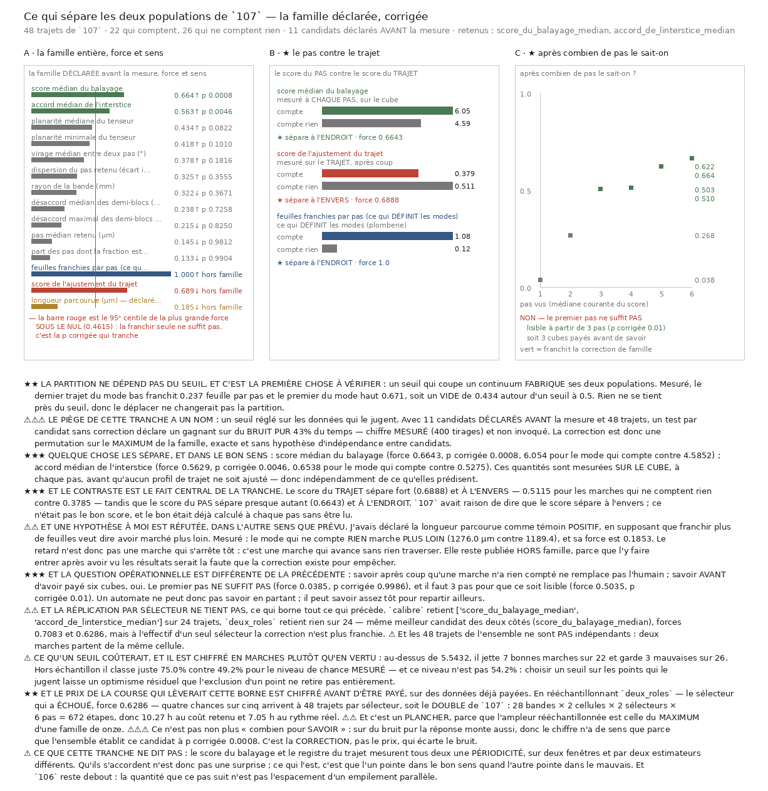

# 108 — Ce qui sépare les deux populations de `107`

> ⭐⭐⭐ **Quelque chose les sépare, et dans le BON sens.** Sur onze candidats **déclarés avant la
> mesure**, deux survivent à la correction de famille : le **score médian du balayage**
> (force **0,664**, p corrigée **0,0008** ; **6,054** pour les marches qui comptent contre
> **4,585**) et l'**accord médian de l'interstice** (force **0,563**, p corrigée **0,0046**).
> Les deux sont mesurés **sur le cube, à chaque pas**, avant qu'aucun profil de trajet ne soit
> ajusté.
>
> ⭐⭐⭐ **Et le fait central est un CONTRASTE.** Le score du **trajet** sépare fort (**0,689**) et
> **à l'envers** — 0,511 pour les marches qui ne comptent rien contre 0,379 — tandis que le score
> du **pas** sépare presque autant (**0,664**) et **à l'endroit**. `107` avait raison de dire que
> le score sépare à l'envers : ce n'était pas le bon score, et le bon était **déjà calculé à chaque
> pas** sans jamais être lu.
>
> ⚠⚠ **Mais le premier pas ne suffit pas** (force 0,038, p corrigée 0,9986). Il en faut **trois**
> (force 0,503, p corrigée 0,0100) pour que le signal soit lisible. Un automate ne peut pas savoir
> en partant ; il peut savoir assez tôt pour **repartir ailleurs**.
>
> ⚠⚠ **Et la réplication par sélecteur ne tient pas** : `calibre` retient les deux, `deux_roles`
> n'en retient **aucun** — même meilleur candidat des deux côtés, mais à l'effectif d'un seul
> sélecteur la correction n'est plus franchie. Les 48 trajets de l'ensemble ne sont **pas
> indépendants** : deux marches partent de la même cellule.



## 1. Pourquoi ce fichier, et la reprise le nommait en premier

`107` a mesuré que les marches se séparent en deux populations : les unes franchissent ~1,1 feuille
par pas — ce que le marcheur doit faire — les autres ~0,12, c'est-à-dire rien. Les deux sélecteurs
se séparent de la même façon, donc c'est une propriété de la **matière**. Et aucun critère existant
ne les distinguait.

> ⭐⭐⭐ **Trouver ce qui les sépare EST le graal** : ce serait le signal qu'un automate lit pour
> savoir s'il est encore sur la feuille — c'est-à-dire exactement ce qui remplace l'humain qui
> corrige le transfert de spire à spire.

⭐⭐ **Et cette tranche est gratuite.** `107` a gardé ses étapes, et chaque étape porte des
quantités mesurées **sur le cube** : le désaccord des deux demi-blocs, la planarité du tenseur, le
pas retenu, l'accord de l'interstice, la butée. Le registre du trajet — celui qui **définit** les
deux modes — est calculé après, sur la polyligne entière. Les candidats sont donc mesurés
**indépendamment de la quantité qu'ils doivent prédire**, ce que la consigne de reprise exigeait
explicitement. **Zéro lecture distante, zéro seconde de course.**

## 2. ⚠⚠⚠ Le piège de cette tranche a un nom, et il est chiffré avant tout résultat

Un seuil réglé sur les données qui le jugent. Avec **onze** candidats et **quarante-huit** trajets,
un test par candidat sans correction déclare un gagnant sur du **bruit pur** **42,7 %** du temps —
et ce chiffre est **mesuré** (400 tirages, `combien_de_faux_gagnants_sans_correction`) plutôt
qu'invoqué. Avec un seul candidat il retombe à **7 %**, donc c'est bien la multiplicité qu'on
mesure et non un défaut du test. La correction de famille repose, elle, sur **5000** permutations.

Trois gardes en découlent, et elles sont dans le code plutôt que dans la prose :

| garde | où elle vit | ce qu'elle empêche |
|---|---|---|
| la famille est **déclarée avant** de regarder | `CANDIDATS`, en tête du module | que le gagnant soit le survivant d'une sélection invisible |
| la correction est une permutation sur le **maximum** de la famille | `nul_de_la_plus_grande_separation` | qu'une division par onze suppose une indépendance que la planarité et le désaccord n'ont pas |
| un seuil est chiffré **en coût**, et validé **hors échantillon** | `ce_quun_seuil_couterait` | qu'un seuil optimiste par construction passe pour un critère |

> ⚠ Le 95ᵉ centile de la plus grande force **sous le nul** vaut **0,4615**. Cinq des onze candidats
> franchissent 0,32 ; seuls deux franchissent la correction. C'est exactement la marge sur laquelle
> un critère inexistant paraîtrait exister.

## 3. ⭐⭐ La partition ne dépend pas du seuil, et c'est la première chose à vérifier

Un seuil qui coupe un continuum **fabrique** ses deux populations, et tout ce qui suivrait
mesurerait un artefact de découpe.

Mesuré : le dernier trajet du mode bas franchit **0,237** feuille par pas, le premier du mode haut
**0,671**, pour un seuil à **0,5** — soit un **vide de 0,434 feuille par pas** autour du seuil, et
c'est aussi le plus grand vide de toute la distribution.

> ⭐ **Rien ne se tient près du seuil**, donc le déplacer ne changerait pas la partition. Le seuil
> de `107` est dérivé (la moitié du compte attendu) *et* il tombe dans un trou.

## 4. ⭐⭐⭐ La famille entière, et ce qu'elle rend

Onze candidats, chacun réduit à **une** valeur par trajet, la réduction étant déclarée avec le
candidat. Force = part des paires bien ordonnées ramenée à $[0,1]$ ; ↑ veut dire *plus grand pour
les marches qui comptent*.

| candidat | force | p brute | p corrigée | compte | compte rien |
|---|---:|---:|---:|---:|---:|
| **score médian du balayage** | **0,664** ↑ | 0,0002 | **0,0008** | 6,054 | 4,585 |
| **accord médian de l'interstice** | **0,563** ↑ | 0,0012 | **0,0046** | 0,654 | 0,528 |
| planarité médiane du tenseur | 0,434 ↑ | 0,0090 | 0,0822 | 0,691 | 0,603 |
| planarité minimale du tenseur | 0,418 ↑ | 0,0138 | 0,1010 | 0,607 | 0,431 |
| virage médian entre deux pas | 0,378 ↑ | 0,0252 | 0,1816 | 15,27° | 10,03° |
| dispersion du pas retenu | 0,325 ↑ | 0,0534 | 0,3555 | 0,502 | 0,399 |
| rayon de la bande | 0,322 ↓ | 0,0566 | 0,3671 | 14,35 mm | 18,06 mm |
| désaccord médian des demi-blocs | 0,238 ↑ | 0,1556 | 0,7258 | 7,66° | 6,82° |
| désaccord maximal des demi-blocs | 0,215 ↓ | 0,2020 | 0,8250 | 18,34° | 21,34° |
| pas médian retenu | 0,145 ↓ | 0,3877 | 0,9812 | 203,25 µm | 224,9 µm |
| part des pas en butée | 0,133 ↓ | 0,4137 | 0,9904 | 0,000 | 0,167 |

Et les trois quantités **hors famille**, qui ne peuvent rien gagner :

| témoin | rôle | force | ce qu'il vérifie |
|---|---|---:|---|
| feuilles franchies par pas | positif | **1,000** ↑ | la plomberie : la quantité qui *définit* les modes doit les séparer parfaitement |
| score de l'ajustement du trajet | négatif | **0,689** ↓ | que le **sens** est lu, et il sépare bien à l'envers |
| longueur parcourue | hypothèse **réfutée** | 0,185 ↓ | — |

⚠⚠ **Trois candidats montent dans le sens attendu sans franchir la correction** — planarité (deux
formes) et virage. Ce ne sont pas des non-résultats : ce sont des quantités dont l'effectif ne
décide pas. Les publier avec leur p corrigée plutôt que de les taire est ce qui laisse une course
plus large les trancher.

## 5. ⭐⭐⭐ Le contraste, et c'est le fait central

Deux scores de périodicité, deux fenêtres, deux sens opposés :

| | mesuré sur | quand | compte | compte rien | sens |
|---|---|---|---:|---:|---|
| score du **balayage** | le segment d'**un pas** (~230 µm) | **pendant** la marche | 6,054 | 4,585 | **à l'endroit** |
| score du **trajet** | la polyligne **entière** (~1250 µm) | après coup | 0,379 | 0,511 | **à l'envers** |

> ⭐⭐⭐ **`107` avait raison sur le fait et tort sur la portée.** « Le score sépare à l'envers » est
> vrai du score qu'il mesurait, et faux du score que le marcheur calcule à chaque pas et n'utilise
> que comme garde binaire.

⚠⚠ **Le mécanisme est nommé plutôt que supposé.** Une dérive de basse fréquence s'ajuste d'autant
mieux qu'on lui laisse une longue fenêtre : sur 1250 µm, un profil sans feuille trouve un maximum
confortable à moins d'une période, avec un bon score. Sur 230 µm la fenêtre est trop courte pour
qu'une dérive y passe pour une périodicité, donc le score y mesure ce qu'il prétend mesurer.

## 6. ⚠⚠ Une hypothèse à moi, réfutée dans l'autre sens que prévu

J'avais déclaré la **longueur parcourue** comme témoin **positif**, en supposant que franchir plus
de feuilles veut dire avoir marché plus loin.

Mesuré : le mode qui ne compte **rien** marche **plus loin** — **1276,0 µm** contre **1189,4** — pour
une force de 0,185, c'est-à-dire pas de séparation utilisable.

> ⭐ **Le retard n'est donc pas une marche qui s'arrête tôt : c'est une marche qui avance sans rien
> traverser.** C'est un fait sur la matière, et il interdit la lecture rassurante de `107`.

⚠⚠⚠ **Et la correction de ce témoin n'a PAS touché la famille.** La reclasser en candidat après
avoir vu les résultats serait exactement la faute que la correction existe pour empêcher. Elle
reste dehors, sous son vrai statut, et **aucune p corrigée des onze candidats n'a bougé** — le
maximum est pris sur la famille seule, donc ajouter ou retirer un témoin ne peut rien y changer.

## 7. ⭐⭐⭐ La question opérationnelle : après combien de pas le sait-on ?

Savoir **après coup** qu'une marche n'a rien compté ne remplace pas l'humain. Savoir **avant**
d'avoir payé six cubes, si. Une seule quantité est interrogée — le score du balayage, celle que la
famille a retenue — et ce qui varie est la **longueur de ce qu'on a vu**.

| pas vus | force | p corrigée | justes hors échantillon |
|---:|---:|---:|---:|
| 1 | 0,038 | 0,9986 | 0,521 |
| 2 | 0,268 | 0,2959 | 0,479 |
| **3** | **0,503** | **0,0100** | **0,688** |
| 4 | 0,5105 | 0,0086 | 0,771 |
| 5 | 0,622 | 0,0008 | 0,708 |
| 6 | 0,664 | 0,0004 | 0,750 |

> ⛔ **Le premier pas ne suffit pas.** Il en faut **trois**, soit **trois cubes payés avant de
> savoir** — 165 s au coût mesuré par `107`.

⚠ La correction sur les six longueurs est faite quand même, par la même permutation : une courbe de
six points offre six occasions de trouver un maximum.

## 8. ⚠ Ce qu'un seuil coûterait, chiffré en marches plutôt qu'en vertu

Au-dessus de **5,5432** sur le score médian du balayage :

- **7 bonnes marches jetées** sur 22 ;
- **3 mauvaises gardées** sur 26 ;
- hors échantillon, **75,0 %** de classements justes.

⚠⚠⚠ **Et le niveau de chance n'est PAS 54,2 %.** Choisir un seuil sur les points qui le jugent
laisse un optimisme résiduel que l'exclusion d'un point ne retire pas entièrement : mesuré sur
200 tirages de bruit au même effectif, un seuil obtient **49,2 %** hors échantillon. C'est **ce
niveau-là** que 75,0 % doit battre, et il le bat.

> ⚠⚠ **Et la loi hors échantillon est en U, donc c'est la MOYENNE qui la résume.** Sur 600 tirages
> à dix contre dix : moyenne **0,512**, médiane **0,575**, et **37,5 %** des tirages tombent
> **sous** le hasard. Un seuil a un **sens** : chaque tirage tombe du bon côté ou du mauvais.
> ⚠ C'est la faute que `107` a payée sur les feuilles par pas, **repayée une tranche plus loin dans
> un autre fichier** — et attrapée cette fois par une sonde plutôt qu'après publication.

## 9. ⚠⚠ Ce que cette tranche ne dit pas

- **La réplication par sélecteur ne tient pas.** `calibre` (12 / 12) retient les deux candidats ;
  `deux_roles` (10 / 14) n'en retient aucun, avec pourtant le **même meilleur candidat** et une
  force de 0,629. À l'effectif d'un seul sélecteur, la correction n'est plus franchie. Les 48
  trajets de l'ensemble **ne sont pas indépendants** : deux marches partent de la même cellule.
- **Les deux quantités retenues sont corrélées entre elles** — l'accord de l'interstice est lui
  aussi tiré d'un ajustement périodique sur le segment d'un pas. La correction traite la
  multiplicité, elle ne fait pas de ces deux lignes deux résultats.
- **Le score du balayage et le registre du trajet mesurent tous deux une périodicité.** Qu'ils
  s'accordent n'est donc pas une surprise ; ce qui l'est, c'est que l'un pointe dans le bon sens
  quand l'autre pointe dans le mauvais.
- **`106` reste debout** : la quantité que ce pas suit n'est pas l'espacement d'un empilement
  localement parallèle. Un signal lisible ne rend pas son sens géométrique.

## 10. ⭐⭐ Le prix de la course qui déciderait, chiffré avant d'être payé

La réplication échoue à **24** trajets par sélecteur. « Il en faudrait plus » est une phrase ;
combien, et pour combien d'heures, est un chiffre — et il se calcule sur des données déjà payées,
en rééchantillonnant `deux_roles`, le sélecteur qui a **échoué**, dont la force observée est
**0,6286**.

| trajets par sélecteur | force critique | le meilleur retenu | un candidat retenu |
|---:|---:|---:|---:|
| 24 | 0,6357 | 0,573 | 0,627 |
| 36 | 0,5333 | 0,770 | 0,820 |
| **48** | **0,4501** | **0,897** | 0,947 |
| 72 | 0,3842 | 1,000 | 1,000 |
| 96 | 0,3175 | 1,000 | 1,000 |
| 144 | 0,2566 | 1,000 | 1,000 |

> ⭐ **Quatre chances sur cinq à partir de 48 trajets par sélecteur** — exactement le **double** de
> `107`. Soit **28** bandes × **2** cellules × 2 sélecteurs × 6 pas = **672 étapes**, donc
> **10,27 h** au coût retenu (**55,0** s/étape) et **7,05 h** au rythme réel de `107`
> (**37,8** s/étape).

⚠⚠ **Et c'est un PLANCHER**, pour une raison qui a un nom : l'ampleur rééchantillonnée est celle
du **maximum** d'une famille de onze, et un maximum surestime ce qu'il mesure — la malédiction du
vainqueur.

⚠⚠⚠ **Et ce n'est pas « combien de marches pour SAVOIR ».** La batterie le mesure sur son propre
témoin : sur une table de **bruit pur**, le meilleur candidat porte une force non nulle par
accident, le rééchantillonnage la traite comme la vérité, et à 120 trajets il annonce **aussi**
quatre chances sur cinq de la retrouver. Ce que la fonction rend est donc **combien de marches
pour REPRODUIRE l'ampleur observée, quelle que soit son origine**.

> ⭐ **Ce qui autorise quand même la question, c'est que l'effet est établi AILLEURS** : l'ensemble
> des deux sélecteurs retient ce candidat à p corrigée **0,0008**. C'est la **correction**, pas le
> prix, qui écarte le bruit ; les deux outils répondent à deux questions et c'est leur combinaison
> qui rend le chiffre lisible.

## 11. Ce que ça change pour le graal

`107` avait mesuré que le risque par pas **baisse** (0,382 → 0,105), donc que *la difficulté est de
s'accrocher, pas de porter*, donc que le remède est un **meilleur départ**.

> ⭐⭐⭐ Cette tranche donne le premier élément d'une politique de départ : après **trois** pas, une
> quantité déjà calculée dit si le départ valait la peine, et elle le dit **dans le bon sens**.
> Un automate qui reconnaît une cellule stérile ne corrige pas un transfert : il ne le tente pas,
> et repart ailleurs.

⚠ Ce n'est pas encore une politique : il faudrait mesurer qu'**un marcheur qui redémarre sur ce
signal porte plus loin qu'un marcheur qui ne le lit pas**, en les faisant partir des mêmes cellules
— la forme appariée que `102` et `107` emploient déjà. Le signal est un chiffre ; une politique est
une course.

## Reproduire

```bash
uv run python src/nappe/ce_qui_separe_les_deux_populations.py --verifier
uv run python src/nappe/ce_qui_separe_les_deux_populations.py \
    --json docs/mesures/ce_qui_separe_les_deux_populations.json
uv run python src/figures/figure_ce_qui_separe_les_deux_populations.py \
    --sortie docs/images/108_ce_qui_separe_les_deux_populations.png
```

⚠ Aucune lecture distante : la tranche entière se calcule sur
`docs/mesures/le_marcheur_avec_le_bon_pas.json`, déjà payé par `107`.
