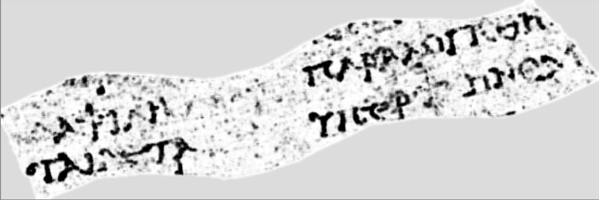
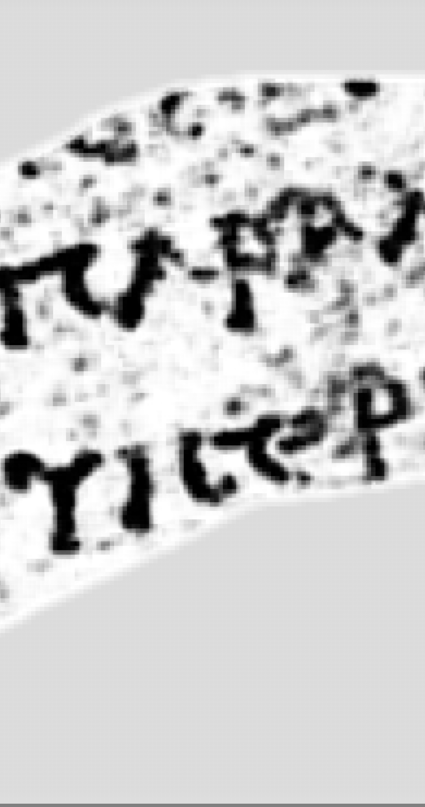
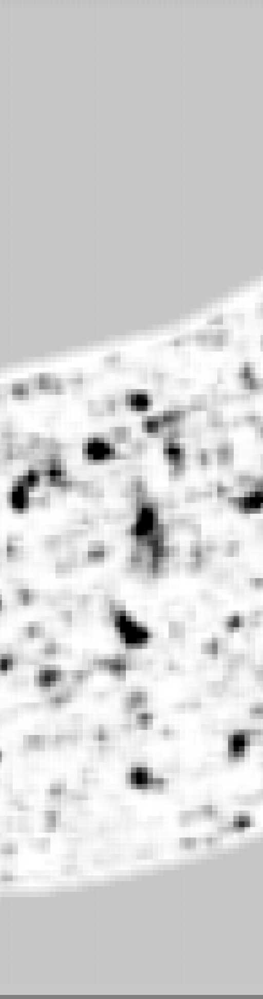
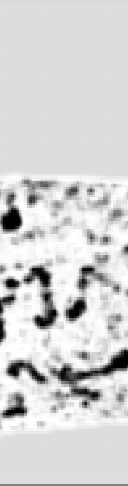

# Le segment entier : 9,2 cm de papyrus déroulé, et trois corrections

2026-08-17. Priorité A du plan de reprise. Une passe du modèle sur **tout** le
segment `20230909121925` — 99 918 fenêtres, 38,5 min sur l'iGPU Arc, 23 ms par
fenêtre. Sortie : `data/out/ink_segment_complet.npy` (11 591 × 3 882, 99,4 % de
pixels couverts).

C'est le premier livrable assez grand pour être soumis à un papyrologue. Et il
corrige **trois** choses que ce dépôt tenait pour acquises.

---

## 1. Le résultat

**Segment de 91,7 × 30,7 mm** à 7,91 µm/px, portant **4 à 5 lignes** de texte grec
d'un interligne de 5 à 7 mm.



⚠ **L'orientation de lecture est une rotation de 270°**, et elle n'est pas
cosmétique : dans le repère du fichier, les lignes de texte courent le long des
**lignes** du tableau, donc l'image brute présente les lettres couchées. Un
papyrologue juge des formes ; une lettre couchée ne se juge pas.



Des lettres grecques s'y lisent sans effort — Υ, Ι, Ϲ lunaire, Ρ, Τ, Α, Ν — alignées
en lignes régulières, avec des espaces entre groupes.

## 2. La mesure : AUC 0,925 sur 44,7 millions de pixels

Contre l'étiquetage humain de ce segment, recadré en (0,0) après **vérification** que
la zone rognée ne porte aucun pixel d'encre (les étiquettes sont publiées remplies
jusqu'à un multiple de 512, les couches non ; le contrôle refuse plutôt que de
supposer).

| domaine | pixels | encre | **AUC** | précision | rappel | F1 |
|---|---:|---:|---:|---:|---:|---:|
| tout le segment | 44 725 780 | 3,29 % | **0,925** | 0,355 | 0,793 | 0,491 |
| lignes annotées | 22 331 970 | 6,59 % | 0,920 | 0,488 | 0,793 | 0,604 |
| tuiles annotées (256 px) | 6 029 312 | 24,41 % | 0,908 | 0,681 | 0,793 | 0,732 |

Seuil = **zéro sur le logit**, c'est-à-dire la frontière de décision du modèle
lui-même — le seul point de fonctionnement qu'on ne choisit pas.

**Contrôle** : la même chaîne sur une prédiction **mélangée** rend AUC **0,500** dans
les trois domaines, exactement. Sans lui, rien ne garantirait qu'un découpage assez
agressif ne finisse pas par flatter n'importe quoi.

⚠ **Un seuil par médiane a été essayé et rejeté** : il prédit par construction la
moitié du segment comme encre et rend une précision de 0,061 qui ne mesure que ce
choix.

### 2bis. ⚠ Correction de `08` : la restriction est en partie mécanique

`08` concluait que restreindre aux zones annotées relève la précision. C'est vrai en
valeur absolue — mais **la densité d'encre passe de 3,3 % à 24,4 %**, donc le hasard
lui-même y est plus précis. La ligne de base manquait :

| domaine | précision mesurée | précision du **hasard** | gain |
|---|---:|---:|---:|
| tout le segment | 0,355 | 0,033 | **10,8×** |
| lignes annotées | 0,488 | 0,066 | 7,4× |
| tuiles annotées | 0,681 | 0,243 | 2,8× |

Le gain **décroît** quand on restreint. La hausse de précision est donc largement un
effet de taux de base, et non la preuve que les faux positifs sont des trous
d'annotation.

**Le chiffre robuste reste l'AUC**, qui ne dépend pas du taux de base et vaut 0,925
sur le segment entier.

## 3. Ce que la longueur permet enfin : le modèle ne hallucine pas sur du vierge

Densité d'encre étiquetée contre densité prédite, sur **23 bandes** de 512 lignes :

**Spearman rho = +0,796, p = 5,7 × 10⁻⁶.**

Là où l'humain n'a rien vu, le modèle ne voit généralement rien non plus. Le détail
sépare deux situations que `08` confondait :

| bandes | étiquette | modèle | lecture |
|---|---:|---:|---|
| 5632–7680, 11264+ | 0,00–0,35 % | **0,35–1,66 %** | les deux disent vierge |
| 2048–2560, 8704–9728 | 0,00–0,48 % | **7,6–9,8 %** | désaccord |



⚠ **C'est un contrôle qui pouvait échouer.** Un détecteur qui fabriquerait de l'encre
sur du papyrus vierge remplirait cette bande. Elle ne porte que des points épars.

### 3bis. ⚠ Et le désaccord n'est PAS établi comme un trou d'annotation

J'ai d'abord lu les bandes 8704–9728 comme de l'annotation manquante. **Le rendu dit
autre chose** :



On y voit des traits épais et **informes**, pas des lettres — à comparer à la §1, où
elles sont franches. Le fait mesuré est donc : *le modèle y produit du signal
intermédiaire, d'aspect non scriptural*. Trancher demande une mesure de plus, pas une
lecture de plus (§5).

## 4. ⚠⚠ Le juge structurel échoue une troisième fois — et `09` s'était trompé de cause

`09` §6 avait diagnostiqué : *« aucune mesure de cohérence ne peut fonctionner sur
20 × 24 mm ; il faut assez de lignes, donc le segment entier »*. Le segment entier
est là. **Il n'a pas plus de lignes.**

| | lignes de texte | interlignes |
|---|---:|---|
| vérité terrain | **5** | 5,4 · 7,1 · 4,5 · 3,6 mm |
| prédiction | **4** | 6,9 · 5,8 · 7,0 mm |

Ce segment est une **bande étroite coupée en travers** du texte : l'allonger allonge
les lignes, il n'en ajoute pas. Une autocorrélation ou une statistique d'espacement
a besoin de nombreuses périodes ; il y en a trois.

Le diagnostic corrigé est donc : **ce n'est pas la surface qui manquait, c'est le
nombre de lignes** — et il faudrait un segment couvrant *plusieurs colonnes de
texte*, pas un segment plus long.

*(Note au passage : les interlignes prédits sont plus réguliers que ceux de la vérité
terrain, cv 0,08 contre 0,25 — cohérent avec un étiquetage qui saute des lignes.)*

### Deux défauts de ma propre mesure, trouvés en la refaisant

1. **La normalisation par quantile répondait à l'envers.** Forcer 8 % des pixels à
   compter comme encre dans une bande **vierge** y fabrique de la structure à partir
   du bruit — et le bruit étant plus uniforme que du texte, la bande vierge
   ressortait avec l'espacement de lignes le **plus régulier** des trois. Corrigé en
   *retirant* le réglage : seuil unique sur le logit, identique partout.
2. **Mon écart minimal entre lignes était un ordre de grandeur trop petit** (80 px
   quand une lettre en fait 400), donc le détecteur comptait des pics
   intra-lettre : 8 « lignes » espacées de 1,5 mm là où l'interligne réel est de
   5 à 7 mm.

⚠ Et un troisième fait, indépendant des réglages : **41 composantes connexes** dans
une région qui montre des centaines de lettres. Au seuil de décision du modèle, les
lettres voisines **fusionnent** en composantes géantes, donc aucune statistique par
composante ne peut voir un caractère. Les séparer est un problème de segmentation —
exactement celui que Kraken n'a pas su faire (`09` §6).

**Ce que ces trois échecs établissent ensemble** : un juge mécanique de cohérence
demande (a) plusieurs dizaines de lignes, (b) des glyphes séparables. Aucune des deux
n'est fournie par un segment de ce type. Le cap reste le **jugement humain**.

## 5. Ce qui reste à mesurer, et pourquoi ce n'est pas fait ici

**La bande en désaccord est-elle un saut de feuille ?** Si l'« encre » des bandes
8704–9728 vient d'une feuille voisine traversée par la surface, la métrique de
proximité de `07` doit y être anormale. C'est la tâche D — *boucler `07` sur `08`* —
et elle est **bon marché en principe** : on a la métrique d'un côté et l'AUC de
l'autre.

⚠ **Elle est bloquée sur un fait matériel** : le maillage `tifxyz` de
`20230909121925` **n'est pas dans notre jeu** (`repos/windcheck/data/scroll1_tifxyz`
ne le contient pas), et les 46 traces mesurées dans `docs/proximity_scroll1.jsonl`
ne l'incluent pas. Il faut donc le télécharger avant de pouvoir répondre. Noté plutôt
que contourné.

---

## 6. Reproduire

```bash
# la passe (38,5 min sur iGPU Arc)
cd inference_xpu && uv run python src/infer_ink.py \
    ../data/layers/20230909121925 --model ../data/models/timesformer_GP_scroll1 \
    --top 0 --left 0 --height 11591 --width 3882 \
    --stride 21 --batch-size 64 --device xpu \
    --out ../data/out/ink_segment_complet.npy

# la mesure (41 s)
uv run python ../analysis/src/evaluate_segment.py ../data/out/ink_segment_complet.npy \
    ../repos/Vesuvius-Grandprize-Winner/all_labels/20230909121925_inklabels.png

# les images (⚠ --rotate 270 : sans elle, les lettres sont couchees)
uv run python ../analysis/src/render_segment.py ../data/out/ink_segment_complet.npy \
    ../docs/images/10_segment_entier.png --reduce 4 --rotate 270

# la structure (echoue, et c'est le resultat)
uv run python ../analysis/src/structure.py ../data/out/ink_segment_complet.npy \
    --region "A texte:3584:2048" --region "B vide:6144:1024" --region "C doute:8704:1024"
```

Sortie brute conservée dans `docs/eval_segment_complet.txt`.
