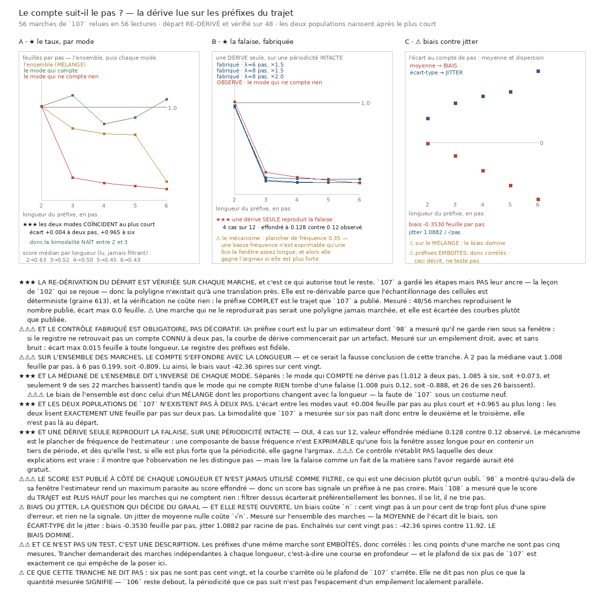

# 110 — Le compte suit-il le pas ? La dérive, lue sur les préfixes du trajet

> ⭐⭐⭐ **Dans le mode qui compte, le compte SUIT le pas** : **1,012** feuille par pas sur deux pas,
> **1,085** sur six — une dérive de **+0,073** sur toute la longueur, et seulement **9** de ses
> **22** marches baissent. Aucun biais.
>
> ⭐⭐⭐ **Et les deux populations de `107` N'EXISTENT PAS à deux pas** : l'écart entre les modes
> vaut **+0,004** feuille par pas au plus court et **+0,965** au plus long. Les deux lisent
> **exactement une feuille par pas** sur deux pas. La bimodalité naît **entre le deuxième et le
> troisième pas**.
>
> ⭐⭐⭐ **Et une dérive SEULE reproduit la falaise, sur une périodicité INTACTE** : **4** cas sur
> **12**, valeur effondrée médiane **0.128** contre **0.12** observé. Le mécanisme est le plancher
> de fréquence de l'estimateur. ⚠⚠⚠ L'observation **ne distingue donc pas** « la marche a quitté
> la feuille » de « une composante plus forte a masqué la périodicité ».
>
> ⚠⚠⚠ **Et sur l'ensemble des marches, le compte s'effondre** (**1.008** à deux pas, **0.199** à
> six, soit **-0.809**), ce qui donnerait un biais de **-42.36** spires sur cent vingt. **C'est un
> artefact de mélange** : la médiane d'un mélange dont les proportions changent avec la longueur.
> La faute de `107` sous un costume neuf.
>
> ⭐ **Zéro marche refaite** : les étapes de `107` suffisent à reconstruire chaque polyligne, et
> **56** lectures en **2050,6 s** donnent le registre sur tous ses préfixes.



## 1. Pourquoi ce fichier, et `109` l'a nommé

Tant qu'un pas non confirmé passait pour une chute, la question était « combien de pas la matière
porte ». `109` a mesuré que les manques ne sont pas groupés, donc qu'un manque n'arrête pas la
marche : la question devient **de combien le compte dérive quand la marche est longue** — celle que
`104` posait déjà sous sa forme décisive, *un retard est-il un BIAIS, qui coûte `n`, ou un JITTER de
moyenne nulle, qui coûte `√n` ?*

⭐⭐⭐ **Et elle se mesure sans remarcher.** `107` a gardé les étapes de chaque marche — avance et
direction, pas par pas — donc la polyligne est reconstructible et le registre peut être recalculé
sur chacun de ses **préfixes**. Une lecture par marche suffit, là où refaire les marches en
coûterait des heures.

## 2. ⚠⚠ Le départ n'avait PAS été gardé, et c'est la leçon de `102` qui se rejoue

`107` conserve les étapes mais pas leur **ancre**, donc la polyligne n'existait qu'à une
translation près. Elle est re-dérivable parce que l'échantillonnage des cellules est déterministe
(graine **613** plus l'indice de bande), et cette tranche l'écrit dans **sa** mesure pour qu'il ne
se reperde pas.

> ⭐⭐⭐ **Et la re-dérivation se vérifie gratuitement, sur chaque marche** : le préfixe **complet**
> est le trajet entier que `107` a publié. Mesuré : **48/56** marches reproduisent le nombre
> publié, écart max **0.0** feuille. Les **8** autres sont celles dont `107` n'avait pas de
> registre décidable, donc rien à comparer.

⚠ Une marche qui ne reproduirait pas le nombre publié serait une polyligne **jamais marchée** ;
elle est écartée des courbes plutôt que publiée.

## 3. ⚠⚠⚠ Le contrôle fabriqué est obligatoire, pas décoratif

Un préfixe court est lu par un estimateur dont `98` a mesuré qu'il **ne garde rien sous sa
fenêtre**. Si le registre ne retrouvait pas un compte **connu** à deux pas, la courbe de dérive
commencerait par un artefact.

| bruit | 2 pas | 3 | 4 | 5 | 6 |
|---|---:|---:|---:|---:|---:|
| 0 | **2.0** | **3.0** | **4.0** | **5.0** | **6.0** |
| 15 | **1.985** | **3.005** | 4.0 | 5.0 | **6.005** |

Écart max **0.015** feuille à toute longueur : le registre des préfixes est **fidèle**.

## 4. ⚠⚠⚠ Sur l'ensemble, le compte s'effondre — et ce serait la fausse conclusion

| longueur | marches | feuilles par pas | score médian |
|---:|---:|---:|---:|
| 2 pas | 48 | **1.008** | **0.63** |
| 3 | 48 | **0.775** | **0.522** |
| 4 | 48 | **0.716** | **0.496** |
| 5 | 48 | **0.707** | **0.451** |
| 6 | 48 | **0.199** | **0.426** |

Dérive du taux **-0.809** feuille par pas. Et l'écart au compte de pas grandit monotonement :

| longueur | marches | écart moyen | écart-type |
|---:|---:|---:|---:|
| 2 | 48 | **-0.046** | **1.085** |
| 3 | 48 | **-0.604** | **1.778** |
| 4 | 48 | **-1.255** | **2.089** |
| 5 | 48 | **-1.929** | **2.277** |
| 6 | 48 | **-2.533** | **3.217** |

Lu ainsi, la MOYENNE dit le biais et l'ÉCART-TYPE dit le jitter : biais **-0.353** feuille par pas,
jitter **1.0882** par racine de pas — soit **-42.36** spires sur cent vingt contre **11.92**.

## 5. ⭐⭐⭐ Mais la médiane de l'ensemble dit l'INVERSE de chaque mode

| mode | marches | 2 pas | 3 | 4 | 5 | 6 | dérive | dont le taux baisse |
|---|---:|---:|---:|---:|---:|---:|---:|---:|
| **qui compte** | **22** | **1.012** | **1.128** | **0.82** | **0.889** | **1.085** | **+0.073** | **9**/22 |
| **qui ne compte rien** | **26** | **1.008** | **0.241** | **0.186** | **0.152** | **0.12** | **-0.888** | **26**/26 |

> ⭐⭐⭐ **Le mode qui compte ne dérive pas.** Il tourne autour de un et y revient : **1,012** à deux
> pas, **1,085** à six. Et **9** de ses **22** marches baissent — soit à peu près la moitié, ce qui
> est ce que fait le hasard.
>
> ⛔ **Le mode qui ne compte rien tombe d'une falaise** : correct à deux pas, effondré dès trois, et
> **26 sur 26** baissent.

⚠⚠⚠ **Donc le biais de l'ensemble est celui d'un MÉLANGE dont les proportions changent avec la
longueur.** À deux pas les deux modes sont confondus ; à six, l'un s'est effondré. La médiane suit
le déplacement de la population, pas une dérive de la matière. **C'est la faute de `107` sous un
costume neuf**, et c'est le partage par mode qui l'attrape.

## 6. ⭐⭐⭐ Et les deux populations de `107` n'existent pas à deux pas

| | écart entre les modes |
|---|---:|
| au plus court (2 pas) | **+0.004** feuille par pas |
| au plus long (6 pas) | **+0.965** |

> ⭐⭐⭐ **Les deux modes lisent exactement une feuille par pas sur deux pas.** La bimodalité que
> `107` a mesurée sur six pas **naît entre le deuxième et le troisième**, elle n'est pas là au
> départ.

## 7. ⭐⭐⭐ Une dérive seule reproduit la falaise, sur une périodicité intacte

Le mode bas lit **1.008** à deux pas puis tombe : cela ressemble à une marche qui quitte la
feuille. Mais l'estimateur a un **plancher de fréquence** (`F_MIN = 0,35`), donc une composante de
basse fréquence n'est **exprimable** qu'une fois la fenêtre assez longue pour en contenir un tiers
de période — et dès qu'elle l'est, si elle est plus forte que la périodicité, **elle gagne
l'argmax**. Une falaise à une longueur précise est donc la signature attendue de l'**instrument**.

Mesuré sur un empilement fabriqué dont la périodicité est **parfaite**, avec une dérive de longueur
d'onde et d'amplitude balayées :

| λ (en pas) | amplitude | 2 pas | 3 | 4 | 5 | 6 |
|---:|---:|---:|---:|---:|---:|---:|
| 6 | ×1.5 | **0.95** | **0.178** | **0.169** | **0.167** | **0.166** |
| 8 | ×1.5 | **0.965** | **0.155** | **0.13** | **0.127** | **0.125** |
| 8 | ×2.0 | **0.95** | **0.145** | **0.128** | **0.126** | **0.126** |
| 10 | ×2.0 | **0.965** | **0.138** | **0.106** | **0.102** | **0.101** |

**4** cas sur **12** rendent « correct à deux pas, effondré ensuite », valeur effondrée médiane
**0.128** — contre **0.12** observé.

> ⚠⚠⚠ **Ce contrôle n'établit PAS laquelle des deux explications est vraie** : il montre que
> l'observation **ne les distingue pas**. Lire la falaise comme un fait de la matière sans l'avoir
> regardé aurait été gratuit.

⭐ Et il est à double sens : **sans** dérive, une périodicité parfaite ne produit **aucune** falaise.

## 8. ⚠⚠⚠ Le score est publié à côté de chaque longueur et n'est jamais utilisé comme filtre

C'est une décision, pas un oubli, et elle vient de deux tranches qui se contredisent :

- `98` a montré qu'au-delà de sa fenêtre l'estimateur rend un maximum **parasite** au score
  effondré — donc un score bas signale un préfixe à ne pas croire (mesuré : **0,067** contre
  **1,000** dedans, et la **butée ne fire pas**) ;
- `108` a mesuré que le score du **trajet** est **plus haut** pour les marches qui ne comptent rien
  — donc filtrer dessus écarterait préférentiellement les **bonnes**.

> Il se lit, il ne trie pas.

## 9. ⚠ Biais ou jitter : la question reste ouverte

Un biais coûte `n`, un jitter de moyenne nulle coûte `√n` : à ampleur égale par pas, le rapport
vaut exactement $\sqrt{120} = 10{,}95$. Ce ne sont pas deux degrés du même problème.

⚠⚠ **Mais les préfixes d'une même marche sont EMBOÎTÉS, donc corrélés** : les cinq points d'une
marche ne sont pas cinq mesures. Trancher demanderait des marches **indépendantes** à chaque
longueur, c'est-à-dire une course en **profondeur** — et le plafond de six pas de `107` est
exactement ce qui empêche de la poser ici.

⭐ Ce que la tranche rend malgré tout : **dans le mode qui compte, il n'y a rien à trancher sur six
pas** — le compte suit le pas.

## 10. ⚠⚠ Une course perdue, et la cause corrigée plutôt que le symptôme

⛔ **Vingt minutes de lecture ont été jetées par un `KeyError` dans l'agrégation finale** : une
marche dont aucun préfixe n'est lisible rend une vérification **sans champ `ecart`**, et le maximum
le lisait sans garde. `107` avait déjà le partage lecture / agrégation et son `--reagreger` ; ne pas
l'avoir copié a coûté la course.

> ⭐ Corrigé à la cause : `mesurer` **écrit les lectures avant** que le verdict ne soit calculé, et
> `--reagreger` le refait sans rien relire. C'est ce qui a permis d'ajouter le partage par mode et
> le contrôle d'instrument **sans repayer** les 2050 s.

⚠ Et la batterie porte désormais le contrôle qui l'aurait attrapé : *l'agrégation survit à une
vérification non décidable*.

## ⭐⭐⭐ Ce que `111` a tranché, et ce document posait la question

> ⭐⭐⭐ **La falaise était celle de l'instrument.**
> [`111`](111_une_bande_qui_ne_bouge_pas_avec_la_fenetre.md) borne la bande de fréquences par des
> longueurs d'onde PHYSIQUES (λ de **86.5** à **346.0** µm, les candidats du balayage) au lieu du
> plancher relatif `F_MIN = 0,35`. Sur les mêmes profils, la falaise du mode bas passe de
> **-0.888** à **-0.068** et il franchit **0.951** feuille par pas à six pas ; l'écart entre les
> modes au plus long tombe de **+0.965** à **+0.134**.
>
> ⭐ **Ce document avait raison sur les deux points qui comptaient** : le biais de l'ensemble était
> un artefact de mélange, et l'observation ne distinguait pas les deux explications. `111` fournit
> l'instrument qui les distingue.
>
> ⚠⚠ Et le prix est réel : une bande bornée ne peut plus dire « pas de périodicité » par son
> compte — c'est son **score** qui l'écarte, et le mode bas franchit sa barre sur **76.9 %** à
> **88.5 %** de ses marches.

## 11. ⚠ Ce que cette tranche ne dit pas

- **Six pas ne sont pas cent vingt**, et la courbe s'arrête où le plafond de `107` s'arrête.
- **Ce que la quantité mesurée signifie** reste ouvert : `106` reste debout, la périodicité que ce
  pas suit n'est pas l'espacement d'un empilement localement parallèle.
- **Laquelle des deux explications de la falaise est vraie.** L'observation ne les distingue pas.
- **Le mode qui compte est celui que `107` a étiqueté sur six pas**, donc les préfixes courts sont
  étiquetés par ce que la marche fera plus tard. C'est légitime pour **décrire** les deux
  populations, et ce serait circulaire pour les **définir**.

## Reproduire

```bash
uv run python src/nappe/le_compte_suit_il_le_pas.py --verifier
uv run python src/nappe/le_compte_suit_il_le_pas.py \
    --json docs/mesures/le_compte_suit_il_le_pas.json
uv run python src/nappe/le_compte_suit_il_le_pas.py --reagreger \
    --json docs/mesures/le_compte_suit_il_le_pas.json
uv run python src/figures/figure_le_compte_suit_il_le_pas.py \
    --sortie docs/images/110_le_compte_suit_il_le_pas.png
```

⚠ La mesure lit le volume distant (**56** lectures, **2050,6 s**) ; `--reagreger` ne lit rien.
