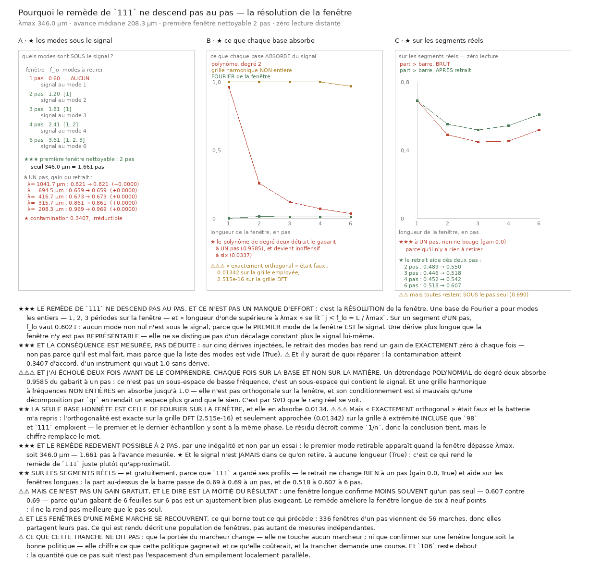

# 112 — Pourquoi le remède de `111` ne descend pas au pas

> ⭐⭐⭐ **Le remède de `111` ne répare pas le critère PAR PAS, et ce n'est pas un manque
> d'effort : c'est la résolution de la fenêtre.** Sur un segment d'un pas, `f_lo` vaut
> **0.6021** — **aucun** mode de Fourier n'est sous le signal, parce que le
> premier mode de la fenêtre **est** le signal.
>
> ⭐⭐⭐ **Et c'est mesuré, pas déduit** : sur cinq dérives injectées, le retrait rend un gain de
> **exactement zéro** à chaque fois. Il y aurait pourtant de quoi réparer — la contamination
> atteint **0.3407** d'accord.
>
> ⚠⚠⚠ **J'ai échoué deux fois avant de le comprendre, chaque fois sur la BASE.** Un polynôme de
> degré deux absorbe **0.9585** du gabarit à un pas ; une grille
> harmonique non entière en absorbe **1.0**.
>
> ⭐ **Le remède redevient possible à 2 pas**, par une inégalité :
> le premier mode retirable apparaît quand la fenêtre dépasse **346.0** µm.
>
> ⭐ **Zéro lecture distante** — tout se calcule sur les profils que `111` a gardés.



## 1. Pourquoi ce fichier

`111` a réparé l'estimateur du **trajet** en bornant sa bande par des longueurs d'onde physiques, et
la comptabilité d'enroulement marche partout. Mais la **portée** du marcheur — un pas confirmé,
six cents micromètres — n'a pas bougé, et elle dépend d'un autre instrument : le critère de `98`
appliqué au segment d'**un** pas.

La question qui suit est immédiate : **le même remède répare-t-il aussi le critère par pas ?**

## 2. ⭐⭐⭐ Non, et la raison est la résolution de la fenêtre

Une base de Fourier a pour modes les **entiers** — 1, 2, 3 périodes sur la fenêtre — et
« longueur d'onde supérieure à λmax » se lit `j < f_lo = L / λmax`.

| fenêtre | L | f_lo | modes à retirer | mode du signal | signal hors du retrait ? |
|---|---:|---:|---|---:|---|
| 1 pas | 208 µm | **0.6021** | **aucun** | 1 | oui |
| 2 pas | 417 µm | **1.2043** | **[1]** | 2 | oui |
| 3 pas | 625 µm | **1.8064** | **[1]** | 3 | oui |
| 4 pas | 833 µm | **2.4086** | **[1, 2]** | 4 | oui |
| 6 pas | 1250 µm | **3.6128** | **[1, 2, 3]** | 6 | oui |

> ⭐⭐⭐ **À un pas, la liste est vide.** Le premier mode de la fenêtre **est** le signal : une
> dérive plus longue que la fenêtre n'y est pas **représentable**, donc elle ne se distingue pas
> d'un décalage constant plus le signal lui-même.

⭐ **Et le signal n'est JAMAIS dans ce qu'on retire, à aucune longueur** — c'est une inégalité, pas
une observation : `f_lo = k · avance / λmax` et l'avance est bornée par λmax, donc `f_lo < k`
toujours. C'est ce qui rend le remède de `111` **juste** plutôt qu'approximatif.

## 3. ⭐⭐⭐ La conséquence, mesurée

Sur un segment d'un pas, l'accord vaut **1.0** sans dérive. Avec une dérive :

| dérive (périodes/fenêtre) | λ | accord brut | après retrait | gain |
|---:|---:|---:|---:|---:|
| 0.2 | **1041.7** µm | **0.8211** | **0.8211** | **0.0** |
| 0.3 | **694.5** µm | **0.6593** | **0.6593** | **0.0** |
| 0.5 | **416.7** µm | **0.6726** | **0.6726** | **0.0** |
| 0.66 | **315.7** µm | **0.8608** | **0.8608** | **0.0** |
| 1.0 | **208.3** µm | **0.9685** | **0.9685** | **0.0** |

> ⭐⭐⭐ **Le gain est exactement zéro à chaque fois** — non pas parce que le retrait est mal fait,
> mais parce que la liste des modes est vide. Et la contamination est réelle : jusqu'à
> **0.3407** d'accord perdu, sur un instrument dont la barre est ~0,33.

## 4. ⚠⚠⚠ Deux échecs à moi, et c'est leur échec qui désigne la bonne base

| fenêtre | poly. d1 | poly. d2 | poly. d3 | harmonique non entière | **Fourier** |
|---|---:|---:|---:|---:|---:|
| 1 pas | **0.0** | **0.9585** | **0.9585** | **1.0** | **0.0** |
| 2 pas | **0.0** | **0.2558** | **0.2558** | **1.0** | **0.0134** |
| 3 pas | **0.0** | **0.1193** | **0.1193** | **0.9994** | **0.009** |
| 4 pas | **0.0** | **0.0701** | **0.0701** | **0.9965** | **0.0096** |
| 6 pas | **0.0** | **0.0337** | **0.0337** | **0.9655** | **0.0078** |

- ⛔ **Le polynôme de degré deux absorbe 0.9585 du gabarit à un pas** : ce
  n'est pas un sous-espace de basse fréquence, c'est un sous-espace qui **contient le signal**.
  ⭐ Et il devient inoffensif à six pas (**0.0337**) : ce n'est pas le
  polynôme qui est mauvais, c'est la fenêtre d'un pas qui est trop courte.
- ⛔ **La grille harmonique à fréquences non entières** n'est pas orthogonale sur la fenêtre, et son
  conditionnement est si mauvais qu'une décomposition par `qr` en rendait un espace **plus grand**
  que le sien. ⚠ C'est par **SVD** que le rang réel se voit — ma première version absorbait 100 %
  partout et je l'ai crue.
- ⭐ **Le degré UN n'absorbe rien, à aucune longueur** — mais il ne retire pas non plus la dérive.

## 5. ⚠⚠⚠ Et « exactement orthogonal » était faux

| fenêtre | modes | grille à extrémité **incluse** | grille **DFT** |
|---|---|---:|---:|
| 1 pas | — | **0.0** | **0.0** |
| 2 pas | [1] | **0.01342** | **3.22e-17** |
| 3 pas | [1] | **0.009009** | **2.515e-16** |
| 4 pas | [1, 2] | **0.00678** | **6.592e-17** |
| 6 pas | [1, 2, 3] | **0.004535** | **2.056e-16** |

Une base de Fourier est exactement orthogonale sur la grille **DFT** — `n` points, extrémité
**exclue**. Or les profils de `111` font `73k + 1` points, extrémité **incluse** : le premier et le
dernier échantillon d'une fenêtre sont à la **même phase**.

> ⚠⚠⚠ **Le résidu vaut 0.01342 au pire**, contre
> **2.515e-16** sur la grille DFT. Il décroît comme `1/n`, donc la conclusion
> tient — mais le chiffre remplace le mot.

## 6. ⭐ Le remède redevient possible à 2 pas

Le premier mode retirable apparaît quand `L ≥ λmax`, soit **346.0** µm —
**1.661** pas à l'avance mesurée. C'est une conséquence de conception tirée d'une
inégalité, pas d'un essai.

## 7. ⭐⭐ Sur les segments réels, gratuitement

| fenêtre | fenêtres | modes retirés | accord brut | après retrait | gain | barre brute | barre après | > barre brut | > barre après |
|---|---:|---|---:|---:|---:|---:|---:|---:|---:|
| 1 pas | **336** | — | **0.493** | **0.493** | **0.0** | **0.3404** | **0.3404** | **0.69** | **0.69** |
| 2 pas | **280** | [1] | **0.2208** | **0.2731** | **0.0038** | **0.234** | **0.2355** | **0.489** | **0.55** |
| 3 pas | **224** | [1, 2] | **0.1871** | **0.2105** | **0.0069** | **0.1981** | **0.1999** | **0.446** | **0.518** |
| 4 pas | **168** | [1, 2] | **0.1517** | **0.1904** | **0.0116** | **0.169** | **0.1707** | **0.452** | **0.542** |
| 6 pas | **56** | [1, 2, 3, 4] | **0.1501** | **0.202** | **0.011** | **0.1398** | **0.1412** | **0.518** | **0.607** |

- ⭐⭐⭐ **À un pas, rien ne bouge** (gain **0.0**) — parce qu'il n'y
  a rien à retirer.
- ⭐ **Le retrait aide dès deux pas** : la part au-dessus de la barre monte de six à neuf points.
- ⚠⚠ **Mais ce n'est pas un gain gratuit** : une fenêtre longue confirme **moins souvent** qu'un pas
  seul — **0.607** contre
  **0.69** — parce qu'un gabarit de
  6 feuilles sur 6 pas est un ajustement
  bien plus exigeant.

⚠ **Et la barre après retrait est calculée à part**, parce que retirer des modes change la famille :
reprendre celle de `98` serait donner à une forme la barre d'une autre.

⚠ **Les fenêtres d'une même marche se recouvrent** — **336** fenêtres
d'un pas viennent de 56 marches. Ce qui est rendu décrit une **population de fenêtres**, pas autant
de mesures indépendantes.

## 8. ⚠ Ce que cette tranche ne dit pas

- **Que la portée du marcheur change.** Elle ne touche aucun marcheur : elle mesure un instrument.
- **Que confirmer sur une fenêtre longue soit la bonne politique.** Elle chiffre ce que cette
  politique gagnerait et ce qu'elle coûterait ; la trancher demande une **course**.
- **Ce que la quantité mesurée signifie.** `106` reste debout.

## Reproduire

```bash
uv run python src/nappe/pourquoi_le_remede_ne_descend_pas_au_pas.py --verifier
uv run python src/nappe/pourquoi_le_remede_ne_descend_pas_au_pas.py \
    --json docs/mesures/pourquoi_le_remede_ne_descend_pas_au_pas.json
uv run python src/figures/figure_pourquoi_le_remede_ne_descend_pas_au_pas.py \
    --sortie docs/images/112_pourquoi_le_remede_ne_descend_pas_au_pas.png
```

⚠ **Aucune lecture distante** : tout se calcule sur
`docs/mesures/une_bande_qui_ne_bouge_pas_avec_la_fenetre.json`, dont `111` a gardé les profils
bruts. La batterie le vérifie en lisant l'arbre syntaxique du module, pas son texte.
