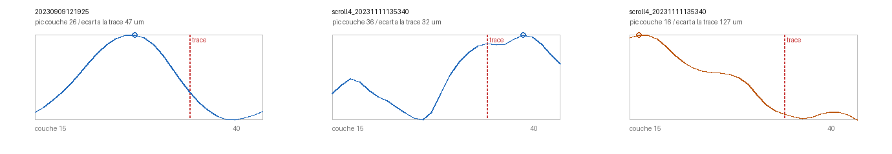

# La profondeur de surface : un instrument de tracé sans vérité terrain

> ⚠⚠ **L'instrument a changé deux fois. Lire le §10 en premier** — il donne la version
> courante et dit ce que les §1 à §9 avaient de faux. Le reste est conservé parce que
> la trace des corrections vaut plus que la propreté du récit.

2026-08-18. Né d'une enquête sur l'échec du détecteur d'encre sur Scroll 4 (`09` §12),
et devenu autre chose que ce qu'il cherchait.

---

## 1. D'où ça vient

Le détecteur GP-2023 lit **26 couches** d'une pile — ici les couches 15 à 40.

⚠ **La convention est vérifiée à la source, pas supposée.** Le tutoriel officiel
(miroir local, `data/site/scrollprize.org/tutorial_VC.html`) donne la commande qui les
engendre :

```
vc_layers_from_ppm -v "/full_scrolls/$SCROLL" -p "$SEGMENT.ppm"     --output-dir layers/ -r 32 -f tif
```

> *« The result of this process are the 65 tifs in the /layers/ directory, also
> referred to as a "surface volume". »*

**Rayon 32, 65 couches : la couche 32 EST la surface tracée**, et les autres s'en
écartent d'un voxel par indice. Si la trace suit bien la feuille, la surface tombe donc
au même indice partout — au voisinage de 32 — et le modèle la trouve là où il la
cherche. ⚠ Sans cette vérification, tout ce qui suit serait un raisonnement sur une
convention devinée.

La première cause candidate à l'échec sur Scroll 4 était donc : *et si la surface
n'était pas dans la fenêtre lue ?* Elle se teste **sans rien télécharger** — la réponse
est déjà dans les couches qu'on a.

## 1bis. 🎯 Ce que ça donne, en une image



```
uv run python src/figures/figure_profondeur.py \
    docs/mesures/profil_profondeur.json \
    docs/mesures/profil_profondeur_scroll4_region.json \
    docs/images/12_profils_de_profondeur.png
```

À gauche un segment de Scroll 1 : une courbe **unimodale propre**, pic à la couche **26**,
soit **47 µm** de la surface tracée. Les deux panneaux de droite sont **deux fenêtres du
même segment** de Scroll 4, et c'est ce qui frappe : leurs pics tombent aux **deux bords
opposés** de la pile — couche **36** dans l'une, couche **16** dans l'autre, soit **32** et
**127 µm** d'écart à la trace. La feuille n'est pas là où la trace la place, et elle n'y est
même pas de la même façon d'un bout à l'autre du segment.

⚠ Les trois panneaux lisent la **même fenêtre de couches** (15 à 40) et sont normalisés
chacun dans sa propre pile : ce qui se compare est la **forme**, pas le niveau.

⚠⚠ **Ce que la figure trace est l'INTENSITÉ moyenne, pas le contraste** — et la légende de ce
document a longtemps dit l'inverse. C'est corrigé ici plutôt que laissé : voir le §2, où la
raison est désormais une propriété de la **taille de voxel** et non une préférence.

⚠ **Trois nombres de cette page ont été corrigés le 2026-09-05** : la version publiée annonçait
« pic à la couche 28, 32 µm » pour Scroll 1 et un seul panneau Scroll 4. Les mesures présentes
dans l'arbre (`docs/mesures/profil_profondeur.json`,
`docs/mesures/profil_profondeur_scroll4_region.json`) donnent **26 / 47 µm** et **deux**
fenêtres. L'image publiée ne se régénérait plus depuis ses propres données — le défaut que la
tâche `D3` traque : une image affichée sans la commande qui la refait est une mesure que
personne ne peut refaire, et elle dérive sans que rien ne le dise.

`src/figures/figure_profondeur.py` — tracé avec PIL, sans matplotlib (absent ici, et
l'ajouter pour trois courbes ferait dépendre une figure d'une pile graphique entière).

## 2. La mesure

`src/volume/depth_profile.py`. Pour chaque couche, sur une fenêtre : l'**intensité
moyenne** (où est la matière) et le **contraste local**, écart-type d'un passe-haut 3×3
(où est la *structure*).

⚠⚠⚠ **C'est l'INTENSITÉ qui localise, et le §10 de cette page le corrige déjà** — voir
« Défaut 1 — le contraste ne localise pas la matière ». À **7,91 µm** les deux piquent au même
endroit, donc rien ne les distinguait ; à **2,4 µm** le contraste devient un **U** dont les
maxima sont les **interfaces** de la feuille et le minimum son **intérieur**. La phrase qui
suivait ici — *« c'est le second qui localise »* — appartient à la version d'avant cette
correction, et elle est retirée plutôt que laissée à côté du §10 qui la dément.

> ⚠⚠ **Et elle a coûté quelque chose le 2026-09-05**, ce qui est la seule chose neuve à écrire :
> les deux premières campagnes de `C2` (`75` §C2) ont placé leur fenêtre « face » sur une spire
> **voisine** en suivant le contraste sur des surface-volumes à 2,399 µm. Le §1 à §9 de cette
> page sont conservés *et faux par endroits*, l'en-tête le dit — je les ai lus quand même. Le
> remède est dans l'outil, pas dans la vigilance : `depth_profile.py` rend les deux séries, et
> `le_nul_verso.py` choisit désormais sur l'intensité, avec une garde qui **refuse** une fenêtre
> dont le pic n'est pas dans la moitié centrale de sa pile.

⚠ **Chaque profil est normalisé dans sa propre pile.** Deux campagnes de scan n'ont ni
la même dynamique ni le même gain ; comparer des niveaux bruts comparerait les
scanners. Ce qui se compare est la **forme** — où est le pic.

⚠ **Les couches sont lues une fois chacune, toutes fenêtres confondues.** Une couche
fait ~500 Mo et se décode entière ; boucler sur les fenêtres à l'extérieur relirait la
pile autant de fois qu'il y a de fenêtres.

⚠ Une fenêtre sans matière n'a pas de surface : celles dont l'intensité maximale reste
sous la moitié du maximum global sont **écartées et comptées**.

## 3. 🎯 Ce qu'on voit

Le segment de Scroll 1 qui donne l'**AUC 0,925**, profil sur une fenêtre : une courbe
**unimodale propre**, pic de contraste à la couche **26**, au milieu de ce qui est lu.
Le même profil sur Scroll 4, à l'endroit exact où l'inférence a tourné : le contraste
est **maximal à la couche 15** — la première lue — et décroît jusqu'à 40. **La surface
est au-dessus de la fenêtre.**

⚠⚠ Et une autre fenêtre du **même** segment Scroll 4 donne son pic à la couche **40**,
l'autre bord. Les deux extrêmes, sur le même segment. C'est ce désaccord qui a
transformé un diagnostic en instrument.

### Le balayage complet — trois segments, même plage de couches

| segment | rouleau | pic dans le **tiers central** | écart interquartile | pic **au bord** |
|---|---|---:|---:|---:|
| `20231022170901` | Scroll 1 | **63 %** | **4,0** couches | 15 % |
| `20230909121925` | Scroll 1 | 50 % | 11,5 | 37 % |
| `scroll4_20231111135340` | Scroll 4 | **7 %** | **22,0** | **61 %** |

⚠ Le filtre `--from-layer 15 --to-layer 40` n'est pas un confort : `20231022170901` a
été téléchargé avec **38** couches et les deux autres avec 26. Sans restreindre à une
plage commune, les « tiers centraux » n'ont pas la même largeur et les pourcentages ne
veulent pas dire la même chose. Le chiffre de ce segment passe de 76 % à 63 % une fois
la comparaison rendue légitime.

### ⚠⚠ La forme importe autant que la position

Scroll 4 n'est pas simplement **décalé** : sa distribution est **bimodale**, 92 fenêtres
piquant à la couche 15 et 49 à la couche 40, avec un milieu presque vide. Un décalage
uniforme — « ce rouleau engendre ses couches autour d'un autre indice » — déplacerait la
médiane **sans gonfler l'écart interquartile**. Or celui-ci passe de 4,0 à **22,0**.

> **La surface de ce segment ne se tient pas à une profondeur constante : elle
> voyage d'un bout à l'autre de ce qui est lu.** C'est la signature d'une trace qui
> dérive, et c'est exactement le défaut que le déroulement doit éviter.

## 4. Pourquoi c'est utile

Cette mesure ne demande **ni vérité terrain, ni modèle d'encre, ni juge**. Elle ne lit
que les couches, qui existent pour tout segment publié. C'est la première grandeur du
dépôt qui parle de la **qualité d'une trace** sans passer par ce qu'on arrive à lire
dessus — et l'objectif est le déroulement, pas la lecture.

Et elle explique l'échec de `09` §12 sans invoquer un décalage de domaine : le modèle
ne s'est pas trompé sur l'encre de Scroll 4, **il a regardé à côté**.

## 5. ⚠ Ce que ça ne dit PAS

1. **Trois segments, deux rouleaux.** Ce n'est pas un corpus. La grandeur est plausible ⭐ **→ §11 et §12, faits depuis** : l'instrument a été validé contre un recensement indépendant (80 segments de Scroll 1) puis répliqué sur `PHerc1667`. Ce n'est plus « trois segments, deux rouleaux ».
   et mesurée ; elle n'est pas validée sur une population.
2. **Elle ne classe pas la qualité de détection d'encre.** `20230909121925` est celui
   qui donne l'AUC 0,925, et il est **moins bon** ici que `20231022170901` (50 % contre
   63 %). Prétendre qu'elle prédit la lisibilité répéterait exactement l'erreur que la
   tâche D a coûté cher à écarter (`06` §3.8).
3. **La bimodalité pourrait venir de l'engendrement des couches** plutôt que de la
   trace. Pour les départager il faudrait un segment dont on sait indépendamment qu'il
   est propre, avec sa pile complète.
4. Le passe-haut 3×3 est une mesure de netteté locale parmi d'autres. Un autre noyau
   déplacerait les chiffres ; il ne déplacerait pas un facteur 7.

## 6. ⚠⚠ Avec la pile complète 0–40 : le trait est plus dur

Les couches 0 à 14 ont été téléchargées (7,5 Go) pour voir **sous** la fenêtre lue.
Résultat sur le segment Scroll 4, 230 fenêtres :

| pic de contraste | fenêtres |
|---|---:|
| **couche 0** (le bord absolu de la pile) | **100** |
| couches 1 à 39 | 104, dispersées |
| **couche 40** | **26** |

⚠ Un pic au bord peut être un **artefact de bord** — un passe-haut réagit fort à une
troncature. La forme le réfute : à l'endroit exact où l'inférence a tourné
(`top 2560, left 20000`), le contraste **décroît de façon lisse et monotone** de 1,000 à
la couche 0 jusqu'à 0,000 à la couche 40, et l'intensité moyenne fait de même (plateau
0,99–1,00 des couches 0 à 5, puis chute à 0 vers la couche 36). C'est une courbe, pas
une pointe.

> **La matière occupe les couches 0 à ~28 et le reste est du vide.** La surface tracée
> est la couche **32** : elle tombe donc **dans le vide**, à une vingtaine de voxels au
> moins de la feuille — soit plus qu'une épaisseur de feuille (142,8 µm, `11` §3).
> **La trace est posée à côté du papyrus.**

Pour comparaison, le segment Scroll 1 qui donne l'AUC 0,925 a son pic **à l'intérieur**
de ce qui est lu (couche 26), avec une courbe unimodale propre qui retombe à zéro vers
34 puis **remonte** légèrement en 39–40 — la feuille suivante.

### ⚠⚠ CORRECTION — la pile complète dément mon arithmétique de ce matin

J'avais écrit, sur la fenêtre 0–40 : *« l'écart vaut une épaisseur de feuille, donc
c'est la signature d'un saut de spire »*. Le raisonnement importait le pas
inter-feuilles **mesuré sur PHerc0172** (142,8 µm, `11` §3) vers **PHerc1667**, qui est
un autre rouleau avec sa propre compaction. **C'est le piège nº 6 du dépôt — un chiffre
emprunté n'est pas une mesure — et je l'ai commis.**

Les 24 couches manquantes (41 à 64) ont été téléchargées. La pile complète le dément :

| couche | ce qu'on voit |
|---|---|
| 0 à ~28 | matière, contraste **maximal dès la couche 0** |
| 34 et **46** | deux **creux** d'intensité — du vide |
| 48 à 64 | matière **qui remonte encore** à la dernière couche |

Les deux blocs sont donc séparés de **plus de 64 voxels** entre leurs cœurs, soit
plusieurs fois le pas de PHerc0172. L'égalité que j'annonçais n'existe pas.

### 🎯 Ce qui se mesure sans rien emprunter

`src/nappe/stack_structure.py`. La question devient : **à quelle distance la couche
tracée est-elle du sommet de matière le plus proche, dans sa propre pile ?**

⚠ Un maximum atteint **au bord** n'est pas un sommet — c'est le flanc d'un sommet situé
dehors. Il est rapporté comme une **borne inférieure**, jamais comme une distance.

| segment | sommets de matière | distance de la couche 32 au plus proche |
|---|---|---|
| `20230909121925` (AUC 0,925) | **16 et 26** | **6 voxels (47 µm)** |
| `scroll4_…` (pile complète 0–64) | **aucun dans les 65 couches** | **≥ 32 voxels (253 µm)** |

Six voxels sur Scroll 1 : l'ordre d'une demi-épaisseur de feuille, ce qu'on attend
puisque le contraste marque la **face encrée** et non le milieu de la feuille. **La
trace est sur la feuille.**

⚠⚠ Sur Scroll 4, **aucun sommet n'existe dans la pile entière** : le contraste est
maximal dès la couche 0 *et* monte encore à la couche 64. La surface tracée est posée
entre deux blocs de matière dont **aucun cœur n'est visible**, à 253 µm au moins du plus
proche. Ce n'est plus une extrapolation depuis une demi-fenêtre : c'est tout ce que le
volume de surface contient.

⚠ Ce qui reste **non tranché** : dire que c'est un *saut de spire* demanderait le pas
inter-feuilles **de ce rouleau-là**, qui n'est pas mesuré. Ce qui est établi, c'est que
la trace n'est sur aucune des deux feuilles.

⚠ Et la bimodalité demeure : 100 fenêtres au bord bas, 26 au bord haut. **Aucune plage
unique ne peut servir tout le segment.** Ce n'est pas un décalage constant qu'on
corrigerait avec un `--start-layer` ; c'est une trace qui n'est pas sur la feuille au
même endroit d'un bout à l'autre.

## 7. 🎯 Le segment entier, sur la pile complète — et le verdict

Balayage des 232 fenêtres avec matière, sur les **65** couches :

| où tombe le pic de contraste | fenêtres |
|---|---:|
| **couche 0** (bord bas) | 45 — **19 %** |
| **couche 64** (bord haut) | 96 — **41 %** |
| **à un bord, donc cœur HORS du volume de surface** | **141 — 61 %** |
| à l'intérieur | 91 — 39 % |
| dans le **tiers central**, près de la couche tracée | **3 %** |

Écart interquartile : **61 couches** — c'est-à-dire la pile presque entière.

> **Pour 61 % de ce segment, la feuille n'est pas dans le volume de surface du tout.**
> Et pour 3 % seulement le cœur de matière est près de la couche 32, là où une trace
> posée sur la feuille le mettrait.

⚠⚠ **Conséquence directe, et elle disqualifie le test que je venais de lancer** : si le
cœur est hors des 65 couches, **aucune fenêtre de 26 couches prise dedans ne peut le
contenir**. Décaler `--start-layer` ne pouvait pas sauver la détection sur la majorité
du segment — le test était sous-dimensionné par construction, et la mesure le disait
déjà avant que je le lance.

## 8. Ce que ça règle

L'échec de `09` §12 n'est pas d'abord un décalage de domaine, ni un mauvais choix de
couches. **Il est en amont** : on ne détecte pas d'encre sur une surface que le volume
de surface ne contient pas.

C'est aussi la raison pour laquelle cet instrument mérite d'exister : il se calcule
**avant** toute inférence, en quelques minutes, à partir des seules couches. Une passe
d'encre de 43 minutes sur un segment à 61 % hors feuille est du temps dépensé pour un
résultat qu'on pouvait prédire.

## 9. La suite que ça ouvre

✅ **Fait, et négatif** : l'inférence relancée sur `--start-layer 0` donne une carte
**très proche** de la première (corrélation de rang **+0,700**, **88,7 %** d'accord de
classement à logit 0, encre 10,06 % contre 9,71 %) et le juge y **refuse tous les
panneaux**, y compris la bande à 18,32 % d'encre — lisibilité **1 ou refus**, contre
1 à 3 auparavant. Recentrer a rendu le négatif **plus net**, pas positif.
⚠ Mais §7 explique pourquoi ce test ne pouvait pas trancher : le cœur de matière est
hors de la pile pour 61 % du segment.

⭐ **Valider l'instrument sur un corpus.** Les couches sont publiées pour tout segment : ✅ **FAIT** → §11 (80 segments, 54 communs) et [`13`](13_batch_epuisement.md) B3.
c'est un téléchargement, pas une décision. La prédiction à faire d'avance, pour qu'elle
puisse échouer : *un segment dont moins de ~20 % des fenêtres ont leur pic dans le tiers ⚠⚠ **Cette prédiction est REPOSÉE au §10** — changer de statistique l'invalide — puis **TESTÉE au §14** : le sens tient, le seuil non, et la forme forte est réfutée.
central ne donnera pas d'encre lisible.*

⭐ **Chercher la vraie feuille.** Le cœur de matière est hors des 65 couches ; il serait ✅ **Branche « plus épais » FERMÉE le 2026-08-27** → [`20`](20_le_champ_de_correction.md) §9 : de 61 à 121 couches le pic ne bouge pas. Reste la seconde branche que [`12`](12_profondeur_de_surface.md):259 proposait déjà — corriger la trace.
retrouvé en engendrant un volume de surface plus épais (`vc_layers_from_ppm -r 64`) ou
en corrigeant la trace. C'est du côté du déroulement, donc de l'objectif.

⚠⚠ **La première des deux branches est FERMÉE depuis le 2026-08-27, et par la mesure.**
Un volume plus épais n'y fait pas entrer la feuille : [`20`](20_le_champ_de_correction.md)
§9 le vérifie de 61 à 121 couches sur `PHerc0358` — le pic reste au bord et l'écart médian
suit la demi-fenêtre, 262 → 562 µm. Une fenêtre de profondeur doit rester **sous** le pas
inter-feuilles, sinon « où est le pic » n'a plus de réponse. Et
[`58`](58_resolution_ou_rouleau.md) §5 mesure ce que ça coûte en aval : doubler l'épaisseur
retire **40,8 %** de la réponse du modèle d'encre. ⭐ **La seconde branche — corriger la
trace — est celle qui a survécu**, et c'est tout l'objet de `20`.

## Reproduire

```bash
# une fenêtre, profil détaillé
uv run python src/volume/depth_profile.py data/layers/<segment> \
    --top 2560 --left 20000 --size 1024
# le segment entier
uv run python src/volume/depth_profile.py data/layers/<a> data/layers/<b> \
    --grid --size 512 --step 1024 --from-layer 15 --to-layer 40 \
    --out docs/mesures/profil_grille.json
```


---

## 10. ⚠⚠ L'instrument corrigé — 2026-08-18, seconde moitié

Deux défauts trouvés en portant la mesure sur un autre type de volume. Aucun n'a été
trouvé en relisant le code.

### Défaut 1 — le contraste ne localise pas la matière

Jusqu'ici le pic était celui du **contraste local** (écart-type d'un passe-haut 3×3).
Sur les piles à 7,91 µm, contraste et intensité piquent au même endroit, donc rien ne
distinguait les deux. Sur un volume de surface à **2,4 µm**, la courbe moyenne de
contraste est un **U** :

```
couche    0   →  0,648      maximal
couche   36   →  0,418
couche   63   →  0,254      minimal, DANS la feuille
couche  108   →  0,570      maximal
```

pendant que l'**intensité** pique franchement à la couche **36**. Un passe-haut suit
les **interfaces et le bruit** ; à 2,4 µm l'intérieur d'une feuille est un bloc dense
assez uniforme et les bords de pile tombent dans les interstices. À 7,91 µm la
distinction ne se voyait pas.

> **L'intensité est le localisateur ; le contraste ne l'est pas.**

⚠ Trouvé en **affichant la courbe** au lieu de faire confiance à son argmax. Les deux
courbes sont désormais rapportées côte à côte, et ce n'est pas un détail d'affichage :
c'est ce qui empêche de relire l'une pour l'autre.

Effet sur les chiffres, mêmes segments, même balayage :

| segment | contraste, tiers central | **intensité, tiers central** |
|---|---:|---:|
| `20231022170901` | 63 % | **96 %** |
| `20230909121925` (AUC 0,925) | 50 % | **80 %** |
| `scroll4_…` | 7 % | **19 %** |

La séparation passe de « 50–63 contre 7 » à « **80–96 contre 19** ».

### Défaut 2 — « le tiers central » ne veut pas dire la même chose partout

Le tiers central se rapporte à **la fenêtre lue**. Or la fenêtre 15–40 d'une pile de 65
n'est **pas centrée sur la couche 32**, qui est la surface tracée — alors que sur un
volume de surface, elle l'est. Les deux mesures ne portaient donc pas sur la même chose.

**Remplacé par une grandeur sans convention : l'écart entre le pic de matière et la
surface tracée, en micromètres.**

| segment | écart médian | p90 |
|---|---:|---:|
| `20231022170901` (Scroll 1) | **24 µm** | 40 µm |
| `20230909121925` (AUC 0,925) | **32 µm** | 63 µm |
| `scroll4_…` | **63 µm** | **134 µm** |

⚠ **Ces trois chiffres sont des bornes INFÉRIEURES** : la fenêtre 15–40 tronque, donc un
pic réellement hors fenêtre est écrêté à son bord. 37 % des fenêtres de Scroll 4 sont
dans ce cas, donc son écart réel est plus grand que 63 µm.

### ⭐⭐ Et le vrai débloquage : lire le profil à distance

Les volumes de surface sont publiés en **OME-Zarr** :

```
shape [109, 21380, 115820]   chunks [109, 128, 128]   dtype u1, SANS compression
```

**Un chunk contient toute la colonne de profondeur d'une fenêtre de 128×128.** C'est
exactement l'unité dont le profil a besoin. Mesuré : **1,78 Mo et 1,03 s** par fenêtre,
contre 32 Go pour télécharger une pile.

Trois conséquences, et la troisième est la plus importante :

1. Une population de segments devient une affaire de minutes, pas de jours.
2. **Aucune troncature** : la colonne est entière, donc l'écart à la trace est une
   mesure et non une borne.
3. Ces volumes sont ceux de la campagne **ESRF à 2,4 µm** — donc `06` §3.6 (« effet de
   la campagne de scan ») se mesure par la même occasion, sur les mêmes segments.

`src/commun/zarr_depth.py`, `src/outils/lister_volumes_surface.sh`.

### ⚠ La prédiction est REPOSÉE, parce que changer de statistique l'invalide

J'avais écrit : *« sous ~20 % de fenêtres au tiers central, pas d'encre lisible »* — pour
la statistique de **contraste**. Elle ne s'applique plus. La nouvelle, posée **avant**
la campagne sur corpus :

> **Un segment dont l'écart médian entre le pic de matière et la surface tracée dépasse
> ~50 µm ne donnera pas d'encre lisible.** ⚠⚠ **TESTÉE ET SCINDÉE au §13** : le sens tient, le seuil non, la forme forte est réfutée.

⚠ Le seuil est le **milieu de l'intervalle observé** entre les deux groupes connus
(24–32 µm contre ≥63 µm). C'est le choix le moins arbitraire disponible à n = 3, et il
est provisoire par construction. Il est écrit ici pour pouvoir échouer.


---

## 11. 🎯🎯 L'instrument est VALIDÉ contre un recensement indépendant — 2026-08-18

Campagne sur les **80 segments** de Scroll 1 qui publient un volume de surface à 2,4 µm,
lus chunk par chunk à distance. Puis croisement avec les **croisements recensés par
`windcheck`** — une méthode entièrement différente, sur la géométrie du maillage, là où
la nôtre lit le volume.

⚠ C'est le seul contrôle disponible qui ne demande **ni vérité terrain, ni encre, ni
juge**. Si l'instrument ne corrélait avec rien, il mesurerait son propre bruit.

### Le résultat, sur 54 segments communs

| grandeur | rho ~ croisements | p |
|---|---:|---:|
| **tiers central** (part des fenêtres dont le pic est près de la trace) | **−0,487** | **< 0,001** |
| pic d'intensité médian | +0,484 | < 0,001 |
| **écart médian pic ↔ trace** | **+0,388** | **0,004** |
| au bord de la pile | +0,252 | 0,066 |
| ⚠ *tiers central, version **contraste*** | **−0,250** | **0,068** |

Les signes sont ceux qu'on attend : **plus la feuille est loin de la trace, plus le
segment porte de croisements**, et **plus le pic est central, moins il en porte**.

⚠ **Correction pour tests multiples** : neuf grandeurs sont calculées dans le même run.
Bonferroni : 0,004 × 9 = **0,036**, et < 0,001 × 9 reste **< 0,01**. Les deux principales
survivent.

⚠ **Puissance** : à n = 54, la mesure détecte un rho de **0,37** à 80 %. Le +0,388 est
donc **juste au-dessus** du seuil de détection, le −0,487 largement au-dessus. Solide,
pas écrasant.

### ✅ Et une confirmation indépendante que la correction du §10 était la bonne

La version **contraste** de la même statistique rend **−0,250, p = 0,068** — *non
significative*. La version **intensité** rend **−0,487, p < 0,001**.

> Le passage du contraste à l'intensité n'était pas un ajustement esthétique : il
> **double** la corrélation avec un recensement indépendant. Et cette vérification-là
> n'existait pas quand la correction a été faite — elle a été décidée en regardant une
> courbe, pas un résultat.

### ⚠ Ce que la validation dit, et ce qu'elle ne dit PAS

Elle dit que l'instrument détecte **le même genre de défaut** qu'un recensement de
croisements, sans maillage et sans humain.

⚠⚠ Elle **ne dit pas** qu'il prédit la lisibilité. `06` §3.8 a déjà établi que le compte
de croisements lui-même ne la prédit pas (rho +0,019 à n = 89). Les deux instruments
mesurent la **trace**, pas le **résultat**, et c'est la frontière que ce dépôt tient
depuis `07`.

⚠ Le confond de longueur est **absent** sur le pic d'intensité (rho ~ tours = −0,032)
et **présent mais faible** sur le tiers central (−0,310).

### ⚠ Le seuil posé d'avance n'a pas survécu, et c'est ce qu'un pré-enregistrement sert à faire

La prédiction du §10 disait : *écart médian > ~50 µm ⇒ pas d'encre lisible*. Sur les
80 segments, l'écart médian est de **67 µm** et s'étale de **24 à 120 µm** — donc **la
majorité du corpus dépasse le seuil**, y compris des segments dont l'encre est
publiée. Le seuil, calibré sur n = 3 et sur des **piles tronquées** à 7,91 µm, ne
transporte pas aux volumes de surface à 2,4 µm.

Ce qui reste vrai est l'**ordre**, pas la coupure : l'écart corrèle avec les
croisements. L'instrument est **ordinal**, comme le veut la règle nº 1 du dépôt — et
tout seuil devra être calibré sur une population, pas sur trois segments. ⚠⚠ **→ §14** : le balayage de seuils sur les 80 segments (40 à 100 µm) conclut qu'**aucun** point de coupure n'existe.


---

## 12. ⭐ La réplication sur un second rouleau — PHerc1667

18 segments de PHerc1667 mesurés sur leurs volumes de surface à 2,399 µm, puis croisés
avec le même index publié.

| grandeur | **Scroll 1** (n = 54) | **PHerc1667** (n = 18) |
|---|---:|---:|
| **pic d'intensité** | +0,484 (p < 0,001) | **+0,698 (p = 0,001)** |
| écart à la trace | +0,388 (p = 0,004) | +0,478 (p = 0,045) |
| au bord de la pile | +0,252 (p = 0,066) | +0,517 (p = 0,028) |
| tiers central | **−0,487 (p < 0,001)** | −0,427 (p = 0,077) |

**Les quatre grandeurs gardent leur signe sur les deux rouleaux**, et le pic
d'intensité est significatif sur les deux. ⚠ À n = 18 la mesure ne détecte qu'un rho de
0,62, donc le `tiers_central` à −0,427 n'est ni confirmé ni infirmé — il va simplement
dans le même sens.

Et les distributions se ressemblent : écart médian **67 µm** sur Scroll 1, **58 µm** sur
PHerc1667 ; tiers central **38 %** contre **41 %**.

### ⚠⚠ Un confond de longueur, fort sur PHerc1667 et faible sur Scroll 1

| corrélation avec la couverture en tours | Scroll 1 | PHerc1667 |
|---|---:|---:|
| écart à la trace | +0,152 | **−0,681** |
| tiers central | −0,310 | **+0,636** |
| **pic d'intensité** | **−0,032** | **−0,167** |

Sur PHerc1667, une partie de ce que l'écart mesure est *la longueur de la trace*, pas sa
qualité. Ça ne s'observe pas sur Scroll 1, donc c'est une propriété de ce corpus-là — et
ça se dit plutôt que de se moyenner.

> **Le pic d'intensité est la grandeur à retenir** : significative sur les deux rouleaux
> et **quasiment libre du confond** (−0,032 et −0,167).


---

⚠⚠ **Portée ajoutée le 2026-08-20** : cet instrument rend une **distance** seulement quand la surface a une feuille à portée. Sur une surface posée en travers de l'empilement, il n'y a aucun pic à trouver, et la valeur rendue suit la **fenêtre de rendu** au lieu du papyrus — mesuré, α = +1,01 contre +0,00 pour un segment officiel ([`38`](38_ce_qui_bouge_avec_la_fenetre.md)). Le seuil de ~50 µm de ce document ne s'applique donc qu'aux surfaces dont la mesure **converge**, et la convergence se teste en rendant deux fois.

## 13. ✅ Le point de référence n'est pas une hypothèse — il est confirmé par la donnée

Tout l'instrument se rapporte à **la couche tracée**, supposée au milieu de la pile
(`shape[0] // 2`) parce que le volume de surface est engendré autour d'elle
(`vc_layers_from_ppm -r 32`, vérifié §1). C'est l'hypothèse la plus lourde du dispositif,
et elle se vérifie sans rien supposer d'autre :

| corpus | couches | **trace supposée** | **pic d'intensité médian observé** | quartiles |
|---|---:|---:|---:|---|
| Scroll 1 (**80** segments) | 109 | **54** | **53** | 47 – 63 |
| PHerc1667 (18 segments) | 109 | **54** | **55** | 49 – 61 |

⚠⚠ **Corrigé le 2026-08-19 : le « 72 » venait d'une AUTRE campagne.**
`src/graine/compter_corpus.py` mesure les deux artefacts versionnés :

| artefact | entrées (= segments) | `sondees` (= fenêtres par segment) |
|---|---:|---:|
| `docs/mesures/profondeur_corpus_2.4um.json` | **80** | **50** |
| `docs/mesures/fibres_corpus.json` | 80 | **72** |

Le 72 est le nombre de fenêtres de la campagne **fibres** (treillis 6 × 12), et il a
migré dans une phrase qui parle de **segments de profondeur**. Un compteur *par entrée*
n'est pas un nombre de segments — c'est exactement ce que le script existe pour rendre
vérifiable en une commande.


Sur **90 segments de deux rouleaux**, la matière tombe **à une couche près** du point
qu'on suppose être la trace — soit **± 2,4 µm**.

> Si le volume de surface était engendré autour d'un autre indice, la médiane
> tomberait ailleurs. Elle n'y tombe pas. **Le point zéro de l'instrument est mesuré,
> pas décrété.**

⚠ Et c'est ce qui donne son sens aux écarts : un segment dont le pic médian est à 53
quand la population est à 54 est *normal* ; celui dont **61 %** des fenêtres piquent à un
**bord** de la pile ne l'est pas.

---

## 14. ⚠⚠ La prédiction du §10 est TESTÉE — le sens tient, le seuil non, la forme forte est réfutée

*(2026-08-19, sur les 80 segments de Scroll 1 et leurs cartes d'encre publiées)*

Le §10 posait, en écrivant lui-même sa faiblesse — *« le seuil est le milieu de
l'intervalle observé à n = 3, donc provisoire par construction »* :

> **Un segment dont l'écart médian pic ↔ trace dépasse ~50 µm ne donnera pas d'encre
> lisible.**

### Ce qui tient

Le seuil **sépare** : au-delà, contraste d'encre médian **4,927** ; en deçà, **5,911**.
Mann-Whitney unilatéral **p = 0,0171**. Le sens de la prédiction était bon, et c'est
cohérent avec la corrélation partielle de `19` §4 (**−0,382**).

### ❌ Ce qui ne tient pas : que 50 soit un seuil

Balayage complet, mêmes segments, même cible :

| seuil (µm) | segments au-dessus | p |
|---:|---:|---:|
| 40 | 72 | 0,093 |
| **50** | 64 | **0,017** |
| 60 | 52 | 0,092 |
| 70 | 32 | **0,0042** |
| 80 | 16 | 0,013 |
| 90 | 7 | 0,013 |
| 100 | 5 | **0,0029** |

> ⚠⚠ **60 µm est PIRE que 50 et que 70.** Une courbe qui monte, redescend et remonte n'a
> pas de point de coupure : c'est du bruit. C'est exactement le contraire du **plateau**
> qui a défendu le seuil d'un tiers de `07` §8, et le même critère qui a servi à le
> défendre sert ici à refuser celui-ci.

### ❌❌ Et la forme FORTE est réfutée

La prédiction ne disait pas « moins d'encre », elle disait **« pas d'encre lisible »**.
Deux mesures la démentent :

1. **L'écart médian du corpus vaut 67,2 µm** — au-dessus du seuil proposé. Il classerait
   donc **64 segments sur 80** comme dépourvus d'encre lisible, alors que la plupart en
   portent. ⚠ Le seuil venait de trois segments dont deux étaient tronqués ; le corpus dit
   que ces trois-là n'étaient pas représentatifs.
2. **8 %** des segments au-delà du seuil tombent dans le premier décile d'encre du
   corpus — contre **10 %** attendus si le seuil ne disait rien du tout.

### Ce qu'il faut retenir

| ✅ | ❌ |
|---|---|
| l'écart pic ↔ trace **est** lié à ce qu'un pipeline en tire | un seuil en µm qui séparerait « lisible » de « pas lisible » |
| la grandeur est **ordinale** et se compare entre segments | une valeur absolue transportable d'un corpus à l'autre |

⭐ C'est la règle nº 1 du dépôt qui gagne : *aucun seuil absolu sur une grandeur physique
— normaliser, ou être ordinal*. La prédiction l'avait enfreinte, elle est testée, elle
tombe, et c'est écrit.

```bash
uv run python src/encre/tester_prediction_50um.py \
    docs/mesures/croisement_encre.json --out docs/mesures/prediction_50um.json
```
