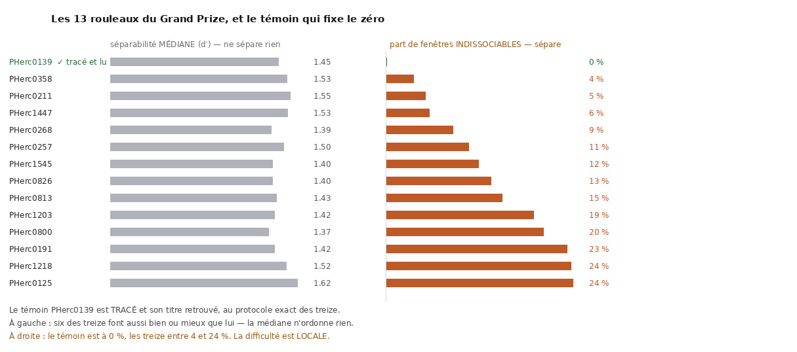

# Quel rouleau du Grand Prize attaquer en premier ? — la géométrie répond

2026-08-18. Première mesure de ce dépôt portant sur **les rouleaux du prix eux-mêmes**.

---

## 0. La carte, d'un coup d'œil



> **La colonne de gauche est là pour échouer, et c'est le résultat.** La séparabilité
> **médiane** ne distingue rien : les quatorze tiennent entre 1,37 et 1,62, et **six des
> treize** font aussi bien ou mieux que le témoin — un rouleau **tracé, dont le titre a été
> retrouvé**, au protocole exact des treize.
>
> ⭐ **C'est la queue qui sépare.** Le témoin est à **0 %** de fenêtres indissociables ; les
> treize s'étalent de **4 %** à **24 %**. La difficulté de ces rouleaux n'est pas globale,
> elle est **locale**.

⚠⚠ **Corrigé le 2026-08-20 : la dernière proposition de ce bloc a été retirée.** Elle
disait *« et c'est ce qui désigne `PHerc0358` (4 %) comme le premier à attaquer »*.
[`33`](33_la_carte_nest_pas_resolue.md) mesure l'incertitude de ces parts — elles portent
sur **15 à 35 fenêtres** — et trouve que **0 des 78 paires** de rouleaux est réellement
séparée, et **0 des 13** distinguable du témoin après correction de Holm. Le classement
n'est donc pas établi. Ce qui survit : la médiane ne sépare rien (ci-dessous), et les
treize **pris ensemble** diffèrent du témoin (42/300 contre 0/24). `PHerc0358` reste un
départ défendable — il a le meilleur point observé — mais c'est un choix par défaut
assumé, pas une conclusion de la mesure.

⚠ **Sans témoin apparié, aucun de ces chiffres ne veut dire quoi que ce soit.** Une part de
10 % n'est ni bonne ni mauvaise dans l'absolu ; elle l'est par rapport à un rouleau qu'on a
su lire, mesuré de la même façon.

⚠ Les deux colonnes partagent leur mise en page mais **pas leur échelle** : ce sont deux
grandeurs sans rapport, et une échelle commune suggérerait une comparaison qui n'a pas de
sens.

Figure : `src/figures/figure_difficulte.py`, depuis `docs/carte_separabilite/`.

```
uv run python src/figures/figure_difficulte.py \
    docs/carte_separabilite docs/images/16_carte_difficulte.png
```

⚠ Vérifié le 2026-09-05 : la commande régénère l'image **octet pour octet**
(`a163cd185ca73bcbf855c6bfee281f32`). Une commande qui rendrait une image *ressemblante* ne
vaudrait rien ici — c'est justement ce qui laisse une figure dériver de ses données sans que
personne ne le voie.

---

## 1. La question, et pourquoi elle était sans réponse

Le **Grand Prize 2027** (800 000 $ en première place, 25 juin 2027) porte sur **13
rouleaux**, et **aucun n'a de trace publiée** — vérifié : `PHerc0358/segments/` est vide.
Nos autres instruments jugent une trace contre le volume ; sur un rouleau non tracé ils
n'ont rien à mesurer.

⚠⚠ **Corrigé le 2026-08-19 : « aucun » est FAUX.** L'inventaire versionné
`docs/mesures/etat_rouleaux_prix.txt` (produit par `src/outils/etat_rouleaux_prix.sh`, cf `23` §1)
recense **trois** rouleaux du prix avec des segments publiés — **PHerc1447 (16)**,
**PHerc0800 (6)**, **PHerc1203 (1)**. L'affirmation exacte est **dix sur treize** non
tracés, dont `PHerc0358`, dont le `segments/` est bien vide.


Mais `00` §1 nomme la difficulté centrale en une phrase :

> *« Deux spires voisines sont à 300 µm ; une feuille fait 40 µm. Là où le rouleau est
> comprimé, cet écart tombe à zéro. »*

Cet écart-là se mesure **sans trace**, sur les **prédictions de surface** que les 13
publient. Et il répond à une question que personne n'a posée publiquement avec un
chiffre : **par lequel commencer ?**

## 2. La mesure

`src/nappe/espacement_spires.py`. Le long d'une ligne qui traverse les spires, les
surfaces prédites forment des groupes ; l'écart entre groupes successifs **est** l'écart
inter-spires.

⚠ **Une « surface » est un groupe de voxels, pas un voxel** : à 18,7 µm une feuille en
fait un ou deux, et compter chaque voxel rendrait des écarts de 1 partout — une mesure
de la résolution, pas du rouleau.

⚠ **L'estimateur n'a pas besoin de l'ombilic.** Une ligne oblique voit un écart *plus
grand* que le vrai ; seule la perpendiculaire voit le vrai. On mesure donc le long de x
**et** de y et on garde **le plus petit**. Ça évite de dépendre de l'axe d'enroulement,
que `06` §2.3 n'a toujours pas établi.

⚠ **Niveau 1 de la pyramide et pas 2** : au niveau 2 (37,4 µm) toute la plage utile tient
dans **8 voxels**, et les trois seuils rendaient trois lignes identiques. Au niveau 1
(18,7 µm) l'écart fait ⚠ **8 à 12 voxels** — encore quantifié, mais lisible.

⚠⚠ **Corrigé le 2026-08-19, et les DEUX versions étaient fausses.** Ce paragraphe
annonçait « 8 à 16 » et le §5 « 7 à 12 » — pour la même grandeur. Les valeurs mesurées
sont 156 / 169 / 173 / 187 / 190 / 225 µm, donc **8,3 à 12,0 voxels** à 18,7 µm. Le bas
venait du second, le haut du premier, et aucun des deux ne tenait entier.

⚠ **La prédiction publiée est BINAIRE** (valeurs 0 et 255 : le seuil est déjà appliqué,
`th0.2` figure dans le nom du fichier). Balayer le seuil ne peut donc rien dire, et
l'outil le **signale** au lieu d'imprimer N lignes identiques qui ressembleraient à une
robustesse.

⚠⚠ **Les 13 partagent la même prédiction de surface** — modèle `m7`, seuil 0,2, même
date d'entraînement — donc la comparaison entre eux ne mélange pas les modèles. Et le
témoin l'a aussi.

## 3. 🎯 Le tableau, avec son témoin

Témoin : **`PHercParis4`**, un rouleau qu'on a su **dérouler ET lire**, même prédiction,
pas physique quasi identique (19,2 µm contre 17,3–18,7).

Refait le **2026-08-27** sur l'étendue entière (108 sondes par rouleau au lieu de 64 sur la
moitié centrale) :

| rouleau | écart médian | p10 | min | **< 150 µm** | fenêtres |
|---|---:|---:|---:|---:|---:|
| **PHerc1218** | **147 µm** | 121 | 121 | **50 %** | 16 |
| **PHerc0125** | 150 µm | 135 | 131 | **52 %** | 23 |
| **PHerc1447** | 156 µm | 138 | 121 | **38 %** | 21 |
| **⭐ PHercParis4 — LU** | **173 µm** | **134** | **134** | **14 %** | **28** |
| PHerc0211 | 178 µm | 150 | 131 | 25 % | 20 |
| PHerc0257 | 187 µm | 169 | 169 | 0 % | 21 |
| PHerc0813 | 187 µm | 150 | 131 | 14 % | 28 |
| PHerc1203 | 187 µm | 150 | 131 | 21 % | 33 |
| PHerc0800 | 190 µm | 156 | 156 | 0 % | 26 |
| PHerc0191 | 206 µm | 150 | 131 | 13 % | 30 |
| PHerc0358 | 206 µm | 150 | 131 | 15 % | 27 |
| PHerc1545 | 206 µm | 146 | 131 | 21 % | 19 |
| PHerc0268 | 207 µm | 173 | 156 | 0 % | 38 |
| **PHerc0826** | **225 µm** | 139 | 131 | 21 % | 19 |

⭐⭐ **Le corpus est PLUS DUR qu'on ne l'avait mesuré, et c'est le sens attendu.** Cinq
rouleaux voient leur écart médian se desserrer (`PHerc0191`, `PHerc0257`, `PHerc0358`,
`PHerc0826`, `PHerc1545`, de 169–187 à 187–225 µm) contre trois qui se resserrent
(`PHerc0211`, `PHerc1218`, `PHerc1447`). Le témoin ne bouge pas d'un micromètre en médiane
— 173 µm dans les deux — et perd 4 points de queue.

⚠⚠ **Et le prix de la correction est une PERTE de puissance**, qu'il faut dire :
l'échantillonnage complet touche beaucoup de vide, donc **chaque rouleau rend moins de
fenêtres exploitables qu'avant** — 16 à 38 contre 27 à 62. Plus de sondes, moins de mesures.
La limite que [`33`](33_la_carte_nest_pas_resolue.md) pose sur le classement n'est donc pas
levée par cette correction : elle est **resserrée**.

⚠ Le classement fin reste sans objet pour la même raison qu'au point 1 : cinq rouleaux
partagent 187 µm et trois partagent 206 µm.

<details><summary>L'ancien tableau, 64 sondes sur la moitié centrale (2026-08-18 → 2026-08-27)</summary>

| rouleau | écart médian | p10 | min | **< 150 µm** |
|---|---:|---:|---:|---:|
| **PHerc0125** | **150 µm** | 132 | 131 | **59 %** |
| **PHerc1218** | 156 µm | 121 | 121 | **43 %** |
| PHerc0257 | 169 µm | 150 | 131 | 21 % |
| PHerc1545 | 169 µm | 150 | 131 | 42 % |
| PHerc1447 | 173 µm | 138 | 121 | 30 % |
| **⭐ PHercParis4 — LU** | **173 µm** | **134** | **134** | **18 %** |
| PHerc0191 | 187 µm | 150 | 131 | 15 % |
| PHerc0211 | 187 µm | 150 | 131 | 30 % |
| PHerc0358 | 187 µm | 150 | 140 | 18 % |
| PHerc0813 | 187 µm | 150 | 140 | 16 % |
| PHerc0826 | 187 µm | 150 | 131 | 19 % |
| PHerc1203 | 187 µm | 150 | 131 | 28 % |
| **PHerc0800** | 190 µm | 173 | 138 | **2 %** |
| **PHerc0268** | **225 µm** | 173 | 156 | **0 %** |

</details>

## 4. Ce que ça dit

**⚠⚠ Dix des treize sont aussi lâches ou plus que le rouleau déjà lu** (neuf avant la
correction du 2026-08-27). La compression n'est donc **pas** ce qui les a empêchés d'être
tracés — pas pour ceux-là.

> Un rouleau plus lâche que celui qu'on a su lire n'a pas d'excuse géométrique.

Ce qui reste comme causes candidates, non départagées ici : la **qualité du scan**
(énergie et contraste diffèrent : 113 keV et 116 keV contre 78 keV pour le témoin), la
qualité de la **prédiction** sur ces volumes-là, ou simplement que **personne n'a
essayé** — 33 échantillons sur 45 n'ont aucune surface tracée (`00` §6).

⭐⭐ **C'est la TROISIÈME qui a avancé, et elle est chiffrée** :
[`59`](59_la_campagne_plutot_que_le_rouleau.md) mesure que **31 rouleaux sur 45 n'ont aucun
segment publié** — personne ne les a tracés — et qu'**aucun des treize du prix ne publie de
détection d'encre**, dix n'ayant aucun segment du tout. « Personne n'a essayé » n'est donc
pas une hypothèse parmi trois : c'est l'état de la majorité du corpus.

⚠⚠ **Et la première — la qualité du scan — a été testée puis REJETÉE.** Le partage naïf
donnait 86 % contre 29 % de scans fins (p = 0,0081), mais 31 des 38 du groupe négatif
n'avaient jamais été tracés : restreint aux rouleaux qu'on a **tentés**, c'est 86 % contre
71 %, **p = 0,50**. Le scan fin suit l'attention portée à un rouleau, pas sa lisibilité.

**🎯 Et la réponse actionnable :** **`PHerc0257`, `PHerc0800` et `PHerc0268`** sont les plus
lâches — **0 %** de zones sous 150 µm tous les trois, contre **14 %** pour le témoin. Ce
sont eux qu'on attaquerait en premier si la géométrie était le seul critère. ⚠ Avant la
correction, la paire nommée ici était `PHerc0268` et `PHerc0800` (0 % et 2 %) ; `PHerc0257`
les rejoint en passant de 21 % à 0 %, ce qui est le plus gros déplacement du tableau.

⚠ À l'autre bout, **`PHerc0125`** (52 %) et **`PHerc1218`** (50 %) sont les deux nettement
plus comprimés que le témoin — avant la correction, `PHerc0125` était seul à 59 %. Ce sont
les deux pour lesquels « c'est trop serré » est une explication plausible.

## 5. ⚠ Ce que la mesure ne dit PAS

1. **Elle est quantifiée** : au niveau 1 les valeurs tombent sur 121 / 131 / 138 / 150 /
   156 / 169 / 173 / 187 / 190 / 225 µm, c'est-à-dire 7 à 12 voxels. Le **classement
   fin** entre deux rouleaux à 187 µm n'a pas de sens ; les **extrêmes** en ont un.
2. ✅ **Corrigé le 2026-08-27, dans le script puis dans les artefacts.** La limite disait
   *« 27 chunks par rouleau — nombre **nominal** ; l'échantillonnage réel varie et les
   artefacts ne l'enregistrent pas »*. Chaque JSON porte désormais `sondes` (108) et
   `chunks_avec_matiere` (16 à 38 selon le rouleau), et le balayage couvre **toute**
   l'étendue en x/y au lieu de sa moitié centrale. Le tableau du §3 a été refait dessus ;
   l'ancien est conservé juste en dessous, parce que l'écart entre les deux **est** le
   résultat de la correction.
3. ⚠ **La médiane et la queue ne classent pas pareil** : `PHerc1545` et `PHerc0257` ont
   la même médiane (169 µm) et **42 % contre 21 %** de zones serrées. La colonne
   « < 150 µm » porte plus d'information que la médiane, et il faut lire les deux.
4. Elle mesure ce que la **prédiction** voit, pas le papyrus. Une prédiction qui rate
   des feuilles rendrait des écarts trop grands — et c'est le sens qui flatte le
   rouleau.

## Reproduire

```bash
./src/outils/carte_difficulte.sh docs/carte_difficulte
uv run python src/tables/table_difficulte.py docs/carte_difficulte
```

---

## 6. 🎯 La qualité de scan : mesurée, et elle n'excuse pas non plus

`src/encre/separabilite_scan.py`. Le tableau des goulots de `2026_open_problems`
nomme littéralement ce qui manque — *« What would help : **scan-quality metrics** »* —
et définit le défaut dans ses propres mots : *« some regions lose **effective
separability** between layers »*.

**La mesure est un d′**, l'indice de discriminabilité entre les sommets (feuille) et les
creux (interstice) d'une ligne traversant les spires. Sans dimension, donc indépendant
du gain du détecteur.

### Le témoin est le bon

`PHerc0139` a été **tracé, et son titre retrouvé** — et il possède un scan au
**protocole exact des 13** (9,362 µm / 1,2 m / 113 keV).

| rouleau | d′ médian | p10 | min | **sous 1,0** |
|---|---:|---:|---:|---:|
| PHerc0125 | 1,62 | 0,83 | 0,52 | 24 % |
| PHerc0211 | 1,55 | 1,13 | 0,89 | 5 % |
| PHerc1447 | 1,53 | 1,28 | 0,92 | 6 % |
| PHerc0358 | 1,53 | 1,15 | 0,88 | **4 %** |
| PHerc1218 | 1,52 | 0,95 | 0,92 | 24 % |
| PHerc0257 | 1,50 | 1,15 | 0,79 | 11 % |
| **⭐ PHerc0139 — TRACÉ ET LU** | **1,45** | **1,15** | **1,00** | **0 %** |
| PHerc0813 | 1,43 | 0,97 | 0,85 | 15 % |
| PHerc1203 | 1,42 | 0,90 | 0,68 | 19 % |
| PHerc0191 | 1,42 | 0,94 | 0,68 | 23 % |
| PHerc1545 | 1,40 | 0,96 | 0,78 | 12 % |
| PHerc0826 | 1,40 | 0,86 | 0,74 | 13 % |
| PHerc0268 | 1,39 | 1,10 | 0,48 | 9 % |
| PHerc0800 | 1,37 | 0,97 | 0,93 | 20 % |

**Six des treize ont une séparabilité médiane égale ou meilleure que le témoin.**

### ⚠⚠ Mais c'est la QUEUE qui sépare, pas la médiane

Le témoin a une propriété qu'**aucun** des treize ne partage : **0 % de zones sous
d′ = 1,0**, et son minimum vaut exactement 1,00. Les treize en ont **4 % à 24 %**.

> La médiane dit qu'ils se valent. La queue dit que le rouleau qu'on a su lire n'avait
> **aucune** région indissociable, et que tous les autres en ont.

⚠ Réserve honnête : **15 à 35 chunks par rouleau**. Un « 0 % » sur 24 chunks est
compatible avec une petite fraction de mauvaises régions non tombée dans le sondage. Ce
qui se défend est l'**ordre de grandeur** — 0 contre 4–24 % — pas le zéro exact.

### 🎯 Ce que les deux cartes disent ensemble

| cause supposée pour les 13 | verdict |
|---|---|
| les spires sont trop serrées | ❌ 9 sur 13 sont **plus lâches** que le rouleau lu |
| le scan est trop voilé (médiane) | ❌ 6 sur 13 sont **aussi séparables** ou mieux |
| ⚠ le scan a des **poches** indissociables | ⭐ **oui** — 4 à 24 % contre 0 % pour le témoin |

**La difficulté n'est pas globale, elle est locale.** C'est exactement ce que la page
dit — *« scan quality is local. A scan can hold excellent regions and
nearly-impossible-to-unwrap ones in the very same volume »* — et c'est maintenant
chiffré par rouleau.

⭐ **Actionnable** : `PHerc0358` a la meilleure combinaison observée — d′ médian 1,53
(au-dessus du témoin) et **4 %** de zones indissociables, le minimum des treize. C'est
lui qu'on attaque en premier.

⚠⚠ **Corrigé le 2026-08-20.** Ce paragraphe disait *« C'est lui qu'on attaquerait en
premier »* comme si la mesure le désignait. Elle ne le désigne pas :
[`33`](33_la_carte_nest_pas_resolue.md) montre que son intervalle de confiance exact va de
**0,1 % à 18,3 %** et recouvre celui de chacun des douze autres. La réserve du paragraphe
précédent — « ce qui se défend est l'ordre de grandeur, pas le zéro exact » — était juste,
et elle va plus loin qu'il n'y paraissait : elle vaut aussi pour **l'ordre entre les
treize**. ⭐ Et `33` §3 chiffre ce qu'il faudrait pour trancher : **50 fenêtres par
rouleau** au lieu de 15–35, soit un échantillonnage plus dense de l'instrument existant.

⚠⚠ **Et elle a été lancée le jour même.** À 57–115 fenêtres par rouleau, **les treize
changent tous de rang** (rho de Spearman **−0,297**) : `PHerc0358` passe du 1ᵉʳ au **6ᵉ**,
et `PHerc0800` — 10ᵉ sur 13 ici — devient **le meilleur du lot à 2,6 %**. Le témoin, lui,
n'est plus à 0 % mais à **4 %**. Tous les chiffres de ce document restent les meilleures
estimations de leur campagne ; c'est leur **ordre** qui n'existait pas.
[`33` §4bis](33_la_carte_nest_pas_resolue.md).

### ⚠⚠ Et une limite qui vaut pour NOS DEUX instruments

Le d′ **et** l'écart feuille↔trace comparent des scans **à résolution égale**, jamais
entre résolutions. Mesuré sur le même rouleau, mêmes segments :

| campagne | profondeur de pile | écart médian à la trace | tiers central |
|---|---:|---:|---:|
| 9,362 µm (28 couches) | 262 µm | 28 µm | 66 % |
| 2,399 µm (109 couches) | 261 µm | 44 µm | 49 % |
| 1,129 µm (116 couches) | **131 µm** | 18 µm | 59 % |

Le scan grossier semble « meilleur ». Il ne l'est pas : à 28 couches l'écart se mesure
par pas de 9,4 µm, donc un pic à une couche du centre **lit** 9 µm là où le scan fin
lirait sa vraie valeur. Et la pile à 1,129 µm ne couvre que **131 µm** — la moitié des
autres — donc elle **tronque**, et son 18 µm est une borne inférieure.

> **Deux instruments, une même règle : ils classent des rouleaux à qualité de scan
> comparable. Ils ne disent rien sur « faut-il scanner plus fin ».** Le prétendre
> serait lire un artefact de quantification comme un résultat.

## Reproduire

```bash
./src/outils/carte_separabilite.sh                            # la campagne, témoin PHerc0139 inclus
uv run python src/tables/table_separabilite.py --help
```

⚠ Et la suite de cette carte est [`33`](33_la_carte_nest_pas_resolue.md) : elle **n'est pas
résolue** — 0 des 78 paires séparées, 0 des 13 rouleaux distingué du témoin après Holm.
