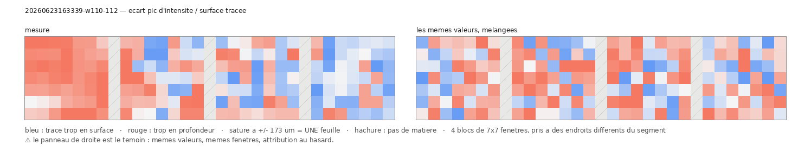
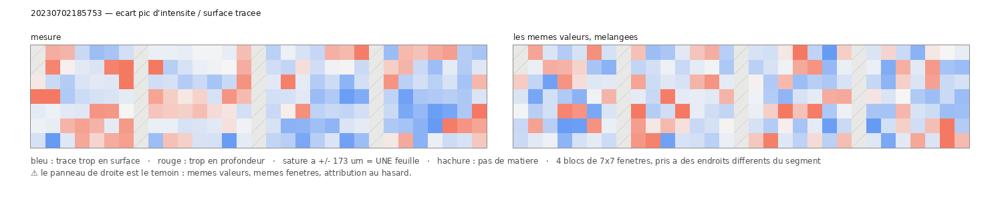

# Le champ de correction — l'erreur d'une trace est structurée, et translater ne la répare pas

2026-08-19. Voie J du batch `18`. `12` sait dire qu'une trace est décalée de 63 µm ; ça
condamne un segment sans dire quoi en faire. Ce document mesure la seule chose qui décide
entre **réparer** et **reprendre**.

---

## 1. La distinction qu'une médiane ne peut pas faire

Deux segments rendent le **même** écart médian de 63 µm :

| | écart par fenêtre | ce que c'est | remède |
|---|---|---|---|
| A | uniformément +63 µm | une **pose ratée** — la trace suit la bonne feuille, à côté | une translation du maillage |
| B | ±60 µm autour de 63 | un **saut de feuille** — elle change de spire en route | rien de rigide ; il faut retracer |

`12` les confond parce qu'une médiane ne voit pas la dispersion. `champ_correction.py`
les sépare en mesurant l'écart **fenêtre par fenêtre**, sur des blocs contigus, et en
rendant trois grandeurs :

- `decalage_median` — la translation qui minimise l'écart ;
- `residuel` — ce qui **reste après** cette translation, donc le vrai coût ;
- `coherence_voisins` — l'écart d'une fenêtre prédit-il celui de sa voisine.

⚠ Voisin *de grille* = voisin *sur la feuille* : un volume de surface est déjà paramétré,
et c'est ce qui rend la mesure licite. ⚠ Le témoin est un **mélange** des mêmes écarts :
si la cohérence y survivait, elle viendrait de la façon de compter et non de la géométrie.

## 2. ⚠⚠ Deux détails d'échantillonnage qui ont chacun tué une première version

1. **La grille entière est hors de portée** : 167 × 905 chunks, soit **4228 requêtes** par
   segment. Des blocs suffisent, et ils sont *meilleurs* — une cohérence entre fenêtres
   distantes de 768 voxels ne mesure pas des voisins.
2. **Des blocs posés régulièrement tombent dans le vide** : un volume de surface est
   majoritairement du remplissage (la bande est tordue dans un canevas rectangulaire).
   Mesuré : **6 fenêtres utiles sur 96**. Une passe de repérage trouve la matière **avant**
   de la sonder — sans elle, la campagne rapporte « pas assez de matière » sur des segments
   qui en sont pleins.

## 3. ⭐ Le champ est réel — sur deux rouleaux, 99 segments, sans exception

| corpus | segments | cohérence médiane | témoin mélange | segments battant leur témoin |
|---|---:|---:|---:|---|
| Scroll 1 (PHercParis4, 2,4 µm) | 80 | **+0,325** | −0,008 | **80 / 80** (p = 1,3e-25) |
| Scroll 4 (PHerc1667, 2,399 µm) | 19 | **+0,481** | −0,035 | **19 / 19** (p = 7,4e-08) |
| Scroll 5 (PHerc0172, 7,91 µm) | 53 | +0,183 | −0,030 | **51 / 53** (p = 2,7e-15) |

⚠ Scroll 5 est le seul où **deux segments** ne battent pas leur témoin, et sa cohérence
médiane est la plus basse (+0,183). Son voxel fait **7,91 µm** contre 2,4 : à trois fois
moins de résolution, une déformation douce se lit sur trois fois moins de pas. À rapporter
tel quel plutôt qu'à moyenner avec les deux autres.

> **L'erreur d'une trace n'est pas du bruit.** Elle est spatialement structurée partout,
> et le mélange des mêmes valeurs l'efface à chaque fois. C'est le contrôle qui rend la
> suite lisible : une cohérence qui survivrait au mélange ne mesurerait que l'arithmétique.

### Et ça se regarde

Le concours demande explicitement de *montrer visuellement* qu'une trace ne saute pas de
feuille. Chaque figure porte son **témoin à droite** : les mêmes valeurs, les mêmes
fenêtres, une attribution au hasard.

**Le cas le plus net du corpus** — `20260623163339-w110-112`, cohérence **+0,694** (témoin
−0,074), le maximum sur 80 :



Figure : `src/figures/figure_champ.py`.

Le premier bloc est une **plaque** rouge — la trace y est trop profonde de façon
continue — et le quatrième une plaque bleue. À droite, la même matière est du poivre et
sel.

**Le cas médian** — `20230702185753`, cohérence **+0,310**, à comparer à la médiane du
corpus (**+0,325**) :



⚠⚠ **Et c'est là qu'il faut être honnête** : sur le cas médian, la différence entre les
deux panneaux **se voit mal**. C'est exactement ce qu'un rho de 0,31 veut dire, et
publier seulement la figure du haut donnerait à croire à un effet qu'on n'a pas mesuré.
La structure est **réelle et systématique** (99 segments sur 99) ; elle n'est **pas
spectaculaire**.

## 4. ⭐⭐ Et le chiffre qui décide de la production

| corpus | part de l'erreur qu'une **translation** enlèverait |
|---|---:|
| Scroll 1 | **21,7 %** (p90 47,3 %) |
| Scroll 4 | **35,3 %** (p90 62,8 %) |
| Scroll 5 | **28,6 %** (p90 45,8 %) |

> **Translater le maillage est le mauvais remède.** Sur les deux rouleaux, la majorité de
> l'erreur reste après le meilleur déplacement rigide. Ce n'est pas une pose ratée : c'est
> une **déformation locale**, lisse — cohérente entre voisins, mais pas constante.

⚠ **Le fait sur lequel s'appuyer est plus simple que ce ratio**, parce qu'il ne dépend
d'aucune normalisation : sur Scroll 1, le décalage médian vaut **14,4 µm** et le résiduel
**56,4 µm**. Ce qu'une translation pourrait enlever est **quatre fois plus petit** que ce
qu'elle laisserait. `rigid_share` n'est qu'une façon d'écrire ça en pourcentage, et sa
définition (`|décalage| / (|décalage| + résiduel)`) est un choix — les deux nombres bruts
n'en sont pas un.

⚠ Ce que ça dit de la suite : la réparation utile n'est pas une translation mais un
**gauchissement** guidé par le champ. Ce document ne l'implémente pas ; il établit
laquelle des deux valait la peine d'être écrite, ce qui était toute la question.

### ⚠⚠ Et pourquoi le gauchissement n'est pas implémentable ICI

Il faut l'écrire à l'endroit où la conclusion est tirée, sinon elle se lit comme une
promesse qu'on ne tiendra pas.

Un gauchissement déplace le **maillage**. Or ce qu'on mesure vit dans le **volume de
surface**, qui est un artefact **publié** : il est engendré à partir du maillage par une
chaîne — paramétrisation, aplatissement, rendu — dont rien n'est ici. Déplacer le maillage
régénérerait un **autre** volume de surface, qu'on ne sait pas produire.

⚠ Et la contre-mesure évidente ne marche pas : re-échantillonner le volume existant à une
profondeur décalée **ne corrige rien**, parce que le volume ne contient que la fenêtre de
profondeur que la trace a déjà découpée. Ce qu'il faudrait atteindre est en dehors —
c'est exactement ce que `12` §9 a mesuré sur Scroll 4, où **61 %** des fenêtres ont leur
pic au bord de la pile.

> **Ce qui est livrable, c'est le champ.** De combien, où, et si c'est cohérent — pour qui
> a la chaîne. Le mesurer coûte 300 requêtes ; l'appliquer demande un outil que ce dépôt
> n'a pas, et prétendre le contraire serait le seul vrai défaut de ce document.

⚠⚠ **Une alerte posée puis levée par la mesure, le même jour.** `tracecheck` sur **un**
segment de Scroll 5 rendait `rigid_share` = **0,67** — une translation y aurait enlevé
deux tiers de l'erreur, l'inverse du motif. J'ai donc restreint la conclusion à « sur ces
deux rouleaux » et lancé les 53 segments.

**Verdict : ce segment était une exception.** La médiane du rouleau vaut **28,6 %**, entre
Scroll 1 et Scroll 4. La conclusion tient donc sur **trois** rouleaux, deux résolutions et
152 segments — et la restriction est levée.

> ⭐ C'est l'inverse du motif habituel de ce dépôt : d'ordinaire un effet vu sur peu de
> points **fond** quand n monte. Ici c'est une **contre-indication** vue sur un point qui
> a fondu. La règle est la même dans les deux sens — n = 1 n'est pas un résultat — et elle
> vient de payer dans la direction agréable.

## 5. Le résiduel reste SOUS une épaisseur de feuille — et j'ai d'abord dit le contraire

Le seuil qui sépare « la trace ondule dans sa feuille » de « elle a changé de feuille »
est le **pas inter-feuilles**. Sur Scroll 1 il vaut **172,8 µm**
(`docs/mesures/espacement_PHercParis4_L1.json`).

| | résiduel médian | en écarts inter-feuilles | segments au-dessus d'un écart |
|---|---:|---:|---:|
| Scroll 1 (pas 172,8 µm) | 56,4 µm | **0,33** | **1 / 80 (1 %)** — `20260701183146-w118-119`, à 1,02 écart |
| Scroll 5 (pas **142,8 µm**, mesuré sur lui au `11` §3) | 39,6 µm | **0,28** | **0 / 53 (0 %)** |

⚠⚠ **Correction d'une mesure faite deux heures plus tôt dans cette même session.** J'avais
appliqué **142,8 µm** — l'invariant de `11` §3, mesuré sur **PHerc0172** — à des segments
de **PHercParis4**. C'est le piège nº 6 du dépôt, *un chiffre emprunté n'est pas une
mesure*, et il gonflait le compte d'un facteur **4** (4 segments signalés au lieu de 1).

Le remède est dans l'outil, pas dans une note : `--pas-um` **n'a plus de défaut**, et sans
lui le compte de sauts de feuille **n'est pas rendu du tout**. ⚠ C'est aussi pourquoi la
ligne PHerc1667 est absente du tableau : aucune prédiction de surface n'est publiée pour ce
rouleau, donc son pas n'est pas mesurable ici, donc on ne le juge pas.

> **Sur les segments publiés de Scroll 1, le saut de feuille est essentiellement absent.**
> Les traces sont sur la bonne feuille ; elles y ondulent d'un tiers d'épaisseur.

## 6. ❌ Mais le champ ne prédit PAS le résultat

Contre les 80 cartes d'encre publiées, à n = 80 où **rho 0,31 est détectable** :

| grandeur du champ | rho ~ contraste d'encre | p |
|---|---:|---:|
| `coherence_voisins` | −0,023 | 0,84 |
| `residuel_median_um` | −0,028 | 0,80 |
| `\|decalage_median_um\|` | −0,084 | 0,46 |
| **`part_au_bord`** | **−0,275** | **0,014** * |

Et le test apparié — *à décalage comparable, un décalage cohérent rend-il une meilleure
carte ?* — donne **4,882 contre 4,758, p = 0,12** sur les 38 segments les plus décalés.
Non significatif.

⚠ **La seule grandeur qui prédit est celle qui demande s'il y a de la matière**, pas où
elle est : `part_au_bord` ici, `avec_matiere` dans `19` (+0,539). Ce qui compte pour le
résultat n'est pas que la trace soit à 50 µm près, c'est qu'elle soit **sur du papyrus**.

### Et pourtant il mesure bien un défaut — sur l'autre côté

Contre les **croisements recensés par `windcheck`**, c'est-à-dire contre un défaut de la
trace et non contre son résultat, sur les 54 segments qui ont les deux :

| grandeur du champ | rho ~ croisements | p |
|---|---:|---:|
| **`residuel_median_um`** | **+0,428** | **0,0012** * |
| `coherence_voisins` | +0,270 | 0,048 |

⚠ À n = 54, rho 0,37 est détectable, et deux corrélations sont testées (Bonferroni
p < 0,025) : **seul le résiduel tient**. La cohérence est nominale.

> ⭐⭐ **Les deux mesures côte à côte disent exactement ce qu'est cet instrument :**
>
> | le résiduel contre… | rho | p |
> |---|---:|---:|
> | les **croisements** de la trace | **+0,428** | 0,0012 |
> | l'**encre** que le pipeline en tire | −0,028 | 0,80 |
>
> Une trace plus déformée se recoupe davantage — et rend malgré tout la même encre. C'est
> la même forme que la métrique de proximité (⚠ `07` §7 — ce document n'a pas de §16) : **un défaut de la TRACE, pas du
> RÉSULTAT**, et cette fois mesuré des deux côtés dans le même document.

Et c'est cohérent avec le §5 : sur ce corpus presque rien n'a sauté de feuille, donc la
distinction réparable / irréparable n'a presque rien à discriminer. Le corpus où elle
compterait est un corpus de traces ratées, et les traces publiées ne le sont pas.

## 7. ⚠ Un motif qui n'est PAS établi, et pourquoi je le dis quand même

La qualité de trace dépend-elle de la position dans le rouleau ? Les segments portent leur
indice de fenêtre dans leur nom.

| corpus | grandeur | rho ~ indice | p |
|---|---|---:|---:|
| Scroll 1 (n = 57) | `residuel_p90_um` | +0,283 | 0,033 |
| Scroll 1 | `residuel_median_um` | +0,214 | 0,110 |
| Scroll 4 (n = 19) | `residuel_median_um` | +0,487 | 0,035 |
| Scroll 4 | `residuel_p90_um` | +0,127 | 0,61 |

> ⚠⚠ **Les deux corpus rendent significative une grandeur DIFFÉRENTE, et chacun rend l'autre
> nulle.** Aucune ne survivrait à la correction de multiplicité. À n = 57 la mesure détecte
> 0,36 ; à n = 19, 0,60.

C'est exactement la configuration des fibres à n = 12 (+0,330, puis **−0,192** à n = 54) et
du détecteur de phase à n = 8 (+0,52, puis **+0,15** à n = 38). **Ce n'est pas un résultat,
c'est une invitation à mesurer.** Les quatre signes sont positifs, ce qui vaut la peine
d'être noté et rien de plus.

## 8. Reproduire

```bash
./src/campagnes/campagne_champ.sh PHercParis4 2.4um  2.4   docs/champ_PHercParis4
./src/campagnes/campagne_champ.sh PHerc1667   2.399um 2.399 docs/champ_PHerc1667

cd inference_xpu
uv run python ../src/tables/table_champ.py ../docs/champ_PHercParis4 \
    --pas-um 172.8 --encre ../docs/mesures/croisement_encre.json --out ../docs/mesures/table_champ.json
```

⚠ `--pas-um` prend le pas **de ce rouleau-là**. Sans lui, le compte de sauts de feuille
n'est pas rendu — refuser une réponse vaut mieux qu'en rendre une fausse.
