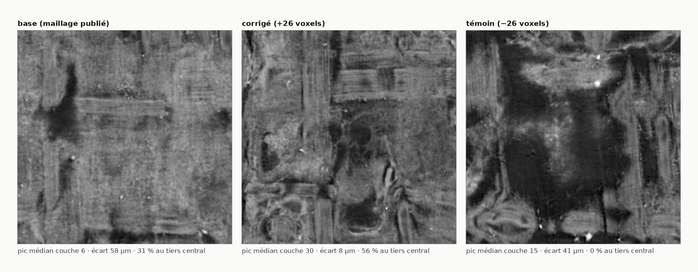

# Le champ de correction — l'erreur d'une trace est structurée, et translater ne la répare pas

2026-08-19. Voie J du batch `18`. `12` sait dire qu'une trace est décalée de 63 µm ; ça
condamne un segment sans dire quoi en faire. Ce document mesure la seule chose qui décide
entre **réparer** et **reprendre**.

---

## 1. La distinction qu'une médiane ne peut pas faire

Deux segments rendent le **même** écart médian de 63 µm :

| | écart par fenêtre | ce que c'est | remède |
|---|---|---|---|
| A | uniformément +63 µm | une **pose ratée** — la trace suit la bonne feuille, à côté | une translation du maillage |
| B | ±60 µm autour de 63 | un **saut de feuille** — elle change de spire en route | rien de rigide ; il faut retracer |

`12` les confond parce qu'une médiane ne voit pas la dispersion. `champ_correction.py`
les sépare en mesurant l'écart **fenêtre par fenêtre**, sur des blocs contigus, et en
rendant trois grandeurs :

- `decalage_median` — la translation qui minimise l'écart ;
- `residuel` — ce qui **reste après** cette translation, donc le vrai coût ;
- `coherence_voisins` — l'écart d'une fenêtre prédit-il celui de sa voisine.

⚠ Voisin *de grille* = voisin *sur la feuille* : un volume de surface est déjà paramétré,
et c'est ce qui rend la mesure licite. ⚠ Le témoin est un **mélange** des mêmes écarts :
si la cohérence y survivait, elle viendrait de la façon de compter et non de la géométrie.

## 2. ⚠⚠ Deux détails d'échantillonnage qui ont chacun tué une première version

1. **La grille entière est hors de portée** : 167 × 905 chunks, soit **4228 requêtes** par
   segment. Des blocs suffisent, et ils sont *meilleurs* — une cohérence entre fenêtres
   distantes de 768 voxels ne mesure pas des voisins.
2. **Des blocs posés régulièrement tombent dans le vide** : un volume de surface est
   majoritairement du remplissage (la bande est tordue dans un canevas rectangulaire).
   Mesuré : **6 fenêtres utiles sur 96**. Une passe de repérage trouve la matière **avant**
   de la sonder — sans elle, la campagne rapporte « pas assez de matière » sur des segments
   qui en sont pleins.

## 3. ⭐ Le champ est réel — sur deux rouleaux, 98 segments, sans exception

| corpus | segments | cohérence médiane | témoin mélange | segments battant leur témoin |
|---|---:|---:|---:|---|
| Scroll 1 (PHercParis4, 2,4 µm) | 79 | **+0,325** | −0,008 | **79 / 79** (p = 3,6e-25) |
| Scroll 4 (PHerc1667, 2,399 µm) | 19 | **+0,481** | −0,035 | **19 / 19** (p = 7,4e-08) |
| Scroll 5 (PHerc0172, 7,91 µm) | 53 | +0,183 | −0,030 | **50 / 53** (p = 1,3e-14) |

⚠ Scroll 5 est le seul où des segments ne battent pas leur témoin — **trois** depuis la
re-mesure du 2026-08-26, contre deux auparavant : le troisième est
`20251115002742-auto_grown_…_flatboi`, dont le volume amont a changé lui aussi (96 → 91
fenêtres avec matière). Sa cohérence médiane est la plus basse (+0,183). Son voxel fait **7,91 µm** contre 2,4 : à trois fois
moins de résolution, une déformation douce se lit sur trois fois moins de pas. À rapporter
tel quel plutôt qu'à moyenner avec les deux autres.

> **L'erreur d'une trace n'est pas du bruit.** Elle est spatialement structurée partout,
> et le mélange des mêmes valeurs l'efface à chaque fois. C'est le contrôle qui rend la
> suite lisible : une cohérence qui survivrait au mélange ne mesurerait que l'arithmétique.

### Et ça se regarde

Le concours demande explicitement de *montrer visuellement* qu'une trace ne saute pas de
feuille. Chaque figure porte son **témoin à droite** : les mêmes valeurs, les mêmes
fenêtres, une attribution au hasard.

**Le cas le plus net du corpus** — `20260623163339-w110-112`, cohérence **+0,694** (témoin
−0,074), le maximum sur 80 :


Figure : `src/figures/figure_champ.py`, depuis le volume de surface **publié** — la clé
est celle que `docs/mesures/volumes_surface_PHercParis4.txt` recense, donc rien n'est deviné.

```
uv run python src/figures/figure_champ.py \
    PHercParis4/segments/20260623163339-w110-112/surface-volumes/2.4um-0.22m-78keV-volume-20260411134726.zarr \
    docs/images/20_champ_fort.png --voxel-um 2.4 --pas-um 172.8 --cote 7
```

Le premier bloc est une **plaque** rouge — la trace y est trop profonde de façon
continue — et le quatrième une plaque bleue. À droite, la même matière est du poivre et
sel.

**Le cas médian** — `20230702185753`, cohérence **+0,310**, à comparer à la médiane du
corpus (**+0,325**) :


```
uv run python src/figures/figure_champ.py \
    PHercParis4/segments/20230702185753/surface-volumes/2.4um-0.22m-78keV-volume-20260411134726.zarr \
    docs/images/20_champ_correction.png --voxel-um 2.4 --pas-um 172.8 --cote 7
```

⚠ Vérifié le 2026-09-05 : les deux commandes régénèrent leur image **octet pour octet**
(`c43b6dab92d1afcc8f49e6fb57944bd0` et `684c7a4c13b9a882e0e9fb189c7b3123`). ⚠⚠ Le `--pas-um`
n'est pas un réglage d'esthétique : il **borne l'échelle de couleur**, donc « saturé » veut dire
« une feuille d'écart ». Le changer sans le dire ferait lire deux figures comme comparables
alors qu'elles ne le seraient plus. 172,8 µm est le pas de ce rouleau, celui que
`docs/mesures/table_champ.json` publie.

⚠⚠ **Et c'est là qu'il faut être honnête** : sur le cas médian, la différence entre les
deux panneaux **se voit mal**. C'est exactement ce qu'un rho de 0,31 veut dire, et
publier seulement la figure du haut donnerait à croire à un effet qu'on n'a pas mesuré.
La structure est **réelle et systématique** (98 segments sur 98) ; elle n'est **pas
spectaculaire**.

## 4. ⭐⭐ Et le chiffre qui décide de la production

| corpus | part de l'erreur qu'une **translation** enlèverait |
|---|---:|
| Scroll 1 | **22,1 %** (p90 47,8 %) |
| Scroll 4 | **35,3 %** (p90 62,8 %) |
| Scroll 5 | **28,6 %** (p90 45,8 %) |

> **Translater le maillage est le mauvais remède.** Sur les deux rouleaux, la majorité de
> l'erreur reste après le meilleur déplacement rigide. Ce n'est pas une pose ratée : c'est
> une **déformation locale**, lisse — cohérente entre voisins, mais pas constante.

⚠ **Le fait sur lequel s'appuyer est plus simple que ce ratio**, parce qu'il ne dépend
d'aucune normalisation : sur Scroll 1, le décalage médian vaut **14,4 µm** et le résiduel
**56,4 µm**. Ce qu'une translation pourrait enlever est **quatre fois plus petit** que ce
qu'elle laisserait. `rigid_share` n'est qu'une façon d'écrire ça en pourcentage, et sa
définition (`|décalage| / (|décalage| + résiduel)`) est un choix — les deux nombres bruts
n'en sont pas un.

⚠ Ce que ça dit de la suite : la réparation utile n'est pas une translation mais un
**gauchissement** guidé par le champ. Ce document ne l'implémente pas ; il établit
laquelle des deux valait la peine d'être écrite, ce qui était toute la question.

### ⚠⚠ Et pourquoi le gauchissement n'est pas implémentable ICI

Il faut l'écrire à l'endroit où la conclusion est tirée, sinon elle se lit comme une
promesse qu'on ne tiendra pas.

Un gauchissement déplace le **maillage**. Or ce qu'on mesure vit dans le **volume de
surface**, qui est un artefact **publié** : il est engendré à partir du maillage par une
chaîne — paramétrisation, aplatissement, rendu — dont rien n'est ici. Déplacer le maillage
régénérerait un **autre** volume de surface, qu'on ne sait pas produire.

⚠ Et la contre-mesure évidente ne marche pas : re-échantillonner le volume existant à une
profondeur décalée **ne corrige rien**, parce que le volume ne contient que la fenêtre de
profondeur que la trace a déjà découpée. Ce qu'il faudrait atteindre est en dehors —
c'est exactement ce que `12` §9 a mesuré sur Scroll 4, où **61 %** des fenêtres ont leur
pic au bord de la pile.

> **Ce qui est livrable, c'est le champ.** De combien, où, et si c'est cohérent — pour qui
> a la chaîne. Le mesurer coûte 300 requêtes ; l'appliquer demande un outil que ce dépôt
> n'a pas, et prétendre le contraire serait le seul vrai défaut de ce document.

⚠⚠ **Une alerte posée puis levée par la mesure, le même jour.** `tracecheck` sur **un**
segment de Scroll 5 rendait `rigid_share` = **0,67** — une translation y aurait enlevé
deux tiers de l'erreur, l'inverse du motif. J'ai donc restreint la conclusion à « sur ces
deux rouleaux » et lancé les 53 segments.

**Verdict : ce segment était une exception.** La médiane du rouleau vaut **28,6 %**, entre
Scroll 1 et Scroll 4. La conclusion tient donc sur **trois** rouleaux, deux résolutions et
152 segments — et la restriction est levée.

> ⭐ C'est l'inverse du motif habituel de ce dépôt : d'ordinaire un effet vu sur peu de
> points **fond** quand n monte. Ici c'est une **contre-indication** vue sur un point qui
> a fondu. La règle est la même dans les deux sens — n = 1 n'est pas un résultat — et elle
> vient de payer dans la direction agréable.

## 5. Le résiduel reste SOUS une épaisseur de feuille — et j'ai d'abord dit le contraire

Le seuil qui sépare « la trace ondule dans sa feuille » de « elle a changé de feuille »
est le **pas inter-feuilles**. Sur Scroll 1 il vaut **172,8 µm**
(`docs/mesures/espacement_PHercParis4_L1.json`).

| | résiduel médian | en écarts inter-feuilles | segments au-dessus d'un écart |
|---|---:|---:|---:|
| Scroll 1 (pas 172,8 µm) | 56,4 µm | **0,33** | **1 / 79 (1 %)** — `20260701183146-w118-119`, à 1,02 écart |
| Scroll 5 (pas **142,8 µm**, mesuré sur lui au `11` §3) | 39,6 µm | **0,28** | **0 / 53 (0 %)** |

⚠⚠ **Correction d'une mesure faite deux heures plus tôt dans cette même session.** J'avais
appliqué **142,8 µm** — l'invariant de `11` §3, mesuré sur **PHerc0172** — à des segments
de **PHercParis4**. C'est le piège nº 6 du dépôt, *un chiffre emprunté n'est pas une
mesure*, et il gonflait le compte d'un facteur **4** (4 segments signalés au lieu de 1).

Le remède est dans l'outil, pas dans une note : `--pas-um` **n'a plus de défaut**, et sans
lui le compte de sauts de feuille **n'est pas rendu du tout**. ⚠ C'est aussi pourquoi la
ligne PHerc1667 est absente du tableau : aucune prédiction de surface n'est publiée pour ce
rouleau, donc son pas n'est pas mesurable ici, donc on ne le juge pas.

> **Sur les segments publiés de Scroll 1, le saut de feuille est essentiellement absent.**
> Les traces sont sur la bonne feuille ; elles y ondulent d'un tiers d'épaisseur.

## 6. ❌ Mais le champ ne prédit PAS le résultat

Contre les cartes d'encre publiées, à n = 79 où **rho 0,311 est détectable**
*(re-mesuré le 2026-08-26 — l'encadré ci-dessous dit ce qui a bougé et pourquoi)* :

| grandeur du champ | rho ~ contraste d'encre | p |
|---|---:|---:|
| `coherence_voisins` | −0,025 | 0,83 |
| `residuel_median_um` | −0,013 | 0,91 |
| `\|decalage_median_um\|` | −0,065 | 0,57 |
| **`part_au_bord`** | **−0,242** | **0,032** * |

Et le test apparié — *à décalage comparable, un décalage cohérent rend-il une meilleure
carte ?* — donne **4,882 contre 4,865, p = 0,22** sur les 39 segments les plus décalés.
Non significatif.

> ### ⚠⚠ Ce tableau a bougé, et il y a TROIS causes qu'il ne faut pas confondre
>
> La version publiée disait **−0,275** à n = 80, et le test apparié **4,758 / p = 0,12**.
> Trois choses ont changé entre le 2026-08-19 et le 2026-08-26, et **une seule est un
> correctif de notre part** :
>
> 1. **Un segment a été retiré en amont.** `20260623145652-w059-063` n'a plus de
>    `.zarray` au niveau 0 : il n'est plus mesurable. n passe de 80 à 79.
> 2. ⚠⚠ **Trois volumes de surface ont CHANGÉ en amont** — et c'est le fait le plus
>    important de cette re-mesure, parce qu'il porte sur tout ce que ce dépôt mesure
>    contre des artefacts distants :
>
>    | segment | fenêtres avec matière | décalage médian |
>    |---|---:|---:|
>    | `20260623144957-w053-058` | 96 → 95 | +30,0 → +31,2 µm |
>    | `20260623151041-w069-072` | 96 → 91 | +14,4 → **+31,2 µm** |
>    | `20260623154617-w089-091` | 96 → **78** | −37,2 → −34,8 µm |
>
>    **Un volume de surface publié n'est pas un artefact figé.** Une mesure prise contre
>    lui porte donc une date, et deux campagnes séparées de huit jours ne sont pas
>    strictement comparables. Les trois appartiennent au même lot `20260623`, ce qui
>    ressemble à un ré-rendu de ce lot-là.
> 3. **La règle « au bord » a été corrigée** (§8) : elle reclasse **75 fenêtres sur
>    7 499**, réparties sur **48 des 79 segments**.
>
> ⚠ **Je ne décompose donc PAS le déplacement du rho entre ces causes.** Sur les mêmes 79
> segments, l'ancienne règle appliquée aux anciens fichiers donne −0,264 — mais ces
> fichiers portent les valeurs d'AVANT la dérive amont, donc l'écart avec −0,242 mélange
> la règle et la dérive. Attribuer −0,022 à la seule correction serait une précision que
> la mesure ne porte pas.
>
> ⭐ **Ce qui survit, et ce qui s'affaiblit.** `part_au_bord` reste la seule grandeur sous
> p = 0,05, donc la conclusion du paragraphe suivant tient. Mais **0,242 est désormais
> sous le 0,311 que n = 79 rend détectable** : la réserve que ce document portait déjà se
> resserre au lieu de se lever.

⚠ **La seule grandeur qui prédit est celle qui demande s'il y a de la matière**, pas où
elle est : `part_au_bord` ici, `avec_matiere` dans `19` (+0,539). Ce qui compte pour le
résultat n'est pas que la trace soit à 50 µm près, c'est qu'elle soit **sur du papyrus**.

### Et pourtant il mesure bien un défaut — sur l'autre côté

Contre les **croisements recensés par `windcheck`**, c'est-à-dire contre un défaut de la
trace et non contre son résultat, sur les 54 segments qui ont les deux :

| grandeur du champ | rho ~ croisements | p |
|---|---:|---:|
| **`residuel_median_um`** | **+0,428** | **0,0012** * |
| `coherence_voisins` | +0,270 | 0,048 |

⚠ À n = 54, rho 0,37 est détectable, et deux corrélations sont testées (Bonferroni
p < 0,025) : **seul le résiduel tient**. La cohérence est nominale.

> ⭐⭐ **Les deux mesures côte à côte disent exactement ce qu'est cet instrument :**
>
> | le résiduel contre… | rho | p |
> |---|---:|---:|
> | les **croisements** de la trace | **+0,428** | 0,0012 |
> | l'**encre** que le pipeline en tire | −0,028 | 0,80 |
>
> Une trace plus déformée se recoupe davantage — et rend malgré tout la même encre. C'est
> la même forme que la métrique de proximité (⚠ `07` §7 — ce document n'a pas de §16) : **un défaut de la TRACE, pas du
> RÉSULTAT**, et cette fois mesuré des deux côtés dans le même document.

Et c'est cohérent avec le §5 : sur ce corpus presque rien n'a sauté de feuille, donc la
distinction réparable / irréparable n'a presque rien à discriminer. Le corpus où elle
compterait est un corpus de traces ratées, et les traces publiées ne le sont pas.

## 7. ⚠ Un motif qui n'est PAS établi, et pourquoi je le dis quand même

La qualité de trace dépend-elle de la position dans le rouleau ? Les segments portent leur
indice de fenêtre dans leur nom.

| corpus | grandeur | rho ~ indice | p |
|---|---|---:|---:|
| Scroll 1 (n = 57) | `residuel_p90_um` | +0,283 | 0,033 |
| Scroll 1 | `residuel_median_um` | +0,214 | 0,110 |
| Scroll 4 (n = 19) | `residuel_median_um` | +0,487 | 0,035 |
| Scroll 4 | `residuel_p90_um` | +0,127 | 0,61 |

> ⚠⚠ **Les deux corpus rendent significative une grandeur DIFFÉRENTE, et chacun rend l'autre
> nulle.** Aucune ne survivrait à la correction de multiplicité. À n = 57 la mesure détecte
> 0,36 ; à n = 19, 0,60.

C'est exactement la configuration des fibres à n = 12 (+0,330, puis **−0,192** à n = 54) et
du détecteur de phase à n = 8 (+0,52, puis **+0,15** à n = 38). **Ce n'est pas un résultat,
c'est une invitation à mesurer.** Les quatre signes sont positifs, ce qui vaut la peine
d'être noté et rien de plus.

## 8. ⭐⭐ Ce qui est livrable : le champ, fenêtre par fenêtre

La fin du §4 ci-dessus écrit que ce qui est livrable, c'est **le champ** — de combien, où, et
si c'est cohérent — pour qui a la chaîne. Il restait à le livrer. Un résumé rend une
médiane, et une médiane ne dit à personne *où* déplacer *quoi* : c'est exactement le
reproche que ce document adresse à `12`, et il valait aussi pour sa propre sortie.

`champ_correction.py --fenetres <dossier>` écrit, par segment, **trois groupes**, et il en
faut trois parce qu'il manquait trois réponses :

| groupe | la question à laquelle il répond |
|---|---|
| `geometrie` | ce qu'un index de fenêtre **veut dire** : forme du volume, taille de chunk, couche tracée |
| `fenetres` | **où** et **de combien** : une ligne par fenêtre qui porte de la matière, avec son pavé de pixels `[ligne0, ligne1[ × [colonne0, colonne1[` |
| `blocs` | **jusqu'où l'adjacence est vraie** |

⚠⚠ **L'écart sort en index de couche, jamais en « µm le long de +n ».** Une normale n'a
pas de sens — `valider_champ_normal.py` l'écrit noir sur blanc, et le maillage se retourne
par `--flip-normals` sans que rien ne bouge. Un champ exprimé le long de la normale
demande donc à son lecteur une convention que personne n'a écrite, et s'en tromper
**double** l'erreur au lieu de l'annuler. « La matière est à la couche `couche_pic`, la
trace est à `couche_tracee` » n'a, elle, aucune ambiguïté : c'est le rendu lui-même qui a
ordonné ces couches. Les µm voyagent à côté, avec le pas qui les a produits, pour qui veut
une longueur.

⚠ **Une fenêtre saturée n'est pas une mesure, c'est une borne.** Son pic est sur la
première ou la dernière couche, donc le vrai pic peut être **en dehors** — c'est la limite
que la fin du §4 tire, et les 61 % de Scroll 4. Le drapeau voyage sur **chaque** enregistrement plutôt
que dans une note de bas de page, parce qu'un lecteur qui applique ces écarts-là déplace
son maillage d'une valeur tronquée sans qu'aucun symptôme n'apparaisse.

⚠ **Les blocs sortent, et ce n'est pas de la décoration.** L'adjacence n'existe qu'à
l'intérieur d'un bloc : deux blocs sont posés loin l'un de l'autre sur le segment (§2).
Une liste plate se lirait comme une grille continue, et lisser sur de tels « voisins »
mélangerait des endroits distants de milliers de voxels.

⭐ **Le résumé et l'export sortent du même passage de requêtes**, et c'est vérifié
autrement que par la parole : la batterie **reconstruit** les quatre chiffres publiés
(médiane, résiduel, p90, part au bord) à partir des seuls enregistrements exportés et
exige l'égalité exacte. Deux campagnes séparées auraient rendu deux échantillonnages, donc
deux mesures libres de diverger, et rien n'aurait dit laquelle a été publiée.

### ⚠⚠ Et l'export a trouvé un vrai défaut : deux réponses à « le pic est-il au bord »

Le premier segment exporté a rendu **7** fenêtres saturées là où le résumé en annonçait
**8**. La cause n'est pas un arrondi :

| | la règle | ce qu'elle marque |
|---|---|---|
| `zarr_depth.py` | `pic == 0` ou `pic == depth - 1` | la première et la dernière couche |
| `champ_correction.py` | `ecart <= -(depth // 2)` ou `ecart >= depth // 2 - 1` | idem **si `depth` est pair** |

Écrite en **écart signé**, la règle devient asymétrique — et cette asymétrie est
exactement juste pour une pile de profondeur **paire**, parce que la couche tracée
`depth // 2` n'y est pas au centre. Pour une pile **impaire** elle se trompe d'une couche
et compte l'**avant-dernière** comme un bord. Or les piles réelles de ce dépôt sont
impaires : **33** et **109**. Mesuré sur `PHercParis4/20230702185753`, pile de 109
couches : la fenêtre fautive a son pic à la couche **107**, la dernière étant la 108.

> **La règle est désormais écrite une seule fois**, dans `zarr_depth.au_bord`, sur la
> couche absolue — la grandeur dont elle parle. `champ_correction` n'a plus sa propre
> réponse.

⚠ **Et la vérification passait pour la seule raison qui la rendait incapable d'échouer** :
toutes les fixtures de la batterie avaient une profondeur **paire**, c'est-à-dire la
parité pour laquelle les deux rédactions coïncident. Le cas impair est maintenant dans la
batterie, avec la couche `depth - 2` nommée comme piège.

### ⚠⚠ Ce que la correction déplace — et une prédiction faite avant la mesure, qui échoue

La règle fausse comptait l'**avant-dernière** couche comme un bord, donc son effet est
l'occupation de **cette couche-là**. Sur deux rouleaux à pile de 109 le taux mesuré est
tombé sur le taux **uniforme** (1/109 = 0,92 %), ce qui suggérait une loi. Prédiction
écrite avant de mesurer le troisième : une pile de **33** couches devrait donner **3,03 %**.

| rouleau | pile | reclassées | segments | taux | uniforme 1/pile |
|---|---:|---:|---:|---:|---:|
| Scroll 1 (PHercParis4) | 109 | 75 / 7 499 | 48 / 79 | **1,00 %** | 0,92 % |
| Scroll 4 (PHerc1667) | 109 | 17 / 1 741 | 8 / 19 | **0,98 %** | 0,92 % |
| Scroll 5 (PHerc0172) | 33 | 108 / 4 987 | 45 / 53 | **2,17 %** | **3,03 %** |

❌ **La prédiction échoue** : 2,17 % contre 3,03 % attendus, soit 28 % en dessous. La
direction est bonne — une pile grossière est bien plus touchée — mais pas la loi.

⚠ **Et le mécanisme évident est éliminé par la mesure, pas par l'argument.** J'ai supposé
que la censure dépeuplait la couche voisine du bord : si les pics s'entassent à la borne,
celle d'à côté serait creusée. **Scroll 4 le réfute** — c'est lui qui a la plus forte
saturation (**15,4 %** contre 8,4 et 11,4) et c'est lui qui tombe exactement sur le taux
uniforme. Une saturation deux fois plus forte ne creuse rien.

> **Ce que le troisième rouleau apprend, c'est que les deux premiers s'accordaient pour
> rien.** Deux mesures à 0,92 % attendu et 1,00 / 0,98 % obtenus ressemblaient à une loi ;
> le cas à pile courte montre qu'il n'y en a pas. L'effet est l'occupation d'**une** couche
> près du bord, et elle dépend de la distribution des pics à cet endroit — pas de 1/pile.
> Avec les seules piles de 109, j'aurais publié « le taux est uniforme » comme un résultat.

Elle ne déplace en revanche **aucun verdict individuel** — jamais plus de trois fenêtres
par segment sur Scroll 1 ; ce qu'elle déplace est la corrélation de corpus du §6.

### ⭐ Ce que la censure coûte, et pourquoi la réponse est un ENCADREMENT

Une fenêtre saturée n'est pas une mesure, c'est une **borne**. Le décalage médian publié
les compte pourtant comme des valeurs — et les jeter n'est pas neutre non plus, puisque ce
sont exactement les fenêtres où la feuille est le plus loin. Les deux chiffres sont donc
faux dans des sens **connus et opposés**, ce qui est précisément ce qui les rend utiles :
leur **paire encadre** la vérité. Même forme que le seuil que `prediction_50um` ne peut pas
trancher, et écrire un seul des deux reviendrait à choisir un biais sans le dire.

| rouleau | fenêtres | saturées | part applicable (méd. / pire) | encadrement (méd. / max) |
|---|---:|---:|---:|---:|
| Scroll 1 (PHercParis4, pile 109) | 7 499 | 630 | 0,927 / 0,737 | 3,6 / **30,0 µm** |
| Scroll 4 (PHerc1667, pile 109) | 1 741 | **268** | 0,860 / **0,615** | 9,6 / **82,8 µm** |
| Scroll 5 (PHerc0172, pile 33) | 4 987 | 569 | 0,890 / 0,771 | **0,0** / 7,9 µm |

⚠⚠ **Et l'encadrement se lit contre les seuils du dépôt, pas contre un nombre choisi** :
`carte_segments.py` publie **40 µm** (même feuille, raccordable) et **250 µm** (feuilles
voisines). Sur Scroll 1 le pire encadrement vaut 30 µm, donc **sous** la bande « même
feuille » — mais sur **Scroll 4 il vaut 82,8 µm, soit le double du seuil**.

> **Correction d'une affirmation que ce document portait depuis deux commits.** J'avais
> écrit, sur les seuls chiffres de Scroll 1, que « la censure ne déplace aucune décision de
> raccordement ». C'est vrai de Scroll 1 et **faux de Scroll 4**, où le pire segment n'a que
> **61,5 %** de fenêtres applicables. Une propriété mesurée sur un rouleau et énoncée comme
> générale : c'est exactement ce que ce dépôt reproche ailleurs à un chiffre emprunté, et
> ce sont les deux campagnes suivantes qui l'ont attrapé.
>
> ⚠ Scroll 5 est le cas inverse et il mérite d'être dit : son encadrement médian vaut
> **zéro**. Sa pile de 33 couches est trop grossière pour que retirer les bornes déplace
> une médiane d'un cran — l'absence de biais y est un artefact de résolution, pas une
> qualité de la trace.

⚠ Ce calcul n'est possible **que** grâce à l'export : un résumé porte la *part* censurée,
jamais *quelles* fenêtres le sont, donc il ne permet pas de recalculer la médiane sans
elles.

## 9. ⭐⭐ Appliquer : l'outil existe, et voici exactement ce qu'il peut gagner

Le §4 écrivait que corriger était hors de portée *« parce que la chaîne maillage → rendu
n'est pas ici »*. Elle y est depuis le 2026-08-19, et
[`src/nappe/gauchir_nappe.py`](../src/nappe/gauchir_nappe.py) déplace désormais chaque
point **le long de sa propre normale** — ce qui n'est déjà pas une translation rigide.

⚠ **Le signe n'est pas connu a priori** et ne s'invente pas : l'ordre des couches est
celui du rendeur et une normale n'a pas de sens (`valider_champ_normal.py`). Le protocole
est donc empirique — déplacer, re-rendre, mesurer — et l'outil le dit dans son en-tête.

### Ce que le champ permet de décider AVANT de rendre

⭐ C'est l'usage que l'export du §8 débloque : au lieu de rendre pour voir, on lit le
champ. Sur `20260701183128-w053-058` — le segment **le plus réparable des 79** (cohérence
+0,405, résiduel 44,4 µm, 6 % au bord) :

| bloc de 4×4 fenêtres | médiane | étendue | écart-type |
|---|---:|---:|---:|
| 0 | **−34** | 90 | 26,7 |
| 1 | +26 | 83 | 18,0 |
| 2 | +17 | 90 | 24,0 |
| 3 | +15 | 85 | 26,6 |
| 4 | +25 | 87 | 22,9 |
| 5 | **−18** | 84 | 31,4 |
| **segment (90 fenêtres mesurées)** | **+19** | **101** | **30,4** |

*(en couches ; fenêtres saturées exclues, ce que seul l'export par fenêtre permet)*

> **L'étendue vaut 101 couches, soit 242 µm — c'est 1,4 fois le pas inter-feuilles de ce
> rouleau (172,8 µm).** La trace ne visite donc pas une feuille avec un décalage : elle en
> visite **plus d'une** le long du segment. Et deux blocs sur six ont une médiane de signe
> **opposé** aux quatre autres, donc aucun déplacement unique ne sert tout le segment.
>
> ⭐ Retirer la médiane du segment enlève **+19 couches = 46 µm** d'une erreur dont
> l'étendue est 242 µm. C'est le même verdict que le §4 — une translation n'enlève que
> **22,1 %** — mais mesuré cette fois **par fenêtre**, ce qui dit *pourquoi* : pas une pose
> décalée, une trace qui change de feuille en cours de route.

⚠⚠ **Et la censure peut INVERSER un signe.** La médiane du bloc 5 vaut **+22** en comptant
les fenêtres saturées et **−18** en ne gardant que les mesures. Une borne comptée comme une
valeur ne fait pas qu'ajouter du bruit : elle peut faire pointer la correction dans la
mauvaise direction. C'est l'argument le plus concret en faveur du drapeau `sature` du §8.

### ⭐⭐⭐ Et le gain EST montré : trois fois la même couche

Prédit ci-dessus depuis le seul champ, puis rendu. Le bloc 1 (médiane +26, écart-type
18,0, **zéro fenêtre saturée**) découpé à 128 × 128 cellules, rendu en **61 couches**
— 146 µm, sous le pas inter-feuilles de 172,8 µm, comme la règle ci-dessous l'exige —
dans les trois états, **au même recadrage** `2560×2560 from (0,0)` :

| version | pic médian | écart à la trace | tiers central | au bord |
|---|---:|---:|---:|---:|
| base (maillage publié) | couche 6 | **58 µm** | 31 % | 12 % |
| **corrigé, +26 voxels** | **couche 30** | **8 µm** | **56 %** | 25 % |
| témoin, −26 voxels | couche 15 | 41 µm | **0 %** | 25 % |



> ⭐⭐ **Le pic médian atterrit exactement sur la couche tracée**, et l'écart tombe d'un
> facteur **7**. Le témoin de signe opposé **dégrade** — 0 % au tiers central — donc ce
> qui agit est bien le déplacement et pas un effet de bord du rendu. Et ça se voit : les
> fibres et le tissage sont nets au centre, plats à gauche, noyés à droite. C'est ce que
> la page `Prizes` demande de montrer, *« papyrus fibers are visible on your output
> surface »*.
>
> ⚠ **Ce qui ne s'améliore PAS, et c'était prévu** : le p90 passe de 68 à 72 µm, et la
> part au bord monte de 12 à 25 %. Un déplacement unique ne sert pas les seize fenêtres :
> il centre la médiane et laisse la dispersion intacte. C'est exactement ce que le tableau
> par bloc annonçait — écart-type 18 couches — et c'est la mesure qui le confirme, pas
> l'argument.
>
> ⚠ **Le signe a été mesuré, pas déduit.** Les deux ont été rendus. Aucune convention
> n'était écrite qui aurait permis de le savoir d'avance.

### ⚠⚠ La distorsion visible sur les deux images corrigées : ce n'est pas un repli

Les deux panneaux déplacés portent, par endroits, une déformation que la base n'a pas.
Deux causes étaient candidates, et **les deux ont été mesurées plutôt qu'argumentées** :

1. ❌ **Un repli de la nappe.** Écarté par l'instrument du dépôt : `vc_tifxyz_selfcross`
   rend **zéro auto-intersection transversale** sur les trois maillages.
2. ❌ **Un bruit des normales**, qu'un déplacement amplifierait d'autant. Écarté par la
   forme du champ : l'étirement a une **cohérence entre voisines de +0,764**, contre un
   témoin de mélange à **+0,000**. Un bruit de normale donnerait du sel-et-poivre, donc
   une cohérence nulle.
3. ✅ **La courbure.** Un déplacement le long de la normale **n'est pas une isométrie** :
   l'aire d'une maille décalée de `d` vaut `(1 − 2Hd + Kd²)` fois la sienne. La nappe
   s'étire là où elle est convexe et se comprime là où elle est concave.

| déplacement | aire médiane | p01 | p99 | aire totale |
|---:|---:|---:|---:|---:|
| ±5 voxels | ≈ 1,000 | 0,952 | 1,048 | 0,999 / 1,001 |
| **±26 voxels** | ≈ 1,000 | **0,765** | **1,255** | 0,996 / 1,004 |
| ±60 voxels | ≈ 0,997 | **0,476** | **1,608** | 0,990 / 1,010 |

> ⭐ **La médiane ne bouge presque pas, les extrêmes oui**, et l'effet est **linéaire en
> `d`** : ±5 % d'aire à 5 voxels, ±25 % à 26, ±55 % à 60. C'est pourquoi les deux images
> sont distordues **en sens opposés** — l'aire totale vaut 0,996 pour +26 et 1,004 pour
> −26, la signature de la courbure moyenne.
>
> ⚠⚠ **La conséquence pratique : une correction ne peut pas être arbitrairement grande.**
> La distorsion est son prix, et il croît proportionnellement au déplacement. Un
> gauchissement par fenêtre, lui, déplacerait peu partout au lieu de beaucoup en bloc —
> c'est l'argument géométrique en faveur du champ du §8, indépendamment de son gain.

⚠ `gauchir_nappe.py` **rapporte ces chiffres à chaque exécution**, témoin de mélange
compris : un outil qui déforme une surface doit dire de combien. Et son contrôle porte
sur une réponse **analytique** — un cylindre de rayon `R` déplacé de `d` devient un
cylindre de rayon `R ± d`, donc ses aires sont multipliées par `(R ± d)/R`, un nombre
qu'on connaît sans passer par le code testé.

> ### ⭐⭐⭐ Et la distorsion se supprime : il manquait une étape au protocole

La question *« pourquoi la base n'est-elle pas distordue ? »* a une réponse qui répare le
protocole au lieu de l'expliquer. **La base EST la surface pour laquelle la
paramétrisation a été calculée** : le maillage publié a été aplati (`vc_flatten` / ABF++)
sur elle, donc ses mailles sont quasi uniformes. Déplacé, la **même grille** échantillonne
une **autre** surface, et l'aplatissement cesse d'y être valable.

| version | étendue relative des aires |
|---|---:|
| base (publié) | **0,095** |
| +26 voxels | **0,479** |
| **+26 puis ré-aplati** | **0,085** |

> ⭐ Ré-aplatir ramène la distorsion **sous celle de la base**. Elle n'était donc pas une
> fatalité géométrique du déplacement : c'était une paramétrisation devenue fausse pour
> une surface sur laquelle elle n'avait pas été calculée. **Le bon enchaînement est
> déplacer → ré-aplatir → rendre**, et la première version s'arrêtait à la deuxième flèche.

⭐⭐ **Et le ré-aplatissement ne fait pas que retirer la distorsion — il améliore la
profondeur** :

| version | tiers central | au bord | écart médian |
|---|---:|---:|---:|
| base (maillage publié) | 31 % | 12 % | 58 µm |
| +26 voxels | 56 % | **25 %** | 8 µm |
| **+26 puis ré-aplati** | **60 %** | **15 %** | **8 µm** |
| témoin (−26) | 0 % | 25 % | 41 µm |


> Le gain de profondeur est **entièrement conservé** (pic sur la couche tracée, écart
> 8 µm) et la part au bord **retombe de 25 % à 15 %**, presque au niveau de la base. Une
> fenêtre étirée mélange de la surface à des échelles différentes ; une fenêtre bien
> paramétrée ne le fait pas, et son profil de profondeur est plus propre.

#### ⚠⚠⚠ Mais le ré-aplatissement COÛTE de la surface, et aucune de ces mesures ne le voyait

Un lecteur a regardé l'image et trouvé le panneau ré-aplati **moins lisible en bas** que
le panneau `+26`, alors que tous les chiffres disaient l'inverse. Il avait raison, et
c'est un défaut de la mesure, pas de son œil.

| version | trous du quadrillage | valide, moitié basse | aire conservée |
|---|---:|---:|---:|
| base (publié) | **0** | 100 % | 100,0 % |
| +26 voxels | **0** | 100 % | 99,6 % |
| **+26 ré-aplati** | **1 087** | **92,6 %** | **98,0 %** |

Dans les rendus, la part de pixels **noirs** du cinquième inférieur passe de **7,3 %**
(`+26`) à **14,5 %** (ré-aplati) — le double, exactement là où le défaut se voyait.

> ⚠⚠ **Pourquoi aucun nombre ne le disait.** Les statistiques d'étirement du §précédent ne
> portent que sur les mailles **valides des deux côtés** : une maille que la
> transformation fait disparaître en est exclue **par construction**. Une mesure
> restreinte aux données existantes ne peut pas rapporter les données absentes — donc
> elle pouvait s'améliorer pendant que la surface se perdait. C'est la même famille que
> la vérification incapable d'échouer, et elle a tenu vingt minutes.
>
> `gauchir_nappe.py` rapporte désormais `mailles_perdues` et `aire_conservee` **avant** les
> chiffres de distorsion, avec la phrase qui va avec : *« les chiffres ci-dessous NE LES
> VOIENT PAS »*.

⭐ **Le verdict honnête est donc à trois faces**, et non « strictement meilleur » comme
cette section l'a d'abord écrit : le ré-aplatissement **supprime la distorsion** (étendue
0,479 → 0,085, anisotropie 1,072 → **1,001**, la plus conforme des trois), **améliore la
profondeur** (60 % au tiers central, 15 % au bord), et **coûte 2 % de la surface** en
trouant 6 % de son quadrillage. Le choix dépend de ce qu'on optimise ; ce qui ne dépend de
rien, c'est qu'il faut les **trois** chiffres pour choisir.
>
> ⚠ **Les quatre paves ne sont PAS au même endroit**, et il faut le dire : ré-aplatir
> **re-rastérise** (recadrage `2721×2541` contre `2560×2560`), donc les mêmes coordonnées
> ne désignent plus le même morceau de papyrus. Un pavé par panneau est légitime pour
> juger une **texture**, jamais une **position** — ce sont les nombres qui portent le
> résultat, l'image l'illustre.

⚠ Une limite de cet indicateur, trouvée en le sondant : sur une courbure **constante**
> l'étirement est constant, donc sa cohérence sort à **zéro** — il n'y a rien à corréler.
> Ce que la cohérence sépare, c'est une courbure qui **varie** d'un bruit de normale, pas
> une surface courbe d'une surface plate. C'est l'amplitude qui dit la seconde chose.

### ⚠ Ce qui a rendu ça possible, et ce qui reste hors de portée

1. **Le maillage publié est trop grand pour être rendu tel quel.** Celui de ce segment fait
   **3 660 × 9 244** points ; à l'échelle 1 son rendu ferait ~73 000 × 185 000 pixels. Il
   faut découper d'abord — et c'est encore l'export du §8 qui dit **où** : chaque bloc
   porte son pavé de pixels. C'est ce qui a été fait ici.
2. **Notre propre trace de PHerc0358 ne peut pas servir de sujet.** Sa distribution de pics
   est **bimodale** — 11 fenêtres à la couche 0, 5 à la couche 20, 16 % seulement dans le
   tiers central d'une fenêtre d'un pas — donc tout déplacement rapproche un mode et
   éloigne l'autre. ⚠ Et élargir la fenêtre de profondeur **n'aide pas** : à 9,362 µm, 61
   couches valent 3 pas inter-feuilles et 121 en valent 6, donc agrandir **ajoute des
   feuilles** au lieu de trouver la bonne. Vérifié : passer de 61 à 121 couches laisse le
   pic au bord et fait passer l'écart médian de 262 à 562 µm, c'est-à-dire la demi-fenêtre.

> **La règle qui sort de là** : une fenêtre de profondeur doit rester **sous le pas
> inter-feuilles**, sinon « où est le pic » n'a pas de réponse. Les volumes de surface
> publiés de Scroll 1 la respectent (109 × 2,4 = 262 µm pour un pas de 172,8, soit ±0,75
> pas autour de la trace) ; un rendu maison ne la respecte que si on la lui impose.

## 10. Reproduire

```bash
./src/campagnes/campagne_champ.sh PHercParis4 2.4um  2.4   docs/champ_PHercParis4
./src/campagnes/campagne_champ.sh PHerc1667   2.399um 2.399 docs/champ_PHerc1667

# la campagne ecrit les DEUX vues d'un seul passage :
#   docs/champ_<rouleau>/<segment>.json           le resume
#   docs/champ_<rouleau>/fenetres/<segment>.json  le champ, fenetre par fenetre

uv run python src/tables/table_champ.py docs/champ_PHercParis4 \
    --pas-um 172.8 --encre docs/mesures/croisement_encre.json \
    --fenetres docs/champ_PHercParis4/fenetres --out docs/mesures/table_champ.json
```

⚠ `--pas-um` prend le pas **de ce rouleau-là**. Sans lui, le compte de sauts de feuille
n'est pas rendu — refuser une réponse vaut mieux qu'en rendre une fausse.
