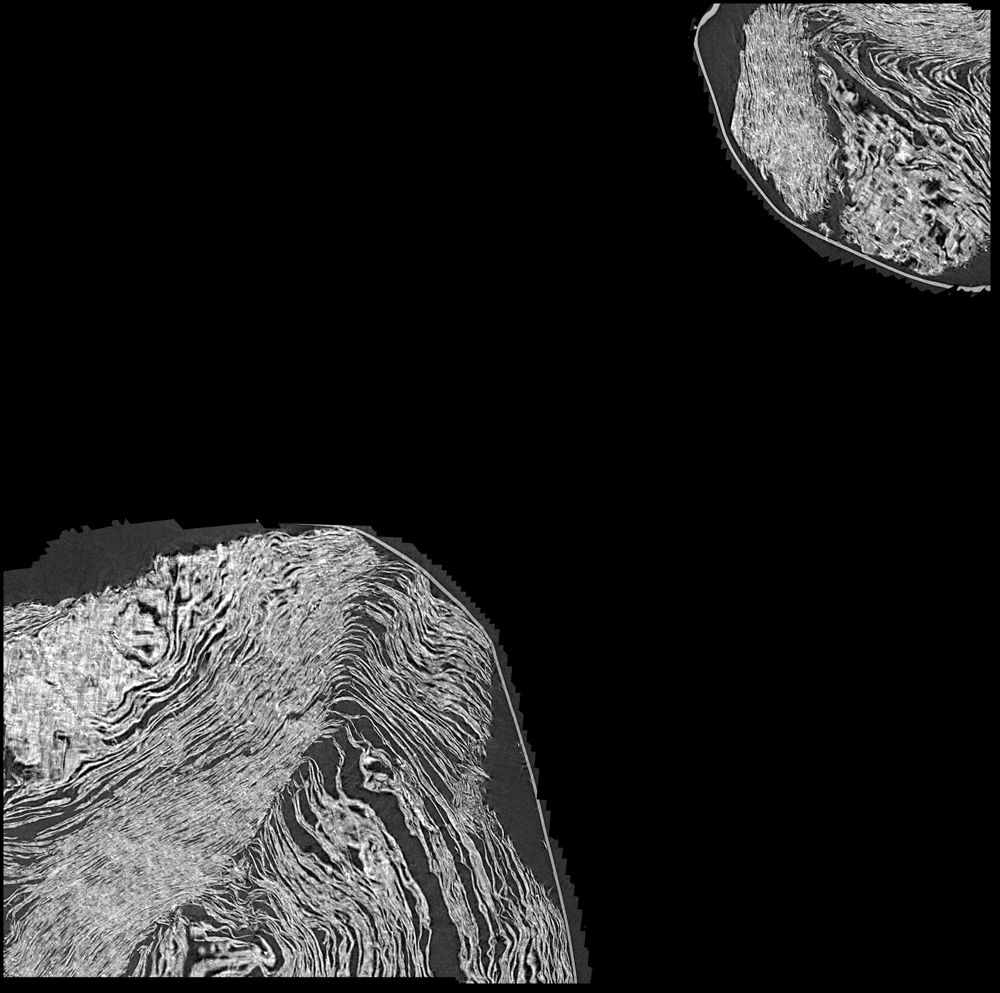
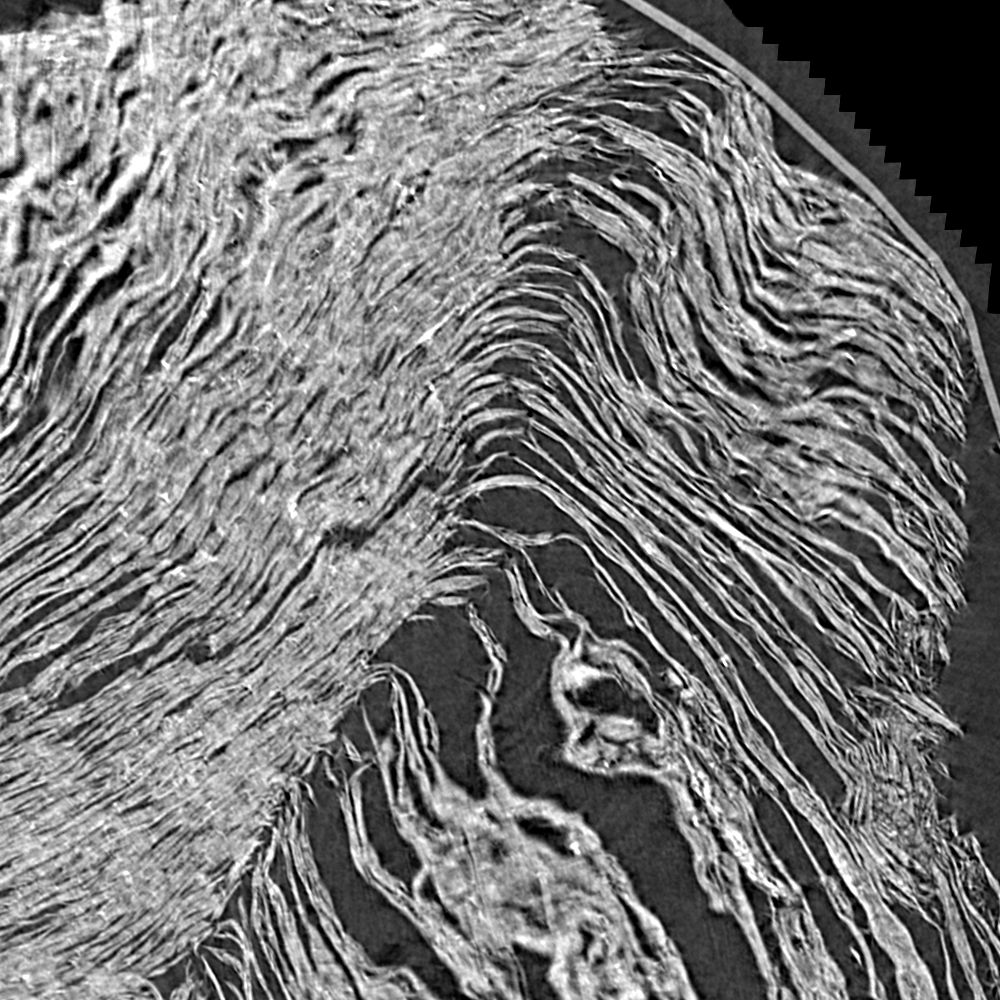

# Première trace sur un rouleau du Grand Prize — et trois instruments qui la condamnent

2026-08-19. VC3D construit, la chaîne officielle pilotée en ligne de commande, et
`PHerc0358` — un des **dix** rouleaux du prix sans aucun segment publié — tracé pour la
première fois.

---

## 1. La chaîne, de bout en bout, en une heure

| étape | outil | résultat |
|---|---|---|
| graine | `analysis/src/trouver_graine.py` *(à nous)* | 8 candidates, à distance, sans rien télécharger |
| trace | `vc_grow_seg_from_seed` | **8,48 cm²**, 79 générations, **13,9 s** de calcul |
| contrôle | `vc_tifxyz_selfcross` | **240 auto-intersections**, 0,05 s |
| aplatissement | `vc_flatten` | grille 159×158, 96,2 % des points rastérisés |
| rendu | `vc_render_tifxyz` | 21 couches, 3141×3121, **29,4 × 29,2 mm** |

⭐ `-v` accepte `https://` pour le traçage : **le volume de 893 Go n'est jamais
téléchargé**, il streame par chunks.

⚠ **Trois pièges silencieux traversés**, chacun ressemblant à un succès :
1. **`voxelsize` vaut 0 par défaut** → l'aire en cm² est nulle *par construction* et
   toute surface est rejetée avec « area 0 below min_area_cm », quelle que soit sa taille ;
2. **`--segment-name` fait écrire DANS `-t`**, donc il tente de remplacer le répertoire
   courant par lui-même ;
3. ⚠⚠ **`[tif] all slices exist, skipping`** — l'outil a sauté par-dessus 21 fichiers
   **tronqués** laissés par un run tué, et ça ressemble parfaitement à un rendu réussi.
   Un outil qui saute ses sorties existantes saute aussi ses sorties corrompues.

## 2. ⭐⭐ Le verdict : la trace coupe à travers les spires

**Trois mesures indépendantes disent la même chose**, et deux d'entre elles l'ont dit
**avant** que quiconque regarde l'image.

### `vc_tifxyz_selfcross` — 0,05 s, avant le rendu

**240 contacts transverses** sur 48 040 triangles. Localisés (~0,35 % de la surface, les
deux bouts de la paramétrisation qui se touchent), mais avec une **pénétration maximale de
21,5 voxels = 200 µm** — soit **plus d'un écart inter-feuilles** (187 µm mesuré sur ce
rouleau). Ce n'est pas un frôlement, c'est une traversée.

### Notre instrument de profondeur (`12`) — sur notre propre rendu

| grandeur | valeur |
|---|---:|
| fenêtres dont le pic est **au bord** de la pile | **64 %** |
| fenêtres dont le pic est dans le **tiers central** | 16 % |
| écart médian pic ↔ couche tracée | **94 µm** |

⚠⚠ **Et la distribution est BIMODALE** : 15 fenêtres piquent à la couche **0**, 9 à la
couche **20**, une seule au milieu. C'est la signature exacte d'une surface posée **entre**
deux feuilles — la matière apparaît aux deux bouts de la fenêtre de profondeur et nulle
part au centre.

> Pour comparaison, les **61 %** au bord de `12` §9 étaient le cas d'échec qui expliquait
> pourquoi la détection d'encre ne rendait rien sur Scroll 4. Ici c'est **64 %**.

⚠⚠ **Correction du 2026-08-19 (`25` §5) : cette jambe-là ne tient pas.** Deux mesures faites
après coup l'ont retirée du verdict :
1. la fenêtre de 21 couches vaut **±94 µm**, soit une **demi**-distance inter-feuilles —
   elle est presque entièrement *dans* la feuille, et **61 % des profils y sont plats**
   (amplitude médiane 1,5 %). L'argmax d'un profil plat est du bruit, et le bruit sort aux
   deux bords : la « bimodalité » ci-dessus en est en partie l'artefact ;
2. sur une fenêtre assez large (61 couches) et à échelle spatiale comparable, la trace
   **officielle** d'un rouleau du prix — même outil, équipe du concours — rend **2 %** au
   tiers central contre 16 % ici. Un critère que la référence échoue plus mal que le cas
   jugé ne peut pas servir à juger.

**Le verdict de ce document tient**, mais sur **deux** instruments et non trois : les
240 auto-intersections mesurées avant tout rendu, et l'image. C'est assez — et c'est
précisément pourquoi il en fallait plusieurs.

### L'image

**Le rendu complet** — 29,4 × 29,2 mm de papyrus, réduit pour tenir sur une page :



Deux plaques séparées par du vide : l'aplatissement a dû écarteler une surface qui se
recoupe. ⚠ Une trace saine rend une bande continue.

**Le détail à pleine résolution** — 1000 × 1000 px, soit **9,4 × 9,4 mm**, l'échelle à
laquelle une ligne de texte grec se voit :



> ⚠⚠ **Ce ne sont pas les fibres d'UNE feuille.** Les striations claires bifurquent,
> s'enroulent et se superposent : ce sont **plusieurs feuilles vues par la tranche**. Une
> trace saine montrerait des fibres **parallèles** traversant la page — c'est d'ailleurs
> le critère visuel que le règlement nomme : *« check if you can visually follow horizontal
> papyrus fibers across the page »*.

⚠ **Et l'œil arrive en dernier.** Les deux mesures ci-dessus avaient déjà rendu le même
verdict, dont une **avant le rendu**. L'image confirme ; elle ne décide pas.

## 3. ⭐ Ce que cet échec vaut

**Les instruments construits sur des segments publiés ont correctement condamné une trace
faite une heure plus tôt, avant tout rendu, et leur diagnostic est confirmé par l'image.**

C'est la validation qui manquait : jusqu'ici les instruments jugeaient le travail des
autres, sans qu'on sache si leur verdict aurait changé une décision. Là, il l'aurait
changée — et il aurait épargné le rendu.

⚠ Ce n'est **pas** une validation de la règle de `19`, qui reste bornée à Scroll 1
(`19` §12). Ce sont les instruments de **trace** — auto-intersection et profondeur — qui
sont validés ici, et ils l'étaient déjà contre `windcheck`.

## 4. La cause, et ce qu'elle désigne

Le traceur optimise une surface **dans** une prédiction seuillée. Il n'a reçu **aucune
information d'orientation** : le paramètre `direction_fields` était absent. Il a donc
trouvé *une* surface qui satisfait la prédiction — et celle qui coupe les spires en
satisfait autant que celle qui en suit une.

⚠ Les `normal-grids` publiées à côté de la prédiction (`xy/`, `xz/`, `yz/`, 182 Mo) ne sont
**pas** dans le format que `direction_fields` attend (`<zarr>/x|y|z/<niveau>`), et ce
paramètre veut un **chemin local**, pas une URL. La jonction reste à faire.

| piste | ce qu'elle demande |
|---|---|
| donner des `direction_fields` au traceur | convertir ou régénérer les grilles au bon format |
| choisir une graine **sur** une feuille et non à une jonction | notre chercheur de graine classe par valeur de voisinage, pas par orientation — il faut y ajouter la planéité locale |
| réduire `step_size` | moins de liberté à chaque pas, donc moins de chances de sauter |

## 5. Reproduire

```bash
cd inference_xpu
uv run python ../analysis/src/trouver_graine.py \
  "PHerc0358/representations/predictions/surfaces/20250821151737-surface-20260413222639-surface-m7-L0-th0.2.zarr" \
  --level 2 --chunks 25

cd ../data/trace/PHerc0358
S="https://vesuvius-challenge-open-data.s3.amazonaws.com/PHerc0358/representations/predictions/surfaces/20250821151737-surface-20260413222639-surface-m7-L0-th0.2.zarr"
vc_grow_seg_from_seed -v "$S" -t . -p seed.json -s 1544 1544 7768
vc_tifxyz_selfcross --surface auto_grown_* -o selfcross_a.json
vc_flatten -i auto_grown_* -o flat_a
V="https://vesuvius-challenge-open-data.s3.amazonaws.com/PHerc0358/volumes/20250821151737-9.362um-1.2m-113keV-masked.zarr"
vc_render_tifxyz -v cache_vol --remote-url "$V" --scale 1 -g 0 -s flat_a \
    --tif-output render_a -n 21 --slice-step 1 --auto-crop

cd ../../../inference_xpu
uv run python ../analysis/src/regarder_rendu.py ../data/trace/PHerc0358/render_a --png-dir ...
uv run python ../analysis/src/depth_profile.py ../data/trace/PHerc0358/render_a \
    --grid --step 400 --traced-layer 10 --voxel-um 9.362
```

⚠ `seed.json` **doit** porter `"voxelsize": 9.362`, sinon tout est rejeté à 0 cm².
