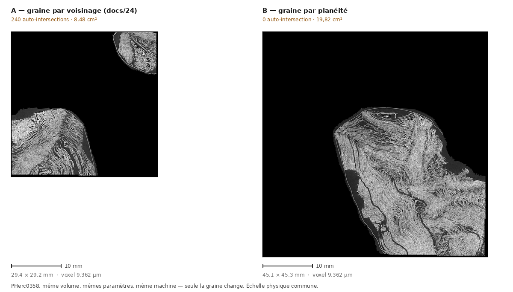
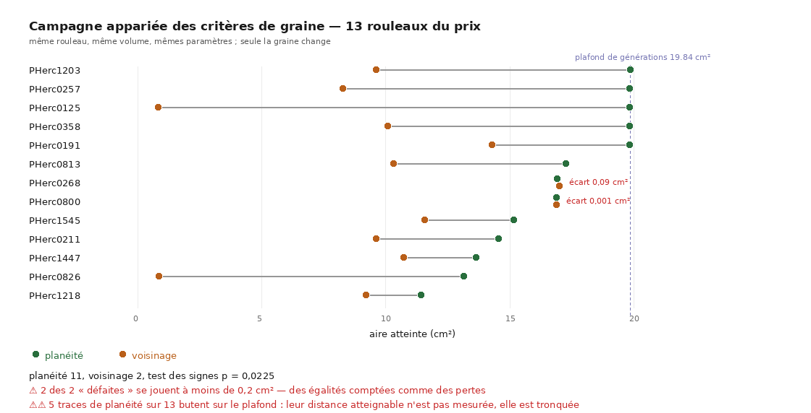
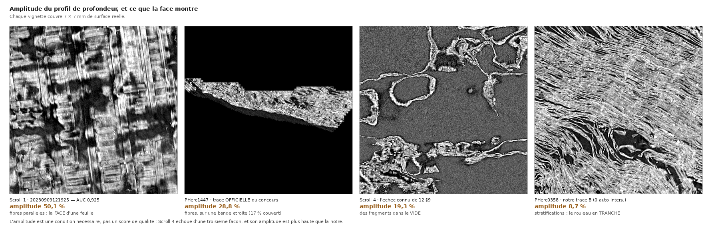

# Une graine choisie sur la planéité — et deux défauts qu'on croyait n'en faire qu'un

2026-08-19, suite de [`24`](24_premiere_trace_rouleau_du_prix.md). Le traceur suivait
n'importe quoi ; on lui donne enfin une raison de partir au bon endroit.

**Résultat en une ligne, et la réplication l'a corrigé deux fois avant que je l'écrive** :
sur `PHerc0358`, changer la seule graine fait passer **240 auto-intersections à 0** sur une
surface 2,3 fois plus grande — mais sur **douze** rouleaux du prix, les deux critères
rendent **0 partout**, donc ce 240 est l'accident d'**un** rouleau. Ce qui réplique est
ailleurs : le traceur **va plus loin avant de caler**, 10 fois sur 12 (test des signes,
p = 0,039). Et une **troisième** mesure a désigné le vrai coupable de `24` : sa graine
était dans un bloc **entièrement plein**, donc sans aucune géométrie à suivre.

---

## 1. Le critère précédent ne classait rien, et personne ne l'avait remarqué

`docs/24` a choisi sa graine par la **moyenne d'un cube de voisinage**, en écartant
explicitement l'`argmax` — *« un pic isolé est du bruit »*. Le raisonnement était bon. Le
résultat, non :

```
   score  -s x y z (niveau 0)
   255.0  1544 1544 7768
   255.0  4108 1544 7688
   255.0  1544 3848 7688
   255.0  3868 4408 7728
   ... huit candidats, huit fois 255
```

⚠⚠ **255 est le plafond du format.** La prédiction est **seuillée** (`th0.2`), donc
binaire : tout bloc entièrement dans la matière prédite atteint la borne. Huit candidats à
égalité ne sont pas un classement, c'est **un tirage au sort déguisé en mesure** — et
c'est le piège nº 2 du dépôt (*une valeur identique partout = saturation contre sa propre
borne*), payé sans que rien ne le signale.

Le chercheur de graine **le dit maintenant** : quand tous les candidats retenus partagent
le même score, il l'écrit en clair au lieu de rendre un classement muet.

## 2. La planéité, et pourquoi elle ne peut pas saturer

On cherche un endroit où la prédiction forme **un plan**, pas un endroit où il y en a
beaucoup. Le tenseur de structure 3D le donne en forme close :

    J = ⟨∇f ∇fᵀ⟩       λ₁ ≥ λ₂ ≥ λ₃       planéité = (λ₁ − λ₂) / λ₁

Le raisonnement est **physique**, pas statistique :

| situation | ce que fait le tenseur | planéité |
|---|---|---:|
| **une** feuille traverse le bloc | tous les gradients le long de sa normale | **1,00** |
| **deux feuilles parallèles** | les normales sont encore alignées | **1,00** |
| une **jonction** à 90° | deux directions peuplées, λ₂ monte | **0,00** |
| du bruit isotrope | trois directions équivalentes | 0,04 |
| un bloc uniforme (vide ou plein) | tenseur **nul** — écarté, pas classé | — |

⭐ **La deuxième ligne est celle qui compte.** Un empilement régulier de feuilles
parallèles est exactement l'endroit où l'on veut poser une graine, et un critère qui le
pénaliserait chercherait « peu de matière » au lieu de « matière bien rangée ». Ce qui
fait tomber le score, c'est **la jonction** — précisément l'endroit où le traceur peut
passer d'une spire à l'autre sans que rien dans la prédiction ne l'en empêche.

⚠ **Le biais d'orientation est mesuré, pas supposé.** Une prédiction seuillée est binaire,
donc un plan incliné y est un **escalier**, et les marches peuplent une seconde direction.
Sur un plan synthétique tourné de 0° à 90°, la planéité brute descend de 1,000 à **0,828**
(écart 0,172). Un lissage 3³ avant les gradients ramène l'écart à **0,053** — et le biais
résiduel reste très loin sous le signal, puisqu'une jonction rend 0,000.

## 3. ⚠⚠ Le même piège, un étage plus haut, repayé une passe plus tard

La première version prenait l'`argmax` de la planéité sur les blocs d'un chunk. Résultat :
**quatre candidats à 1,0000 exactement**.

> Un chunk de 192³ contient **13 824 blocs** de côté 8. Le maximum d'un score borné par 1
> sur autant de tirages vaut ~1 **quel que soit le terrain**. *Le maximum d'un échantillon
> nombreux ne décrit pas l'échantillon.*

C'est mot pour mot le défaut que le paragraphe précédent venait de corriger, à un étage de
plus — et je l'ai écrit **dans le fichier qui documentait déjà le piège**. Le classement
retenu est donc :

1. la planéité **moyennée sur le voisinage 3³ de blocs**, limitée aux blocs qui passent la
   barrière d'occupation ;
2. les ex æquo tranchés par le **nombre de voisins valides** — une graine au milieu d'un
   empilement propre et étendu vaut mieux qu'une graine sur le bord d'un éclat isolé,
   planaire par accident ;
3. chaque chunk rapporte en plus sa **part planaire**, une propriété de la *région* qu'un
   maximum ne peut pas fabriquer.

Après quoi le classement discrimine enfin — la part planaire va de **0,121 à 0,967** — et
les niveaux 0 et 1, calculés indépendamment, **désignent le même endroit** (à un tiers de
chunk près). Le critère saturé, lui, ne s'accordait avec rien.

⚠ **La graine rendue est un voxel ALLUMÉ**, pas le centre du bloc : le centre géométrique
d'un bloc traversé en biais tombe dans le vide, et le traceur part alors de rien. L'ancien
code rendait le centre ; il a marché **par chance**, sur un bloc saturé donc plein.

## 4. ⭐⭐ Le résultat sur `PHerc0358` : 240 → 0

Un seul paramètre changé — la graine. Mêmes `seed.json`, même prédiction, même machine.

| | A — voisinage (`24`) | **B — planéité** | officiel `PHerc1447` |
|---|---:|---:|---:|
| graine (x y z) | 1544 1544 7768 | **5842 5839 7386** | 5340 3584 22669 |
| aire | 8,48 cm² | **19,82 cm²** | 2,89 cm² |
| triangles | 48 040 | 112 338 | — |
| paires testées | 387 151 | **852 135** | 388 083 |
| **auto-intersections transverses** | **240** | **0** | **0** |
| pénétration maximale | 21,5 vx = 201 µm | **0** | 0 |

⭐ **La colonne de droite est le contrôle qui rend le résultat lisible.** C'est un segment
**officiel** d'un rouleau du prix (`PHerc1447`), et son `meta.json` dit
`source: "vc_grow_seg_from_seed"`, `mode: "explicit_seed"`, `min_area_cm: 0.3` — **la même
chaîne que la nôtre**, pilotée par l'équipe du concours. Il rend 0 auto-intersection.
Notre graine planaire aussi ; celle de `24`, non.

⚠ **L'aire n'est pas un critère**, et elle ne mesure même pas ce qu'on croit — **troisième
saturation de la journée**, après le score de voisinage contre 255 et l'argmax contre 1,0.
Les deux premières traces planaires s'arrêtent à la **génération 119 sur 120** et rendent
**19,821 592** et **19,823 246 cm²** : deux rouleaux différents, deux graines différentes,
la même aire à **huit millièmes de pour-cent près**. C'est un **plafond** — une surface
croît par un front, donc son aire est fixée par le nombre de pas quand rien ne l'arrête.
Poussée à 600 générations, la même graine atteint **127,9 cm²**.

> La grandeur qui a un sens n'est donc pas l'aire mais **« le traceur a-t-il consommé son
> budget ou s'est-il arrêté avant »**. Les traces par voisinage **calent** : génération 79
> sur `PHerc0358`, génération 26 sur `PHerc0125`.

### ⭐⭐ Et ce n'est pas le critère qui a écarté la mauvaise graine

En cherchant pourquoi la campagne ne reproduisait pas le 240, la mesure a désigné autre
chose. Le critère par voisinage, **rejoué sans la barrière d'occupation**, rend
**exactement la graine de `24`** :

```
planar.3³  vois   part voisinage  occup.  val  -s x y z
   1.0000     8  0.483     255.0   1.000  255  1544 1544 7768
⚠⚠ les 3 candidats ont le MEME score « voisinage » (255.0) : ce critere ne classe rien ici
```

⭐ **`occup. = 1,000`.** Le bloc est **entièrement plein** de matière prédite. Un bloc
uniforme a un **tenseur nul** : il n'y a là ni feuille, ni normale, ni orientation — la
prédiction y a fusionné plusieurs spires en un pâté solide, et le traceur est parti d'un
endroit où il n'existait aucune géométrie à suivre. C'est la forme extrême du cas
« jonction », et c'est le **plafond d'occupation** qui l'écarte, pas le choix du critère.

⚠⚠ **Correction du 2026-08-19 au soir : cette explication ne survit pas à la répétition.**
[`30`](30_le_traceur_est_un_tirage.md) rejoue **quatorze fois** la graine de `24`, à
paramètres identiques. Elle est toujours dans le même bloc plein, son tenseur y est
toujours nul — et elle rend une trace propre **treize fois sur quatorze**. Le plafond
d'occupation écarte peut-être une graine *risquée* ; il n'explique **pas** les 240, qui
étaient un tirage dans la queue.

> ⭐ **Ce qui reste de ce document, et qui est répliqué** : le critère de planéité fait
> aller le traceur **plus loin**, 11 fois sur 13, sur treize rouleaux appariés
> (p = 0,0225). C'est le gain mesuré. Ce qui tombe est l'attribution du « 240 → 0 » — que
> ce document avait **déjà** commencé à retirer en constatant qu'il ne répliquait pas.


| correctif | ce qu'il apporte, mesuré |
|---|---|
| **plafond d'occupation** (un bloc ne doit pas être plein) | ⚠ écarte la graine de `24` — mais **n'explique pas** ses 240 croisements, cf ci-dessous |
| **critère de planéité** | le traceur va plus loin, **10 fois sur 12** (§4bis) |
| **voxel allumé** au lieu du centre du bloc | sans effet ici — le bloc étant plein, son centre était allumé |

### Les deux traces, à la même échelle



Figure : `src/figures/figure_deux_traces.py`.

⚠⚠ **La figure est à échelle physique commune** — sans quoi une surface deux fois plus
grande passerait pour identique. À gauche, les deux plaques écartelées de `24` : c'est ce
que devient une surface qui se recoupe quand on l'aplatit. À droite, une nappe d'un seul
tenant.

⚠ **Mais regardez les striations à droite.** Elles s'enroulent et se superposent, comme à
gauche. Le §5 dit pourquoi, et il le dit avec un nombre.

## 4bis. ⭐ La réplication sur treize rouleaux du prix

Conception **appariée** : chaque rouleau est tracé deux fois, une graine par critère, tout
le reste identique. Un rouleau est donc son propre témoin, et la différence ne peut pas
être mise sur le dos de « celui-là est plus facile ». Dix rouleaux **sans aucun segment
publié** (`23`), plus les ⚠ **trois** qui en ont — les seuls où une trace officielle
existe pour comparer.

⚠ Corrigé le 2026-08-19 : ce paragraphe disait « les **deux** qui en ont ». L'inventaire
versionné `docs/mesures/etat_rouleaux_prix.txt` en recense **trois** : PHerc1447 (16 segments),
PHerc0800 (6), PHerc1203 (1). La campagne, elle, n'en couvrait alors que douze — le compte
du corpus était juste, c'est sa description qui ne l'était pas.

⭐ **Corrigé pour de bon le 2026-08-22** : `PHerc1203` y est. Son absence n'était pas une
décision, c'était un trou — `src/campagnes/campagne_graines.sh` ne le listait pas alors que
`src/outils/carte_separabilite.sh` le liste, et [`35`](35_le_tirage_sur_douze_rouleaux.md) §5 l'a
trouvé en constatant que la campagne des tirages ne couvrait que douze rouleaux sur treize.
⚠ Le combler a demandé de réparer autre chose d'abord, et c'est le sujet du bloc ci-dessous.

| rouleau | planéité | voisinage | | rouleau | planéité | voisinage |
|---|---:|---:|---|---|---:|---:|
| PHerc0125 | **19,82** | 0,85 | | PHerc0800 | 16,88 | 16,89 |
| PHerc0191 | **19,82** | 14,27 | | PHerc0813 | **17,26** | 10,32 |
| PHerc0211 | **14,54** | 9,60 | | PHerc0826 | **13,14** | 0,85 |
| PHerc0257 | **19,82** | 8,26 | | PHerc1218 | **11,43** | 9,19 |
| PHerc0268 | 16,90 | 16,99 | | PHerc1447 | **13,64** | 10,72 |
| PHerc0358 | **19,82** | 10,08 | | PHerc1545 | **15,15** | 11,57 |
| PHerc1203 | **19,84** | 9,60 | | | | |

**Sur 13 rouleaux du prix — aire : planéité 11, voisinage 2, aucun ex æquo, test des
signes p = 0,0225.**



⚠⚠ **La figure porte deux réserves que les trois nombres ne portent pas.** D'abord,
**7 traces de planéité sur 13 butent sur le plafond de générations** : sur celles-là, « la
planéité va plus loin » veut dire « la planéité va **jusqu'au budget** », et la distance
réellement atteignable n'est pas mesurée, elle est tronquée. Ensuite les deux « défaites » se
jouent à **0,09 et 0,001 cm²** — des égalités que le test des signes compte comme des pertes,
donc l'erreur va dans le sens conservateur.

⭐⭐ **Et les deux ne sont pas indépendantes : ce sont les mêmes rouleaux.** `PHerc0268` et
`PHerc0800` sont les deux seuls où **les deux critères** butent sur le budget — leurs quatre
traces s'arrêtent toutes à 118 générations. Leur écart d'aire ne compare donc pas deux
critères, il compare **deux troncatures au même endroit**, et 0,001 cm² est exactement ce
qu'on attend de deux traces coupées ensemble. Sur les **11 paires informatives** — celles où
au moins un des deux critères s'arrête de lui-même — c'est **11 à 0**, test des signes
**p = 0,0010**.

> ⚠ **Le chiffre publié reste celui des treize paires, p = 0,0225.** C'est le conservateur.
> Ne publier que le plus favorable, une fois qu'on a vu lequel l'est, serait choisir son
> échantillon après coup — et les deux paires écartées le sont pour une raison écrite avant
> d'en regarder le résultat, pas parce qu'elles gênaient.

⚠⚠ **Le compte de traces tronquées était faux, et la cause vaut d'être notée.** La première
version cherchait le plafond dans les **aires** — « les traces qui s'arrêtent au-dessus de
19,8 cm² » — ce qui ne le trouve que pour une résolution : à 9,362 µm le budget est atteint
vers 19,82 cm², à 8,64 µm vers 16,9. Les rouleaux de la seconde famille étaient donc comptés
comme non plafonnés alors qu'ils le sont, et le compte disait **5 sur 13** au lieu de **7**.
Les deux manquants sont précisément ceux qui expliquent les deux égalités. ⭐ Le plafond se lit
maintenant dans les **générations**, relevées dans le log de chaque trace — le record de ce
qui s'est passé, là où le JSON n'en est qu'un résumé.

⭐ Le treizième rouleau **renforce** le résultat plutôt que de l'user : 10/12 à p = 0,0386
devient **11/13 à p = 0,0225**. Ce n'est pas une surprise heureuse, c'est ce qu'un
échantillon de plus fait quand l'effet est réel — et c'est exactement pourquoi le trou
méritait d'être comblé plutôt que noté.

⚠⚠ **Auto-intersections : 0 partout, des deux côtés.** Le « 240 → 0 » de `PHerc0358` **ne
réplique pas** comme propriété générale du critère : sur douze autres rouleaux, la graine par
voisinage — passée par la même barrière d'occupation — n'en produit aucune. Ce qui réplique,
c'est la distance parcourue avant de caler, et les deux cas extrêmes le disent mieux qu'une
moyenne : sur `PHerc0125` et `PHerc0826`, le voisinage cale à **0,85 cm²**, à peine
au-dessus du `min_area_cm` de 0,3, quand la planéité atteint 19,82 et 13,14.

⚠ **Ce que la colonne « voisinage » n'est pas** : un rejeu à l'identique de `24`. C'est le
**critère** de `24` sous la machinerie actuelle — barrière d'occupation et voxel allumé
compris. Le rejeu à l'identique est ci-dessus, et il rend bien 1544 1544 7768.

### ⚠⚠ Le trou en cachait un autre : surface et volume étaient appariés PAR POSITION

`campagne_graines.sh` choisissait quoi tracer avec `lister .../surfaces/ | head -1` et
`lister .../volumes/ | head -1`. Tant qu'un rouleau n'a qu'un scan, les deux listes ont un
élément et le résultat est juste. **`PHerc1203` en a deux** — 9,362 µm et 2,403 µm — et la
première surface n'est le même scan que le premier volume **que si les deux listages se
trient pareil**. Rien ne le garantit.

⚠⚠ **Et la panne aurait été muette, du genre le plus coûteux.** Le script lit la taille de
voxel dans le nom du volume : il aurait tracé la surface d'un scan avec la résolution d'un
autre. `vc_grow_seg_from_seed` n'a aucun moyen de s'en apercevoir — il rend une surface dont
l'aire, les coordonnées et la géométrie sont fausses d'un **facteur constant**, sans un seul
message. C'est le piège que l'en-tête du script nomme déjà (« emprunter le chiffre d'un
rouleau voisin ») appliqué à deux scans d'un **même** rouleau.

⭐ Le remède est dans les noms : une prédiction s'appelle `<scan>-surface-….zarr` et son
volume `<scan>-<voxel>um-….zarr`. [`src/volume/apparier_volumes.py`](../src/volume/apparier_volumes.py)
apparie sur ce préfixe, et le script de campagne l'appelle.

⚠ **Mesuré avant de conclure, et le résultat est plus sobre que la crainte** : sur les
quatorze rouleaux du prix, **0 est mal apparié aujourd'hui** et **2 ont plusieurs scans**
(`PHerc0139`, `PHerc1203`). Le défaut était donc **latent**, pas actif — aucun chiffre publié
n'en dépend. Il est corrigé parce qu'un piège armé finit par se déclencher, pas parce qu'il
avait déjà mordu.

⭐⭐ **Et un rouleau à plusieurs scans pose une question que l'ordre d'un listage ne peut pas
trancher.** Les douze autres sont tous à 8,64 ou 9,362 µm ; la campagne est une comparaison
**appariée**, donc `PHerc1203` doit être tracé dans la résolution de la cohorte — sinon le
treizième n'est comparable à rien, et rien ne le dirait. Le choix est donc **déclaré**
(`VOXEL_COHORTE`) et l'outil **refuse** plutôt que de deviner : sans résolution demandée sur
un rouleau à deux scans, il sort en erreur en nommant ce qui existe.

## 4ter. ⚠⚠ Le traceur n'est pas reproductible — mais son verdict l'est

Quatre exécutions de **la même graine**, mêmes paramètres, même machine :

| | aire | auto-intersections |
|---|---:|---:|
| `thread_limit: 0`, essai 1 | 19,834872 cm² | **0** |
| `thread_limit: 0`, essai 2 | 19,821850 cm² | **0** |
| `thread_limit: 1`, essai 1 | 19,838660 cm² | **0** |
| `thread_limit: 1`, essai 2 | 19,823302 cm² | **0** |

⚠ Passer à `thread_limit: 1` — la valeur que VC3D utilise, et que le message de démarrage
de l'outil recommande — **ne suffit pas**. L'écart subsiste, d'environ 0,08 %.

⚠⚠ **Mais l'affirmation « le traceur n'est pas reproductible » est trop grossière, et la
mesure suivante l'a corrigée.** En comparant les *journaux de croissance* et non les seules
aires finales : **les 118 générations sont identiques au centième dans les six exécutions**,
y compris celle qui reçoit un champ de direction. Toutes finissent la croissance à
**1985,73 mm²**.

| | croissance (118 générations) | surface sauvée |
|---|---|---:|
| `thread_limit: 0`, essais 1 et 2 | **identique** | 19,834872 / 19,821850 cm² |
| `thread_limit: 1`, essais 1 et 2 | **identique** | 19,838660 / 19,823302 cm² |
| `thread_limit: 1` + champ de direction | **identique** | 20,747079 cm² |

> **La croissance est déterministe ; l'étape finale ne l'est pas.** Ce n'est pas la même
> chose que « le traceur n'est pas reproductible », et la différence a des conséquences :
> ce qui varie d'une exécution à l'autre est une **optimisation post-croissance**, pas le
> chemin suivi. C'est aussi le seul endroit où un `direction_fields` agit — voir §8.

> **La surface n'est pas reproductible ; le verdict l'est.** Les quatre surfaces sans champ
> diffèrent, les quatre passent le même contrôle : un argument de plus pour juger une trace
> par un **invariant** plutôt que par l'artefact.

## 5. ⚠⚠ Ce que la graine ne règle PAS — et c'est la moitié du résultat

L'instrument de profondeur de [`12`](12_profondeur_de_surface.md) devait confirmer.
Il a refusé, et il a eu raison de refuser.

**Première mesure, fausse par construction.** Sur la pile de 21 couches de `24`, la trace B
rendait **62 % de pics au bord** — c'est-à-dire le verdict de la mauvaise trace. Sauf que
21 couches à 9,362 µm valent **±94 µm**, soit **une demi-distance inter-feuilles** (187 µm
mesuré sur ce rouleau) : la fenêtre est presque entièrement *dans* la feuille. Amplitude
médiane du profil : **1,5 %**, et **61 % des profils sont plats**.

> ⚠⚠ **Un profil plat a quand même un maximum, parfaitement défini, et sa position est du
> bruit** — qui sort aux deux extrémités et imite une bimodalité. C'est le piège nº 20 du
> dépôt (*afficher la courbe avant de croire son argmax*), et il est désormais **dans
> l'outil** : `depth_profile.py` rapporte l'amplitude, la part de profils plats, et refuse
> de laisser lire « au bord » sans le dire quand plus de la moitié sont plats.

**Deuxième correction : une fenêtre spatiale est aussi une échelle.** Moyenner sur 9,6 mm
mélange des endroits où la feuille n'est pas à la même profondeur — c'est précisément le
**champ de correction** de [`20`](20_le_champ_de_correction.md). Mesuré, en rétrécissant la
fenêtre sur la même pile :

| fenêtre | amplitude médiane | profils plats |
|---|---:|---:|
| 9,6 mm | 3,5 % | 22 % |
| 4,8 mm | 3,4 % | 15 % |
| 2,4 mm | 5,4 % | 7 % |
| **1,2 mm** | **8,7 %** | **1 %** |

**La comparaison honnête, à taille physique égale (1,2 mm) et sur ±281 µm :**

| trace | amplitude | pic dans le tiers central | pic au bord |
|---|---:|---:|---:|
| `20230909121925` — Scroll 1, **AUC 0,925** | **50,1 %** | **77 %** | **5 %** |
| `scroll4_20231111135340` — l'échec connu de `12` §9 | 19,3 % | 13 % | 29 % |
| notre **A** (voisinage) | 14,8 % | 16 % | 27 % |
| notre **B** (planéité) | 8,7 % | 20 % | 28 % |
| ⭐ **officiel `PHerc1447`** — rouleau du prix | 28,8 % | **2 %** | 38 % |

⚠⚠ **Et c'est la dernière ligne qui décide — dans l'autre sens que prévu.** La trace
**officielle** d'un rouleau du prix, faite avec le même outil par l'équipe du concours,
échoue au critère du **tiers central** plus mal que les nôtres : 2 %, contre 16 et 20 %.
Un critère que la référence rate plus mal que le cas jugé ne peut pas servir à juger.

⚠⚠ **Corrigé le 2026-08-20 — le raisonnement tient, la PRÉMISSE non.** [`36`](36_lorigine_de_la_pile.md) a d'abord soupçonné une origine de mesure décalée, puis **réfuté** ce soupçon sur le même segment mesuré des deux façons (14,3 µm d'écart). Ce qui reste est autre chose, et plus simple : **un segment officiel n'est pas une référence.** Sur ce même rouleau, les quatre segments qui publient un volume de surface rendent **18,2 %, 25,0 %, 62,5 % et 68,2 %** de pics dans le tiers central — un facteur 3,7 — et le dernier s'appelle `z_dbg_gen_00320`, un artefact de débogage à 4 fenêtres exploitables sur 50. Deux d'entre eux battent nos traces de trois à quatre fois, ce qui est exactement ce qu'on attend d'une référence.

⏳ Le critère du tiers central mérite donc d'être **reconsidéré** — pas parce que la mesure était fausse, mais parce que la référence choisie n'en était pas une. ⚠ Reconsidéré, pas rétabli : le remettre demande de choisir une référence sur un motif défendable, et « le meilleur des quatre » n'en est pas un.

⚠ **Cela oblige à corriger `24`.** La trace A y était condamnée par *trois* instruments ;
celui de la profondeur, dans sa forme « tiers central », s'avère muet sur ce rouleau. Le
verdict tient toujours — 240 auto-intersections avant tout rendu, et l'image — mais sur
**deux** jambes et non trois. Corrigé sur place, `24` §2.

### ⭐⭐ Ce qui reste lisible, c'est l'AMPLITUDE — et elle a une signification physique

Le tiers central ne transporte pas. L'amplitude, si, et le raisonnement est géométrique :

> La profondeur d'un rendu se parcourt **le long de la normale à la surface**. Si la surface
> est **parallèle** aux feuilles, sa normale **traverse** l'empilement : le profil oscille
> fortement. Si la surface **coupe** l'empilement, sa normale reste dans une même matière :
> le profil est plat.

L'amplitude est donc la forme **mesurable** du critère que le règlement énonce à l'œil :
*« can you visually follow horizontal papyrus fibers across the page »*. Les deux bouts de
l'échelle sont ancrés sur des images, à surface physique égale :



Figure : `src/figures/figure_signatures.py`.

| trace | amplitude | ce que la face montre |
|---|---:|---|
| Scroll 1, AUC 0,925 | **50,1 %** | des **fibres parallèles rectilignes** — la face d'une feuille |
| officiel `PHerc1447` | 28,8 % | des fibres, sur une bande étroite |
| Scroll 4, l'échec de `12` §9 | 19,3 % | des **fragments dans le vide** |
| **notre B** | **8,7 %** | des **stratifications concentriques** — le rouleau vu en **tranche** |

⚠⚠ **Donc notre surface n'est pas mal posée sur une feuille : elle est posée EN TRAVERS de
l'empilement.** C'est un défaut plus grave que « elle dérive d'une spire à l'autre », et il
explique tout le reste d'un coup — le profil plat, les striations qui s'enroulent, et
l'absence d'encre. Et il est parfaitement compatible avec **zéro auto-intersection** : une
surface peut trancher le rouleau comme un couteau sans jamais se recouper elle-même.

⚠ **L'amplitude est nécessaire, pas suffisante**, et la figure le montre : Scroll 4 échoue
d'une troisième façon — la trace est dans le vide — pour une amplitude *plus haute* que la
nôtre. Une seule grandeur ne classe pas trois modes d'échec.

### Ce que ça désigne

- **Où l'on part** décide si la surface se recoupe, et si elle a une géométrie à suivre.
  C'est réglé : plafond d'occupation plus planéité.
- **Comment on avance** décide si elle reste *parallèle* aux feuilles. Ça ne l'est pas, et
  une graine ne peut pas s'y substituer — elle place le premier pas, pas les 112 337
  suivants.

Le nom de la seconde est écrit dans `24` §4 : le traceur n'a reçu **aucune information
d'orientation** (`direction_fields` absent). ⚠⚠ **Cette seconde piste a depuis été
mesurée NÉGATIVE trois fois** (`26`), avec son contrôle positif : ni le champ, ni les
grilles publiées, ni des grilles dérivées du volume ne déplacent la croissance. Le
paragraphe est gardé parce qu'il dit ce qui a été tenté et pourquoi.
Les `normal-grids` sont publiées à côté de chaque prédiction (⚠ **10,40 Go**, pas
182 Mo — inventaire de `26` §6 ; `xy/ xz/ yz/`) ; le paramètre attend un **chemin local** et la
disposition `<zarr>/{x,y,z}/<niveau>`. C'est une conversion, et c'est la marche suivante.

## 6. Reproduire

```bash
S="PHerc0358/representations/predictions/surfaces/20250821151737-surface-20260413222639-surface-m7-L0-th0.2.zarr"
uv run python src/commun/trouver_graine.py "$S" \
    --level 0 --chunks 25 --bloc 8 --critere planarite --voxel-um 9.362

cd data/trace/PHerc0358/essai_b
B=https://vesuvius-challenge-open-data.s3.amazonaws.com
vc_grow_seg_from_seed -v "$B/$S" -t . -p seed.json -s 5842 5839 7386
vc_tifxyz_selfcross --surface auto_grown_* -o selfcross_b.json   # ⚠ JUGER AVANT DE RENDRE
vc_flatten -i auto_grown_* -o flat_b
V="$B/PHerc0358/volumes/20250821151737-9.362um-1.2m-113keV-masked.zarr"
rm -rf render_b61   # ⚠ un outil qui saute ses sorties existantes saute aussi les tronquees
vc_render_tifxyz -v cache_vol --remote-url "$V" --scale 1 -g 0 -s flat_b \
    --tif-output render_b61 -n 61 --slice-step 1 --auto-crop

cd ../../../inference_xpu
uv run python src/volume/depth_profile.py data/trace/PHerc0358/essai_b/render_b61 \
    --grid --size 128 --step 128 --traced-layer 30 --voxel-um 9.362
```

⚠ **`seed.json` doit porter `"voxelsize"`**, sinon l'aire vaut 0 et toute surface est
rejetée. ⚠ **La fenêtre de rendu doit valoir plus d'un écart inter-feuilles**, sinon la
mesure de profondeur ne peut rien voir — `-n 61` et non `-n 21`.

## 7. Les témoins

22 contrôles hors ligne (`src/outils/temoins.sh`, batterie « graine : planarite »), et **chacun
a été vérifié cassable** : cinq sondes remplacent une garde par sa version fautive et la
batterie doit tomber.

| sonde | ce qu'elle casse | témoins qui tombent |
|---|---|---:|
| `enroulement` | l'agrégation 3³ enroule au lieu de répliquer | 1 |
| `centre_du_bloc` | la graine redevient le centre géométrique | 1 |
| `sans_barriere_trace` | un bloc à tenseur nul est classé | 1 |
| `argmax_sans_voisinage` | on reprend l'argmax brut | 1 |
| `sans_lissage` | le biais d'orientation n'est plus corrigé | 1 |

⚠ **Trois de ces cinq sondes passaient au vert à la première tentative** : mes fixtures ne
pouvaient pas échouer. La feuille du test de graine traversait le centre du bloc, donc
rendre le centre était indistinguable de rendre un voxel allumé ; la barrière sur la trace
était redondante avec la bande d'occupation sur des données binaires ; et le chunk de
contrôle n'avait aucun éclat isolé, donc l'argmax brut trouvait la bonne moitié tout seul.
Refaites, les cinq tombent.

## Reproduire

```bash
./src/outils/lancer.sh --fond src/campagnes/campagne_graines.sh       # la campagne appariée
uv run python src/tables/table_graines.py --help   # le dépouillement
```
