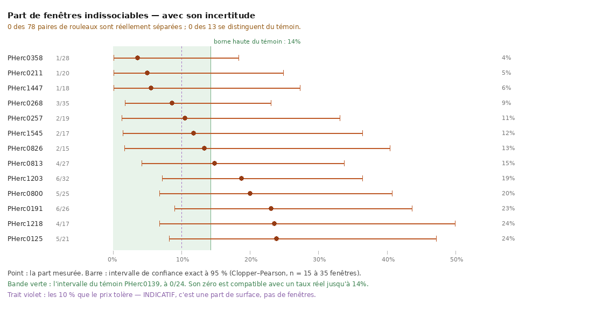

# La carte des treize rouleaux n'est pas résolue par ses propres données

2026-08-20. `16` classe les treize rouleaux du Grand Prize sur la **queue** de leur
séparabilité et en tire une désignation : *« c'est ce qui désigne `PHerc0358` (4 %) comme
le premier à attaquer »*. Ce document mesure **l'incertitude** de ce classement, que `16`
n'affichait pas. Elle l'annule.

Aucune nouvelle donnée n'a été acquise pour ce résultat : c'est une relecture des
artefacts versionnés, `docs/carte_separabilite/*.json`, par
`analysis/src/incertitude_carte.py`.

---

## 0. La forme, d'un coup d'œil



> **Chaque rouleau est un intervalle, pas un point** — et ils se recouvrent tous, y
> compris avec celui du témoin. C'est la raison pour laquelle aucune des 78 paires n'est
> séparée, et elle se voit sans qu'aucun test soit nécessaire.

Figure : `analysis/src/figure_incertitude.py`, depuis `docs/incertitude_carte.json`.

## 1. Ce que la mesure trouve

| question | réponse |
|---|---|
| rouleaux **distinguables du témoin** après correction de Holm | **0 sur 13** |
| ... au seuil nominal, sans correction | 5 sur 13 |
| **paires de rouleaux réellement séparées** | **0 sur 78** |
| intervalle du mieux classé, `PHerc0358` (1/28) | **0,1 % – 18,3 %** |
| intervalle du **témoin**, `PHerc0139` (0/24) | **0,0 % – 14,2 %** |

⚠⚠ **Le zéro du témoin n'est pas un zéro.** Sur 24 fenêtres, une observation de 0 est
compatible avec un taux réel allant jusqu'à **14,2 %** — c'est-à-dire au-dessus de la part
observée de **huit** des treize rouleaux. La phrase de `16` — *« le témoin a une propriété
qu'aucun des treize ne partage : 0 % »* — décrit une observation, pas une propriété.

⚠ **La correction de Holm n'est pas un raffinement optionnel ici.** Treize comparaisons au
seuil de 5 % rendent un « significatif » attendu par pur hasard ; les cinq p nominaux vont
de 0,014 à 0,028, donc exactement dans la zone que treize essais produisent tout seuls.
Ce dépôt a déjà écrit cette réserve ailleurs (`19` : *« ❌ nominal seulement »*), et elle
s'applique ici à l'identique.

## 2. Ce qui SURVIT

Un résultat négatif qui n'énonce pas ce qui reste vrai est aussi trompeur que le résultat
qu'il corrige.

| ce qui tient | ce qui ne tient pas |
|---|---|
| les treize **pris ensemble** : 42/300 = 14,0 % contre 0/24, p = 0,031 | le **classement** des treize entre eux |
| **13 sur 13** ont une queue au-dessus de celle du témoin — la direction est unanime | qu'un rouleau nommé soit meilleur qu'un autre rouleau nommé |
| la **médiane** ne sépare rien : ça, `16` l'établit et ce document ne le touche pas | la désignation de `PHerc0358` comme premier à attaquer |

⚠ **Et le p groupé est une borne basse, pas un p.** Il traite les 300 fenêtres comme
échangeables entre rouleaux, alors qu'elles sont **groupées par rouleau** : des fenêtres
du même rouleau se ressemblent plus qu'entre rouleaux, donc l'effectif effectif est plus
petit que 300 et le vrai p est plus grand que 0,031. À lire comme un ordre de grandeur,
et il est déjà marginal à cette lecture-là.

## 3. ⭐ Ce qui résoudrait la question — et c'est bon marché

La puissance a été calculée **exactement**, par énumération des (n+1)² tables possibles
pondérées par leur probabilité binomiale — pas par l'approximation normale, qui surestime
la puissance à ces effectifs et promettrait donc une campagne moins chère que la vraie.

| fenêtres par rouleau | puissance à séparer 3,6 % de 23,8 % |
|---:|---:|
| 25 | 39 % |
| **50** | **80 %** |
| 100 | 99 % |
| 200 | 100 % |

> ⭐ **50 fenêtres par rouleau suffisent**, contre **15 à 35** aujourd'hui. Ce n'est pas un
> instrument neuf, c'est un échantillonnage plus dense de celui qui existe.

⚠ Ça sépare les **extrêmes**, et rien de plus. Les paires du milieu — `PHerc0257` à 10,5 %
contre `PHerc1545` à 11,8 % — resteront hors de portée à tout effectif raisonnable, et
c'est une propriété du problème, pas de la campagne : ces deux rouleaux ne diffèrent
peut-être pas.

⚠ Et séparer un rouleau du **témoin** est une autre affaire : opposer 0 % à 3,6 % demande
des milliers de fenêtres. Ce qu'on peut établir, c'est le contraste entre les extrêmes des
treize, pas le contraste de chacun au témoin.

## 4. Le rapport à la marge du prix

Le règlement tolère *« less than 10 % »* de patches externes déconnectés sautés. La
tentation est de confronter les 4–24 % à ces 10 %.

⚠⚠ **Ce sont deux grandeurs différentes** : la part mesurée est une fraction de **fenêtres
sondées**, celle du prix une fraction de **surface de recto**. La figure trace la ligne des
10 % en pointillé pour cette raison, et le script l'imprime comme *indicative*.

Ce qu'on peut dire sans confondre : **aucun** des treize n'a un intervalle qui exclut d'être
sous 10 %, et **aucun** n'a un intervalle qui exclut d'être au-dessus. Sur cette donnée,
la question « ce rouleau tient-il dans la marge ? » n'a de réponse pour aucun des treize.

## 4bis. ⭐⭐ La prédiction a été testée — le même jour, et elle tient

La §3 disait qu'il faut **50 fenêtres par rouleau**. La campagne dense a tourné
(`tools/carte_separabilite.sh docs/carte_separabilite_dense 125`, 57 à 115 fenêtres par
rouleau), et **le dépouilleur avait été écrit avant qu'elle rende** —
`analysis/src/comparer_cartes.py`, avec ses seuils d'interprétation posés d'avance : rho
> 0,7 réfute ce document, rho < 0,3 le confirme.

| rouleau | creux | dense | écart |
|---|---:|---:|---:|
| **PHerc0800** | 20,0 % *(10ᵉ sur 13)* | **2,6 %** *(1ᵉʳ)* | **−17,4** |
| PHerc1447 | 5,6 % | 7,0 % | +1,5 |
| PHerc1218 | 23,5 % | 8,8 % | −14,8 |
| PHerc1203 | 18,8 % | 9,1 % | −9,7 |
| PHerc0191 | 23,1 % | 12,6 % | −10,4 |
| **PHerc0358** | **3,6 %** *(1ᵉʳ)* | **12,8 %** *(6ᵉ)* | **+9,2** |
| PHerc0268 | 8,6 % | 13,0 % | +4,5 |
| PHerc0125 | 23,8 % | 13,8 % | −10,0 |
| PHerc0813 | 14,8 % | 15,6 % | +0,8 |
| PHerc1545 | 11,8 % | 15,9 % | +4,1 |
| PHerc0257 | 10,5 % | 16,4 % | +5,9 |
| PHerc0211 | 5,0 % | 18,0 % | +13,0 |
| PHerc0826 | 13,3 % | 22,8 % | +9,5 |

> ⭐⭐ **rho de Spearman = −0,297. 13/13 rouleaux changent de rang.** Le
> classement ne se reproduit pas — il ne se reproduit même pas *un peu*.


Figure : `analysis/src/figure_comparaison.py`, depuis `docs/comparaison_cartes.json`.

**Et l'inversion est complète sur ce qui décidait** : `PHerc0358`, que `16` désignait comme
le premier à attaquer, passe de **1ᵉʳ à 6ᵉ** ; `PHerc0800`, que `16` plaçait 10ᵉ sur 13,
devient **le meilleur du lot avec 2,6 %**.

⚠⚠ **Et le témoin n'est plus à 0 %.** À échantillonnage dense, `PHerc0139` mesure **4 %** —
exactement la valeur que `16` attribuait à `PHerc0358` comme le minimum des treize. La
propriété *« que ne partage aucun des treize »* était une propriété de **24 fenêtres**, pas
du rouleau. La §1 l'annonçait par son intervalle ; la mesure le confirme par un chiffre.

⚠ **Les deux campagnes mesurent bien la même chose** : 12 des 13 estimations denses tombent
dans l'intervalle de la campagne creuse. Le sondage creux n'était donc pas **biaisé**, il
était **bruité** — ce qui est le diagnostic le moins grave des deux, et celui que ce document
avançait. Le seul rouleau hors intervalle est `PHerc0800`, et une sortie sur treize à 95 % est
exactement ce que le hasard produit.

⚠ **Ça ne suffit toujours pas.** À 57–115 fenêtres, **1 paire sur 78** est séparée et **1
rouleau sur 13** se distingue du témoin. La §3 promettait de séparer les **extrêmes**, et
c'est ce qui arrive — pas de trancher le classement, qui demanderait bien davantage et qui
n'a peut-être pas de réponse.

## 5. Ce que ce document change ailleurs

| document | ce qui devient faux | ce qui reste |
|---|---|---|
| `16` §0, §6 | *« c'est la queue qui sépare »* comme énoncé de classement ; la désignation de `PHerc0358` | la médiane ne sépare rien ; les treize pris ensemble diffèrent du témoin |
| `13` H4 | *« `PHerc0358` désigné »* | la carte existe, le témoin est apparié |
| `31` §10, §11.2 | *« ça dit **sur lequel** des treize le prix est jouable »* | *« mesurer la part comprimée rouleau par rouleau »* reste la bonne mesure — il faut juste **50 fenêtres**, pas 27 sondes |

⚠⚠ **Mis à jour le 2026-08-20, après la campagne dense** : `PHerc0358` n'est plus le meilleur
point observé — c'est **`PHerc0800`** (2,6 % contre 12,8 %). Le choix par défaut change donc
de rouleau, et c'est précisément ce qui montre qu'il s'agissait d'un **choix par défaut** :
une conclusion de mesure n'aurait pas changé de sujet en triplant l'échantillonnage. ⚠ Rien
n'oblige à changer de rouleau pour autant — la §4bis mesure qu'à 78 paires une seule est
séparée, donc « 2,6 % » ne bat pas « 12,8 % » de façon établie non plus.

⚠ **`PHerc0358` reste un choix défendable** — il a la part observée la plus basse, et il
faut bien commencer par un rouleau. Ce qui tombe, c'est que **la mesure le désigne**. Un
choix par le meilleur point observé sur des données qui ne séparent rien est un choix par
défaut assumé, pas une conclusion.

## 6. ⚠ Ce que ce document ne dit pas

- **Il ne dit pas que la carte est fausse.** Il dit qu'elle est **sous-échantillonnée**.
  Les parts mesurées sont les meilleures estimations disponibles ; c'est leur **ordre** qui
  n'est pas établi.
- **Il ne remet pas en cause l'instrument** (`separabilite_scan.py`), ni le choix du
  témoin apparié, ni le niveau 1 de la pyramide. Toutes ces décisions de `16` tiennent.
- **Il ne mesure pas la part comprimée en surface.** C'est une mesure différente, et la
  seule qui se compare vraiment à la marge du prix.

## Reproduire

```bash
(cd experiments && uv run python ../analysis/src/incertitude_carte.py --json ../docs/incertitude_carte.json)
uv run python analysis/src/figure_incertitude.py
```

Une campagne dense s'écrit dans **son propre dossier**, pour que les chiffres publiés de
`16` restent reproductibles à côté :

```bash
./tools/carte_separabilite.sh docs/carte_separabilite_dense 125
```
