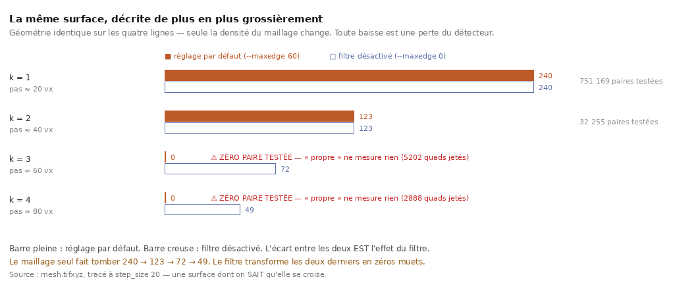

# Quand « propre » veut dire « rien mesuré »

2026-08-20. `29` M2 demandait de relire les 240 auto-intersections de `24` sous un autre
`--maxedge` : *« le filtre peut masquer comme fabriquer »*. Le balayage répond — et trouve
davantage que ce qu'il cherchait : **un mode de panne silencieux d'un outil officiel du
concours**.

---

## 0. La forme, d'un coup d'œil



> **La géométrie ne change pas d'une ligne à l'autre.** Seule sa *description* devient plus
> grossière. Le détecteur perd la moitié des croisements dès le premier palier, puis le
> filtre par défaut transforme les deux derniers en **zéros muets** : verdict « propre »,
> zéro paire testée.

Figure : `src/figures/figure_sensibilite.py`, depuis `docs/sensibilite_maillage.json`.

## 1. Ce que M2 demandait — et la réponse est rassurante

Le maillage condamné de `24` est archivé dans l'arbre. Relu à neuf réglages :

| `--maxedge` | croisements | paires testées | quads jetés |
|---:|---:|---:|---:|
| **0 (filtre désactivé)** | **240** | 751 169 | 0 |
| 20 | ⚠ *non mesuré* | **0** | **48 040** |
| 30 · 40 · 60 · 80 · 120 · 200 · 400 | **240** | 751 169 | **0** |

⭐ **Les 240 survivent à la désactivation complète du filtre.** À tout réglage au-dessus de
30, le filtre ne jette **aucun** quad : il est inerte sur ce maillage. Le verdict de `24`
n'est donc ni masqué ni fabriqué par un réglage — c'est une propriété de cette trace.

⚠ Le maillage propre apparié — même graine, mêmes paramètres, aire à 0,003 % près (`30`
§2) — rend **0 à tous les réglages**. Sans lui, un compte stable ne dirait pas si c'est le
réglage qui est inerte ou la surface qui est indifférente.

## 2. ⚠⚠ Le mode de panne — et il n'est pas théorique

La ligne `maxedge 20` du tableau ci-dessus est la découverte. À ce réglage, le rapport dit :

```json
"clean_of_transverse_self_intersection": true,
"census": [{ "pairs_tested": 0, "quads_dropped_for_edge_length": 48040, "transverse": 0 }]
```

**« Propre » et « rien mesuré » sortent par le même champ.** Le pas de la trace vaut 20
voxels, donc à `--maxedge 20` chaque quad a au moins une arête au-dessus du seuil, et ils
sont tous jetés. Ce qui reste est une surface vide, sur laquelle aucun croisement ne peut
être trouvé.

> ⭐⭐ Un portail bâti sur `--fail-on-crossing` avec un `--maxedge` sous le pas de la trace
> **laisse passer n'importe quelle surface**, et sort avec le code 0 que le script attend.

## 3. Et ça arrive **au réglage par défaut**, dès que le maillage grossit

Le cas ci-dessus demande un réglage explicite et absurde. Celui-ci ne demande rien.

`src/outils/sensibilite_maillage.sh` prend le maillage condamné — une surface **dont on sait
qu'elle se croise** — et dégrade sa **description** sans toucher à sa **géométrie** : une
ligne et une colonne sur *k*. C'est la densité de maillage qu'un pas *k* fois plus grand
aurait produite, à ceci près que les points sont les mêmes.

| facteur | pas équivalent | défaut (`--maxedge 60`) | paires testées | filtre désactivé |
|---:|---:|---:|---:|---:|
| 1 | 20 | **240** | 751 169 | 240 |
| 2 | 40 | **123** | 32 255 | 123 |
| 3 | 60 | ⚠ **0** | **0** | **72** |
| 4 | 80 | ⚠ **0** | **0** | **49** |

**Deux pertes distinctes, et la colonne de droite les sépare :**

1. ⚠ **Le maillage** — 240 → 123 → 72 → 49 sur une géométrie qui ne bouge pas. Un maillage
   grossier ne représente plus le croisement qu'il traverse. Ce n'est pas un défaut de
   l'outil : un test qui compare des quads ne peut pas voir ce que les quads n'encodent
   plus.
2. ⚠⚠ **Le filtre** — il transforme les 72 et les 49 en **zéros**, au réglage par défaut,
   sans qu'aucun message ne le dise. Les quads d'un maillage à pas 60 ont des arêtes de
   ~60 voxels, donc le seuil de 60 les jette.

## 4. Ce que ça change pour `26`

`26` §9 conclut que **`step_size ≥ 20`** rend une trace propre, sur la foi de comptes nuls
aux pas 15, 20, 30 et 40. Deux vérifications :

- ✅ **La règle tient.** L'audit des rapports bruts de cette campagne montre
  `quads_dropped = 0` à **tous** ses pas, et `pairs_tested` non nul partout (36 149 au pas
  40). Aucun de ses zéros n'est un zéro muet.
- ⚠ **Mais ses zéros ne se valent pas.** Sur une surface qui porte 240 croisements, un
  maillage au pas 40 n'en retrouve que **123, soit 51 %**. « Zéro croisement au pas 40 » est
  donc une affirmation plus faible que « zéro au pas 20 », et l'écart est mesuré, pas
  supposé.

⚠ La décimation est un **modèle** de la perte, pas la campagne elle-même : au pas 40 réel,
`vc_grow_seg_from_seed` produit une trace *différente*, pas une version décimée de celle du
pas 20. Ce que la décimation isole, c'est la part de la perte due à la **densité de
maillage seule**.

## 5. Le remède, écrit une seule fois

Six scripts de ce dépôt lisaient le rapport avec le même extrait de trois lignes :

```python
d = json.load(open(chemin)); sum(c['transverse'] for c in d['census'])
```

**Aucun ne regardait `pairs_tested`.** `src/nappe/lire_selfcross.py` est désormais le
seul lecteur, et il **refuse** (code 3) un rapport sans paire testée au lieu de rendre un
zéro assorti d'une réserve — *une valeur rendue finit dans un tableau, une réserve qui
voyage à côté d'un nombre finit par ne plus voyager avec lui*.

⚠ `sensibilite_maillage.sh` garde sa lecture directe, et la raison est écrite dans le
fichier : le cas « zéro paire testée » est son **sujet**, et un instrument qui refuse de
lire ce qu'il doit mesurer ne mesure rien.

## 6. ⚠ Ce que ce document ne dit pas

- **Il n'accuse pas l'outil d'être faux.** `vc_tifxyz_selfcross` fait exactement ce que son
  aide annonce, et le motif du filtre est bon : *« a triangle built across a grid
  discontinuity crosses everything it passes through »*. Ce qui manque est que le rapport
  ne distingue pas **« propre »** de **« vide »** dans le champ que tout le monde lit.
- **Il ne mesure pas la fréquence du cas en pratique.** Sur nos campagnes, un seul réglage
  volontairement absurde l'a produit — plus les décimations construites pour ça. Aucun de
  nos résultats publiés n'en dépend, et l'audit ci-dessus le vérifie plutôt que de
  l'affirmer.
- **Il ne dit pas quel pas choisir.** Il dit que le compte de croisements n'est pas
  comparable entre deux pas, ce qui est une contrainte sur la **lecture** d'un balayage,
  pas sur son réglage.

## Reproduire

```bash
./src/outils/balayage_maxedge.sh          # le filtre masque-t-il ? fabrique-t-il ?
./src/outils/sensibilite_maillage.sh      # que voit un maillage plus grossier ?
python3 src/nappe/lire_selfcross.py --verifier
uv run python src/figures/figure_sensibilite.py
```
