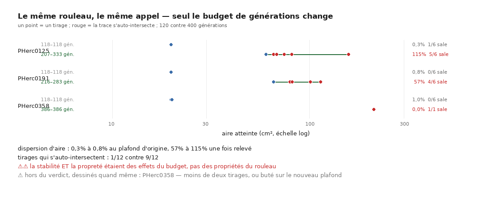

# Le tirage, sur treize rouleaux — M1bis

> ⚠ Le nom du fichier dit « douze » : c'est l'état du 2026-08-20, et il est **gardé** pour
> que les liens des autres documents continuent de résoudre. La campagne en couvre **treize**
> depuis le 2026-08-22 — `PHerc1203` a reçu ses graines et ses six tirages (§5).

2026-08-20. `30` avait mesuré que `vc_grow_seg_from_seed` rend un résultat différent à
chaque exécution — mais sur **une** graine, d'**un** rouleau, en quatorze tirages. `29`
marquait le manque ⚠⚠ : *« 14 tirages ne font pas une distribution, et le taux de 13 % n'a
été mesuré que sur une graine »*.

**78 tirages, 13 rouleaux, six par rouleau, paramètres strictement identiques.**

---

## 0. La forme, d'un coup d'œil


> **Si le traceur était déterministe, chaque ligne serait un point unique.** Aucune ne
> l'est. Et sur cinq lignes un point est rouge : le même appel qui rend une trace propre
> cinq fois rend une trace auto-intersectée la sixième.

Figure : `src/figures/figure_tirages.py`, depuis `docs/mesures/table_tirages.json`.

## 1. Ce que la campagne mesure

| | |
|---|---:|
| tirages exploitables | **78** |
| rouleaux | **13** |
| rouleaux dont l'aire est identique sur les six tirages | **0 sur 13** |
| ⭐ rouleaux où le **VERDICT bascule** d'un tirage à l'autre | **5 sur 13** |
| mauvais tirages | **5 / 78 = 6,4 %** (IC 95 % exact : 2,1 % – 14,3 %) |

Les cinq basculements, avec le pire compte du rouleau :

| rouleau | croisements par tirage | dispersion d'aire |
|---|---|---:|
| `PHerc0125` | **1615**, 0, 0, 0, 0, 0 | 0,31 % |
| `PHerc0257` | 0, 0, 0, 0, 0, **428** | 0,24 % |
| `PHerc0268` | **607**, 0, 0, 0, 0, 0 | 0,33 % |
| `PHerc1203` | **140**, 0, 0, 0, 0, 0 | 0,63 % |
| `PHerc1447` | 0, 0, 0, **1371**, 0, 0 | 35,14 % |

> ⭐ **Un basculement est la preuve la plus forte disponible** : deux exécutions à
> paramètres strictement identiques, deux verdicts opposés. Aucun seuil, aucune vérité
> terrain, aucune interprétation. Le résultat de `30` ne tenait pas à sa graine.

⚠ Le taux de 6,4 % est **compatible** avec les 13 % de `30` (2 sur 15) — les deux
intervalles se recouvrent largement. Ce que la campagne apporte n'est pas un taux plus
petit, c'est un intervalle **quatre fois plus étroit** et une **généralité** : le phénomène
existe sur des rouleaux, des graines et des tailles de trace différents.

## 2. ⭐⭐ Et l'étendue ne signale PAS le mauvais tirage

C'est le résultat que la figure a fait apparaître, et il compte pour la suite : **les trois
rouleaux dont les six tirages ont pratiquement la même aire sont ceux qui portent les pires
comptes.**

Mesuré plutôt que lu à l'œil. Pour chaque mauvais tirage, son **rang d'aire** dans son
propre rouleau, centré-normalisé — 0 = l'aire médiane du rouleau, 1 = l'extrême :

> **excentricité moyenne : 0,60**, contre **~0,50** attendu si l'aire ne disait rien.

⚠ **Sur quatre événements, 0,60 contre 0,50 n'est rien.** La conclusion utilisable est
négative et elle suffit : **on ne peut pas écarter un mauvais tirage en regardant sa
taille.** Il faut le juger — ce qui est précisément ce que nos instruments savent faire pour
0,05 s.

C'est la même leçon que `30` §2 avait établie sur un cas isolé — deux maillages à 0,003 %
d'aire l'un de l'autre, deux verdicts opposés — généralisée à douze rouleaux.

## 3. ⚠ Une observation qu'il ne faut PAS transformer en résultat

La dispersion médiane vaut **0,3 %** chez les rouleaux qui basculent et **12,8 %** chez les
autres — un facteur 40, dans le sens contraire de l'intuition.

**C'est trop beau, et ça ne tient pas debout.** Le confond est visible dans le tableau : les
rouleaux à faible dispersion sont ceux dont les six tirages atteignent le **plafond de
générations**, donc dont la trace **sature**. Une dispersion mesurée sous une troncature
commune ne mesure pas le traceur, elle mesure la troncature.

⭐ **Et le partage par plafond est plus net que le partage par basculement**, ce qui désigne
lequel des deux explique l'autre :

| partage | dispersion médiane | | facteur |
|---|---:|---:|---:|
| par **basculement** | 0,3 % | 12,8 % | 43 |
| par **plafond** | **0,5 %** | **19,9 %** | **40** |

Et l'association entre les deux reste **non significative** : **4 basculements sur 6
rouleaux plafonnés contre 1 sur 7** — test exact **p = 0,10**.

⚠⚠ **Ce chiffre est recalculé, il ne l'était pas.** La version du 2026-08-20 écrivait
« un test exact donne p ≈ 0,55 » — un nombre sans producteur dans l'arbre, donc une anecdote
au sens de la règle de ce dépôt, et périmé dès que le treizième rouleau est arrivé.
`src/tables/table_tirages.py` le calcule désormais, avec le plafond **dérivé** de la
campagne (le maximum de générations observé) plutôt qu'écrit en dur : une constante
deviendrait fausse en silence le jour où le budget du `seed.json` change.

> **Rien n'est encore établi sur la CAUSE.** C'est noté parce qu'une hypothèse écartée avec ⭐⭐ **LA MESURE A ÉTÉ FAITE** → §3bis du même document : la stabilité **était** une troncature, et l'hypothèse est confirmée.
> sa raison vaut mieux qu'une hypothèse oubliée, et parce que la mesure qui trancherait est
> bon marché : relever le plafond de générations et rejouer. C'est désormais un paramètre —
> `GENERATIONS=400 ./src/campagnes/campagne_tirages.sh data/tirages_plafond 6 <rouleaux>` — et le
> plafond effectif voyage dans chaque résumé, pour que deux campagnes à plafonds différents
> ne produisent pas des lignes indistinguables.

## 3bis. ⭐⭐⭐ La mesure a été faite : la stabilité ÉTAIT une troncature

Le §3 nommait la mesure qui trancherait — *relever le plafond de générations et rejouer*.
Faite le 2026-08-22 sur deux rouleaux plafonnés, six tirages chacun, **seul le budget
change** : 120 générations contre 400.



| rouleau | générations | aire médiane | dispersion | tirages sales |
|---|---|---:|---:|---:|
| `PHerc0125` — plafond 120 | 118–118 | 19,83 cm² | **0,3 %** | 1/6 |
| `PHerc0125` — **plafond 400** | 207–333 | **71,31 cm²** | ⭐⭐ **115 %** | ⚠ **5/6** |
| `PHerc0191` — plafond 120 | 118–118 | 19,83 cm² | **0,8 %** | 0/6 |
| `PHerc0191` — **plafond 400** | 216–283 | **80,39 cm²** | ⭐⭐ **57 %** | ⚠ **4/6** |

> **La dispersion médiane passe de 0,55 % à 86,00 %** — un facteur 156. Six traces coupées au
> même endroit ont forcément la même aire : ce n'était pas une propriété du rouleau, c'était
> le budget qui les coupait. **L'hypothèse du §3 est confirmée.**

⚠⚠ **Et un second résultat, que la mesure n'était pas conçue pour chercher : la PROPRETÉ
aussi était une troncature.** Les tirages qui s'auto-intersectent passent de **1 sur 12** à
**9 sur 12**. `PHerc0191` ne basculait pas du tout au plafond d'origine — zéro tirage sale sur
six — et bascule à 4 sur 6 une fois relevé. Les traces étaient propres **parce qu'elles
étaient courtes**.

⭐ C'est cohérent avec ce que [`44`](44_ou_la_chaine_se_trouve.md) mesure sur l'extension
tangentielle — budget 200 → 25 036 auto-intersections — mais ici c'est sur le chemin
principal du dépôt, celui dont tous les chiffres de trace viennent.

⭐ Un **troisième** rouleau va dans le même sens sans pouvoir entrer dans le verdict :
`PHerc0358`, 19,83 → **211,43 cm²** (facteur 10,7) avec **9 907 auto-intersections**. Il n'a
qu'un tirage, et un seul nombre ne se disperse pas — l'inclure ferait baisser la dispersion
médiane sans rien mesurer. `comparer_plafond.py` l'**écarte en le nommant**, et la figure le
dessine quand même en le disant.

⚠ **Ce que ça ne dit pas.** Deux rouleaux au verdict, pas treize : la mesure établit que la
troncature explique la faible dispersion **là où elle a été faite**, pas que tous les rouleaux
plafonnés se comportent ainsi. Et elle ne dit rien de la cause du non-déterminisme, qui reste
ouverte.

⚠⚠ **Un coût mesuré, à connaître avant de « juste augmenter le budget »** : à plafond relevé
une trace devient beaucoup plus lente — le nombre de candidats de frange croît avec la
génération — au point que le tirage de `PHerc0358` a pris **40 minutes** contre ~2 à 4 au
plafond d'origine. La campagne a donc été **arrêtée** après treize tirages sur vingt-quatre :
les onze restants auraient coûté ~7 heures pour une valeur marginale, et `PHerc0358` bute déjà
à **386 générations sur 400**, donc il aurait probablement été écarté comme re-tronqué.

> ⭐ Reproduire : `GENERATIONS=400 ./src/outils/lancer.sh --fond src/campagnes/campagne_tirages.sh
> "$PWD/data/tirages_plafond" 6 <rouleaux>`, puis `table_tirages.py` sur les deux dossiers et
> `comparer_plafond.py` pour les confronter.

## 4. Ce que ça change pour la chaîne

`31` §5 disait que l'étage « tracer » est le maillon dont *« l'outil officiel marche mais
n'est pas reproductible »*, et proposait deux issues : rendre le traceur déterministe, ou
**tirer N fois et sélectionner**. Cette campagne chiffre la seconde.

| fait mesuré | conséquence |
|---|---|
| 4 mauvais tirages sur 72, IC [1,5 % – 13,6 %] | à **trois tirages**, la probabilité d'en avoir au moins un propre est **99,75 %** même à la borne haute de l'intervalle — ⚠ *si les tirages sont indépendants*, ce que ces données ne prouvent pas |
| un tirage coûte **~70 s** sur ces rouleaux | trois tirages coûtent ~3,5 min par départ |
| notre juge coûte **0,05 s**, sans vérité terrain | on peut tous les juger |
| ⭐ **l'aire ne prédit pas le verdict** | on **ne peut pas** faire l'économie du juge |

⚠⚠ **Et le piège de conception reste entier** : prendre le minimum de N tirages avec un juge ⚠⚠ **Le protocole a été TESTÉ** → [`37`](37_les_deux_axes_ne_saccordent_pas.md), et le résultat est **négatif** : sélectionner sur un axe ne valide pas sur l'autre.
bruité fait remonter la **chance** autant que la qualité. Le protocole honnête reste celui
de `31` §4 — **sélectionner sur un axe, valider sur l'autre** — et cette campagne ne le
teste pas.

## 5. ⚠ Ce que cette campagne ne dit pas

- **Elle ne dit pas pourquoi.** La cause de la non-reproductibilité n'est toujours pas
  identifiée. `30` avait écarté `thread_limit` ; rien ne l'a remplacé.
- **Elle ne dit pas qu'une trace propre est une BONNE trace.** L'absence
  d'auto-intersection est nécessaire, pas suffisante — `28` §4 mesure qu'aucun test
  géométrique ne voit un saut d'une seule spire dans le cas serré.
- **Six tirages par rouleau ne mesurent pas un taux PAR rouleau.** Le 5,6 % est un taux
  **groupé** ; savoir si un rouleau est plus instable qu'un autre demanderait bien plus de
  tirages, exactement comme `33` le mesure pour la carte de difficulté.
- ⚠ **Un rouleau du prix manque, et pas pour la raison qu'on croirait.** La campagne ✅ **COMBLÉ le 2026-08-22**, aux deux endroits — cf. les deux ✅ qui suivent.
  couvre 12 des 13 parce que `docs/mesures/table_graines.json` en contenait 12 : **`PHerc1203`
  n'avait jamais eu de graine cherchée**, sur aucune campagne — `src/campagnes/campagne_graines.sh`
  ne le listait pas, alors que `src/outils/carte_separabilite.sh` le liste. Ce n'était donc pas
  une limite de cette campagne-ci, c'était un trou en amont, et il valait aussi pour `25`.

  ✅ **Comblé le 2026-08-22, côté graines** : `PHerc1203` a maintenant ses deux graines,
  planéité **19,84 cm²** et voisinage **9,60 cm²**, zéro auto-intersection des deux côtés.
  La campagne appariée de [`25`](25_une_graine_choisie_sur_la_planeite.md) passe de 12 à
  **13 rouleaux**, et le résultat se **renforce** : 10/12 à p = 0,0386 devient **11/13 à
  p = 0,0225**. ⚠ Le combler a demandé de réparer d'abord un appariement surface/volume
  par POSITION, décrit dans `25` §4bis — `PHerc1203` est l'un des deux seuls rouleaux du
  prix à avoir plusieurs scans, donc le seul endroit où ce défaut latent aurait mordu.

  ✅ **Comblé aussi côté tirages, le 2026-08-22** : les six tirages de `PHerc1203` ont été
  faits, et cette campagne-ci couvre donc **13 rouleaux, 78 tirages** — c'est le chiffre
  publié en tête de ce document. ⭐ Le rouleau **bascule** (`140,0,0,0,0,0` : un tirage sur
  six s'auto-intersecte, cinq sont propres), donc il rejoint les quatre autres bascules et
  le compte passe de 4/12 à **5/13**. Le taux de mauvais tirages devient **5/78 = 6,4 %**
  (IC 95 % exact [2,1–14,3 %]).

  ⚠ Et il confirme le partage de la troncature plutôt que de le brouiller : ses six tirages
  butent tous sur le plafond (118–118) et sa dispersion d'aire vaut **0,63 %** — il est donc
  du côté « plafonné », qui bascule 4 fois sur 6 contre 1 fois sur 7 chez les autres.

## Reproduire

```bash
./src/outils/lancer.sh --fond src/campagnes/campagne_tirages.sh "$PWD/data/tirages" 6
(uv run python src/tables/table_tirages.py --json docs/mesures/table_tirages.json)
uv run python src/figures/figure_tirages.py
```

⚠ Passer par `src/outils/lancer.sh` n'est pas décoratif : la première exécution de cette
campagne a été **tuée par une édition du script pendant qu'il tournait**, et il a fallu la
reprendre. Le wrapper gèle une copie avant de lancer.
