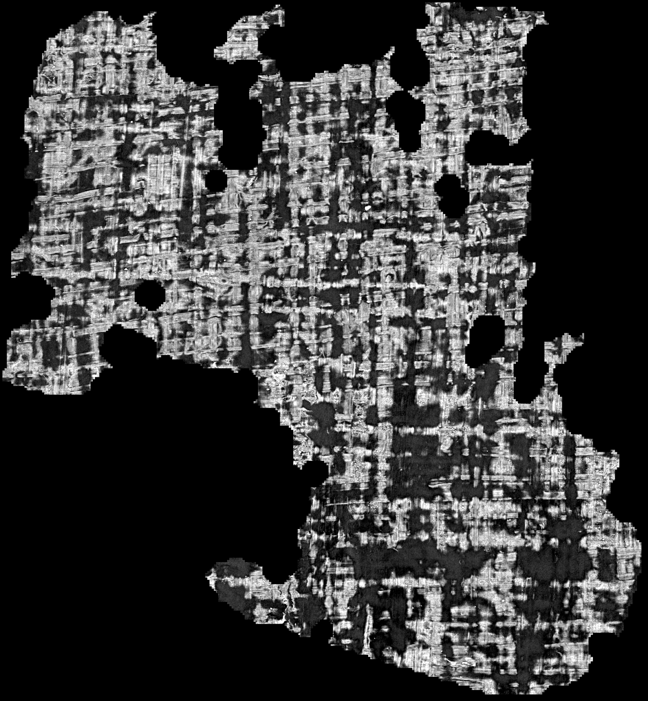

# L'origine de la pile — une hypothèse testée, réfutée, et ce qu'elle a trouvé à la place

2026-08-20. ⚠⚠ **Ce document a été écrit sur une hypothèse, et la mesure l'a réfutée.** Il
est conservé sous cette forme parce que la réfutation a produit un résultat meilleur que
l'hypothèse — et parce qu'effacer une piste fausse fait perdre la raison pour laquelle on
l'avait suivie.

---

## 1. L'hypothèse, et pourquoi elle était sérieuse

Tout l'instrument de profondeur de [`12`](12_profondeur_de_surface.md) se rapporte à **la
couche tracée**, et son §13 le dit sans détour :

> *« Tout l'instrument se rapporte à la couche tracée, **supposée** au milieu de la pile
> […]. C'est l'hypothèse la plus lourde du dispositif. »*

`12` §13 la **vérifie** — sur 98 segments, et le pic observé tombe à une couche du milieu
supposé. Mais il la vérifie sur les **volumes de surface publiés**, engendrés autour de la
trace par `vc_layers_from_ppm -r 32`. Nos piles viennent d'un **autre producteur** —
`vc_flatten` puis `vc_render_tifxyz` — et cette chaîne n'avait jamais été vérifiée.

Deux chiffres rendaient le soupçon lourd. Sur des segments **officiels** de `PHerc1447`,
donc publiés pour être lus :

| producteur | segment | écart médian | tiers central |
|---|---|---:|---:|
| volume de surface publié | `20250702235910` | **3,0 µm** | 62,5 % |
| notre chaîne de rendu | `auto_grown_20250502160708188` | **237,6 µm** | 2 % |

Un facteur **79** — mais sur des segments **différents**, donc confondant le producteur et
le segment.

## 2. ⭐⭐ Le contrôle, et il tranche contre l'hypothèse

`src/outils/origine_de_la_pile.sh` prend **un seul** segment officiel qui publie les deux — son
`tifxyz` et son volume de surface — et le mesure des deux façons.

| producteur | couches | écart médian | tiers central | au bord |
|---|---:|---:|---:|---:|
| volume de surface publié | 31 | **3,00 µm** | 62,5 % | 12,5 % |
| notre `vc_flatten` → `vc_render_tifxyz` | 31 | **17,28 µm** | **100 %** | **0 %** |

> ✅ **14,3 µm d'écart sur le même segment. Les deux producteurs s'accordent.** L'hypothèse
> du milieu **transporte**, et notre chaîne place sa pile au moins aussi bien : elle rend
> **100 %** de pics dans le tiers central là où le volume publié en rend 62,5 %.

⚠ **Le seuil de décision était écrit avant la mesure** (50 µm, dans le script), avec ses
deux issues et leur signification. C'est ce qui empêche de relire un résultat de 14 µm comme
« presque une confirmation ».

## 3. ⭐⭐⭐ Ce que la réfutation a trouvé à la place

Si le producteur n'explique pas les 237,6 µm, alors c'est **le segment**. Et ça pose une
question que personne n'avait posée : **un segment officiel est-il une référence ?**

Les **quatre** segments de `PHerc1447` qui publient un volume de surface, lus par le même
instrument (`docs/mesures/officiels_PHerc1447.json`) :

| segment | fenêtres avec matière | **tiers central** | écart médian |
|---|---:|---:|---:|
| `20250703025628` | 22 / 50 | **68,2 %** | 3,0 µm |
| `20250702235910` | 24 / 50 | 62,5 % | 3,0 µm |
| `20250703034159` | 22 / 50 | **18,2 %** | 10,5 µm |
| `20251105093211-z_dbg_gen_00320` | ⚠ **4** / 50 | 25,0 % | 11,0 µm |

> ⚠⚠ **« Officiel » n'est pas synonyme de « bon ».** Sur un seul rouleau, le tiers central va
> de **18 % à 68 %** — un facteur 3,7 — et le quatrième segment s'appelle littéralement
> `z_dbg_gen_00320`, un artefact de débogage, avec 4 fenêtres exploitables sur 50.

## 4. ⭐⭐ Ce que ça corrige dans `25`, et le sens n'est pas celui prévu

[`25`](25_une_graine_choisie_sur_la_planeite.md) a **retiré** le critère du tiers central en
écrivant :

> *« La trace officielle d'un rouleau du prix […] échoue au critère du tiers central plus
> mal que les nôtres : 2 %, contre 16 et 20 %. Un critère que la référence rate plus mal que
> le cas jugé ne peut pas servir à juger. »*

Le **raisonnement est juste**. Ce qui ne l'est pas, c'est de traiter **un** segment officiel
comme **la** référence. Sur ce même rouleau, deux autres segments officiels rendent 62 % et
68 % — soit trois à quatre fois mieux que nos traces, ce qui est exactement le
comportement qu'on attendrait d'une référence.

⏳ **Le critère mérite donc d'être reconsidéré** — pas parce que la mesure était fausse, mais
parce que **la référence n'en était pas une**. ⚠ Reconsidéré, pas rétabli : le remettre
demande de choisir une référence sur un motif défendable, et « le meilleur des quatre » n'en
est pas un.

## 5. Ce qui n'est PAS touché

- [`24`](24_premiere_trace_rouleau_du_prix.md) §2, *« écart médian 94 µm »* : la mesure tient,
  l'origine est bonne. Le signalement posé ce matin est **retiré**.
- [`37`](37_les_deux_axes_ne_saccordent_pas.md) : ses valeurs absolues tiennent aussi, en
  plus de la comparaison intra-producteur qui était déjà à l'abri.
- `12` §13 : intact, et c'est même lui qui avait raison — sa conclusion transporte.

### ⚠⚠ Et la comparaison contrôlée, qui est le fait le plus dur de la journée

Le contrôle a produit sans le chercher la seule comparaison **appariée** disponible : un bon
segment officiel et nos propres traces, **sur le même rouleau, par la même chaîne**.

| surface — `PHerc1447`, notre chaîne | écart médian |
|---|---:|
| segment officiel `20250702235910` | **17,28 µm** *(plafond 129,6 — non censuré)* |
| notre tirage `r2` | **159,84 µm** |
| notre tirage `r1` | **≥ 172,80 µm** ⚠ *au plafond* |
| notre tirage `r4` | **≥ 172,80 µm** ⚠ *au plafond* |

> **Un facteur d'au moins 9,2 — et le vrai facteur est plus grand**, puisque deux de nos
> trois valeurs sont des **bornes basses** butant sur le plafond de leur fenêtre.

⚠⚠ **Recadré le 2026-08-20 par [`38`](38_ce_qui_bouge_avec_la_fenetre.md).** Toute distance mesurée sur une de NOS traces est sans objet : le test de convergence montre que la mesure **suit la fenêtre de rendu** (α = +1,01) au lieu de suivre le papyrus — il n'y a aucune feuille à portée, même à quatre spires. Ce ne sont donc pas des sous-estimations, ce sont des mesures d'une grandeur qui n'existe pas là. ⭐ Elles restent valides pour une surface qui **converge**, comme le segment officiel (α = +0,00).

⚠⚠ **Mesuré depuis, et c'est pire que la borne.** Le même tirage `r2`, rendu dans une
fenêtre de **deux spires** (81 couches, plafond 345,6 µm), lit **311,0 µm** — non censuré.
Il en lisait 159,84 à 41 couches. **Toutes les valeurs d'écart de ce dépôt sont donc des
sous-estimations**, y compris les 94 µm de [`24`](24_premiere_trace_rouleau_du_prix.md) et
les 146–187 µm de [`37`](37_les_deux_axes_ne_saccordent_pas.md) : leurs fenêtres ne
pouvaient pas montrer plus. Le facteur réel contre le segment officiel est **≥ 18**, pas
9,2. Voir [`38`](38_pas_une_spire.md).

⭐ Cette comparaison-ci ne souffre d'aucun des confonds précédents : même rouleau, même
taille de voxel, même `vc_flatten`, même `vc_render_tifxyz`, même instrument de dépouillement.
**Nos traces sont réellement loin de leur feuille**, d'un ordre de grandeur, et aucun réglage
de mesure ne l'explique — l'origine vient d'être vérifiée juste au-dessus.

⚠ C'est cohérent avec ce que `09` et `12` avaient trouvé sans pouvoir le nommer : rien n'est
lisible sur nos rendus. Un détecteur d'encre entraîné sur des surfaces posées **sur** la
feuille n'a aucune raison de rendre quoi que ce soit sur une surface qui en est à 170 µm.

## 5 bis. ⭐ Et voilà le papyrus — puis la mauvaise nouvelle

Le contrôle a produit, en passant, **un rendu d'un rouleau du Grand Prize par notre propre
chaîne**, sur une surface qu'on vient de mesurer à 17 µm de sa feuille :



> `PHerc1447`, segment officiel `20250702235910`, **25,4 × 27,5 mm**, couche 11 sur 31 (la
> plus contrastée). Le treillis de fibres croisées, les trous, les bords déchirés. **La
> chaîne déroule et aplatit ; ce n'est pas le maillon qui manque.**

### ⚠⚠ M1ter, répondu, et la réponse est négative

`29` marquait M1ter « **avant tout le reste** » : *l'encre est-elle lisible à 9 µm ?* Ce
rendu permet de le mesurer sur un rouleau du prix, sur une **bonne** surface — le modèle du
Grand Prize 2023, une fenêtre de 1200 × 1200, 26 couches à partir de la 3ᵉ
(`docs/mesures/m1ter_encre_a_9um.json`) :

| | étendue de sortie | **σ** |
|---|---:|---:|
| Scroll 1, `20230909121925` — où le modèle marche (AUC 0,925), 2,4 µm | 4,453 | **0,7712** |
| `PHerc1447`, segment officiel, 8,64 µm | 0,264 | **0,0171** |

> **Le modèle sort une constante — σ 45 fois plus petit.** Ce n'est pas « peu d'encre »,
> c'est **aucun signal**.

⭐ **Et le contrôle qui écarte notre chaîne, mesuré le même soir.** Le même segment lu dans
son **volume de surface publié** — donc sans que nous ayons tracé, aplati ni rendu quoi que
ce soit — donne exactement la même constante : `-1,275 / -1,121 / -1,010`, σ **45,0×** plus
petit que le témoin, contre 45,2× pour notre rendu. **Notre chaîne n'y est pour rien.**
(`docs/mesures/m1ter_volume_publie.json`, pont `src/volume/zarr_vers_couches.py`.)

⚠ Ce que ça n'établit pas : qu'il n'y a pas d'encre là (une fenêtre, un segment), ni
laquelle des causes restantes joue — la résolution, ce rouleau-ci, ou un papyrus réellement
vierge à cet endroit. ⭐ **Les deux premières ont été instruites depuis** :
[`46`](46_le_temoin_negatif.md) §3 ferme « papyrus vierge », et
[`58`](58_resolution_ou_rouleau.md) coupe « résolution » en deux — l'échantillonnage en plan
ne suffit pas (à 9,60 µm, plus grossier qu'ici, Scroll 1 rend encore **24,1 fois** ce σ) et
l'épaisseur de la fenêtre de profondeur coûte **huit fois plus** à facteur égal. ⚠⚠ Mais ça contredit une prémisse que [`31`](31_roadmap.md) §2 tient du papier
de juin 2026 : *« le modèle de 2023 généralise en zero-shot »*. À 8,64 µm, 26 couches
couvrent **225 µm** de profondeur là où l'entraînement en voyait **62** — quatre fois plus
d'épaisseur pour la même fenêtre. Ce n'est peut-être pas gratuit, et c'est à mesurer avant
de bâtir dessus. ⭐ **Mesuré le 2026-08-27** ([`58`](58_resolution_ou_rouleau.md) §4) : ce
n'est pas gratuit du tout — doubler cette épaisseur coûte **40,8 %** de la réponse du modèle,
quand doubler l'échantillonnage en plan n'en coûte que **0,3 %**.

## 6. ⚠ Ce que ce document ne dit pas

- **Il ne dit pas que les segments officiels sont mauvais.** Deux des quatre sont excellents.
  Il dit qu'il faut **regarder lequel** avant de s'en servir comme référence.
- **Le contrôle porte sur UN segment.** Un seul same-segment suffit à réfuter « le
  producteur décale systématiquement », pas à établir qu'il ne décale jamais.
- **La chaîne a deux étages** (`vc_flatten`, `vc_render_tifxyz`) et le contrôle les teste
  ensemble. ⓘ Le bucket publie un `<segment>_flattened.obj` : leur chaîne aplatit aussi, donc
  ce sont deux exécutions de la même forme, pas deux formes différentes.

## ⭐⭐ Confirmé par le test de convergence : deux segments officiels, un seul converge *(2026-08-21)*

Ce document établissait que « officiel » n'est pas synonyme de « bon », en mesurant la part
du tiers central (18,2 / 25,0 / 62,5 / 68,2 %). Le test de convergence de
[`38`](38_ce_qui_bouge_avec_la_fenetre.md) le redit, sur le même rouleau, dans les **mêmes
fenêtres** (31 et 81 couches) et par la **même chaîne** :

| segment publié de `PHerc1447` | aire | 31 c | 81 c | pics au bord | **α** |
|---|---:|---:|---:|---:|---:|
| `20250702235910-auto_grown_…292` | — | 17,28 µm | 17,30 µm | **0 %** | **+0,00** |
| `auto_grown_20250502160708188` | 2,89 cm² | **129,6 µm** | **345,6 µm** | **72–78 %** | **+1,02** |

Le second **ne converge pas** : son écart suit la fenêtre exactement comme les nôtres, et
trois quarts de ses fenêtres ont leur pic **au bord** — c'est-à-dire qu'il n'y a pas de pic
à trouver dedans.

⚠⚠ **Et c'est un piège de nommage qui m'a eu.** Le répertoire local du second s'appelle
`data/trace/PHerc1447_officiel/`. J'ai monté toute une campagne d'enchaînement de spires
dessus **parce que son nom disait « officiel »**, en supposant qu'il s'agissait du segment
mesuré à α = +0,00. Ce sont deux segments différents. Le nom d'un répertoire n'est pas une
mesure.

⭐ Remède structurel plutôt qu'une note : `src/outils/spire_suivante.sh` **refuse de partir d'une
surface qui ne converge pas** — il juge la spire 0, **lit le verdict dans le JSON** et sort
en le nommant. Enchaîner depuis une surface posée en travers mesurerait la propagation d'un
défaut, et le résultat aurait l'air d'un résultat.

## Reproduire

```bash
./src/outils/lancer.sh src/outils/origine_de_la_pile.sh          # le même segment, deux fois
./src/outils/lancer.sh --fond src/outils/leur_graine.sh          # LEUR graine dans NOTRE chaîne
./src/outils/lancer.sh --fond src/outils/leurs_parametres.sh     # EXACTEMENT leurs paramètres
./src/outils/lancer.sh --fond src/outils/petite_trace.sh         # une trace courte converge-t-elle ?
for k in $(cut -f2 docs/mesures/volumes_surface_PHerc1447.txt); do
  uv run python src/commun/zarr_depth.py "$k" --windows 25
done
```
