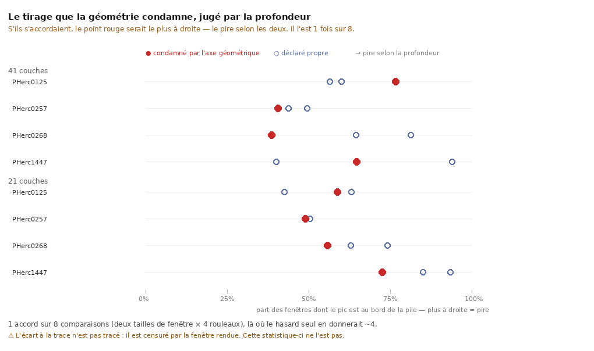

# Les deux axes ne s'accordent pas — et ça coûte la méthode

2026-08-20. `35` a mesuré que le traceur est un tirage : **4 rouleaux sur 12** rendent des
verdicts opposés à paramètres identiques. [`31`](31_roadmap.md) §4 en tire la méthode qui
remplacerait un traceur déterministe — **tirer N fois et sélectionner** — et nomme aussitôt
son piège, la malédiction du vainqueur : prendre le minimum de N tirages avec un juge bruité
fait remonter la **chance** autant que la qualité.

La parade écrite est : **sélectionner sur un axe, valider sur l'autre**. Elle n'avait jamais
été testée. Elle l'est.

---

## 0. La forme, d'un coup d'œil



> **S'ils s'accordaient, le point rouge serait le plus à droite** — le pire selon les deux.
> Il l'est **une fois sur huit**, là où le hasard seul en donnerait quatre.

Figure : `src/figures/figure_deux_axes.py`, depuis `docs/second_axe_21.json` et
`docs/second_axe_41.json`.

## 1. Le dispositif

| | |
|---|---|
| **axe 1** | `vc_tifxyz_selfcross` — la surface se traverse-t-elle elle-même ? **Géométrie pure**, ne lit jamais le volume |
| **axe 2** | la profondeur — où est la matière par rapport à la trace, **lue dans le volume**, ne regarde jamais la surface contre elle-même |

⭐ **La comparaison est INTRA-rouleau**, et c'est ce qui la rend concluante. Sur un rouleau
qui bascule on tient le **mauvais** tirage *et* des **propres**, même graine, mêmes
paramètres, même machine. La question devient exactement :

> *Le tirage que l'axe 1 condamne est-il aussi le pire selon l'axe 2 ?*

⚠ Les cibles sont **choisies, pas exhaustives** : un rendu coûte ~10 min mesurées, donc les
72 tirages de `35` feraient 12 h. `src/graine/choisir_tirages.py` retient les 4 mauvais,
8 propres appariés et 4 témoins — 16 tirages, 2,7 h. ⚠ Les témoins sont les rouleaux stables
les **plus dispersés** en aire, pas les moins : il faut savoir ce que l'axe 2 fait quand
l'axe 1 ne signale rien, et un témoin facile ne le dirait pas.

## 2. Le résultat, sur deux tailles de fenêtre

| fenêtre rendue | écart à la trace | part au bord |
|---|---:|---:|
| **21 couches** | **0 / 4** d'accord *(3 ex-aequo)* | **0 / 4** |
| **41 couches** | **0 / 4** d'accord *(2 ex-aequo)* | **1 / 4** |

> ⭐⭐ **1 accord sur 8 comparaisons, là où le hasard seul en donnerait ~4.** Sélectionner un
> tirage sur l'axe géométrique **ne sélectionne pas** pour l'axe de profondeur.

Et sur deux des quatre rouleaux de la fenêtre large, le tirage condamné par la géométrie
est **strictement le meilleur** selon la profondeur — `PHerc0268` (0,386 contre 0,645 et
0,814 au bord) et `PHerc0257` (0,406 contre 0,495 et 0,438).

⚠ **Le seul accord du lot est `PHerc0125` en fenêtre large**, où le tirage condamné est bien
le plus mauvais des trois (0,767 contre 0,600 et 0,566). Il est dit ici parce qu'un document
qui ne nommerait que les huit désaccords donnerait à croire qu'il n'y a pas d'exception.

⚠ **Quatre rouleaux ne rendent aucun de ces comptes significatif.** Ce qui se lit est la
**direction**, et seulement parce qu'elle est franche : 0/4 et 1/4 disent quelque chose,
2/4 ne dirait rien. C'est le critère que l'instrument imprime, écrit avant la mesure.

## 3. ⚠⚠ Ce que la mesure a buté, et pourquoi ça ne l'annule pas

L'écart à la trace est **censuré** : il ne peut pas dépasser `(couches / 2) × voxel`, soit
93,6 µm à 21 couches et 187,2 µm à 41. Mesuré : **13 valeurs sur 16 au plafond** dans la
fenêtre étroite, et **encore 9 sur 16** dans la large. **Doubler la fenêtre n'a pas suffi.**

Deux conséquences, opposées :

- 🔻 la colonne « écart » est presque inutilisable telle quelle — ses ex-aequo sont des
  ex-aequo **par censure**, pas par mesure, et l'instrument refuse de les compter comme des
  accords ;
- 🔺 mais « part au bord » n'est **pas** censurée, et elle donne 0/4 puis 1/4. La conclusion
  ne repose donc pas sur la statistique saturée.

⚠⚠ **Et la censure est elle-même un résultat** : sur ces seize rendus, le pic de matière est
hors d'une fenêtre de ±187 µm pour plus de la moitié.

⚠⚠ **Recadré le 2026-08-20 par [`38`](38_ce_qui_bouge_avec_la_fenetre.md).** Toute distance mesurée sur une de NOS traces est sans objet : le test de convergence montre que la mesure **suit la fenêtre de rendu** (α = +1,01) au lieu de suivre le papyrus — il n'y a aucune feuille à portée, même à quatre spires. Ce ne sont donc pas des sous-estimations, ce sont des mesures d'une grandeur qui n'existe pas là. ⭐ Elles restent valides pour une surface qui **converge**, comme le segment officiel (α = +0,00). `12` posait un seuil de lisibilité à
**~50 µm** ; on est trois à quatre fois au-dessus, sur des traces propres comme sur des
mauvaises. Ça a ouvert une question plus lourde que celle-ci —
[`36`](36_lorigine_de_la_pile.md).

## 4. ⚠ Ce que `36` fait à ce document, et ce qu'il ne lui fait pas

`36` mesure qu'un segment **officiel** lit **3,0 µm** dans son volume de surface publié et
**237,6 µm** dans notre chaîne de rendu. Si l'origine de nos piles est décalée, les valeurs
absolues ci-dessus sont fausses.

⭐ **La conclusion de ce document survit quand même**, et pour une raison précise : les
seize rendus sortent du **même producteur**, avec le **même** `-n`. Un décalage commun ne
change pas *quel tirage est le pire* d'un même rouleau — et c'est la seule chose que ce
document compare. Ce qui tomberait, ce sont les valeurs absolues et toute comparaison
**entre producteurs**.

## 5. Ce que ça change pour la chaîne

| avant | après |
|---|---|
| « tirer N fois et sélectionner » remplace un traceur déterministe | **sélectionner sur la géométrie n'achète rien sur la profondeur** |
| deux instruments indépendants → on peut valider l'un par l'autre | ils sont indépendants **au point de ne pas se recouper** |

⚠ **Ce n'est pas « les instruments sont mauvais ».** Ils mesurent deux défauts différents,
et [`28`](28_le_paysage_du_controle_qualite.md) §4 le disait déjà — *« no geometry-only test
can separate a one-wrap switch from bending »*. Un tirage sans auto-intersection peut être
posé en travers de l'empilement ; un tirage qui se croise peut, par ailleurs, longer la
matière. **Le désaccord est cohérent avec ce qu'on savait**, et c'est la première fois qu'il
est mesuré.

⭐ **Ce qui reste de la méthode d'échantillonnage** : elle marche encore, mais elle doit
sélectionner sur **les deux axes à la fois**, pas sur l'un puis vérifier sur l'autre. Le
coût change de nature — un rendu par tirage, pas 0,05 s de juge géométrique — et c'est une
contrainte à porter dans la conception, pas une note.

## 6. ⚠ Ce que ce document ne dit pas

- **Il ne dit pas que l'axe 2 est le bon.** Aucun des deux n'a de vérité terrain ici.
- **Il ne dit pas que les tirages « propres » sont mauvais.** Il dit que les deux axes les
  ordonnent différemment.
- **Il ne mesure rien sur 8 des 12 rouleaux** de `35` — ceux où aucun tirage ne bascule
  n'ont pas de mauvais tirage à comparer, donc rien à tester.

## Reproduire

```bash
cd experiments && uv run python ../src/graine/choisir_tirages.py --json ../docs/cibles_second_axe.json
cd .. && ./src/outils/lancer.sh --fond src/campagnes/campagne_second_axe.sh "$PWD/data/second_axe" 21 \
    $(cd experiments && uv run python ../src/graine/choisir_tirages.py --chemins)
cd experiments
uv run python ../src/tables/table_second_axe.py ../data/second_axe    --json ../docs/second_axe_21.json
uv run python ../src/tables/table_second_axe.py ../data/second_axe_41 --json ../docs/second_axe_41.json
```
