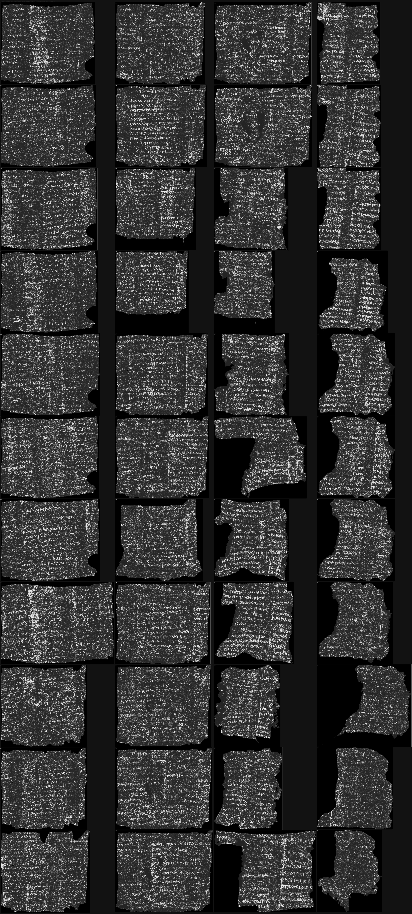
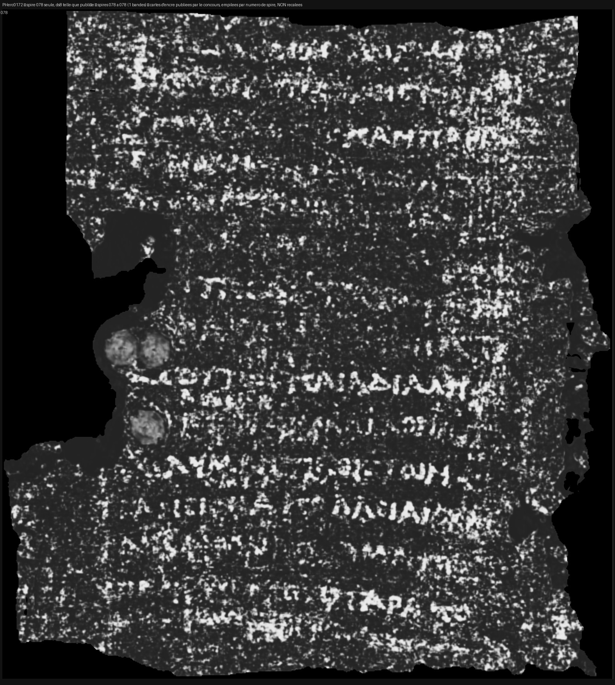

# Le rouleau entier : 44 spires consécutives, en une image

2026-08-20. Reproductible : `src/outils/mosaique_rouleau.sh PHerc0172`.
Instrument : `src/volume/assembler_mosaique.py` (18 témoins, tous sondés).

---

## 1. L'image

**44 spires consécutives d'un rouleau d'Herculanum, sans un trou**, de la 052 à la 095,
rangées dans l'ordre. Les colonnes se lisent de haut en bas puis de gauche à droite.
Image de 4518 × 10000 px.

Une spire seule, à la résolution telle qu'elle est publiée :

Le grec s'y lit en lignes régulières — des groupes de lettres nettes sur plusieurs
lignes consécutives, avec les lacunes du support entre elles.

## 2. ⚠⚠ Ce que cette image est, et ce qu'elle n'est pas

**Chaque bande est le travail de l'équipe du concours.** Ils ont tracé la spire,
l'ont dépliée, ont passé leur détecteur d'encre et ont publié le résultat. Nous ne
déroulons rien ici : **nous ordonnons**. La seule chose que ce dépôt ajoute est
l'assemblage — et le fait, mesuré, qu'il ne manque aucune spire entre la première et
la dernière.

C'est écrit ici et dans l'en-tête du script parce qu'**une image assemblée ne porte pas
son auteur**. Publiée sans cette phrase, elle se lirait comme un résultat de ce projet.

⚠ **Les bandes sont alignées à gauche, pas recalées.** L'origine du dépliage est propre
à chaque segment, donc une colonne de l'image ne désigne pas la même position sur le
rouleau d'une bande à l'autre. Les largeurs varient de **666 à 1247 px, soit 47 %**, et
ce trait vertical au bout de chaque bande est là pour que le désalignement reste visible
au lieu d'être masqué par un cadre commun.

⭐ **La largeur croît avec le numéro de spire**, et ce n'est pas un artefact : une spire
extérieure fait un tour plus long qu'une spire intérieure. L'image porte donc la
géométrie du rouleau, pas seulement son texte.

## 3. Pourquoi ça vaut la peine, au-delà de l'image

C'est la **référence**. Ce dépôt vise une chaîne qui déroule un rouleau *automatiquement*,
sans les 775 heures d'annotation de l'état de l'art. Jusqu'ici, « ça marche » n'avait rien
à quoi se comparer : [`10`](10_segment_complet.md) montrait **un** segment, le nôtre, passé
par notre modèle. Voici à quoi ressemble l'objectif, fait à la main par ceux qui savent
le faire.

| | [`10`](10_segment_complet.md) | ici |
|---|---|---|
| ce qui est montré | 1 segment | **44 spires consécutives** |
| qui a tracé | eux (couches publiées) | eux |
| qui a détecté l'encre | **nous** (AUC 0,925) | eux |
| ce que ça mesure | notre détecteur | **la cible de notre géométrie** |

## 4. Le coût, mesuré

| | |
|---|---|
| téléchargé | **21 Mo** (44 cartes d'encre `ds8`) |
| requêtes | 44 listages + 44 fichiers |
| durée | ~3 min |
| tracé, aplati ou rendu ici | **rien** |

⚠ Le rendu pleine résolution d'**un seul** segment pèse 1,84 Go sur le dépôt public. Les
vignettes `ds8` sont 8× plus petites par côté, donc **64× plus légères** — c'est ce qui
rend un rouleau entier abordable, et c'est aussi pourquoi les lettres y sont à la limite
de la lisibilité : un caractère fait environ six pixels.

## 5. Où ce matériel existe, et où il n'existe pas

Mesuré par `src/outils/lister_volumes_surface.sh`, un rouleau par fichier
`docs/volumes_surface_*.txt` :

| rouleau | segments publiés | avec carte d'encre | spires consécutives |
|---|---:|---:|---|
| **PHercParis4** | 81 | 80 | segments datés, **pas de numéro de spire** |
| **PHerc0172** | 53 | 53 | ⭐ **052 → 095, sans trou** |
| **PHerc0139** | 38 | 38 | **023 → 059, sans trou** |
| PHerc1667 | 19 | 19 | 011→013, 018, 023, 028→041 (trois trous) |
| PHerc1447 | 4 | **0** | — |
| PHerc0800 | 0 | 0 | — |
| PHerc1203 | 0 | 0 | — |

⚠ **Les rouleaux du prix sont ceux qui n'ont rien.** `PHerc1447` publie quatre volumes de
surface et **aucune** carte d'encre ; `PHerc0800` et `PHerc1203` ne publient ni l'un ni
l'autre. La mosaïque est donc possible exactement là où le travail est déjà fait, et
impossible là où le prix se gagne — ce qui est cohérent, et rappelle que l'image ci-dessus
n'est pas un raccourci vers le prix.

## 6. Un instrument tenté, et ce qu'il vaut pour l'instant

En choisissant quelle spire montrer en détail, il a fallu répondre à « laquelle porte le
plus de texte ». **σ ne répond pas** : un mouchetis et une écriture ont le même écart-type,
et la spire la plus contrastée du rouleau (081, σ 58,6) est justement speckle.

`score_de_lignes` cherche donc la **périodicité** : une écriture est périodique
perpendiculairement à ses lignes, un mouchetis n'a pas de période. Sur données fabriquées
il sépare proprement (0,96 contre 0,13) et retrouve le pas exact.

⚠⚠ **Et il a fallu deux corrections avant qu'il ne veuille dire quelque chose**, les deux
attrapées par un témoin et non par relecture :

1. **Une borne choisie pour la commodité produit un classement entièrement faux.** Lag
   minimum fixé à 4 px « pour éviter le grain » : le score élisait un interligne de 4 px,
   soit 0,4 mm — dix fois trop serré pour de l'écriture. C'était le grain du JPEG, et il
   était mieux noté que n'importe quelle vraie ligne. Les bornes viennent maintenant de la
   physique (3 à 12 mm d'interligne, convertis par la résolution).
2. **Borner ne suffit pas : un grain a des harmoniques.** Un motif de période 3 rejoue à
   21, 30, 42 — donc *à l'intérieur* de la fenêtre plausible, déguisé en écriture. Mesuré :
   sur un mélange grain-3 + lignes-30 borné sur [20, 45], le score élit **21**. Un passe-bas
   à l'échelle du grain supprime la famille entière d'harmoniques, et la vraie ligne ressort.

⚠ **Ce qu'il vaut sur les vraies bandes : pas encore assez pour choisir.** Sur les 44
spires, **37 élisent l'axe vertical** là où l'œil lit des lignes horizontales, et les
interlignes s'agglutinent contre la borne basse (20 à 22 px sur 44 bandes) — la signature
d'une mesure qui ne trouve pas de vraie période. Il est donc **publié et pas utilisé** :
la spire du détail a été choisie à l'œil, et c'est dit.

---

## Ce que ça ne résout pas

Rien de ce qui bloque notre propre chaîne. [`38`](38_ce_qui_bouge_avec_la_fenetre.md)
tient toujours : nos traces sont des **coupes radiales**, et
[`39`](39_le_seam_de_correction.md) tient toujours : le maillon manquant est *dire où la
surface aurait dû passer*. Cette image est la cible, pas le chemin.
