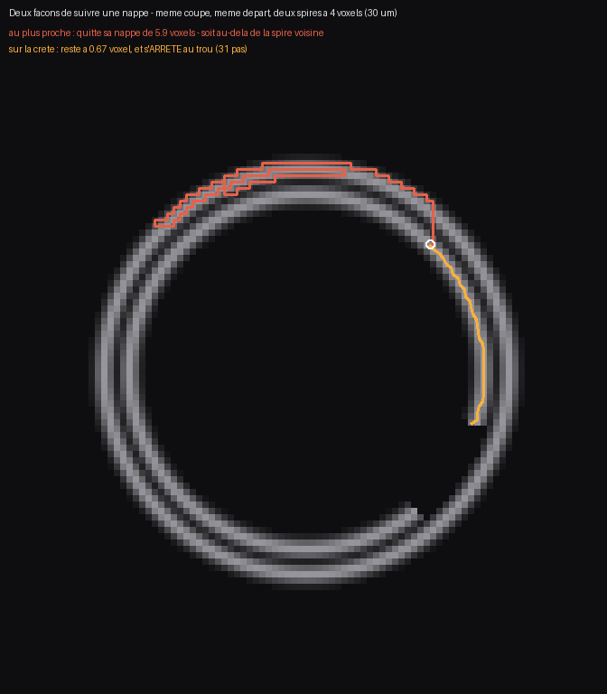

# Marcher le long d'une nappe — et pourquoi « au plus proche » ne marche pas

2026-08-20, nuit. Le maillon manquant de [`39`](39_le_seam_de_correction.md).
Instrument : `src/commun/suivre_nappe.py` (29 témoins, dont un **témoin négatif**).
Figure : `src/figures/figure_marche.py`.

---

## 1. La question, telle qu'elle a été posée

> *« Est-ce que tu comptes basiquement prendre un point de départ au centre et te propager
> au point le plus proche pour créer le maillage ? Ou bien t'as d'autres techniques ultra
> stylées ? »*

Réponse courte : **non, et c'est mesuré pourquoi.** « Au plus proche » est la première idée
que tout le monde a, et c'est aussi la manière la plus fiable de finir sur la mauvaise
feuille.

## 2. ⚠⚠ Pourquoi « au plus proche » échoue, sur une figure



Deux spires à **4 voxels** l'une de l'autre — c'est l'écart réel d'un rouleau : 20 à 50 µm
à 7,91 µm le voxel. Un trou de 17 voxels dans la spire de départ, comme un papyrus en a
partout. Même coupe, même point de départ (le cercle blanc), deux méthodes.

| méthode | écart max à sa spire de départ | fin |
|---|---:|---|
| **au plus proche** | **5,94 voxels** — au-delà de la spire voisine | continue, 200 pas |
| **sur la crête** | **0,67 voxel** | **s'arrête au trou**, 31 pas |

**Facteur 9.** Et le point qui compte : le chemin rouge reste **connexe et plausible**. Rien
dans sa forme ne dit qu'il a changé de feuille — seul son rayon le dit. Un contrôle de
régularité ne l'attraperait pas.

⭐ La raison est géométrique et vaut d'être dite en une phrase : **dans un rouleau, le
voisin d'à côté est plus loin que le voisin d'en face.** Un pas le long de la spire fait un
voxel ; la spire suivante est à quatre. Dès qu'il y a un trou de plus de quatre voxels — et
il y en a partout — « le plus proche » est de l'autre côté du vide.

## 3. Ce qui est fait à la place : trois gestes, répétés

1. **la normale locale**, par le **tenseur de structure** — pas par une différence finie. Le
   gradient d'une nappe pointe en travers d'elle, donc le vecteur propre dominant de la
   covariance des gradients est la normale. ⚠ Et il reste défini *sur la crête*, là
   précisément où on marche et où un gradient ponctuel s'effondre ;
2. **recentrer** sur le maximum le long de cette normale, au **sous-voxel** par ajustement
   parabolique. Sans ça, chaque pas arrondit et la marche dérive hors de la nappe en croyant
   la suivre ;
3. **avancer** en reprojetant la direction dans le plan de la nappe. ⚠ Reprojeter à *chaque*
   pas est ce qui fait suivre une courbure — et un rouleau ne fait que tourner.

⭐⭐ **Et la garde qui fait tout le travail** : un recentrage de plus de 2 voxels est
**refusé**. Un vrai suivi corrige des fractions de voxel ; un saut corrige d'un interligne.
La marche s'arrête et **dit laquelle des deux choses lui est arrivée** — fin de nappe, ou
saut refusé.

⚠ **L'ordre de ces deux tests est le diagnostic, et je l'avais écrit à l'envers.** Un grand
recentrage vers une valeur *forte* est un saut sur la voisine ; le même recentrage vers une
valeur *faible* est une nappe qui finit. Tester le saut d'abord étiquetait « saut de nappe »
un simple trou — verdict juste pour une raison fausse, qui envoie chercher un problème
d'empilement là où il n'y a qu'un manque de matière.

## 4. Ce que ça produit : un fichier que l'outil sait relire

La sortie est un `PointCollections`, le format que `vc_grow_seg_from_seed --correct` charge.
⚠ Le format est **lu dans la source** (`core/src/PointCollections.cpp`), pas deviné : un
fichier dont la version ne correspond pas est rejeté en bloc.

⚠⚠ **Et l'ordre des points est signifiant.** `PointCorrection` (`core/src/GrowPatch.cpp`)
trie par identifiant croissant et s'en sert comme d'un **chemin** : le premier point ancre
la collection sur la surface, les suivants sont placés aux emplacements de grille successifs.
Un nuage non ordonné donnerait un fichier valide et un résultat absurde.

⚠ Les coordonnées sont écrites en `(x, y, z)` alors que la marche travaille en `(z, y, x)` :
convention du volume contre convention numpy. Les mélanger tire la surface vers un point
parfaitement faux sans que rien n'ait l'air cassé. Assertion dédiée.

## 5. ⭐⭐ Ce que le traceur fait déjà, et qu'il ne faut pas réécrire

En lisant la source pour le format, une chose s'est imposée : `vc_grow_seg_from_seed`
**n'est pas une propagation**. C'est un problème de **moindres carrés** résolu par Ceres, où
chaque point de la grille porte une famille de résidus (`GrowPatch.cpp:1244`) :

```
DIST · STRAIGHT · DIRECTION · SNAP · NORMAL · NORMAL3DLINE
SDIR · CORRECTION · REFERENCE_RAY · SURFACE_SDT · SPACELINE · PATCH_NORMAL
```

⭐ **`DIRECTION` est la partie « ultra stylée » de la réponse** : le tracer prend des
`DirectionField`, et il en existe trois genres — `horizontal`, `vertical`, `normal`. Un
résidu `FiberDirectionLoss` demande que **l'axe u de la grille suive les fibres
horizontales** et **l'axe v les fibres verticales**. Autrement dit :

> **le papyrus fournit son propre système de coordonnées.** Les deux familles de fibres
> *sont* les axes u, v de la feuille dépliée. On ne choisit pas une paramétrisation, on la lit.

Et `CORRECTION` est exactement le résidu que nos points de passage alimentent : nous
n'ajoutons pas une méthode à côté du solveur, nous **remplissons un terme qu'il attend déjà**.

## 6. ⭐⭐⭐ Sur la vraie prédiction : ce qui manquait n'était pas la marche, c'était le CHAMP

Lancée sur la prédiction publiée de `PHerc1447` à **leur** graine, la marche s'arrête au
bout de 9 pas en refusant un saut. Mesure du bloc avant d'accuser quoi que ce soit :

```sh
valeurs distinctes : 2   ->   0 et 255
x: ........................#########################################################
y: ......####......................####............####.........####................
```

⚠⚠ **La prédiction publiée est un MASQUE BINAIRE.** Son nom le disait —
`…-surface-m7-L0-th0.2.zarr`, *th* pour *threshold* — et ça change tout : **un masque n'a
pas de gradient à l'intérieur de la matière, il a un plateau.**

| conséquence | ce que ça produit |
|---|---|
| le tenseur de structure ne voit rien hors des bords | pas de normale fiable |
| `argmax` sur un plateau rend le **premier** indice | la marche se colle au **bord** de la nappe |
| rien à suivre pour un traceur | **exactement l'état constaté par [`38`](38_ce_qui_bouge_avec_la_fenetre.md)** |

⭐ **Le remède rend la crête** : la transformée de distance donne à chaque voxel de matière
sa distance au vide, donc son maximum local est le **milieu** de la nappe — son axe médian.
C'est ce que désigne le *cache EDT* que le pipeline officiel utilise et que le bucket ne
publie pas. Ajouté (`champ_de_distance`), mesuré **à bloc, départ et code identiques** :


| sur le même bloc réel, même départ | pas | distance au bord, médiane | vides traversés | arrêt |
|---|---:|---:|---:|---|
| masque brut | 106 | **1,34 vx** | 0 | saut de nappe refusé |
| **transformée de distance** | **138** | **1,74 vx** | 0 | **sortie du bloc** |

Les deux restent dans la matière — sur un masque, la matière est un plateau et y rester est
facile. Ce qui les sépare est la **position dans l'épaisseur** : la marche sur la distance se
tient plus près de l'axe médian et va plus loin, jusqu'à ce que le cube se termine.
**283 points de passage** dans les deux sens, soit ≈ 2,4 mm de nappe suivie à 8,64 µm le voxel.

⚠ Et le refus est explicite : sur un masque binaire sans `--distance`, l'outil **refuse de
marcher** et nomme le remède. Convertir en douce ferait croire que la prédiction publiée
porte une structure qu'elle ne porte pas.

### ⚠⚠ Deux mesures que j'ai failli publier fausses, dans cette seule section

1. **Une comparaison entre deux blocs différents.** J'avais d'abord opposé « 9 pas sur le
   masque » à « 138 sur la distance » — mais le 9 venait d'un cube de rayon 64 et le 138 d'un
   cube de rayon 128. Deux nombres qui ne se comparent pas, présentés comme un facteur 15. Les
   chiffres du tableau ci-dessus sont **appariés** : même bloc, même départ, même code.
2. **Un chemin 3D projeté sur une seule tranche.** La première figure coupait en `z`, au `z` du
   départ, et le chemin y traversait visiblement cinq nappes — une image accablante, et fausse.
   La marche avait parcouru **125 voxels en z pour 57 en y** : elle s'enfonçait dans l'écran,
   donc sa projection ne pouvait que croiser des bandes. Ce qui a tranché est une mesure, pas
   un second regard : la distance au bord le long du chemin ne descend jamais sous 1,22 et
   **aucun vide n'est traversé**. Le plan de coupe est désormais choisi par la marche — les
   deux axes de plus grande étendue — et la tranche est prise à la médiane du chemin sur le
   troisième.

## 6ter. ⚠⚠ CORRECTION — le masque n'est pas le problème, le POIDS l'est

Écrit une heure plus tard, en relisant `GrowPatch.cpp` pour le format des corrections.
**Mon explication ci-dessus est fausse telle qu'elle est formulée**, et il faut le dire
plutôt que la laisser.

Le traceur **calcule bien un champ de distance** à partir du masque, et même un champ
**signé** : `get_or_compute_sdt_chunk` écrit `binaire ? -edt_interieur : edt_exterieur`,
donc à l'intérieur de la matière la valeur est négative et l'axe médian est le **minimum**
du champ. C'est exactement la crête que je reconstruis, au signe près. Le remède que je
présentais comme manquant est **dans le code depuis toujours**.

⭐⭐ Ce qui manque n'est pas le champ, c'est **son poids**. Les douze familles de résidus ont
des poids par défaut (`GrowPatch.cpp:1264`) :

```
SNAP 0,1   NORMAL 10   DIST 1   STRAIGHT 0,2   DIRECTION 1   SDIR 1   CORRECTION 1
NORMAL3DLINE 0   REFERENCE_RAY 0   SURFACE_SDT 0   SPACELINE 0   PATCH_NORMAL 0
```

Et trois verrous, lus dans la source, décident lesquels s'appliquent réellement :

| terme | ce qu'il exige | dans nos runs de base |
|---|---|---|
| `NORMAL`, `SNAP` | une **grille de normales** (`normal_grid_path`) — `GrowPatch.cpp:2050` sort immédiatement sans elle | **absente** |
| `DIRECTION` | des `direction_fields` | **absents** |
| `SURFACE_SDT` | `sdt_weight` > 0 — le résidu n'est même pas créé sinon (`GrowPatch.cpp:1789`) | **poids 0 par défaut** |

⚠⚠ **Il ne reste alors que `DIST` et `STRAIGHT`**, et ce n'est pas une déduction : la
boucle de croissance les nomme, `local_optimization(… LOSS_DIST | LOSS_STRAIGHT |
LOSS_NORMALSNAP)`, et `NORMALSNAP` est justement celui qui a besoin de la grille. Or `DIST`
maintient les points à distance fixe et `STRAIGHT` les maintient alignés : **une surface
optimisée pour ces deux-là seuls est une grille plate et régulière**. Posée dans un rouleau,
une grille plate est une **coupe radiale**.

⭐ Voilà pourquoi `essai_ng2` — le seul essai poussé **avec** une grille de normales — est
aussi le moins radial des essais mesurés (α = +0,65 contre +0,99 et +1,01).

⚠ **Deux leviers n'ont JAMAIS été essayés dans ce dépôt**, vérifié sur les 17 fichiers
`seed.json` de `data/trace/PHerc0358/essai_*` :
1. **`sdt_weight`** — le terme de distance à la surface, jamais réglé, donc jamais actif ;
2. **les fibres horizontales ET verticales ensemble** — `normal` seul, `horizontal` seul et
   `vertical` seul ont été testés, jamais la **paire**, alors que c'est la paire qui définit
   les axes u, v de la feuille.

C'est ce que mesure `src/outils/leviers_de_perte.sh` (conception appariée : même graine, même
volume, même nombre de générations, une seule clé change à la fois).

### ⚠⚠ Et une SECONDE correction, une heure plus tard : « il ne reste que la géométrie » est trop fort

La doc officielle du traceur (`repos/villa/volume-cartographer/docs/tracing.md`) décrit le
processus général comme *« optimize a surface from a thresholded surface prediction (using
`CachedChunked3dInterpolator<uint8_t, thresholdedDistance>`) »*. Et `thresholdedDistance`
(`GrowPatch.cpp:3078`) **est** une transformée de distance : au-dessus du seuil 170 la
valeur est 0, en dessous elle s'éloigne, plafonnée à 15.

Il existe donc un **terme de données primaire** que je n'ai pas su suivre jusqu'aux
résidus : l'interpolateur est construit (lignes 3563, 4804, 4938) et je n'ai pas trouvé où
il entre dans l'optimisation. Tant que ce n'est pas établi, **« il ne reste que `DIST` et
`STRAIGHT` » n'est pas une mesure, c'est une extrapolation** — et c'est la deuxième fois
aujourd'hui que je transforme « j'ai trouvé un interrupteur éteint » en « rien n'est
allumé ».

**Ce qui reste vérifié, ligne par ligne :**

| fait | où |
|---|---|
| `SURFACE_SDT` vaut **0** par défaut | `GrowPatch.cpp:1274` |
| et son résidu n'est **pas créé** si le poids est nul | `GrowPatch.cpp:1789` |
| `NORMAL`/`SNAP` sortent immédiatement sans grille de normales | `GrowPatch.cpp:2050` |
| `DIRECTION` exige des `direction_fields` | `GrowPatch.cpp:2204` |
| aucun de nos 17 `seed.json` ne règle `sdt_weight` | `data/trace/PHerc0358/essai_*` |

⭐ Autrement dit : **trois leviers de données sont éteints chez nous, et un quatrième existe
dont je ne sais pas dire s'il tire.** C'est assez pour justifier l'expérience, pas pour
annoncer la cause — et l'expérience, elle, tranchera sans avoir besoin que je lise juste.


## 6bis. ⚠⚠ Une panne d'installation qui avait pris la forme d'un fait sur le rouleau

Avant d'arriver là, j'ai mesuré — et j'allais écrire — que **la graine n'était pas couverte
par la prédiction publiée** : cube entièrement à zéro, chunk rapporté absent à tous les
niveaux de la pyramide. C'était faux. Le chunk `0/69/14/24` existe et porte 19,3 % de
matière.

La cause : `numcodecs` manque dans l'environnement `inference/`, donc **aucun** chunk *blosc*
n'était décodable — et `lire_chunk` rendait `None`, la même valeur que pour un chunk absent.

⚠ Le plus instructif : la docstring de `decode` **promettait déjà** de distinguer « ce chunk
n'existe pas » de « je ne sais pas le lire », en écrivant que les confondre *« fait passer un
outil incomplet pour une mesure »*. Le commentaire était juste, le code faisait l'inverse, et
c'est exactement ce qui s'est produit. Corrigé : `decode` **lève** `CodecIndisponible` au lieu
de rendre `None`, et le message nomme l'environnement à utiliser.

### ⚠⚠ Et l'outil qui aurait attrapé ça existait — personne ne le nommait

`src/outils/verifier_zarr.sh` a été écrit pour exactement cette panne. Son en-tête la décrit mot
pour mot :

> *« Un lecteur qui code `/` en dur et ignore le compresseur ne plante pas : il reçoit des
> 404, les compte en “chunk vide”, et rapporte un segment DÉPOURVU DE MATIÈRE. C'est-à-dire
> un résultat, faux, sans le moindre signe. »*

Il n'a pas tourné, parce qu'**aucun document ne le nommait** : le garde anti-dérive de
`src/outils/temoins.sh` le comptait parmi les huit scripts sans appelant. C'est le coût d'un
orphelin, mesuré pour une fois — **une heure, et une mesure publiée fausse**.

Les huit sont désormais nommés par le document qui décrit leur expérience
(`36` pour les trois campagnes de causes éliminées, `09`, `11`, `16`, `25` pour les
dépouilleurs, et celui-ci). Le garde continue de les compter : ce n'est pas un échec, c'est
la seule chose qui rend la dérive visible avant qu'elle ne coûte.

## 7. ⚠ Ce que ce lot ne fait pas

- **Il n'a rien tracé.** La marche produit des points de passage ; les donner à
  `--resume --rewind-gen --correct` et juger le résultat au test de convergence reste à faire.
- **Il ne dit pas quelle nappe suivre.** Il suit celle sur laquelle on le pose. Choisir est
  le travail de la graine ([`25`](25_une_graine_choisie_sur_la_planeite.md)), vérifier que la
  trace obtenue suit bien une feuille est celui du test de convergence
  ([`38`](38_ce_qui_bouge_avec_la_fenetre.md)).
- **Il produit des chemins 1D, pas une surface.** Une nappe est 2D. La suite naturelle n'est
  *pas* d'empiler des marches parallèles à la main : c'est de laisser le solveur faire la
  grille, en lui donnant assez de points de passage pour qu'il ne parte pas en travers.
- ⚠ **Il ne résout pas le numéro de spire.** Savoir *sur quel tour* on est est un problème
  **global**, pas local — c'est pourquoi les segments publiés s'appellent `w052`, `w053`, et
  pourquoi `ColPoint` porte un champ `wind_a` et la collection un `winding_is_absolute`.
  Aucune marche locale ne peut y répondre.

---

## Reproduire

```bash
./src/outils/verifier_zarr.sh docs/volumes_surface_PHerc1447.txt   # les volumes sont-ils LISIBLES ?

uv run python src/commun/suivre_nappe.py --verifier     # 29 témoins
uv run python src/figures/figure_marche.py               # la figure

# sur la vraie prédiction, depuis experiments/ (⚠ « le seul env qui a numcodecs »
# était faux : la racine en a aussi, mesuré le 2026-08-25)
cd experiments
uv run python ../src/commun/suivre_nappe.py \
  --zarr PHerc1447/representations/predictions/surfaces/20250521151220-surface-20260413222639-surface-m7-L0-th0.2.zarr \
  --xyz 4682 2740 13350 --rayon 128 --n-pas 800 --deux-sens --distance \
  --sortie ../data/nappe/correction_1447.json
```
