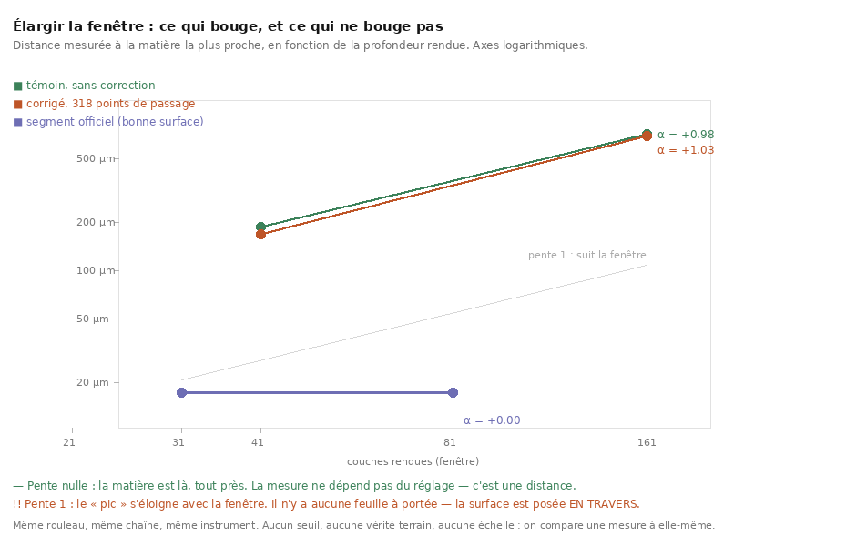
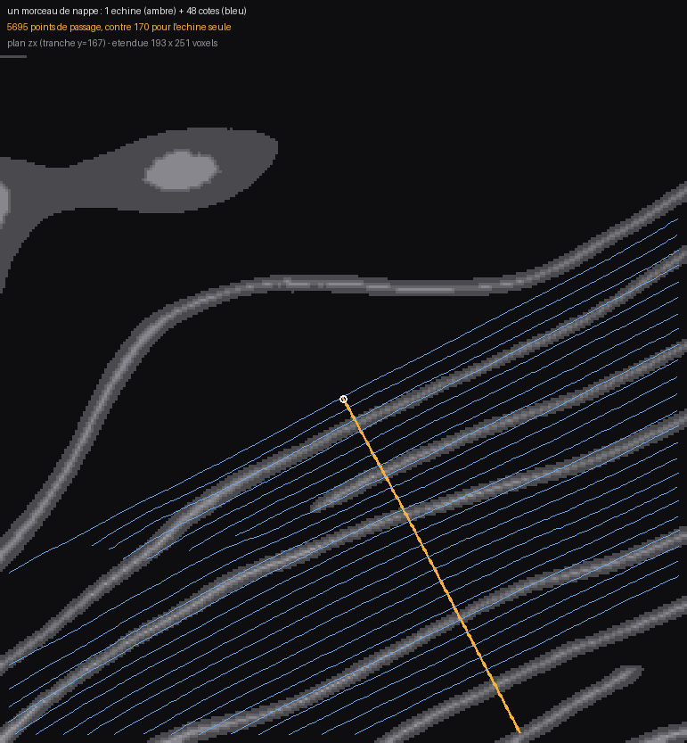

# La boucle de correction tourne — et 318 points ne suffisent pas

2026-08-21. Reproductible : `./src/outils/lancer.sh --fond src/outils/boucle_de_correction.sh`.
Verdicts : `docs/mesures/boucle_temoin.json`, `docs/mesures/boucle_corrige_gen5.json`.

---

## 1. Ce qui est fait pour la première fois

Les maillons de [`39`](39_le_seam_de_correction.md) existaient séparément. Ils sont
désormais **bout à bout** :

```sh
tracer → marcher la prédiction → écrire les points → --resume --rewind-gen --correct → juger
```

Et le seam **fonctionne mécaniquement** : la reprise corrigée lit le fichier, en tient
compte, et produit une surface différente. Ce n'est pas rien — c'était l'inconnue de `39`.

## 2. Le résultat, apparié

Témoin et corrigé partagent graine (`5842 5839 7386`), volume, paramètres et générations.
**Seuls les points de passage diffèrent.**

| | aire | auto-intersections | écart 41 c | écart 161 c | **α** |
|---|---:|---:|---:|---:|---:|
| témoin | 19,82 cm² | **0** | 187,2 µm | 711,5 µm | **+0,98** |
| corrigé, 318 points | 20,65 cm² | **11 753** | 168,5 µm | 692,8 µm | **+1,03** |
| *segment officiel* | — | — | *17,3 µm* | *17,3 µm* | ***+0,00*** |



⚠⚠ **La correction a changé la trace et n'a pas changé sa nature.** L'aire bouge, les
auto-intersections passent de 0 à 11 753, les écarts baissent d'une dizaine de pour cent —
et **α reste à 1**. La surface suit toujours la fenêtre de rendu : elle est encore posée en
travers de l'empilement.

## 3. Pourquoi — et c'est un rapport de forces, pas un bug

**318 points de passage contre 56 630 points de grille.** Mesuré des deux côtés
(`correction.json` d'une part, la dernière ligne `-> done N` du journal de trace de l'autre) :
la correction porte sur **0,56 %** de la surface, avec un `correction_weight` qui vaut
**1,0 par défaut** — le même ordre que `DIST`, qui s'applique partout.

> Une correction de 318 points est un **coup de pouce local**, pas une réorientation.

⭐ Et ça désigne **deux** leviers sans avoir à deviner, tous deux ajoutés à
`src/outils/boucle_de_correction.sh` :

1. **`correction_weight`** (`POIDS`, défaut `1 100`) — une clé JSON que `applyJsonWeights`
   accepte (`GrowPatch.cpp:1311`) et qui n'avait jamais été réglée ici — ⭐ **elle l'est depuis** : le §3bis la balaye (poids 1 et poids 100) et le §7 conclut qu'elle est réglée ;
2. ⭐⭐ **plus de points** (`SEMIS`, défaut `ligne nappe`). `suivre_nappe.py` gagne un mode
   `--nappe` : une **échine et ses côtes**, chaque côte marchant dans la direction tangente
   perpendiculaire (le produit vectoriel de la normale locale et de la direction d'échine,
   donc encore dans le plan de la nappe). Mesuré sur `PHerc0358`, au même point de départ :

| semis | points | collections | part des 56 630 points de grille |
|---|---:|---:|---:|
| ligne (`--deux-sens`) | 318 | 1 | **0,56 %** |
| **nappe** (échine + 48 côtes) | **5 695** | 49 | **10,1 %** |

⚠ Chaque côte est sa **propre collection**, pas la suite de la précédente :
`PointCorrection` traite une collection comme un chemin et ancre sur son premier point, donc
concaténer les côtes ferait un chemin qui saute d'un bord à l'autre à chaque rangée.



⚠ Et la couverture est **vérifiée**, pas supposée : sur un cylindre de contrôle, tous les
points restent à moins de 0,32 voxel de la nappe, et les côtes explorent 89 voxels le long
de l'axe que l'échine ne parcourt pas (0,0). Une « couverture 2D » qui recopierait l'échine
serait une ligne épaissie.

### ⚠⚠ Un seuil juste dans une unité, faux dans l'autre — trouvé par la figure

Sur l'image ci-dessus, les côtes ont l'air de **couper les nappes en diagonale**, comme un
peigne. Vérifié plutôt que cru — les chemins voyagent surtout dans le troisième axe, donc la
projection ment encore, exactement comme dans [`41`](41_marcher_le_long_dune_nappe.md) §6bis.
Mais la mesure a trouvé **autre chose** :

| plancher de valeur | côtes traversant un vide | minimum des minima |
|---|---:|---:|
| `0,15` (calibré pour une probabilité) | **4 sur 48** | 0,15 |
| **`1,0` (un voxel de matière)** | **0 sur 48** | **1,01** |

`valeur_min = 0,15` avait été réglé pour une prédiction ramenée dans `[0, 1]`, où il veut
dire « il y a un peu de matière ». Sur une **transformée de distance en voxels**, il veut
dire « je suis à un sixième de voxel du vide » — c'est-à-dire **collée au bord**. La marche
traversait donc des filaments au lieu de s'arrêter, et quatre côtes sur quarante-huit
partaient sur la nappe voisine.

⭐ `plancher_pour(bloc)` choisit désormais le plancher d'après les **unités du champ** (au-delà
de 1,5 de crête, c'est une distance, pas une probabilité). Coût de la correction : 12 points
sur 5 707. Même famille que la borne de lag choisie pour la commodité — **un seuil est
attaché à une unité, et changer le champ change l'unité.**

## 3bis. Le balayage, à mesure — et le poids fort n'est pas le remède

| variante | aire | croisements | 41 c | 161 c | **α** |
|---|---:|---:|---:|---:|---:|
| témoin | 19,8 cm² | 0 | 187,2 µm | 711,5 µm | +0,98 |
| ligne, gen 5, poids 1 | 20,7 cm² | 11 753 | 168,5 µm | 692,8 µm | +1,03 |
| ligne, gen 5, **poids 100** | **204,2 cm²** | 2 766 | 177,9 µm | 655,3 µm | +0,95 |
| **ligne, gen 40, poids 1** | 20,7 cm² | **18** | **154,5 µm** | **519,6 µm** | **+0,89** |

⚠⚠ **Le poids fort n'achète presque rien, et il coûte cher.** α passe de 0,98 à 0,95 —
dans le bruit de ce que deux fenêtres permettent d'affirmer — pendant que la surface passe
de 19,8 à **204 cm²**, soit dix fois plus. Le rendu qui en découle fait 17 601 × 17 181 et son
profil de profondeur demande plus de vingt minutes. `correction_weight` ne pousse pas la
surface vers la bonne feuille : il la fait **s'étendre**.

⚠ Et une réserve de méthode qu'il faut poser : comparer un écart **médian** mesuré sur
204 cm² à un écart médian mesuré sur 19,8 cm² n'est pas un contrôle apparié au sens strict.
Les deux surfaces n'échantillonnent pas la même part du rouleau. Le rapport α reste
sans dimension et comparable — c'est même pour ça qu'il a été choisi — mais les µm bruts, non.

⚠⚠ **Correction du 2026-08-22 : « le meilleur résultat » n'est pas défendable, et ce
document se contredisait.** Deux paragraphes plus haut il note qu'un écart de 0,03 est
« dans le bruit de ce que deux fenêtres permettent d'affirmer » — puis il classait quatre
valeurs séparées par **0,09 au plus**. Un écart sous la résolution ne range rien.

L'audit de [`49`](49_alpha_ne_separe_pas_deux_pannes.md) ajoute une seconde couche, et elle
est plus dure : les **quatre** séries de cette page sont **non discriminantes de leur
plafond**.

| série | α mesuré | α si tout était au bord |
|---|---:|---:|
| `témoin` | +0,976 | +1,014 |
| `corrigé gen5` | +1,034 | +1,014 |
| `corrigé gen5 poids 100` | +0,953 | +1,014 |
| `corrigé gen40` | +0,887 | +1,014 |

> ⚠ Aucune des quatre ne peut dire si son pic reculait ou s'il n'y en avait pas. Ce qui
> tient, et qui suffit à la conclusion de cette page : **les quatre sont condamnées**. Ce
> qui ne tient pas : les ordonner entre elles.

⚠ `--rewind-gen 40` à poids 1 garde un intérêt **pour une autre raison, mesurée** : son
écart à 161 couches baisse de 27 % et sa surface ne fuit pas. Rembobiner **moins** dérange
moins — c'est un constat sur le coût et l'étendue, pas un classement de convergence.

⚠⚠ **Et le poids fort fait FUIR la surface — mesuré, puis la cellule a été arrêtée.**
`correction_weight: 100` donne **204 cm²** à `--rewind-gen 5` et **3 603 cm²** à
`--rewind-gen 40`, soit **182 fois** le témoin. Son rendu à 41 couches pèse **8,9 Go** et
celui à 161 en aurait pesé une trentaine.

La cellule a été interrompue **délibérément**, et la raison n'est pas le coût : un écart
médian mesuré sur 3 603 cm² et un mesuré sur 19,8 cm² **n'échantillonnent pas le même
rouleau**. Le chiffre obtenu (140,4 µm à 41 couches, le plus bas de toutes les variantes)
serait le plus flatteur du tableau et le moins interprétable — exactement le genre de
résultat que ce dépôt existe pour ne pas publier.

> Ce qu'on retient du levier `correction_weight` : il ne réorienté pas la surface, **il la
> laisse s'étendre**. Plus le poids monte, plus elle fuit.

⚠⚠ **Et aucune variante ne s'approche de +0,00.** La meilleure est à 0,89 ; le segment
officiel est à 0,00. **Le seam de correction, à tous les réglages essayés, ne transforme pas
une coupe radiale en suiveuse de feuille.**

### Ce que ce plateau désigne

`--rewind-gen N` **garde les N premières générations**, et celles-là ont été poussées par
l'objectif **non contraint** — donc ce sont déjà un morceau de coupe radiale. Aucune
correction appliquée ensuite ne peut les faire pivoter : `DIST` et `STRAIGHT` s'y opposent.

> Si l'orientation se décide dans les premières générations, alors la correction doit y être
> **avant elles**, et elle doit porter une information à **deux dimensions** — un fil ne
> définit pas une orientation de surface.

D'où la cellule que le balayage teste ensuite, et elle n'est pas choisie au hasard :
**`--rewind-gen 1` avec le semis `nappe`** (5 695 points, 49 collections). C'est le plus petit
reste de trace non contrainte, et la plus grande quantité d'information 2D qu'on sache
produire.

## 4. ⚠ Ce que ce résultat retire à une hypothèse séduisante

[`38`](38_ce_qui_bouge_avec_la_fenetre.md) posait qu'une coupe radiale **ne peut pas** se
croiser elle-même, et donc que nos traces propres étaient peut-être les mauvaises. Ici, une
trace passe de **0 à 11 753 auto-intersections** et son α **ne s'améliore pas** (+0,98 →
+1,03).

⚠ Beaucoup de croisements n'est donc **ni** un symptôme de bon suivi **ni** son contraire :
c'est une propriété indépendante. L'hypothèse qui inverse perd son dernier appui indirect —
il restait `essai_ng2` (α = +0,65 avec 112 139 croisements), et un seul point ne fait pas
une tendance.

## 5. Ce que ça ne dit pas

- **Que les points de passage soient faux.** [`41`](41_marcher_le_long_dune_nappe.md) mesure
  que la marche suit une nappe sur ≈ 2,4 mm **sans traverser un seul vide**. Ce sont des
  points sur une feuille ; ils sont simplement trop peu nombreux et trop peu pondérés.
- **Que `--rewind-gen 5` soit le bon rembobinage** — et la mesure penche déjà dans l'autre
  sens. Rembobiner **moins** dérange moins et fait mieux :

| | croisements | écart 41 c | écart 161 c | **α** |
|---|---:|---:|---:|---:|
| témoin | 0 | 187,2 µm | 711,5 µm | +0,98 |
| corrigé, `--rewind-gen 5` | 11 753 | 168,5 µm | 692,8 µm | +1,03 |
| corrigé, **`--rewind-gen 40`** | **18** | **154,5 µm** | **519,6 µm** | **+0,89** |

  ⚠ α passe de 0,98 à 0,89 et l'écart à 161 couches baisse de **27 %** — le plus grand
  mouvement qu'un levier ait produit ici. Mais deux fenêtres et 0,09 d'écart en α, ça ne
  fait pas une tendance : à confirmer par le balayage, pas à annoncer. ⚠⚠ **Confirmé par la négative** → [`49`](49_alpha_ne_separe_pas_deux_pannes.md) : les quatre séries sont indiscernables de leur propre plafond, donc aucune tendance ne peut y être lue.
- **Que la cause soit trouvée.** ⭐ **Les trois leviers ont été allumés et mesurés** → [`26`](26_le_champ_de_direction.md) §9bis (`sdt_weight` 1 et 10, fibres h+v, sdt+fibres). ~~Trois leviers de données restent éteints chez nous~~
  (`41` §6ter), et un quatrième existe dont je ne sais pas dire s'il tire.

---

## 6. ⭐⭐⭐ La sortie par le haut : un mode public que ce dépôt n'avait jamais lancé

Puisque redresser une trace mal orientée plafonne, autant **ne pas partir d'une trace mal
orientée**. En cherchant dans la source ce que `mode` accepte, il y a quatre valeurs —
`seed`, `resume`, `expansion` et **`gen_neighbor`** — et la dernière n'a jamais été lancée ici.

`gen_neighbor` (`apps/src/vc_grow_seg_from_seed.cpp:625`) prend une surface par `--resume`,
tire un rayon depuis **chaque sommet** le long de la normale (`neighbor_dir` = `in` ou `out`),
avance par pas de `neighbor_step` voxels, et s'arrête dès qu'il touche de la matière au-dessus
de `neighbor_threshold`. Autrement dit : **il construit la spire voisine**. C'est le
*« wrap by wrap copy tool »* que le papier de juin 2026 décrit, et il est public.

⭐ Et il n'a rien à redresser : on part d'un **segment officiel dont la convergence est déjà
mesurée** (α = +0,00 sur `PHerc1447`, 2,89 cm²). La question devient donc exactement celle du
graal :

> **La convergence survit-elle à l'enchaînement, et sur combien de spires ?**

`src/outils/spire_suivante.sh` la pose : spire 0 = le segment officiel **rejugé par notre chaîne**
(et non son chiffre repris — sinon un écart entre la spire 0 et la spire 1 mélangerait la
surface et le chemin de mesure), puis N spires générées, chacune jugée dans les **mêmes
fenêtres** (31 et 81, celles où l'officiel a été mesuré).

⚠ Un échec à une spire est un **résultat** — « la chaîne casse au tour k » — et pas une panne
du script : on ne peut pas générer la voisine d'une surface qui n'existe pas, donc la boucle
s'arrête là en le disant.

⚠ ~~**Rien de tout ça n'est encore mesuré.**~~ ⭐ **Mesuré depuis** → [`43`](43_la_chaine_des_spires.md) : la campagne `spire_suivante.sh` a tourné. La campagne était en file derrière le balayage de
correction ; ce paragraphe dit ce qui va être tenté et pourquoi, pas ce qui a marché.

## 7. ⭐⭐ Relu à travers une fenêtre VALIDE — la conclusion tient, sa preuve ne tenait pas

Tout ce qui précède a été mesuré sur des fenêtres de profondeur de **41 et 161 couches**.
Pour PHerc0358, dont le pas inter-feuilles vaut **187,2 µm** à 9,362 µm par voxel, cela
fait **2,05** et **8,05 pas** — et au-delà d'un pas, la fenêtre contient plusieurs feuilles,
donc l'argmax désigne celle qui se trouve être la plus brillante (`20` §9). **Aucun des α
de ce document n'était interprétable.**

⭐ Le relire ne coûte rien : `depth_profile --from-layer/--to-layer` restreint un rendu
**déjà sur disque**. Les 19 couches centrales du rendu de 41 font 0,95 pas — deux minutes
de calcul contre plusieurs heures de re-rendu, au même niveau de preuve.

| variante | pic médian | **tiers central** | au bord |
|---|---:|---:|---:|
| **témoin** | 15 | **22 %** | **43 %** |
| corrigé, gen 5 | 17 | 8 % | 76 % |
| corrigé, gen 40 | 13 | 18 % | 49 % |
| corrigé, gen 5, **poids 100** | 19 | 8 % | 55 % |
| corrigé sur nappe, gen 1, poids 100 | ⚠ **rendu 7061 × 261** — une lanière de 13 cellules, trop étroite pour une fenêtre | | |

> ⭐⭐ **Le témoin bat toutes les corrections, à tous les poids.** La conclusion du §3 —
> *« la correction change la trace et pas sa nature »* — **survit à une mesure valide**,
> ce qui n'allait pas de soi : elle reposait jusqu'ici sur des chiffres qu'on ne pouvait
> pas lire.
>
> ⭐ **Et `correction_weight` est réglé** : le §3 le désignait comme « le levier suivant,
> jamais réglé ». Poids 1 et poids 100 donnent le **même** 8 % au tiers central. Il ne
> manquait donc pas un réglage.

⚠⚠ **Une fausse piste, notée parce qu'elle est instructive.** À 41 couches, le témoin
rapporte **187,24 µm**, soit **exactement 20 couches = la demi-fenêtre** — donc une valeur
**censurée** — pendant que les corrigés rendent 154 et 168, qui sont *dedans*. On y lit
volontiers que la correction a ramené le pic à l'intérieur et que le verdict « suit la
fenêtre » l'a masqué. **La mesure le réfute** : dans une fenêtre valide, c'est le témoin
qui a le plus de fenêtres au tiers central. La saturation du témoin à 41 couches tombait
sur une **feuille voisine**, ce qui ne dit rien du mérite de personne.

## Reproduire

```bash
./src/outils/lancer.sh --fond src/outils/boucle_de_correction.sh      # la boucle entière, appariée

# la figure, depuis les verdicts eux-mêmes — jamais des nombres recopiés
(uv run python src/commun/test_convergence.py \
  --serie "31:17.28,81:17.30" --nom "segment officiel (bonne surface)" \
  --depuis "docs/mesures/boucle_temoin.json=témoin, sans correction" \
  --depuis "docs/mesures/boucle_corrige_gen5.json=corrigé, 318 points de passage" \
  --json docs/mesures/boucle_convergence.json)
uv run python src/figures/figure_convergence.py \
  --entree docs/mesures/boucle_convergence.json --sortie docs/images/42_boucle_convergence.png
```
