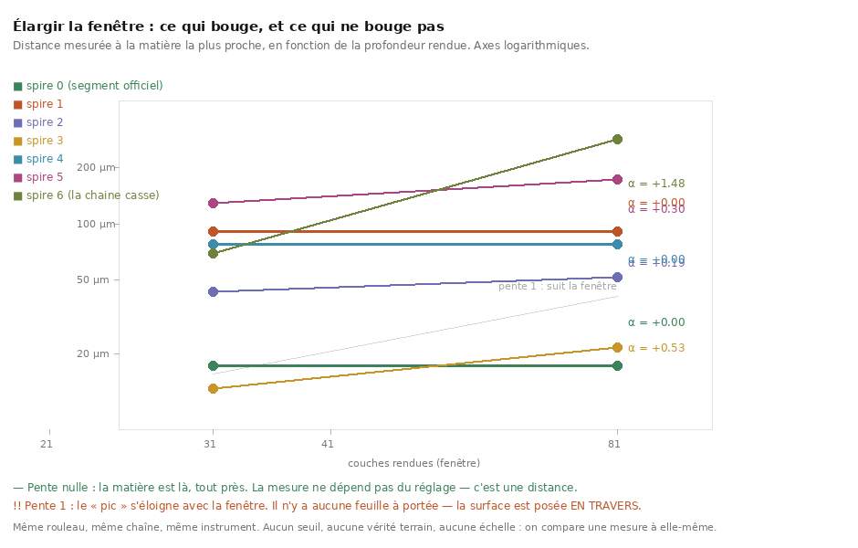
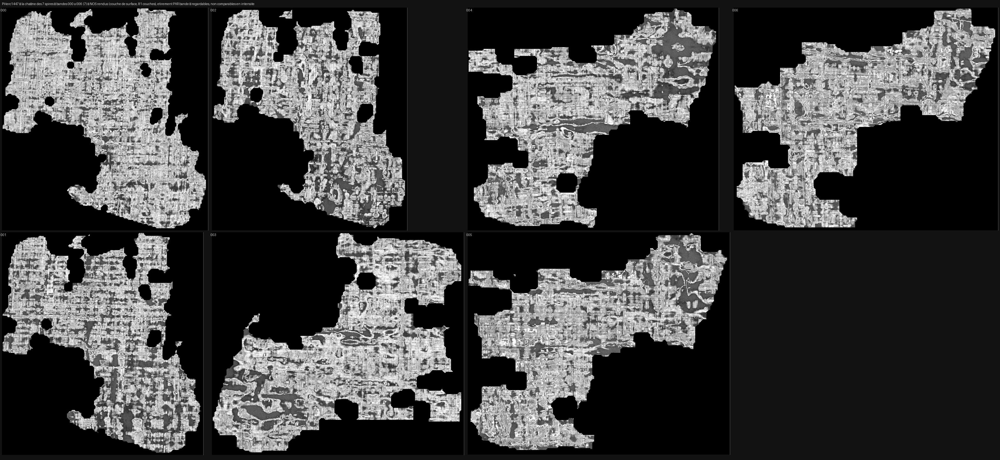
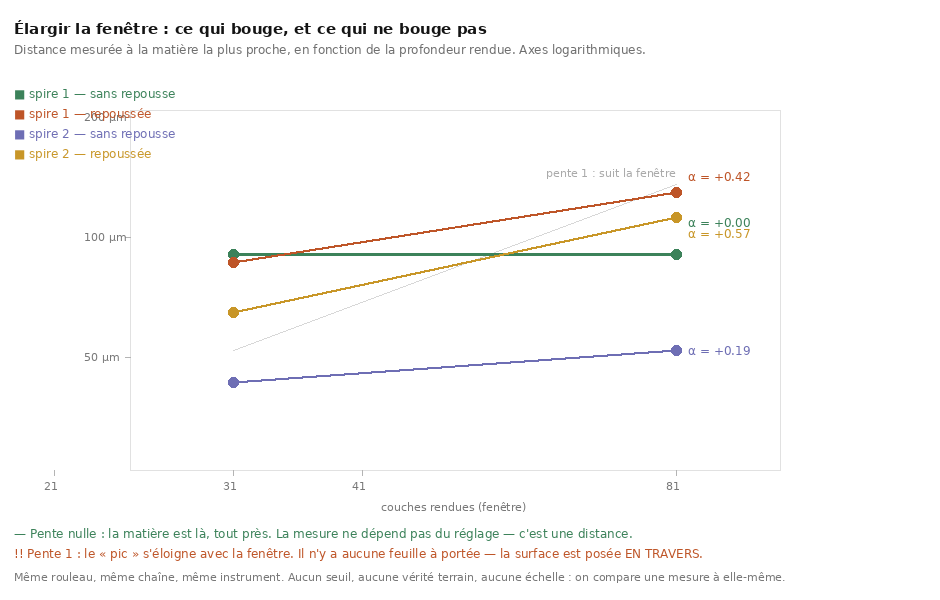
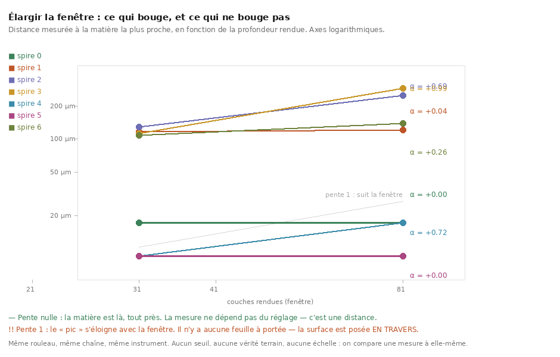
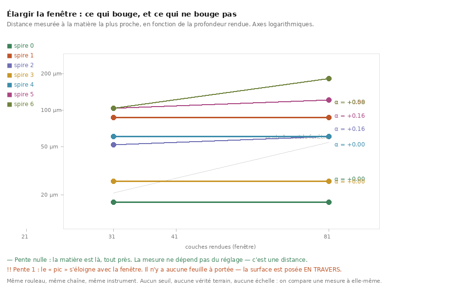
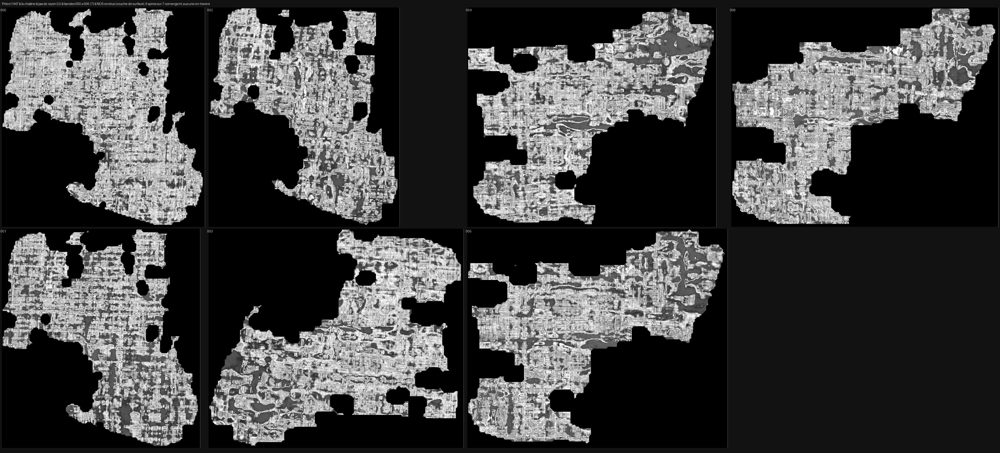
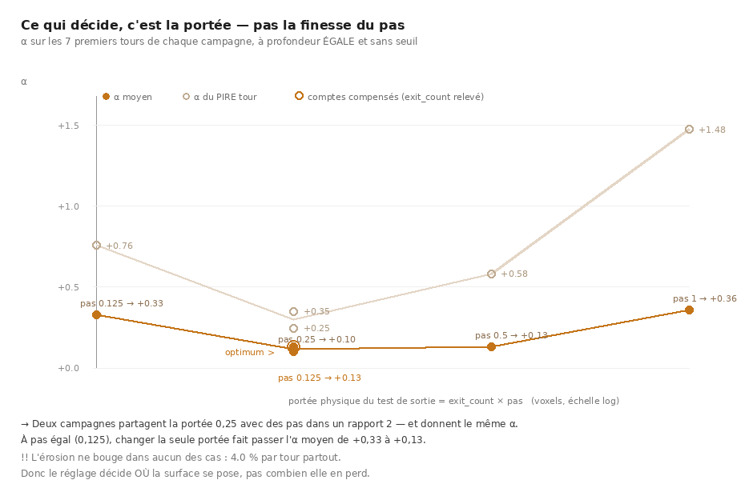

# La chaîne des spires : six tours tiennent, le septième casse

2026-08-21. Reproductible : `./src/outils/lancer.sh --fond src/outils/spire_suivante.sh`.
Dépouillement : `src/tables/table_chaine.py` (7 témoins).
Verdicts : `docs/spire_spire0*.json`, table : `docs/mesures/chaine_spires.json`.

---

## 1. Le résultat

Un segment officiel qui **converge**, puis six spires générées par `mode: gen_neighbor`,
chacune servant de source à la suivante. Toutes jugées dans les **mêmes fenêtres** (31 et
81 couches) par la **même chaîne**.



| spire | grille | aire* | 31 c | 81 c | **α** | verdict |
|---|---|---:|---:|---:|---:|---|
| **00** (officiel) | 162×149 | 7,12 cm² | 17,28 µm | 17,28 µm | **+0,000** | **converge** |
| 01 | 157×145 | 6,71 cm² | 90,72 µm | 90,72 µm | **+0,000** | **converge** |
| 02 | 153×141 | 6,35 cm² | 43,20 µm | 51,84 µm | +0,190 | **converge** |
| 03 | 150×139 | 6,14 cm² | 12,96 µm | 21,60 µm | +0,532 | intermédiaire |
| 04 | 147×136 | 5,89 cm² | 77,76 µm | 77,76 µm | **+0,000** | **converge** |
| 05 | 144×133 | 5,64 cm² | 129,60 µm | 172,80 µm | +0,300 | intermédiaire |
| **06** | 141×130 | 5,39 cm² | 69,12 µm | **285,12 µm** | **+1,475** | ⚠⚠ **suit la fenêtre** |

\* aire de la **grille**, sommets invalides compris — un majorant, pas la surface utile.

**4 spires sur 7 convergent, 2 sont intermédiaires, et la 7ᵉ casse.**

⭐⭐⭐ Et c'est la première fois de tout ce dépôt qu'une surface **que nous avons produite**
converge. Toutes les traces poussées en `mode: seed` — dix-sept essais, quatre rembobinages
corrigés, deux semis, deux poids — sont à α ≈ 1 sans exception
([`42`](42_la_boucle_tourne_et_ne_suffit_pas.md)). Ici six surfaces d'affilée ne le sont pas.

## 1bis. ⭐⭐⭐ Et ça se VOIT — les sept spires, rendues



Chaque bande est la **couche de surface** (40 sur 81) du rendu de cette spire, étirée entre
ses percentiles 1 et 99. ⚠ L'étirement est **par bande** : c'est le bon choix pour regarder
(chaque spire a son exposition) et le mauvais pour mesurer — **aucune mesure de ce dépôt ne
passe par ces images**.

La dégradation est **visible, et elle suit les chiffres** :

| bandes | ce qu'on voit | α |
|---|---|---|
| **000, 001** | treillis de fibres croisées partout, trous nets aux bords | +0,000 |
| **002, 003** | le treillis tient, mais des plages grises lisses apparaissent | +0,190 / +0,532 |
| **004, 005, 006** | les plages grises gagnent, avec des volutes — la surface quitte la feuille | +0,000 / +0,300 / **+1,475** |

⭐ Et l'érosion se voit aussi : l'empreinte rétrécit de bande en bande, exactement comme la
grille (7,12 → 5,39 cm²).

⚠ **Ce que ces images ne montrent pas : de l'encre.** Ce sont des rendus de matière, pas des
cartes d'encre. Voir du papyrus prouve qu'on est **sur** une feuille ; lire du texte
demanderait un détecteur, et [`36`](36_lorigine_de_la_pile.md) §5bis mesure que le modèle de
2023 sort une constante sur ce rouleau.

## 2. ⚠ Ce que « converge » dit et ne dit pas

**α mesure s'il y a une feuille à portée, pas si c'est la bonne.** La spire 01 converge ⭐ **MESURÉ** → [`44`](44_ou_la_chaine_se_trouve.md) §4 : l'écart entre nappes vaut **113 µm**, donc la chaîne sait de quelle spire elle parle.
parfaitement (α = +0,000) à **90,72 µm** — pas à 17. Elle a donc trouvé de la matière stable,
mais rien ne dit que c'est la spire immédiatement voisine plutôt qu'une plus loin, ni que le
rayon tiré a franchi un seul interstice.

⚠ Et les écarts n'ont **aucune tendance** : 17,3 → 90,7 → 43,2 → 13,0 → 77,8 → 129,6 → 69,1.
Ça oscille. Un enchaînement qui dériverait régulièrement donnerait une suite monotone ; celui-ci
tombe bien ou mal selon le tour, et la spire 03 a même l'écart **le plus petit du tableau**
(12,96 µm, mieux que l'officiel).

⚠ **α sur deux fenêtres seulement.** Un écart de ±0,2 n'est pas interprétable, donc les deux
« intermédiaires » ne sont pas un diagnostic. Ce qui est solide, c'est la séparation entre
0,00–0,53 d'un côté et **1,475** de l'autre : la 7ᵉ est ailleurs, pas un peu plus loin.

## 3. ⭐⭐ L'érosion, mesurée : la chaîne a une longueur maximale

La grille rétrécit à **chaque** tour, et régulièrement : 162×149 → 141×130, soit
**7,12 → 5,39 cm² en six tours = 24 %, ou 4,0 % par tour**.

> À ce rythme, **la moitié de la surface est perdue en douze tours**.

Ce n'est donc pas la qualité qui borne la chaîne en premier, c'est la **taille** : chaque
spire est le rayon-cast de la précédente, et les sommets qui ne trouvent rien sont perdus
définitivement. `neighbor_fill` est déjà à `true` ; ce qui manque est une repousse — c'est-à-dire ⚠⚠ **MESURÉE et CONTRE-PRODUCTIVE** → §6 du même document : la surface regagnée n'est pas sur la feuille.
exactement ce que `mode: seed` sait faire et que cette chaîne n'utilise pas.

## 4. ⚠⚠ Et le verdict d'auto-intersection de ces spires ne mesure rien

`vc_tifxyz_selfcross` rapporte `clean_of_transverse_self_intersection: true` et
`report_only: true` sur les sept — **sans `pairs_tested`, sans compte de croisements**. Notre
lecteur ([`34`](34_un_verdict_qui_ne_mesure_rien.md)) **refuse** de rendre un nombre dans ce
cas, d'où les `?` de la table. C'est le même défaut que `34` documente, sous une autre forme :
là c'était `--maxedge` qui jetait tous les quads, ici c'est le mode `report_only` qui omet les
comptes. Un portail bâti sur `clean` accepterait ces sept surfaces sans avoir rien testé.

## 5. Ce que la campagne refuse de faire

⚠ **Elle refuse de partir d'une surface qui ne converge pas.** La spire 0 est jugée, son
verdict est **lu dans le JSON**, et la campagne sort en le nommant si ce n'est pas
« converge » — parce qu'enchaîner depuis une surface posée en travers mesurerait la
**propagation d'un défaut**, et que le résultat aurait l'air d'un résultat.

⚠ Ce garde a servi le jour même : le premier lancement partait de
`data/trace/PHerc1447_officiel/`, choisi **parce que son nom disait « officiel· »** — et ce
segment-là est à α = +1,02 avec 72–78 % de pics au bord ([`36`](36_lorigine_de_la_pile.md)).
Le nom d'un répertoire n'est pas une mesure.

## 6. ⭐⭐ La repousse : la surface regagnée n'est pas sur la feuille

L'érosion de 4 % par tour vient de ce qu'un sommet dont le rayon ne trouve rien est perdu
**définitivement**. `mode: resume` sait faire repousser une surface — d'où le pari, posé
avant de le lancer : *ça peut aussi la tirer hors de sa feuille, parce que c'est le traceur
non contraint qui repousse.*

Comparaison **appariée** — même surface de départ, même sens, mêmes fenêtres, même nombre de
spires ; **seule la repousse change** :



| | 31 c | 81 c | **α** | verdict |
|---|---:|---:|---:|---|
| **spire 01** sans repousse | 90,72 µm | 90,72 µm | **+0,000** | **converge** |
| **spire 01** repoussée (20 gén.) | 86,40 µm | 129,60 µm | **+0,422** | intermédiaire |
| **spire 02** sans repousse | 43,20 µm | 51,84 µm | **+0,190** | **converge** |
| **spire 02** repoussée | 64,80 µm | 112,32 µm | **+0,573** | intermédiaire |

Et la surface, sur la première paire : grille **157×145 → 212×200**, aire
**6,71 → 12,47 cm²**.

⭐ **La repousse marche, au sens où elle rend la surface** : la grille passe de 157×145 à
212×200, l'aire de 6,71 à 12,47 cm² — **près du double**, et bien au-delà de ce que l'érosion
avait pris.

⚠⚠ **Et elle dégrade la convergence** : α passe de +0,000 à +0,422. Le détail dit où : la
fenêtre 31 s'améliore un peu (90,72 → 86,40 µm) et la fenêtre 81 se dégrade nettement
(90,72 → 129,60). Ce n'est donc pas la surface entière qui s'abîme, c'est **la part regagnée
qui tire la mesure**.

> Ce qu'on apprend : **la surface qu'on récupère n'est pas sur la feuille.** L'érosion n'est
> pas un défaut à corriger, c'est le **prix** de rester dessus — au moins avec ce repousseur,
> qui est celui dont [`42`](42_la_boucle_tourne_et_ne_suffit_pas.md) montre qu'il produit des
> coupes radiales quand rien ne le contraint.

⭐⭐ **Et les trois mesures de la journée disent la même chose sous trois angles** :
`mode: seed` ne pose jamais la surface sur une feuille (17 essais, tous α ≈ 1) · les points
de correction ne réorienté pas ce qui a déjà poussé (`42`) · et faire repousser une bonne
surface la fait sortir de sa feuille (ici). **Ce qui garde une surface sur sa feuille, c'est
de ne pas la laisser croître librement.**

### ⭐⭐ Et à la troisième paire, la chaîne repoussée CASSE — deux fois plus tôt

| spire | base | repoussée | écart |
|---|---:|---:|---:|
| 00 (contrôle) | +0,000 | +0,000 | **0** |
| 01 | +0,000 | +0,422 | +0,42 |
| 02 | +0,190 | +0,573 | +0,38 |
| **03** | +0,532 | **+1,461** ⚠⚠ | **+0,93** |

La spire 03 repoussée fait **26,20 cm²** — quatre fois la spire 03 de base — avec **2 921
auto-intersections**, et son α la met franchement **en travers de l'empilement**.

> **La chaîne de base tient six tours ; la chaîne repoussée casse au troisième.** Faire
> repousser la matière perdue ne prolonge pas la chaîne : **ça la coupe en deux.**

⚠ Et la dégradation **accélère** : +0,42, +0,38, puis +0,93. Ce n'est pas un décalage
constant qu'on pourrait compenser, c'est une dérive qui se nourrit d'elle-même — chaque
repousse part d'une surface déjà un peu plus en travers que la précédente.

⚠ Trois paires, un contrôle à écart nul, et une rupture franche.

⚠⚠ **La campagne a été arrêtée au tour 4, délibérément**, et la raison est écrite dans
`data/spires_repousse/ABANDONNE` : les spires 04 à 06 ne mesureraient que **de combien
empire une chaîne déjà cassée**, et elles coûtent cher — la repousse fait grossir les
surfaces (26,20 cm² au tour 3 contre 6,14 sans repousse), donc chaque rendu est plus lent.
Une chaîne qui casse au troisième tour ne se rattrape pas au cinquième, et la machine était
mieux employée sur la question encore ouverte (le sens `in`).

⚠ La spire 00 est **identique** dans les deux campagnes (+0,000 des deux côtés), ce qui est
le contrôle : c'est la même surface de départ, réellement partagée, donc l'écart des paires
suivantes vient bien de la repousse et pas du hasard de deux exécutions.

⭐ La suite naturelle n'est donc pas « repousser plus » mais **repousser sous contrainte** :
les points de passage de [`41`](41_marcher_le_long_dune_nappe.md) existent, `correction_weight`
existe, et une repousse corrigée est la seule combinaison des deux qui n'ait pas été essayée.

---

## 6bis. ⭐⭐ Le sens `in` : ni meilleur, ni pire — et c'est la découverte

Vers l'intérieur les spires se serrent, donc le rayon a moins de chemin à faire. L'attente
était une chaîne plus solide. Mesuré, sur les **sept** tours, à conception appariée :

| spire | `out` | `in` |
|---|---:|---:|
| 00 (contrôle) | +0,000 | +0,000 |
| 01 | +0,000 | **+0,038** |
| 02 | +0,190 | +0,686 |
| 03 | +0,532 | +0,986 |
| 04 | +0,000 | +0,722 |
| 05 | +0,300 | **+0,000** |
| 06 | **+1,475** | +0,257 |



⚠ **Aucun des deux sens ne gagne.** `in` se dégrade plus vite au début (02 et 03 nettement
pires) puis **se rétablit** — la spire 05 est un +0,000 parfait après deux mauvais tours —
là où `out` tient longtemps puis casse net au 06.

⭐⭐ Et c'est ça, la découverte : **α oscille dans les deux sens.** Un tour parfait arrive
après deux mauvais. Ça contredit la lecture naturelle — « l'erreur s'accumule, la chaîne a
une longueur maximale » — et ça ouvre une lecture bien plus utile : **chaque tour joue sa
propre partie**, et un mauvais tour ne condamnerait pas la suite.

### ⚠⚠ Alors on l'a mesuré au lieu de le croire

`src/graine/derive_ou_loterie.py` (11 témoins) teste la corrélation de rang au **décalage
1** entre α(tour N) et α(tour N+1), sur les **12 paires** des deux chaînes cumulées — sans
jamais recoller la fin d'une chaîne au début de l'autre.

| | |
|---|---:|
| ρ au décalage 1 | **+0,299** |
| p (permutation) | **0,344** |
| puissance à ρ = 0,7 | 68 % |
| **puissance à l'effet observé (ρ = 0,30)** | **15 %** |

> **Verdict : pas de dérive FORTE — une dérive de cette ampleur aurait été vue. Une dérive
> modérée, non.**

⚠ **Et la première version de ce verdict était trop généreuse** : elle concluait « loterie »
dès que la puissance à ρ = 0,7 dépassait 50 %. Ne pas voir une dérive *forte* ne dit rien
d'une dérive *modérée* — et le ρ observé valait justement 0,3, où le test n'a que **15 %** de
chances de voir quoi que ce soit. Le verdict ne peut exclure que ce que le test aurait su
voir, et il le dit maintenant.

⭐ Ce qui reste actionnable malgré l'indécision : **juger chaque spire et rejouer les
mauvaises** vaut la peine d'être essayé. Si les tours étaient fortement enchaînés, ça ne
servirait à rien — et c'est précisément ce que la mesure exclut.

## 6ter. ⚠⚠ Un juge à un seul rendu : mesuré AVANT de s'en servir, et il ne marche pas

Le test de convergence demande **deux** rendus, et un rendu est l'étape la plus chère de tout
le dépôt. Un juge à un seul rendu diviserait par deux le coût de toute campagne — et
permettrait d'essayer **plusieurs candidats par tour** là où on n'en essaie qu'un.

Le candidat naturel était `au_bord_relief`, déjà calculé : la part des fenêtres dont le pic
tombe **au bord** de la fenêtre rendue. C'est la forme locale de ce que α mesure globalement.
Vérifié sur les **18 spires** déjà jugées des deux façons :

| statistique d'UN rendu | ρ contre α | p |
|---|---:|---:|
| `au_bord_relief` | **+0,226** | 0,360 |
| écart médian à 31 couches | **+0,204** | 0,408 |

> **Aucune relation détectable. Le juge à un rendu n'existe pas.**

⭐ Et c'est précisément à ça que sert un contrôle posé **avant** : la campagne « essayer
plusieurs candidats par tour et garder le meilleur » allait être bâtie sur ce proxy. Chaque
sélection aurait été du bruit, et le résultat aurait ressemblé à une amélioration.

⚠ Réserve honnête : seules **3 des 18** spires sont condamnées par le vrai juge (α ≥ 0,75),
donc la puissance à décider si le proxy rate *spécifiquement* les cas durs est faible. Ce qui
est établi, c'est qu'il n'y a pas de relation d'ensemble — ce qui suffit à ne pas s'en servir.

⚠ Conséquence pratique : essayer K candidats par tour coûte **2K rendus**. C'est ce prix-là
ou rien.

## 6quater. ⭐⭐⭐ Le pas du rayon : LE levier — et ma conclusion provisoire était fausse

`gen_neighbor` arrête son rayon au **premier** échantillon au-dessus du seuil, par pas de
`neighbor_step` voxels. Un pas plus fin localise donc la nappe plus précisément.

⚠⚠ **Après trois tours, j'avais écrit que ça ne changeait rien.** Les spires 00, 01 et 02
étaient identiques à 0,03 près, et j'en ai conclu — en le publiant — que « les tours qui
ratent ne ratent pas par manque de résolution ». **C'était faux, et la campagne complète le
montre** : la différence apparaît exactement là où la chaîne de référence commence à céder.

| spire | pas 1,0 | **pas 0,5** | `in` |
|---|---:|---:|---:|
| 00 (contrôle) | +0,000 | +0,000 | +0,000 |
| 01 | +0,000 | +0,000 | +0,038 |
| 02 | +0,190 | +0,160 | +0,686 |
| **03** | +0,532 *interm.* | **+0,000 converge** | +0,986 |
| 04 | +0,000 | +0,000 | +0,722 |
| **05** | +0,300 *interm.* | **+0,160 converge** | +0,000 |
| **06** | **+1,475 EN TRAVERS** | **+0,583** *interm.* | +0,257 |
| | **4/7 convergent, 1 casse** | ⭐ **6/7 convergent, 0 casse** | 3/7, 2 cassent |

> **Halver le pas du rayon fait passer la chaîne de 4 spires convergentes sur 7 à 6 sur 7,
> et supprime la rupture.** La spire 06, qui suivait la fenêtre à +1,475, tombe à +0,583.

⭐ **Et ça ne coûte rien en surface** : l'érosion reste à **4,0 % par tour** (7,12 → 5,43 cm²),
identique au pas 1,0. Le gain est gratuit — le rayon fait le même trajet, il l'échantillonne
seulement deux fois plus finement.

⚠ Ces 4,0 % portent sur l'aire de la **grille**, sommets invalides compris. Sur l'aire
réellement portée par de la matière, l'érosion est de **15,6 % par tour** —
[`44`](44_ou_la_chaine_se_trouve.md) §5.



Et ça se voit sur les rendus : le treillis de fibres tient sur **les sept** bandes, là où au
pas 1,0 les bandes 004 à 006 devenaient des plages grises lisses.



### ⚠⚠ La leçon de méthode, et elle est chère

**Les premiers tours d'une chaîne ne discriminent pas.** Trois tours identiques m'ont fait
publier « ce levier ne sert à rien » sur le levier qui s'est avéré être le meilleur de la
journée. Une chaîne ne se juge qu'**au tour où la référence cède** — avant ça, tous les
réglages se ressemblent parce qu'il n'y a encore rien à départager.

⚠ Corollaire pratique : une campagne d'enchaînement doit aller **jusqu'à la rupture de la
référence**, sinon elle mesure le début facile. Trois tours coûtent trois fois moins cher et
ne valent rien.

## 6quinquies. ⭐⭐⭐ Le pas du rayon a un OPTIMUM — et il n'est pas au bout

La leçon du §6quater a été appliquée : puisque halver le pas améliorait les sept tours
mesurés, les deux campagnes suivantes sont allées **au-delà** — pas 0,25 sur huit tours, pas
0,125 sur dix. La question était : « chaque halvage achète-t-il un tour ? »

**Non. Halver deux fois de trop annule le gain.**



À **profondeur égale** — les 7 premiers tours de chaque campagne, parce qu'une chaîne se
dégrade avec le rang et qu'un tableau à profondeurs inégales fait passer la profondeur pour
un effet du réglage ([`44`](44_ou_la_chaine_se_trouve.md) §8) :

| pas du rayon | longueur | **α moyen** | α médian | **α du pire tour** | érosion/tour |
|---|---:|---:|---:|---:|---:|
| 1,0 | 7 | +0,357 | +0,190 | **+1,475** | 4,0 % |
| 0,5 | 7 | +0,129 | +0,000 | +0,583 | 4,0 % |
| **0,25** | 9 | ⭐ **+0,102** | +0,095 | ⭐ **+0,246** | 4,0 % |
| 0,125 | 11 | +0,327 | +0,279 | +0,758 | 4,0 % |

⭐ **C'est une courbe en U, pas une amélioration monotone.** Trop grossier (1,0) et trop fin
(0,125) sont tous deux **trois fois pires** que l'optimum, et 0,125 est presque aussi mauvais
que 1,0 — sur un facteur **huit** de réglage.

⭐⭐ **Et la colonne qui compte est celle du pire tour**, parce que c'est lui qui casse une
chaîne : +1,475 → +0,583 → **+0,246** → +0,758. À pas 0,25, le plus mauvais des sept tours
est encore près de converger.

### Les α, tour par tour — des mesures, pas des étiquettes

| spire | pas 1,0 | pas 0,5 | **pas 0,25** | pas 0,125 | `in` |
|---|---|---|---|---|---|
| 00 | **+0,000** | **+0,000** | **+0,000** | **+0,000** | **+0,000** |
| 01 | **+0,000** | **+0,000** | **+0,000** | **+0,000** | +0,038 |
| 02 | +0,190 | +0,160 | +0,202 | +0,758 🎲 | +0,686 🎲 |
| 03 | +0,532 🎲 | **+0,000** | **+0,000** | **+0,000** | +0,986 |
| 04 | **+0,000** | **+0,000** | +0,174 | +0,722 🎲 | +0,722 🎲 |
| 05 | +0,300 | +0,160 | +0,095 | +0,532 🎲 | **+0,000** |
| 06 | +1,475 | +0,583 🎲 | +0,246 | +0,279 | +0,257 |
| 07 | — | — | +0,702 🎲 | +0,583 🎲 | — |
| 08 | — | — | +1,321 | +1,129 | — |
| 09 | — | — | — | +1,175 | — |
| 10 | — | — | — | +0,399 | — |

🎲 = α à moins de 0,2 du seuil de 0,7, donc une
étiquette de verdict y serait un tirage au sort ([`44`](44_ou_la_chaine_se_trouve.md) §8bis).
Les α eux-mêmes, en revanche, sont des mesures : c'est pour ça que ce tableau les donne et ne
donne aucun verdict.

⚠ La colonne `in` (sens de la normale vers l'intérieur) est là pour mémoire — §6bis mesure
qu'elle n'est ni meilleure ni pire, et deux de ses trois plus mauvais tours sont fragiles.

### ⚠⚠ Ce tableau ne compte AUCUN verdict, et c'est délibéré

Les α et les aires sont des grandeurs continues, mesurées directement. Un compte de verdicts
(« 4/7 », « 6/9 ») est un compte de **franchissements de seuil**, et le recensement de
[`44`](44_ou_la_chaine_se_trouve.md) §8bis en trouve **presque un quart** — dont le plus fragile de
tous, `pas025_spire07`, à **deux millièmes** de son seuil. ⚠ Le compte exact n'est pas répété
ici : il change à chaque campagne, et le recopier dans plusieurs documents l'a fait périmer
quatre fois dans la même journée.

⚠ **C'est ce qui a fait retirer la première version de cette section**, publiée le matin même :
elle annonçait « la rupture est repoussée du tour 06 au tour 07 » et reposait entièrement sur
ce verdict-là. Un lancer de pièce publié comme un résultat. Ce qui le remplace ci-dessus ne
passe par aucun seuil et dit une chose plus faible et plus solide.

### ⭐⭐⭐ Le mécanisme, trouvé dans la source : trois réglages comptent des PAS

Après avoir dit ci-dessus que le mécanisme était inconnu, je suis allé le chercher là où il
pouvait être écrit — dans `vc_grow_seg_from_seed.cpp`. Il y est, et il est arithmétique.

Le rayon ne s'arrête pas au premier échantillon au-dessus du seuil : il doit d'abord
**quitter** la nappe de départ. Le test de sortie (ligne 784) compte des échantillons
**consécutifs** sous le demi-seuil :

```cpp
if (v <= neighbor_exit_threshold) {
    below_counter += 1;
    if (below_counter >= neighbor_exit_count) { left_surface = true; }
} else { below_counter = 0; }
```

`neighbor_exit_count` vaut **1** par défaut. C'est un **compte de pas**, donc sa portée
physique est `exit_count × neighbor_step` :

| pas du rayon | portée du test de sortie |
|---:|---:|
| 1,0 | 1,0 voxel = 8,6 µm |
| 0,5 | 0,5 voxel = 4,3 µm |
| 0,25 | 0,25 voxel = 2,2 µm |
| **0,125** | **0,125 voxel = 1,1 µm** |

⚠⚠ **À pas fin, un seul échantillon sous-voxel interpolé sous le demi-seuil suffit pour
déclarer « j'ai quitté la nappe ».** Le rayon peut donc sortir puis rentrer dans **la même
feuille**, et se poser sur la face proche de sa nappe de départ au lieu de la suivante. Ça
prédit un écart entre nappes plus **court** — et c'est exactement ce que la mesure montre :
**116 → 109 → 107 → 102 µm** quand le pas est halvé trois fois
([`44`](44_ou_la_chaine_se_trouve.md) §4).

`neighbor_spike_window` (défaut 2) est le second : il alimente
`max_fold_iters = spike_window * 4` (ligne 879), donc encore un compte de pas.

⭐ **Et `neighbor_min_clearance` est le seul des trois exprimé en distance** — la source le
convertit correctement, `ceil(min_clearance / neighbor_step)` (ligne 677). L'auteur
connaissait donc le problème pour celui-là ; les deux autres sont restés des comptes.

⚠⚠ **Ce qui corrige ma phrase du paragraphe précédent** : j'y écrivais « le mécanisme de la
dégradation reste inconnu » et que mon hypothèse du rayon s'arrêtant trop tôt était
« réfutée ». Elle était **juste en direction** — la source prédit précisément le petit effet
monotone que j'avais mesuré puis écarté comme du bruit. C'était une réfutation trop rapide :
un effet réel mais petit ressemble exactement à du bruit, et seule la source a permis de
trancher.

### ⭐⭐⭐ La prédiction était falsifiable des deux côtés, et elle est CONFIRMÉE

Compenser les comptes pour garder une portée physique constante doit aplatir la courbe en U.
À pas 0,125, `exit_count = 2` redonne la portée du pas 0,25. Mesuré à profondeur égale, plus
une portée **0,375** qu'aucun pas ne peut produire (le pas seul ne donne que des puissances
de deux) :

| campagne | pas | **portée sortie** | portée pic | α moyen | α du pire tour | verdicts fragiles |
|---|---:|---:|---:|---:|---:|---:|
| défauts | 1,0 | 1,0 | 2,0 | +0,357 | +1,475 | 1/7 |
| défauts | 0,5 | 0,5 | 1,0 | +0,129 | +0,583 | 1/7 |
| défauts | 0,25 | 0,25 | 0,5 | **+0,102** | **+0,246** | 1/9 |
| défauts | 0,125 | 0,125 | 0,25 | +0,327 | +0,758 | **4/11** |
| `exit_count=2` | 0,125 | 0,25 | 0,5 | **+0,130** | +0,350 | ⭐ **0/10** |
| `exit_count=3` | 0,125 | 0,375 | 0,75 | +0,185 | +0,612 | 1/10 |
| `exit_count=2`, `spike=2` | 0,125 | 0,25 | **0,25** | **+0,130** | **+0,350** | 0/10 |

> **À pas égal, changer la seule portée fait passer l'α moyen de +0,327 à +0,130.** Et deux
> campagnes dont les pas diffèrent d'un facteur deux, mais qui partagent la portée 0,25,
> donnent le même α (+0,102 et +0,130).

⭐⭐ **Deux spires sont identiques au millième** entre la campagne compensée et celle du pas
0,25 : la 02 à +0,202 et la 06 à +0,246. Même volume, même chaîne, même portée — un pas deux
fois plus fin ne change rien dès que la portée est tenue.

⭐⭐⭐ **Donc ce n'est pas le pas qui décide, c'est la PORTÉE.** La courbe en U du paragraphe
précédent était l'ombre d'une courbe en U dans la portée, vue à travers un paramètre qui la
divise. Conséquence pratique : **le pas peut être affiné librement** — ce qui localise mieux
la nappe — à condition de relever `exit_count` du même facteur.


### ⚠⚠ Et ce n'est pas un optimum, c'est un BASSIN — correction de ma propre phrase

J'ai écrit ci-dessus, et publié, « le pas du rayon a un optimum à 0,25 ». **C'est trop
précis.** Quatre campagnes tiennent dans **une seule largeur de résolution** :

| portée sortie | α moyen |
|---:|---:|
| 0,25 | +0,102 |
| 0,5 | +0,129 |
| 0,25 *(pas 0,125)* | +0,130 |
| 0,375 | +0,185 |

Elles s'étalent sur 0,083, quand l'instrument ne discrimine pas à **±0,2** près. Désigner la
plus basse serait un podium sur un bassin plat.

⭐ **Ce qui EST résolu, c'est ce qui est dehors** : portée 0,125 (+0,327) et portée 1,0
(+0,357), deux à trois fois pires. La consigne utile n'est donc pas « réglez la portée à
0,25 » mais :

> **La portée du test de sortie doit tomber entre 0,25 et 0,5 voxel.** À l'intérieur, ce
> dépôt ne sait pas distinguer ; en dehors, l'α triple.

⚠⚠ **Déterminisme n'est pas résolution, et confondre les deux était le piège.** Vérifié dans
la source : `gen_neighbor` n'utilise **aucun** générateur aléatoire, ni l'aplatissement, ni le
rendu. Les six nombres ci-dessus sont donc exacts et rejouables au bit. Ça ne rend pas leurs
**écarts** significatifs pour autant : une mesure parfaitement reproductible dont la
résolution est ±0,2 ne peut pas départager deux valeurs séparées de 0,08. `table_chaine.py
--comparer` refuse désormais de classer ce qui tient dans une largeur de résolution — il
nomme le bassin et ne désigne pas de gagnant.

### ⭐⭐⭐ Les deux portées séparées : `spike_window` est INERTE

**Un défaut de conception de ma part**, trouvé en lisant les métas et non le résultat : les
deux portées n'avaient **jamais** été séparées — dans les six premières campagnes,
`portée pic = 2 × portée sortie`, défauts compris. Ce qui avait été balayé était donc une
*famille à ratio fixe*, et on ne savait pas laquelle des deux portées agissait.

La campagne qui les sépare (`exit_count = 2`, `spike_window = 2`, donc portée de pic **divisée
par deux** à portée de sortie constante) rend une réponse sans ambiguïté :

> **Les dix spires sont identiques à la campagne compensée, une par une** — et les maillages
> sont identiques **octet pour octet** sur les quatre spires vérifiées. Diviser `spike_window`
> par deux ne change pas un bit.

⭐ **Et la source dit pourquoi.** `spike_window` ne sert qu'à dimensionner une boucle de
correction de plis (`max_fold_iters = spike_window * 4`), et cette boucle n'imprime son compte
que s'il est non nul (`if (fold_corrections > 0)`, ligne 929). Ce message **n'apparaît dans
aucun journal de campagne** : la boucle n'a jamais fait une seule correction sur aucune de ces
chaînes. Le paramètre est donc inerte **par construction sur ces données**, pas seulement en
dessous de la résolution.

⚠ **Conséquence pratique, écrite pour que personne n'y perde une campagne** : `spike_window`
n'est pas un levier à essayer. Il ne pourrait agir que sur une chaîne où les rayons se
croisent, et aucune des nôtres ne le fait.

⭐⭐ **Et le défaut de conception se révèle nul en pratique** : puisque le second paramètre est
inerte, les six campagnes antérieures ne faisaient bien varier qu'**une** chose qui compte. Ce
qui était une confusion possible est maintenant une confusion **mesurée absente** — ce qui
n'est pas la même chose que supposée absente. La table affiche les deux portées côte à côte
pour que la question reste posable.

### ⭐ Ce que l'érosion dit, en refusant de bouger

À profondeur égale, l'érosion est de **4,0 % par tour pour les quatre campagnes** — constante
sur un facteur huit de pas.

> **Le pas du rayon décide OÙ la surface se pose, pas combien elle en perd.**

Deux mesures indépendantes le disent : l'α bouge d'un facteur trois quand l'érosion ne bouge
pas du tout, et l'écart entre nappes reste à 102–116 µm ([`44`](44_ou_la_chaine_se_trouve.md)
§4) dans les quatre cas — donc le rayon atterrit sur la **bonne** feuille partout, y compris
là où l'α est mauvais. Ce qui se dégrade n'est pas *quelle* feuille est trouvée.

⚠ **Une hypothèse énoncée, mesurée, et réfutée** : j'ai supposé qu'un pas trop fin faisait
s'arrêter le rayon **avant** la nappe suivante, ce qui se serait vu sur un écart plus petit.
Mesuré : 115 µm à pas 0,125 sur toute la chaîne, indistinguable des 113 et 114 des deux
autres. À profondeur égale la tendance existe mais est minuscule (116 → 102 µm) et va dans le
sens prédit sans en avoir l'ampleur. ~~Le mécanisme de la dégradation reste inconnu.~~ ⭐ **Trouvé dans la
source** — voir la section suivante : trois réglages de `gen_neighbor` comptent des **pas** et
non une distance, donc leur portée physique est divisée quand on affine le pas.

⚠ **Et le chiffre d'érosion de ce tableau porte sur l'aire de GRILLE.** Sur l'aire utile il
vaut 12,8 à 13,0 % par tour, à profondeur égale — également constant sur le facteur huit.
Une érosion lue sur toute la longueur de chaque chaîne semblait au contraire suivre le pas
(13,2 → 18,0 %) : c'était entièrement l'artefact de profondeurs inégales.

## 7. ⭐⭐ Ce que les trois campagnes disent ensemble

| ce qu'on a essayé | ce que ça fait à la surface | α |
|---|---|---|
| `mode: seed` — la faire pousser depuis un point | elle prend l'orientation qu'elle veut | ≈ **1** (17 essais, sans exception) |
| `--correct` — lui dire où passer après coup | 318 puis 5 695 points ne réorienté pas ce qui a poussé | **+0,89** au mieux |
| **`gen_neighbor`** — la **projeter** d'une feuille à la suivante | aucune liberté, donc aucune dérive… | **6 tours sur 9** convergent (pas 0,25) |
| `resume` — lui rendre ce que la projection a perdu | la liberté revient, et la dérive avec | **+1,46** au 3ᵉ tour |

> **Ce qui garde une surface sur sa feuille, c'est de ne pas la laisser croître librement.**
> Les quatre lignes ci-dessus sont quatre façons de le mesurer, et elles sont d'accord.

⭐ Ça explique aussi pourquoi `gen_neighbor` réussit là où tout le reste échoue : il ne fait
pas *croître* une surface, il en **projette** une existante. Et l'érosion n'est pas un défaut
de cette méthode — c'est **le prix de sa contrainte**. ⚠ Ce prix est plus lourd qu'annoncé :
**15,6 % de l'aire utile par tour**, pas 4 % ([`44`](44_ou_la_chaine_se_trouve.md) §5), donc
la moitié de la surface part en quatre tours.

## Ce qui reste ouvert

| # | quoi |
|---|---|
| 1 | ⭐ **pourquoi une spire casse** — partiellement répondu, voir la ligne 6 : ce n'est pas l'érosion, et `neighbor_step` ne fait que **repousser** la rupture d'un tour (§6quinquies). Restent `neighbor_max_distance` et `neighbor_min_clearance`, jamais sondés |
| 2 | ~~repousser entre deux tours~~ **✅ mesuré, et c'est non** : §6 — la chaîne casse deux fois plus tôt |
| 3 | ⏳ **le sens `in`** : les deux chaînes tournent en `out`. Vers l'intérieur les spires se serrent, donc le rayon a moins de chemin à faire et l'erreur n'a aucune raison de s'accumuler pareil. Campagne lancée (`data/spires_dedans`) | ✅ **LA CAMPAGNE `in` A TOURNÉ** → §6bis du même document : ni meilleur, ni pire.
| 4 | ⚠ **la validation par l'encre.** α dit qu'une feuille est à portée ; il ne dit pas qu'on lit du texte. Le seul juge qui trancherait est un rendu, et six spires en donnent la matière |
| 5 | ~~recoller les spires en une seule surface~~ ⚠⚠ **tâche MAL POSÉE, et c'est mesuré** : [`44`](44_ou_la_chaine_se_trouve.md) §7. Une chaîne radiale est une **colonne**, pas une bande — deux nappes voisines sont séparées, le long du papyrus, par la circonférence entière qu'on ne possède pas. Ce qu'il faut est une chaîne **tangentielle**, qui suit UNE feuille autour du tour, et elle n'a jamais été tentée |
| 6 | ⚠⚠ ~~pourquoi la 7ᵉ casse : l'érosion ?~~ **hypothèse RÉFUTÉE par un contrôle** : [`44`](44_ou_la_chaine_se_trouve.md) §8. Le simple **numéro** de la spire prédit α mieux que l'érosion, l'arc, l'aire ou n'importe quelle statistique de rendu (ρ = +0,534, et 4 condamnées signalées sur 4 contre 3). Tout ce qu'on a mesuré n'est qu'un proxy de la profondeur dans la chaîne |

## Reproduire

```bash
./src/outils/lancer.sh --fond src/outils/spire_suivante.sh "$PWD/data/spires" 6
python3 src/tables/table_chaine.py data/spires --voxel-um 8.64 --json docs/mesures/chaine_spires.json

(uv run python src/commun/test_convergence.py \
  --depuis "docs/mesures/spire_spire00.json=spire 0 (segment officiel)" \
  --depuis "docs/mesures/spire_spire01.json=spire 1" \
  --json docs/mesures/chaine_convergence.json)    # … une ligne par spire
uv run python src/figures/figure_convergence.py \
  --entree docs/mesures/chaine_convergence.json --sortie docs/images/43_chaine_spires.png
```
