# 44 — Où la chaîne se trouve dans le rouleau

La liste des tâches ouvertes de [`43`](43_la_chaine_des_spires.md) finissait par celle-ci,
marquée ⭐ : *« recoller les spires en une seule surface — la première chose de ce dépôt qui
ressemble à un morceau de rouleau déroulé »*. Avant d'écrire ce recollement, il fallait
mesurer ce que la chaîne couvre réellement.

⚠⚠ **La mesure dit que la tâche était mal posée.** Une chaîne radiale n'est pas une bande de
papyrus, c'est une **colonne** — et deux nappes voisines sont séparées, le long du papyrus,
par la circonférence entière qu'on ne possède pas.

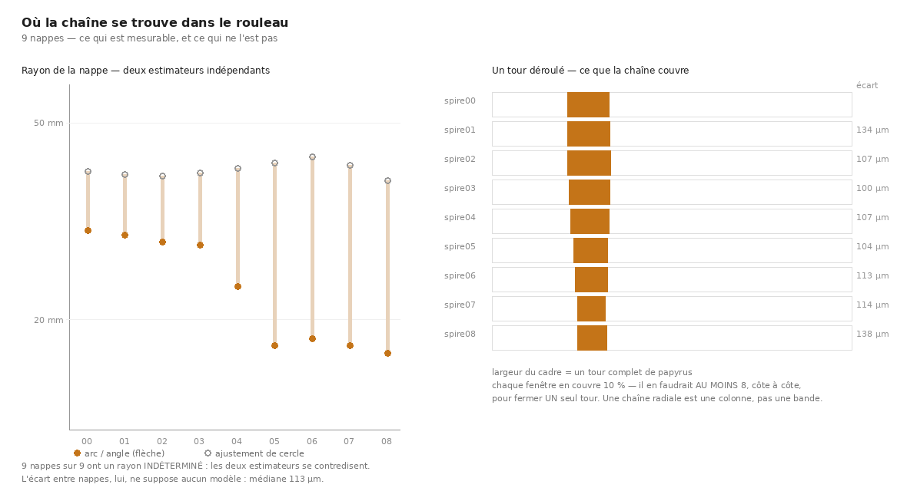

Instrument : `src/nappe/geometrie_chaine.py` (39 témoins hors ligne).
Données : la chaîne à pas de rayon 0,25, neuf nappes, `data/spires_pas025`.

---

## 1. L'instrument, et pourquoi il est aveugle à l'axe

Pour savoir où une nappe se trouve dans un rouleau, il faudrait normalement connaître l'axe
du rouleau. On ne le connaît pas, et le chercher demanderait une hypothèse de plus.

⭐ **Le contournement tient en une phrase** : sur un cylindre, une ligne de grille qui court
le long de la circonférence **tourne**, une ligne qui court le long de l'axe est **droite**.
On n'a donc pas besoin de savoir où est l'axe pour savoir laquelle des deux directions de
grille est laquelle — il suffit de regarder laquelle courbe.

La courbure se mesure par la **flèche** de l'arc — la distance maximale entre l'arc et sa
corde. Pour un arc de demi-angle $\varphi$, la corde vaut $2R\sin\varphi$ et la flèche
$R(1-\cos\varphi)$, d'où

$$\varphi = 2\arctan\!\left(\frac{2\,\text{flèche}}{\text{corde}}\right)$$

exactement, sans approximation petit-angle.

⭐ **Et le rayon s'élimine.** C'est ce qui rend cette mesure utilisable là où le rayon,
lui, n'est pas déterminé (§6) : l'angle balayé se lit sur la forme de l'arc, sans jamais
avoir à décider de quel cercle il est un morceau.

⚠⚠ **La première version de ce discriminant était fausse et le témoin l'a refutée.** Elle
ajustait un cercle sur chaque ligne et divisait la longueur d'arc par le rayon. Sur une ligne
**droite** l'ajustement est singulier : il rend un rayon minuscule, donc un angle de 3,9 rad
— si bien que la direction axiale passait pour la plus courbe, et **une surface plane pour un
rouleau**. La flèche ne peut pas exploser ; elle tend vers zéro.

---

## 2. Deux défauts de l'outil que seules les vraies données ont trouvés

Le témoin passait à 26 contrôles sur des cylindres synthétiques. La première mesure réelle a
rendu **« surface plane, il n'y a pas d'axe de rouleau à trouver »** sur une chaîne
parfaitement courbe.

| ce que je supposais | ce que les données disent |
|---|---|
| la sentinelle d'invalidité est `(0,0,0)` | elle vaut **`-1`** — 100 % des sommets passaient pour valides |
| une spire porte un maillage | elle en porte **deux**, `trace/neighbor_out_*` (poussé) et `plat/` (aplati), aux grilles différentes |
| l'axe circonférentiel est le même pour toute la chaîne | **il ne l'est pas** : `spire00` l'a en colonnes, les huit autres en rangées |

⚠ **Mon témoin testait ma propre hypothèse.** C'est le mode de panne le plus discret de ce
dépôt : un contrôle écrit depuis la même croyance que le code ne peut pas la contredire. La
convention est pourtant écrite noir sur blanc par l'outil de vc lui-même, dans la note de son
rapport de self-intersection — *« z <= 0 invalid »*. Il suffisait de la lire.

⚠ Le troisième défaut est le plus coûteux : décider l'axe **une fois** faisait mesurer huit
spires le long du mauvais axe, et rendait des rayons de **312 mètres** sans que rien ne
signale l'erreur. `gen_neighbor` rend une grille transposée par rapport au segment source ;
l'axe se décide donc **par spire**, jamais par chaîne. C'est devenu un témoin : une chaîne
synthétique dont la première nappe est transposée et les suivantes non.

---

## 3. Ce que la mesure rend

| spire | grille | valide | aire utile | arc | tour | hauteur | écart |
|---|---|---:|---:|---:|---:|---:|---:|
| 00 | 149×161 | 58 % | 4,13 cm² | 21,9 mm | 11,5 % | 24,3 mm | — |
| 01 | 158×145 | 54 % | 3,72 cm² | 21,7 mm | 11,7 % | 23,9 mm | 134 µm |
| 02 | 154×141 | 49 % | 3,20 cm² | 21,3 mm | 11,8 % | 23,1 mm | 107 µm |
| 03 | 151×138 | 45 % | 2,78 cm² | 20,0 mm | 11,2 % | 22,3 mm | 100 µm |
| 04 | 148×135 | 40 % | 2,40 cm² | 15,8 mm | 10,7 % | 21,5 mm | 107 µm |
| 05 | 145×132 | 36 % | 2,07 cm² | 10,7 mm | 9,6 % | 20,3 mm | 104 µm |
| 06 | 142×129 | 32 % | 1,74 cm² | 10,3 mm | 9,0 % | 19,1 mm | 113 µm |
| 07 | 137×125 | 27 % | 1,40 cm² | 8,6 mm | 7,7 % | 18,3 mm | 114 µm |
| 08 | 131×119 | 23 % | 1,07 cm² | 8,7 mm | 8,1 % | 17,2 mm | 138 µm |

**Aire utile totale de la chaîne : 22,5 cm² sur neuf nappes.**

---

## 4. ⭐ Le chiffre qui valide la chaîne : 113 µm

L'écart entre deux nappes consécutives est une **distance au plus proche voisin** — aucun
modèle, aucune hypothèse de forme. Médiane **113 µm**, de 100 à 138.

C'est le seul chiffre de tout ce dépôt qui dise que **la chaîne avance d'une nappe à la
fois**. Un pas trop grand sauterait une feuille sans que rien d'autre le signale : la surface
convergerait toujours, elle convergerait juste sur la mauvaise feuille, et les rendus
auraient exactement la même allure. Cette panne-là était invisible jusqu'ici.

Et l'ordre de grandeur est celui qu'on attend d'un papyrus carbonisé d'Herculanum, où les
feuilles sont à une à deux centaines de micromètres l'une de l'autre.

---

## 5. ⚠ Correction d'un chiffre publié : l'érosion est de 15,6 % par tour, pas 4,0 %

[`43`](43_la_chaine_des_spires.md) publie une érosion de **4,0 % par tour**, calculée sur
l'aire de la **grille** — et le disait, dans une note : *« aire de la GRILLE (sommets
invalides compris) — un majorant, pas la surface utile »*. Ce qui manquait, c'est le
**facteur** de ce majorant. Il vaut presque deux au départ, et plus de quatre à la fin :

> **la part de sommets valides tombe de 58 % à 23 %.** La grille se creuse autant qu'elle
> rétrécit, donc une érosion calculée sur l'aire de grille ignore précisément la moitié qui
> disparaît.

Sur l'aire **utile**, l'érosion est de **4,13 → 1,07 cm² en huit tours, soit 74 % au total et
15,6 % par tour** — presque quatre fois le chiffre publié. À ce rythme la moitié de la
surface est perdue en **quatre** tours, pas en douze.

⭐ Et le panneau des rendus le montre sans qu'on ait à croire un nombre : le treillis de
fibres est net sur les trois premières bandes, se fragmente sur les trois suivantes, et la
région valide devient une bande diagonale étroite sur les trois dernières.

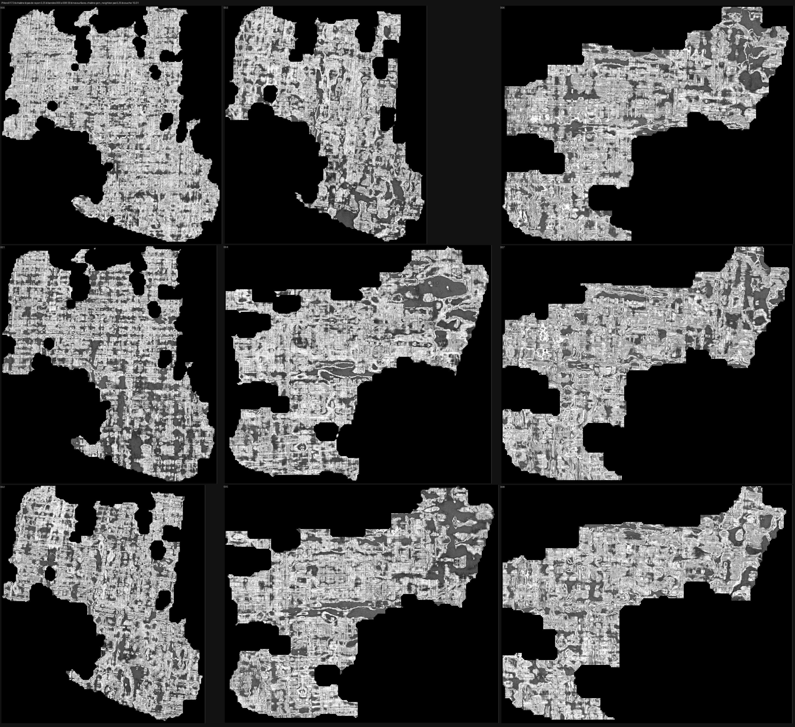

---

## 6. ⚠⚠ Ce que l'outil REFUSE de publier : le rayon

Deux estimateurs indépendants du rayon de la nappe :

1. **géométrique pur** — longueur d'arc divisée par angle balayé : 17 à 30 mm ;
2. **ajustement de cercle** dans le plan perpendiculaire à l'axe : 38 à 43 mm.

Ils se contredisent d'un **facteur deux**, et la cause est mesurable : le résidu
d'ajustement vaut **0,5 mm quand les nappes sont à 0,113 mm l'une de l'autre**. Une nappe de
papyrus gondole dix fois plus que la distance qui sépare deux nappes, donc **un cercle unique
n'est pas un modèle de cette surface**. « Le rayon de la spire » n'est pas une quantité que ce
maillage détermine.

⭐ L'outil le dit et refuse le chiffre, sur **9 nappes sur 9**. Publier l'un des deux aurait
été publier un nombre au hasard, et le panneau de gauche de la figure montre les deux plutôt
qu'une moyenne : *une figure doit montrer l'incertitude qu'elle a, sinon elle en fabrique une
certitude.*

⚠ Ce qui survit, c'est l'**ordre de grandeur** : 2 à 4 cm de rayon, ce qui est bien un
rouleau d'Herculanum. Rien de plus fin.

Le critère de refus est mesuré, pas choisi : sur un cylindre exact ou bruité à trois voxels,
les deux estimateurs s'accordent à moins de 1 % ; sur une nappe **gondolée** synthétiquement
comme les vraies, ils divergent de plus de 40 %. Sans ce dernier contrôle, le drapeau
« indéterminé » n'aurait jamais pu s'allumer, et son refus n'aurait rien voulu dire.

---

## 7. ⭐⭐ Le résultat structurel : une colonne, pas une bande

Chaque fenêtre couvre **environ 10 % d'un tour**. Il en faudrait donc **au moins 8**, côte à
côte, pour fermer **un seul** tour.

⚠ « Au moins » n'est pas une prudence de style, c'est le sens du biais : le gondolement de la
feuille s'ajoute à la flèche, donc l'angle mesuré est un **majorant** de l'angle réellement
balayé, donc le nombre de fenêtres par tour est un **minorant**. La conclusion n'en est que
renforcée.

Et voici pourquoi cela invalide la tâche telle qu'elle était écrite. `gen_neighbor` avance
**radialement** : la spire N+1 est la spire N projetée d'une nappe vers l'extérieur. Les deux
occupent donc la **même fenêtre angulaire**, à 113 µm l'une de l'autre. Or dans un rouleau
déroulé, deux nappes consécutives sont séparées **par une circonférence entière de papyrus**
— celle qu'on ne possède pas. Les recoller bout à bout produirait une bande continue qui
n'existe pas.

> **Il faut deux chaînes orthogonales, et je n'en ai construit qu'une.**
>
> | chaîne | ce qu'elle donne | état |
> |---|---|---|
> | **radiale** (`gen_neighbor`) — traverse les feuilles | une **colonne** : la profondeur, 9 nappes | ✅ faite, [`43`](43_la_chaine_des_spires.md) |
> | **tangentielle** — suit UNE feuille autour du tour | une **bande** : la longueur, un vrai morceau déroulé | ❌ **jamais tentée** |

C'est la chaîne tangentielle qui produirait « un morceau de rouleau déroulé ». Le graal — une
image du rouleau entier — a besoin des deux : la radiale pour la profondeur, la tangentielle
pour la longueur.

### ⚠⚠ Et l'outil n'a AUCUN mode qui la fasse — vérifié dans sa source

Avant de la nommer « prochaine étape », il fallait savoir si `vc_grow_seg_from_seed` sait déjà
le faire. Il ne sait pas :

| mode | ce qu'il fait réellement | utilisable ? |
|---|---|---|
| `gen_neighbor` | projette la surface le long de ses **normales de sommet**, `neighbor_dir` valant `in` ou `out` — **rien d'autre** (`vc_grow_seg_from_seed.cpp:622` et `:684`) | radial seulement |
| `expansion` | ⚠ tire un point **au hasard près du bord** d'un segment existant et **repart en croissance libre** depuis ce germe (`:392`) | non : c'est `mode: seed` déguisé, et les 17 essais en croissance libre sont tous à α ≈ 1 |
| `resume` | reprend une surface et la laisse repousser | non : §6 de [`43`](43_la_chaine_des_spires.md) — la liberté revient, et la dérive avec (+1,46 au 3ᵉ tour) |

⚠ `expansion` a en prime un défaut qui l'exclut d'une chaîne reproductible : son générateur
est semé par l'horloge, `std::default_random_engine rng(clock())`. Deux exécutions du même
appel ne donnent pas le même monde — et le prix demande explicitement une pipeline
*entièrement automatisée* et rejouable.

> **Il faut donc écrire quelque chose, et le principe à réutiliser est celui qui marche** :
> ne pas faire *croître* une surface, en **projeter** une — mais le long de la **tangente**
> de la nappe au lieu de sa normale.

⭐ Une pièce existe déjà pour ça : `src/commun/suivre_nappe.py`
([`41`](41_marcher_le_long_dune_nappe.md)) marche le long d'une nappe et calcule justement la
tangente latérale par `cross(n, t)` — c'est ainsi qu'il émet ses « côtes ». Ce qu'il produit
est une liste de points 3D, c'est-à-dire exactement le format que `--correct` consomme.

### ⚠⚠ La projection tangentielle existe — et DEUX sondes bon marché n'ont pas pu la juger

`src/nappe/projeter_tangentiel.py` fait ce que ce document nommait : il projette une nappe
le long de sa **tangente** et non de sa normale. Le fait qui rend ça simple est qu'un `tifxyz`
**encode déjà ses propres tangentes** — la grille est une paramétrisation de la nappe, donc
`∂P/∂u` et `∂P/∂v` se lisent par différences finies, sans remarcher le volume.

⚠ L'axe est **mesuré** et non supposé : sur une grille de nappe, l'un des deux axes court le
long de la feuille et l'autre en travers, et se tromper projette dans l'épaisseur du rouleau
— c'est-à-dire la colonne qu'on a déjà. `axe_le_plus_long` compare les **chemins parcourus**.
⭐ Ma première version comparait la somme des tangentes locales, qui vaut « nombre de points
fois le pas » dans les deux directions sur une grille régulière : elle rendait le même nombre
des deux côtés et ne départageait rien. Le témoin l'a dit au premier lancement.

#### ⚠⚠ Et les deux mesures bon marché rendent le MÊME chiffre à toutes les distances

`src/outils/portee_tangentielle.sh` projette le maillage **publié** — une nappe dont on sait qu'elle
suit une feuille — à 0, 1, 2, 5, 10, 20 et 50 pas de grille, et mesure à chaque fois si les
points tombent encore sur du papyrus. Le pas 0 est le **contrôle**.

| pas | déplacement | bloc avec matière | valeur **au point**, médiane |
|---:|---:|---:|---:|
| 0 (contrôle) | 0 µm | 9/10 | 44 |
| 1 | 48 µm | 9/10 | 42 |
| 2 | 95 µm | 9/10 | 43 |
| 5 | 238 µm | 9/10 | 44 |
| 10 | 476 µm | 9/10 | 44 |
| 20 | 952 µm | 9/10 | 42 |
| **50** | **2,4 mm** | **9/10** | **45** |

> ⚠⚠ **Une mesure qui rend le même chiffre à 0 µm et à 2,4 mm ne mesure rien**, et c'est vrai
> des **deux** colonnes. Ni « le bloc contient de la matière » ni « la valeur au point » ne
> peut dire si la nappe est encore *sur sa feuille*.

Les raisons sont physiques et se disent en une ligne chacune :
- un bloc zarr fait 128 voxels de côté, soit **307 µm**, quand les feuilles sont à **10–20 µm**
  l'une de l'autre : à l'intérieur d'un rouleau, presque tout bloc contient du papyrus ;
- un voxel isolé d'un rouleau comprimé lit un gris moyen à peu près partout, parce que les
  interstices sont fins et souvent refermés.

⭐ **Ce que ça établit** : la question « la tangente reste-t-elle sur la feuille » n'a pas de
réponse au rabais. Ce qui la tranche est le **profil de profondeur** — air → papyrus → air —
c'est-à-dire l'instrument que ce dépôt a déjà, et qui coûte **un rendu par pas**. La campagne
suivante est donc chiffrée : quelques rendus, pas quelques requêtes.

#### ⭐⭐⭐ La campagne chiffrée, faite : la tangente se dégrade PROGRESSIVEMENT

Trois rendus de 41 couches sur le maillage publié, le pas 0 en contrôle.

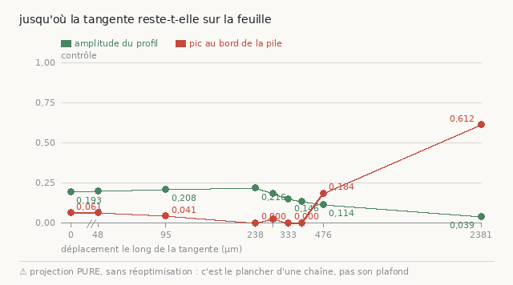

⚠ Les **losanges** de cette figure n'appartiennent pas à la campagne décrite ici : ce sont des
nappes **enchaînées**, ajoutées plus bas ([§ à 478 µm](#-et-il-lest-à-478-µm--le-bond-quitte-sa-feuille-la-chaîne-y-reste))
et posées aux mêmes abscisses pour être comparables. Les **disques** sont les points de ce
tableau.

| déplacement | amplitude | pic au bord | fenêtres avec relief |
|---:|---:|---:|---:|
| 0 µm (contrôle) | 0,1929 | 6,1 % | 49/49 |
| 48 µm | 0,1977 | 6,1 % | 49/49 |
| 95 µm | 0,2075 | 4,1 % | 49/49 |
| **238 µm** | ⭐ **0,2162** | 0,0 % | 49/49 |
| 286 µm | 0,1807 | 2,0 % | 49/49 |
| 333 µm | 0,1456 | 0,0 % | 48/49 |
| **381 µm** | 0,1322 | ⭐ **0,0 %** | 49/49 |
| **476 µm** | 0,1140 | ⚠⚠ **18,4 %** | 49/49 |
| 2 381 µm | 0,0390 | 61,2 % | 45/49 |

> ⭐⭐⭐ **Deux grandeurs, deux seuils, et ils ne tombent pas au même endroit.**
>
> L'**amplitude** — le contraste du profil — **monte** jusqu'à un maximum à **238 µm**
> (0,2162, au-dessus du contrôle) puis décline **régulièrement** : 0,181, 0,146, 0,132, 0,114.
> Aucune rupture.
>
> Le **pic au bord** — la nappe est-elle encore dans la fenêtre — reste à **0,0 % jusqu'à
> 381 µm**, puis saute à **18,4 %** à 476 et 61,2 % à 2 381. Là, il y a une rupture.
>
> ⭐ Donc la nappe projetée **reste sur sa feuille jusqu'à ~380 µm**, et elle y est **le mieux
> posée vers 240 µm**. Ce sont deux optima différents et tous deux utiles : 240 pour la
> qualité, 380 pour la portée.

⚠ L'amplitude à 238 µm dépasse celle du contrôle (0,216 contre 0,193), et je ne l'explique pas.
Le plus probable est que le morceau de départ soit lui-même légèrement décentré sur sa feuille
et que la projection retombe mieux — mais c'est une hypothèse, pas une mesure, et elle est
écrite comme telle.

#### ⚠⚠ TROISIÈME correction de la même courbe, et c'est un fait de méthode

| points | forme lue | verdict que j'en tirais |
|---:|---|---|
| **3** (0, 476, 2381) | pente monotone | « une pente, pas un décrochement » |
| **6** (+ 48, 95, 238) | plateau puis falaise | « la chaîne a un pas franc de 240 µm » |
| **9** (+ 286, 333, 381) | **maximum puis descente douce, rupture séparée plus loin** | deux seuils distincts |

**Chaque forme était plausible et chaque forme était fausse.** C'est la leçon de
[`43`](43_la_chaine_des_spires.md) §6quater — *« les premiers tours d'une chaîne ne
discriminent pas »* — à sa troisième occurrence, et elle mérite d'être dite en général :
**une courbe se juge là où elle change, donc il faut échantillonner là, donc il faut d'abord
savoir où elle change** — ce qui n'est possible qu'en la rendant plus dense.

⭐ La figure, elle, n'a jamais menti : elle **refuse** d'annoncer une dégradation monotone
quand les points ne le sont pas, et elle imprime « ⚠ NON monotone » depuis le tirage à six
points. Le contrôle était écrit avant la donnée qui l'a fait parler.

#### ~~⚠⚠⚠ Et enchaîner est STRICTEMENT PIRE qu'un seul bond~~ — *(vrai du PAS, pas de l'enchaînement)*

> ⚠⚠ **Section conservée mais DÉPASSÉE.** Le verdict ci-dessous est juste pour un pas de
> **grille** de 238 µm, et faux comme énoncé sur l'enchaînement : à 95 µm par maillon la chaîne
> ne coûte rien, et à pas **fixe** elle ne s'emballe pas du tout
> ([§ l'emballement vient du PAS](#-lemballement-vient-du-pas-pas-de-lenchaînement--et-il-se-supprime)).
> Elle reste ici parce que c'est elle qui a produit la mesure qui a permis de trouver la cause.

La projection compose : elle lit un `tifxyz` et en écrit un. On peut donc **enchaîner** —
cinq maillons de 238 µm, chacun partant de la sortie du précédent — et comparer au **témoin**
qui franchit les mêmes 1,19 mm d'un seul bond. Sans ce témoin, une chaîne qui tient ne
prouverait rien : elle pourrait tenir parce que la distance est courte.

⭐ Le discriminant ne coûte **aucun rendu** : le **volume de la boîte englobante**, à nombre de
points constant.

| maillage | volume englobant | ×source | points |
|---|---:|---:|---:|
| source | 10,04 Gvox | 1,00 | 14 280 |
| maillon 1 | 10,12 | 1,01 | 14 280 |
| maillon 2 | 10,22 | 1,02 | 14 280 |
| maillon 3 | 10,45 | 1,04 | 14 280 |
| maillon 4 | 12,21 | **1,22** | 14 280 |
| **maillon 5** | **23,92** | ⚠⚠ **2,38** | 14 280 |
| **bond direct, même distance** | 11,01 | ⭐ **1,10** | 14 280 |

> ⚠⚠ **Cinq maillons : ×2,38. Un seul bond de la même longueur : ×1,10.** À nombre de points
> **constant**, un volume qui double est un maillage qui ne se déplace pas mais **s'étale**.
>
> ⭐ Et la croissance est **super-linéaire** — 1,01 · 1,02 · 1,04 · 1,22 · 2,38. Stable sur
> trois maillons, puis elle explose. C'est une composition d'erreurs, pas une dérive.

**Le mécanisme se dit en une phrase** : chaque projection déplace chaque point le long de sa
tangente **locale**. Sur une nappe courbe, les tangentes voisines divergent, donc la grille
**cisaille** un peu à chaque fois. Le bond direct n'utilise les tangentes de la source
**qu'une fois** — un cisaillement, pas cinq composés.

⚠ Le rendu de ce cinquième maillon l'a confirmé de la pire façon : **2 Kio/s puis abandon**,
là où les autres tournent à 200-400. Un maillage étalé sur 2,4 fois le volume force le moteur
à chercher 2,4 fois plus de données pour la même surface. ⭐ La campagne l'a **dit** —
« ⚠ profil de maillon_5 abandonné » — au lieu de produire un chiffre pour un rendu raté.

⚠⚠ **La limite de CE plan d'expérience, et elle est réelle** : à 1,19 mm le bond direct est
lui-même déjà sorti de sa feuille — **amplitude 0,0652, pic au bord 55,1 %**, cohérent avec la
courbe de portée. La comparaison de **profils** oppose donc « mauvais » à « irrendable », et
elle n'apprend rien. Ce qui porte le verdict, c'est la **croissance de la boîte**, qui se
mesure à **chaque maillon** — y compris aux maillons 1 à 3, où le bond équivalent serait
encore bon.

⭐ **Le plan d'expérience juste reste donc à faire** : enchaîner sur une distance totale où le
bond direct tient encore — par exemple trois maillons de 95 µm, soit 286 µm, où la projection
unique lit 0,181 et 2,0 % de pic au bord. Là, « la chaîne tient-elle là où un seul bond
tient ? » devient une vraie question.

> ~~⭐⭐⭐ **Donc une chaîne tangentielle PUREMENT GÉOMÉTRIQUE ne marche pas**, et ce n'est pas
> un détail de réglage : elle est strictement moins bonne que la projection unique qu'elle
> prétend prolonger.~~ *(⚠⚠ **corrigé ci-dessous** : c'est vrai à 238 µm par maillon, et **faux**
> à 95 µm. Le verdict n'appartenait pas à l'enchaînement mais au **pas**.)* Ce qui manque
> n'est pas seulement un meilleur pas, c'est aussi la **réoptimisation entre les maillons** —
> recoller la nappe projetée sur la matière, ce que ce document nommait déjà (`--correct`).

---

#### ⭐⭐⭐ Le plan d'expérience juste, fait : à 95 µm par maillon, enchaîner ne coûte RIEN

Trois maillons de 95 µm, soit **286 µm** au total — une distance où la projection unique tient
encore (0,181 d'amplitude, 2,0 % de pic au bord). Témoin : le **bond direct** de ces mêmes
286 µm. Et le verdict **s'inverse** :

| maillage | boîte ×premier | pas réel | ×pas | points |
|---|---:|---:|---:|---:|
| source | 1,00 | — | — | 14 280 |
| maillon 1 | 1,00 | 95,2 µm | 1,00 | 14 280 |
| maillon 2 | 1,01 | 95,4 µm | 1,00 | 14 280 |
| maillon 3 | 1,01 | 95,6 µm | **1,00** | 14 280 |
| **bond direct, même distance** | **1,01** | 285,7 µm | 3,00 | 14 280 |

> ⭐⭐ **×1,01 des deux côtés.** À 95 µm par maillon, trois projections enchaînées étalent le
> maillage **exactement autant** qu'un seul bond de la même longueur — c'est-à-dire pas du
> tout. Le « strictement pire » de la campagne précédente n'était pas une propriété de
> l'enchaînement : c'était une propriété du **pas**.

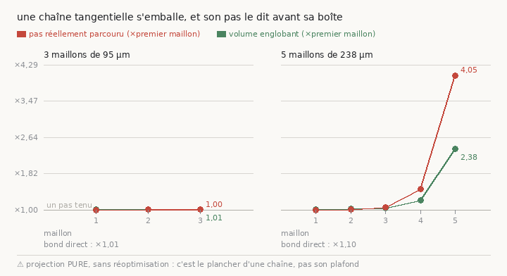

#### ⚠⚠ Et le vrai instrument d'alerte n'est pas la boîte, c'est le PAS RÉELLEMENT PARCOURU

En regardant les `meta.json` des maillons — donc sans aucun rendu — une seconde grandeur
apparaît, et elle est plus tranchante que le volume englobant.

⭐ `--pas` est un pas **de grille**. La distance réellement couverte vaut
`pas × longueur de tangente`, donc **un maillage qui cisaille allonge ses tangentes, et la
même commande couvre de plus en plus de terrain** :

| maillon | pas demandé | pas réel (238 µm) | ×pas | boîte |
|---|---:|---:|---:|---:|
| 1 | 238 µm | 238,1 µm | 1,00 | 1,01 |
| 2 | 238 µm | 240,4 µm | 1,01 | 1,02 |
| 3 | 238 µm | 251,5 µm | **1,06** | 1,04 |
| 4 | 238 µm | 351,0 µm | **1,47** | 1,22 |
| 5 | 238 µm | **963,3 µm** | ⚠⚠ **4,05** | 2,38 |

> ⚠⚠ **Le pas PRÉCÈDE la boîte.** Au quatrième maillon il est déjà à **+47 %** quand la boîte
> n'est qu'à +22 %. Une chaîne qui dérive sur son propre pas **ne va plus là où on l'a
> envoyée** : ces cinq maillons de 238 µm ont parcouru 2 044 µm et non 1 190.
>
> ⭐ C'est donc `pas_voxels` — un nombre déjà écrit dans chaque `meta.json`, gratuit — qui doit
> servir de garde-fou à une chaîne, un maillon à la fois, et pas un rendu à la fin.

#### ⭐⭐⭐ Et la question la plus élémentaire : les deux atterrissent-elles au MÊME endroit ?

Comparer par le **profil** demande deux rendus, et à 1,19 mm ça n'apprend rien (§ précédent).
Mais deux `tifxyz` issus d'une même source **partagent leur paramétrisation** : le point de
grille (i, j) désigne le même point de la nappe des deux côtés. On peut donc les soustraire —
et ça ne coûte **aucun rendu**.

⭐ Lu en **spires** (`PHercParis4` : écart inter-spires médian **173 µm**, cf.
[`16`](16_carte_difficulte_rouleaux_du_prix.md)), parce que « 8 µm » ne dit pas si deux
maillages sont sur la même feuille alors que « 0,05 spire » le dit :

| chaîne | écart médian | **en spires** | p90 | max | le long | en travers |
|---|---:|---:|---:|---:|---:|---:|
| **3 × 95 µm** (286 µm) | 8,1 µm | ⭐ **0,047** | 0,147 | 0,686 | −0,6 µm | 8,1 µm |
| **5 × 238 µm** (1190 µm) | 922,5 µm | ⚠⚠ **5,33** | 7,56 | 11,63 | −671,6 µm | 649,5 µm |

> ⭐⭐⭐ **À 95 µm par maillon, la chaîne et le bond direct finissent à un vingtième de spire
> l'un de l'autre — la MÊME feuille.** À 238 µm, ils finissent **cinq spires** l'un de
> l'autre, c'est-à-dire dans deux endroits sans rapport du rouleau.

⚠ **L'écart se décompose, et les deux moitiés sont deux échecs différents.** *Le long* du
déplacement, la chaîne courte va aussi loin que le bond (−0,6 µm) : le pas est calibré. *En
travers*, elle a dérivé de 8,1 µm — c'est le **cisaillement**, et c'est lui qui fait changer
de feuille. La chaîne longue, elle, est à la fois **671 µm trop courte** et **649 µm de
côté** : elle a perdu les deux.

⚠⚠ **Ce que la chaîne courte n'a pas gagné pour autant** : son **pire** point est à
**0,686 spire**, soit les deux tiers du chemin vers la feuille voisine. La médiane tient, la
queue est déjà en train de partir — et un texte se lit sur toute une bande, pas sur sa
médiane.

⚠ **Ce que cette comparaison ne dit PAS** : que l'un des deux est sur la BONNE feuille. Elle
mesure un **accord**, pas une vérité. Deux méthodes qui se trompent de la même façon
s'accordent parfaitement ; c'est le rendu qui tranche, et c'est ce que le paragraphe suivant
mesure.

#### ⭐⭐ Et en la REGARDANT, les deux échecs n'ont pas la même forme

Une médiane ne dit pas **où** deux maillages se séparent, et « partout un peu » et « beaucoup
le long de quelques lignes » demandent deux remèdes opposés : le premier se combat en
raccourcissant le pas, le second en **rejetant** les tangentes fautives — et raccourcir le pas
n'y ferait rien. La carte coûte, elle aussi, zéro rendu : une case par point de grille.

| 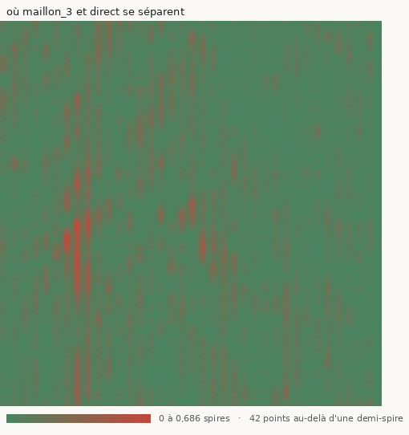 | 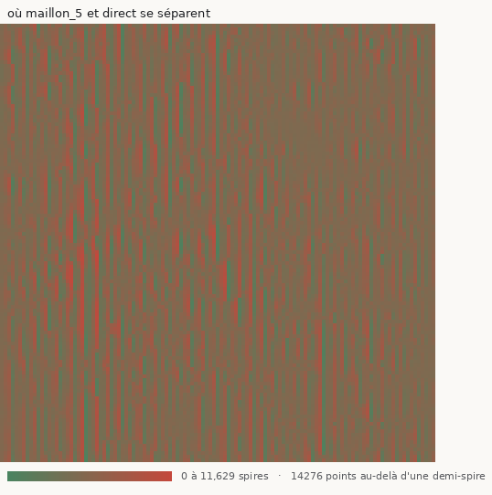 |
|---|---|
| **3 × 95 µm** — vert presque partout, quelques **traînées verticales** | **5 × 238 µm** — brun uniforme : **14 276 points sur 14 280** au-delà d'une demi-spire |

⚠⚠ **Et la mesure a corrigé ma lecture à l'œil.** Les traînées sont visibles, donc j'allais
écrire « quelques colonnes portent tout ». Le nombre dit autre chose, et il porte son propre
témoin — sur un champ **uniforme**, le pire dixième des lignes porte exactement un dixième du
total :

| chaîne | pire dixième des **colonnes** | des **lignes** | lecture |
|---|---:|---:|---|
| 3 × 95 µm | **24 %** | 13 % | 2,4× plus concentré qu'un hasard uniforme |
| 5 × 238 µm | 13 % | 10 % | ⚠ **réparti** — plus aucune structure |

> ⭐ **Deux échecs de formes différentes.** La chaîne courte a un désaccord **modérément
> localisé** le long de l'axe de projection — donc au moins en partie attribuable à quelques
> colonnes de tangentes. La chaîne longue n'a plus de structure du tout : ce n'est plus une
> dérive localisée, c'est un effondrement global.

⚠ Les **points verts** épars de la carte de droite ne sont pas des survivants : deux surfaces
très différentes se croisent forcément quelque part, et les points de croisement s'affichent
comme des accords. Lus comme « les endroits qui ont tenu », ils seraient trompeurs.

#### ⭐⭐ Et le rendu tranche : à distance égale, la chaîne est au SOMMET de la courbe de portée

Deux rendus, dans la même campagne, mêmes fenêtres, même code :

| surface, à **286 µm** de la source | amplitude | pic au bord |
|---|---:|---:|
| source (0 µm) | 0,1929 | 6,1 % |
| **chaîne, 3 × 95 µm** | ⭐ **0,2146** | 4,1 % |
| **bond direct, un seul saut** | 0,1807 | 2,0 % |

⭐ **Un contrôle de déterminisme écrit AVANT la mesure, et il a tenu.** Le bond direct de cette
campagne et le point `pas_6` de la courbe de portée sont le **même maillage** — écart mesuré
**0,000 voxel sur 14 280 points**. Le profil devait donc rendre exactement `0,1807 / 0,020`.
Il l'a fait, à la quatrième décimale. La chaîne rendu → profil est reproductible.

> ⭐⭐ **La chaîne rend 0,2146, c'est-à-dire le MAXIMUM de la courbe de portée**
> (0,2162 à 238 µm), pendant que le bond direct a déjà commencé à en redescendre (0,1807).
> À distance égale, la nappe enchaînée est mieux posée sur sa feuille que celle qui a sauté.

⚠ **Et la réserve, parce qu'elle est réelle** : l'écart vaut 0,034 d'amplitude, quand deux
points voisins de la courbe de portée s'écartent déjà de 0,01 à 0,03. C'est au bord de ce que
la dispersion propre de la courbe expliquerait. Le pic au bord va d'ailleurs dans l'autre sens
— 4,1 % contre 2,0 % — même si les deux restent sous les 6,1 % de la source. **Ce point seul
n'est donc pas décisif** ; ce qui le rendrait décisif est la même comparaison là où le bond
direct est franchement mauvais.

#### ⭐⭐⭐ ET IL L'EST, à 478 µm : le bond quitte sa feuille, la chaîne y reste

C'est la mesure pour laquelle toute la campagne a été montée. À 476 µm, la projection unique
**commence à sortir de sa feuille** — 18,4 % de ses fenêtres ont leur pic au bord de la pile,
contre 0 à 2 % partout avant. La chaîne de cinq maillons de 95 µm a parcouru **479,5 µm**, la
même distance à 0,7 % près :

| à ~478 µm de la source | amplitude | pic au bord |
|---|---:|---:|
| **bond direct unique** (476,1 µm) | 0,1140 | ⚠⚠ **18,4 %** |
| **chaîne, 5 × 95 µm** (479,5 µm) | ⭐ **0,1491** | ⭐ **2,0 %** |

> ⭐⭐⭐ **Neuf fois moins de pic au bord, et +31 % d'amplitude.** Là où un seul bond a
> commencé à quitter sa feuille, **la nappe enchaînée y est encore**. Cet écart-là n'est pas
> au bord du bruit : sur toute la courbe, le pic au bord vaut 0 à 6 % — 18,4 % est le point où
> elle décroche, et la chaîne au même endroit lit 2,0 %.


⭐ Sur la figure, les **losanges** sont les nappes enchaînées et le trait vertical relie chaque
losange au point de la courbe qu'il conteste. À 476 µm, le losange rouge est tout en bas
pendant que le disque rouge est déjà monté.

> ⭐⭐⭐ **Donc enchaîner à petit pas est un LEVIER QUI MARCHE, et c'est un résultat positif** :
> il gagne environ **1,5×** de portée (580 µm de pas contrôlé contre ~380 µm pour un seul
> bond), et sur cette portée gagnée la nappe est **mieux posée** qu'un bond de même longueur.
> ⚠ Et il reste borné par l'horizon du paragraphe suivant, donc il ne fait pas le tour.

#### ⭐⭐⭐ L'HORIZON d'une chaîne à pas de GRILLE : **six maillons, 580 µm** — mesuré en secondes

Puisque le pas réel refuse une chaîne **sans aucun rendu**, une chaîne longue se sonde
d'abord comme ça. Vingt maillons de 95 µm, mode `PROFILS=0` :

| maillon | parcouru | pas réel | ×pas | boîte | points |
|---:|---:|---:|---:|---:|---:|
| 1 | 95 µm | 95,2 µm | 1,00 | 1,00 | 14 280 |
| 2 | 191 | 95,4 | 1,00 | 1,01 | 14 280 |
| 3 | 286 | 95,6 | 1,00 | 1,01 | 14 280 |
| 4 | 382 | 96,3 | 1,01 | 1,01 | 14 280 |
| 5 | 480 | 98,5 | 1,03 | 1,01 | 14 280 |
| **6** | **580** | 105,7 | ⚠ **1,11** | 1,02 | 14 280 |
| 7 | 686 | 125,9 | 1,32 | 1,05 | 14 280 |
| 8 | 799 | 174,6 | 1,83 | 1,12 | 14 280 |
| 10 | — | 501,6 | 5,27 | 1,71 | 14 280 |
| 15 | — | 16 820 | 176,6 | 1 120 | 14 280 |
| 20 | — | 256 397 | **2 692** | **4 976 545** | ⚠⚠ **615** |

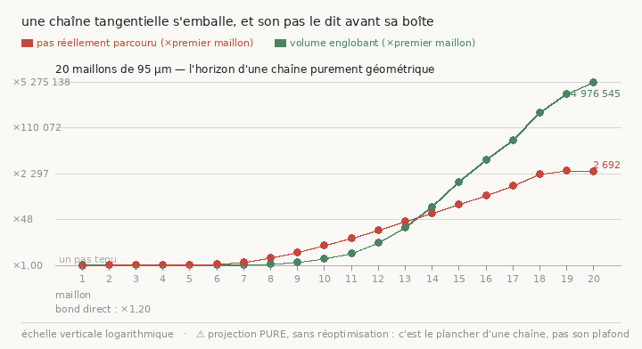

> ⭐⭐⭐ **La chaîne marche droit jusqu'à ~580 µm, puis explose.** Les distances parcourues —
> 95, 191, 286, 382, 480, 580 µm — sont exactement la somme des pas : elle **avance**, elle ne
> tourne pas en rond. Puis le pas décroche au sixième maillon et le maillage se détruit :
> au vingtième il ne reste que **615 points valides sur 14 280**.
>
> ⭐ **Et le pas décroche AVANT la boîte, une seconde fois** : ×1,11 contre ×1,02 au maillon 6.
> Sur la figure, la courbe rouge est au-dessus de la verte du maillon 6 au maillon 13.

**Ce que ça achète, et ce que ça n'achète pas :**

- ⭐ **La chaîne va PLUS LOIN qu'un seul bond.** La projection unique est morte vers 380 µm
  (à 476 µm elle lit 18 % de pic au bord) ; la chaîne tient un pas contrôlé jusqu'à **580 µm**.
  Un facteur **1,5**, réel et mesuré.
- ⚠⚠ **Et c'est très loin d'un tour.** Une nappe de `PHercParis4` fait des dizaines de
  millimètres de circonférence. **580 µm, c'est le centième d'un tour.** Une chaîne tangentielle
  **purement géométrique** ne fera donc jamais le tour d'une feuille — non pas « pas encore »,
  mais par une limite maintenant chiffrée.
- ⚠ **Ce plancher tient toujours** : ces vingt maillons projettent **purement**, sans
  réoptimisation sur la matière. Ce qui est éliminé, c'est la chaîne **géométrique**.

#### ⭐⭐⭐ Et la MATIÈRE est d'accord : à distance égale, la chaîne trouve plus de feuille que le bond

Le profil demande un rendu ; la **matière** répond gratuitement. Pour chaque point d'une nappe,
de combien la prédiction demanderait-elle de le bouger pour le poser sur la crête de sa feuille ?
Une nappe déjà posée demande peu — et surtout, **elle trouve de la matière sous ses points**.

⚠⚠ Le témoin est la moitié de la mesure : le segment **publié**, qui est sur sa feuille par
construction. « La chaîne demande 7 voxels » ne veut rien dire tant qu'on ne sait pas que le
segment publié en demande **7 aussi**.

| maillage | parcouru | recalés | sans matière | crête | demande |
|---|---:|---:|---:|---:|---:|
| **source publiée** | 0 µm | 8 248 | 3 009 | 2,63 | 7,00 vox |
| **chaîne, 3 × 95 µm** | 286 µm | ⭐ **8 003** | ⭐ **3 019** | 2,64 | 6,95 |
| **bond direct** | 286 µm | 7 035 | **3 509** | 2,65 | 6,78 |
| chaîne, 5 maillons | 481 µm | 6 386 | 4 074 | 2,65 | 7,22 |
| chaîne, 6 maillons | 587 µm | 4 486 | ⚠ **5 996** | 2,71 | 7,50 |

> ⭐⭐⭐ **Après trois maillons, la nappe demande presque exactement ce que la source publiée
> demande** — 8 003 points recalés contre 8 248, crête 2,64 contre 2,63, déplacement 6,95
> contre 7,00, 58 % vers +normale contre 59 %. Trois projections ne l'ont **pas décollée de la
> matière**.
>
> ⭐⭐ **Et à la même distance, le bond direct en a 968 de moins.** C'est la **troisième**
> confirmation indépendante du même fait — après l'amplitude et le pic au bord — et celle-ci
> ne coûte **aucun rendu** et ne porte pas du tout sur la même grandeur.

⚠⚠ **La matière s'épuise AVANT que la géométrie n'explose.** Le pas ne décroche qu'au sixième
maillon, mais les points sans matière passent de 21 % (à 286 µm) à **29 %** (481) puis **42 %**
(587). La nappe **quitte sa feuille avant de se détruire** — donc l'horizon utile est plus
court que l'horizon géométrique.

⚠ **Une réserve de méthode, trouvée en écrivant ceci, puis levée par la mesure** : les
maillons lointains sortaient de la boîte de prédiction téléchargée, et « je n'ai pas cette
région » remplissait le même compteur que « le rouleau est vide ici ». La campagne rapporte
désormais **`hors boîte` en colonne propre** et dénonce un maillage majoritairement dehors.
Boîte élargie à 117 chunks, re-mesuré : **`hors boîte` vaut 0 partout jusqu'à 887 µm**. La
chute est donc réelle et non un artefact de téléchargement.

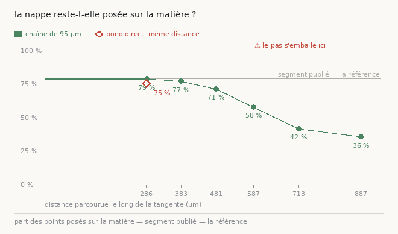

| parcouru | posé sur la matière |
|---:|---:|
| **source publiée** | **78,9 %** |
| chaîne, 286 µm | ⭐ **78,9 %** |
| **bond direct, 286 µm** | 75,4 % |
| chaîne, 383 µm | 77,2 % |
| chaîne, 481 µm | 71,5 % |
| chaîne, 587 µm | ⚠ 58,0 % |
| chaîne, 713 µm | ⚠⚠ 41,8 % |
| chaîne, 887 µm | ⚠⚠ 35,6 % |

> ⭐⭐⭐ **La chaîne tient EXACTEMENT le niveau du segment publié jusqu'à 383 µm** — 78,9 puis
> 77,2 % contre 78,9 % — pendant que le bond direct est déjà 3,5 points en dessous à 286 µm.
>
> ⚠⚠ **Et la matière s'épuise AVANT que la géométrie n'explose** : sur la figure, la ligne
> rouge de l'emballement du pas arrive **après** que la courbe a commencé à tomber. L'horizon
> **utile** est donc plus court que l'horizon **géométrique** — ~480 µm plutôt que 580.

⚠ Ce qui est compté « posé » n'est pas `recalés` : un point qui **bute sur la borne** de
recherche *a trouvé de la matière*, il n'a pas prouvé qu'il en tenait le sommet, et l'exclure
ferait passer une portée trop courte pour une feuille absente. Les points **hors boîte** sortent
du **dénominateur** — les compter ferait tomber la courbe *parce que* la chaîne sort de la
boîte, c'est-à-dire fabriquerait le résultat cherché.

#### ⭐⭐⭐ L'emballement vient du PAS, pas de l'enchaînement — et il se supprime

En regardant *pourquoi* le pas dérive, la cause est une **boucle de rétroaction**, et elle se
lit dans une seule ligne de code. `--pas` est un pas de **grille** : le déplacement vaut
`pas × longueur moyenne de tangente`. Donc un maillage qui cisaille **allonge ses tangentes**,
donc le maillon suivant couvre plus de terrain, donc il cisaille davantage.

⭐ Fixer le déplacement **en voxels** coupe la boucle — le déplacement cesse de dépendre du
maillage. Les mêmes vingt maillons, les deux unités :

| | pas de **grille** | pas **fixe** |
|---|---:|---:|
| pas au maillon 20 | ⚠⚠ **256 397 µm** (×2 692) | ⭐ **96,0 µm** (×1,00) |
| boîte au maillon 20 | ⚠⚠ **×4 976 545** | ⭐ **×1,55** |
| points valides | ⚠⚠ **615 / 14 280** | ⭐ **14 280 / 14 280** |
| distance totale | indéterminée | **1 920 µm** |

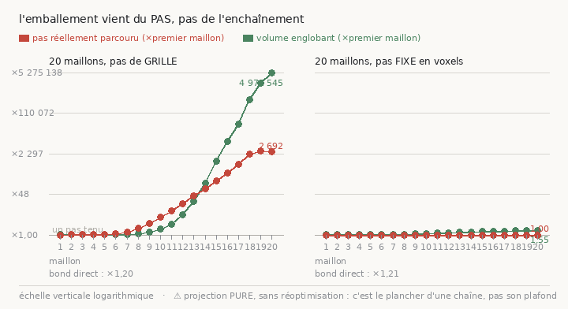

> ⭐⭐⭐ **Vingt maillons tiennent leur pas au dixième de micromètre et gardent TOUS leurs
> points.** L'horizon de six maillons n'était pas une propriété de l'enchaînement : c'était
> une propriété de l'**unité** dans laquelle on lui demandait d'avancer.

⚠ **Ce que le pas fixe ne fait PAS, et c'est écrit là où l'option est définie** : empêcher la
grille de cisailler. La boîte grossit encore — ×1,55 sur vingt maillons — parce que les
tangentes voisines divergent toujours. Il **coupe la rétroaction, il ne supprime pas la cause**.

⚠⚠ Et la géométrie ne dit toujours pas si la nappe est restée **sur sa feuille**. Une chaîne
peut tenir un pas parfait en marchant droit hors du papyrus.

#### ⚠⚠⚠ Et c'est exactement ce qui arrive : le pas fixe répare la GÉOMÉTRIE, pas la MATIÈRE

| parcouru | posé sur la matière |
|---:|---:|
| source publiée | 78,9 % |
| 288 µm | ⭐ 78,9 % |
| 480 µm | 71,5 % |
| **768 µm** | ⚠⚠ **39,7 %** |
| 960 µm | 35,1 % |
| 1 440 µm | 35,1 % |
| 1 920 µm | 35,4 % |
| **bond direct, mêmes 1 920 µm** | ⚠ **46,1 %** |

> ⚠⚠⚠ **L'emballement géométrique et le départ de la feuille sont DEUX pannes différentes**,
> et réparer la première ne touche pas la seconde. Vingt maillons gardent leurs 14 280 points
> et un pas au dixième de micromètre — et n'ont plus que 35 % de leurs points sur du papyrus
> dès 768 µm.
>
> ~~⚠ **Pire pour la chaîne : à 1 920 µm, UN grand bond garde plus de matière que vingt
> petits** (46,1 % contre 35,4 %) — il y a donc un croisement.~~
> *(⚠⚠ **CORRIGÉ par le plancher, ci-dessous** : les deux sont au niveau du hasard, +1,6 et
> −1,7 points. Ce n'était pas un croisement, c'était deux mesures mortes comparées sur une
> échelle brute.)*

⚠⚠ **Et un chiffre manquait sous tous ces pourcentages.** Une nappe posée **n'importe où** dans
un volume dont un quart des voxels est de la matière trouve forcément quelque chose sous une
partie de ses points. Tant qu'on ne sait pas combien, « 35 % posé » peut vouloir dire « à moitié
perdue » comme « complètement perdue » — et c'est exactement la différence qui décide si une
chaîne a encore un sens à cette distance. `--plancher` le mesure : la **même** nappe, translatée
en bloc dans une direction tirée au sort, plusieurs fois. Forme, densité de points et
échantillonnage identiques ; seule sa place est fausse.

| nappe | posé | **plancher du hasard** | verdict |
|---|---:|---:|---|
| **segment publié** | **78,9 %** | 48,4 % (max 55,3) | ⭐ **+30,6 points** |
| **chaîne à 1 920 µm** | 35,4 % | **37,1 %** (max 37,9) | ⚠⚠ **SOUS le hasard** |

> ⚠⚠⚠ **« 35 % » voulait donc dire COMPLÈTEMENT perdue, pas à moitié.** À 1 920 µm la nappe
> enchaînée lit **moins** de matière qu'une nappe de même forme jetée au hasard à 300 voxels de
> là : elle ne porte plus aucune information sur l'endroit où est le papyrus.
>
> ⭐ Et le témoin positif tient dans la même mesure : le segment **publié** est à **30,6 points
> au-dessus** de son propre plancher. L'instrument sait donc distinguer les deux, ce qui est la
> seule raison de le croire quand il dit « perdue ».

⚠ **Les deux planchers diffèrent de onze points** (48,4 contre 37,1), parce que la densité
locale de matière n'est pas la même aux deux endroits. C'est pour ça que le plancher se mesure
**par maillage** et jamais une fois pour toutes : un plancher global aurait déclaré la chaîne
« au-dessus du hasard » en lui appliquant la densité d'un autre quartier du rouleau.

#### ⭐⭐⭐ La campagne complète, et elle CORRIGE une conclusion que je venais de publier

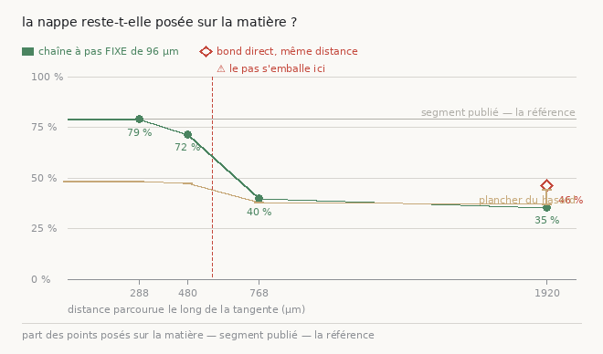

| parcouru | posé | plancher | **avantage sur le hasard** |
|---:|---:|---:|---:|
| source publiée | 78,9 % | 48,4 % | ⭐ **+30,6** |
| 288 µm | 78,9 % | 48,4 % | ⭐ **+30,5** |
| 480 µm | 71,5 % | 47,4 % | ⭐ **+24,1** |
| **768 µm** | 39,7 % | 38,2 % | ⚠⚠ **+1,5** |
| 1 920 µm | 35,4 % | 37,1 % | ⚠⚠ **−1,7** |
| **bond direct, 1 920 µm** | 46,1 % | **44,5 %** | ⚠⚠ **+1,6** |

> ⚠⚠⚠ **CORRECTION d'une conclusion publiée une heure plus tôt.** J'avais écrit qu'à 1 920 µm
> « un seul bond garde plus de matière que vingt maillons » — 46,1 % contre 35,4 % — et j'en
> avais tiré un **croisement**. Lus contre leurs propres planchers, les deux sont **au niveau
> du hasard** : **+1,6** et **−1,7** points. Il n'y a pas de croisement, il y a **deux mesures
> mortes comparées sur une échelle brute**. L'avantage apparent du bond s'explique entièrement
> par le fait qu'il atterrit dans une région plus dense (plancher 44,5 contre 37,1).
>
> ⭐ **C'est exactement ce que le plancher a été construit pour attraper**, et il l'a attrapé
> sur ma propre conclusion.

⭐ **Où la chaîne meurt, maintenant borné** : franchement vivante à **480 µm** (+24,1 points),
**au niveau du hasard à 768** (+1,5). La frontière est entre les deux — et sur la figure, la
courbe verte **rejoint la courbe du plancher** exactement là.

⚠ Le plancher lui-même descend le long de la chaîne (48,4 → 47,4 → 38,2 → 37,1) : elle dérive
vers une région moins dense. Un plancher unique l'aurait masqué.

#### ⭐⭐⭐⭐ LES DEUX CORRECTIONS ENSEMBLE : la chaîne vit quatre fois plus loin

Pas **fixe** (la géométrie) **et** recalage sur la matière à chaque maillon (la donnée). Vingt
maillons de 96 µm, jugés contre le **plancher du hasard mesuré à chaque distance** :

| parcouru | pas fixe **seul** | **pas fixe + recalage** |
|---:|---:|---:|
| 288 µm | +30,5 | ⭐ **+29,0** |
| 480 µm | +24,1 | ⭐ **+24,4** |
| **768 µm** | ⚠⚠ **+1,5** | ⭐⭐ **+19,0** |
| 1 440 µm | — | ⭐⭐ **+17,5** |
| **1 920 µm** | ⚠⚠ **−1,7** | ⭐⭐⭐ **+15,1** |

*(avantage sur le plancher, en points ; le segment publié est à +30,6)*

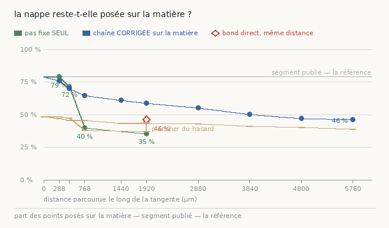

> ⭐⭐⭐⭐ **Là où la chaîne sans recalage est morte à 768 µm, celle qui repose sa nappe sur la
> matière est encore à +15 points au-dessus du hasard à 1 920 µm** — soit **quatre fois plus
> loin**. Sur la figure, la courbe verte **plonge dans son plancher** pendant que la bleue
> reste franchement au-dessus des deux.
>
> ⭐ Le pas tient **96,0 µm exactement** sur les vingt maillons et la boîte ne grossit que de
> **×1,92**. Les deux corrections sont **indépendantes** et se composent : l'une tient la
> géométrie, l'autre tient la feuille.

##### ⚠⚠ Le confondant, vérifié plutôt qu'écarté

La colonne « demande » de la chaîne corrigée vaut **0,06 voxel** — évidemment : on mesure
« cette nappe est-elle sur la crête ? » sur une nappe **qu'on vient de poser sur la crête**. La
mesure pouvait donc être **circulaire**.

⭐ **Le contrôle : la même mesure sur la projection AVANT son recalage** (les maillages
`projete_N`, gardés sur le disque pour cette raison), qui est exactement ce que la chaîne sans
recalage offre :

| maillage | posé | plancher | avantage | demande |
|---|---:|---:|---:|---:|
| `projete_8` (avant) | 64,6 % | 45,5 % | **+19,1** | 1,60 vox |
| `maillon_8` (après) | 64,6 % | 45,6 % | **+19,0** | 0,06 vox |
| `projete_20` (avant) | 58,6 % | 43,3 % | **+15,3** | 3,44 vox |
| `maillon_20` (après) | 58,6 % | 43,5 % | **+15,1** | 0,06 vox |

> ⭐⭐ **Identiques à la première décimale.** La mesure n'est donc **pas** circulaire :
> « ce point a-t-il de la matière autour de lui » ne dépend pas de savoir s'il vient d'être
> recalé. Et la colonne « demande » prouve que les maillages sont bien différents — 1,6 et
> 3,4 voxels avant, 0,06 après. **La comparaison avec la chaîne sans recalage est juste.**

##### ⭐⭐⭐ Et poussée à SOIXANTE maillons, elle tient 5,76 mm

Vingt maillons, c'était le nombre que j'avais choisi, pas une limite mesurée. Soixante :

| parcouru | posé | plancher | **avantage** |
|---:|---:|---:|---:|
| 288 µm | 75,9 % | 46,9 % | ⭐ **+29,0** |
| 480 µm | 70,1 % | 45,7 % | ⭐ **+24,4** |
| 768 µm | 64,6 % | 45,6 % | ⭐ **+19,0** |
| 1 920 µm | 58,6 % | 43,5 % | ⭐ **+15,1** |
| 2 880 µm | 55,1 % | 43,1 % | ⭐ **+12,0** |
| 3 840 µm | 50,2 % | 41,0 % | ⭐ **+9,2** |
| 4 800 µm | 47,0 % | 40,3 % | ⭐ **+6,7** |
| **5 760 µm** | 46,0 % | 39,1 % | ⭐ **+6,9** |

> ⭐⭐⭐ **Elle ne meurt pas.** L'avantage s'affaiblit — de +30 au départ à **+7** à 5,8 mm —
> mais la pente **s'aplatit** sur le dernier millimètre (+6,7 puis +6,9). Ce n'est pas une
> chute, c'est un **plateau bas**.
>
> ⚠ Mon extrapolation précédente annonçait un zéro vers 7,5 mm. Elle était **trop pessimiste** :
> la courbe ne descend pas linéairement.

⚠ **Coût mesuré** : 95 minutes pour les maillons 31 à 60, et ça ralentit avec la distance — 33 s
au maillon 2, 62 s au 20, 114 s au 30 — parce que la boîte englobante de la nappe grossit
(**×5,32** à 60 maillons), donc le bloc de prédiction à lire et sa transformée de distance avec
elle. Le pas fixe tient la **distance**, il ne tient pas la **forme**.

⚠ **`hors boîte` vaut 0 partout** jusqu'à 5 760 µm : la boîte de prédiction couvrait bien tout
le trajet, donc la décroissance est réelle et pas un artefact de téléchargement.

⚠ **Ce que ça ne dit toujours PAS** : que la chaîne suit la **bonne** feuille. Elle est sur *du*
papyrus, franchement au-dessus du hasard, sur **5,76 mm**. Savoir si c'est la feuille qui
prolonge le texte demande de l'**encre**, et c'est la tâche ouverte de
[`43`](43_la_chaine_des_spires.md).

⚠⚠ **Et une réserve de portée qu'il faut garder en tête** : tout ceci part d'un **morceau de
segment publié**, pas d'une de nos traces. C'est ce qui a rendu la mesure propre — on sait que
le point de départ est sur une feuille — mais c'est aussi un point de départ privilégié. Refaire
la chaîne depuis une graine à nous reste à faire.

#### ⭐⭐⭐⭐ ET SI, ON PEUT RÉPONDRE — sans encre, et sans rendre un seul voxel

La phrase ci-dessus disait « il faut de l'encre ». Elle avait tort sur un point, et c'est la
mesure qui l'a corrigée : **le point de départ est un morceau d'un segment PUBLIÉ**, donc la
bonne feuille est connue **sur toute l'emprise de ce segment**, pas seulement sous le morceau.
Il suffit alors de demander, maillon par maillon, *à quelle distance de cette surface connue la
chaîne se trouve*. `src/nappe/couverture_publiee.py` le fait en quelques secondes.

| maillon | parcouru | encore SUR la surface | d médiane | **écart signé** | même côté |
|---:|---:|---:|---:|---:|---:|
| 1 | 96 µm | **100,0 %** | 2,8 vox | −0,1 vox | 57 % |
| 3 | 288 µm | 92,3 % | 6,5 | −0,6 | 54 % |
| 8 | 768 µm | 56,3 % | 16,2 | −5,1 | 63 % |
| 20 | 1 920 µm | 45,4 % | 24,3 | −11,7 | 72 % |
| 40 | 3 840 µm | 33,6 % | 36,6 | −18,7 | 72 % |
| **60** | **5 760 µm** | ⚠ **27,2 %** | 48,0 | ⚠ **−28,8 vox = −69 µm** | **73 %** |

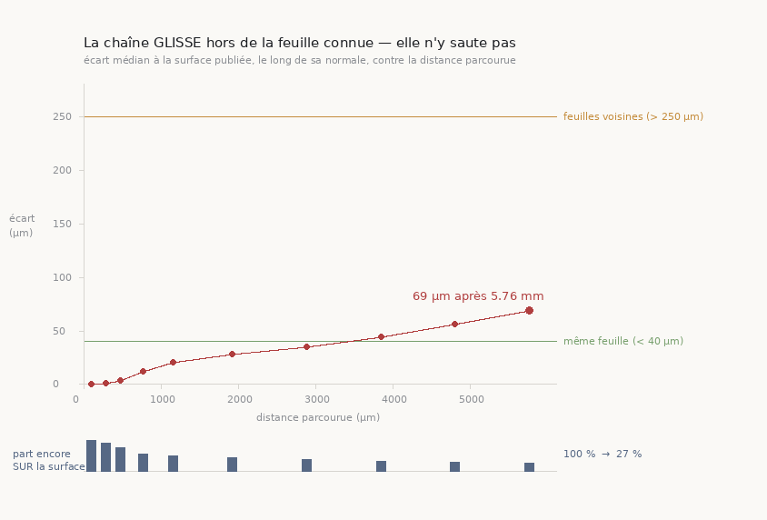

> ⭐⭐⭐ **Elle GLISSE, elle ne SAUTE pas.** L'écart croît de façon lisse et **monotone**, et
> il est **du même côté pour 73 % des points** — ce n'est ni un gauchissement, qui s'écarterait
> des deux côtés, ni un saut de spire, qui serait une marche brusque d'un écart inter-feuilles.
> C'est une **dérive systématique**, et les deux pannes n'ont pas le même remède : un saut se
> répare par un décalage d'une spire le long de la normale, une dérive par une correction de
> sa pente.
>
> ⭐⭐ **Et l'écart se lit contre les seuils du dépôt**, pas contre un nombre choisi :
> `carte_segments.py` publie **40 µm** (même feuille, raccordable) et **250 µm** (feuilles
> voisines, à ne surtout pas fusionner). À 5,76 mm la chaîne est à **69 µm** — elle a quitté la
> bande « même feuille » vers 3,5 mm, et elle est **encore loin** de la bande « feuille
> voisine ». Elle n'a donc pas changé de feuille ; elle n'est plus raccordable à celle-ci.
>
> ⭐ **La dérive DÉCÉLÈRE** : 15,9 µm/mm à 768 µm, 14,6 à 1 920 µm, 12,0 à 5 760 µm. Même forme
> que le plateau bas de l'avantage sur le hasard, mesuré juste au-dessus.

##### ⚠⚠ Deux explications concurrentes, écartées par la mesure et non par l'argument

1. **« Elle sort par le BORD du segment publié. »** C'était la première à écarter, et elle
   n'était pas exotique : le morceau de départ est découpé à l'origine `[29, 319]` d'une grille
   de 2 530 × 1 820, donc à **29 cases du bord**, soit 1,4 mm — pendant que la chaîne en
   parcourt 5,76. Mesuré : la part des points dont le plus proche voisin est **sur la bordure**
   du maillage publié vaut **0,0 % jusqu'à 2,9 mm et 0,1 % à 5,76 mm**. La chaîne reste dans
   l'emprise ; elle s'écarte de la surface, elle ne la quitte pas par le côté.

   > ⚠⚠⚠ **Et ma première version de ce contrôle NE POUVAIT PAS se déclencher.** Elle
   > définissait le bord par la *forme* de la grille — or le maillage publié laisse une marge
   > vide de **cinq cases** sur ses quatre côtés, donc aucune case valide n'était à moins d'une
   > case du bord déclaré, et « 0 % au bord » était vrai **par construction**. C'est une sonde
   > qui l'a dit, pas une relecture. Le bord est maintenant défini par là où le **valide**
   > s'arrête — une case valide qui touche une case invalide — ce qui est exact, tient compte
   > des trous, et n'a **aucune marge à choisir**.

2. **« C'est une distance latérale, pas une profondeur. »** L'écart total et l'écart **projeté
   sur la normale** du maillage publié sont mesurés séparément : 48,0 vox contre 28,8. La
   composante normale est donc bien réelle, et c'est elle qui porte le signe.

##### ⚠ Ce que ça ne dit toujours pas

- **Que la feuille voisine soit à 113 µm ici.** Les seuils 40 / 250 µm sont ceux du dépôt,
  argumentés ailleurs ; l'écart inter-spires de **ce** rouleau à **cet** endroit n'est pas
  mesuré dans cette passe.
- **Que le texte suive.** Une surface à 69 µm de la bonne feuille peut encore lire de l'encre —
  ou en lire d'une autre. Seule l'encre le dira, et l'encre demande un rendu de plusieurs
  heures, ce que cette mesure permet enfin de **cibler** : la découverte commence là où la
  couverture s'effondre, c'est-à-dire vers le maillon 8.
- **Que le maillage publié soit parfait.** Il est la meilleure vérité terrain disponible, pas
  une vérité.

**Reproduire** (quelques secondes, aucun voxel lu) :

```bash
uv run python src/nappe/couverture_publiee.py \
    --maillons 1 3 5 8 12 20 30 40 50 60 \
    --json docs/mesures/couverture_publiee.json
uv run python src/figures/figure_couverture.py
```

#### ⭐⭐⭐ Et le remède n'est PAS spéculatif : il est mesuré ailleurs, à 2,4 mm

[`41`](41_marcher_le_long_dune_nappe.md) §6 fait exactement le geste qui manque — suivre la
matière au lieu de la géométrie — et le mesure :

| ce qui guide | jusqu'où | ce qui l'arrête |
|---|---:|---|
| **la géométrie seule** (ce document) | **580 µm** | son propre pas s'emballe |
| **la matière** (`41`, transformée de distance + recentrage sur la crête) | ⭐ **≈ 2,4 mm** | **le bloc se termine** |

> ⭐⭐ **Un facteur quatre, et surtout deux natures d'arrêt différentes.** La chaîne géométrique
> s'arrête parce qu'elle se détruit ; la marche guidée par la matière s'arrête parce qu'on a
> cessé de lui en donner. La première a une limite, la seconde a un budget.

⚠⚠ **Le facteur quatre est à lire avec sa réserve, et elle est réelle** : les deux mesures ne
sont pas prises sur le même rouleau ni à la même échelle — `41` marche `PHerc1447` à
**8,64 µm** le voxel, cette page projette `PHercParis4` à **2,4 µm**. Ce qui se compare
proprement, ce sont les **natures d'arrêt** ; le rapport de distances, lui, est une indication
et pas un résultat. Le mesurer proprement demande de refaire la marche **ici**, ce que la
suite nomme.

⚠⚠ **Mais ce ne sont pas le même objet, et c'est ce qui reste à faire.** La marche de
[`41`](41_marcher_le_long_dune_nappe.md) suit **une ligne** — 283 points de passage — pendant
que la projection déplace une **nappe entière** de 14 280 points. Un chemin n'est pas une
bande, et un texte se lit sur une bande.

⭐ **La pièce manquante existe déjà et porte un nom** : `src/commun/suivre_nappe.py` expose
`champ_de_distance`, `normale_locale` et **`recentrer`** — recaler un point sur l'axe médian de
sa nappe. L'appliquer à **chaque point** d'une nappe projetée, à chaque maillon, c'est la
chaîne corrigée. Elle se jugerait avec les instruments de cette page, qui existent maintenant :
l'horizon du pas (gratuit), la carte du désaccord (gratuite), le profil (un rendu).

⚠ Et la contrainte pratique est nommée plutôt que découverte : `recentrer` a besoin de la
prédiction **autour de chaque point**, or la boîte de notre nappe fait ~10 milliards de voxels
au niveau 0. Il faudra donc travailler au **niveau 2** de la pyramide (~156 Mio) — et
[`54`](54_cinq_rendus_vides.md) a écrit ce que coûte d'oublier à quel niveau on est.

⚠⚠ **Ce que ce n'est PAS** : `--correct` du traceur officiel. Celui-là a été mesuré par
[`43`](43_la_chaine_des_spires.md) — *« 318 puis 5 695 points ne réorientent pas ce qui a
poussé, +0,89 au mieux »* — et [`42`](42_la_boucle_tourne_et_ne_suffit_pas.md) porte le
verdict dans son titre. Corriger une trace **après** qu'elle a poussé et recaler une nappe
**avant** de la reprojeter sont deux gestes différents ; seul le second reste ouvert.

⭐ **Le sondage a coûté quelques secondes** — vingt projections et aucun rendu — là où le
mesurer par des profils aurait demandé vingt rendus dont la moitié irrendables. C'est le mode
`PROFILS=0` de la campagne, et il ne peut que **réfuter** : un pas stable est nécessaire, pas
suffisant, puisqu'une chaîne peut garder un pas parfait en marchant droit hors de sa feuille.

⚠⚠ **Ce que ça ne dit PAS, et c'est ce qui empêche d'en conclure que la chaîne est morte** :
ces trois points mesurent une projection **pure**, sans réoptimisation. Une vraie chaîne
recollerait la nappe projetée sur la matière — c'est le rôle de `--correct`, que ce document
nommait déjà. Ces chiffres sont donc le **plancher** de ce qu'une chaîne tangentielle peut
faire, pas son plafond.

⭐ Neuf points couvrent maintenant 0 à 2,4 mm, et la zone qui portait le doute — 238 à 476 µm —
en a trois. ⚠ Ce qui reste non échantillonné est l'intervalle **381 → 476 µm**, où le pic au
bord passe de 0 à 18 % : on sait que la nappe quitte sa feuille là, pas exactement où.

⚠ Deux défauts de l'outillage trouvés en chemin, tous deux de la famille « vérification
incapable d'échouer ». La campagne a d'abord gagné une colonne « médiane » dans son **en-tête**
pendant que son extraction rendait toujours `bloc_absent` — et la sonde restait verte parce
qu'elle cherchait le *mot* `valeur_mediane` dans le fichier, où il figurait ailleurs. Elle
compare désormais la **colonne** à la donnée, sur une fixture. Et dans un `chk` qui est une
**fonction**, `$1` désigne l'argument de la fonction et non la colonne : le symptôme
(`$3: unbound variable`) ne ressemblait pas du tout à la cause.

### ⏳ Et la question la moins chère n'avait jamais été posée

Avant d'écrire un mécanisme, il fallait vérifier ce que `resume` fait déjà — c'est le seul des
trois modes qui étende une surface le long d'elle-même. La campagne `spires_repousse` de
[`43`](43_la_chaine_des_spires.md) §6 l'a fait, **avec `resume_generations = 20` et cette
valeur seule** :

| | aire | α |
|---|---:|---:|
| source (segment officiel) | 7,12 cm² | +0,000 |
| après 20 générations de repousse | **12,54 cm²** | **+0,422** |

⭐ Donc `resume` étend **réellement** — +76 % d'aire — et il dérive **dès le premier coup**.
Mais rien n'est su de ce qui se passe **entre 1 et 20 générations**, et c'est là que la
question se joue : s'il existe un régime où la surface gagne de l'aire en restant convergée,
la chaîne tangentielle est possible.

`src/outils/etendre_nappe.sh` balaie `resume_generations` sur **la même** surface convergente, à
conception appariée (même source, même aplatissement, mêmes fenêtres, une seule variable).
Il **refuse** de partir d'une source dont le verdict écrit n'est pas « converge » — étendre
une surface posée en travers de l'empilement ne mesure rien — et les trois chemins de refus
sont testés. Campagne lancée sur 1, 3 et 10 générations ; le point à 20 n'est pas refait,
il est déjà mesuré.

### ⭐⭐ Premier résultat : étendre le segment officiel triple sa surface utile

Une seule exécution de `mode: resume` sur le segment officiel qui converge :

| | grille | sommets valides | **aire utile** | **arc** | % d'un tour | rayon |
|---|---|---:|---:|---:|---:|---|
| source officielle | 162×149 | 59 % | **4,28 cm²** | 21,9 mm | 11,5 % | indéterminé |
| après extension | 219×206 | ⭐ **96 %** | ⭐ **12,97 cm²** | ⭐ **37,2 mm** | **15,4 %** | indéterminé |

Et le verdict : **α = +0,000, converge**, 0 auto-intersection.

⚠⚠ **Mesuré avant que le traçage soit rendu reproductible** : ce n'était qu'un des trois
tirages, dont un donnait +0,422. Le résultat a été **refait sous graine** et il tient —
12,97 cm² d'aire utile à α = +0,000, octet pour octet rejouable. Voir deux sections plus bas.

⭐⭐ **L'extension ne fait pas qu'ajouter de la grille, elle rebouche les trous** : la part de
sommets valides passe de 59 % à 96 %. C'est la première fois dans ce dépôt qu'une surface que
nous produisons **gagne** de la surface — la chaîne radiale, elle, en **perd** 15,6 % par tour.

⚠⚠ **Une revendication retirée** : j'avais écrit que le rayon devenait **déterminé** sur cette
surface. C'était vrai du tirage non déterministe (40,8 et 47,9 mm, accord à 17 %) et **faux du
run reproductible**, où les deux estimateurs donnent 38,4 et 47,9 mm — soit 25 % d'écart, donc
toujours indéterminé (§6). Étendre la plaque ne suffit pas à résoudre le rayon ; ce que ça
change est l'arc, pas la courbure.

⚠ Ça reste **une** surface, et l'extension va dans **toutes** les directions — la hauteur
monte aussi de 24,4 à 34,2 mm. « Tangentiel » décrit ce que la surface **est**
géométriquement (une nappe s'étend le long d'elle-même), pas une direction qu'on aurait
choisie.

### ⚠⚠⚠ CORRECTION — ce résultat est UN TIRAGE, pas une propriété

Le balayage a fini, et ses trois points se contredisent alors que leurs paramètres effectifs
sont les mêmes :

| réglage (ignoré) | aire | auto-intersections | α |
|---|---:|---:|---:|
| 1 | 12,96 cm² | **0** | **+0,000** converge |
| 3 | 13,01 cm² | **596** | **+0,422** intermédiaire |
| 10 | 12,98 cm² | **0** | **+0,000** converge |

Trois exécutions censées faire la même chose donnent 0, 596 et 0 croisements. Ce n'est pas le
paramètre balayé — il est ignoré, §précédent. **C'est de l'aléa**, et la source le confirme sur
deux points :

1. **Le générateur des perturbations est `thread_local` et, sans graine, semé par
   `std::random_device`** (`GrowPatch.cpp:99-107`). Avec 22 threads OpenMP, ce sont 22
   générateurs irreproductibles. La graine se pose par la variable d'environnement
   **`VC_GROWPATCH_RNG_SEED`** (ligne 83) — pas par une clé de paramètres, et la fonction
   `set_random_perturbation_seed` est marquée `[[maybe_unused]]`, donc jamais appelée.
2. **Le nombre de threads.** L'outil l'écrit lui-même au démarrage : *« tracing does not scale
   past a few threads. Set "thread_limit" in the params JSON (VC3D uses 1) »*. Même avec une
   graine identique partout, l'ordre d'attribution du travail peut varier.

⚠⚠ **Ce que ça fait au résultat ci-dessus** : le ×3 d'aire utile à α = +0,000 est **un tirage
sur trois**, dont deux bons et un mauvais. Ce n'est donc pas « étendre le segment officiel
converge » mais « converge **deux fois sur trois**, sur trois tirages » — ce qui est une
distribution, pas une propriété, et bien plus faible que ce que j'avais écrit.

⚠⚠ **Et ça se propage en arrière** : la campagne `spires_repousse`
([`43`](43_la_chaine_des_spires.md) §6) tournait aussi sans graine et sur 22 threads. Son
+0,422 peut donc être le même mauvais tirage, et non « resume sur une surface projetée
dérive ». **Le contraste source-officielle contre source-projetée que je venais de publier
n'est pas établi.**

⭐ La suite est déterminée par ça, et rien d'autre : `src/outils/etendre_nappe.sh` pose désormais
`VC_GROWPATCH_RNG_SEED` et `thread_limit: 1`, et sait **répéter un même réglage** — un réglage
qui apparaît deux fois dans la liste reçoit un dossier suffixé, sinon le second écraserait le
premier et le test serait impossible à faire. Le premier run est un **test de déterminisme** :
deux fois exactement la même chose. Tant qu'il n'est pas passé, aucun balayage ne veut dire
quoi que ce soit.

### ⭐⭐⭐ Le correctif est vérifié : deux exécutions identiques donnent le MÊME maillage

Avec `VC_GROWPATCH_RNG_SEED` posée et `thread_limit: 1`, la même commande lancée deux fois
produit un maillage **identique octet pour octet** — 13,024947 cm² d'aire de méta des deux côtés (à ne pas confondre avec l'aire UTILE, 12,97 cm²), à la
sixième décimale. Le traçage par croissance est donc **reproductible**, et il ne l'était pas.

Et le résultat qui survit à la correction :

| | aire utile | arc | auto-intersections | α |
|---|---:|---:|---:|---:|
| source officielle | 4,28 cm² | 21,9 mm | — | +0,000 |
| **extension reproductible** | ⭐ **12,97 cm²** | ⭐ **37,2 mm** | **0** | ⭐ **+0,000** |

⭐ Et un contrôle indépendant de l'identité des deux répétitions : `geometrie_chaine.py` mesure
un **écart de 0 µm** entre elles — la distance au plus proche voisin entre les deux surfaces
est nulle, ce que `cmp` disait déjà sur les octets mais qu'un second instrument confirme.

> **Étendre le segment officiel triple sa surface utile en la laissant sur sa feuille, et
> c'est maintenant rejouable.** Sans la graine, un tirage sur trois donnait +0,422.

⚠⚠ **Ce que ça implique pour tout le dépôt, et c'est plus large que cette page** : *toute*
campagne passée par le chemin de **croissance** était irreproductible — les dix-sept essais en
`mode: seed` de [`42`](42_la_boucle_tourne_et_ne_suffit_pas.md), et la repousse de
[`43`](43_la_chaine_des_spires.md) §6.

- ⭐ Pour les dix-sept essais, ça ne change **rien, et ça renforce même** : dix-sept tirages
  indépendants tous à α ≈ 1 échantillonnent la distribution au lieu de répéter un point. La
  conclusion « `mode: seed` ne pose jamais une surface sur une feuille » en sort plus solide,
  pas moins.
- ⚠ Pour la repousse, ça change tout : son **unique** point à +0,422 est un tirage, donc
  « resume sur une surface projetée dérive » n'est pas établi. À refaire avec la graine.

⭐ La chaîne radiale, elle, n'est pas concernée : `gen_neighbor` n'a aucun aléa (vérifié dans
la source), d'où les maillages identiques au bit entre campagnes constatés plus haut. Le
non-déterminisme est propre au chemin de croissance, et c'est pourquoi il n'avait jamais été
remarqué.

### ⏳ Le budget d'extension scale, et l'outil sait maintenant enchaîner

Le vrai bouton est `generations` (§suivant), et son effet est déjà lisible dans le journal du
traceur avant même le jugement : **`generations = 100` produit 13,0 cm², `generations = 200`
en produit 28,4**. Doubler le budget double à peu près l'étendue. Reste à savoir si α survit —
c'est ce que le balayage en cours mesure.

### ⚠⚠ Et le gros budget NE tient pas — la réponse est nette

| budget | aire | auto-intersections | croisements/cm² | α |
|---:|---:|---:|---:|---:|
| **100** | 12,97 cm² | ⭐ **0** | **0** | ⭐ **+0,000** converge |
| 200 | 28,62 cm² | ⚠⚠ **25 036** | 875 | ⚠⚠ **+1,313** en travers |
| 400 | 78,30 cm² | ⚠⚠ **168 104** | 2147 | *(inutile de juger)* |

Doubler le budget double l'aire **et détruit la convergence**. Les 25 036 auto-intersections
sont le mécanisme rendu visible : une surface qui s'étend trop **se replie sur elle-même**.

> **Donc le chemin vers une grande bande passe par l'enchaînement de petits pas, pas par un
> seul grand.** C'est l'inverse de ce que j'espérais une demi-heure plus tôt, et ça rend la
> capacité d'enchaînement nécessaire au lieu d'être un repli.

⭐ Le point à 400 a été obtenu **gratuitement** : sa croissance était finie quand j'ai arrêté
la campagne devenue sans objet, donc le maillage existait et son compte de croisements ne coûte
aucun rendu.

⭐⭐ **Et ça donne une porte gratuite**, ajoutée à l'outil : refuser de payer les deux rendus
quand les croisements dépassent **100 par cm²** — un ordre de grandeur au-dessus du cas qui
converge (0) et presque un ordre en dessous du premier qui casse (875).
⚠ Ce n'est **pas** un critère de qualité, et [`43`](43_la_chaine_des_spires.md) §4 explique
pourquoi : un compte de croisements est une propriété de l'**échantillonnage** autant que de la
surface — le même maillage décimé passe de 240 à 49. Le plafond ne sert qu'à ne pas brûler
vingt minutes de rendu sur une surface manifestement repliée. Une surface sous le plafond
n'est pas déclarée bonne : elle est jugée normalement.

### ⭐⭐ La voir, et découvrir que α cache une minorité

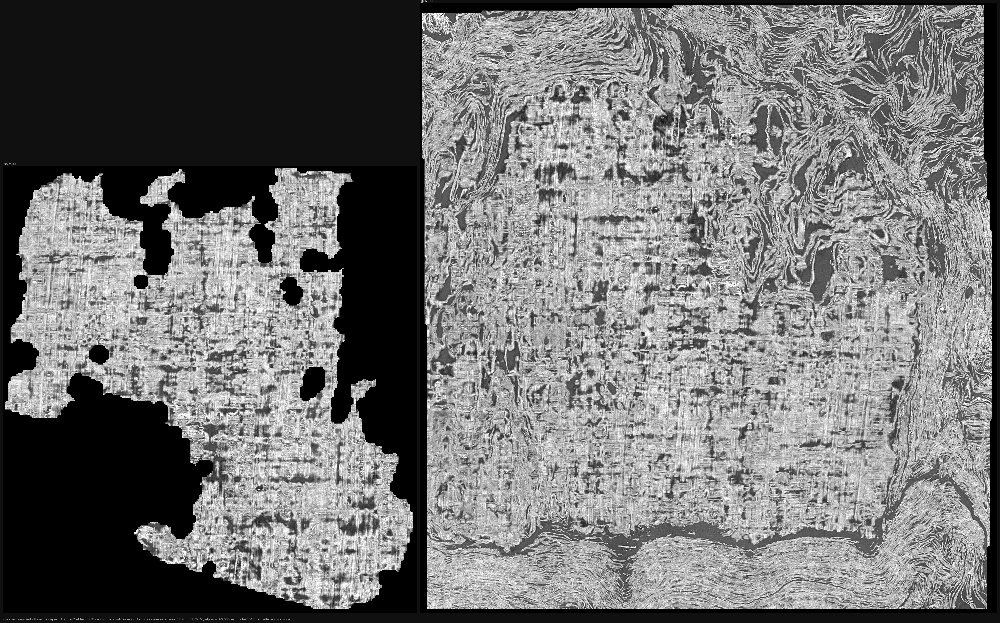

À gauche le segment officiel de départ, à droite la même nappe après une extension, **à
l'échelle relative vraie**. Les trous noirs de gauche sont les 41 % de sommets invalides ; à
droite ils sont rebouchés, et le treillis de fibres continue sur une surface bien plus large.

⚠⚠ **Mais la périphérie de droite n'a pas la même texture que son cœur** : le haut-droite, le
bas et le bord gauche montrent des laminations tourbillonnantes, qui sont exactement ce à quoi
[`38`](38_ce_qui_bouge_avec_la_fenetre.md) dit que ressemble une surface posée *en travers* de
l'empilement. Regarder l'image a donc posé une question que le verdict ne posait pas — et
l'instrument pour y répondre existait déjà, calculé pour chaque surface :

| surface | pic **au bord** | fenêtres plates | écart médian |
|---|---:|---:|---:|
| source officielle | **0,000** | 0,000 | 17,3 µm |
| **extension budget 100** | **0,091** | 0,083 | ⭐ **17,3 µm** |
| extension budget 200 *(cassée)* | 0,305 | 0,464 | 73,4 µm |
| spire radiale qui casse | 0,250 | 0,000 | 77,8 µm |

⭐ **L'écart médian de l'extension est 17,3 µm — exactement celui du segment officiel.** Le
gros de la surface est donc aussi bien posé que la référence, ce qui est plus fort que ce que
α seul disait.

⚠⚠ **Et 9,1 % de ses fenêtres ont leur pic AU BORD**, contre 0,0 % pour la source : environ un
dixième de l'extension n'a aucune feuille à portée. C'est la périphérie qu'on voit tourbillonner
sur l'image, et **α ne le montre pas** — parce qu'il est calculé sur une **médiane**, et qu'une
médiane est insensible à une minorité.

> **α cache une minorité mauvaise.** C'est une limite de l'instrument, pas de cette surface :
> tout verdict α de ce dépôt en hérite. Le complément est `au_bord_relief`, qui est déjà
> calculé partout et qu'il suffit de lire à côté.

⭐ **Et il n'est plus « à côté » : chaque verdict le porte.** `test_convergence.py` accepte
`--au-bord` et, au-delà de **5 %**, ajoute une **réserve** au verdict — pas un second verdict,
la mention qu'une part de la surface échappe à celui qui est rendu. Les deux scripts de
campagne le transmettent, lu dans le profil de la fenêtre la plus **étroite** : c'est là que
« le pic tombe au bord » a un sens, une fenêtre large finissant par contenir quelque chose.

Concrètement, deux α strictement identiques ne se lisent plus pareil :

```
source officielle     ✅ CONVERGE — la matière est là, tout près
extension budget 100  ✅ CONVERGE — la matière est là, tout près
                      — ⚠ mais 9 % des fenêtres ont leur pic AU BORD : cette part de la
                        surface n'a aucune feuille à portée, et α ne le montre pas
```

⚠ Le seuil de 5 % vient des cas mesurés : 0,0 % sur la référence et sur les spires radiales
qui convergent, 9,1 % sur l'extension, 25 à 31 % sur celles qui cassent. Et un témoin vérifie
qu'il n'est **pas nul** — sinon tout porterait une réserve et la mention ne voudrait plus rien.

⚠⚠ **Une réserve sur la réserve.** `au_bord_relief` est une **fraction**, donc mécaniquement
sensible au rapport périmètre/aire : une petite surface a proportionnellement plus de bord.
Mesuré, l'effet existe — l'extension à budget 50 (7,54 cm²) affiche **12 %** contre **9 %**
pour celle à budget 100 (12,97 cm²), donc la plus petite paraît pire.

⭐ **Mais la taille n'explique pas tout, et c'est la référence qui le prouve** : le segment
officiel est la **plus petite** des trois (4,28 cm²) et il est à **0 %**. Le rapport
périmètre/aire ne peut donc pas produire à lui seul les 9 ou 12 % des extensions — il y a bien
une périphérie que la croissance pose mal. La leçon est de ne pas comparer deux surfaces de
tailles très différentes sur cette fraction sans y penser, pas de la disqualifier.

⚠ La formulation de la réserve **dépend du verdict**, et ma première version ne le faisait
pas : elle disait « et α ne le montre pas » même sur une surface déjà condamnée, où α le
montre parfaitement. Elle **alerte** quand α est bon et **chiffre l'étendue du mal** quand il
est mauvais — trouvé en lisant la sortie, pas en relisant le code.

⭐ Conséquence pratique pour l'enchaînement, et c'est une prédiction que la chaîne en cours
teste : si chaque pas ajoute ~9 % de périphérie mauvaise, l'enchaînement la **compose**.

### ⚠⚠ « Enchaîner à budget constant » n'existe pas — le budget est CUMULATIF

Première chaîne lancée, quatre pas au budget 100. Le deuxième pas rend **exactement la même
aire que le premier** — 13,02 cm², 0 croisement, α = +0,000. Il n'a rien ajouté.

Le journal du traceur le dit en toutes lettres :

```
GrowPatch work grid 271x258 (resume=219x206, extra_cols=1, extra_rows=1, …)
Resuming from generation 99 with 43430 points.
```

Un `resume` **reprend le compteur de générations de la surface reprise** et s'arrête dès que
`generation >= stop_gen` (`GrowPatch.cpp:4680`). La surface étendue est déjà à la génération
99 ; avec `generations: 100`, il ne reste **qu'une** génération à faire, et une génération sur
une grille de 219×206 n'ajoute rien de mesurable.

⭐ **Donc « enchaîner à budget constant » n'est pas une opération.** Ce qui existe, c'est
atteindre un budget total **en plusieurs séances**, chacune relançant l'optimisation globale.
Le pas *I* doit viser *I × G*.

⭐⭐ **Et ça rend la question de la chaîne beaucoup plus nette qu'elle ne l'était** :

> Atteindre le budget 200 **en deux fois 100** vaut-il mieux que l'atteindre **d'un coup** —
> ce qui a été mesuré à α = +1,313, 25 036 auto-intersections ?

Même budget final, deux chemins. Si le passage par une étape intermédiaire — qui relance
l'optimisation depuis une surface convergente — suffit à garder la nappe sur sa feuille, alors
la bande peut grandir par paliers. Sinon, l'extension a une taille maximale et il faudra
autre chose.

⚠ La première chaîne a été arrêtée dès le diagnostic : continuer aurait fait deux pas de plus
à une génération chacun, c'est-à-dire quarante minutes de rendu pour rien.

### ⚠⚠ Enchaîner AIDE beaucoup — et ne suffit pas

Même budget final de 200, deux chemins :

| chemin | aire | auto-intersections | α | pic au bord |
|---|---:|---:|---:|---:|
| **d'un coup** | 28,62 cm² | 25 036 | +1,313 | 30 % |
| **en deux fois 100** | ⭐ **50,30 cm²** | ⭐ **4 996** | **+1,040** | ⚠⚠ **56 %** |

⭐ Le découpage donne **76 % d'aire en plus** et **cinq fois moins** de croisements. Passer par
une étape intermédiaire — qui relance l'optimisation depuis une surface convergente — aide
donc beaucoup.

⚠⚠ **Et ça ne suffit pas** : la surface reste posée en travers. Le script s'est arrêté de
lui-même plutôt que de payer un troisième pas, ce qui est la garde faite pour ça.

⭐⭐ **Et les deux mesures se contredisent, ce qui est précisément le point du §précédent** :
la chaîne a un **meilleur α** (+1,040 contre +1,313) et une **part au bord bien pire** (56 %
contre 30 %). Juger sur α seul aurait donc conclu « la chaîne est meilleure » ; le complément
dit que sa part mauvaise a presque doublé. Une médiane peut s'améliorer pendant qu'une
minorité empire.

⏳ La question qui reste est celle du **pas** : 100 par séance était encore trop gros à ce
stade. Chaîne à pas de 50 lancée — si l'amélioration continue quand le pas diminue, il existe
une taille de pas qui tient, et la bande peut grandir indéfiniment.

⚠ **Le câblage de la réserve n'avait PAS pris sur cette campagne**, et pour une bonne raison :
`lancer.sh` **gèle une copie du script avant de lancer**, donc une campagne en cours ignore les
éditions faites pendant qu'elle tourne. C'est le garde-fou qui fait son travail — il a déjà
sauvé une campagne le 2026-08-20. Les deux verdicts ont été **re-jugés depuis leurs profils
existants**, sans aucun rendu.

### ⭐⭐⭐ Rogner la périphérie tardive la ramène de 9 % à 2 %

Si la mauvaise périphérie est ce qui a poussé **en dernier**, alors l'information pour la
retirer est déjà dans le maillage : `generations.tif`, le compteur par sommet. Rogner par
génération ne demande **aucun rendu**.

Distribution mesurée sur l'extension : **33 %** des sommets sont à la génération 1 — le segment
source hérité — et **41 %** viennent des générations 50 à 99. La croissance accélère sur la fin.

| surface | aire utile | α | **pic au bord** |
|---|---:|---:|---:|
| source officielle | 4,28 cm² | +0,000 | 0 % |
| extension | 12,97 cm² | +0,000 | 9 % |
| extension rognée à gen ≤ 50 | 7,59 cm² | +0,000 | ⭐ **7 %** |
| **extension rognée à gen ≤ 25** | **6,93 cm²** | +0,000 | ⭐⭐ **2 %** |

> **L'hypothèse est confirmée : la mauvaise périphérie EST ce qui a poussé en dernier.** La
> retirer ramène la part sans feuille de 9 % à **2 %** — presque le niveau de la source — tout
> en gardant **62 % de surface en plus** qu'elle.

⭐ Et ça ouvre un cycle que rien d'autre n'ouvrait : **rogner → étendre → rogner → étendre**.
Chaque tour devrait rendre du terrain (+62 %) en revenant à une périphérie propre, là où
enchaîner sans rogner propage le défaut ([§précédent](#-découper-aide-ou-nuit--et-ce-qui-décide-nest-pas-la-taille-du-pas)).
L'extension depuis la nappe rognée est lancée, avec **la même quantité de croissance** que la
première (cent générations de plus) pour que la comparaison soit appariée.

⚠ Ce que le rognage **ne** dit **pas** : que « poussé en dernier » et « mal posé » sont la même
chose. Ils **coïncident** ici, ce qui est mesuré ; le lien de cause n'est pas établi et n'a pas
besoin de l'être pour que le remède marche.

⚠ `rogner_nappe.py` recopie `meta.json` avec son `area_cm2` **recalculé** — le laisser tel quel
ferait lire à tout consommateur l'aire d'avant le rognage. Un témoin vérifie qu'il ne vaut plus
la valeur d'origine.

### ⭐⭐⭐ LE CYCLE SE REFERME — et ce qui le commande est la propreté de la source

L'extension depuis la nappe rognée à **0 %** rend **α = +0,000, converge**. Les trois
extensions, appariées sur ce qui compte :

| extension | source | **bord de la source** | résultat | α | bord |
|---|---|---:|---:|---:|---:|
| 1 | segment officiel, 4,28 cm² | **0 %** | 12,97 cm² | ⭐ **+0,000** | 9 % |
| 2 | rognée à gen ≤ 25, 6,93 cm² | 2 % | 12,38 cm² | ⚠ +0,422 | 6 % |
| **3** | **rognée à gen ≤ 10, 6,02 cm²** | **0 %** | **8,13 cm²** | ⭐ **+0,000** | 4 % |

> **Ce qui prédit le succès d'une extension est la propreté de la périphérie de sa source** —
> pas la taille du pas, pas le budget, pas le nombre de séances. Deux sources à 0 % donnent
> +0,000 ; celle à 2 % donne +0,422.

⭐ Et ça referme la boucle **rogner → étendre** que la section précédente donnait pour perdue :
la tentative qui avait échoué partait d'une surface à 2 %, pas d'une surface propre.

⚠ **La question qui reste est celle du gain net** : l'aire *propre* croît-elle d'un tour à
l'autre, ou le cycle est-il un tapis roulant ? Un tour complet donne 4,28 → 6,02 cm²
(**+41 %**) ; il faut savoir ce que le second rend.

⚠⚠ **Et une erreur de ma part, corrigée par la mesure, qui vaut d'être écrite.** J'ai d'abord
rogné l'extension 3 aux mêmes seuils que la première (20, 30, 45) — et les trois ont rendu
**exactement** la même surface, 20 164 sommets, c'est-à-dire la source telle quelle. La raison
est dans la distribution des générations, que je n'avais pas regardée :

| | valeurs de génération distinctes | où vit la croissance |
|---|---:|---|
| extension 1 | **99** | étalée de 1 à 99 |
| extension 3 | **20** | gens 1–10 héritées, puis **tout entre 100 et 109** |

Un `resume` ne renumérote pas : il **continue** le compteur près de son plafond. Trimmer
au-dessous de 100 retire donc *toute* la croissance d'un coup, et il n'existe aucun état
intermédiaire dans cette plage. Les seuils utiles pour l'extension 3 sont **103 et 106** — qui
donnent 6,87 et 7,51 cm², à comparer aux 6,02 cm² de la source propre. Jugement lancé, et la
campagne aux mauvais seuils a été arrêtée dès le diagnostic plutôt que de rendre trois verdicts
identiques.

### ⚠⚠ Le gain net, lui, est nul : le cycle est un point fixe autour de 6 cm²

Rogner l'extension 3 dans la bonne plage de générations :

| | aire utile | α | **pic au bord** |
|---|---:|---:|---:|
| cycle 1, point propre | 6,02 cm² | +0,000 | ⭐ **0 %** |
| cycle 2, rogné à gen ≤ 103 | 6,87 cm² | +0,000 | 3 % |
| cycle 2, rogné à gen ≤ 106 | 7,51 cm² | +0,000 | 2 % |

Les deux verdicts sortent du chemin de jugement partagé, appelé par
[`src/outils/juger_rognages.sh`](../src/outils/juger_rognages.sh) — `src/outils/juger_rognages.sh
data/rogne_cycle2 cycle2_`. ⚠ L'étiquette fait partie du **nom** du résultat, donc elle est
écrite dans le script : sans elle `docs/mesures/cycle2_gen103.json` n'avait aucun producteur dans
l'arbre, et l'audit des artefacts le signalait — à raison, la commande vivait dans un terminal.

⚠⚠ **Aucun des deux ne revient à 0 %.** Et le seul moyen d'y revenir est de rogner sous la
génération 100 — ce qui, on l'a vu, rend **exactement** la surface du cycle 1, 6,02 cm². Les
options du second tour sont donc : 6,02 cm² **propre** (identique au tour précédent), ou 7,51
cm² **à 2 %** — et une source à 2 % est mesurée pour rendre α = +0,422 au tour suivant.

> **Le cycle rogner-étendre ne diverge pas : il converge vers un point fixe autour de 6 cm² de
> surface propre.** Chaque tour regagne ce qu'il vient de perdre.

⭐ Ce qui reste, et qui est réel : **une extension unique triple n'importe quel segment officiel
qui converge** (4,28 → 12,97 cm², α = +0,000), et **on sait la ramener à une qualité de source**
en rognant (6,02 cm² à 0 %, soit +41 % de matière propre en plus). Ce n'est pas la bande
continue que le graal demande, mais c'est un gain net sur de la matière déjà validée, et c'est
mesuré des deux côtés.

### ⚠⚠ Et le raccordement de segments officiels n'a AUCUN candidat — mesuré pour 4,5 Mo

La voie qui restait nommée était de partir de plusieurs segments officiels et de les
**raccorder** : `vc_merge_tifxyz` sait le faire — recouvrement par index de patchs, RANSAC,
ajustement de faisceau affine conjoint, TPS RBF, fusion EDT à N voies. Il exige des surfaces
**qui se recouvrent**.

⭐ Le dépôt public de `PHerc1447` en publie **15 segments**, et ce dépôt n'en avait jamais
utilisé qu'un. La question — se recouvrent-ils ? — se lit sans télécharger un maillage : leurs
`meta.json` portent une boîte englobante. **51 paires sur 105 se recouvrent d'au moins 5 %**,
beaucoup à 90–100 %.

⚠⚠ **Mais un recouvrement de boîtes ne distingue pas « deux patchs d'une feuille » de « deux
feuilles voisines »** — dans un rouleau, deux nappes séparées de 113 µm occupent presque le
même volume. Le discriminant est celui construit plus haut pour la chaîne radiale : la
**distance médiane au plus proche voisin**.

Les maillages font 0,1 Mo par canal, donc les quinze coûtent **4,5 Mo** :

| écart médian | ce que ça veut dire | paires |
|---|---|---:|
| **< 40 µm** | deux patchs de la **même feuille** — raccordables | ⚠⚠ **0** |
| 40 à 250 µm | nappes **voisines** — à ne surtout pas fusionner | 2 *(79 et 89 µm)* |
| ≥ 318 µm | plusieurs feuilles d'écart | 45 |
| *hors de portée* | aucun point à moins de 432 µm — donc éloignées aussi | 4 |

Soit **0 paire sous 40 µm**, **2 paires entre 40 et 250 µm**, et le reste
— **45 mesurées et 4 hors de portée** — à plusieurs feuilles d'écart.

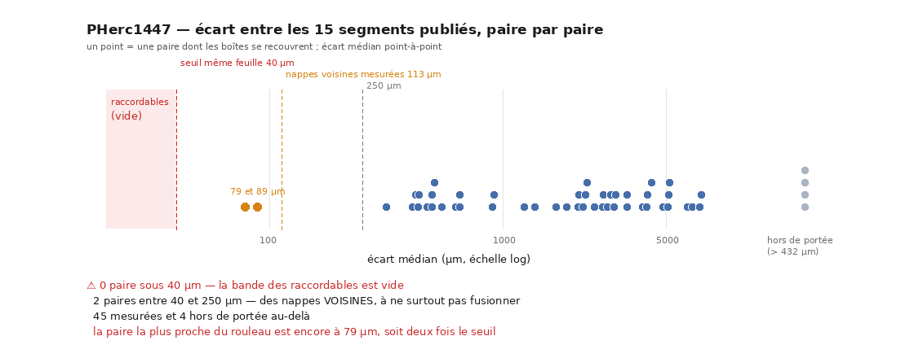

⭐ **Ce que la figure ajoute au tableau.** Un compte de zéro se lit comme « on n'a pas
trouvé », c'est-à-dire comme un résultat faible. La distribution montre autre chose : il n'y a
pas *un peu* moins de candidats que prévu, il y a un **trou d'un facteur deux** entre le seuil
et la paire la plus proche du rouleau. Elle est produite par
[`src/figures/figure_segments.py`](../src/figures/figure_segments.py), dont le témoin vérifie
que les quatre bandes **totalisent** les paires jugeables — la sonde qui aurait attrapé la
faute corrigée juste en dessous.

⚠ **Correction d'un chiffre publié la veille.** La première version de ce tableau écrivait 49
dans la dernière ligne : elle supposait que les 51 paires recouvrantes avaient toutes été
mesurées, alors que 4 ne l'ont pas été. L'outil rendait `None` pour trois raisons différentes —
maillage illisible, patch trop maigre, *aucun point à moins de la marge* — et seule la
troisième est une mesure, celle qui dit « ces deux nappes sont loin ». `ecart_entre` rend
désormais une **raison** à côté de sa valeur, et `verifier_chiffres.py` recompte les quatre
bandes depuis le JSON. Personne ne relit une somme de trois nombres ; une machine, si.

⚠ **Et la paire la plus proche du rouleau est encore à 79 µm** — près du double du seuil de
même-feuille, et de l'ordre de l'espacement entre nappes voisines mesuré au §4 (113 µm). Ce
n'est pas « on n'a pas trouvé de candidat » : c'est **la bande des candidats est vide**, et son
plus proche voisin est à deux fois le seuil.

> **Aucun des 15 segments publiés n'est un patch de la même feuille qu'un autre.** La
> segmentation publiée de ce rouleau est un ensemble d'échantillons **un patch par feuille**,
> pas le pavage d'une feuille. Il n'y a donc rien à raccorder, et `vc_merge_tifxyz` n'a pas de
> candidat ici.

⭐ Ce que ça coûte de le savoir : **4,5 Mo et quelques secondes**, contre monter un volpkg,
écrire une grille de fusion et lancer un merge qui aurait échoué faute d'arêtes.

⭐⭐ **Et ça referme la boucle de tout ce travail.** Pour couvrir un tour il faudrait *produire*
soi-même les patchs voisins — et l'extension tangentielle est le seul mécanisme qui sache le
faire, or elle converge vers un point fixe. Les deux voies vers une bande continue sont donc
mesurées et fermées, chacune par sa propre raison.

⚠ Ce qui reste, et que rien de mesuré ici n'exclut : un mécanisme que ce dépôt n'a pas encore —
ou une segmentation publiée plus dense qu'aujourd'hui. `src/commun/carte_segments.py` refait
la carte en une commande le jour où le dépôt public grandit.

### ⚠⚠ ~~Mais le cycle ne se referme pas — l'extension est une opération UNIQUE~~ *(réfuté ci-dessus)*

Étendre depuis la nappe rognée, avec exactement la même quantité de croissance que la première
fois (cent générations de plus) :

| | aire utile | α | pic au bord |
|---|---:|---:|---:|
| extension 1, depuis la source *(0 % au bord)* | 12,97 cm² | ⭐ **+0,000** | 9 % |
| **extension 2, depuis la rognée** *(2 % au bord)* | 12,38 cm² | ⚠ **+0,422** | ⭐ **6 %** |

⭐ La croissance, elle, marche : 6,93 → 12,38 cm², soit **+79 %**, du même ordre que le +203 %
de la première. Et le rognage tient sa promesse sur la périphérie — **6 %** contre 9 %.

⚠⚠ **Mais α passe de +0,000 à +0,422.** Ce qui se dégrade n'est pas le bord, c'est le
**placement du cœur**. Et c'est la troisième fois que les deux mesures divergent : meilleure
périphérie, plus mauvais α.

> **Sur ces données, l'extension tangentielle est une opération UNIQUE.** Elle fonctionne une
> fois, depuis un segment officiel intact, et rien de ce qui a été essayé ne permet de la
> répéter : ni un budget plus grand, ni un découpage en séances, ni un rognage entre deux.

⭐ Ce qui reste acquis et vaut la peine : **n'importe quel segment officiel qui converge peut
être triplé une fois, en gardant α = +0,000.** Ce n'est pas une chaîne, mais c'est un facteur
trois gratuit sur de la matière déjà validée.

### ⭐⭐ La profondeur du rognage commande la propreté, et elle atteint 0 %

| rognage | aire utile | α | **pic au bord** |
|---|---:|---:|---:|
| **gen ≤ 10** | **6,02 cm²** | +0,000 | ⭐⭐ **0 %** |
| gen ≤ 25 | 6,93 cm² | +0,000 | 2 % |
| gen ≤ 50 | 7,59 cm² | +0,000 | 7 % |
| *(non rognée)* | 12,97 cm² | +0,000 | 9 % |
| *(source officielle)* | 4,28 cm² | +0,000 | 0 % |

Monotone : plus on retire de générations tardives, plus la périphérie est propre. Et à
**gen ≤ 10** on retrouve **exactement la qualité de la source — 0 % au bord — en gardant
41 % de surface en plus qu'elle**.

⭐⭐ **C'est le point de départ que le test du cycle n'avait pas.** La tentative précédente
partait d'une surface à 2 % et rendait α = +0,422 ; celle-ci part d'une surface à **0 %**,
comme la toute première extension. Les deux sont donc enfin appariées sur ce qui compte :

| extension | source | bord de la source | α obtenu |
|---|---|---:|---:|
| 1 | segment officiel, 4,28 cm² | 0 % | ⭐ +0,000 |
| 2 | rognée à gen ≤ 25, 6,93 cm² | 2 % | +0,422 |
| **3** | **rognée à gen ≤ 10, 6,02 cm²** | **0 %** | ⏳ *en cours* |

Si la troisième rend +0,000, le cycle existe : chaque tour gagne ~41 % et revient à une
périphérie propre, et le seul coût est le rognage. Si elle rend +0,4 comme la deuxième, alors
ce n'est pas la propreté du bord qui commande, et l'extension est bien une opération unique.

⏳ ~~Le seul essai qui reste à faire de cette famille : **un rognage plus profond**.~~ Si retirer
plus (gen ≤ 10, soit 54 % des sommets, 6,02 cm² — encore 41 % de plus que la source) restaure
α = +0,000 à l'extension suivante, alors le cycle existe et c'est la profondeur du rognage qui
le commande. Sinon, l'opération est unique et il faudra chercher ailleurs. Jugement lancé.

### ⚠⚠ Découper aide OU nuit — et ce qui décide n'est pas la taille du pas

Deux chaînes, deux conclusions opposées :

| budget final | atteint | aire | croisements | α | bord |
|---:|---|---:|---:|---:|---:|
| 200 | d'un coup | 28,62 cm² | 25 036 | +1,313 | 30 % |
| 200 | **en deux fois 100** | 50,30 cm² | 4 996 | **+1,040** *(mieux)* | 56 % |
| **100** | **d'un coup** | 12,97 cm² | 0 | ⭐ **+0,000** | 9 % |
| **100** | **en deux fois 50** | 20,06 cm² | **0** | ⚠⚠ **+1,806** *(pire)* | 20 % |

Découper 200 en deux **aide** ; découper 100 en deux **nuit gravement**. La taille du pas ne
peut donc pas être la règle.

⭐⭐ **Ce qui sépare les deux, c'est la surface dont on repart.** Les deux premiers pas
« convergent », mais l'un porte 9 % de périphérie sans feuille et l'autre 12 %. Repartir de
celle à 12 % ne corrige pas ce défaut : il le **propage et l'amplifie** — 20 % au pas suivant,
et α = +1,806.

> **La qualité de la surface dont on repart compte au moins autant que la taille du pas.**

⚠ Hypothèse soutenue par **trois points**, pas une loi : source à 0 % → succès, à 9 % → échec
partiel, à 12 % → échec franc. C'est monotone, et c'est tout ce qu'on peut en dire.

⭐ **Rendu opérationnel** : l'enchaînement refuse désormais de repartir d'une surface qui porte
une **réserve**, en plus de refuser celles qui ne convergent pas. Le verdict seul ne suffisait
pas — dans les deux chaînes ci-dessus, le premier pas convergeait.

### ⚠⚠ Et zéro auto-intersection ne veut pas dire « bien posée »

La ligne la plus instructive du tableau est la dernière : **0 auto-intersection et α = +1,806**,
la pire surface de toute la campagne. La porte que j'avais ajoutée pour économiser des rendus
(100 croisements/cm²) l'aurait laissée passer sans broncher.

> **Se replier sur soi-même et être mal posée sont deux défauts différents.** Un compte de
> croisements attrape le premier et ignore le second.

⭐ Ça confirme sur le chemin de l'extension ce que [`43`](43_la_chaine_des_spires.md) §4 avait
établi sur celui de la chaîne radiale — et c'est pourquoi la porte est documentée dans l'outil
comme une **économie de calcul**, jamais comme un critère. Le contre-exemple est écrit à côté
du seuil.

### ⚠ Une mesure tentée et écartée : « l'extension reste-t-elle mince ? »

La question est bonne — une nappe étendue *le long d'elle-même* doit rester mince
radialement ; si elle avalait des feuilles voisines, ce serait autre chose qu'une extension.
J'ai essayé de la mesurer par l'étalement des points autour du cercle ajusté :

| | étalement radial (5–95 %) | en écarts entre nappes |
|---|---:|---:|
| source officielle | 1389 µm | **12,3** |
| extension budget 100 | 3572 µm | 31,6 |
| extension budget 200 | 5311 µm | 47,0 |

⚠⚠ **La première ligne réfute l'instrument.** La source est un segment officiel qui converge
parfaitement, et elle affiche déjà douze écarts entre nappes d'« épaisseur ». Ce que cette
mesure capte n'est pas l'épaisseur mais l'**écart à la circularité** — la nappe n'est pas un
arc de cercle, elle ondule (§6), et cette ondulation domine.

⭐ **Et la bonne mesure existe déjà** : une surface qui se replie sur elle-même, c'est
exactement ce que `vc_tifxyz_selfcross` détecte. Elle donne **0** auto-intersection au budget
100 et **25 036** au budget 200. La question était donc déjà répondue, et la réponse est que
l'extension reste bien une nappe simple tant que le budget tient.

⚠ La mesure est consignée ici plutôt que supprimée : quelqu'un d'autre — ou moi dans deux
jours — aurait essayé le même contournement, et savoir *pourquoi* il ne marche pas coûte moins
cher que de le refaire.

### Deux façons d'obtenir une grande bande, et une seule reste

| | ce que ça fait | verdict |
|---|---|---|
| un seul pas, gros budget | une surface étendue d'un coup | ⚠⚠ **écarté** — mesuré ci-dessus, α = +1,313 dès le double du budget |
| **enchaîner des petits pas** | chaque pas repart de l'étendue précédente | ⏳ **la seule piste restante** ; risque connu : ça **compose** les erreurs, comme la chaîne radiale qui casse au bout de six à huit tours | `src/outils/etendre_nappe.sh`
sait désormais faire les deux, et la distinction est écrite dans son en-tête parce que
mélanger les deux ferait varier deux choses par pas :

- **balayage** (défaut) : chaque réglage repart de **la même** source — conception appariée,
  donc on mesure ce que le réglage fait et rien d'autre ;
- **enchaînement** (`ENCHAINER=N`) : chaque pas repart de l'extension précédente, et le
  script **s'arrête** dès qu'un pas ne converge pas, parce qu'enchaîner depuis une surface
  posée en travers ne mesurerait plus rien. Un seul budget est utilisé en enchaînement, pour
  la même raison.

### ⚠⚠ Et le paramètre que je balayais n'est lu par personne

Le balayage devait porter sur `resume_generations`. En vérifiant pourquoi 1 et 3 générations
donnaient la même grille, le journal a répondu : **« gen 96, 97, 98, 99 »**. Les deux runs
avaient fait une centaine de générations.

La source explique pourquoi. Dans `GrowPatch.cpp`, `resume_generations` n'est **jamais** une
clé de paramètres : c'est une variable locale, le canal de générations par sommet de la
surface reprise (lignes 3493 et 3579). Ce que le traceur lit est
`params.value("generations", 100)` (ligne 3428). La clé que la ligne de commande de l'outil
écrit (`--resume-generations`, app ligne 308) **n'est relue par personne** — un paramètre mort
qui a l'air vivant : il apparaît dans l'aide, dans le méta du maillage, et dans nos scripts de
campagne.

⭐⭐ **Ce que ça change, et c'est en faveur du résultat** : la campagne `spires_repousse`
portait `resume_generations: 20` et a donc tourné, elle aussi, à 100 générations. La
différence entre ses +0,422 et les +0,000 ci-dessus **ne peut pas** venir du nombre de
générations. Elle vient de la **source** — une surface projetée dans un cas, le segment
officiel dans l'autre. Le confondant que je voulais retirer par le balayage se trouve retiré
par le fait que le paramètre est inerte.

⭐ Le vrai bouton est `generations` : il fixe `stop_gen`, donc à la fois quand la croissance
s'arrête **et** la taille de la grille de travail
(`gen_diff = stop_gen − start_gen → grow_max_extra_cols/rows`, lignes 3510-3515, par-dessus
une marge fixe de 25 cellules de chaque côté). C'est le **budget d'extension**, et le ×3
ci-dessus a été obtenu avec sa valeur par défaut.

⚠ Ce n'est pas pour autant une solution acquise : [`42`](42_la_boucle_tourne_et_ne_suffit_pas.md)
a mesuré que des points de correction **ne réorientent pas ce qui a déjà poussé** (+0,89 au
mieux). La question ouverte est donc précise, et c'est déjà mieux qu'une intention : *un
chemin tangentiel connu d'avance sert-il de contrainte à une surface qui n'a pas encore
poussé, alors qu'il ne corrige pas une surface déjà poussée ?*

---

## 8. ⚠⚠ Le contrôle qui a tué mon hypothèse

La chaîne casse au tour 7, et le tour 7 est aussi celui où l'arc valide s'effondre (21,9 →
8,6 mm) et où les sommets valides tombent à 27 %. L'hypothèse était donc tentante et
testable : **la rupture n'est pas un désalignement, c'est une érosion** — la surface ne part
pas en travers, elle n'a plus assez de matière pour être jugée.

`juge_a_un_rendu.py` a été généralisé pour la tester : trois candidats **gratuits** (érosion,
arc court, aire petite — ils ne coûtent aucun rendu, seulement une lecture du maillage) contre
les deux candidats qui coûtent un rendu.

| candidat | coût | ρ contre α | p | condamnées signalées |
|---|---|---:|---:|---:|
| `au_bord` | 1 rendu | +0,265 | 0,099 | 5/8 |
| `ecart_un_rendu_um` | 1 rendu | +0,327 | 0,039 | 5/8 |
| `erosion` | **0 rendu** | +0,429 | 0,007 | 6/8 |
| `arc_court` | **0 rendu** | +0,442 | 0,005 | 6/8 |
| `aire_petite` | **0 rendu** | +0,460 | 0,003 | 6/8 |
| **`indice` de spire** | **0 rendu** | **+0,530** | **0,001** | **7/8** |

*(n = 40 spires, quatre campagnes. ⚠ Une version antérieure de ce tableau donnait n = 34 et
un seuil de condamnation à 0,75 — voir §8bis : le seuil était **dupliqué** dans le dépôt.)*

⚠⚠ **Le simple numéro de la spire bat tous les candidats**, et signale sept des huit spires
condamnées là où les autres en attrapent six. Tout ce que j'ai mesuré n'est donc qu'un proxy
de la **profondeur dans la chaîne** : l'érosion et α croissent tous deux avec le tour, et
rien dans ces corrélations ne distingue une **cause** d'une **horloge**.

> L'hypothèse « la rupture est une érosion » **n'est pas établie**. Le meilleur prédicteur
> d'un échec de spire est le rang de cette spire, et c'est tout ce qu'on sait.

⭐ Le contrôle était facultatif — j'aurais pu publier ρ = +0,445 avec p = 0,009 et une jolie
conclusion mécanistique. C'est la troisième fois de la journée qu'un contrôle qu'on pouvait
sauter change la conclusion. Un contre-exemple achève de fermer la porte :
`spires_repousse/spire03` a **93 % de sommets valides et un arc de 35,8 mm** — beaucoup plus
de matière que n'importe quelle spire de la chaîne à pas 0,25 — et α = **+1,461**, en travers.
L'érosion n'est donc même pas nécessaire pour casser.

---

## 8bis. ⚠⚠ Un seuil écrit deux fois, et neuf verdicts qui sont des tirages au sort

En construisant le tableau du §8, deux défauts sont apparus dans la façon dont ce dépôt lit
ses propres chaînes. Aucun n'a été trouvé en relisant : c'est une spire de la campagne en
cours qui les a rendus visibles.

**1. Le seuil sur α était écrit DEUX fois, avec deux valeurs.** `test_convergence.py`
tranchait à **0,70** et `juge_a_un_rendu.py` à **0,75** — ce dernier avec un commentaire qui
affirmait reprendre le premier. Le cas qui l'a révélé est réel : `spires_pas0125/spire04`
sort à **α = +0,722**, donc « suit la fenêtre » pour l'un et **pas condamnée** pour l'autre.
Le même tour, deux verdicts opposés, dans le même dépôt. Le seuil est maintenant **importé**,
donc un futur désaccord est inlivrable, et un témoin l'assère.

⚠ Au passage, une constante `SUIT_LA_FENETRE = 1.6` vivait dans `test_convergence.py`,
**définie et utilisée nulle part**, portant le nom d'un verdict que α seul décide — un
lecteur pouvait raisonnablement croire que le verdict venait d'elle. Supprimée : une
constante morte au nom trompeur est une explication fausse posée dans le code.

**2. ⚠⚠ Onze verdicts sur quarante-huit sont des tirages au sort.** [`43`](43_la_chaine_des_spires.md)
écrit noir sur blanc que *« α sur deux fenêtres ne discrimine pas à ±0,2 près »*. Chaque
verdict porte donc désormais sa **marge au seuil** et un drapeau `fragile`, et le recensement est net — **11 verdicts fragiles sur 48** :

| verdict | α | marge au seuil | étiquette |
|---|---:|---:|---|
| `pas025_spire07` | +0,702 | 0,002 | suit la fenêtre |
| `dedans_spire02` | +0,686 | 0,014 | intermédiaire |
| `dedans_spire04` | +0,722 | 0,022 | suit la fenêtre |
| `pas0125_spire04` | +0,722 | 0,022 | suit la fenêtre |
| `pas0125_spire02` | +0,758 | 0,058 | suit la fenêtre |
| `pas0125_spire07` | +0,583 | 0,117 | intermédiaire |
| `pas05_spire06` | +0,583 | 0,117 | intermédiaire |
| `repousse_spire02` | +0,573 | 0,127 | intermédiaire |
| `spire03` | +0,532 | 0,168 | intermédiaire |
| `pas0125_spire05` | +0,532 | 0,168 | intermédiaire |

⭐⭐ **Et la fragilité se répartit très inégalement entre campagnes** — c'est un signal de
qualité que la moyenne des α ne porte pas :

| campagne | verdicts fragiles |
|---|---:|
| pas 0,125 (défauts) | **4 / 11**|
| `in` | 2 / 7 |
| repousse | 1 / 4 |
| portée 0,375 | 2 / 10 |
| pas 1,0 | 1 / 7 |
| pas 0,5 | 1 / 7 |
| pas 0,25 | 1 / 9 |
| portée 0,25 à pas 0,125 | ⭐ **0 / 10**|
| portée 0,25, pic 0,25 | ⭐ **0 / 10**|

La campagne compensée ([`43`](43_la_chaine_des_spires.md) §6quinquies) est la seule dont
**aucun** verdict ne tombe dans la zone d'indécision, là où la même chaîne aux réglages par
défaut en met quatre sur onze. Tenir la portée physique ne fait donc pas seulement baisser les
α : ça rend les verdicts **tranchés**, ce qui est une propriété différente et qu'on ne lit pas
sur une moyenne.

⚠⚠ **La première ligne est la revendication du §6quinquies de [`43`](43_la_chaine_des_spires.md)** :
« la rupture tombe au tour 07 » repose sur un α à **0,002 du seuil** — deux millièmes. Ce n'est
pas une mesure, c'est un lancer de pièce — et je l'avais publié comme un résultat le jour
même. Corrigé là-bas.

⭐ Ce que ça n'invalide pas : les chiffres du §3 au §7 de cette page ne passent par **aucun
seuil**. Un écart entre nappes, une longueur d'arc, une part de sommets valides et une
fraction de tour sont des grandeurs continues mesurées directement. C'est précisément
pourquoi ils survivent à ce genre de correction, et les comptes de verdicts non.

⚠⚠ **Le recensement DÉDOUBLONNE, et ça change le chiffre dans le sens qui compte.** Neuf
campagnes ont écrit **75** verdicts, mais seulement **48** séries distinctes : **27 verdicts** identiques y sont
la même mesure comptée à nouveau. La plus grosse duplication est structurelle — `spire00` est
**le même segment officiel de départ dans les neuf campagnes**, donc son verdict apparaît neuf
fois. S'y ajoutent les tours qui sortent identiques quand deux réglages ont la même portée
effective, jusqu'à deux campagnes entières identiques **octet pour octet**
(`spike_window` étant inerte, cf. [`43`](43_la_chaine_des_spires.md)).

⭐ Compter 75 aurait **sous-estimé** la fragilité : 12/75 = 16 %, alors que le taux réel est
**11/48 = 23 %**, presque un quart. Un dénominateur gonflé par des doublons dilue le problème
qu'il est censé mesurer. La clé de déduplication est la **série** elle-même — la donnée — et
non le nom du dossier, parce que deux séries égales sont le même verdict quel que soit le
dossier qui les porte.

⚠⚠ **Ce total vieillit à chaque campagne**, et le garde-fou de `verifier_chiffres.py` l'a
attrapé périmé **quatre fois le 2026-08-21** — chaque fois dans les minutes qui suivaient la
fin d'une campagne. Le défaut n'était pas le chiffre mais le fait qu'il était recopié dans
trois documents : il n'est donc plus écrit qu'**ici**, et les deux autres renvoient à cette
section au lieu de le répéter. Il se recalcule par
`test_convergence.py --depuis docs/spire_*.json`.

⚠ Et `--depuis` **recalcule** désormais chaque verdict depuis sa série au lieu de faire
confiance au champ stocké, en signalant tout verdict périmé. Un verdict écrit hier a été
rendu par les seuils d'hier ; la série, elle, est une donnée et ne peut pas être périmée.

---

## 9. Ce que cette page ne dit pas

- **Pas où est l'axe du rouleau à 1 % près.** L'axe rendu est la normale médiane de plans
  ajustés sur des lignes gondolées ; il sert à définir un plan de projection, pas à localiser
  le rouleau.
- **Pas le rayon d'une nappe.** Explicitement refusé, §6.
- **Pas que la chaîne suit la BONNE feuille.** L'écart de 113 µm dit qu'elle avance d'une
  nappe à la fois ; il ne dit pas que cette nappe est celle qui prolonge le texte. Cela
  demande de l'encre, et l'encre est la tâche ouverte de [`43`](43_la_chaine_des_spires.md).
- **Pas que la chaîne tangentielle marchera.** Elle n'a pas été tentée. Ce qui est établi,
  c'est qu'elle est nécessaire.

---

## Reproduire

```bash
# LA CHAÎNE JUSTE : trois maillons de 95 µm contre un bond direct de 286 µm
SOURCE=$PWD/data/temoin_rendu/morceaux/morceau_00 PAS=2 MAILLONS=3 \
  DEST=$PWD/data/chaine_courte JSON=$PWD/docs/mesures/chaine_courte.json \
  src/outils/chainer_tangentiel.sh

# Les deux discriminants qui ne coûtent AUCUN rendu — boîte englobante et pas réel
uv run --project . python src/nappe/projeter_tangentiel.py --croissance \
  data/temoin_rendu/morceaux/morceau_00 data/chaine_courte/maillon_{1,2,3} \
  data/chaine_courte/direct --json docs/mesures/croissance_chaine_courte.json

# … et le troisième : les deux maillages atterrissent-ils au même endroit ?
uv run --project . python src/nappe/ecart_de_maillages.py \
  data/chaine_courte/maillon_3 data/chaine_courte/direct \
  --depuis data/temoin_rendu/morceaux/morceau_00 --spire-um 173 \
  --json docs/mesures/ecart_chaine_courte.json

# L'HORIZON, sans aucun rendu : vingt maillons, géométrie seule (quelques secondes)
SOURCE=$PWD/data/temoin_rendu/morceaux/morceau_00 PAS=2 MAILLONS=20 PROFILS=0 \
  DEST=$PWD/data/chaine_longue_95 JSON=$PWD/docs/mesures/chaine_longue_95.json \
  CROISSANCE=$PWD/docs/mesures/croissance_chaine_longue_95.json \
  src/outils/chainer_tangentiel.sh

# La distance RÉELLEMENT parcourue par chaque maillon (l'écart à la source)
for k in 1 2 3 4 5 6 7 8; do uv run --project . python src/nappe/ecart_de_maillages.py \
  data/temoin_rendu/morceaux/morceau_00 data/chaine_longue_95/maillon_$k --voxel-um 2.4 \
  | grep "écart médian"; done

# La MATIÈRE : de combien chaque nappe demanderait-elle à bouger ? (aucun rendu)
src/outils/fetch_zarr_boite.py "$PREDICTION_PS256" data/pred_ps256_niv2 --niveau 2 \
  --boite 3308 4292 5207 6292 17572 18665
ZARR=$PWD/data/pred_ps256_niv2 NIVEAU=2 src/outils/recalage_de_la_chaine.sh \
  data/temoin_rendu/morceaux/morceau_00 data/chaine_courte/maillon_3 \
  data/chaine_courte/direct data/chaine_longue_95/maillon_{5,6,8}

# LES DEUX CORRECTIONS ENSEMBLE — pas fixe ET recalage sur la matière
SOURCE=$PWD/data/temoin_rendu/morceaux/morceau_00 PAS_VOX=40 MAILLONS=20 PROFILS=0 RECALER=1 \
  ZARR=$PWD/data/pred_ps256_niv2 NIVEAU=2 DEST=$PWD/data/chaine_deux_fixes \
  JSON=$PWD/docs/mesures/chaine_deux_fixes.json src/outils/chainer_tangentiel.sh
ZARR=$PWD/data/pred_ps256_niv2 NIVEAU=2 PLANCHER=300 JSON=$PWD/docs/mesures/recalage_deux_fixes.json \
  src/outils/recalage_de_la_chaine.sh data/temoin_rendu/morceaux/morceau_00 \
  data/chaine_deux_fixes/maillon_{3,5,8,15,20}
# … et LE CONTRÔLE du confondant : la projection AVANT son recalage
ZARR=$PWD/data/pred_ps256_niv2 NIVEAU=2 PLANCHER=300 \
  JSON=$PWD/docs/mesures/recalage_avant_recalage.json src/outils/recalage_de_la_chaine.sh \
  data/chaine_deux_fixes/projete_{8,20}
# … poussée à 60 maillons, mesurée en deux passes que la figure RECOLLE
SOURCE=$PWD/data/temoin_rendu/morceaux/morceau_00 PAS_VOX=40 MAILLONS=60 PROFILS=0 RECALER=1 \
  ZARR=$PWD/data/pred_ps256_niv2 NIVEAU=2 DEST=$PWD/data/chaine_deux_fixes \
  JSON=$PWD/docs/mesures/chaine_deux_fixes.json src/outils/chainer_tangentiel.sh
ZARR=$PWD/data/pred_ps256_niv2 NIVEAU=2 PLANCHER=300 JSON=$PWD/docs/mesures/recalage_60_maillons.json \
  src/outils/recalage_de_la_chaine.sh data/chaine_deux_fixes/maillon_{30,40,50,60}
uv run --project . python src/figures/figure_matiere_de_la_chaine.py \
  docs/mesures/recalage_avec_plancher.json \
  --corrigee docs/mesures/recalage_deux_fixes.json docs/mesures/recalage_60_maillons.json \
  --nom-chaine "pas fixe SEUL" --sortie docs/images/44_deux_corrections.png

# LE PLANCHER DU HASARD — sans lui, aucun « % posé » n'est interprétable
ZARR=$PWD/data/pred_ps256_niv2 NIVEAU=2 PLANCHER=300 TIRAGES=3 \
  JSON=$PWD/docs/mesures/recalage_avec_plancher.json src/outils/recalage_de_la_chaine.sh \
  data/temoin_rendu/morceaux/morceau_00 data/chaine_pas_fixe/maillon_{3,5,8,20} \
  data/chaine_pas_fixe/direct

# La figure du contact avec la matière (l'horizon géométrique en repère)
uv run --project . python src/figures/figure_matiere_de_la_chaine.py \
  docs/mesures/recalage_de_la_chaine.json --emballement-um 580 \
  --sortie docs/images/44_matiere_de_la_chaine.png

# La courbe de portée AVEC les nappes enchaînées superposées aux mêmes distances
uv run --project . python src/figures/figure_portee.py \
  --chaine "data/chaine_courte/profil_maillon_3/g0_n41/profil.json:data/chaine_courte/maillon_3/meta.json" \
           "data/chaine_longue_95/profil_maillon_5/g0_n41/profil.json:data/chaine_longue_95/maillon_5/meta.json" \
  --sortie docs/images/44_portee_tangentielle.png --json docs/mesures/portee_profils.json

# LE PAS FIXE : la même chaîne dans une unité qui ne dépend pas du maillage
SOURCE=$PWD/data/temoin_rendu/morceaux/morceau_00 PAS_VOX=40 MAILLONS=20 PROFILS=0 \
  DEST=$PWD/data/chaine_pas_fixe JSON=$PWD/docs/mesures/chaine_pas_fixe.json \
  CROISSANCE=$PWD/docs/mesures/croissance_chaine_pas_fixe.json src/outils/chainer_tangentiel.sh
uv run --project . python src/figures/figure_emballement.py \
  docs/mesures/croissance_chaine_longue_95.json docs/mesures/croissance_chaine_pas_fixe.json --log \
  --titre "l'emballement vient du PAS, pas de l'enchaînement" \
  --titres "20 maillons, pas de GRILLE" "20 maillons, pas FIXE en voxels" \
  --sortie docs/images/44_pas_fixe.png

# La figure de l'horizon — axe LOG, sinon les six maillons qui portent le résultat s'écrasent
uv run --project . python src/figures/figure_emballement.py \
  docs/mesures/croissance_chaine_longue_95.json --log \
  --titres "20 maillons de 95 µm — l'horizon d'une chaîne purement géométrique" \
  --sortie docs/images/44_horizon_chaine.png

# La figure des deux chaînes, à échelle verticale PARTAGÉE
uv run --project . python src/figures/figure_emballement.py \
  docs/mesures/croissance_chaine_courte.json docs/mesures/croissance_chaine_longue.json \
  --titres "3 maillons de 95 µm" "5 maillons de 238 µm" \
  --sortie docs/images/44_emballement.png

# Les témoins des deux instruments, hors ligne (31 + 26 contrôles)
uv run --project . python src/nappe/ecart_de_maillages.py --verifier
uv run --project . python src/figures/figure_emballement.py --verifier

# La géométrie de n'importe quelle campagne d'enchaînement
uv run python src/nappe/geometrie_chaine.py data/spires_pas025 \
  --voxel-um 8.64 --json docs/mesures/geometrie_pas025.json \
  --figure docs/images/44_geometrie_chaine.png

# Les témoins de l'instrument, hors ligne (39 contrôles)
uv run python ../src/nappe/geometrie_chaine.py --verifier

# Le contrôle par l'indice de spire — celui qui tue l'hypothèse de §8
uv run python ../src/encre/juge_a_un_rendu.py --racine ../data \
  --json ../docs/mesures/juge_a_un_rendu.json

# Le panneau des rendus : une couche par spire, puis la mosaïque
uv run python ../src/volume/couche_de_rendu.py ../data/spires_pas025/spire0*/rendu_31 \
  --dossier-sortie ../data/mosaique/pas025 --index ../data/mosaique/pas025/index.tsv
uv run python ../src/volume/assembler_mosaique.py ../data/mosaique/pas025/index.tsv \
  --sortie ../docs/images/43_chaine_pas025_rendus.jpg --colonnes 3 --um-par-px 8.64 \
  --rouleau "PHerc0172 — chaîne à pas de rayon 0,25" \
  --legende "nos surfaces, chaîne gen_neighbor pas 0,25 — couche 15/31"
```
