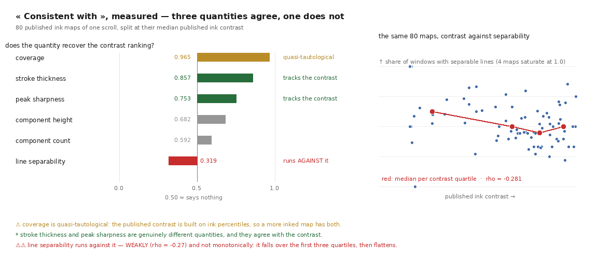

# 45 — « Consistent with », quantifié : trois grandeurs s'accordent, une va contre

2026-08-22. [`32`](32_educelab_le_papier_fondateur.md) §4.2 relevait, dans le papier
fondateur d'EduceLab, **le seul contrôle sans vérité terrain** dont le domaine dispose —
et notait qu'il n'est pas outillé. `29` M7 le portait depuis, marqué ⭐⭐. Le voici mesuré.

Sur les couches cachées d'un rouleau il n'y a, par définition, aucune vérité. L'unique
argument du papier pour défendre ce qu'il y lit est celui-ci, mot pour mot :

> *« Crucially, the **scale, line separation, and script** of the revealed characters are
> **consistent with those observed on the fragment surfaces**. »*

⭐ **La forme est exactement la bonne.** On possède une région vérifiable et une région qui
ne l'est pas, et on transporte la confiance en montrant que les statistiques de second ordre
coïncident. C'est ce qu'il faut faire quand la vérité manque.

⚠ **Mais il est laissé au jugement de l'œil**, et trois ans plus tard personne ne l'a
outillé. Or les quatre grandeurs sont mesurables **sans jamais lire une lettre**.



Instrument : [`analysis/src/typographie.py`](../analysis/src/typographie.py) (22 témoins
hors ligne). Corpus : **190 cartes d'encre publiées**, quatre rouleaux.

---

## 1. Les quatre grandeurs, et pourquoi elles ne demandent rien

| grandeur | comment |
|---|---|
| **interligne** | autocorrélation du profil de densité, projeté perpendiculairement aux lignes |
| **échelle de caractère** | distribution des tailles de composantes connexes |
| **taux de couverture** | fraction de la surface de **papyrus** prédite « encre » |
| **épaisseur de trait** | pic de la transformée de distance à l'intérieur de l'encre |

Aucune ne suppose un alphabet, un modèle de langue, ni une annotation.

⚠⚠ **Ce que l'instrument NE fait pas, et il faut le dire avant de le lire** : il ne dit pas
qu'un texte est du grec, ni qu'il veut dire quelque chose. Il dit qu'une prédiction a la
**statistique typographique** d'une page écrite. Une prédiction qui échoue le test n'est
certainement pas du texte ; une qui le passe **peut** être un artefact périodique. C'est un
contrôle nécessaire, jamais suffisant — exactement comme l'absence d'auto-intersection
l'est pour une trace.

## 2. ⭐⭐ Le seuil de périodicité n'est pas choisi, il est DÉRIVÉ

L'autocorrélation d'un profil de bruit blanc de *n* points a, à un décalage donné, un
écart-type de 1/√n ; le maximum sur *k* décalages candidats vaut donc de l'ordre de
√(2 ln k)/√n. Un pic doit dépasser ce plancher pour vouloir dire quelque chose.

⭐ C'est ce qui rend le critère **transportable** : sur une carte deux fois plus petite, le
plancher monte tout seul. Un nombre écrit en dur — la première version disait 0,15 — aurait
été calibré sur la taille des cartes qu'on avait sous la main ce jour-là. Le témoin vérifie
la **loi** (quatre fois moins de points, exactement deux fois plus haut), pas une valeur.

⚠ Le seul seuil réellement choisi est la part de fenêtres périodiques au-dessus de laquelle
une carte « ressemble à une page écrite » — la moitié. Il est dit, et la part elle-même est
publiée à côté du verdict pour qu'un lecteur puisse en juger autrement.

## 3. Ce que le corpus rend

| rouleau | cartes | « écrites » | interligne méd. | trait méd. | couverture méd. |
|---|---:|---:|---:|---:|---:|
| PHerc0139 | 38 | 14/38 | 62 px | 4,5 px | 0,088 |
| PHerc0172 | 53 | **49/53** | 41 px | 2,0 px | 0,201 |
| PHerc1667 | 19 | 13/19 | 85 px | 4,0 px | 0,069 |
| PHercParis4 | 80 | 44/80 | 85 px | 5,7 px | 0,133 |

## 4. ⭐⭐ Le test de transport, et son résultat inattendu

Aucune de ces cartes n'a de vérité terrain au sens des lettres — ce sont toutes des sorties
d'un modèle. Ce qu'on possède, c'est le **contraste d'encre publié**, une mesure
indépendante du même objet. Si les grandeurs typographiques, qui ne lisent rien, retrouvent
son classement, elles mesurent bien quelque chose de l'écriture.

Les 80 cartes du premier rouleau, partagées à la médiane de leur contraste :

| grandeur | AUC | ρ | lecture |
|---|---:|---:|---|
| couverture | **0,965** | +0,869 | ⚠ quasi-tautologique |
| **épaisseur de trait** | **0,857** | +0,687 | ⭐ suit le contraste |
| **netteté du pic** | **0,753** | +0,598 | ⭐ suit le contraste |
| hauteur des composantes | 0,682 | +0,192 | — |
| nombre de composantes | 0,592 | +0,161 | — |
| **séparabilité des lignes** | ⚠ **0,319** | **−0,281** | ⚠⚠ va **contre** |

⚠ **La couverture est quasi-tautologique** et il faut le dire, sinon son 0,965 se lirait
comme la meilleure validation de tout le tableau : le contraste publié est bâti sur des
percentiles d'encre, donc une carte plus encrée a les deux. Elle mesure deux fois la même
chose.

⭐ **Les deux qui comptent sont l'épaisseur de trait et la netteté du pic** : des quantités
réellement différentes du contraste, obtenues par une transformée de distance et une
autocorrélation, et qui s'accordent avec lui. **C'est le transport de calibration du papier,
enfin chiffré.**

### ⚠⚠ Et la séparation des lignes va à contre-sens

C'est le résultat que la mesure n'était pas conçue pour trouver. Le papier met *scale*,
*line separation* et *script* dans un même souffle, comme si elles allaient ensemble.
**Mesurées, elles ne vont pas ensemble.**

| quartile de contraste | contraste méd. | séparabilité méd. | couverture méd. |
|---|---:|---:|---:|
| Q1 | 1,62 | **0,616** | 0,049 |
| Q2 | 4,55 | 0,489 | 0,118 |
| Q3 | 5,48 | **0,448** | 0,158 |
| Q4 | 6,27 | 0,500 | 0,154 |

> ⚠ **L'association est faible et non monotone** : ρ = **−0,281**, la séparabilité chute sur
> les trois premiers quartiles puis se stabilise. La couverture triple sur cette plage, ce
> qui est cohérent avec une fusion des lignes quand l'encre s'épaissit — mais ça ne suffit
> pas à en faire une explication établie, et ce document ne la présente pas comme telle.

⭐ **C'est exactement ce que la quantification achète sur le « consistent with » à l'œil.**
Un œil qui trouve une page « cohérente » ne peut pas voir que deux de ses propriétés vont
dans des sens opposés. Un nombre, si.

## 5. ⚠⚠ Cinq défauts d'instrument, dont quatre à moi

Ils sont listés parce qu'ils disent comment cet instrument a été rendu croyable, et parce
que chacun est du genre à ressortir ailleurs.

1. **Ma sonde du masque était posée à l'envers.** J'affirmais dans la docstring que sans
   masque « presque tout le papyrus passe pour de l'encre ». Mesuré : **faux** (0,066). Le
   vrai défaut est ailleurs et plus grave — sans masque, la couverture est une fraction de
   l'**image**, donc elle dépend du **recadrage**. La sonde vérifie maintenant ça, dans les
   deux sens.

2. ⚠⚠ **Une marge vierge n'est pas une période.** Un profil qui monte puis redescend a une
   autocorrélation qui décroît de façon **monotone** — son maximum tombe donc au **bord**
   de la fenêtre. La première version déclarait ça « périodique » avec une netteté de 0,88 :
   elle prenait le bord du fragment pour de l'écriture. Le pic doit être **intérieur**, avec
   un creux de chaque côté.

3. ⚠⚠ **La carte entière est le mauvais domaine.** Une carte publiée porte souvent **deux
   blocs de texte côte à côte**, dont les lignes ne sont pas à la même hauteur : un profil
   pris sur toute la largeur les **moyenne**, et deux signaux de même période mais déphasés
   s'annulent. Mesuré : **64 cartes sur 80** ne rendaient aucune période, alors qu'elles
   portent une écriture parfaitement lignée à l'œil. La mesure se fait fenêtre par fenêtre —
   et l'interligne est de toute façon une propriété **locale**.

4. **Une tendance lente masque la période.** Le détendançage (soustraction d'une moyenne
   glissante) est ce qui laisse le pic ressortir sous la pente d'un fragment qui s'élargit.

5. ⚠⚠ **Ma figure contredisait son propre tableau.** Le panneau censé montrer *pourquoi* la
   séparabilité va contre traçait la **couverture** des 190 cartes des **quatre** rouleaux,
   alors que l'AUC porte sur le **contraste** de **80** cartes d'**un seul**. Deux variables,
   deux corpus : le nuage montait là où le tableau dit que ça descend. **Une figure qui
   contredit son propre tableau est pire qu'aucune figure.** Elle trace désormais exactement
   les couples appariés, et les couples voyagent dans le JSON pour que ce soit vérifiable.

> ⭐ Aucun des cinq n'a été trouvé en relisant le code. Trois viennent des témoins sur pages
> **synthétiques** — dont on connaît l'interligne et l'épaisseur, donc dont on sait ce que
> l'instrument doit rendre. Un vient du corpus réel. Le dernier vient d'avoir **regardé la
> figure**.

## 6. Ce qui reste ouvert

- ⏳ **Le transport vers une région sans vérité n'est pas encore fait.** Ce document montre
  que les grandeurs se comportent comme il faut là où une mesure indépendante existe ; le
  geste du papier — mesurer sur la surface d'un fragment ouvert, puis retrouver les mêmes
  valeurs sur une couche cachée — demande les deux régions d'un **même** objet.
- ⚠ **Le contraste d'encre n'est pas une vérité terrain non plus** : c'est une autre sortie
  du même pipeline. L'accord de deux mesures indépendantes du même objet est plus faible
  qu'une vérification, et plus fort que rien. Le dire fait partie du résultat.
- ⏳ **M8 reste ouvert** : le témoin négatif jeté par le pipeline — chez EduceLab, la feuille
  de support en papier, imagée dans la même session, au même voxel, et supprimée au
  nettoyage manuel. C'est la forme la plus économique d'un contrôle négatif, et cet
  instrument est ce qui le rendrait lisible.

## Reproduire

```bash
./tools/lancer.sh --fond tools/campagne_typographie.sh
uv run python analysis/src/figure_typographie.py

# les témoins, hors ligne — sur des pages SYNTHÉTIQUES dont on connaît l'interligne
uv run python ../analysis/src/typographie.py --verifier
```
