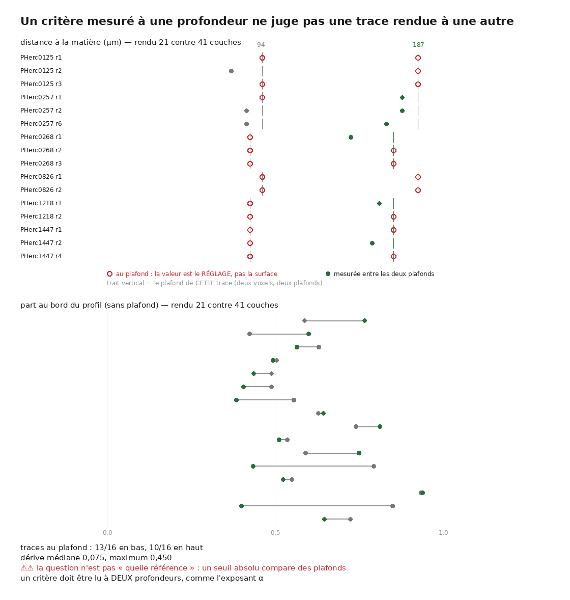

# 47 — Un critère mesuré à une profondeur ne juge pas une trace rendue à une autre

2026-08-22. [`29`](29_ce_qui_reste.md) N4 demandait de **choisir une référence défendable**
pour le critère du tiers central, après que [`36`](36_lorigine_de_la_pile.md) eut montré
qu'un segment officiel n'en est pas une — 18 % à 68 % sur un seul rouleau. La question
suppose que le critère est une propriété de la surface. **Mesurée, la supposition ne tient
pas**, et la question se dissout au lieu de se résoudre.



Instrument : [`analysis/src/derive_avec_profondeur.py`](../analysis/src/derive_avec_profondeur.py)
(24 témoins hors ligne) et [`figure_derive_profondeur.py`](../analysis/src/figure_derive_profondeur.py)
(6 témoins). Corpus : les **16 traces** rendues aux deux profondeurs, 4 rouleaux.

---

## 1. ⚠⚠ La plupart des traces ne rapportent pas leur distance, elles rapportent le réglage

Un rendu de *n* couches ne peut pas voir plus loin que sa propre fenêtre. La distance à la
matière est donc **censurée** à un plafond, et ce plafond **double avec la profondeur** :

| | plafond | traces au plafond |
|---|---:|---:|
| rendu 21 couches | 93,62 µm | **13/16** |
| rendu 41 couches | 187,24 µm | **10/16** |

Le plafond monte d'un facteur **2,00** pour un facteur 1,95 de profondeur — il *est* le
réglage. Sur les 16 traces, **2 seulement** sont mesurées entre les deux plafonds des deux
côtés, et leur écart médian est de **88,939 µm**, soit presque le plafond du rendu bas
tout entier.

> ⚠⚠ **Un seuil absolu comparé à une valeur censurée ne compare pas deux surfaces, il
> compare deux réglages.** C'est la même troncature que
> [`35`](35_le_tirage_sur_douze_rouleaux.md) a payée sur le budget de générations — où
> stabilité *et* propreté se sont révélées être des effets du plafond — dans un troisième
> endroit du dépôt.

## 2. ⭐ Et un critère SANS plafond bouge quand même

`au_bord` et `part_plates` sont des fractions, bornées à [0,1] par construction : aucun
plafond de rendu ne les tronque. Sur les mêmes 16 traces :

| critère | comparées | censurées | dérive médiane | dérive max |
|---|---:|---:|---:|---:|
| `ecart_um` | 2 | **14** | 88,939 | 93,620 |
| `au_bord` | 16 | 0 | **0,075** | **0,450** |
| `part_plates` | 16 | 0 | **0,153** | 0,250 |

Une dérive médiane de 0,075 sur une grandeur qui vaut typiquement 0,5, et un maximum de
0,450 — c'est-à-dire une trace qui traverse presque toute la plage du critère quand on
change **uniquement** la profondeur du rendu. Le critère est donc autant une propriété du
réglage que de la surface.

## 3. ⚠⚠ Deux critères ne se transfèrent pas l'un à l'autre

`ρ(au_bord, part_plates) = **−0,528**`. Ils bougent en sens **opposés**, donc ce ne sont ni
la même quantité ni des complémentaires.

> ⚠ C'est écrit ici parce que le raccourci était tentant : ayant mesuré la dérive d'un
> critère, transporter la conclusion sur l'autre — au motif qu'ils parlent tous deux d'un
> profil de profondeur — aurait été **faux**. Le fichier publie la corrélation à côté des
> dérives pour que personne ne le fasse, moi compris.

## 4. ⚠⚠ Un défaut de figure, et il faisait disparaître la moitié de la censure

La cohorte mélange **deux tailles de voxel**, 8,64 et 9,362 µm, donc le plafond du rendu est
proportionnel au voxel du rouleau : il y a **deux plafonds** à chaque profondeur — 86,40 et
93,62 µm en bas, 172,80 et 187,24 en haut. La première version de la figure traçait celui de
l'en-tête du fichier, donc **un seul**.

Conséquence : les traces de l'autre voxel apparaissaient **sous** le plafond alors qu'elles
étaient exactement **au** leur. La moitié de la censure disparaissait de l'image sans qu'un
seul chiffre du tableau ne bouge. Chaque trace porte maintenant son propre trait, et
l'invariant « censurée ⟺ à son propre plafond » est **épinglé par un témoin** plutôt que
supposé — si le drapeau voulait dire autre chose, toute la lecture serait fausse.

⭐ Trouvé en **regardant la figure**, pas en relisant le code : des cercles rouges posés à
92 % d'une ligne qu'ils étaient censés toucher.

## 5. ⭐⭐ Ce que N4 devient

La question n'a pas de meilleure réponse sous la forme où elle est posée. Tant qu'une part
notable des traces bute sur le plafond, **aucune référence n'est défendable** — pas parce
qu'on n'a pas trouvé la bonne, mais parce que la grandeur comparée n'est pas celle qu'on
croit comparer.

> ⭐⭐ **Le critère doit devenir auto-référentiel** : mesuré à **deux profondeurs**, et lu
> comme un rapport, exactement comme l'exposant α de
> [`38`](38_ce_qui_bouge_avec_la_fenetre.md). α n'a besoin d'aucune référence, d'aucun seuil
> et d'aucune échelle — c'est précisément ce qui le rend transportable d'un rouleau à
> l'autre. Un critère de profil lu de la même façon hériterait de la même propriété.

⚠ Ce que ce document **n'établit pas** : que la forme relative fonctionne. Il établit que la
forme absolue ne peut pas. Construire l'exposant demande des traces rendues à deux
profondeurs **sans censure des deux côtés**.

> ⚠⚠ **Correction du 2026-08-22, et elle est de bonne nouvelle.** Ce paragraphe disait
> « le dépôt en a **deux** ». Ce deux est juste — mais il porte sur la **cohorte de 16
> traces** du second axe, pas sur le dépôt. L'audit de
> [`49`](49_alpha_ne_separe_pas_deux_pannes.md) balaie les fichiers `profil*.json`, que
> cette cohorte n'utilise pas : **deux populations disjointes**. Mesuré sur l'arbre entier,
> **92 séries** ont au moins deux fenêtres et **aucun** profil posé sur son bord.
>
> ⭐ Le lot suivant n'est donc pas bloqué par le manque de matière. Il l'est par le travail
> de définir le critère.

## Reproduire

```bash
python3 analysis/src/derive_avec_profondeur.py --docs docs --json docs/derive_profondeur.json
cd inference && uv run python ../analysis/src/figure_derive_profondeur.py \
    --json ../docs/derive_profondeur.json --docs ../docs \
    --sortie ../docs/images/47_derive_profondeur.png

# les témoins, hors ligne
python3 analysis/src/derive_avec_profondeur.py --verifier
python3 analysis/src/figure_derive_profondeur.py --verifier
```
