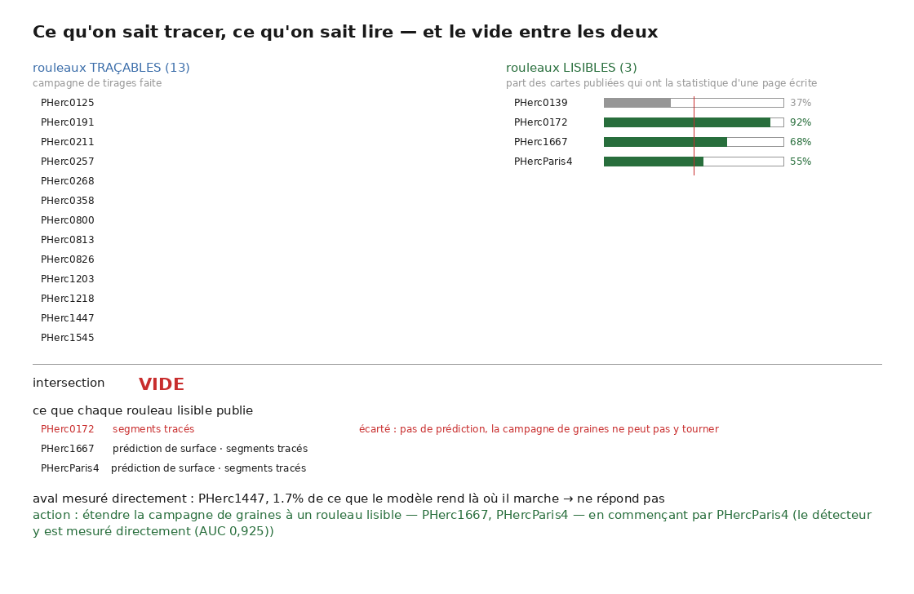
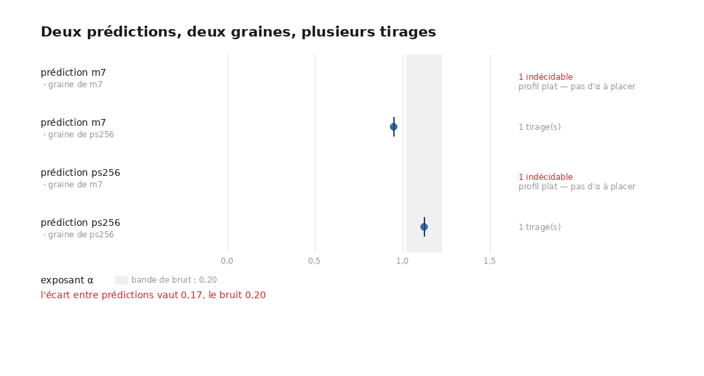
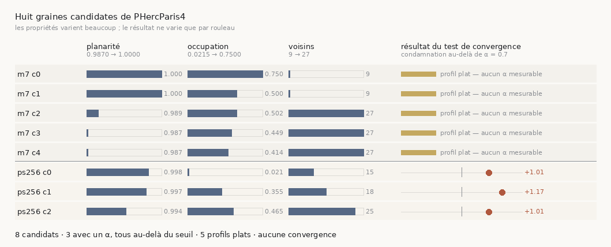

# 48 — Où monter l'expérience : ce qu'on sait tracer et ce qu'on sait lire ne se recouvrent pas

2026-08-22. [`29`](29_ce_qui_reste.md) §1 porte la question dont dépend tout le reste du
dépôt — *réparer une trace sert-il à quelque chose ?* — et nomme depuis le début ce qu'il
faudrait : **une trace fautive, sa version réparée, et le même aval appliqué aux deux**.
Ce document ne répond pas à la question. Il mesure **pourquoi elle n'est pas montable sur
ce qui est en main**, et il nomme où elle le serait.



Instrument : [`src/graine/eligibilite_aval.py`](../src/graine/eligibilite_aval.py)
(23 témoins hors ligne) et [`figure_eligibilite.py`](../src/figures/figure_eligibilite.py)
(11 témoins). Il ne mesure rien de neuf : il **croise trois mesures déjà faites**.

---

## 1. ⚠⚠ L'aval doit répondre — ~~et sur un rouleau du prix il ne répond pas~~

> ⚠⚠⚠ **RENVERSÉ LE 2026-08-28.** Ce qui suit a été écrit depuis la mesure du 2026-08-22,
> faite avec la constante de normalisation que [`60`](60_la_constante_qui_rendait_le_modele_muet.md)
> a corrigée. Le détecteur **répond** : σ du contrôle positif = **76,4 %** de ce qu'il rend
> là où il atteint AUC 0,925, et les deux cartes sont **étrangères** (ρ = **−0,0100**), pas
> identiques. **La condition d'entrée de ce lot est donc levée** : une réparation peut
> montrer un gain à travers lui sur `PHerc1447`.
>
> ⚠ Ce qui reste vrai, et qui est même plus dur : le détecteur rapporte **plus** de
> dispersion sur la surface qui ne peut pas porter d'encre (0,7111 contre 0,5894). Un gain
> mesuré à travers lui devra donc être défendu contre ce faux positif de fond.

~~[`46`](46_le_temoin_negatif.md) mesure que sur `PHerc1447` le détecteur rend la **même
carte** (ρ = 0,9979) sur une face de papyrus et sur une surface qui coupe l'empilement.
Sa dispersion vaut **1,7 %** de ce que le modèle rend là où il atteint AUC 0,925.~~

⭐ Ça donne une **condition d'entrée vérifiable avant de dépenser** : σ de la sortie du
modèle sur le rouleau visé, rapporté aux **0,7712** de référence. Une inférence sur une
fenêtre suffit.

## 2. Les deux ensembles, et leur intersection

| ensemble | comment il est établi | compte |
|---|---|---:|
| **traçables** | une campagne de tirages a tourné dessus (`table_tirages.json`) | **13** |
| **lisibles** | plus de la moitié des cartes publiées ont la statistique d'une page écrite ([`45`](45_consistent_with_quantifie.md)) | **3** |
| **intersection** | | ⚠⚠ **0** |

| rouleau | cartes | écrites | part |
|---|---:|---:|---:|
| PHerc0139 | 38 | 14 | 37 % — non |
| **PHerc0172** | 53 | 49 | **92 %** |
| **PHerc1667** | 19 | 13 | **68 %** |
| **PHercParis4** | 80 | 44 | **55 %** |

⚠ **« Pas dans la cohorte tracée » n'est pas « pas traçable ».** Rien ne dit qu'un rouleau
lisible résiste au traceur ; il n'a simplement jamais eu de campagne. Ce que la disjonction
dit, c'est **où** l'expérience doit être montée — pas qu'elle est impossible. L'instrument
formule donc une **action** et pas une impasse, et le témoin exige qu'il le fasse.

## 3. ⚠⚠ Un défaut à moi, et c'est la sonde réseau qui l'a corrigé

Ma première recommandation était *« commencer par `PHerc0172`, 92 % de cartes écrites »*.
Elle est **irréalisable**, et rien dans les données déjà en main ne le disait :

| rouleau | publie |
|---|---|
| `PHerc0172` | `photos/` `segments/` `volumes/` — ⚠ **pas de `representations/`** |
| `PHerc1667` | `photos/` **`representations/`** `segments/` `volumes/` |
| `PHercParis4` | `photos/` **`representations/`** `segments/` `volumes/` |

La recherche de graine part d'une **prédiction de surface**. Un rouleau qui n'en publie pas
ne peut pas recevoir la campagne, quelle que soit la qualité de son encre. L'instrument
**écarte** désormais un tel candidat au lieu de le classer dernier — le classer laisserait
recommander une expérience qui ne peut pas tourner.

⭐ Et le classement des candidats restants n'est pas la part écrite : c'est **où le
détecteur est mesuré directement**. `PHercParis4` est le rouleau de `36` §5bis, celui où le
modèle atteint AUC 0,925 avec σ = 0,7712. Une mesure vaut mieux qu'une ressemblance.

## 4. ⚠ Le blocage restant, nommé plutôt que contourné

`PHercParis4` publie **deux prédictions de surface du même scan**, toutes deux à 2,4 µm :

```
20260411134726-surface-20260413141734-surface-recto-
20260411134726-surface-20260413222639-surface-m7-L2-
```

L'appariement **refuse** — *« 2 scans à 2.4 µm ± 1.0 — ambigu, refus plutôt qu'un tirage au
sort »*. Ce n'est pas une ambiguïté de volume mais de **produit de surface**, et choisir au
hasard entre deux prédictions est exactement le défaut que ce dépôt recense sous « supposer
une provenance ».

### ✅ Tranché par la mesure, le 2026-08-22 — et la réponse est « ni l'une ni l'autre, pas encore »

Ce ne sont pas deux versions d'une même chose : leurs métadonnées disent qu'elles sortent du
**même volume** (`2.4um_PHerc-Paris4_masked.zarr`), générées à deux secondes d'intervalle,
par **deux modèles différents** — `ps256_trainpy` à seuil 0,45 et `m7_nnunet` à seuil 0,2.

⚠ **Les scores internes ne tranchent pas**, et il fallait le mesurer pour le savoir : les
deux meilleures graines sont aux **extrêmes** de la bande admissible — `ps256` à une
occupation de **0,0215** quand le plancher est 0,02, `m7` à **0,75** avec une planarité de
**1,0** quand le plafond est 0,80. « Tout est surface ET parfaitement plan » est la signature
d'une prédiction **saturée** que [`39`](39_le_seam_de_correction.md) §3 décrit : il n'y a
alors aucun gradient à suivre.

Le critère du dépôt, lui, tranche — on trace la meilleure graine de chacune avec des
paramètres identiques et on juge au test de convergence
(`src/outils/tracer_prediction_paris4.sh`) :

| prédiction | aire | croisements | verdict |
|---|---:|---:|---|
| `ps256` | 0,317 cm² | 0 | α = **+0,89**, *suit la fenêtre*, ⚠ fragile, 100 % des fenêtres au bord |
| `m7` | 0,317 cm² | 0 | ⚠⚠ **rendu VIDE** — voir [`54`](54_cinq_rendus_vides.md) |

> ⚠⚠ **Corrigé le 2026-08-24** : le profil de `m7` n'est pas plat, il est **vide** — sa pile
> rendue n'a aucun pixel allumé, parce que la graine `m7` vient du produit `…-m7-L2-`, au
> niveau 2, rendu contre le niveau 0. Son α de 1,01 restait bien le rapport de deux bords de
> fenêtre ([`49`](49_alpha_ne_separe_pas_deux_pannes.md)), mais la cause est en amont : il n'y
> avait rien à profiler. ⭐ Reste vrai pour `ps256` : sa trace ne se pose pas sur une feuille.

### ⚠⚠ Et relever le plafond bute sur le coût du rendu, mesuré

À 200 générations la trace passe de 0,317 à **3,655542 cm²** — onze fois plus, donc la
troncature est bien levée. Mais le rendu, lui, devient inabordable : mesuré sur
`/proc/<pid>/io`, `vc_render_tifxyz` à `--scale 1` sur ce rouleau à 2,4 µm a lu **51 Mo et
écrit 1592 octets en quinze minutes** — 41 fichiers de sortie de **8 octets**. Pour
~2,6 milliards de voxels cela fait **plus de douze heures** pour une seule fenêtre, et
quatre fois plus pour celle à 161 couches.

⭐ Rien dans la sortie ne le disait. D'où `src/outils/rendre_surveille.sh` : il surveille
l'**activité du processus** plutôt que le temps écoulé — un rendu long n'est pas un rendu
bloqué — abandonne en le disant, et **rapporte le débit dans les deux cas**, succès compris.

> ⚠⚠ **Et c'est ce rapport qui a corrigé mon propre diagnostic.** Le rendu suivant, même
> échelle et même volume, a écrit **148 Mo en 131 s — 1108 Kio/s**, soit **vingt fois** le
> débit que j'avais mesuré. Mon « plus de douze heures » était une extrapolation depuis **un
> seul échantillon de quinze minutes**, et une extrapolation n'est pas une mesure.
>
> ⚠ Je ne sais pas ce qui explique l'écart. Deux candidats, non séparés : la **localité** —
> une surface onze fois plus grande touche beaucoup plus de morceaux du zarr distant, et un
> accès dispersé coûte bien plus qu'un accès séquentiel — et la simple **variabilité du
> réseau**. Les distinguer demanderait de rejouer le même rendu deux fois, ce qui n'a pas
> été fait.
>
> ⭐ Ce qui est acquis : le débit est désormais **rapporté à chaque rendu**, donc les runs
> suivants donnent une distribution au lieu d'un point. Mesurés depuis :
> **1108, 1116, 3848 et 1834 Kio/s**. Le 57 Ko/s initial est une valeur aberrante d'un
> facteur vingt à soixante-dix, et un seul point ne pouvait pas le montrer.

⚠ `ECHELLE` devient un paramètre. Une échelle plus grossière réduit l'échantillonnage **dans
le plan** et pas le long de la normale, donc les microns du profil restent des microns ; ce
qui change est le nombre de fenêtres. C'est une vraie différence de mesure, et c'est
pourquoi **les deux prédictions sont rendues à la même échelle** : la comparaison reste une
comparaison, seule la valeur absolue cesse d'être comparable à un run à l'échelle 1.

### ✅ Le 2×2 croisé tranche — et la question se dissout

⚠⚠ Tracer chaque prédiction à **sa** graine confondait « quelle prédiction » avec « quel
endroit » : les deux graines tombent à des kilovoxels l'une de l'autre. Les deux prédictions
couvrant le même volume, une graine y est une coordonnée valide des deux côtés — d'où les
quatre cellules.

| | graine de `ps256` | graine de `m7` |
|---|---|---|
| prédiction **`ps256`** | α = **+1,12** | ⚠⚠ **indécidable** (profil plat) |
| prédiction **`m7`** | α = **+0,95** | ⚠⚠ **indécidable** (profil plat) |

| facteur | écart | verdict |
|---|---:|---|
| **prédiction** | 0,17 | ⚠ **sous le bruit** de 0,20 — indistinguables |
| **endroit** | catégorique | ⭐ les **2** cellules indécidables sont du même côté |

> ⭐⭐ **La question bloquante se dissout, comme celle de [`47`](47_le_critere_doit_etre_relatif.md).**
> Il n'y a pas de bonne prédiction à choisir : les deux se comportent pareil au même endroit,
> et ce qui décide est **la graine**. L'effort doit aller là.

### ✅ Répété quatre fois par cellule, et l'écart RÉTRÉCIT



⚠ La première passe avait un tirage par cellule, or le traceur *en est un* : la même graine
dans la même prédiction avait rendu α = +0,89 puis +1,12. Le 2×2 a donc été rejoué à
**quatre tirages par cellule** — seize runs, parfaitement équilibrés.

| | graine de `ps256` | graine de `m7` |
|---|---|---|
| **`ps256`** | +1,12 · +1,01 · +0,94 · +1,09 — médiane **+1,05** | ⚠⚠ **4 indécidables** |
| **`m7`** | +1,01 · +1,01 · +0,97 · +0,95 — médiane **+0,99** | ⚠⚠ **4 indécidables** |

> ⭐⭐ **L'écart entre prédictions passe de 0,17 à 0,06** — il a *rétréci* en répétant, ce qui
> est exactement le comportement d'une différence due au bruit. Il faudrait au moins **0,20**
> pour distinguer. Et l'indécidabilité suit la graine à **chacune** des huit répétitions.

> ⚠⚠⚠ **Corrigé le 2026-08-24 — les huit cellules « indécidables » sont huit rendus VIDES.**
> L'observation la plus robuste de ce 2×2 (« l'indécidabilité suit la graine à chacune des
> huit répétitions ») est exacte, et son mécanisme n'est pas celui qu'on lui prêtait. Mesuré
> sur les seize piles (`src/nappe/matiere_des_piles.py`) :
>
> | | graine `ps256` | graine `m7` |
> |---|---|---|
> | prédiction `ps256` | max 255, ~96 % allumé | **max 0, 0,0 %** |
> | prédiction `m7` | max 255, ~96 % allumé | **max 0, 0,0 %** |
>
> Ce n'est **pas la prédiction** qui décide, c'est la **graine** : la graine `m7` est choisie
> dans `…-surface-m7-**L2**-`, un produit au **niveau 2** de la pyramide, donc la trace qui en
> sort porte des coordonnées de niveau 2 et son rendu au niveau 0 tombe dans le vide. Le `L2`
> était dans le nom du fichier depuis le début, et rien ne le lisait.
>
> ⭐ Donc « cet endroit n'a pas de feuille » n'a jamais été mesuré : **on n'a jamais regardé
> cet endroit**. Détail, correctif de l'instrument et batteries :
> [`54`](54_cinq_rendus_vides.md).

> ⚠⚠ **Corrigé le 2026-08-23.** La plupart de ces cellules rendent l'identité **+1,0135** du
> couple de fenêtres ([`51`](51_une_pente_a_deux_appuis.md)) : leur accord est arithmétique
> et non empirique. Et l'« étendue intra-cellule » de 0,18 mélange deux choses non séparées
> — la vraie variation du traceur, et le saut entre une cellule tombée sur l'identité et une
> cellule qui mesure. **La conclusion « c'est l'endroit qui décide » n'est plus portée par
> ces nombres.**

⭐ **Le bruit de tirage est mesuré, plus déduit** : l'étendue intra-cellule vaut **0,18** sur
la cellule la plus dispersée. ⚠ Ce n'est pas la même quantité que le ±0,2 de
[`43`](43_la_chaine_des_spires.md) — celui-ci est une **demi-largeur** (bande de 0,4) sur un
mode *déterministe*, donc une résolution de **mesure**. Ce qu'on peut dire, et pas plus :
l'étendue de tirage observée **tient dans** la bande déclarée, donc celle-ci n'est pas trop
généreuse.

⚠ Deux réserves restent :
- les deux α mesurables valent **≈ 1** : les deux prédictions sont indistinguables *et*
  mauvaises à cet endroit ;
- l'effet catégorique repose sur **deux endroits**, pas deux cents — huit répétitions
  n'élargissent pas l'échantillon de graines, elles ne font que fiabiliser chaque case.

Instrument : [`src/encre/comparer_predictions.py`](../src/encre/comparer_predictions.py)
(19 témoins) et [`figure_2x2.py`](../src/figures/figure_2x2.py) (6 témoins). ⭐ Il **refuse** quand l'écart est sous le bruit, et le bruit n'est pas choisi :
c'est le plus grand de la résolution que `test_convergence` déclare et de l'étendue
intra-cellule mesurée.

⚠ Et les deux aires valent **0,317 cm²** à cinq chiffres près — les deux traces butent sur
le même plafond de 60 générations. C'est la troncature de `35` : deux traces coupées au même
endroit ont la même aire pour une raison qui n'a rien à voir avec la prédiction. **La
comparaison n'est donc pas encore concluante**, et relever le plafond est le prochain pas —
pas un choix de prédiction.

### ✅ Les huit candidats tracés — et ce n'était pas le classement, le 2026-08-22 (nuit)

Le 2×2 a conclu que **c'est l'endroit qui décide**. En relisant les listes de candidats, un
détail rendait cette conclusion suspecte : `trouver_graine` classe sur la **planarité seule**,
et la graine utilisée par les seize cellules du 2×2 était, sur `m7`, celle qui a une planarité
de 1,0000 sur **9 voisins** — moins soutenue que 0,987 sur **27**. Trois dix-millièmes séparent
les planarités pendant que l'occupation varie **d'un facteur vingt**.

⚠ Je n'ai **pas** inventé un score composite pour reclasser : choisir la pondération, c'est
choisir la réponse avant de l'avoir mesurée. Les **huit** candidats ont été tracés.



| candidat | planarité | occupation | voisins | résultat |
|---|---|---|---|---|
| `m7` c0 | 1,0000 | 0,750 | 9 | profil **plat** |
| `m7` c1 | 1,0000 | 0,500 | 9 | profil **plat** |
| `m7` c2 | 0,9891 | 0,502 | 27 | profil **plat** |
| `m7` c3 | 0,9873 | 0,449 | 27 | profil **plat** |
| `m7` c4 | 0,9870 | 0,414 | 27 | profil **plat** |
| `ps256` c0 | 0,9977 | 0,022 | 15 | α = **+1,01** |
| `ps256` c1 | 0,9974 | 0,356 | 18 | α = **+1,17** |
| `ps256` c2 | 0,9938 | 0,465 | 25 | α = **+1,01** |

> ⭐⭐ **Zéro convergence sur huit.** L'α le plus bas obtenu est **+1,01**, pour un seuil de
> condamnation à 0,7. Les propriétés de graine varient d'un facteur vingt en occupation et de
> trois en nombre de voisins ; le résultat, lui, **ne varie que par rouleau**.

⚠ **L'instrument refuse de calculer une corrélation**, et c'est voulu : trois α seulement, et
à huit points la corrélation détectable à 80 % de puissance dépasse **0,84** — rien de moins
qu'une relation quasi parfaite ne serait visible. Un ρ moyen ne serait pas une absence
d'effet, ce serait une absence de puissance.

⚠ Les cinq graines `m7` tombent toutes sous le **refus du profil plat** de
[`49`](49_alpha_ne_separe_pas_deux_pannes.md) : elles rapportent `41c→48,0` et `161c→192,0`,
c'est-à-dire les **bords de fenêtre**, dont le rapport vaut celui des fenêtres — α ≈ 1 par
identité arithmétique, quoi qu'il y ait dans le volume.

### ⚠⚠ Corrigé le 2026-08-23 : les trois α de ce tableau n'en sont pas

[`51`](51_une_pente_a_deux_appuis.md) mesure que les **trois** candidats `ps256` ont eux
aussi leur fenêtre étroite sous le seuil de détection, et que deux d'entre eux ont *les
deux* écarts posés exactement sur la demi-fenêtre. Le refus de `49` ne les voyait pas parce
qu'il prend l'amplitude **maximale** des fenêtres — règle juste pour « y a-t-il quelque
chose ici », fausse pour « quelle est la pente ».

> ⭐⭐ **Vingt séries de l'arbre rendent exactement +1,0135**, qui est
> $\log(192/48)/\log(161/41)$ — l'identité du couple de fenêtres, indépendante de la
> graine, de la prédiction et du tirage. La colonne « résultat » ci-dessus lisait donc, pour
> les huit lignes, une propriété du réglage de mesure et non du rouleau.

⚠ **La conclusion pratique ne bouge pas** : un appui au bord veut dire « aucun pic dans la
fenêtre », ce qui condamne la trace de la même façon. C'est la **quantification** qui tombe.
⭐ Et sur les 27 séries `PHercParis4` de l'arbre, il en reste **une** dont les deux appuis
mesurent — `paris4_croise/ps256_sur_graine_ps256`, α = **+1,12**, borne exacte, *suit la
fenêtre*. Le mur tient sur elle, donc sur une mesure au lieu de vingt-sept.

### ⚠⚠ Et une colonne dont personne ne parlait : elles butent toutes sur le plafond

Les huit aires tiennent entre **0,3174 et 0,3176 cm²** — **0.06%** d'écart, pour des graines
séparées par des kilovoxels dans deux prédictions différentes. Ce n'est pas de la robustesse :
les huit s'arrêtent à la **génération 59**. L'aire mesure le **réglage**, pas la donnée.

Et ce plafond de 60 n'a jamais été un choix. Il a été fixé le jour où j'estimais le rendu à
**57 Kio/s** — une extrapolation faite sur *un* échantillon, corrigée depuis par la mesure à
**1108–5861 Kio/s**, vingt à cent fois plus vite. Tout ce que ce dépôt affirme sur ce rouleau
a été mesuré sous un budget dimensionné pour un coût qui n'existe pas.

> ⭐ **La leçon n'est pas « 60 était trop petit »** — on ne le sait pas encore, et
> `src/outils/plafond_generations.sh` le mesure. Elle est plus gênante : un réglage pris pour une
> raison qui a cessé d'être vraie ne se signale jamais tout seul, et la **cohérence** des
> résultats qu'il produit est précisément ce qui le rend invisible.

⚠ Le dépouillement compare la variation d'α au **bruit du tireur** — le même
`vc_grow_seg_from_seed`, sur la même graine, rend déjà α de +0,89 à +1,12. Un écart de budget
qui ne dépasse pas ce bruit ne veut rien dire, et le lire comme un effet serait lire du hasard.

## 5. Ce que ce document n'établit pas

- ⚠ **Que la statistique typographique d'une carte prouve qu'elle porte du texte.** `45` le
  dit explicitement : c'est un critère **nécessaire, jamais suffisant** — une carte
  périodique peut être un artefact. Le critère sert ici à écarter, pas à valider.
- ⚠ **Que le détecteur répond sur les trois rouleaux lisibles.** Il n'est mesuré
  directement que sur `PHercParis4` (par `36`) et sur `PHerc1447` (par `46`). Pour les deux
  autres, la lisibilité est **inférée** de la statistique de leurs cartes publiées.
- ⚠ **Que réparer sert à quelque chose.** C'est la question, et elle reste ouverte. Ce
  document dit seulement où elle peut être posée.

## Reproduire

```bash
python3 src/graine/eligibilite_aval.py --docs docs/mesures --json docs/mesures/eligibilite_aval.json
python3 src/graine/eligibilite_aval.py --docs docs/mesures --sonder --json docs/mesures/eligibilite_aval.json
uv run python src/figures/figure_eligibilite.py \
    --json docs/mesures/eligibilite_aval.json --sortie docs/images/48_eligibilite.png

# les témoins, hors ligne
python3 src/graine/eligibilite_aval.py --verifier
python3 src/figures/figure_eligibilite.py --verifier
```
