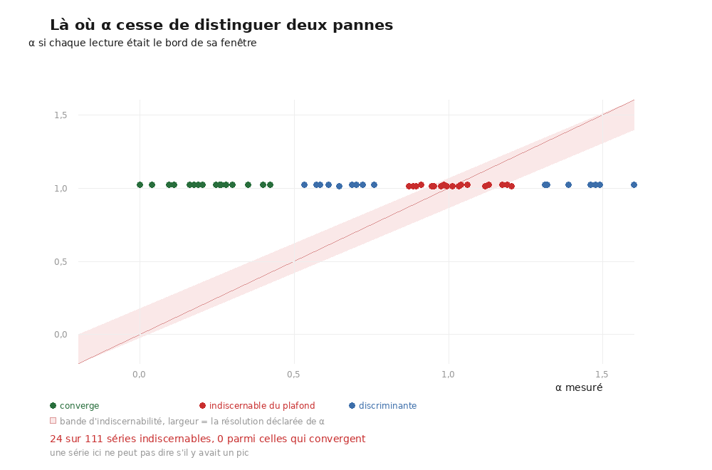

# 49 — α ne sépare pas deux pannes : le pic qui recule et le pic qui n'existe pas

2026-08-22. Trouvé en lançant le test de convergence sur les deux prédictions de
`PHercParis4` ([`48`](48_ou_monter_lexperience.md)) et en **regardant les nombres** avant de
lire le verdict.

---

## 1. ⚠⚠ Ce que le verdict affirmait, et ce que les nombres disaient

La prédiction `m7` a produit une trace jugée ainsi :

```
41c→48.0  161c→192.0
⚠⚠ SUIT LA FENÊTRE — le « pic » s'éloigne avec la fenêtre — il n'y a aucune
   feuille à portée, la surface est posée en travers de l'empilement
```

À 41 couches la demi-fenêtre vaut 20 × 2,4 = **48 µm** ; à 161 elle vaut 80 × 2,4 =
**192 µm**. **Les deux lectures SONT le bord de la fenêtre.** Leur rapport vaut donc celui
des fenêtres, et α = 1,01 sort **par identité arithmétique** — quoi qu'il y ait dans le
volume.

Le profil le disait déjà, et personne ne le lisait : `amplitude_mediane = 0,0` pour un seuil
de détection `amplitude_min = 0,02`, `au_bord = 1,0`, `au_bord_relief = nan`. **Il n'y a pas
de pic. Il n'y en a nulle part.**

> ⚠⚠ « Le pic s'éloigne avec la fenêtre » est une phrase sur un pic. Quand il n'y a pas de
> pic, elle n'est pas fausse au sens strict — elle n'a **pas d'objet**, et elle est affirmée
> avec la même assurance que sur une vraie mesure.

## 2. Le correctif : l'instrument refuse au lieu de conclure

[`test_convergence.py`](../analysis/src/test_convergence.py) accepte désormais l'amplitude
et le seuil de détection, et **refuse** quand la première est sous le second :

```
⚠⚠ INDÉCIDABLE — profil PLAT — amplitude 0.0000 sous le minimum de détection 0.0200
   de l'instrument. Les écarts rapportés sont les bords de fenêtre, donc leur rapport
   vaut celui des fenêtres et α ≈ 1 par identité, quoi qu'il y ait dans le volume
```

⭐ Et un chemin `--profil` construit la série **depuis les fichiers de profil** au lieu de
recopier les écarts à la main. C'est en les recopiant que j'ai lancé un verdict sur un profil
plat sans le voir : l'écart, la part au bord et l'amplitude viennent maintenant du même
fichier, donc ils ne peuvent plus se contredire.

## 3. ⭐⭐ L'audit de tout l'arbre, et sa moitié rassurante

[`analysis/src/audit_profils_plats.py`](../analysis/src/audit_profils_plats.py)
(16 témoins) lit les **217 profils** du dépôt et calcule, pour chaque série, l'α mesuré
**et** l'α qu'on obtiendrait si chaque lecture était le bord de sa fenêtre.



| | |
|---|---:|
| profils lus | **225** dans **114** séries |
| profils dont l'écart EST le bord de la fenêtre | **21** |
| profils plats (rien à mesurer) | **15** |
| séries dont **aucune** fenêtre ne mesure rien | **4** |
| séries dont α ne sépare pas les deux pannes | **24** sur **111** jugées |

⚠ **Ces totaux bougent, et c'est normal** : l'audit balaie l'arbre, donc chaque campagne en
ajoute. Ils valaient 217 / 110 / 20 à l'écriture de ce document et ont grandi de nos propres
runs du même jour. ⭐ Ce qui **ne bouge pas**, et qui porte la conclusion, ce sont les deux
bornes ci-dessous.

> ⭐⭐ **Et voici ce qui rend le constat supportable, mesuré et non supposé.** L'α de plafond
> vaut toujours ~1. Une série qui **converge** en est donc loin par construction : le plus
> petit α non discriminant vaut **+0,8729**, le plus grand α convergent **+0,4222**, et
> **0 série convergente** n'est concernée. Les deux populations ne se recouvrent même pas —
> c'est le trou visible entre le nuage vert et la bande rose de la figure.

⚠ **Aucun verdict positif n'est touché.** Ce qui perd son pouvoir de discrimination est
exactement le verdict *« suit la fenêtre »* — et ses deux causes possibles, *le pic recule*
et *il n'y avait pas de pic*, **condamnent la trace toutes les deux**. La conclusion
pratique tient ; c'est la **formulation** qui sur-affirme.

## 3bis. ⚠⚠ Ce que l'audit lit, et pourquoi un écart n'est pas forcément une erreur

Il balaie les profils **présents sur disque**, pas ceux qui ont produit les tableaux
publiés. Une campagne relancée dans la même destination écrase les siens : mesuré,
`data/spires_pas025/spire03` porte des profils de **14 h 29** alors que le verdict que
[`43`](43_la_chaine_des_spires.md) tabule date de **08 h 02 le même jour** — six heures et
un tirage plus tôt. Les deux sont justes, et ils ne parlent pas du même run.

> ⚠ **La vraie leçon est en amont** : une campagne qui réécrit sa propre destination détruit
> la preuve derrière un tableau déjà publié. Les **verdicts** survivent dans `docs/`, les
> profils non. C'est la règle « un run à paramètres différents prend sa propre destination »,
> qui vaut aussi pour un run aux **mêmes** paramètres — puisque le traceur est un tirage.

## 4. ⚠ Ce que ça change pour les résultats déjà publiés

- **[`38`](38_ce_qui_bouge_avec_la_fenetre.md), α = +1,01 sur notre trace.** Sa série a
  quatre fenêtres et **un seul de ses profils est encore sur disque** : celui à 41 couches,
  amplitude **0,0194** pour un seuil de 0,02, écart **172,80 µm** — exactement la
  demi-fenêtre à 8,64 µm. Les trois autres ne sont pas dans l'arbre, donc **on ne peut pas
  les vérifier**, ce qui est par la règle du dépôt une anecdote. ⭐ Le verdict *pratique*
  survit — « aucune feuille dans la fenêtre » est vrai dans les deux lectures — mais
  l'affirmation que la surface **coupe l'empilement** repose sur la géométrie du rendu et
  non sur ce profil.
- **[`46`](46_le_temoin_negatif.md), le témoin négatif.** Il utilise cette trace parce qu'à
  α = +1,01 aucune feuille n'est à portée. Cette prémisse-là est la même sous les deux
  lectures : un profil plat veut dire qu'aucune structure de feuille n'est dans la fenêtre.
  **Le témoin tient.**
- **Les 20 séries listées** sont toutes des traces déjà condamnées. Aucune n'était présentée
  comme un succès.

## 5. Ce que ça a coûté de trouver

⭐ Rien d'automatique. La chaîne : lancer le test sur deux prédictions, **regarder les
nombres au lieu du verdict**, remarquer que 48 et 192 sont des demi-fenêtres, ouvrir les
profils, y voir `amplitude_mediane = 0,0`. Puis écrire l'audit pour savoir combien d'autres.

⚠ Et le remède qui compte n'est pas d'avoir mieux regardé : c'est que l'instrument lise
maintenant lui-même ce que le profil dit, et refuse.

## Reproduire

```bash
python3 analysis/src/audit_profils_plats.py --racine . --json docs/audit_profils.json

uv run python analysis/src/test_convergence.py --nom m7 \
    --profil data/prediction_paris4/m7/profil_41c.json \
    --profil data/prediction_paris4/m7/profil_161c.json

# les témoins, hors ligne
python3 analysis/src/audit_profils_plats.py --verifier
uv run python ../analysis/src/test_convergence.py --verifier
```
