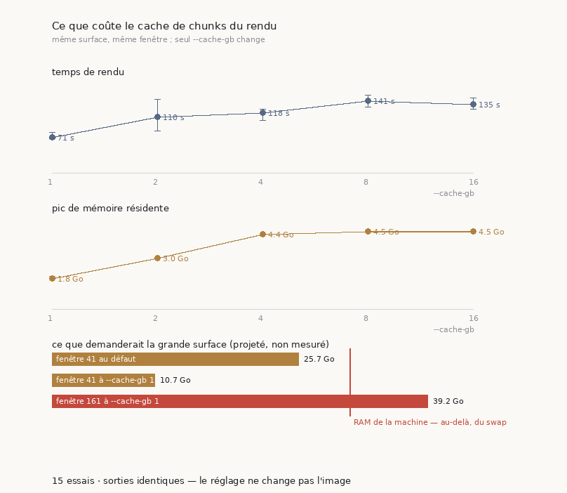
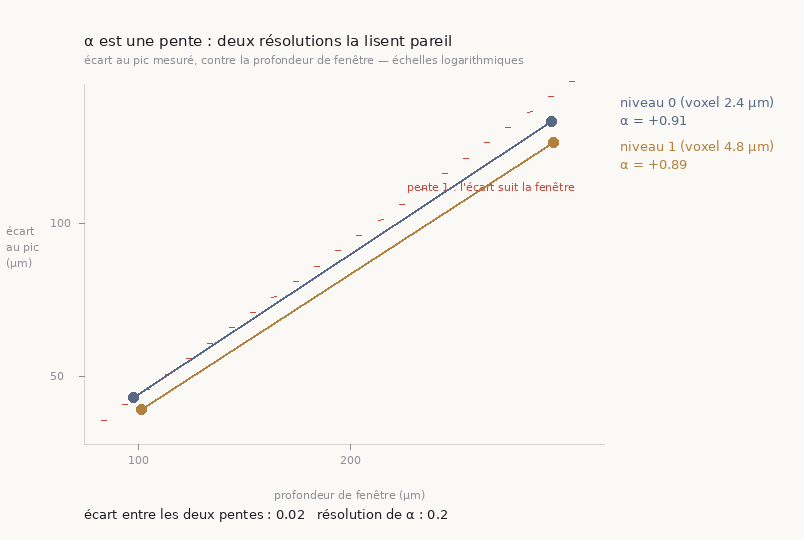
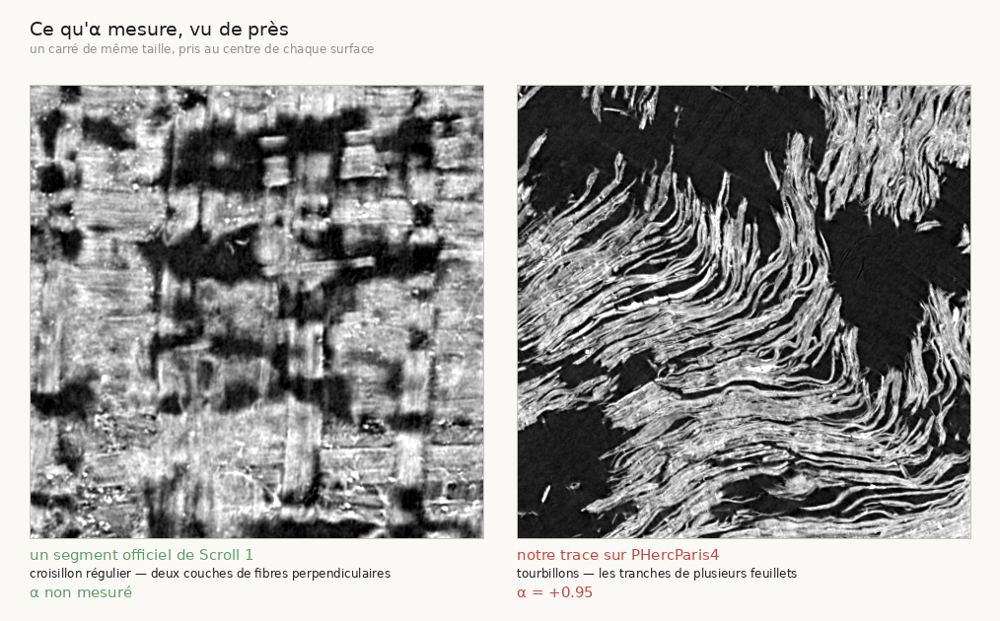

# 50 — Le rendu n'attendait pas le calcul, il attendait la mémoire

2026-08-23. Ce document est né d'une question simple posée sur un rendu qui durait :
*est-ce que le programme est optimisé, pour justifier le temps qu'il prend ?* La réponse
mesurée est non, et la cause n'était pas dans le programme — elle était dans nos arguments.

---

## 1. ⚠⚠ Ce que la machine faisait pendant qu'on croyait qu'elle calculait

Relevé sur le processus vivant, après 1 h 58 de rendu d'une surface de 3,656 cm² :

| grandeur | mesure |
|---|---|
| RSS du processus | **28,2 Go** sur 31,8 de RAM |
| mémoire libre | **274 Mo** |
| cache de pages du noyau | écrasé à **442 Mo** |
| swap occupé | **3,4 Go** |
| CPU moyen | **23,7 % d'un cœur** |
| cœurs disponibles | **22** |
| threads du processus | **59** |

> ⭐⭐⭐ Un processus à cinquante-neuf threads qui consomme un quart d'un cœur sur une
> machine qui en a vingt-deux **ne calcule pas** : il attend la mémoire. Les six heures que
> le renderer annonçait n'étaient pas du travail, c'était du swap.

⚠ Le journal du renderer disait `band 14/63 (22%) · 112m02s · eta 392m09s`. Cette ETA était
sincère et sans valeur : elle extrapolait un rythme qui n'était limité par rien de ce que le
programme faisait.

---

## 2. La cause est dans nos propres arguments

```
--cache-gb arg (=16)    Zarr chunk cache size in GB
```

⚠⚠ **Le cache de chunks vaut 16 Go par défaut** — la moitié de la RAM de cette machine.
Et **aucun des 28 appels à `vc_render_tifxyz` de ce dépôt, répartis sur 14 scripts, ne
réglait cette valeur.**

> ⚠ **Correction d'une première lecture.** J'ai d'abord écrit que « la cause, c'est
> `--cache-gb 16` ». L'étalonnage dit : *à moitié*. Sur la petite surface le pic sature à
> **4,53 Go même à `--cache-gb 16`** — le cache est alloué **paresseusement** et ne se
> remplit qu'à hauteur de ce que la surface touche. Ce n'est donc pas un plafond qu'on
> *paie*, c'est un plafond qu'on **atteint** quand la surface est assez grande.

C'est l'exacte forme d'un réglage qui attend son heure : inoffensif à toutes les tailles
qu'on avait essayées, décisif à la première qui compte.

---

## 3. ⭐⭐ L'arithmétique ferme, et c'est ce qui rend le diagnostic vérifiable

Un diagnostic plausible et un diagnostic vrai se ressemblent. Celui-ci se recoupe :

L'en-tête TIFF du rendu **terminé** de la petite surface donne **2361 × 2341** pixels pour
0,317 cm². Le rapport d'aire avec la grande est exact — 3,656 / 0,317 = **11,5×** — et une
surface aplatie est rendue à résolution fixe, donc la grande fait **64 Mpx par tranche**.

| | par tranche | × 41 tranches | × 161 tranches |
|---|---|---|---|
| tampons `float32` | 64 Mpx | **9,7 Go** | **38,2 Go** |
| cache de chunks (défaut) | | 16 Go | 16 Go |
| **total attendu** | | **25,7 Go** | **54,2 Go** |
| **observé** | | **28,2 Go** | — |

⚠ L'en-tête a dû être lu à la main : un décodeur d'image refuse un fichier tronqué, et les
tranches du grand rendu sont **pré-allouées puis abandonnées** (leur offset d'IFD vaut zéro,
parce que le renderer écrit son index à la fin). « Illisible » et « inachevé » sont deux
états différents et il faut les nommer séparément.

---

## 4. ⚠⚠ La conséquence : la fenêtre profonde ne rentre pas

α se lit à **deux** profondeurs. La seconde fenêtre fait 161 couches, soit **38,2 Go de
tampons à elle seule** sur une machine de 31,8 — **quel que soit `--cache-gb`**.

> Ce n'était donc pas une mesure lente, c'était une mesure **impossible**. On aurait attendu
> une journée et demie un résultat qui ne pouvait pas arriver.

C'est une panne qu'aucune relecture du script n'aurait trouvée, parce que le script est
correct : c'est la taille de l'objet qui a changé, et rien ne rapportait la taille.

---

## 5. L'étalonnage, et ce qu'il refuse de faire

`src/outils/etalonner_rendu.sh` rend **la même surface, la même fenêtre**, en ne changeant que
`--cache-gb`, et relève le temps de mur et le pic de RSS.

⚠⚠ **Le cache disque est chauffé une fois avant la série.** Sans cela, le premier essai
paie le téléchargement du volume et sort du lot pour une raison étrangère au réglage
mesuré — c'est « comparer une grandeur à elle-même » en costume de banc d'essai.

⚠⚠ **Et la première chose vérifiée n'est pas une performance : c'est que la sortie ne bouge
pas.** Chaque essai est empreint (`sha256` de la pile de tranches), et
`src/graine/effet_du_cache.py` **refuse de parler de vitesse** si les empreintes diffèrent.
Un réglage qui change les pixels n'est pas un réglage de performance — ce serait découvrir
que tous les rendus déjà publiés dépendaient d'une valeur que personne n'avait posée.

⭐ **Le critère n'est pas « le plus rapide » mais « le plus petit à moins de 5 % du
meilleur ».** Prendre le plus rapide choisirait presque toujours le plus gros cache, donc
reconduirait exactement le défaut qu'on est en train de corriger.

⚠⚠ **Et chaque valeur est répétée trois fois** — leçon que ce dépôt avait déjà écrite
ailleurs (`src/campagnes/campagne_thread_limit.sh` : *« une seule exécution par valeur ne
distinguerait pas l'effet du réglage de la variance de run »*). Elle vaut double ici : le
répertoire passé à `-v` reste **vide**, donc le cache disque n'est jamais matérialisé et
chaque essai retélécharge — le chronomètre porte autant le réseau que le réglage.

### Le résultat, 15 rendus



| `--cache-gb` | temps médian | étendue | pic RSS médian |
|---|---|---|---|
| **1** | **71 s** | 13,1 s | **1,81 Go** |
| 2 | 110 s | **61,7 s** | 2,98 Go |
| 4 | 118 s | 21,9 s | 4,36 Go |
| 8 | 141 s | 23,8 s | 4,53 Go |
| 16 (défaut) | 135 s | 22,6 s | 4,52 Go |

> ⭐ **`--cache-gb 1`** : le pic le plus bas *et* la médiane la plus basse. Les **quinze
> sorties sont identiques** au `sha256` — donc plafonner ne déplace aucun résultat déjà
> publié, et c'est cette vérification-là qui autorise à poser le réglage dans le chemin
> commun (`src/outils/rendre_surveille.sh`).

⚠ **La conclusion sur le temps penche, elle ne tranche pas.** L'écart entre valeurs (70,3 s)
ne dépasse l'étendue à l'intérieur d'une valeur (61,7 s, à `--cache-gb 2`) que d'un facteur
**1,14** — le dépouilleur le signale plutôt que de rendre un « concluant » nu, parce qu'une
marge mince se lit exactement comme une conclusion solide. **La mémoire, elle, tranche** :
1,81 contre 4,53 Go, avec des étendues de quelques centièmes.

### Ce que le plafond change pour la grande surface

| | mémoire attendue |
|---|---|
| fenêtre 41 au défaut | 25,7 Go — **swap** |
| fenêtre 41 à `--cache-gb 1` | **10,7 Go** — tient |
| fenêtre 161 à `--cache-gb 1` | 39,2 Go — **ne tient pas** |

⭐ La fenêtre superficielle devient donc mesurable. La profonde reste hors d'atteinte au
niveau 0, et c'est la pyramide qu'il faut interroger — voir §6.

---

## 6. Ce que ce document n'établit pas

- ✅ **Que la pyramide sauve la fenêtre profonde — mesuré, voir §7.** C'était la seule
  inconnue qui bloquait la mesure ; elle est levée.
- ⚠ **Que 16 Go soit un mauvais défaut en général.** Sur une machine à 128 Go il est sans
  doute raisonnable. Ce qui est mesuré ici, c'est qu'un défaut dimensionné pour une autre
  machine est un défaut, et qu'on ne l'avait jamais posé.

---

## 7. ✅ La pyramide préserve α — la fenêtre profonde redevient mesurable

α est un **rapport** entre deux profondeurs, donc une réduction uniforme de résolution *ne
devrait pas* le biaiser. Mais « ne devrait pas » n'est pas « mesuré », et
[`35`](35_le_tirage_sur_douze_rouleaux.md) a déjà établi qu'un seuil calé sur le niveau 0 ne
se transporte pas à résolution réduite. La même surface a donc été rendue aux deux niveaux.



> ⚠⚠ **L'axe des abscisses est la profondeur PHYSIQUE, pas le nombre de tranches.** Au
> niveau 1 une tranche vaut deux fois l'épaisseur, donc 21 tranches y couvrent ce que 41
> couvrent au niveau 0. Tracer contre le compte de tranches décalerait les deux séries d'un
> facteur deux et ferait *paraître* un désaccord là où il y a coïncidence — l'erreur serait
> purement dans le dessin, et parfaitement crédible.

⭐ La droite rouge est le **référentiel de lecture** : elle a la pente 1, c'est-à-dire
« l'écart double quand la fenêtre double ». Sans elle, « α ≈ 1 » est un chiffre à croire ;
avec elle, c'est une pente à voir.

| niveau | voxel | fenêtres | α | verdict |
|---|---|---|---|---|
| 0 | 2,4 µm | 41 / 161 | **+0,91** | suit la fenêtre, 100 % au bord |
| 1 | 4,8 µm | 21 / 81 | **+0,89** | suit la fenêtre, 100 % au bord |

> ⭐⭐⭐ **Écart 0,02, pour une résolution déclarée de 0,20** — dix fois à l'intérieur. Les
> deux niveaux rendent le même verdict, sur la même surface.

### ⚠⚠ Corrigé le 2026-08-23 : ces deux nombres ne sont pas des α

[`51`](51_une_pente_a_deux_appuis.md) mesure que les **deux** séries ont leur fenêtre étroite
sous le plancher de détection — `controle_resolution#g0` et `#g1`, appuis *plat / mesure*,
borne **aucune**. Une pente a deux appuis, et un appui qui ne mesure rien n'en est pas un.

> ⭐ **Ce qui survit, et c'est ce dont ce document a besoin.** La question posée ici est
> « le **même calcul**, sur la **même surface**, à deux résolutions, rend-il le même
> nombre ? ». 0,02 y répond sans que le nombre ait à être une distance à une feuille, et
> c'est cela qui autorise à rendre moins cher.
>
> ⚠ **Ce qui tombe** : appeler ce nombre un α, donc une mesure de l'éloignement d'une
> feuille. Même correction que `49` sur `38`.

⚠⚠ **Le seuil de cette confrontation n'est pas le bruit du tireur** (0,23) mais la
résolution de α (0,20). C'est la *même* surface rendue deux fois : aucun tirage neuf
n'intervient, donc tout écart au-delà de la résolution serait un effet de l'instrument, et
condamnerait la pyramide.

### ⚠⚠ Le piège d'unités, qui aurait tout faussé

Au niveau *g*, un voxel fait 2^g fois l'épaisseur, donc **une tranche couvre 2^g fois plus
de profondeur**. Rendre 41 tranches au niveau 1 couvre **deux fois** la profondeur physique
de 41 tranches au niveau 0 : on aurait comparé deux **fenêtres** différentes en croyant
comparer deux **résolutions**. Le nombre de tranches est donc divisé par 2^g et `--voxel-um`
multiplié — et la conversion vit dans **une seule fonction**
(`src/outils/profiler_une_surface.sh`), qu'un témoin empêche les appelants de réapprendre.

⭐ **L'arrondi est « au supérieur à la moitié », pas `round()`**, et la vraie raison n'est
pas que `round(41/2)` vaut 20 en Python : c'est qu'une fenêtre est **centrée** sur sa couche
tracée, donc elle doit rester **impaire**. 41 → 21 → 11 garde un centre ; 41 → 20 n'en a
pas, et le décalage serait d'une demi-tranche par niveau, en silence. La mesure l'a
confirmé : avec l'arrondi pair l'écart entre niveaux valait **0,10**, avec l'arrondi impair
il tombe à **0,02**.

### Ce que ça débloque

| | mémoire |
|---|---|
| fenêtre profonde au niveau 0 | 38,2 Go — **impossible** |
| fenêtre profonde au niveau 1 | **≈ 4,8 Go** — tient largement |

⚠ Et le niveau devient une **clé** de la mesure, pas un détail de rendu : comparer un budget
mesuré au niveau 0 à un budget mesuré au niveau 1 confondrait le plafond avec la résolution,
et l'écart d'α serait crédible sans qu'on sache lequel des deux il décrit.
`src/graine/effet_du_plafond.py` **refuse** un lot mélangé.

---

---

## 8. ✅ Le verdict : le plafond ne fabriquait pas le résultat

C'était la question qui avait ouvert tout ce document. La voici tranchée, sur la **même
graine**, le **même maillage**, au **même niveau de pyramide** :

| budget | aire tracée | α |
|---|---|---|
| 60 générations | 0,317 cm² | **+0,89** |
| 200 générations | **3,656 cm²** | **+0,95** |

> ⭐ **Variation +0,06, pour un bruit de tireur de 0,16** (mesuré sur les répétitions
> présentes, pas repris d'une constante). Elle reste **sous** le bruit : 60 générations
> suffisaient pour juger, et le résultat négatif de ce rouleau tient.

### ⚠⚠ Corrigé le 2026-08-23 : ces deux α ne portent pas de verdict non plus

Même mesure, même conclusion partielle. `paris4_plafond/ps256_c2_g60#g1` a ses appuis
*plat / mesure* — borne **aucune** — et `ps256_c2_g200#g1` ses appuis *au bord / mesure*,
donc une borne **majorant** : α vrai est **en dessous** du mesuré, ce qui ne sauve pas une
condamnation. Voir [`51`](51_une_pente_a_deux_appuis.md).

> ⚠ La comparaison **de budget à budget** garde son sens — deux fois le même calcul sur la
> même graine — donc « on ne voit pas d'effet du budget » tient. C'est « α passe de +0,89 à
> +0,95 » qui sur-affirme, en présentant comme deux mesures ce qui est deux fois le même
> calcul sur un appui vide.

⚠⚠ **Ce que cette phrase dit exactement.** Elle ne dit pas « le budget ne change rien » :
elle dit qu'on **ne peut pas affirmer** qu'il change quelque chose, parce que l'écart observé
est plus petit que ce que le tireur produit tout seul. Un seul tirage par budget, donc le
+0,06 pourrait lui-même n'être qu'un tirage. La différence entre les deux formulations est
tout ce qui sépare une mesure d'une conviction.

⚠ Et l'aire, elle, a bien été multipliée par **onze et demi** — le plafond bornait donc
réellement la surface. Il ne bornait simplement pas le **verdict**.

### Le contrôle de résolution, sur la grande surface aussi

La petite surface ne peut pas valider le niveau 2 : à 9,6 µm elle ferait 590 px de côté,
sous la fenêtre d'analyse de 1024. La grande, elle, tient — donc c'est **elle** qui porte le
contrôle du niveau 2 :

| surface | niveaux comparés | α | écart |
|---|---|---|---|
| 0,317 cm² | 0 et 1 | +0,91 / +0,89 | **0,02** |
| 3,656 cm² | 1 et 2 | +0,95 / **+1,01** | **0,06** |

⭐ Les deux écarts restent sous la résolution de α (0,20), sur deux surfaces et trois
niveaux. La pyramide est validée là où on l'utilise.

### ⚠⚠ Trois pièges opérationnels payés pour arriver là

1. **Un orphelin a survécu à une mise en veille.** Tuer une campagne ne tue pas ce qu'elle a
   lancé : un rendu de la veille tournait encore **4 h 32 plus tard**, sur la mesure qu'on
   savait impossible, à 24,6 Go — laissant 274 Mo à tout le reste. Vérifier par `pgrep -af`
   ce qui tourne *réellement*, pas ce qu'on croit avoir arrêté.
2. **Un script édité pendant son exécution se casse.** `bash` lit par offset au fil de
   l'exécution ; une insertion décale les octets sous ses pieds et il reprend au milieu d'un
   token — avec une erreur de syntaxe sur une ligne parfaitement valide. Les deux campagnes
   sont mortes après leurs rendus, juste avant de juger. ⭐ Sans conséquence ici, parce que
   les profils étaient écrits : il a suffi de relancer le **jugement**, pas le calcul.
3. **Le plancher de la pyramide dépend de la surface**, pas de la machine — voir le tableau
   ci-dessus. `src/outils/profiler_une_surface.sh` refuse maintenant *avant* de rendre.

---

## 9. ⚠⚠ Le décompte honnête : ce que ces heures ont coûté et rapporté



Cette image a coûté **quarante secondes**. Elle montre, à gauche, un segment officiel de
`Scroll 1` — un **croisillon régulier**, qui est exactement ce qu'est du papyrus : deux
couches de fibres perpendiculaires. Et à droite, notre trace : des **tourbillons** et des
déchirures noires, c'est-à-dire les tranches de plusieurs feuillets vus par la tranche.

⚠ **La comparaison n'est pas contrôlée** — deux rouleaux, deux scans, deux résolutions. Elle
ne *prouve* pas qu'α sépare les deux ; la preuve, c'est α. Elle dit seulement que ce qu'α
condamne ne ressemble pas à ce qu'il accepte, ce que rien n'avait vérifié jusqu'ici.

### Ce que les heures ont réellement produit

| | temps | résultat |
|---|---|---|
| tentative niveau 0, 161 couches | **4 h 32** | **rien** — toutes les tranches pré-allouées, index jamais écrit |
| mesure niveau 1, deux fenêtres | ~2 h | α = +0,95 à 200 générations |
| mesure niveau 2, contrôle | ~2 min | α = +1,01 |
| **l'image ci-dessus** | **40 s** | ce qu'un œil peut lire |

> ⚠⚠ **L'image aurait pu être obtenue à n'importe quel moment des quatorze heures
> précédentes.** Je ne l'ai jamais faite, parce que la question posée était numérique et que
> le script *supprimait* le rendu après en avoir tiré son profil. Un pipeline dont le seul
> artefact lisible par un humain part à la poubelle pour économiser du disque, c'est un
> défaut de conception — pas une économie.

⭐ **La règle qui manquait** : *regarder la chose avant de la mesurer*. Quarante secondes
auraient montré que cette surface est un désordre, avant qu'on passe des heures à chiffrer
de combien.

### Et ce que les heures ont quand même acheté

Le verdict du §8 : à budget ×3,3, α passe de +0,89 à +0,95, sous le bruit du tireur. C'est
un **résultat négatif** — le plafond ne fabriquait pas la conclusion — et il vaut d'être eu,
parce que sans lui tout ce que ce dépôt affirme sur ce rouleau restait suspect.

⚠ Mais il a coûté bien plus qu'il n'aurait dû, et le surcoût est identifiable : une
estimation de débit fausse d'un facteur vingt, un réglage de cache jamais posé, un processus
orphelin qui a tourné 4 h 32 pour rien, et un aperçu qu'on n'a pas pensé à faire.

## Reproduire

```bash
src/outils/etalonner_rendu.sh                       # 5 valeurs × 3 répétitions
python3 src/graine/effet_du_cache.py --json docs/etalon_rendu.json
uv run python src/figures/figure_etalon_rendu.py \
    --json docs/etalon_rendu.json --sortie docs/images/50_etalon_rendu.png \
    --projection "fenêtre 41 au défaut=25.7" \
    --projection "fenêtre 41 à --cache-gb 1=10.7" \
    --projection "fenêtre 161 à --cache-gb 1=39.2"
src/outils/controle_resolution.sh                   # la pyramide préserve-t-elle α ?

# les témoins, hors ligne
src/outils/etalonner_rendu.sh --verifier
src/outils/controle_resolution.sh --verifier
src/outils/rendre_surveille.sh --verifier
python3 src/graine/effet_du_cache.py --verifier
uv run python src/figures/figure_etalon_rendu.py --verifier
```
