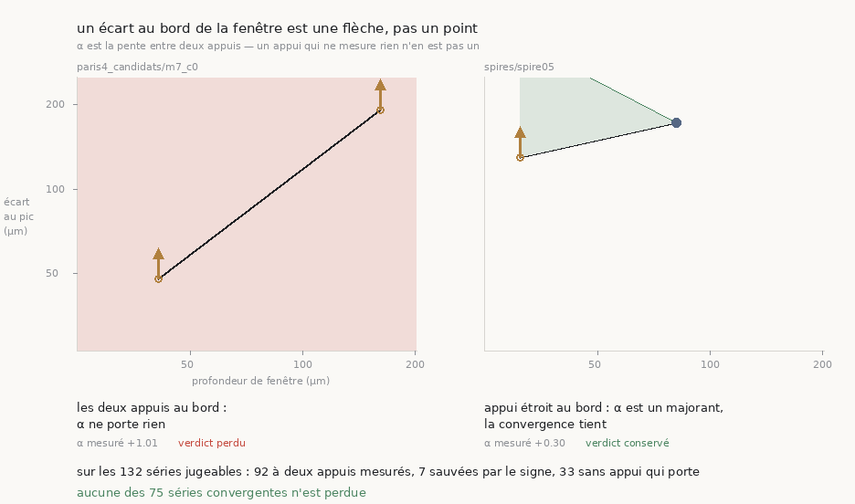
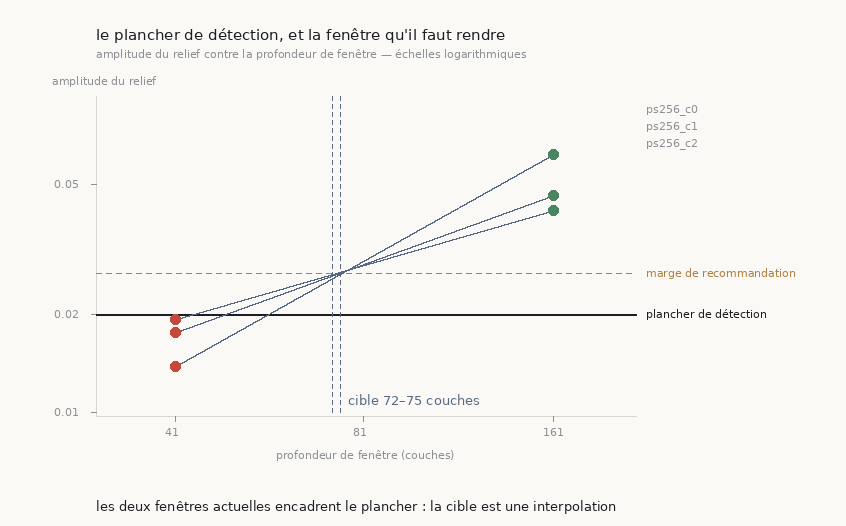

# 51 — Une pente a deux appuis, et vingt séries rendaient le même nombre

2026-08-23. Trouvé en reprenant le mur nº 1 — *le tracé ne suit pas de feuille* — et en
ouvrant les profils des huit candidats de [`48`](48_ou_monter_lexperience.md) au lieu de
relire leur tableau.



Instrument : [`analysis/src/appui_de_pente.py`](../analysis/src/appui_de_pente.py)
(37 témoins) et [`figure_appuis.py`](../analysis/src/figure_appuis.py) (24 témoins).

---

## 1. ⚠⚠ Le refus de `49` existait, et il ne voyait pas son propre cas

[`49`](49_alpha_ne_separe_pas_deux_pannes.md) a appris à `test_convergence` à refuser une
série dont **aucune** fenêtre ne mesure rien. Le code agrège les amplitudes par un
**maximum**, avec sa raison écrite sur place :

> ⚠ On prend le MAXIMUM d'amplitude sur les fenêtres : si une seule fenêtre a du relief,
> la mesure n'est pas vide. Prendre la médiane condamnerait une série dont une fenêtre sur
> trois mesure quelque chose.

Cette règle est juste pour la question *« y a-t-il quelque chose ici ? »*. Elle est fausse
pour la question que α pose, qui est *« quelle est la pente ? »* — **une pente a deux
appuis, et un appui qui ne mesure rien n'en est pas un.**

Les trois candidats `ps256`, publiés dans `48` avec α = +1,01 · +1,17 · +1,01, ont tous
leur fenêtre étroite sous le seuil de détection :

| candidat | 41 couches | 161 couches |
|---|---|---|
| `ps256` c0 | écart 48,00 = demi-fenêtre · amplitude 0,0175 < 0,02 | écart 192,00 = demi-fenêtre |
| `ps256` c1 | écart 36,00 · amplitude 0,0193 < 0,02 | écart 177,60 |
| `ps256` c2 | écart 48,00 = demi-fenêtre · amplitude 0,0138 < 0,02 | écart 192,00 = demi-fenêtre |

## 2. ⭐⭐ Le remède n'est pas un refus de plus, c'est un SIGNE

Un écart posé sur la demi-fenêtre n'est pas une absence de donnée. C'est une **borne** : le
pic est au moins là, peut-être plus loin. Le dessiner comme un point rond affirme une
position ; le dessiner comme une flèche vers le haut dit ce qu'on sait, et rien de plus.

Et comme α = $\log(e_1/e_0)/\log(n_1/n_0)$ avec $n_1 > n_0$, la direction se
**déduit** au lieu de se deviner :

| appui au bord | α mesuré est | condamnation (α ≥ 0,7) | convergence (α < 0,7) |
|---|---|---|---|
| aucun | exact | ⭐ tient | ⭐ tient |
| **étroit** | un **majorant** | ⚠ ne tient pas | ⭐ tient |
| **large** | un **minorant** | ⭐ tient | ⚠ ne tient pas |
| les deux | rien | ⚠ ne tient pas | ⚠ ne tient pas |

⚠ Un appui **plat hors du bord** — amplitude sous le seuil, écart pas sur la demi-fenêtre,
le cas de `ps256` c1 — ne donne aucun signe : l'écart rapporté est l'argmax d'un bruit, ni
majorant ni minorant. Il vaut « rien », et le dire est plus honnête que de lui prêter une
direction.

## 3. ⚠⚠ Vingt séries rendaient exactement le même nombre

Quand les **deux** appuis sont au bord, α vaut
$\log(192/48)/\log(161/41) = 1{,}013497$ — une propriété du **couple de fenêtres**, et
de rien d'autre. L'instrument regroupe ces séries et **recalcule** l'identité depuis les
demi-fenêtres plutôt que de la recopier depuis α :

```
  ⚠⚠ 20 série(s) rendent un α qui est l'IDENTITÉ de leur couple de fenêtres — le même
     nombre, à la quatrième décimale, quels que soient la graine, la prédiction et le
     tirage :
      20 série(s)  41c→161c  α = +1.0135  = log(d₁/d₀)/log(n₁/n₀)
```

> ⭐⭐ **Vingt runs indépendants** — graines séparées par des kilovoxels, deux prédictions,
> plusieurs tirages du traceur — rendent la même valeur à la quatrième décimale. Ce n'est
> pas une mesure robuste, c'est une mesure absente. Et rien ne le signalait : chaque run
> pris isolément affiche un « α = +1,01 » parfaitement plausible, et leur **cohérence** est
> précisément ce qui les rendait convaincants.

C'est le même motif que le plafond de 60 générations de `48` §4 : un réglage pris pour une
raison qui a cessé d'être vraie ne se signale jamais tout seul, et la cohérence des
résultats qu'il produit est ce qui le rend invisible.

## 4. Le recensement de tout l'arbre

| | |
|---|---:|
| séries jugeables | **132** |
| à deux appuis mesurés — α exact | **92** |
| appui étroit au bord — α **majorant** | **14** |
| appui large au bord — α **minorant** | **0** |
| ⚠⚠ aucun appui qui porte | **26** |
| séries dont le verdict ne tient plus | **33** |
| séries sauvées par le **signe** de la borne | **7** |
| séries convergentes | **75** |
| ⭐ convergentes perdues | **0** |

> ⭐⭐ **Et cette fois la moitié rassurante a une RAISON, pas seulement un constat.** Le seul
> signe observé dans tout l'arbre est le **majorant** : quatorze séries ont leur appui
> étroit au bord, aucune n'a l'appui large. Un majorant place α vrai *en dessous* du
> mesuré, donc il préserve exactement ce qui est sous le seuil — c'est-à-dire les
> convergences. Les verdicts positifs ne survivent pas par chance : la direction de la
> borne les protège.

`49` disait déjà « aucun verdict positif n'est touché », et c'était vrai de *son* test.
Ce document le redit d'un test plus dur et en donne le mécanisme.

## 5. ⚠⚠ Ce que ça change pour le mur nº 1

**Sur les 27 séries `PHercParis4` de l'arbre, 26 tombent.** Toute la campagne — le 2×2, ses
seize répétitions, les huit candidats, le relèvement de plafond — repose sur des appuis qui
ne portent pas de verdict.

⭐ **Il en reste une, et elle condamne.** `paris4_croise/ps256_sur_graine_ps256` a ses deux
appuis mesurés : α = **+1,12**, borne exacte, verdict *suit la fenêtre*.

> Le mur nº 1 tient donc, et il tient **sur une mesure au lieu de vingt-sept**. C'est un
> résultat plus fragile à énoncer et plus solide à défendre : vingt-sept nombres dont vingt
> sont la même identité arithmétique ne sont pas vingt-sept témoignages.

⚠ **Ce qui, en revanche, ne tient plus** : la conclusion du 2×2 de `48`, *« ce n'est pas la
prédiction qui décide, c'est l'endroit »*. Elle comparait des écarts de 0,06 et 0,17 entre
cellules — or la plupart de ces cellules rendent l'identité +1,0135, donc leur accord est
arithmétique et pas empirique. Et l'« étendue de tirage » de 0,18 mesurée intra-cellule
mélange deux choses : la vraie variation du traceur, et le saut entre une cellule tombée
sur l'identité et une cellule qui mesure. **Les deux ne sont pas séparées.**

⚠ Ce qui reste vrai sans réserve : la trace ne se pose pas sur une feuille à cet endroit.
Un appui au bord *veut dire* « aucun pic dans la fenêtre », ce qui est la même conclusion
pratique. C'est la **quantification** qui tombe, pas le constat.

### ⚠ Et l'α le plus cité du dépôt n'est pas jugeable ici

`38`, et par lui `N5` et `M8` de [`29`](29_ce_qui_reste.md), reposent sur α = **+1,01** pour
notre trace. Cette série a quatre fenêtres et **un seul de ses profils est encore sur
disque** — donc l'instrument ne la juge pas : il faut deux profondeurs pour poser une pente.

Ce qu'on peut dire du profil survivant, et rien de plus : `data/leur_graine/profil_41c.json`
a un écart de **172,80 µm** pour une demi-fenêtre de 20 × 8,64 = **172,80 µm**, et une
amplitude de **0,0194** pour un seuil de 0,02. **C'est un appui au bord, et il est plat.**

> ⭐ Le verdict *pratique* survit sous les deux lectures — un appui au bord veut dire
> qu'aucun pic n'est dans la fenêtre, ce que `49` §4 disait déjà. ⚠ Ce qui reste hors de
> portée, c'est de rejuger la série : les trois autres profils ne sont pas dans l'arbre,
> donc les redemander veut dire relancer le rendu, pas relire un fichier.

## 6. ⭐ Le pas suivant, chiffré : quel couple de fenêtres peut porter une pente

Si la fenêtre de 41 couches est sous le plancher sur ce rouleau, relancer la même campagne
avec le même couple redonnera **le même nombre**. D'où
[`analysis/src/fenetre_utilisable.py`](../analysis/src/fenetre_utilisable.py) (37 témoins),
qui répond en deux temps et dans cet ordre :

1. ⭐ **un fait, sans modèle** — parmi les profondeurs déjà mesurées, y en a-t-il deux qui
   dégagent le plancher avec un rapport d'au moins deux ?
2. ⚠ **une prédiction, avec son étiquette** — sinon, à quelle profondeur l'amplitude
   croiserait le plancher, en supposant amplitude ∝ n^β.



| état | séries |
|---|---:|
| couple confortable disponible | **95** |
| couple disponible, sans marge | **9** |
| il faut rendre une fenêtre plus profonde | **28** |

Pour les trois candidats `PHercParis4`, la cible vaut **73,9**, **72,6** et **74,6**
couches, avec un facteur d'extrapolation de **×1,00** — autrement dit *dans* l'intervalle
41→161 déjà mesuré. Ce n'est pas une extrapolation, c'est une interpolation entre deux points
qu'on possède.

> ⚠⚠ **Et l'étiquette compte plus que le chiffre.** Avec exactement deux profondeurs il n'y a
> **aucun résidu**, donc la loi de puissance n'est pas réfutable : la prédiction est
> l'extrapolation d'un modèle qu'on n'a pas pu tester. Ce dépôt a déjà publié un débit de
> rendu extrapolé depuis *un* échantillon, corrigé depuis d'un facteur vingt à soixante-dix.
> Le pas suivant n'est donc pas « rendre 81 couches parce que le modèle le dit », c'est
> **rendre une fenêtre intermédiaire et mesurer**.

### ⚠⚠ Le +1 interdit le couple évident

La couche tracée est au **centre** de sa fenêtre, donc une fenêtre de demi-largeur n compte
2n+1 couches. Doubler la demi-fenêtre ne double donc **pas** la fenêtre : 81/41 = **1,976**,
et `test_convergence` refuse un rapport sous 2. Un couple utilisable exige un saut d'un
facteur **quatre** en demi-fenêtre — d'où (41, 161) aujourd'hui, et **(81, 321)** demain.
Je l'attendais faux, et c'est le témoin qui m'a repris.

### La pyramide préserve-t-elle l'amplitude ? Mesuré, et la réponse est mitigée

`50` établit que la pyramide préserve **α**. Mais α est un rapport d'écarts, pas une
amplitude, et un niveau plus grossier **moyenne** des voxels : il peut lisser le relief que
le plancher cherche. Sur la seule surface rendue aux deux niveaux
(`data/controle_resolution`) :

| profondeur physique | voxel 2,4 → 4,8 µm | écart | plancher |
|---|---|---:|---|
| 99,6 µm | 0,0146 → 0,0147 | **+0,4 %** | ⭐ même camp (sous) |
| 387,6 µm | 0,0463 → 0,0360 | **−22,1 %** | ⭐ même camp (au-dessus) |

⭐ Ce qui décide n'est pas l'écart mais le **camp** : les deux niveaux rendent le même verdict
aux deux profondeurs, donc rendre moins cher est légitime *ici*. ⚠ Mais l'amplitude perd 22 %
à la fenêtre profonde, donc ce n'est pas une invariance : c'est une marge qui suffit
aujourd'hui, sur une surface, avec deux points.

⚠⚠ **Et l'appariement de ce tableau est DÉCLARÉ, jamais deviné.** Ma première version
balayait l'arbre et appariait par profondeur seule : elle a mis face à face deux traces sans
rapport à 99,6 µm et rapporté « −53,8 % » comme si la pyramide avait mangé le relief. Un
chiffre parfaitement plausible, et une comparaison entre étrangers. L'outil exige désormais
`--niveaux <dossiers>`.

## 6bis. ⚠ La prédiction a été mesurée, et elle était fausse

Le couple (81, 321) a été rendu au niveau 1 sur la surface du candidat. Résultat :

| profondeur | tranches | amplitude | plancher | fenêtres d'analyse |
|---|---:|---:|---|---:|
| 196,8 µm | 41 | **0,0125** | ⚠ sous | **1** |
| 772,8 µm | 161 | **0,0985** | ⭐ au-dessus | **1** |

La fenêtre de ~82 couches, que l'interpolation plaçait juste au-dessus du plancher, est
**encore dessous**. ⚠ Mais j'ai changé deux choses à la fois — la profondeur *et* le niveau
de pyramide — donc ce run ne réfute pas proprement la loi de puissance : il montre seulement
que la cible prédite depuis le niveau 0 ne se transporte pas telle quelle au niveau 1.

⚠⚠ **Et il révèle une limite de la route choisie** : sur une surface de 0,317 cm², le
niveau 1 n'admet qu'**une seule fenêtre d'analyse**. Le profileur refuse en dessous de
1024 px et 1171 px passe — de justesse, pour une unique position. Une médiane sur une
fenêtre est cette fenêtre.

### ⭐ La grande surface tranche, avec 225 fenêtres

La campagne de plafond de `48` a produit une surface onze fois plus grande (3,656 cm²,
4001×3991 px au niveau 1). Ses profils étaient déjà sur disque :

| profondeur | tranches | amplitude | plancher | fenêtres |
|---|---:|---:|---|---:|
| 100,8 µm | 21 | **0,0068** | ⚠ sous | **225** |
| 388,8 µm | 81 | **0,0267** | ⭐ au-dessus | **225** |

> ⭐ **La platitude de la fenêtre étroite n'est donc PAS un artefact de la petite surface.**
> Elle tient avec deux cent vingt-cinq fenêtres d'analyse comme avec une. C'est un fait sur
> ce rouleau, pas sur notre échantillonnage.

### ⭐⭐ Et le couple admissible existe, sur cette machine

`paire_admissible` pose la question structurelle : un couple doit avoir ses **deux** bouts
au-dessus du plancher **et** un rapport d'au moins deux. Avec β = **+1,01** sur la grande
surface, la plus petite fenêtre qui dégage est à **81 tranches** (387 µm) et son double à
**163** (782 µm).

⭐ Le plafond de profondeur n'est pas une opinion : la loi mémoire de
[`50`](50_le_rendu_attendait_la_memoire.md) donne aire × profondeur × 4 octets, soit
**10,4 Go** pour 4001×3991 × 163 — qui **tiennent** dans les 31,8 Go de la machine. Le
couple est donc rendable, et c'est le rendu en cours.

⚠ Sans mémoire déclarée, l'instrument **laisse la faisabilité ouverte** au lieu d'y répondre
au jugé : répondre au juge serait pire que ne pas répondre.

## 7. Ce que ce document n'établit pas

- ⚠ **Que la fenêtre de 41 couches soit trop étroite pour ce rouleau.** L'amplitude passe de
  0,0175 à 0,0462 entre 41 et 161 couches sur `ps256` c0 : elle croît avec la fenêtre. Une
  fenêtre plus profonde mesurerait peut-être ; une fenêtre plus profonde mesure aussi une
  autre chose. La question appartient au test relatif de
  [`47`](47_le_critere_doit_etre_relatif.md), pas à celui-ci.
- ⚠ **Que les 26 séries tombées soient fausses.** Elles ne sont pas *jugées*. Un verdict
  retiré n'est pas un verdict inversé.
- ⚠ **Que le signe suffise toujours.** Il ne dit rien quand aucun appui n'est fixe, et c'est
  exactement le cas des vingt séries d'identité.

## Reproduire

```bash
python3 analysis/src/appui_de_pente.py --racine . --json docs/appui_de_pente.json
python3 analysis/src/fenetre_utilisable.py --racine . \
    --niveaux data/controle_resolution --json docs/fenetre_utilisable.json
cd inference && uv run python ../analysis/src/figure_fenetre.py \
    --json ../docs/fenetre_utilisable.json --sortie ../docs/images/51_fenetre.png
cd inference && uv run python ../analysis/src/figure_appuis.py \
    --json ../docs/appui_de_pente.json --sortie ../docs/images/51_appuis.png

# le verdict porte désormais son appui
cd inference && uv run python ../analysis/src/test_convergence.py --nom ps256_c0 \
    --profil ../data/paris4_candidats/ps256_c0/profil_41c.json \
    --profil ../data/paris4_candidats/ps256_c0/profil_161c.json

# les témoins, hors ligne
python3 analysis/src/appui_de_pente.py --verifier
python3 analysis/src/fenetre_utilisable.py --verifier

# le couple admissible, sur la grande surface
PLAT=data/paris4_plafond/ps256_c2_g200/plat NIVEAU=1 FENETRES_BASE="162 326" \
  DEST=data/paris4_plafond/ps256_c2_g200 PATIENCE=5400 \
  JSON=docs/paire_admissible_g200.json tools/profiler_une_surface.sh
python3 analysis/src/figure_fenetre.py --verifier
python3 analysis/src/figure_appuis.py --verifier
python3 analysis/src/test_convergence.py --verifier
```
