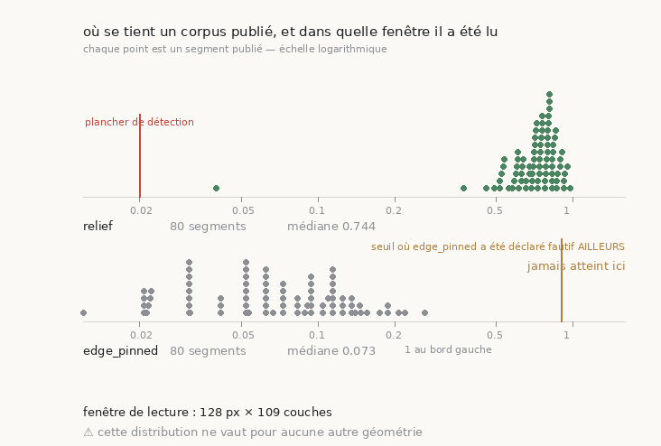

# 52 — Calibrer sur son corpus, parce qu'un seuil n'appartient qu'à sa géométrie

2026-08-24. Suite directe de [`51`](51_une_pente_a_deux_appuis.md), et écrit après avoir
transporté **trois fois dans la même nuit** un nombre hors de la géométrie qui l'avait
produit. Aucune des trois fois n'a été trouvée en relisant.



Instruments : [`src/graine/calibration_corpus.py`](../src/graine/calibration_corpus.py)
(11 témoins) et [`figure_calibration.py`](../src/figures/figure_calibration.py)
(13 témoins). Données : [`docs/mesures/balayage_scroll1.csv`](balayage_scroll1.csv), 81 segments.

---

## 1. ⚠⚠ Les trois transports, et ce qu'ils avaient en commun

| # | le nombre | mesuré dans | offert à |
|---|---|---|---|
| 1 | le seuil **2,25×** du README public | fenêtres de **1024 px** | un outil qui lit **128 px** |
| 2 | les taux d'erreur **0/75** et **6/75** | piles **rendues** | un outil qui lit des **volumes publiés** |
| 3 | la profondeur du corpus, **« 65 couches »** | mon souvenir | une calibration publiable |

Le troisième vaut **109**, et je l'ai vérifié parce que le premier venait d'être pris en
faute. Le premier l'avait été par un écart de dix sans explication physique entre deux
distributions ; le second par le balayage lui-même, où `edge_pinned` n'atteint jamais le
seuil auquel je l'avais déclaré fautif.

> ⭐⭐ **Ce qui les relie** : le relief est lu sur une **moyenne de patch**, donc il dépend
> de la profondeur (exposant **+1,01**) *et* de l'étendue dans le plan (exposant
> **−0,830**). Une grandeur lue sur une moyenne appartient à la géométrie qui l'a moyennée.

## 2. ⭐ Le remède est dans le code, à trois endroits

Une mise en garde dans une prose ne survit pas au tableau d'à côté. Donc :

- **`tracecheck` écrit sa géométrie** dans son CSV (`layers`, `window_px`) — un fichier de
  calibration se décrit lui-même ;
- **`calibration_corpus` refuse** deux géométries dans un même fichier (jamais une moyenne),
  refuse une géométrie ni lue ni déclarée, et **marque** celle qu'on lui déclare à la main ;
- **`figure_calibration` l'imprime** sur le dessin.

## 3. ⚠⚠ Le refus a payé au premier usage réel

Lancé sur le balayage complet, `calibration_corpus` a **refusé** :

```
refus : layers n'est pas unique dans ce fichier : ['109', '6'] —
        deux instruments concaténés ne calibrent rien
```

**Un corpus publié n'est pas homogène.** Sur les 81 segments de `Scroll1`, quatre-vingts
sont lus sur **109 couches** et **un sur 6**. Une distribution unique aurait mélangé une
lecture sur six couches à quatre-vingts sur cent neuf.

⭐ Grouper vaut mieux que refuser **ou** que moyenner : `--par-geometrie` rend une
calibration par groupe, et un groupe d'un seul segment se voit immédiatement comme tel.

## 4. La calibration, enfin publiable

| 128 px × 109 couches, 80 segments | relief | `edge_pinned` |
|---|---:|---:|
| minimum | **0,040** | 0,000 |
| médiane | **0,744** | 0,073 |
| maximum | **0,975** | 0,254 |
| sous le plancher de 0,02 | **0** | — |
| au-dessus de 0,90 | — | **0** |

⭐ **Le corpus publié se tient loin du plancher** : ×2 au plus bas, ×37 à la médiane, ×49 au
plus haut. C'est la calibration que le README public promet désormais à ses lecteurs, et
c'est une commande.

⭐⭐ **Et le zéro de la seconde colonne est le plus instructif** : `edge_pinned` n'atteint
jamais, sur ce corpus, le seuil de 90 % auquel je l'avais déclaré fautif. **Sur cet
instrument, les deux signaux ne se départagent pas.** Le dire vaut mieux que réciter la
comparaison faite sur l'autre.

## 5. ⚠ Un segment publié à ×2 du plancher

| segment | relief | rapport | `material` |
|---|---:|---:|---:|
| `20260701183151-w128-129` | **0,040** | **×2** | 0,49 |
| suivant | 0,373 | ×19 | 0,61 |

Le second plus bas est déjà à ×19. Ce segment est donc **seul**, et le voir dans un tableau
demanderait de le chercher ; sur la figure il se voit d'un coup d'œil, isolé entre le
plancher et le nuage.

⚠ **Ce que ça n'établit pas.** Un relief bas dit que la colonne de profondeur ne porte
presque pas de structure là où l'outil a regardé. Ça ne dit pas que le segment est faux :
il peut être mince, mal exposé, ou tomber sur une région pauvre. Le critère est
**nécessaire, jamais suffisant** — la même prudence que [`45`](45_consistent_with_quantifie.md)
impose à la statistique typographique.

## 6. ⭐⭐ Situer NOTRE trace dans le corpus de son propre rouleau

`Scroll 1` **est** `PHercParis4` — l'alias de l'outil le dit, et c'est le rouleau sur lequel
toutes nos traces ont échoué. Le corpus qu'on vient de calibrer est donc celui du rouleau
qui nous résiste, et la comparaison qui manquait depuis le début devient possible : **à
condition de lire les deux dans la même géométrie.**

Notre trace `ps256_c0` a donc été reprofilée à **128 px × 109 couches** — exactement la
fenêtre du corpus — au lieu des 1024 px × 41 ou 161 couches de nos campagnes :

| | relief | ×plancher | rang |
|---|---:|---:|---|
| **notre trace** | **0,1978** | **×9,9** | **1ᵉʳ sur 80** |
| corpus publié, médiane | 0,7441 | ×37,2 | — |
| corpus publié, minimum | 0,0400 | ×2,0 | — |

> ⭐⭐ **Notre trace n'est PAS plate**, et c'est une correction. Lue à 1024 px elle donnait
> 0,046 — « au plancher ». Lue là où le corpus est lu, elle donne **0,1978**, soit dix fois
> le plancher. La platitude était en partie un artefact de la fenêtre de lecture.
>
> ⚠ Ce qu'elle est, en revanche : **au premier percentile de son propre rouleau**, à
> **×0,27** de la médiane publiée. Un seul segment publié fait moins bien.

⚠ **Ce que ça ne renverse pas** : le contraste de [`51`](51_une_pente_a_deux_appuis.md) §6
(0/75 contre 34/63) reste valide — il était interne à une seule géométrie, tous les profils
lus à 1024 px. Ce qui doit être qualifié, c'est la **formulation** « nos traces ne montrent
aucun relief » : à la géométrie du corpus publié, elles en montrent, tout en bas.

⭐ L'outil qui le dit est `--situer`, et il **refuse** quand les deux géométries diffèrent —
y compris quand seule la profondeur change. Situer une lecture à 1024 px dans une
distribution mesurée à 128 px placerait le candidat quatre fois trop bas, et le classement
paraîtrait parfaitement sensé.

### ⭐⭐ Les huit candidats, et la coupure est nette

Situer une trace ne prouve rien sur les autres. Les huit candidats de
[`48`](48_ou_monter_lexperience.md) ont donc été **relus à la géométrie du corpus** —
`src/outils/situer_nos_traces.sh`, une pile de 161 couches ramenée à sa sous-fenêtre **centrée**
de 109 :

| candidats | relief | ×plancher | rang sur 80 |
|---|---:|---:|---|
| ~~`m7` c0…c4 (5)~~ | ~~**0,0000**~~ | — | ⚠⚠ **retiré** |
| `ps256` c0…c2 (3) | 0,164 – 0,198 | ×8,2 – ×9,9 | **1** |

> ⚠⚠ **CORRIGÉ le 2026-08-24 — la ligne `m7` ne mesurait pas une surface, elle mesurait du
> vide.** Ce document a affirmé ici que « les cinq `m7` lisent exactement zéro, même à la
> géométrie du corpus, donc leur platitude est réelle et non un artefact de fenêtre ».
> **C'est faux.** Les cinq piles rendues sont **entièrement noires** — aucun pixel allumé sur
> aucune des 161 couches — parce que leur maillage est écrit dans le volume au **niveau 2** et
> qu'il a été rendu contre le **niveau 0** : le moteur a échantillonné des coordonnées situées
> au quart de leur vraie position, donc dans le vide.
>
> Et l'instrument a compté « 49 fenêtres avec matière » sur ces images noires, parce que son
> seuil de matière était **relatif au maximum de la pile** : sur un tableau de zéros,
> `>= 0,5 × 0` est vrai partout. Détail complet, correctif et batterie :
> [`54`](54_cinq_rendus_vides.md).
>
> ⭐ Conséquence : **la coupure entre les deux familles de prédiction n'est plus établie** —
> elle reposait entièrement sur ce zéro. Et cinq traces reviennent dans le jeu : elles n'ont
> jamais été lues.
>
> ⭐⭐⭐ **Mesuré depuis** : le morceau de `m7_c0` qui a effectivement de la matière, rendu
> dans le bon repère et relu ici, donne **0,1589 — rang 1ᵉʳ sur 80**, c'est-à-dire
> *exactement* où sont les `ps256` (0,164 – 0,198, rang 1ᵉʳ). La coupure n'est pas seulement
> non établie : elle est **réfutée**. Les deux familles sont indiscernables.

⭐ Ce qui **reste** vrai : les trois `ps256` sont **toutes** au rang 1 sur 80 — elles lisent
de la structure, huit à dix fois le plancher, et restent au bas de leur propre rouleau. Leur
maillage était dans la bonne frame, et le correctif de l'instrument ne déplace pas leur chiffre
d'un dix-millième (`0,19779944` avant comme après).

⚠ La sous-fenêtre est **calculée et centrée**, jamais posée : une pile de 161 couches lue
sur 109 laisse 26 de chaque côté, et la couche tracée est le milieu de la **sous-fenêtre**,
pas de la pile. La donner en coordonnées de pile décalerait le profil de vingt-six couches
sans rien signaler.

## 7. Ce que ce document n'établit pas

- ⚠ **Que le relief mesure la qualité d'une surface.** Il mesure si la colonne lue porte de
  la structure. [`51`](51_une_pente_a_deux_appuis.md) §6 montre qu'une fenêtre étroite plate
  condamne ; l'inverse n'absout pas.
- ⚠ **Que cette distribution vaille ailleurs.** Elle vaut pour 128 px × 109 couches et pour
  aucune autre géométrie — c'est tout le propos.
- ⚠ **Que les deux signaux soient équivalents.** Ils ne se départagent pas *ici*, faute
  d'occasion : `edge_pinned` ne monte jamais assez haut sur ce corpus pour se tromper.

## Reproduire

```bash
uv run python tracecheck/tracecheck.py Scroll1 --all --csv \
    --voxel-um 2.4 --prefer 2.4um > docs/mesures/balayage_scroll1.csv

python3 src/graine/calibration_corpus.py docs/mesures/balayage_scroll1.csv \
    --par-geometrie --json docs/mesures/calibration_scroll1.json

# notre trace, relue A LA GEOMETRIE DU CORPUS, puis situee dedans
cd inference_xpu && uv run python ../src/volume/depth_profile.py \
    ../data/paris4_candidats/ps256_c0/rendu_161 --grid --size 128 --step 200 \
    --from-layer 26 --to-layer 134 --traced-layer 54 --voxel-um 2.4 --out /tmp/nous_128.json
python3 src/graine/calibration_corpus.py docs/mesures/balayage_scroll1.csv --layers 109 \
    --situer /tmp/nous_128.json --json docs/mesures/situer_notre_trace.json

# les huit candidats d'un coup
CORPUS=docs/mesures/balayage_scroll1.csv src/outils/situer_nos_traces.sh \
    data/paris4_candidats/*/rendu_161

uv run python src/figures/figure_calibration.py \
    --csv docs/mesures/balayage_scroll1.csv --layers 109 \
    --sortie docs/images/52_calibration.png

# les témoins, hors ligne
python3 src/graine/calibration_corpus.py --verifier
python3 src/figures/figure_calibration.py --verifier
```
