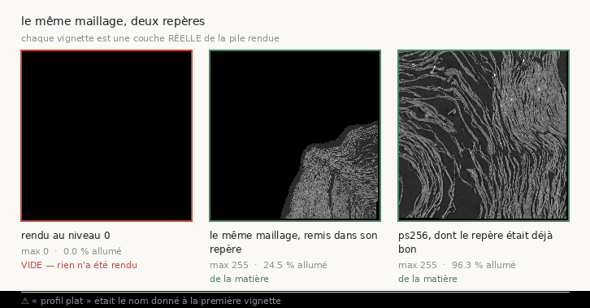

# 54 — Cinq rendus vides, lus comme cinq surfaces plates

> ⚠⚠ **Correction d'un résultat publié.** [`52`](52_calibrer_sur_son_corpus.md) §6 affirme
> que « les cinq `m7` lisent zéro à toutes les géométries essayées : leur platitude est
> réelle, pas un artefact de fenêtre ». **C'est faux.** Leur platitude n'est pas une propriété
> de la surface tracée : les cinq piles rendues sont **entièrement noires**, et un défaut de
> l'instrument les a comptées comme « 49 fenêtres avec matière ».



*Les trois vignettes sont des couches **réelles** des piles rendues, et les chiffres sous
chacune sont recalculés depuis la couche affichée. Les deux premières viennent du **même
maillage** — seul le repère dans lequel on l'a lu diffère. La zone noire de la seconde est
la part du maillage qui tombe hors du volume scanné (§3 ter).*

⚠ *Le 24,5 % de la vignette porte sur **une** couche, celle qui est dessinée ; le 24,4 % du
texte porte sur un échantillon de la pile entière. Deux chiffres proches et deux mesures
différentes — les confondre serait le transport que ce document existe pour éviter.*

## 1. Ce qui a été mesuré

Le déclencheur n'est pas une relecture. C'est une **taille de fichier** :

| | pile de 161 couches | par couche |
|---|---:|---:|
| `ps256_c0` | 562 Mo | 3,7 Mo |
| `m7_c0` | **7,6 Mo** | **47 Ko** |

Les images ont pourtant **les mêmes dimensions** (2361 × 2341 contre 2341 × 2361). Un facteur
80 sur des images de même taille ne peut venir que de la compression, donc du contenu. Lecture
directe des pixels, une couche sur vingt, sur les huit candidats :

| pile | couches | max | pixels allumés |
|---|---:|---:|---:|
| `m7_c0` … `m7_c4` (5) | 161 | **0** | **0,0 %** |
| `ps256_c0` … `c2` (3) | 161 | 255 | 95,8 – 96,3 % |

**Les cinq piles `m7` sont entièrement noires.** Aucun pixel allumé, sur aucune couche.

⚠ Le coup d'œil est devenu une mesure : `analysis/src/matiere_des_piles.py`, sortie dans
`docs/matiere_des_piles.json`. La question qu'il pose est **binaire et sans seuil** — le
maximum de la pile est-il strictement positif — parce qu'un pixel à zéro n'a pas de matière
par définition du format. La part allumée est **rapportée à côté** : « il y a de la matière »
et « la pile est copieusement remplie » sont deux faits différents.

⚠⚠ Sa batterie sonde une **limite** plutôt que de l'affirmer : une pile dont une seule couche
porte quelque chose est déclarée vide par un pas d'échantillonnage qui saute cette couche.
Taire ça ferait de `--pas` un réglage qui change le verdict sans le dire.

⚠ Et un défaut d'environnement trouvé en le lançant : le projet racine n'avait pas
`imagecodecs`, donc `tifffile` **refusait** de décoder les piles réelles (LZW) — pendant que
la batterie passait au vert, parce qu'elle écrit ses fixtures sans compression. Une batterie
verte dans un environnement où l'outil ne peut lire aucune donnée réelle est une batterie qui
ne couvre pas la panne. Ajouté aux dépendances.

## 2. ⚠⚠ Pourquoi l'instrument a dit « 49 fenêtres avec matière »

`analysis/src/depth_profile.py` écartait les fenêtres sans matière ainsi :

```python
alive = peak_value >= floor * peak_value.max()
```

C'est-à-dire : *cette fenêtre est-elle claire par rapport à la plus claire d'ici ?* Sur une
pile entièrement noire, `peak_value.max()` vaut **0**, donc le seuil vaut 0, donc `>= 0` est
vrai **partout**. Un tableau de zéros satisfait le test de matière à 100 %.

C'est la **vérification incapable d'échouer**, dans l'instrument qui produit tous les chiffres
de relief du projet — et elle a fait publier un rendu raté comme une propriété de nos traces.

⚠ La docstring, elle, disait juste : « une fenêtre sans matière n'a pas de surface ».
L'intention était bonne, l'implémentation était auto-référentielle.

### Le correctif, et pourquoi ce n'est pas un seuil

Un pixel à zéro n'a pas de matière **par définition du format**, sans calibration. Il suffit
donc d'exiger que le pic soit strictement positif — aucun nombre transporté n'entre dans le
remède :

```python
pic_global = float(peak_value.max())
alive = (peak_value >= floor * pic_global) & (peak_value > 0.0)
```

Et une pile vide **est refusée**, pas rapportée. « Il n'y a rien à lire » et « ce que je lis
est plat » sont deux faits différents, et les confondre est exactement ce qui vient d'être
payé. Le refus nomme le pic global mesuré, donc l'appelant sait s'il regarde un rendu raté ou
une surface réellement sombre.

⭐ **Vérifié que le correctif ne déplace aucun chiffre réel** : `ps256_c0` relu à la géométrie
du corpus rend `amplitude_mediane = 0,19779944`, exactement la valeur publiée (**0,1978**).

### `depth_profile.py` n'avait AUCUNE batterie

C'est l'instrument dont sort chaque relief de ce projet, et rien ne vérifiait qu'il sait
encore mesurer, ni surtout qu'il sait **échouer**. Il en a une (14 contrôles), et elle
fabrique **trois** piles parce que la distinction qui compte ne se voit qu'à trois :

| pile de contrôle | ce qu'elle doit rendre |
|---|---|
| entièrement noire | **refusée**, en nommant le pic global |
| uniforme mais **éclairée** | acceptée, et lue **plate** (`part_plates` = 1) |
| avec une bosse | du relief, et le pic **sur la bosse** |

Les deux premières sortaient le même verdict. Ce sont deux faits différents.

## 3. ⭐⭐ La cause : un maillage au niveau 2 rendu contre le volume au niveau 0

Un `tifxyz` porte des **indices de voxel**, et un indice ne veut rien dire sans le volume qui
le numérote. Rien ne dit lequel : ni `meta.json`, ni `scale` (qui est le pas de la grille dans
le plan, pas la résolution du volume), ni le fichier de paramètres du traceur — `seed.json`
enregistre `voxelsize: 2.4` pour `m7` **comme pour** `ps256`.

Les deux journaux, eux, impriment la forme du tableau zarr qu'ils ouvrent :

```
traceur (m7) : zarr dataset size for scale group 0 [18946, 8174, 8174]
rendu        : zarr dataset size for group 0       [75784 32693 32693]
rapport      : 4,0000  3,9996  3,9996        ⇒  niveau 2
```

**Le maillage `m7` est écrit dans le volume au niveau 2, et il a été rendu contre le niveau 0.**
Le moteur a échantillonné consciencieusement des coordonnées situées au quart de leur vraie
position, c'est-à-dire dans le vide, et a produit 161 images noires.

La confirmation est dans les boîtes englobantes, avant et après remise à l'échelle :

| | x | y | z |
|---|---|---|---|
| `m7_c0` tel quel | 1 776 – 4 084 | 4 188 – 6 489 | **7 822 – 9 500** |
| `m7_c0` ×4 | 7 104 – 16 334 | 16 752 – 25 955 | **31 286 – 38 001** |
| `ps256_c0` (niveau 0) | 9 628 – 11 876 | 9 461 – 11 758 | **38 723 – 39 342** |
| segment publié `20230702185753` | 14 037 – 21 224 | 11 637 – 24 401 | 29 438 – 73 920 |

Avant remise à l'échelle, `m7` est à `z ≈ 8 000` quand tout le reste du rouleau est à
`z ≈ 30 000 – 74 000`. Après, il est **dedans**.

⚠ Le diagnostic porte sur les **huit** candidats et non sur un seul :
`analysis/src/niveau_du_maillage.py` lit les deux journaux et rend le rapport. **Les cinq
`m7` sont au niveau 2, les trois `ps256` au niveau 0.** Les deux familles ont été tracées à
deux résolutions, et seule l'une des deux a été rendue dans une frame qui lui correspond.

### Le détecteur refuse plus qu'il n'affirme

Le rapport est vérifié sur **les trois axes** — un volume peut être anisotrope, et un facteur
lu sur un seul axe passerait sans rien dire sur un recadrage qui n'est pas une pyramide. Sont
refusés : un rapport anisotrope, un facteur qui n'est pas une puissance de deux, un maillage
plus grand que le volume, des dimensions dépareillées. Rendre « niveau 2 » sur des rapports
(4, 4, 3,7) laisserait corriger un maillage vers une position qui n'est pas la bonne, et le
résultat ressemblerait à une surface un peu de travers.

### ⭐⭐ Et la surface existe : rebasée, elle rend de la matière

`m7_c0` remis à l'échelle ×4 puis rendu au niveau 2 (21 couches, 591 × 586 px) :
**max 255, 24,4 % des pixels allumés, sur toutes les couches**. Contre 0 et 0,0 % pour le même
maillage rendu tel quel.

**La trace `m7` n'est donc pas une feuille plate : c'est une surface réelle qu'on regardait au
mauvais endroit.**

⚠ La remise à l'échelle **ne crée aucun détail**. Un maillage tracé au niveau 2 reste une
description grossière de la feuille ; le rebaser le place au bon endroit dans le volume fin,
rien de plus. Ce qu'on mesure ensuite est le relief de **cette surface-là**, ce qui est
précisément la question.

## 3 bis. ⭐⭐ Ce n'est pas la prédiction qui décide, c'est la GRAINE — et ça touche treize rendus

Le nom du produit de surface le disait depuis le début, et personne ne l'a lu :

```
20260411134726-surface-20260413141734-surface-recto-
20260411134726-surface-20260413222639-surface-m7-L2-      ← L2
```

Le 2×2 croisé de [`48`](48_ou_monter_lexperience.md) a tracé chaque prédiction à **chaque**
graine, quatre fois. Mesuré sur ses seize piles :

| | graine `ps256` | graine `m7` |
|---|---|---|
| prédiction `ps256` | max 255, 94,2 – 95,9 % allumé | **max 0, 0,0 %** |
| prédiction `m7` | max 255, jusqu'à **96,4 %** allumé | **max 0, 0,0 %** |

⭐⭐ **Le vide suit la graine, pas la prédiction.** Une graine est une coordonnée ; celle de
`m7` est choisie dans le produit `-L2-`, donc la trace qui en sort porte des coordonnées de
niveau 2, quelle que soit la prédiction où elle a poussé.

Bilan : **13 piles entièrement noires** — les 5 candidats plus les 8 cellules « graine `m7` »
du 2×2. ⚠ Et l'observation la plus robuste de ce 2×2 — « l'indécidabilité suit la graine à
chacune des huit répétitions » — était **exacte** ; c'est son mécanisme qui était faux. « Cet
endroit n'a pas de feuille » n'a jamais été mesuré : **on n'a jamais regardé cet endroit**.

## 3 ter. ⚠⚠ Et la vraie panne du maillage `m7` : il déborde du volume scanné

Remis dans son repère, le maillage `m7` n'est toujours pas lisible partout. Le sondage
(`analysis/src/matiere_au_point.py`, un bloc zarr par point, sur la **surface** et non au
centre de sa boîte) :

| maillage | niveau | matière | bloc absent du dépôt |
|---|---|---:|---:|
| `ps256_c0` | 0 | **13 / 13** | 0 |
| `m7_c0` | 2 | **3 / 11** | **8 / 11** |

⭐ Et les deux méthodes s'accordent : le rendu de `m7_c0` au niveau 2 lit **24,4 %** de pixels
allumés, le sondage **27 %** de points dans la matière. Deux instruments qui n'ont rien en
commun donnent le même quart.

**Un « bloc absent » dans un volume `-masked` veut dire que le dépôt n'a rien écrit là**,
c'est-à-dire que le point est hors du masque du scan. Donc les trois quarts du maillage `m7`
tombent là où il n'y a **pas de données** — pas là où le papyrus est plat.

⚠ Ce que ça ne dit pas : si la trace est sortie du rouleau, ou si le masque exclut une région
que la prédiction couvre quand même. Les deux se mesurent, et ce n'est pas la même panne. Ce
qui est acquis, c'est que « profil plat » était le troisième nom d'un fait qui n'en est pas
un.

⚠ Corollaire méthodologique : découper un morceau d'un maillage sans vérifier qu'il y a de la
matière dessous refait la même erreur d'un cran plus bas. Le premier morceau `m7` découpé au
hasard des trous a rendu, lui aussi, une pile entièrement noire — et pour la troisième raison
différente de la journée.

## 3 quater. ⭐⭐⭐ La première VRAIE lecture d'une trace `m7` : elle est au même endroit que `ps256`

Le sondage disait où le maillage `m7` a de la matière. Ce morceau-là — 30 × 30 points de
grille, sans trou, **9 sondages sur 9 dans la matière** — a été rendu au niveau 0 dans le
repère rebasé (2400 × 2400 px, 161 couches, 600 Mo, 87,1 % de pixels allumés) puis relu à la
géométrie du corpus :

| | relief | ×plancher | rang sur 80 |
|---|---:|---:|---|
| **`m7_c0`, enfin lisible** | **0,1589** | **×7,9** | **1ᵉʳ sur 80** |
| nos `ps256` | 0,164 – 0,198 | ×8,2 – ×9,9 | 1ᵉʳ sur 80 |
| corpus publié, médiane | 0,7441 | ×37,2 | — |
| un maillage **publié** passé par notre chaîne | 0,8726 | ×43,6 | 72ᵉ sur 80 |

> ⭐⭐⭐ **`m7` et `ps256` sont au même endroit.** La « coupure nette entre les deux familles
> de prédiction », que [`52`](52_calibrer_sur_son_corpus.md) §6 annonçait comme visible « sans
> pente, sans deux fenêtres et sans seuil », était **entièrement** un artefact des rendus
> vides. Mesurées correctement, les deux familles sont indiscernables : 0,159 contre
> 0,164 – 0,198, toutes au rang 1 sur 80.

⚠ Portée exacte de cet énoncé : il porte sur **le morceau du maillage `m7` qui a de la
matière**, pas sur le maillage entier — dont les trois quarts tombent hors du volume scanné
(§3 ter). *Là où `m7` a quelque chose à lire, il lit comme `ps256`.*

⭐ Et le mur, lui, se dit maintenant en une seule phrase au lieu de deux : **nos traces, quelle
que soit la prédiction dont elles sortent, portent quatre à cinq fois moins de structure en
profondeur que l'avant-dernier segment publié de leur propre rouleau** — pendant qu'un
maillage publié passé par la même chaîne revient au-dessus de la médiane.

## 3 quinquies. ⭐⭐⭐ Et en REGARDANT : ce ne sont pas des feuilles, ce sont des spires en travers

Question de l'auteur, devant la figure précédente : *« c'est toujours la vue en tranche, mais
un jour on aura une vue des vraies feuilles aplaties ou bien ? »*. Elle méritait une réponse
mesurée, et elle en avait une — le dépôt mesurait le relief depuis des semaines **sans jamais
mettre une couche publiée à côté d'une des nôtres**.


*Les quatre vignettes couvrent **la même étendue de papyrus** — 512 voxels de côté, soit
1,2 mm — et le programme **refuse** de dessiner si ce n'est pas le cas : comparer une tuile de
512 voxels à une de 2400 ferait passer une différence d'échelle pour une différence de
surface. Les trois dernières sortent de **la même chaîne de rendu**.*

| vignette | ce qu'on voit | relief |
|---|---|---:|
| référence publiée (surface-volume de la communauté) | une **feuille de face** : fibres horizontales, mouchetures, déchirures | 0,791 |
| le maillage publié passé par **notre** chaîne | une feuille aussi : couverture continue, fibres, zones arrachées | 0,873 |
| `ps256_c0`, notre trace | des **rubans clairs séparés de vide**, des dizaines, parallèles | 0,198 |
| `m7_c0`, notre trace | la même chose, encore plus serrée | 0,159 |

> ⭐⭐⭐ **Ce ne sont pas deux qualités du même objet, ce sont deux objets.** Une surface
> publiée montre du papyrus *vu de face*. Nos traces montrent ce qui ressemble à des **spires
> coupées en travers** : la surface tracée ne suit pas une feuille, elle en traverse
> plusieurs.

⭐ Et c'est **exactement ce que le relief disait**, en moins lisible : une surface bien posée
sur une feuille traverse air → papyrus → air en profondeur, donc son profil a une grande
amplitude ; une surface transverse rencontre du papyrus à toutes les profondeurs, donc son
profil est plat. 0,79 et 0,87 contre 0,16 et 0,20.

⚠ **La chaîne de rendu est innocentée une seconde fois, et par l'image cette fois** : les
vignettes 2, 3 et 4 sortent du même moteur avec les mêmes réglages. Seule l'entrée change, et
la catégorie du résultat change avec elle.

⚠ Ce que ça ne dit pas : *pourquoi* le traceur produit une surface transverse. C'est la
question suivante, et elle n'a pas de réponse ici.

⭐ La réponse à la question posée, enfin, est **non** : ce dépôt n'a **jamais** produit une
vue de vraie feuille aplatie. Il en a mesuré l'absence de plusieurs façons sans jamais la
regarder.

## 3 sexies. ⚠⚠ CORRECTION de ma propre §3 : c'est la GRAINE, pas le maillage

La §3 dit que « le maillage `m7` est écrit dans le volume au niveau 2 et a été rendu contre le
niveau 0 ». Le rapport de formes valait bien 4, mais **ce n'était pas le mécanisme** : c'était
un corrélat. Le mécanisme est un cran en amont, et deux cellules du 2×2 croisé le prouvent
l'une par l'autre.

| cellule | volume que le traceur ouvre | graine | z du maillage | rendu |
|---|---|---|---:|---|
| `m7_sur_graine_m7` | 18 946³ (L2) | [2924, 5324, 9260] | 8 675 – 10 238 | **vide** |
| `ps256_sur_graine_m7` | **75 784³ (pleine résolution)** | [2924, 5324, 9260] | 8 298 – 10 130 | **vide** |
| `m7_sur_graine_ps256` | 18 946³ (L2) | [10752, 10616, 38740] | 38 528 – 39 083 | matière |
| `ps256_sur_graine_ps256` | 75 784³ | [10752, 10616, 38740] | 38 513 – 39 706 | matière |

⭐⭐ **Le maillage suit le repère de la GRAINE, pas celui du volume ouvert.** `ps256_sur_graine_m7`
ouvre le volume pleine résolution et produit quand même un maillage à `z ≈ 8 300` ;
`m7_sur_graine_ps256` ouvre le volume L2 avec une graine **hors de ses bornes** (38 740 > 18 946)
et produit un maillage à `z ≈ 38 500`, **avec de la matière**.

### Une requête HTTP aurait tout arrêté

Les deux graines, sondées dans le volume scanné à pleine résolution — **un bloc zarr chacune**,
`analysis/src/matiere_au_point.py` :

| graine | ce qu'il y a là | ce que le traceur en a fait |
|---|---|---|
| `ps256` `[10752, 10616, 38740]` | **valeur 34, bloc allumé à 100 %** | 8 traces avec matière |
| `m7` `[2924, 5324, 9260]` | ⚠⚠ **bloc absent du dépôt** | **13 rendus entièrement noirs** |

⚠⚠ **Et le traceur ne refuse rien.** Il imprime `seed location [2924, 5324, 9260] value is 0`,
puis `empty space tracing`, puis il pousse. Sur les **quatre** cellules — celles qui marchent
comprises — il annonce `value is 0`, donc cette ligne ne discrimine pas ; ce qui discrimine,
c'est *y a-t-il de la matière scannée là*, et rien ne posait la question.

### ⭐⭐⭐ Conséquence : le 2×2 croisé ne pouvait PAS répondre

Sa question était *« la prédiction ou l'endroit ? »*, et son plan était de tracer chaque
prédiction à chaque graine. Mais la colonne « graine `m7` » ne trace pas **un endroit** : elle
trace un **nombre**, réutilisé dans deux systèmes de coordonnées où il désigne deux points
différents — et dans le repère pleine résolution, un point où il n'y a rien.

**L'endroit n'a jamais été tenu constant.** Le 2×2 n'a donc pas conclu à tort : il n'était pas
en position de conclure. Et la cause « la graine, c'est-à-dire l'endroit » reste **ouverte** —
avec, maintenant, un préalable écrit : *sonder la graine avant de payer le tracé*.

## 4. Ce que ça change

- ⚠⚠ **La ligne « `m7` : relief 0,0000, rang 0/80 » de [`52`](52_calibrer_sur_son_corpus.md)
  ne veut rien dire** et doit être retirée du tableau des candidats. Ce n'était pas une mesure
  de surface, c'était une mesure de vide.
- **La coupure entre les deux familles de prédiction n'est plus établie.** [`52`](52_calibrer_sur_son_corpus.md)
  §6 la présentait comme « nette, sans pente, sans deux fenêtres et sans seuil » : elle
  reposait entièrement sur le zéro des `m7`.
- ⭐ **Treize rendus reviennent dans le jeu** — cinq candidats et les huit cellules « graine
  `m7` » du 2×2 croisé. Aucun n'a jamais été lu.
- ⭐⭐ **Et le premier qui l'a été rend le verdict inverse de celui qui était publié** : `m7`
  n'est pas sous le corpus, il est **exactement là où `ps256` est** (§3 quater). Les deux
  familles de prédiction ne se départagent pas.
- ⚠ **« Cet endroit n'a pas de feuille » n'est plus établi**, et c'était la conclusion la plus
  robuste du 2×2 (8 répétitions sur 8). Ce qui reste établi, c'est que le vide **suit la
  graine** — mais pour une raison de repère, pas de papyrus.
- ⚠⚠ **Et le 2×2 n'était pas en position de conclure du tout** : sa colonne « graine `m7` »
  tenait un *nombre* constant, pas un *endroit* (§3 sexies). Un préalable en sort : **sonder la
  graine dans le volume scanné avant de payer un tracé** — une requête HTTP contre treize
  rendus.
- Ce qui **ne** change **pas** : les trois `ps256` (relief 0,164 – 0,198, rang 1/80) sont
  inchangées — leur maillage était dans la bonne frame, et le correctif de l'instrument ne
  déplace pas leur chiffre d'un dix-millième.

## 5. ⭐⭐ L'audit du dépôt entier : 31 piles vides sur 322, et trois causes

Extrapoler treize cas à l'ensemble aurait été exactement le geste que ce document reproche.
Les **322 piles rendues** de l'arbre (175 Go) ont donc été lues, une couche sur quarante :

| | piles |
|---|---:|
| avec de la matière | **291** |
| entièrement noires | **31** |
| illisibles (rendu en cours au moment de l'audit) | 9 |

Et la liste des 31 se range d'elle-même en **deux familles**, plus mon propre essai :

- **29 piles** viennent d'une **graine `m7`** — `m7`, `m7_c0…c4`, `m7_sur_graine_m7*`,
  `ps256_sur_graine_m7*`, chacune dans ses deux fenêtres (41 et 161), plus `m7_c0_niv0`,
  qui est le premier morceau que j'ai découpé aujourd'hui **au hasard des trous**, c'est-à-dire
  hors de la zone couverte par le volume ;
- **2 piles** sont `boucle/corrige_nappe_gen1_poids100`, et c'est une **cause différente**.

### La seconde cause : un aplatissement dégénéré

`corrige_nappe_gen1_poids100/plat` est une grille de **364 × 14** points — un ruban — et son
plan `x` est **entièrement négatif** : minimum −1239, maximum −1, **zéro** point positif sur
5096. Les plans `y` et `z` en ont 2370. Un indice de voxel négatif ne désigne rien, donc le
maillage n'a **aucun point valide** et son rendu ne pouvait qu'être noir.

⚠ Ce n'est ni un problème de niveau ni un problème de masque : c'est un aplatissement qui a
échoué en produisant quand même un fichier. Et le fichier a l'air d'un maillage — `meta.json`,
trois images, la bonne `scale`.

⭐ **Aucun document ne cite cette pile** (vérifié par recherche sur tout `docs/`,
`analysis/src/` et `tools/`). Le rayon de souffle reste donc la famille `m7`.

⚠ Ce que l'audit ne dit pas : si une pile **avec** de la matière est pour autant posée sur une
feuille. « Il y a quelque chose ici » est le plancher, pas le verdict — c'est ce que le relief
mesure, et c'est [`51`](51_une_pente_a_deux_appuis.md) et [`52`](52_calibrer_sur_son_corpus.md)
qui s'en occupent.

## 5 bis. ⚠ Un troisième état, nommé après avoir fait tomber l'audit

La première exécution de l'audit est morte sur la première pile encore en écriture. Un moteur
de rendu **pré-alloue** ses sorties puis les remplit bande par bande, donc entre les deux un
`.tif` existe et n'a aucune page.

« Il n'y a rien dedans » et « il n'y a rien **encore** » ne veulent pas dire la même chose, et
la première lecture condamnerait un rendu parfaitement sain qu'on a seulement regardé trop
tôt. Les piles illisibles sont donc comptées et rapportées **à part**, et l'outil ne prétend
alors ni maximum ni part allumée.

## 6. Reproduire

```bash
# le diagnostic, sur les huit candidats
for c in data/paris4_candidats/*/; do
  echo "=== $(basename $c)"
  uv run --project . python analysis/src/niveau_du_maillage.py \
      --trace-log $c/trace.log --rendu-log $c/rendu_161.log | tail -1
done

# la remise a l'echelle d'un maillage de niveau 2 vers le niveau 0
uv run --project . python analysis/src/niveau_du_maillage.py \
    --trace-log data/paris4_candidats/m7_c0/trace.log \
    --rendu-log data/paris4_candidats/m7_c0/rendu_161.log \
    --maillage data/paris4_candidats/m7_c0/plat \
    --rebaser data/paris4_candidats/m7_c0/plat_niveau0

# l'audit du depot entier : 322 piles, une couche sur quarante
find data -maxdepth 4 -type d -name "rendu*" | sort > /tmp/piles.txt
uv run --project . python analysis/src/matiere_des_piles.py $(cat /tmp/piles.txt) \
    --pas 40 --json docs/matiere_des_piles_toutes.json

# la figure des trois vignettes
uv run --project . python analysis/src/figure_piles_vides.py \
    --vide data/paris4_candidats/m7_c0/rendu_161 \
    --rebase data/temoin_rendu/m7_c0_g2/rendu \
    --temoin data/paris4_candidats/ps256_c0/rendu_161 \
    --sortie docs/images/54_piles_vides.png --json docs/figure_piles_vides.json

# la tuile de reference publiee, puis la figure feuille-ou-tranche
uv run --project . python analysis/src/tuile_surface_publiee.py \
    --sortie data/temoin_rendu/reference_publiee.tif
uv run --project . python analysis/src/figure_feuille_ou_tranche.py \
    --reference data/temoin_rendu/reference_publiee.tif \
    --publie data/temoin_rendu/rendus/morceau_00/g0_n161/rendu \
    --nos-traces data/paris4_candidats/ps256_c0/rendu_161 \
                 data/temoin_rendu/m7_c0_lisible/rendu \
    --noms ps256_c0 m7_c0 --reliefs 0.7912 0.8726 0.1978 0.1589 \
    --sortie docs/images/54_feuille_ou_tranche.png \
    --json docs/figure_feuille_ou_tranche.json

# les temoins, hors ligne
uv run --project . python analysis/src/niveau_du_maillage.py --verifier
uv run --project . python analysis/src/tuile_surface_publiee.py --verifier
uv run --project . python analysis/src/figure_feuille_ou_tranche.py --verifier
uv run --project . python analysis/src/depth_profile.py --verifier
uv run --project . python analysis/src/matiere_des_piles.py --verifier
uv run --project . python analysis/src/matiere_au_point.py --verifier
uv run --project . python analysis/src/figure_piles_vides.py --verifier
```
