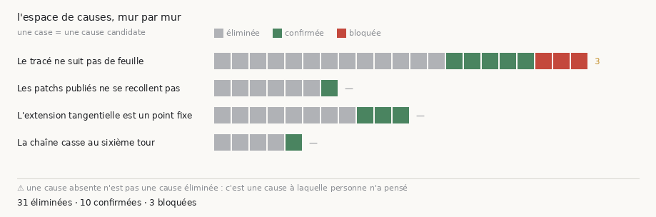

# 55 — Les murs, et l'espace de causes qui rétrécit

> ⚠⚠ **Ce document est RENDU, pas écrit.** Sa source est
> [`docs/registres/murs_et_causes.tsv`](murs_et_causes.tsv) et son producteur est
> `src/depot/murs_et_causes.py --rendre`. L'éditer à la main serait perdre la
> modification au rendu suivant — et surtout perdre la garde : la batterie vérifie que
> **chaque ligne pointe vers un document qui contient encore son ancre**.

Un mur n'est pas une tâche, c'est un **espace de causes** dont on retire une entrée à
la fois. Une feuille de route qui liste des tâches laisse croire qu'on avance quand on
tourne ; celle-ci liste des causes **éliminées**, et montre l'espace rétrécir. C'est le
seul progrès mesurable sur un problème que personne n'a résolu.

**30 causes candidates** sur **4 murs** : ❌ **19** éliminées · ✅ **10** confirmées · 🔒 **1** bloquée

| symbole | verdict | ce que ça veut dire |
|---|---|---|
| ❌ | **éliminée** | testée, ce n'est pas la cause |
| ✅ | **confirmée** | testée, c'en est une — ou un levier qui marche |
| ⏳ | **ouverte** | nommée, pas encore testée |
| 🔒 | **bloquée** | ne peut pas être testée aujourd'hui, et on dit pourquoi |

*Une case par cause, dans l'ordre du vocabulaire — donc ce qui reste à faire tombe
toujours à droite. Ce n'est **pas** une jauge de progression : rien ne dit que
l'espace est borné. Produite par `src/figures/figure_murs.py`, dont les comptes
viennent du même registre et sont vérifiés contre ce tableau.*

## 1. Le tracé ne suit pas de feuille

❌ 6 éliminées · ✅ 5 confirmées · 🔒 1 bloquée

| cause candidate | | ce qui a été mesuré | où |
|---|---|---|---|
| la graine, c'est-à-dire l'endroit | ✅ | sondée dans le volume scanné : la graine m7 n'a AUCUNE matière à ≈ 7,1 spires dans son repère ni à ≈ 8,9 converties, quand la graine ps256 est SUR de la matière dans les deux repères (0 µm) — l'endroit explique la famille m7, pas le mur | [`54`](54_cinq_rendus_vides.md) |
| le traceur accepte une graine qui ne désigne rien | ✅ | graine m7 : bloc absent du dépôt, et il trace quand même — 13 rendus noirs ; graine ps256 : bloc allumé à 100 %, 8 traces avec matière | [`54`](54_cinq_rendus_vides.md) |
| le traceur est un tirage, pas une fonction | ✅ | 13 traces propres sur 14 à paramètres identiques ; toute comparaison à un seul tirage ne vaut rien | [`30`](30_le_traceur_est_un_tirage.md) |
| ce qui est établi : la surface est EN TRAVERS de l'empilement | ✅ | des spires coupées en travers, vues à l'image à étendue égale contre une feuille publiée | [`25`](25_une_graine_choisie_sur_la_planeite.md) |
| le niveau de la prédiction n'était propagé nulle part | ✅ | trois conséquences : graine dans le vide, maillage rendu hors du scan, et min_area_cm évalué dans deux unités — les aires m7 sont fausses d'un facteur 16 | [`54`](54_cinq_rendus_vides.md) |
| la fenêtre de lecture | ❌ | relu à 128 px × 109 couches, la géométrie du corpus : le classement ne bouge pas | [`52`](52_calibrer_sur_son_corpus.md) |
| la chaîne de rendu | ❌ | un maillage PUBLIÉ passé par notre chaîne revient à 0,873 — au-dessus de la médiane du corpus | [`53`](53_le_temoin_positif_du_rendu.md) |
| le champ de normales (NORMAL pèse 10) | ❌ | chargé pour de vrai : coût par génération ×29, trajectoire INCHANGÉE sur 118 générations | [`26`](26_le_champ_de_direction.md) |
| le plafond de générations | ❌ | budget ×3,3 : aire ×11,5, α +0,89 → +0,95, sous le bruit du tireur (0,16) | [`50`](50_le_rendu_attendait_la_memoire.md) |
| le niveau de pyramide | ❌ | 0,02 d'écart entre niveaux 0 et 1, pour une résolution de 0,20 | [`50`](50_le_rendu_attendait_la_memoire.md) |
| la prédiction de surface (ps256 contre m7) | ❌ | lues correctement, les deux familles sont indiscernables : 0,159 contre 0,164 – 0,198 | [`54`](54_cinq_rendus_vides.md) |
| comparer le relief d'une trace L2 à une trace L0 | 🔒 | à aire égale un maillage L2 rend quatre fois moins de pixels de côté, donc les deux ne tiennent jamais dans la même fenêtre d'analyse — le relief ne peut pas les départager | [`54`](54_cinq_rendus_vides.md) |

## 2. Les patchs publiés ne se recollent pas

❌ 1 éliminée · ✅ 1 confirmée

| cause candidate | | ce qui a été mesuré | où |
|---|---|---|---|
| un patch par feuille, pas par région | ✅ | la paire la plus proche est à 79 µm, soit environ deux fois le seuil de séparation | [`44`](44_ou_la_chaine_se_trouve.md) |
| raccorder deux segments officiels | ❌ | l'outil exige des surfaces qui se recouvrent, et il n'existe AUCUN candidat — mesuré sur 4,5 Mo de catalogue | [`44`](44_ou_la_chaine_se_trouve.md) |

## 3. L'extension tangentielle est un point fixe

❌ 8 éliminées · ✅ 3 confirmées

| cause candidate | | ce qui a été mesuré | où |
|---|---|---|---|
| une extension UNIQUE, puis rognage | ✅ | 4,28 → 12,97 cm² à α = +0,000, ramenée à 6,02 cm² propres, soit +41 % de matière validée | [`44`](44_ou_la_chaine_se_trouve.md) |
| la chaîne TANGENTIELLE, qui suivrait une feuille autour du tour | ✅ | elle marche, à DEUX conditions qui se composent : un pas FIXE en voxels (la géométrie) et un RECALAGE sur la matière à chaque maillon (la donnée). 60 maillons de 96 µm : pas tenu à 96,0 exactement, et +6,9 points au-dessus du plancher du hasard à 5 760 µm — là où la chaîne sans recalage est morte dès 768 (+1,5). La pente s'aplatit sur le dernier millimètre : plateau bas, pas chute. ⚠ Ne dit pas que c'est la BONNE feuille (il faut de l'encre), et part d'un segment PUBLIÉ et non d'une de nos traces | [`44`](44_ou_la_chaine_se_trouve.md) |
| enchaîner la projection à PETIT pas (95 µm/maillon) | ✅ | un LEVIER qui marche À COURTE DISTANCE, confirmé sur trois grandeurs indépendantes. À 478 µm, là où un seul bond quitte sa feuille (18,4 % de pic au bord), la chaîne y est encore (2,0 %) avec +31 % d'amplitude ; et lue contre le PLANCHER DU HASARD elle est à +30,5 points à 288 µm, +24,1 à 480, puis +1,5 à 768 — soit morte entre les deux. ⚠⚠ Le « croisement » que j'avais publié à 1 920 µm n'existe pas : chaîne ET bond y sont au niveau du hasard (−1,7 et +1,6) | [`44`](44_ou_la_chaine_se_trouve.md) |
| augmenter le budget d'un seul coup | ❌ | budget 200 : 28,6 cm² mais 25 036 auto-intersections et α = +1,313, la surface se replie sur elle-même | [`44`](44_ou_la_chaine_se_trouve.md) |
| enchaîner rogner puis étendre | ❌ | le cycle converge vers un point fixe autour de 6 cm² : chaque tour regagne ce qu'il vient de perdre | [`44`](44_ou_la_chaine_se_trouve.md) |
| juger une courbe sur trois points | ❌ | trois points donnaient « pente monotone », six « plateau puis falaise », neuf « maximum puis descente douce » — chaque forme plausible, chaque forme fausse | [`44`](44_ou_la_chaine_se_trouve.md) |
| juger la projection par un sondage de points | ❌ | bloc avec matière et valeur au point rendent le MÊME chiffre de 0 µm à 2,4 mm : un bloc fait 307 µm quand les feuilles sont à 10-20 µm | [`44`](44_ou_la_chaine_se_trouve.md) |
| enchaîner la projection à GRAND pas (238 µm/maillon) | ❌ | cinq maillons de 238 µm étalent la boîte ×2,38 à nombre de points constant, contre ×1,10 pour le bond direct — et finissent 5,33 SPIRES à côté de lui. ⚠ Le pas réel dérive avant la boîte : 238 → 963 µm par maillon | [`44`](44_ou_la_chaine_se_trouve.md) |
| l'emballement du pas d'une chaîne | ❌ | ce n'était pas l'enchaînement mais l'UNITÉ : un pas de grille couvre pas × longueur de tangente, donc un maillage qui cisaille s'envoie lui-même plus loin. À pas FIXE en voxels, vingt maillons tiennent 96,0 µm (×1,00), boîte ×1,55, 14 280 points sur 14 280 — contre ×2 692, ×4 976 545 et 615 points au pas de grille | [`44`](44_ou_la_chaine_se_trouve.md) |
| un pas contrôlé suffit-il à rester sur la feuille ? | ❌ | non, et les deux pannes sont distinctes : à pas fixe la géométrie est saine sur 20 maillons (tous les points, pas au dixième de µm) et le contact matière tombe quand même à 39,7 % dès 768 µm puis plafonne vers 35 % | [`44`](44_ou_la_chaine_se_trouve.md) |
| le recalage mesure-t-il sa propre sortie ? (circularité) | ❌ | contrôle sur la projection AVANT son recalage : +19,1 contre +19,0 à 768 µm et +15,3 contre +15,1 à 1 920 — identiques à la première décimale, alors que la demande de déplacement passe de 1,6 et 3,4 voxels à 0,06. La mesure ne dépend pas du recalage | [`44`](44_ou_la_chaine_se_trouve.md) |

## 4. La chaîne casse au sixième tour

❌ 4 éliminées · ✅ 1 confirmée

| cause candidate | | ce qui a été mesuré | où |
|---|---|---|---|
| le pas du rayon | ✅ | halvé de 1,0 à 0,5 : 4 spires convergentes sur 7 deviennent 6 sur 7, et la rupture disparaît — gratuitement | [`43`](43_la_chaine_des_spires.md) |
| halver le pas indéfiniment | ❌ | il y a un OPTIMUM à 0,25 : à 0,125 l'α moyen remonte de +0,102 à +0,327 | [`43`](43_la_chaine_des_spires.md) |
| le sens de croissance (in contre out) | ❌ | mesuré au lieu d'être supposé : ni meilleur, ni pire | [`43`](43_la_chaine_des_spires.md) |
| juger par le compte d'auto-intersections | ❌ | c'est une propriété de l'échantillonnage autant que de la surface : le même maillage décimé passe de 240 à 49 | [`43`](43_la_chaine_des_spires.md) |
| juger sur un seul rendu | ❌ | mesuré AVANT de s'en servir, et il ne marche pas | [`43`](43_la_chaine_des_spires.md) |

## Ce qui reste ouvert, tous murs confondus

⭐ C'est la seule liste courte du dépôt qui dise *par quoi continuer*.

| mur | cause | pourquoi elle est encore ouverte |
|---|---|---|
| le tracé ne suit pas de feuille | **comparer le relief d'une trace L2 à une trace L0** | à aire égale un maillage L2 rend quatre fois moins de pixels de côté, donc les deux ne tiennent jamais dans la même fenêtre d'analyse — le relief ne peut pas les départager |

⚠ **Une cause éliminée ne se rouvre pas sans une mesure neuve.** Les treize
éliminations de ce document ont chacune coûté une campagne ; les refaire par doute
serait payer deux fois pour le même renseignement.

⚠⚠ Et une cause **absente** de ce document n'est pas une cause éliminée : c'est une
cause à laquelle personne n'a pensé. Le tableau borne ce qu'on a testé, jamais ce qui
est possible.

