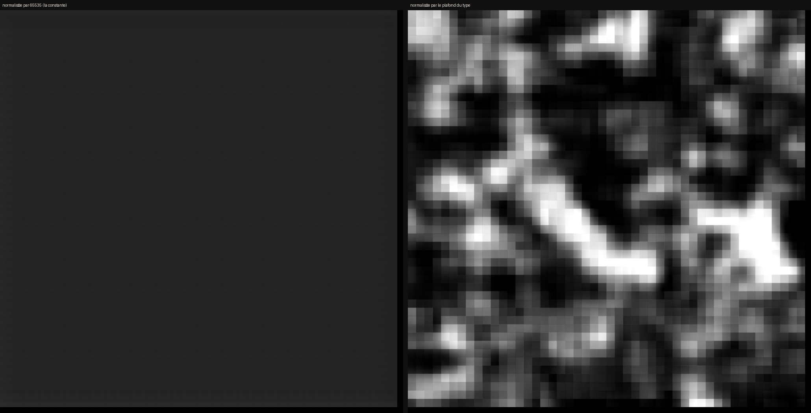
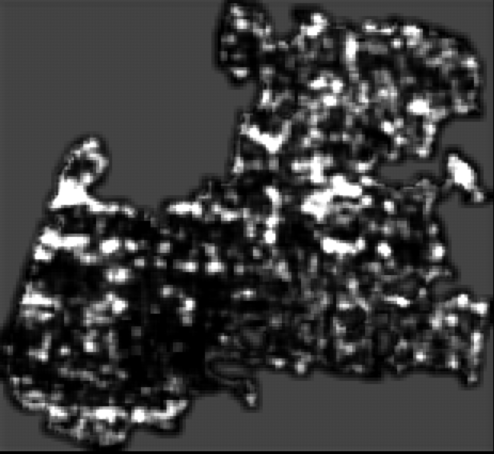

# 60 — Une constante rendait le modèle muet, et elle a fondé un résultat négatif

> ⚠⚠⚠ **RÉSERVE AJOUTÉE LE 2026-08-28** → [`65`](65_ce_que_sigma_ne_dit_pas.md) §1. Tout ce
> document raisonne sur σ, et **rien n'avait jamais vérifié qu'un σ élevé veut dire que le
> modèle LIT**. Testé pour la première fois sur les 23 tuiles étiquetées de
> [`63`](63_la_premiere_verite_terrain.md) : σ arrive **quatrième sur six** grandeurs et ne
> tranche pas (ρ = +0,263, p de Holm = 0,739). ⚠ Ça ne réfute pas σ — à cette taille
> d'échantillon rien ne peut l'être — mais ça change le **statut** de l'inférence : « σ est
> élevé donc il y a du signal » était traité comme un fait, et c'est une hypothèse qui a
> maintenant été testée une fois sans succès.


> ⚠⚠⚠ **Ce document annule une conclusion publiée de ce dépôt.** `36` §5bis répondait « non »
> à *l'encre est-elle lisible à 9 µm ?*, sur la foi d'un σ **45 fois** plus petit que là où le
> modèle marche. Ce σ mesurait une erreur d'échelle de notre côté. **La même pile, la même
> fenêtre, le même modèle, à l'échelle corrigée : σ passe de 0,0171 à 0,6558**, soit
> **1,2 fois** le témoin où le modèle lit du grec.



> À gauche ce que le modèle recevait, à droite ce qu'il aurait dû recevoir. **Les deux
> panneaux partagent leur étirement** — étirer chacun sur sa propre plage rendrait la
> constante aussi contrastée qu'une vraie carte, ce qui est exactement l'inverse de ce
> qu'on montre.
>
> Figure : `src/figures/figure_echelle.py`, depuis `data/out/ink_PHerc0172_w062{,_u16}.npy`.

## 1. La ligne

`src/xpu/infer_ink.py`, dans `load_layer_stack` :

```python
# Le modele a ete entraine sur des entrees normalisees a [0, 1] depuis du
# uint16 ; garder l'echelle brute donnerait des activations hors domaine.
return stack / 65535.0
```

Le commentaire dit **uint16**, et la constante l'écrit en dur. Une pile **uint8** divisée par
65535 arrive au modèle **257 fois trop sombre** : moyenne 0,002 au lieu de 0,6. Du noir.

⚠⚠ **Et un modèle à qui l'on donne du noir rend une constante — qui se lit comme « il n'y a
pas d'encre ici ».** C'est ce qui rend cette panne coûteuse : elle ne ressemble pas à une
panne, elle ressemble à un résultat.

## 2. ⭐⭐ Le partage était TOTAL, et personne ne l'avait regardé

`src/depot/echelle_des_piles.py` liste le type de chaque pile de couches de l'arbre :

| type | piles | d'où elles viennent |
|---|---:|---|
| **uint16** | **3** | `data/layers/` — les stacks **publiés** (Scroll 1 ×2, Scroll 4) |
| **uint8** | **211** | tout ce que `vc_render_tifxyz` rend, tout ce que `zarr_vers_couches.py` écrit |

⭐⭐⭐ **Le partage « le modèle répond / le modèle est inerte » suivait exactement celui-là.**
Les σ autour de 0,77 sont tous sur les trois piles uint16 ; les σ autour de 0,015 sont tous
sur des piles uint8.

⚠ Le pont `zarr_vers_couches.py` le disait même dans son propre en-tête — *« les couches sont
écrites TELLES QUELLES, sans normalisation : le modèle a été entraîné sur des `uint8`
bruts »* — pendant que le lecteur divisait par 65535. **Deux fichiers du même dépôt, deux
échelles, et aucun des deux ne pouvait voir l'autre.**

## 3. La mesure, et son contrôle

Même fenêtre, même code, seule l'échelle d'entrée changeant :

| | min | méd | max | **étendue** |
|---|---:|---:|---:|---:|
| `PHerc0172`, uint8 divisé par 65535 | −1,215 | −1,121 | −1,008 | **0,207** |
| … la même remise à l'échelle à la main | −1,815 | −0,526 | +2,463 | **4,278** |
| … la même, uint8 brut, **après le correctif** | −1,815 | −0,526 | +2,463 | **4,278** |

⭐ Les deux dernières lignes sont **identiques au chiffre près** : le correctif fait
exactement ce que la remise à l'échelle manuelle faisait, ce qui est la façon la moins
discutable de montrer qu'il est juste.

⚠⚠ **Et le contrôle qui compte autant : le correctif ne doit RIEN changer sur uint16.**
`np.iinfo(uint16).max` vaut 65535, donc la valeur est identique — et c'est **mesuré**, pas
déduit : la même fenêtre de Scroll 1 rend `−1,778 / −1,559 / +1,691` avant et après, au
chiffre près. Aucun résultat publié sur les piles publiées ne bouge.

## 4. ⭐⭐⭐ Ce que ça renverse

| | avant | après | contre le témoin |
|---|---:|---:|---:|
| `PHerc1447` — **un rouleau du prix** | σ **0,0171** | σ **0,6558** | **1,2×** |
| `PHerc0172` — 53 keV, hors des treize | étendue 0,207 | σ **1,0217** | **0,8×** |
| Scroll 1 — le témoin | σ 0,7712 | σ 0,7712 | 1,0× |

⭐⭐⭐ **`PHerc1447` passe de 45 fois sous le témoin à 1,2 fois — le même régime.** Le verdict
de `comparer_encre.py`, qui ne sait rien de cette histoire, est *« la cible a une dynamique
comparable au témoin »*.

## 4 bis. ⚠⚠ Répondre n'est pas lire — et la surface entière le montre

σ dit que le modèle produit de la structure, pas qu'il produit du texte. La fenêtre de
1024 px du §4 ne pouvait pas trancher : à 8,64 µm elle fait 8,8 mm, **quatre lettres de
large**. La surface **publiée entière** de `PHerc1447` a donc été rendue — 2980 × 3240, soit
**25,7 × 28,0 mm**, de quoi porter une dizaine de lignes.



> σ = **0,4838** sur 9,58 M pixels, étendue **4,266**, soit **1,6×** sous le témoin — et
> `comparer_encre` rend son verdict habituel, *« la cible a une dynamique comparable au
> témoin »*.
>
> ⚠⚠ **Et à l'œil, c'est de la moucheture.** Pas de lettres, pas de lignes, pas de colonnes.
> Les zones claires suivent la forme du segment et ses trous, pas une écriture.

⭐⭐ **Donc M1ter est ROUVERT, pas répondu par l'affirmative.** La réponse négative reposait
sur un artefact ; la réponse positive n'est pas établie pour autant.

⚠⚠ **Et c'est une limite de l'instrument qu'il faut écrire** : le même σ qui a fondé le
résultat négatif ne peut pas fonder le résultat positif. Il mesure une **dispersion**, et une
moucheture pleine échelle en a autant qu'un texte. Ce qui trancherait est le juge calibré de
[`09`](09_protocole_jugement_modele.md), qui sépare vierge **0–1** de texte **3–6**.

⚠ Ce que ça n'accuse pas : ce segment est celui dont `36` dit que la surface tracée est à
**17 µm** de sa feuille avec **2 %** de fenêtres au tiers central, et son volume de surface
n'est couvert qu'à **52,5 %**. Une moucheture sur une surface qui n'est pas posée sur la
feuille est le résultat attendu, et le bug d'échelle n'a jamais touché ce fait-là.

## 4 ter. ⚠⚠ Et l'instrument typographique, LUI, y trouve de la périodicité

L'œil dit moucheture, mais l'œil regarde une image réduite. `src/encre/typographie.py`
mesure les quatre grandeurs de [`45`](45_consistent_with_quantifie.md) — couverture,
épaisseur de trait, **périodicité des lignes**, netteté du pic — et il sait travailler sur
nos cartes de prédiction depuis ce jour (`--npy`).

⚠⚠ **Il a d'abord fallu le calibrer**, et son réglage par défaut ne peut rien conclure
**sur nos cartes** : à la réduction 4, celle de Scroll 1 — où les lettres se lisent à l'œil —
rend **0 %** de fenêtres périodiques. Un instrument qui répond « pas de texte » sur du texte
ne conclut rien.

⭐ **Et ce n'est pas un défaut du réglage : c'est une différence d'échelle**, que la docstring
de l'outil annonce (*« le facteur est un PARAMÈTRE parce qu'il dépend de la résolution du
scan »*). Vérifié plutôt que supposé : sur les **190 cartes publiées**, mesurées à la
réduction 4, **156 ont au moins une fenêtre périodique** et la part médiane de `PHerc0172`
vaut 1,0. Les cartes publiées sont des JPEG déjà réduits ×8 par leur pipeline ; les nôtres
sont en pleine résolution. Il leur faut donc **ce ×8 en plus**, et le réglage calibré
ci-dessous n'est rien d'autre.

Le balayage donne le réglage utile :

| réduction | fenêtre | Scroll 1, texte connu |
|---:|---:|---|
| 4 | 512 | 0/12 — **incapable de conclure** |
| 8 | 512 | 2/3 |
| **8** | **256** | **8/12 (67 %), période 38 px = 2,4 mm** |

Au réglage calibré, avec le contrôle qui donne une échelle au compte :

| | fenêtres périodiques | période | netteté |
|---|---:|---:|---:|
| Scroll 1 — texte connu | **8/12 (67 %)** | 38 px → **2,4 mm** | 0,751 |
| … ses pixels **mélangés** | **0/12** | — | — |
| **`PHerc1447`, surface entière** | **2/2 (100 %)** | 48 px → **3,3 mm** | 0,672 |
| … ses pixels **mélangés** | **0/2** | — | — |

⭐⭐ **Le mélange garde la distribution et détruit la structure** : la périodicité de
`PHerc1447` ne vient donc pas de sa statistique de gris, elle vient de son agencement. Et
l'interligne trouvé, **3,3 mm**, est du même ordre que les 2,4 mm de Scroll 1.

⚠⚠⚠ **Et n vaut DEUX.** Deux fenêtres, c'est un tirage à pile ou face — [`33`](33_la_carte_nest_pas_resolue.md)
est un document entier sur le fait qu'on ne conclut pas à quinze fenêtres. **Ceci est une
piste, pas une lecture.** Le seul moyen d'augmenter n est de rendre plus de surface :
`PHerc1447` en publie **quatre**, une seule était rendue, et
`src/campagnes/campagne_encre_1447.sh` rend les trois autres.

### ⭐⭐ Le critère, écrit AVANT que la campagne ne rende

> Ce paragraphe est commité pendant que les trois rendus tournent, pour la raison que
> [`53`](53_le_temoin_positif_du_rendu.md) écrit en tête : *un témoin dont on n'a pas dit
> d'avance ce qu'il condamnerait ne condamne jamais rien — il s'explique après coup.*

Ce qui sera comparé n'est **pas** une part de fenêtres périodiques contre un seuil : un
seuil serait un nombre choisi pour que le tirage du jour passe. C'est la part observée
contre celle de la **même carte aux pixels mélangés**, à n identique, par un **Fisher exact
unilatéral** — la direction est déclarée ici, une carte réelle devrait être *plus* périodique
que son mélange, jamais moins.

| issue | ce qu'on en conclura |
|---|---|
| p < 0,05 | la périodicité de `PHerc1447` n'est pas un tirage. ⚠ Ça ne dira toujours pas que c'est du **texte** — seulement que la carte est structurée là où son mélange ne l'est pas |
| p ≥ 0,05 | on ne conclut rien, et les deux fenêtres du §4 ter restent une curiosité |
| moins de 8 fenêtres au total | **on ne teste pas** : sous cette taille le test n'a pas la puissance de distinguer, et le lancer quand même serait fabriquer un p |

⚠ Et l'issue la plus probable est la troisième : la première surface a rendu **2** fenêtres,
la deuxième en rendra de l'ordre de **4** au vu de son étendue. Il faudra peut-être les
quatre surfaces pour atteindre huit.

### 4 quater. Les comptes, calculés le 2026-08-28 avant que la quatrième carte n'existe

Au réglage calibré (réduction 8, fenêtre 256), le nombre de fenêtres se calcule depuis les
seules dimensions du segment, **sans rien mesurer** :

| segment | carte | réduite | fenêtres |
|---|---|---|---|
| `20250703025628` | 4100 × 4260 | 512 × 532 | **4** |
| `20250703034159` | 3620 × 5220 | 452 × 652 | **2** |
| `20251105093211` | 8220 × 13640 | 1027 × 1705 | **24** |

⭐ Trois cartes sur quatre **ne peuvent pas** franchir le seuil de huit à elles seules, et la
quatrième le franchirait largement **si sa surface était pleine**.

⚠⚠⚠ **CORRECTION, une demi-heure plus tard, et elle porte sur la ligne ci-dessus.** Ce tableau
est calculé depuis les **dimensions** du segment, ce qui était dit — et la variable que je
n'avais pas est la **couverture**. Le pont zarr a rendu son compte au moment de construire la
pile :

| segment | chunks lus | absents | couverture |
|---|---|---|---|
| `20250702235910` | 392 | 232 | **52,5 %** |
| `20250703034159` | 742 | 447 | **50,5 %** |
| `20251105093211` | 744 | **6211** | **8,5 %** |

Le quatrième segment est **presque absent du serveur** : six mille deux cent onze chunks
manquants contre sept cent quarante-quatre lus. Sa boîte englobante est dix fois celle des
autres et sa matière n'est pas dix fois plus grande — elle est **plus petite**. Le rendu l'a
confirmé immédiatement : **226 925 fenêtres sur 251 683, soit 90 %, sont vides et sautées**,
là où les autres segments en sautaient 40 à 43 %.

⚠⚠ Donc le nombre de fenêtres **mesurables** de cette carte n'est pas 24 : `masque_papyrus`
n'en gardera qu'une fraction, et il se peut qu'aucune carte ne porte un test par elle-même.

⭐⭐ **Et c'est ce qui donne toute sa valeur au test groupé** — déclaré dans ce document avant
la campagne, implémenté pendant que cette quatrième pile se téléchargeait, donc **avant que
cette couverture de 8,5 % ne soit connaissable**. S'il avait fallu l'ajouter maintenant, en
constatant qu'aucune carte ne se teste seule, il aurait été impossible de distinguer un
protocole tenu d'un protocole ajusté aux données. Il est daté, et c'est ce qui le sauve.

⚠ Le rendu de cette carte ne coûtera d'ailleurs pas quatre heures mais **environ quarante
minutes**, pour la même raison : il n'y a presque rien à rendre.

⚠⚠ **Le test groupé, annoncé ci-dessus, est implémenté** (`fisher_periodicite_groupee`), et
la date compte : écrit pendant que la quatrième surface se **téléchargeait**, donc avant tout
résultat. Ajouter un groupement après avoir constaté que trois cartes restent muettes serait
ajuster l'analyse aux données ; l'implémenter en exécutant une phrase écrite avant la
campagne ne l'est pas.

⚠ **Le test par carte reste le PRINCIPAL**, le groupé est secondaire et sorti sous l'étiquette
`_groupe`. Les deux ne répondent pas à la même question : « peut-on dire quelque chose de
**cette surface** » et « **ce rouleau** porte-t-il une structure périodique ». Le groupement
suppose des surfaces distinctes et non recouvrantes — vrai ici, faux si l'on groupait deux
rendus d'une même surface, qui ne compteraient alors qu'une fois.

ⓘ Et une conséquence arithmétique du seuil, assertée : deux cartes de deux fenêtres groupées
font 4 contre 4, soit **exactement** huit — et à cette taille le plus petit p qu'un Fisher
unilatéral puisse rendre vaut `1/C(8,4) = 0,0143`, donc sous 0,05. Le seuil est franchi au
sens où il a été posé, pas contourné.

## 4 quinquies. LE RÉSULTAT, mesuré le 2026-08-28 à 04h28

La campagne a rendu les quatre surfaces publiées de `PHerc1447` et l'analyse a tourné au
réglage calibré sur Scroll 1 (réduction 8, fenêtre 256).

| carte | fenêtres | périodiques | période | netteté | mélange |
|---|---|---|---|---|---|
| `ink_segment_complet` *(témoin Scroll 1)* | 12 | **8** (67 %) | 38 px | 0,751 | **0/12** |
| `20250702235910` | 2 | 2 (100 %) | 48 px | 0,672 | 0/2 |
| `20250703025628` | 3 | 2 (67 %) | 37 px | 0,759 | 0/3 |
| `20250703034159` | 4 | 2 (50 %) | 30 px | 0,710 | 0/4 |
| `20251105093211` | 3 | 2 (67 %) | 43 px | 0,492 | 0/3 |

**Tests, dans l'ordre déclaré au §4 :**

| test | table | p |
|---|---|---|
| par carte, `20250703034159` (seule à atteindre 8) | `[2, 2, 0, 4]` | **0,2143** |
| témoin Scroll 1 | `[8, 4, 0, 12]` | **0,0007** |
| **groupé sur nos quatre surfaces** | `[8, 4, 0, 12]` | **0,0007** |

⭐ Le seuil déclaré est franchi par le test groupé. Selon le tableau du §4, écrit avant la
campagne, cela veut dire : **la périodicité de `PHerc1447` n'est pas un tirage**. Et cela ne
dit toujours **pas** que c'est du texte — seulement que la carte est structurée là où son
propre mélange ne l'est pas.

### ⚠⚠⚠ Ce que ce résultat NE dit pas, et quatre réserves qui comptent

1. **Les périodes ne s'accordent pas.** 30, 37, 43 et 48 px sur quatre surfaces du **même
   rouleau** — une étendue de 18 px, un rapport de **1,6**. Or `par_fenetres` écrit
   elle-même qu'« une page écrite a un interligne CONSTANT » et que des périodes éparpillées
   sont « chacune un pic différent, c'est-à-dire du bruit ». Un rouleau dont l'interligne
   varierait de moitié d'une surface à l'autre n'est pas un rouleau écrit à la main par un
   scribe, c'est un ensemble de mesures qui trouvent chacune leur pic.
2. **Chaque carte rend exactement DEUX fenêtres périodiques.** 2/2, 2/3, 2/4, 2/3. Un nombre
   aussi constant sur des surfaces de tailles très différentes est un motif, pas un hasard,
   et il n'est pas expliqué. À regarder avant d'en tirer quoi que ce soit.
3. **Le contrôle par mélange rend zéro à CHAQUE fois.** 0/12, 0/2, 0/3, 0/4, 0/3 : il n'a
   jamais, pas une seule fois, produit une fenêtre périodique. Cela rend le test très
   sensible — donc il mesure « y a-t-il une structure spatiale », ce qui est plus faible que
   « y a-t-il de l'écriture ».
4. **La quatrième carte est nettement moins nette** (0,492 contre 0,67 à 0,76), et c'est
   celle dont le volume n'est couvert qu'à 8,5 %.
5. ⚠⚠⚠ **Et la plus forte : le contrôle par mélange est un contrôle FAIBLE.** Il détruit
   toute structure spatiale, donc il répond « nos cartes sont structurées ». Un témoin
   négatif **réel** — une surface qui n'est pas une feuille mais qui garde la texture du
   volume — poserait la question dure : *nos cartes sont-elles périodiques là où une surface
   sans feuille ne l'est pas ?* Mesuré le 2026-08-28 : **on ne peut pas encore la poser**,
   les deux témoins de 1100 × 1100 ne rendant qu'une fenêtre chacun au réglage calibré.
   **L'expérience a été faite le 2026-08-28** ([`46`](46_le_temoin_negatif.md) §3 ter) : le
   témoin négatif rend **1 fenêtre périodique sur 5** (20 %) contre nos **8 sur 12** (67 %),
   et son propre test donne **p = 0,50** — il ne franchit pas la barre que nos cartes
   franchissent. ⚠⚠ Mais **il ne pouvait pas la franchir** : à cinq fenêtres, un sujet au
   taux exact de nos cartes rendrait p = 0,083. Le test manquait d'**une** fenêtre pour
   discriminer, donc cette mesure **n'établit rien**, ni pour ni contre. Il faut un second
   témoin et le groupement. Tant qu'elle n'est pas faite, `p = 0,0007`
   dit ce qu'il dit et rien de plus.

ⓘ **La table groupée est identique à celle du témoin** — `[8, 4, 0, 12]` des deux côtés. C'est
frappant et ce n'est **pas une preuve** : sur des effectifs aussi petits, deux tables
coïncident sans que cela dise quoi que ce soit de plus que les deux p qu'elles portent.

⚠ **Et une prédiction posée avant lecture, pour tenir les comptes** : j'attendais 1 à 2
fenêtres mesurables pour la quatrième carte (contre les 24 que ses dimensions annonçaient).
Elle en a rendu **3**. Bonne direction, un de trop.

### ⚠⚠⚠ Le défaut qui a failli être publié : le groupement avait avalé son témoin

La première exécution a sorti `GROUPÉ … [16, 8, 0, 24] sur 5 cartes : p = 0,0000`. **Cinq**
cartes : nos quatre surfaces **plus le témoin Scroll 1**, dont on sait déjà qu'il porte du
texte. La moitié du signal groupé venait de lui.

⚠⚠ La docstring de `fisher_periodicite_groupee` disait « du même rouleau » et **rien ne le
vérifiait**. Une précondition écrite est une précondition que quelqu'un violera — et le
premier à la violer a été l'appelant que j'avais écrit moi-même une heure plus tôt. C'est
maintenant l'appelant qui **nomme** ses témoins (`--temoin`), parce que lui seul sait lequel
en est un, et quatre contrôles gardent la règle, dont celui qui vérifie que le groupe **sans**
témoin reste significatif : exclure le témoin doit rendre le résultat honnête, pas le faire
disparaître.

## 5. Ce qui est annulé, et ce qui tient

| document | ce qu'il disait | état |
|---|---|---|
| `36` §5bis | M1ter répondu **négativement** : l'encre n'est pas lisible à 9 µm | ⚠⚠ **ANNULÉ** — le σ mesurait notre échelle |
| `46` §3–4 | le témoin négatif, dont le contrôle **positif** était plat (σ 0,0129) | ⭐ **REFAIT le 2026-08-28**, et sa conclusion a **changé de signe** : ρ de +0,9979 à **−0,0100**, σ du positif de 2,4 % à **76,4 %**. Le détecteur répond, et il répond **plus fort** sur la surface sans feuille |
| `54` | cinq rendus **vides** | ⭐ **RELU le 2026-08-28 — TIENT** : `vide` est `pic == 0` lu dans les TIFF, donc une propriété du rendu et non de la normalisation |
| `58` | la résolution éliminée | ⭐ **TIENT** — son échelle de dégradation est mesurée sur les piles **uint16** publiées, donc hors du bug. Ce qui tombe est sa prémisse d'entrée (« un facteur 45 à expliquer ») : il n'y a plus de facteur 45 |
| `59` | la campagne de scan | ⚠ déjà réfutée le même jour, et la question qu'elle poursuivait n'existe plus sous cette forme |

## 6. ⚠⚠ Ce que la batterie ne voyait pas, et ce qu'elle voit maintenant

Premier jet de contrôles : le plafond d'un `uint8` vaut 255, celui d'un `uint16` 65535, leur
rapport est 257. **Tous verts, et tous restés verts quand j'ai remis la constante** — parce
qu'ils portaient sur la *règle* sans jamais traverser `load_layer_stack`.

⭐ Le contrôle qui manquait écrit **deux vraies piles**, une par type, et exige que le modèle
reçoive les mêmes valeurs. Remettre la constante le fait échouer.

Et deux refus, parce qu'un contrôle ne protège que ce qu'on relance :

1. **une pile dont le maximum normalisé est sous 1/64 de la pleine échelle est REFUSÉE**, en
   nommant le type lu et les deux causes possibles (pile vide, ou mauvais plafond). ⚠ Ce
   n'est pas un seuil réglé sur les données du jour : une pile mal mise à l'échelle d'un
   facteur 257 plafonne à 0,0039, soit **deux fois moins** que la borne la plus lâche qu'on
   puisse écrire ;
2. **une pile dont les couches changent de type est refusée** — elle serait normalisée de
   deux façons, et la panne se lirait comme une bande sombre dans la carte d'encre.

## 7. Ce que je retiens

⚠⚠ **La mesure qui a trouvé le bug n'a jamais porté sur le bug.** Elle portait sur une
question ordinaire — *quel type ont les piles de l'arbre ?* — posée pour une raison sans
rapport. Aucune relecture de `load_layer_stack` ne l'aurait donnée : la ligne est correcte
pour le type qu'elle nomme dans son commentaire, et le commentaire est juste.

⭐ Ce qui l'a rendue possible, c'est qu'une question de l'auteur (« c'est quoi ces images
dans `data/encre/` ? ») a forcé à regarder une donnée au lieu d'un raisonnement. C'est la
troisième fois dans la même journée qu'une de ses questions renverse un résultat.

## Reproduire

```bash
uv sync --extra encre --extra volume

# §2 — le type de chaque pile de l'arbre
uv run python src/depot/echelle_des_piles.py data --json docs/mesures/echelle_des_piles.json

# §3 — la même pile avant/après, et le contrôle uint16 qui ne doit pas bouger
uv run python src/xpu/infer_ink.py data/couches/PHerc0172_w062 \
    --model data/models/timesformer_GP_scroll1 --start-layer 4 \
    --top 400 --left 400 --height 256 --width 256 --out /tmp/apres.npy
uv run python src/xpu/infer_ink.py data/layers/20230909121925 \
    --model data/models/timesformer_GP_scroll1 --start-layer 15 \
    --top 2000 --left 2000 --height 256 --width 256 --out /tmp/regression.npy

# §4 — M1ter repris sur PHerc1447
uv run python src/encre/comparer_encre.py data/out/ink_PHerc1447_corrige.npy \
    --temoin data/out/ink_segment_complet.npy --json docs/mesures/m1ter_apres_correction_echelle.json

# la figure
uv run python src/figures/figure_echelle.py \
    --avant data/out/ink_PHerc0172_w062.npy --apres data/out/ink_PHerc0172_w062_u16.npy \
    --sortie docs/images/60_echelle_uint8.png
```
