# 75 — Registre des tâches, après `69`, `72`, `73` et `74`

> Ouvert le 2026-09-03. Ce fichier existe parce que quatre documents ont déposé des tâches en
> même temps et qu'un registre éparpillé dans quatre prose est un registre qu'on ne tient pas.
> Il remplace la liste de `HANDOFF` §7 pour tout ce qui a été ouvert depuis `68`.
>
> ⚠⚠ **La règle de tri est le cadrage de `HANDOFF` §0–1**, et rien d'autre : *le but est le
> déroulement ; l'encre est la règle graduée, pas l'ouvrage.* Une tâche est classée par ce
> qu'elle fait avancer, pas par son intérêt.
>
> **Trois colonnes, et une seule compte** : ce qui remplace le pinceau.

---

## 0. Le tri, en une table

| | tâches | ce que ça fait avancer |
|---|---:|---|
| **A — remplacer le pinceau** | 8 (dont **3 faites**) | le prix. Un prédicat d'identité, son témoin, son déploiement |
| **A′ — ce qui reste sous les ✅** | 13 lignes | ⚠ la section qu'un ✅ fait sauter |
| **B — l'article** | 5 (dont **4 faites**) | une publication, et la crédibilité des mesures qui la portent |
| **C — la règle graduée** | 3 | savoir si une carte d'encre peut **valider** un déroulage. Borné à trois semaines |
| **D — dette** | 3 | ce qui pourrit si on n'y touche pas |

⚠ **C est borné exprès.** `73` §3.1 défend qu'une règle doit d'abord montrer qu'elle lit
quelque chose, et l'argument est bon : `46` mesure que le détecteur rend **plus** de dispersion
sur une surface sans face (0,7111) que sur une face (0,5894). Une règle qui marque autant sur
le vide que sur le plein ne valide aucun déroulage. Mais c'est un **étalonnage**, il se fait
une fois, et il s'arrête.

---

## A. Remplacer le pinceau

> Le prédicat du pipeline de référence est cité dans l'article : *« regions judged
> geometrically consistent with a single sheet »*. C'est un prédicat d'**identité**. Le dépôt
> a construit la **présence** (α, relief en fenêtre étroite) et le **placement** (`offset`).
> **L'identité manque, et c'est là que se gagne le prix.**

### ~~A1~~ ✅ — lire les indices de spire publiés — **FAIT le 2026-09-04** (`76`)

**Le référent est inventorié** (`les_indices_de_spire.py`, `74` §3) : 101 segments indexés sur
3 rouleaux, dont **81 spires consécutives sans aucun trou**.

**Et son sens est mesuré** (`le_sens_des_indices.py`, `76`) : `w` compte **du centre vers
l'extérieur**, dans **95,0 %** de 57 510 cellules (hauteur, angle) de `PHerc0139`. La
comparaison est **appariée** — même hauteur, même angle, centre ajusté sur l'union — parce
qu'un rouleau écrasé n'a pas de rayon absolu et que son axe erre de 2,6 mm sur 30 mm.

⭐⭐ **Trois choses tombées avec, qu'on ne cherchait pas :**

1. un **écart inter-feuilles qui ne dépend d'aucun paramètre de traceur** : **154,1 µm**, à
   comparer aux 113 µm de l'article qui bougent avec `neighbor_step` (→ **B3**) ;
2. l'**étalon d'aire** que A5 réclamait, et il était publié : une spire approuvée fait
   **38,4 cm²** médian, soit **×6,4** le point fixe de 6,02 cm², et **même la plus petite le
   dépasse** ;
3. ⚠⚠ **le référent a des défauts** : `w045`/`w046` sont **la même surface** (0,0 µm, confirmé
   par deux méthodes indépendantes) et `w041`/`w042` sont à une demi-feuille. **2 paires sur
   36** — de quoi faire passer un bon prédicteur pour un prédicteur à 94 % si on les compte
   comme des échecs du prédicteur.

~~⚠ Restant sur A1 : `PHerc0172` n'est pas mesuré.~~ ✅ **Fait le même jour** — 95,1 % contre
95,0 %, donc le sens est une convention du **projet** et pas du rouleau. Son meta étant
dépouillé, son voxel est lu dans le chemin du maillage et validé contre les scans publiés.

### ~~A2~~ ✅ — le prédicat d'identité — **FAIT le 2026-09-04** (`77`), par une autre voie

⭐⭐⭐ **Un prédicat d'identité existe**, adossé au référent plutôt qu'au champ d'orientation :
un **champ d'enroulement** interpolé entre les 37 spires approuvées de `PHerc0139`, et la
grandeur qui décide est l'**avance d'indice sur un tour**.

| surface | avance par tour | p10 | p90 |
|---|---:|---:|---:|
| vraie spire | **−0,005** | −0,170 | **+0,230** |
| saut d'**1** feuille | **1,103** | **0,753** | 1,479 |
| saut de 2 | 1,962 | 1,369 | 2,517 |
| saut de 3 | 2,851 | 2,314 | 3,300 |

**Les deux populations ne se recouvrent pas** (+0,230 contre 0,753) et l'avance **compte** les
feuilles. Validation à spire exclue ; témoins **construits** à chaque position.

⚠⚠⚠ **Mais c'est vrai de `PHerc0139` et FAUX de `PHerc0172`** (`77` §7) : la rampe se reproduit
(0,02 → 1,07 → 2,00 → 2,98) mais les populations s'y **recouvrent**, à tout niveau d'agrégation
testé. Le prédicat **mesure et rapporte** désormais sa propre applicabilité, et le contrôle est
asserté dans les **deux** sens.

⚠⚠ **Et une tranche isolée ne suffit JAMAIS**, sur aucun des deux rouleaux. La séparation du
§2 est celle de la spire entière. C'est la mesure de ce que `42` disait qualitativement — *des
régions, pas des points* — et elle en donne la taille : **2 tranches** sur `PHerc0139`.

⭐⭐⭐ **La cause est TROUVÉE, en regardant** (`77` §8, consigne de l'auteur) : un **trou
angulaire** entre 330° et 360° dans les spires extérieures de `PHerc0172` — densité **3 points
par cellule contre 286**, donc de la matière **absente**. L'écarter restaure la séparation
(16 tranches) ; écarter autant de secteurs **sains** ne restaure rien. Coût : **8 % de la
circonférence**.

⚠⚠ **Et mes deux premières explications étaient fausses**, toutes deux attrapées par une
mesure ou un témoin : « couture » (réfutée par la densité et par le fait que 7 spires sont
intactes) et « étendre l'arc par contiguïté » (le témoin à compte égal a mordu).

⭐⭐⭐ **Validation croisée** : les deux seules positions qui n'avancent pas sont **exactement**
les deux défauts que `76` avait trouvés par une méthode qui ne partage rien avec celle-ci.

⚠ **Ce qui reste de A2, et c'est ce qui déploie** : ce prédicat a besoin du référent. Le champ
dérivé du **volume** (résidus d'orientation sur `normal-grids` + `m7`, `69` A2) répondrait
**sans** référent — c'est lui qui sortirait de la bande publiée. Les trois raisons de `73` §1
qui rouvraient la question restent valides et non testées.

### A2 bis ⭐⭐⭐ — le champ d'identité SANS référent — **l'entrée est INVENTORIÉE le 2026-09-05**

> Mesure : `src/nappe/le_champ_de_fibres.py` (13 contrôles),
> `docs/mesures/le_champ_de_fibres.json`.
>
> ```
> uv run python src/nappe/le_champ_de_fibres.py --json docs/mesures/le_champ_de_fibres.json
> ```

⭐ **Cinq rouleaux publient leur axe** (`78`), dont `PHerc0139`. Mais `78` §4 mesure aussi que
**l'axe seul ne débloque rien** : erreur d'indice **44,5 feuilles** pour la dispersion radiale
d'une spire, **11,36** pour le modèle d'Archimède, contre **0,088** pour le champ bâti sur les
spires. La forme des spires vaut un facteur **130**, et c'est elle qu'un champ dérivé du volume
devra retrouver.

⚠ Ce que le dépôt sait déjà et qui borne l'espoir (`26` §7) : les `.normal-grids` publiées sont
**dérivées de la prédiction** que le traceur suit déjà. Un champ bâti dessus hériterait de la
prédiction, pas d'une information neuve.

### ⚠⚠⚠ L'autre entrée, celle que `78` §2 annonçait — vérifiée, et sa description était fausse

`78` §2 renvoyait vers `representations/predictions/fibers/`, *« publié pour `PHerc0139` en
`nx`/`ny`/`nz` »*. **Il n'y a pas de `nz`** : le préfixe publie **trois** canaux — `nx`, `ny`,
`presence` — et le manifeste `.lasagna.json` n'en déclare pas d'autre, alors que `inference.json`
annonce `artifact_kind: fiber3d-prediction` et `output_channels = 7`.

⭐⭐ **Mais ce n'est PAS le champ 2D contre lequel `26` §7 met en garde**, et c'est mesuré sur
**trois** fenêtres portant de la matière plutôt que supposé :

| fenêtre (chunk) | présence | $n_x^2+n_y^2$ médian | max | $\lvert n_z\rvert$ impliqué |
|---|---:|---:|---:|---:|
| (71, 36, 14) | 60,2 % | **0,797** | 1,014 | 0,451 |
| (74, 39, 28) | 57,2 % | **0,806** | 1,014 | 0,441 |
| (35, 24, 35) | 50,4 % | **0,309** | 1,013 | 0,831 |

La somme n'est **jamais collée à un**, donc ces deux canaux sont la **projection d'un vecteur à
trois composantes** ; la troisième se récupère **en module**. ⚠ Le **signe** est définitivement
perdu — une racine carrée rend un module. Pour un nombre d'enroulement ça peut suffire, une
normale et son opposée décrivant la même feuille, mais ça se dit plutôt que se découvre.

⚠ **L'encodage n'est pas deviné** : la somme plafonne à **1,013–1,014** partout, soit exactement
l'arrondi d'une quantification sur huit bits. Un facteur d'échelle faux l'aurait fait plafonner à
2, à 4 ou à 0,25 — et « le champ n'est pas unitaire » aurait alors porté sur notre lecture.

### ⚠⚠ Ce qui borne vraiment `A2 bis` : la RÉSOLUTION, pas le `nz` manquant

Le **niveau 0 n'est pas publié**. Les seuls présents sont **3 et 4** :

| niveau | µm/cellule | cellules par pas de feuille (~150 µm) |
|---|---:|---:|
| 3 (le plus fin publié) | **19,2** | **7,8** |
| 4 | 38,4 | 3,9 |
| 6 (pour mémoire) | 153,5 | **0,98** — deux feuilles partagent une cellule |

Huit cellules par pas suffisent à **voir** une feuille et pas à en **séparer** deux qui se
touchent — or c'est exactement là que le déroulage échoue. C'est une contrainte sur ce qu'`A2 bis`
peut espérer, pas un défaut du champ.

### ⚠⚠⚠ Et la question qui décide : ce champ compte-t-il des feuilles ? **Mesuré : non**

Un nombre d'enroulement **compte des feuilles**. Si le champ ne les sépare pas radialement, il ne
peut pas les compter, quelle que soit la qualité de son orientation. Le long d'un rayon tiré depuis
**l'axe publié** (391 points annotés, `78`), avec son **contrôle tangentiel** :

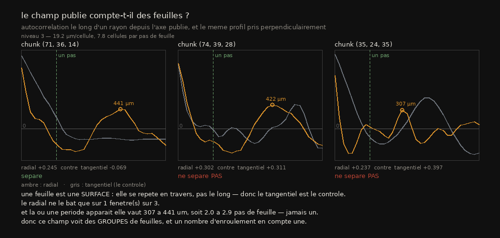

*Figure : `src/figures/figure_le_champ_de_fibres.py` (9 contrôles).*

```
uv run python src/figures/figure_le_champ_de_fibres.py --sortie docs/images/75_le_champ_de_fibres.png
```

*⚠ Le trait vert marque **un pas de feuille**. Chaque pic mesuré est loin à sa droite, et sur deux
panneaux sur trois c'est la courbe **grise** — le contrôle — qui oscille le plus fort.*

| fenêtre | rayon | période **radiale** | autocorr. radiale | autocorr. **tangentielle** |
|---|---:|---:|---:|---:|
| (71, 36, 14) | 936 cellules | **441 µm** | +0,245 | **−0,069** ✅ sépare |
| (74, 39, 28) | 949 | **422 µm** | +0,302 | **+0,311** ❌ |
| (35, 24, 35) | 500 | **307 µm** | +0,237 | **+0,397** ❌ |

⚠⚠ **Le contrôle tangentiel est ce qui rend la mesure lisible** : une feuille est une *surface*,
donc elle se répète **en travers** et pas **le long**. Une périodicité radiale n'est une feuille
que si la même mesure prise perpendiculairement est plus faible. Elle ne l'est que sur **une
fenêtre sur trois**.

⚠⚠ **Et là où une période radiale apparaît, elle vaut 307 à 441 µm** — soit **2 à 3 pas de
feuille** (~150 µm), jamais un. C'est ce qu'on attend d'un champ dont la résolution *effective*
est plus grossière que sa grille : il voit des **groupes** de feuilles, pas des feuilles.

⚠ **Deux explications alternatives écartées par la mesure, pas par l'argument.** (1) Le moyennage
en profondeur aurait pu effacer la structure si les feuilles penchent : mesuré sur **1, 8 et 64**
tranches, l'écart de période est de **0 à 2 cellules** — ce n'est pas le lissage. (2) Le détecteur
de période lui-même : ma première version prenait le **maximum global** de l'autocorrélation, qui
pour un signal lisse est toujours son plus petit décalage — les trois fenêtres rendaient
« 2 cellules » dans les deux directions, c'est-à-dire la largeur de lissage du champ et **rien du
tout** sur les feuilles. Corrigé en cherchant le premier maximum **local après le passage sous
zéro**, qui est la définition d'un retour.

### ⚠ Et la porte de sortie évidente est fermée, par deux raisons indépendantes

`PHerc0139` publie un **second** champ d'orientation, sous `representations/predictions/lasagna/`,
avec deux canaux que `fibers/` n'a pas : **`cos`** et **`grad_mag`**. Le nom `cos` suggère
exactement la composante manquante — donc il a été testé par **identité** et non par son nom : si
`(n_x, n_y, \cos)` est un vecteur unitaire, la somme de leurs carrés vaut un.

| mesuré sur `lasagna`, niveau 4 | valeur |
|---|---:|
| $n_x^2+n_y^2$ | 0,520 |
| $n_x^2+n_y^2+\cos^2$ | **0,853** médiane, p90 **1,356**, **max 1,936** |

**Un vecteur unitaire plafonnerait à l'arrondi près.** `cos` est donc autre chose, et aucun
raisonnement sur son nom ne le rattrape.

⚠ Et ce préfixe est de toute façon **plus grossier** : ses `nx`/`ny` ne descendent qu'au **niveau
4**, soit **3,9 cellules par pas** contre 7,8 pour `fibers`.

> **Conséquence pour `A2 bis`** : l'entrée que `78` §2 désignait ne peut pas, **telle qu'elle est
> publiée**, porter un nombre d'enroulement. Ce n'est pas le `nz` manquant qui bloque — il se
> récupère en module — c'est que le champ **ne distingue pas deux feuilles voisines**, et l'autre
> produit publié est encore plus grossier. Ce qui reste possible : demander le **niveau 0** à son
> producteur (il existe chez lui — `output_channels = 7` le dit), ou construire l'enroulement sur
> autre chose que ces champs.

### A2 ter — le test d'identité par les résidus (ex-H5 de `69`, révisée par `73` §1)

*Le champ déplié assigne-t-il un entier constant le long de chaque spire publiée, et des
entiers consécutifs à deux spires consécutives ?*

Trois choses que `73` a établies et qui rendent la question ouverte alors qu'on la croyait
fermée :

1. `17` a testé la marche de phase contre les **auto-intersections** de `windcheck`
   (confirmé à la source, `74` §1) — pas contre des sauts de spire. Son négatif ne porte pas
   sur cette question.
2. La grandeur de `17` est **locale**, sur un champ `lasagna` dont la période vaut 3 à 7 fois
   le pas. Un résidu est une **intégrale de boucle** feuille-à-feuille.
3. ⚠ Les `nx`/`ny` de `lasagna` sont un champ **2D** (`26` l'a payé) : le résidu se calcule sur
   les grilles `xy`/`xz`/`yz` des `normal-grids`, jamais sur `lasagna` complété d'un `z` forcé.

**Ce qui la ferait échouer, énoncé d'avance** : des résidus distribués comme le bruit de `m7`
et sans rapport avec les bords de spire. Alors l'identité doit venir d'ailleurs — la coupe à
$K$ surfaces couplées (`69` §3.3), qui s'engage sur une feuille par construction.

### ⚠⚠⚠ A2 ter est BORNÉE par le pas de la grille, et ce n'est pas le bruit de `m7`

> Mesure : `src/nappe/le_pas_de_la_grille.py` (17 contrôles, 4 sondes qui mordent), le
> 2026-09-05. ⚠ Faite **avant** d'intégrer quoi que ce soit — c'est le piège nº 27 du dépôt
> appliqué à un autre produit : *trouver la matière avant de sonder.*

`PHerc0139` est le bon endroit pour ce test et le seul : il publie **à la fois** les 37 spires
indexées qui servent de référent et des `normal-grids`. ⚠ `PHerc0172`, l'autre rouleau à
indices, **n'en publie aucune**.

Le produit déclare son pas d'échantillonnage, **deux fois et d'accord** — `grid-step: 64` dans
son `metadata.json`, et `0x40` dans l'en-tête binaire de chaque `.grid` :

| rouleau | pas de grille | en µm | **écarts inter-feuilles par cellule** | pas maximal utile | résout ? |
|---|---:|---:|---:|---:|:---:|
| `PHerc0139` | 64 vx | 599 | **3,89** | 8,23 vx | **NON** |
| `PHerc0358` | 64 vx | 599 | **3,99** | 8,01 vx | **NON** |

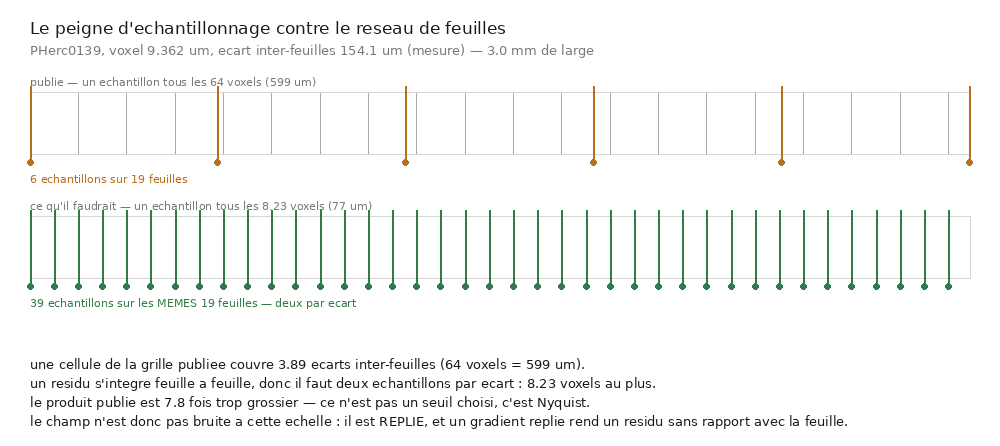

Figure : `src/figures/figure_le_pas_de_la_grille.py`, depuis
`docs/mesures/le_pas_de_la_grille.json`.

```
uv run python src/figures/figure_le_pas_de_la_grille.py
```

⭐⭐ **La bande du bas est le contrôle, et sans elle la figure ne prouverait rien** : le *même*
réseau, échantillonné à la demi-période, est traversé par **39** points là où le produit publié
en pose **6**. Ce n'est donc pas « le réseau est trop fin pour être échantillonné », c'est
« ce produit-là l'échantillonne trop grossièrement » — deux énoncés que la bande du haut seule
confond.

⭐⭐⭐ **Une cellule de la grille couvre presque QUATRE feuilles.** Or un résidu est une
intégrale de boucle **feuille à feuille** : la grandeur intégrée est $\nabla\psi$, dont la
norme vaut $2\pi/b$ avec $b$ le pas local. Un champ échantillonné à quatre feuilles par cellule
ne porte pas ce gradient — **il est replié**.

⚠⚠ Et la borne n'est pas un seuil choisi : c'est **Nyquist**, deux échantillons par période,
donc un pas de grille d'au plus une demi-période. Ici **8,23 voxels** contre les 64 publiés,
soit **7,8 fois trop grossier**. Prendre un pas plus grand ne dégrade pas la mesure, il
l'**alias** — et un gradient replié rend un résidu qui n'a aucun rapport avec la feuille.

```
uv run python src/nappe/le_pas_de_la_grille.py \
    --json docs/mesures/le_pas_de_la_grille.json
```

⭐ **C'est la même classe de borne que celle qui a fermé `A2 bis`** — *« ce qui borne vraiment
A2 bis, c'est la RÉSOLUTION, pas le `nz` manquant »* — sur un **autre produit** et pour une
autre raison : là c'était le niveau de pyramide d'un champ de fibres, ici c'est le pas
d'échantillonnage d'un champ de normales. Deux produits d'orientation publiés, deux fois trop
grossiers pour compter des feuilles.

⚠ **Ce que ça n'établit pas** : que les grilles soient inutiles, ni que le test soit
impossible. Il dit qu'**il ne se monte pas sur ce produit-là**. La sortie est déjà nommée par
[`26`](26_le_champ_de_direction.md) §7 : `vc_gen_normalgrids -i <volume.zarr> -o sortie/`
génère des grilles **depuis un volume** plutôt que depuis une prédiction — et rien n'oblige à
garder le pas de 64. ⚠⚠ C'est un gros calcul, et il faut le dire : à un pas de 8 voxels le
produit serait **512 fois plus volumineux** que les 10,4 Go inventoriés par `26`.

⚠ Et la panne annoncée d'avance — *« des résidus distribués comme le bruit de `m7` »* — n'est
**pas** ce qui bloque, ni écartée pour autant : elle reste à tester le jour où une grille assez
fine existera. Ce qui est mesuré ici la précède.

### ~~A3~~ ✅ — le masque d'approbation — **FAIT le 2026-09-04** (`77` §6)

⭐⭐⭐ `approval.tif` est **calculé**, aux cinq bras de contrôle, et les deux populations se
séparent : **quart de pas 92,7 %** approuvé (le témoin positif réaliste) contre **demi-pas
2,1 %** et **saut d'une feuille 0,0 %**.

⚠⚠ **Le champ donne DEUX prédicats et je les avais confondus** : une copie translatée d'un
demi-pas a une avance d'identité **nulle** — elle suit parfaitement une feuille qui n'existe
pas. C'est le **placement** (la partie fractionnaire de l'indice) qui la refuse.

⚠⚠ **Une spire publiée ne peut pas être son propre témoin positif de placement** : avec son
champ c'est circulaire (100 %), sans lui c'est pathologique (70 %) — la retirer la place
exactement au milieu de l'intervalle que son retrait vient de créer.

⚠⚠⚠ **Le bug que j'avais écrit** : retirer du champ la spire qui **borne** la surface jugée
détruit l'information qui détecte un interstice. Un demi-pas passait de **2,1 % à 37,6 %**.
La sonde fait tomber 4 contrôles.

⚠⚠⚠ **A3 était bloqué en AMONT de `villa`, pas en aval — et c'est réparé.** Cette entrée
disait *« le canal est écrit au bon nom et au bon format ; rien ne fait tourner `villa` »*.
Vérifié le 2026-09-04 : **rien n'écrivait le canal du tout** — aucun `imwrite` dans
`le_masque_dapprobation.py`, pas de drapeau `--ecrire` dans son parseur malgré sa propre ligne
d'usage, aucun `approval.tif` sur disque.

### ✅✅ Fait le 2026-09-05 : le masque est écrit, et `villa` l'accepte

> Mesure : `uv run python src/excision/le_masque_dapprobation.py --ecrire` (12 contrôles),
> `docs/mesures/le_masque_dapprobation_ecrit.json`.

`--ecrire` porte le verdict du champ **(z, θ)** sur la grille **tifxyz** d'une trace — ce qui
demande le centre par tranche que `_grille` calcule sur l'union des spires, un centre global
mélangeant des feuilles (`76`) — puis écrit `approval.tif` à côté de `x/y/z.tif`.

| | mesuré |
|---|---|
| trace | `PHerc0139 / w040`, grille **615 × 431**, 106 579 sommets valides |
| verdict | **749 / 1 359** cellules approuvées (55,1 %) |
| masque | 59 565 sommets à 1 — **55,9 %** des valides |
| **`villa`** | ✅ **ACCEPTE** (`load_approval_mask` + `_load_tifxyz_arrays`) |

⭐ Les deux fonctions d'acceptation sont **importées, jamais recopiées** : le contrat est celui
de `villa`, et une seconde version ici finirait par ne plus l'être. Elles n'importent que
`numpy` et `tifffile`, donc elles tournent **sans l'optimiseur**.

⚠⚠ **Et le bras négatif est là**, sans quoi le contrôle ne pourrait pas échouer : une forme
fausse et un dossier incomplet doivent être **refusés**, et ils le sont (`ValueError`).
« `villa` accepte notre masque » est satisfait par un lecteur qui accepte tout. Un second bras
exige que le masque n'approuve **ni rien ni tout** — un canal constant ne porte aucune
information.

⚠ **Reste hors de portée** : que la **ré-optimisation** en tire quelque chose. Le contrat de
fichier est honoré ; ce que `lasagna` fait ensuite du masque n'est pas exercé.

⚠ Piège traversé : l'import dynamique de `approval_inpaint.py` échoue si le module n'est pas
dans `sys.modules` **avant** son exécution — il déclare un `@dataclass`, et `dataclasses`
remonte à `sys.modules[cls.__module__]`. L'erreur est un `AttributeError` sur `NoneType` qui ne
nomme ni le module ni la cause.

⚠ Et **aucun `approval.tif` peint n'est publié** (vérifié au listing S3, `73` §0), donc la
comparaison « le calculé vaut-il l'humain » reste non montable, quoi qu'on écrive.

### A3 bis — l'ancienne formulation, gardée pour mémoire

Écrire un `approval.tif` à côté des `x/y/z.tif` (article §6.7). **Quatre bras de contrôle**,
et le quatrième est celui sans lequel le contrôle ne peut pas échouer :

| bras | attendu |
|---|---|
| masque automatique sur une spire publiée | approuve ≥ 80 % de l'aire |
| masque vide / masque plein | écart de maillage mesurable |
| **copie translatée d'un demi-pas** | **refuse ≥ 90 %** |

⚠ Sans le quatrième bras, **un masque qui approuve tout passe le contrôle**.

⚠ Le prédicat doit désigner des **régions**, pas des points : corriger 0,56 % de la surface ne
change pas α (`42`). Et il ne peut pas empiler des α : 39 verdicts sur 138 ne tiennent plus
sous la règle des deux appuis (`51` §4). Il lit **le relief dans la fenêtre étroite**.

### A4 ⭐⭐ — le rouleau de déploiement : `PHerc0139`, pas `0800` ni `1447`

⚠⚠⚠ **Correction du plan de `73` §3.3** (`74` §4). `PHerc0800` publie 6 segments, tous
`auto_grown` ; `PHerc1447`, 15 dont 14 — **aucun indice de spire**. Y déployer un prédicat
d'identité validé ailleurs est un transport non énoncé.

`PHerc0139` est le seul rouleau qui porte les deux : 37 spires consécutives, carte dense sur
91 fenêtres, queue à **4,4 %** (2ᵉ des quatorze, devant `1447`), et **déjà transformé dans le
repère du régime du prix**.

⚠ Réserve, reprise de `73` §5 : rien ne montre encore qu'un rouleau à 4,4 % se trace mieux
qu'un à 22,8 % (`55` : le mur 1 vient de la graine, pas du scan). `0139` ne se choisit pas sur
sa queue — il se choisit parce que c'est le **seul endroit où l'on peut mesurer si le prédicat
marche**.

### A5 bis ⭐⭐ — la chaîne GLISSE et ne saute pas — et son budget d'écart est gonflé

> ⚠⚠⚠ **Corrigé le 2026-09-04, deux fois de suite, par la lecture.** L'auteur a demandé si des
> docs avaient étudié `suivre_nappe`, puis m'a renvoyé à `registres/fiches_de_lecture.md`, *« le
> doc qui servait à noter les conclusions de chaque doc »*. Les deux ont **remplacé** ce que
> j'allais faire, et la seconde a annulé ce que la première venait de me faire écrire.

**Ce qui est déjà fait, et qu'il ne faut pas refaire :**

- **la boucle de correction est un cul-de-sac mesuré** (`42`) : le témoin bat toutes les
  corrections, à tous les poids, en fenêtre valide. 318 points = 0,56 % de la surface, et le
  mode `--nappe` (10,1 %) ne renverse pas le verdict ;
- **la chaîne de spires tourne** (`43`) : `gen_neighbor`, l'outil « wrap by wrap » public.
  4 spires sur 7 convergent à pas 1,0, **6 sur 7 à pas 0,5**, et le levier est la **portée du
  test de sortie** du rayon, pas le pas ;
- ⭐⭐⭐ **et l'identité a DÉJÀ été jugée** (`44`, `src/nappe/couverture_publiee.py`) : le point
  de départ étant un morceau de segment **publié**, la bonne feuille est connue sur toute son
  emprise. Verdict : **la chaîne GLISSE, elle ne SAUTE pas** — écart lisse, monotone, du même
  côté pour **73 %** des points, **69 µm à 5,76 mm**. Elle quitte la bande « même feuille »
  (40 µm) vers 3,5 mm et reste loin de « feuille voisine » (250 µm). Et la dérive est une
  **loi** qui prédit hors échantillon.

⚠⚠ **Donc l'expérience que j'allais proposer était déjà faite**, et mon prédicat d'identité y
confirmerait ce qu'on sait. Je l'avais écrite ici comme « l'expérience que personne ne pouvait
poser ». C'était faux.

⭐⭐ **Ce que cette session ajoute vraiment, et c'est plus petit et plus juste** : `77` §10
mesure que la surface publiée est elle-même à **27 µm** de la matière (20,8 à l'échelle d'une
cellule). L'écart de la chaîne est mesuré **contre cette surface**, donc **son budget est
gonflé** :

| | |
|---|---|
| écart mesuré à 5,76 mm | **69 µm** |
| en retirant le référent en quadrature | ≈ **64 µm** |
| franchissement des 40 µm « même feuille » | mesuré à **3,5 mm** — donc **plus tard** en réalité |

⚠⚠ **Correction : `44` mesure sur `PHercParis4`, pas sur `PHerc1447`** — son `um_par_voxel` de
2,4 le dit, et je m'étais trompé de rouleau ici même.

⭐⭐⭐ **Et le référent Y EST MAINTENANT MESURÉ** (`77` §10) : `dl.ash2txt.org` publie les
65 couches de son segment de référence, que j'avais déclarées absentes après n'avoir interrogé
**qu'un seul serveur** — quatrième fois pour cet angle mort, et c'est l'auteur qui l'a vue.
Lues par fenêtre (`src/volume/couches_distantes.py`, 1,35 Gio au lieu de 30,5 Go).

| rouleau | en feuilles |
|---|---:|
| `PHerc0172` | **0,121 – 0,136** |
| `PHerc1447` | **0,122 – 0,146** |
| **`PHercParis4`** *(celui de `44`)* | **0,138** |

⚠⚠ **Chiffres corrigés le 2026-09-04** (`77` §12) : les premiers étaient **gonflés de 25 à
37 %** par un centre de masse qui **enjambait deux feuilles** — les dalles couvrent 1,8 à 3,0
écarts, donc 9 sur 12 en contiennent plusieurs. Borné à ±0,5 écart, `PHercParis4` cesse d'être
aberrant (37,7 → 23,8 µm) : ce n'était pas un rouleau à part, c'était l'estimateur.

⚠⚠⚠ **Mais on ne compose PAS les micromètres.** `couverture_publiee.py` pose
`UM_PAR_VOXEL = 2.4` justifié par cohérence **interne**, jamais contre un volume déclaré — et
les deux volumes publiés de `PHercParis4` sont à **7,91 µm**. Tous les micromètres du tableau
de couverture de `44` reposent donc sur une constante que rien ne relie à un volume.

> ~~**Ce qui reste à faire, et c'est petit** : que `44` nomme son volume.~~ ✅✅ **FAIT le
> 2026-09-05**, et ma prémisse était fausse : `PHercParis4` publie **cinq** volumes, dont
> **aucun à 7,91 µm** — ce chiffre est celui de `PHerc0172`, emprunté. La boîte englobante du
> maillage étant en voxels du niveau 0, un volume trop petit pour la contenir **n'est pas** le
> sien : **un seul** des cinq la contient, et il est à **2,400 µm** — la constante posée.
> `provenance_du_voxel_reconstructible` est passé à vrai, et la correction est désormais
> **calculable en micromètres** (`69,2 → 66,4 µm`). Mesure :
> `src/nappe/le_volume_du_maillage.py` (18 contrôles, 3 sondes qui mordent).

> ~~⚠ **Le seul contrôle qui vaudrait d'être monté** : refaire `couverture_publiee.py` contre la
> surface **recalée sur la bande** plutôt que contre la surface publiée.~~ ✅✅ **RÉPONDU le
> 2026-09-05, et sans recaler quoi que ce soit** — voir ci-dessous.

### ✅✅ A5 bis — la dérive n'est PAS l'erreur du référent, et un biais est CONSTANT

> Mesure : `src/nappe/la_derive_nest_pas_le_referent.py` (16 contrôles, 4 sondes qui mordent).

Le contrôle réclamait un recalage. Il n'en a pas besoin, parce qu'une erreur de référent se
décompose en **deux parts qui ne se retirent pas de la même façon** :

| part | ce qu'elle fait à l'écart mesuré | comment elle se retire |
|---|---|---|
| **biais** — le référent est décalé d'un côté | ajoute la **même** chose à tous les maillons | elle **s'annule dans les différences** |
| **dispersion** — le référent bruite autour de la matière | ajoute une variance | **en quadrature**, ce que `77` §10 a fait |

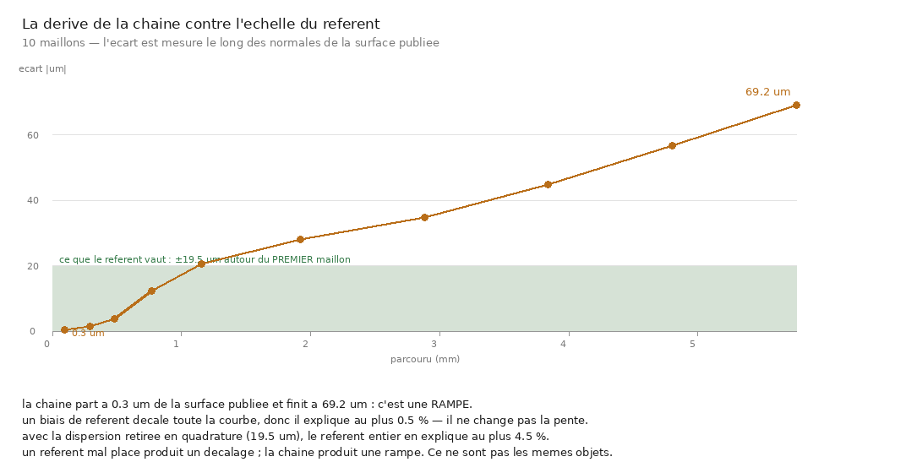

Figure : `src/figures/figure_la_derive_et_le_referent.py`, depuis
`docs/mesures/la_derive_nest_pas_le_referent.json`.

```
uv run python src/figures/figure_la_derive_et_le_referent.py
```

⚠⚠ **La bande verte est ancrée sur le PREMIER maillon, pas sur zéro**, et c'est tout l'argument :
un biais déplace la courbe entière, donc il déplace l'**origine**. La rampe en sort au quatrième
maillon (1,2 mm) et **n'y revient jamais** — ce que le contrôle asserte, avec son témoin : une
série qui sortirait puis rentrerait ne serait pas une sortie définitive, et une série plate ne
sortirait pas du tout.

⭐⭐⭐ **Donc la part de l'écart final qu'aucun biais ne peut expliquer vaut exactement**
$|e_N - e_1| / |e_N|$ — aucun ajustement, aucun seuil, aucune fenêtre choisie.

| parcouru | 96 µm | 288 | 480 | 768 | 1152 | 1920 | 2880 | 3840 | 4800 | **5760** |
|---|---:|---:|---:|---:|---:|---:|---:|---:|---:|---:|
| écart | **−0,3** | −1,5 | −3,8 | −12,2 | −20,5 | −28,1 | −34,8 | −44,9 | −56,8 | **−69,2** |

Le premier maillon est à **0,3 µm** de la surface publiée, le dernier à **69,2**. Un biais
constant explique donc **au plus 0,5 %** de l'écart final ; avec la dispersion retirée en
quadrature (19,5 µm), **le référent entier en explique au plus 4,5 %**.

```
uv run python src/nappe/la_derive_nest_pas_le_referent.py \
    --json docs/mesures/la_derive_nest_pas_le_referent.json
```

⚠⚠ **La borne n'est valide qu'à une condition, et elle est vérifiée** : tous les écarts médians
doivent porter le **même signe**, sinon un biais de signe opposé à la dérive pourrait dépasser
$|e_1|$. Les dix maillons sont négatifs, et le code **refuse** une série à signes mêlés au lieu
de rendre une borne qui ne tiendrait pas.

⚠ Et $|e_1|$ **majore** le biais : le premier maillon a déjà parcouru 96 µm, donc il contient le
biais *plus un peu de dérive*. La borne est conservatrice — elle sous-estime ce que la chaîne
fait, jamais l'inverse.

⭐⭐ **Ce que ça règle** : la correction de `77` §10 tient (69,2 → 66,4 µm) et elle est **petite**,
et la question « et si tout l'écart venait du référent ? » est fermée par la **forme** du signal.
Un référent mal placé produit un décalage ; la chaîne produit une **rampe**. Ce ne sont pas les
mêmes objets, et une rampe ne se corrige pas en déplaçant une origine.

### A5 ⭐ — extraire, pas faire pousser

L'article a fermé les deux voies ascendantes **par la mesure** : l'extension converge vers un
point fixe de 6,02 cm² (§5.6), les patchs ne pavent pas (§5.7). Ce qui reste est l'extraction
de **toutes** les spires depuis un champ global.

**Mesure de succès** : aire utile par spire, à présence + placement + identité, contre
6,02 cm². Une spire entière fait 60 à 300 cm².

⚠ Et l'érosion se **mesure**, pas se suppose : une extraction n'érode pas comme une chaîne
(15,6 % par tour, `44` §5).

### A6 — la ROC de α et de $d$

`73` §2.8 : α n'a jamais vu de courbe ROC — sa validation de §3.3 est **un** vert contre les
traces condamnées. Avec le compte corrigé, ce sont **101 positifs** (et non 57) et leurs
101 copies translatées d'un demi-pas comme négatifs. Ferme §2.2 et §2.8 d'un coup, avec les
instruments existants.

---

## A' — ⚠⚠⚠ CE QUI RESTE SOUS LES ✅

> Remarque de l'auteur, et elle vise un défaut réel de ce fichier : *« c'est typiquement le cas
> où tu vois le logo vert de A3, tu vois le A3 bis, mais tu ne lis pas entre, et tu loupes les
> tâches que tu laisses comme ça. »*
>
> ⚠ Un ✅ fait arrêter de lire. Tout « ⚠ Restant sur X » enfoui sous un titre coché est donc
> **recopié ici**, et cette section est la seule qu'il faut lire pour savoir ce qui traîne.
> **Règle** : marquer une tâche ✅ oblige à ajouter sa ligne ici, ou à écrire qu'il n'en reste
> rien.

| d'où | ce qui reste | pourquoi ça n'a pas été fait |
|---|---|---|
| **A1** | — | ✅ rien : `PHerc0172` mesuré le même jour |
| **A2** | le champ a besoin du **référent** | c'est **A2 bis** / **A2 ter**, une tâche à part |
| **A2** | la cause du trou de `PHerc0172` : déchirure, perte, collage ? | la densité dit qu'il n'y a **pas de matière**, pas pourquoi. ⚠ Demanderait un autre visuel — une coupe longitudinale, ou le volume |
| **A3** | ✅✅ **le masque est écrit et `villa` l'accepte** | fait le 2026-09-05 : `--ecrire` porte le verdict du champ sur la grille tifxyz et écrit `approval.tif` ; les deux fonctions d'acceptation de `villa` sont **importées** et acceptent, avec leurs bras négatifs (forme fausse et dossier incomplet **refusés**). ⚠ Reste hors de portée : ce que la ré-optimisation en tire |
| **A3** | ⚠⚠ **aucun `approval.tif` peint n'est publié** | donc « le calculé vaut-il l'humain » reste **non montable**. Vérifié au listing S3 (`73` §0) |
| **A3** | le masque n'a été mesuré que sur `PHerc0139` | `PHerc0172` ne sépare qu'après exclusion du trou |
| **A5** | ⭐⭐ le **plancher** : une spire publiée est à **20,8 µm** de la matière *à l'échelle où le champ travaille* (`77` §10), donc l'erreur propre du champ est entre **28 et 49 µm**, **44** si indépendantes — et l'indépendance est **vérifiée** (corrélation ≤ 0,08 entre voisines) | mesuré en coupe sur **six** spires, dont cinq consécutives ; resserrer demanderait une règle autre que la spire publiée |
| **A5** | l'extraction porte **une feuille** (47 µm), pas deux | mesuré : réinjecter une spire prédite ne change **rien** — le champ est un juge, pas un générateur |
| **A5** | ⚠ la structure angulaire de l'écart (**71 µm**, 45 % de la médiane) **n'améliore pas** l'extrapolation | mesuré : un pas par cellule mis en commun donne 52 µm à une feuille contre 47 pour le pas global. Meilleur à longue portée (1,71 contre 1,90 feuille à huit), inutile là où ça compte |
| **A5 bis** | ⚠ ~~juger la chaîne par l'identité~~ — **déjà fait** (`44`) : elle **glisse**, elle ne saute pas. Ce qui reste est de refaire la mesure contre une surface **recalée**, son budget étant gonflé (**69,2 → 64,7 µm**, conjecture) | corrigé par la lecture des fiches ; mesuré sur 2 rouleaux, **pas** sur `PHercParis4` où `44` a mesuré |
| **A6** | la ROC de α n'est pas faite | demande de **rendre** 101 surfaces à deux profondeurs — le seul poste de ce registre qui exige le volume |
| **B2** | « no threshold » pas encore rétréci dans l'abstract | ⚠⚠ **testé et NON tranchable ainsi** (`77` §11) : translater = décentrer la fenêtre dans la même pile, l'idée est bonne mais une dalle de volume de surface fait ±0,9 écart et ne permet pas d'emboîter deux fenêtres. **25 refusés sur 36**. Retenté sur une dalle de 3,0 écarts : le positif centré sur le lobe est **circulaire**, et le transport d'une fenêtre à l'autre est **confondu par le serpentage** (0,13 écart ≈ la fenêtre étroite). Il faudrait un positif **indépendant** — carte d'encre ou annotation |
| **C** | la règle graduée | ✅✅ **C2 et C3 mesurés les 2026-09-04/05.** C3 : le débinage ne rend rien (rapport 1,01), donc le courriel à l'ESRF n'est pas justifié. C2 : sur une face **vierge**, la dispersion du détecteur ne tombe que de **6 %** alors que le contraste local est **14× plus bas** — « il y a de la structure ici » ne discrimine pas ; le **niveau**, lui, se déplace (−0,27 contre −1,50). ⚠ Reste C1, plus petit qu'annoncé |
| **D1** | ✅✅ l'arc d'excision (`03`–`07`) — **FERMÉ : la conclusion de tête de `07` est CONFIRMÉE** | ce qui la démentait était une mesure sans producteur, prise sur une colonne dominée par son bruit d'échantillonnage. Sur `shortfall` (sans seuil, bruit < 5 %) : **0 paire sur 10** au-delà du bruit, signe mélangé. Ce qui est établi est une **borne**, pas une absence |
| **D2** | ✅✅ le contrôle P1 bis de `71` — **FAIT le 2026-09-05, l'hypothèse tient** | ⚠ le « blocage » était une erreur de recherche à moi : le rapport est dans l'arbre (`registres/anteriorite_resultats_de_tete.md:593`), j'avais cherché un fichier **nommé** budget au lieu du **concept**. Mesuré : densité **2 812 à 2 857 cellules/cm²** sur 24 tirages (étendue 1,6 %), donc cellules ∝ aire ; le modèle exige **×15,9**, l'observé est **×4,0** — le basculement est plus raide que la taille |
| **D3** | ✅✅ ~~41~~ → ~~32~~ → ~~30~~ → **0** script sans appelant | ⚠ **entamé** : deux figures dont l'image est **utilisée** dans un doc ne portaient pas leur commande de régénération — c'est la règle du dépôt, et c'est réparé (vérifié : les deux se régénèrent à l'identique). Le reste est classé ci-dessous |

---

## B. L'article

> `73` §2.9 : *« la thèse tient, étroitement »*, et il **vaut d'être publié** à trois
> conditions. Les voici, plus deux que l'audit a ajoutées.

### ~~B1~~ ✅ — rétrécir §6.7 : présence ≠ identité — **FAIT le 2026-09-04**

La phrase *« the predicate is the same one α estimates »* sur-affirme. α répond à la
**présence** ; le pinceau peint l'**identité**. Remplacer par : *α automates the presence half
of the approval predicate; the identity half is open, and the referent to test it against is
published.* Et **verser `17` dans cette section** comme le résultat négatif qu'il est.

⭐ **Écrit**, et avec les chiffres mesurés plutôt qu'annoncés : α automatise la **moitié
présence** ; l'identité est ouverte et son référent est publié — 101 segments approuvés portant
leur numéro de spire, deux courses sans trou (`w023`–`w059`, `w052`–`w095`), l'indice comptant
vers l'extérieur à 95,0 % et 95,1 %, et un pas d'indice valant 154,1 et 147,4 µm. Plus un
encadré qui déclare les **trois défauts du référent** : un test noté contre lui doit les
exclure, sinon un bon prédicteur se lit comme un prédicteur à 94 %.

### B2 ⚠⚠ — rétrécir *no threshold* dans l'abstract et en §3

Vrai de α, faux du **placement** : distinguer une surface sur sa feuille d'une surface dans
l'interstice se fait par $d$ contre la demi-épaisseur — un seuil en micromètres.

⚠ **À mesurer avant d'écrire** (`73` §5 le concède) : translater un segment convergent d'un
demi-pas et mesurer α. Prédiction : α ≈ 0 avec $d$ ≈ 80–90 µm. Si α ≈ 1, la revendication tient
et B2 tombe.

### ~~B3~~ ✅ — le 113 µm — **FAIT le 2026-09-03/04**

`74` §2. La conclusion de `73` est juste — ce n'est pas un écart centre à centre — mais son
mécanisme cite une phrase de `43` §6quater que `43` **corrige plus loin dans le même
document**, depuis la source. Le vrai mécanisme est pire : le rayon peut sortir puis **rentrer
dans la même feuille**, et l'écart mesuré **dépend d'un réglage** — 116 → 109 → 107 → 102 µm
quand `neighbor_step` est halvé trois fois.

Donc : ligne 201 (relabelliser **et** nommer le réglage), ligne 352 (l'exemple d'échelle),
§5.5 (*« which is one sheet »* devient une inférence, avec renvoi à `16` : 156 µm médian).

⚠ Et **ne pas s'appuyer sur la médiane de l'atlas** (172,8 µm) : c'est 10,0 voxels **entiers**
de niveau 1, quantifiés à 17,28 µm, d'IQR 121–250,6. L'appui solide est `16`.

### ~~B4~~ ✅ — nommer les quinze segments de §5.7 — **FAIT, et le résultat a grandi**

14 `auto_grown_<horodatage>` + 1 `z_dbg_gen_00320` (confirmé). *« The published segmentation of
a prize scroll »* laissait croire à un effort curaté.

⭐⭐ **Et nommer les segments a fait grandir le résultat au lieu de le rétrécir** (`76` §7) : les
spires curatées **pavent** (37/37 et 44/44 ont une voisine à une feuille) là où l'automatique
échantillonne (4/14). Le titre de §5.7 devient *« Automatic tracing samples, curated
segmentation tiles »*, et un encadré porte le piège — la médiane sur toutes les paires rend
2202 contre 1901 µm, **indiscernable**.

### ~~B5~~ ✅ — les deux comptes, 13 et 14 — **FAIT le 2026-09-03**

Les deux sont dans `derive_profondeur.json` avec des définitions différentes (`74` §1).
Dire lequel est lequel, en une incise.

---

## C. La règle graduée — trois semaines, et on s'arrête

### C1 ⭐⭐ — la case vide : **une case est REMPLIE le 2026-09-05**, sur `PHerc0139`

> Mesure : `src/encre/la_case_vide_remplie.py` (19 contrôles),
> `docs/mesures/la_case_vide_remplie.json`. Figure : `src/figures/figure_case_vide_remplie.py`
> (7 contrôles).
>
> ```
> uv run python src/encre/la_case_vide_remplie.py --segment 20260325000000-w046_20260325 \
>     --json docs/mesures/la_case_vide_remplie.json
> uv run python src/encre/la_case_vide_remplie.py --controle \
>     --segment 20260325000000-w046_20260325 --json docs/mesures/la_case_vide_remplie.json
> uv run python src/figures/figure_case_vide_remplie.py --sortie docs/images/75_la_case_vide_remplie.png
> ```

⚠ **Ce n'est PAS la case de `PHerc0500P2`** que `68` §4 désigne comme celle qui décide — celle-là
porte une vérité terrain infrarouge et reste à faire. C'est une des **38 cases vides de
`PHerc0139`**, choisie parce que `C2` venait d'y travailler et que sa carte de production existe
déjà, donc la mesure coûte une inférence au lieu d'une campagne.

### ⭐⭐⭐ Le fait qui rend la mesure simple : un volume de surface est une dalle en MICROMÈTRES

| régime | taille de voxel | couches | pile | ce que les 26 du modèle couvrent |
|---|---:|---:|---:|---:|
| production | 2,399 µm | **109** | 261 µm | **62 µm** |
| **prix** | 9,362 µm | **28** | 262 µm | **243 µm** |

Les deux volumes couvrent **la même épaisseur physique** ; le nombre de couches n'est que la
taille de voxel. Deux conséquences, et elles vont dans des sens opposés :

- au régime du prix la fenêtre du modèle **est** le volume — **aucun choix de profondeur à
  faire**, donc aucune façon de se tromper de fenêtre ;
- et c'est le régime **grossier** qui lit les **243 µm** proches des 206 µm de l'entraînement,
  pendant que le régime **fin** n'en lit que 62. Le scan de repérage est, sur ce point précis,
  **celui qui ressemble à l'entraînement**.

⚠ C'est aussi pourquoi le nul apparié de `C2` est **structurellement impossible** au régime du
prix : 28 couches pour une fenêtre de 26 laissent deux couches de marge. `le_nul_verso.py` y
refuse plutôt que d'inventer une fenêtre.

### La confrontation, et c'est elle qui porte le résultat

« Ce que le détecteur rend à 9,362 µm » est un nombre sans référence. Le même segment publie une
carte d'encre **à 2,399 µm**, produite par la communauté avec son propre modèle
(`new_canon_autoresearch_recipe`) : la meilleure réponse disponible à *« y a-t-il de l'encre
ici ? »*, et elle est **indépendante de nous**.

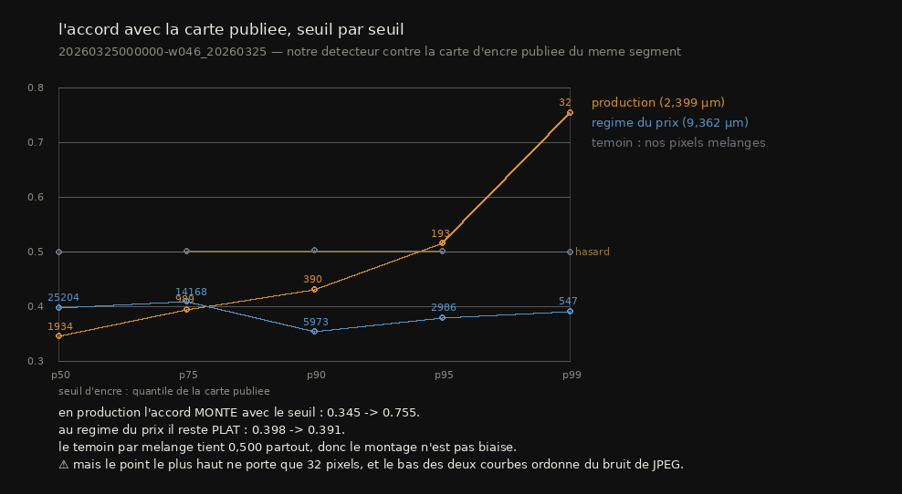

| seuil (quantile de la carte publiée) | p50 | p75 | p90 | p95 | **p99** |
|---|---:|---:|---:|---:|---:|
| **production** (2,399 µm) | 0,345 | 0,395 | 0,432 | 0,516 | **0,755** |
| **régime du prix** (9,362 µm) | 0,398 | 0,409 | 0,354 | 0,380 | **0,391** |
| témoin, nos pixels mélangés | 0,499 | 0,502 | 0,503 | 0,500 | 0,499 |

⭐⭐ **Le résultat est une FORME, pas un nombre** : en production l'accord **monte** avec le seuil
d'encre — notre carte retrouve l'encre **forte** de la carte publiée — pendant qu'au régime du
prix il reste **plat**. C'est la différence entre les deux régimes, et c'est ce que `68` §4
demandait de mesurer.

⭐ **Le témoin par mélange tient 0,500 aux cinq seuils.** C'est lui qui autorise à lire une AUC
sous 0,5 comme un fait sur les cartes et non comme un biais du montage — sans lui, tout le
tableau pourrait n'être qu'un défaut de comparaison.

### ⚠⚠ Trois réserves, et la première suffit à interdire une conclusion forte

1. **Le point le plus haut ne porte que 32 pixels.** L'AUC de 0,755 est prise sur le centile
   supérieur d'une région de 249 × 249 pixels réduits. C'est une **tendance**, pas une mesure.
2. **Le bas des deux courbes ordonne du bruit de JPEG.** Les trois quarts de la région publiée
   tiennent entre **30 et 39 sur 255** : au seuil médian on compare deux moitiés de fond
   compressé. ⚠ C'est une correction de ma propre première version, qui prenait la médiane comme
   frontière encre/fond et mesurait donc l'ordre relatif du bruit.
3. **Ce n'est pas une vérité terrain.** Deux modèles peuvent se tromper ensemble, et un désaccord
   ne dit pas lequel a tort. La vérité terrain infrarouge existe sur `PHerc0500P2`, pas ici.

⚠ **Et l'alignement a été vérifié avant de conclure quoi que ce soit.** Une AUC *fiablement* sous
0,5 n'est pas un désaccord au hasard — c'est du signal partagé, retourné. Les **huit
transformations du carré** ont donc été testées : identité **0,398**, miroir de colonnes 0,619,
rot270 0,543, les autres autour de 0,5. Aucune ne rend un accord franc, donc l'orientation est
innocentée. Et les deux grilles sont dans le rapport de leurs tailles de voxel (3,893 contre
3,903 attendu, 0,3 % d'écart), ce que la mesure asserte plutôt que de le supposer.

### ⚠⚠⚠ La case qui décide demande UNE CHOSE DE PLUS, que ni `68` ni `72` ne nomment

> Mesure : `src/encre/deux_aplatissements.py` (10 contrôles),
> `docs/mesures/deux_aplatissements.json`.
>
> ```
> uv run python src/encre/deux_aplatissements.py --json docs/mesures/deux_aplatissements.json
> ```

`68` §4 et `72` §3 disent que remplir la case de `PHerc0500P2` ne demande *« ni faisceau, ni
annotation manuelle, ni rescan »*. **C'est vrai, et incomplet** : la **scorer** contre la vérité
terrain infrarouge demande un **recalage entre deux aplatissements**.

⭐⭐ **Vérifié sur les DEUX serveurs**, parce que n'interroger qu'une vue du corpus est l'angle
mort que `78` §0 recense trois fois — et la première réponse était fausse. L'index ouvert ne
publie **aucune** étiquette d'encre (0 sur les 14 types de données du corpus) ; `dl.ash2txt.org`,
lui, en publie :

| | serveur | forme |
|---|---|---|
| `500P2_inklabels.png`, `_ir.png`, `_mask.png` | `dl.ash2txt.org/fragments/PHerc0500P2/paths/2um_front_surface/` | **27 160 × 14 990** |
| couches du chemin des étiquettes | même chemin | 65 couches, **2 µm seulement** |
| couches du **régime du prix** | bucket ouvert, `segments/…-500P2_front/` | 28 couches, 9,362 µm, **6 280 × 3 580** |
| couches de production | même segment | 118 couches, 2,215 µm, **26 440 × 15 060** |

⚠⚠ **26 440 × 15 060 contre 27 160 × 14 990** : même fragment, **paramétrisations différentes**.
Un aplatissement n'est pas unique, donc les étiquettes ne se transportent pas pixel pour pixel.
Et le chemin des étiquettes ne publie **aucun volume à 9,362 µm** — les deux moitiés de
l'expérience sont sur deux surfaces.

⚠⚠⚠ **Et le recalage ne peut pas être exact, faute de coordonnées.** Le segment publie son
`tifxyz-transformed` — une position 3D par cellule — donc apparier deux surfaces par leur
**géométrie** serait un plus proche voisin, exact et bon marché. Le chemin des étiquettes ne
publie **que des images** : ni `tifxyz`, ni `obj`. L'appariement doit se faire **par l'image**.

### ⭐⭐ Mais c'est traitable, et c'est mesuré

| | valeur |
|---|---:|
| recouvrement des deux empreintes (Dice, grille 256) | **0,971** sans décalage, **0,972** au mieux |
| écart des rapports d'aspect | **3,2 %** |

**Les deux aplatissements sont presque la même carte.** Un recalage fin est donc un **lot
défini**, pas un problème de recherche — au-dessous de 0,80 il aurait fallu un champ de
déformation.

⚠ Deux réserves. À 256 cellules une case vaut ~100 µm : ce qui est établi est l'accord des
**silhouettes**, et une lettre fait ~600 µm — la registration au niveau de la lettre reste à
faire. Et les 3,2 % d'écart d'aspect ne sont pas rien : sur 27 160 lignes, c'est ~870 lignes de
dérive cumulée, soit **~1,9 mm**, donc trois lettres d'un bout à l'autre. Il faudra une **affine**
(échelle anisotrope), pas une similitude.

⚠ L'empreinte du segment est tirée de la **région non nulle de sa carte d'encre réduite**, faute
de masque publié — donc ce n'est pas un masque de surface mais « là où le détecteur a rendu
quelque chose ». Le recouvrement mesuré est un **minorant**.

### ⭐⭐ L'affine est construite et VALIDÉE par une référence externe

> Mesure : `src/encre/le_recalage_des_etiquettes.py` (13 contrôles),
> `docs/mesures/le_recalage_des_etiquettes.json`.
>
> ```
> uv run python src/encre/le_recalage_des_etiquettes.py --json docs/mesures/le_recalage_des_etiquettes.json
> uv run python src/encre/le_recalage_des_etiquettes.py --prix --regime prix       --json docs/mesures/le_regime_du_prix_score.json
> uv run python src/encre/le_recalage_des_etiquettes.py --prix --regime production --json docs/mesures/le_regime_production_score.json
> uv run python src/encre/le_recalage_des_etiquettes.py --residu --json docs/mesures/le_regime_du_prix_score.json
> ```

Affine **diagonale** estimée par les deux boîtes occupées — une échelle par axe et une
translation, ce qu'un écart de rapport d'aspect décrit exactement. Extrémités aux **percentiles
1 et 99** : un seul pixel isolé fixerait la boîte et décalerait toute la carte.

⭐⭐⭐ **Et le recalage n'est pas jugé par lui-même.** La carte d'encre **publiée par la
communauté** — celle dont le papier de référence montre qu'elle marche — est scorée contre les
étiquettes recalées : **AUC 0,756**, témoin par mélange **0,500**, sur **256 266 pixels d'encre
contre 3,66 millions**. Le Dice passe de 0,973 à **0,975** à 1024 de côté.

### ⚠⚠⚠ MAIS L'AFFINE GLOBALE NE SUFFIT PAS LOCALEMENT, et c'est mesuré

Sur la fenêtre la plus encrée du fragment, la **même carte publiée** tombe à **0,418** —
*sous le hasard*. Une AUC sous le hasard n'est pas un manque de signal : c'est du signal
**anti-aligné**, et un texte est fait de traits quasi périodiques, donc un décalage d'une
demi-largeur de trait suffit à mettre l'encre prédite dans les blancs.

| décalage local appliqué aux étiquettes | AUC de la carte **publiée** |
|---|---:|
| aucun | **0,418** |
| (−104, −120) cellules, soit **2,1 mm** | **0,711** |

⚠ **Et le maximum est encore au bord du balayage**, donc **2,1 mm est un minorant**. Trois
lettres et demie de résidu local. ⚠⚠⚠ **Et un maximum au bord ne désigne rien** : le balayage
refait à ±48 cases sur 127 fenêtres place l'optimum à **(−24, 0)**, *à l'intérieur* — voir plus
bas, « le résidu est une translation ».

> **Conséquence, et elle annule les chiffres suivants plutôt que de les nuancer** : aucun nombre
> mesuré **par fenêtre** à travers ce recalage n'est interprétable tant qu'il n'est pas local.
> Les trois AUC obtenues sont enregistrées **comme non interprétables**, avec leur raison :
>
> | | fenêtre | AUC | pourquoi elle ne dit rien |
> |---|---|---:|---|
> | notre détecteur, régime du **prix** | top 5474, left 637 (27,8 % d'encre) | **0,254** | référence appariée **0,418** sur la même fenêtre — les deux échouent, et le résidu vaut 2,1 mm |
> | notre détecteur, **production** | top 24320, left 4607 (**91,1 %** d'encre) | 0,529 | **344 pixels de fond** seulement : la fenêtre n'a presque pas de négatifs |
> | carte publiée, toute l'empreinte | — | 0,756 | moyenne sur des régions aux décalages locaux **différents**, donc un minorant dilué |

⚠⚠ **Une erreur de comparaison payée en chemin, et c'est celle qui a mis le résidu en évidence.**
J'ai d'abord comparé notre 0,254 (une fenêtre) au 0,756 de la carte publiée (**toute
l'empreinte**). Sur la même fenêtre, la publiée fait **0,418** : l'écart que j'allais publier
était celui de deux **régions**, pas de deux **régimes**. Toute AUC est désormais rendue
**appariée** — notre carte et la carte publiée, sur les mêmes pixels, contre les mêmes
étiquettes.

⚠ Et une seconde, dans le balayage lui-même : ma première recherche portait sur **±12 cellules**
(±212 µm, un tiers de lettre) et son maximum tombait **au bord** — ce qui ne dit rien d'autre que
« la recherche était trop courte ». La portée vient maintenant d'une mesure : les 3,2 % d'écart
d'aspect impliquent jusqu'à **~90 cellules** de dérive. `maximum_au_bord` est **asserté**, pas
noté.

### ⭐⭐⭐ Le résidu est GÉOMÉTRIQUE, et c'est une validation croisée qui le dit

> ```
> uv run python src/encre/le_recalage_des_etiquettes.py --champ --json docs/mesures/le_regime_du_prix_score.json
> uv run python src/figures/figure_champ_de_recalage.py --sortie docs/images/75_champ_de_recalage.png
> ```

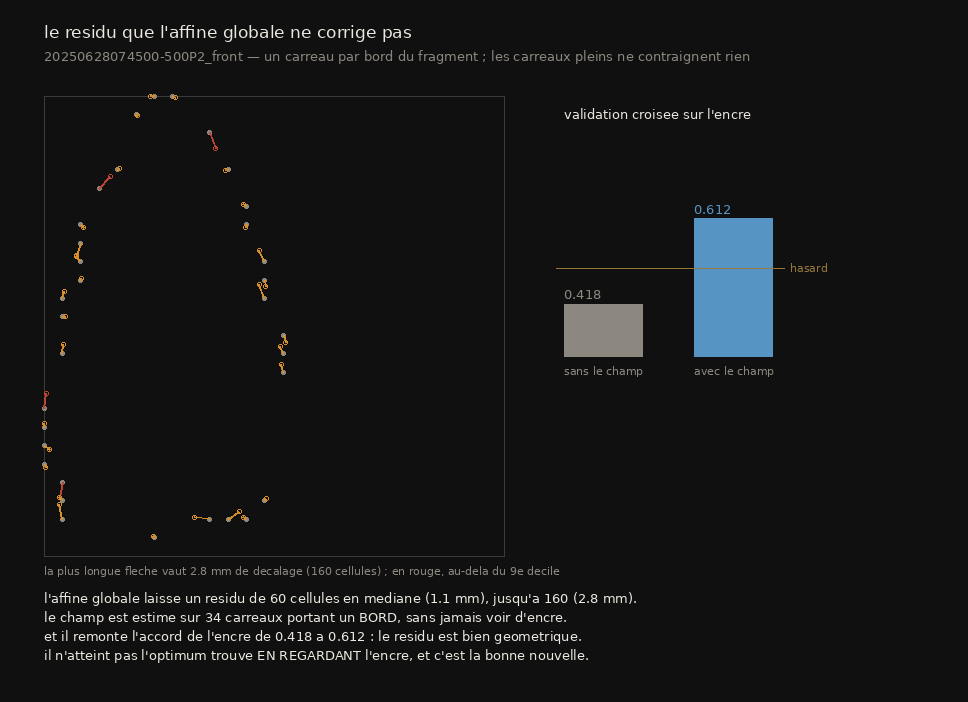

⚠⚠⚠ **Le champ est ajusté sur les SILHOUETTES, jamais sur l'encre — et c'est le piège central de
tout ce lot.** Maximiser l'accord entre la carte d'encre publiée et les étiquettes ferait deux
choses à la fois : rendre cet accord élevé **par construction**, et tailler la géométrie sur les
erreurs d'un détecteur qui n'est pas le nôtre. Scorer ensuite notre carte à travers ce champ, ce
serait la juger contre une géométrie faite pour quelqu'un d'autre.

| | valeur |
|---|---:|
| carreaux portant un **bord** (les seuls où le décalage est contraint) | **34** |
| Dice médian après décalage local | **0,951** |
| norme du décalage : médiane / p90 / max | **60 / 152 / 160** cellules — **1,1 / 2,7 / 2,8 mm** |
| accord de l'**encre** sur la fenêtre, **sans** le champ | **0,418** |
| ... **avec** le champ tiré des silhouettes | **0,612** |

> **Un champ qui n'a jamais vu une étiquette ni une carte d'encre remonte l'accord de l'encre de
> +0,194.** Le résidu est donc bien géométrique — ce n'est pas le détecteur qui échoue, c'est la
> géométrie qui est fausse d'un millimètre.

⭐ **Et il n'atteint pas l'optimum trouvé en regardant l'encre (0,711), ce qui est la bonne
nouvelle** : un champ indépendant qui l'égalerait serait suspect. L'écart dit ce qu'un champ plus
dense reste à gagner — le carreau le plus proche de la fenêtre est à **277 cellules**.

⚠⚠⚠ **Ce +0,194 est vrai sur CETTE fenêtre et ne se généralise pas.** Sur les 42 fenêtres où ce
même champ répond, il gagne **+0,035** en médiane et n'améliore que **25 sur 42** — quand sa
propre **constante** gagne +0,067 et en améliore **36**. Le champ de bord ne bat donc pas la
médiane de ses propres carreaux ; voir la section « le résidu est une translation ».

⚠ Un carreau **plein** ne contraint rien : il se ressemble à lui-même partout, donc son décalage
optimal est arbitraire. Seuls les carreaux à occupation intermédiaire sont retenus, et leur
nombre est rendu — un champ estimé sur trois carreaux n'est pas un champ.

### ⚠⚠⚠ Mais un champ LISSE ne se laisse pas ajuster — le problème d'ouverture, mesuré

J'ai essayé de densifier le champ par un modèle polynomial, puisque les 34 carreaux sont sur les
bords et que la fenêtre mesurée est à 277 cellules du plus proche. **Ça ne marche pas, et la
raison est mesurée.**

| | erreur en laissant-un-dehors | le champ **nul** en fait |
|---|---:|---:|
| polynôme degré 2, deux équations par carreau (90 carreaux, pas 64) | **66** cellules | 65 |
| polynôme degré 2, **flot normal** (34 carreaux, pas 128) | **21** cellules | **17** |

⭐⭐ **La cause est le problème d'ouverture, et il est chiffré** : le plateau des décalages
atteignant 95 % du meilleur recouvrement est **allongé 9 fois sur 1 en médiane** (p90 **15,3**),
sur **33 carreaux sur 34**. Un bord droit ne contraint que la composante **perpendiculaire** ;
glisser le long du bord ne change rien au recouvrement.

⚠ Passer au **flot normal** — une seule équation par carreau, celle qu'il mesure vraiment — fait
tomber l'erreur de 66 à 21 cellules. C'est trois fois mieux, et **toujours pas mieux que zéro**.

> **Donc la déformation entre les deux aplatissements n'est pas une carte lisse de bas degré.**
> Il faut un champ **dense** — flot optique sur les masques, ou des repères intérieurs — et non
> un modèle paramétrique.

### ⚠⚠⚠ Et l'agrégation LOCALE non plus — avec un mirage en chemin

> Mesure : `src/encre/le_recalage_local.py` (19 contrôles, 4 sondes qui mordent), le
> 2026-09-05, sur les **mêmes 34 carreaux** — rien n'est recalculé.

Le remède classique de l'ouverture n'est pas un modèle global mais l'**agrégation locale** :
deux carreaux voisins dont les bords ne sont pas parallèles donnent deux équations
indépendantes et déterminent ensemble les deux composantes. C'est Lucas–Kanade, et c'est
exactement ce qu'un polynôme de bas degré **ne fait pas**.

| rayon | voisins (méd.) | conditionnement | erreur **norme entière** | champ nul | erreur **composante normale** | champ nul |
|---:|---:|---:|---:|---:|---:|---:|
| 256 | 2 | 0,26 | 125,6 | 66,8 | 30,4 | 14,6 |
| 384 | 3 | 0,26 | 75,0 | 62,1 | 24,7 | 17,7 |
| 512 | 4 | 0,34 | 71,2 | 60,5 | 27,8 | 16,1 |
| 768 | 7 | 0,43 | 65,2 | 60,4 | 20,8 | 17,2 |
| **1024** | 9 | 0,44 | **53,4** | 60,4 | 21,6 | 17,2 |
| **1536** | 16 | 0,60 | **47,8** | 60,4 | 18,4 | 17,2 |

⭐ **Sur la norme entière, l'agrégation locale bat le champ nul** aux deux plus grands rayons —
47,8 contre 60,4, soit 21 % de mieux. J'avais écrit l'assertion dans l'autre sens, en supposant
qu'elle échouerait comme le polynôme ; **c'est la mesure qui a corrigé**.

⚠⚠⚠ **Et c'est un mirage.** Sur la composante **normale** — la seule que chaque carreau
mesure réellement — **aucun rayon ne bat le champ nul**, à aucune taille de voisinage, de 2 à
25 carreaux. Le gain de la norme entière vient donc **entièrement de la direction non
contrainte**, c'est-à-dire d'une grandeur que personne n'a mesurée.

> ⭐⭐ C'est le péché cardinal du dépôt sous un costume de plus : non pas une vérification
> incapable d'échouer, mais **une amélioration sur la composante que la mesure ne contient
> pas**. Le contrôle qui l'attrape est écrit : les deux métriques doivent se **contredire**
> quelque part, et la composante normale doit être **strictement** plus petite que la norme —
> sans quoi la remplacer par la norme entière ne ferait rien échouer.

⚠ Le voisinage reste **local** — au plus 25 carreaux sur 34, jamais tout le fragment — donc ce
n'est pas un modèle global d'ordre zéro déguisé. Et la cause est la même, chiffrée autrement :
le conditionnement des directions plafonne à **0,60** là où l'isotropie vaudrait 1. Même en
réunissant seize carreaux, **les bords du fragment ne couvrent pas le plan**.

```
uv run python src/encre/le_recalage_local.py \
    --json docs/mesures/le_recalage_local.json
```

⭐⭐⭐ **Ce que ça règle** : la conclusion de C1 §1 ne dit plus « il faut un champ dense » comme
une préférence, elle le dit comme un fait mesuré **deux fois**. Ni un modèle lisse global, ni
une agrégation locale ne recalent ces masques — parce que le problème n'est pas la **forme** du
modèle mais la **matière** qu'on lui donne : des bords, et rien à l'intérieur. Il faut du
contenu intérieur, et c'est la seule voie qui reste.

### ⭐⭐ Le contenu intérieur EXISTE — 348 trous, et la moitié qui manque est de l'autre côté

> Mesure : `src/encre/les_reperes_interieurs.py` (15 contrôles, 3 sondes qui mordent), le
> 2026-09-05. ⚠ Posée **avant** d'écrire un recaleur : c'est une question sur l'**entrée**.

Les deux échecs ci-dessus désignent la même sortie — *« il faut du contenu intérieur »* — sans
dire s'il en existe. Un **trou** du masque en est un, et il a la propriété qui compte : il est
**géométrique**, donc s'en servir pour recaler ne rend pas circulaire la mesure d'encre qui
suit, contrairement à l'optimum de (−104, −120) cellules obtenu **en regardant l'encre**.

| | |
|---|---:|
| trous intérieurs d'au moins 64 pixels | **348** |
| dont le bord couvre assez le plan (conditionnement ≥ 0,25) | **314** |
| le plus grand | 16 907 px, 137 × 234, conditionnement **0,51** |

⭐ **314 repères intérieurs contre 34 carreaux de bord** — et ils sont *intérieurs*, donc
répartis sur le fragment au lieu d'être confinés à sa frontière. Chacun est individuellement
mieux conditionné que le voisinage de bord le plus large (0,60 au meilleur rayon).

```
uv run python src/encre/les_reperes_interieurs.py \
    --json docs/mesures/les_reperes_interieurs.json
```

⚠⚠ **Un trou rond contraint les deux composantes, une fente une seule** — c'est le problème
d'ouverture un cran plus bas, et c'est pourquoi le conditionnement est mesuré par trou plutôt
que supposé. Le seuil de 0,25 n'est pas choisi ici : c'est **celui que les carreaux de bord
atteignent déjà**, donc un repère qui ne ferait pas mieux qu'un bord droit n'apporterait rien.

⚠ Et un « trou » est une composante du complément qui **ne touche pas le bord de l'image** :
ce qui le touche est l'extérieur du fragment. Les confondre compterait le fond entier comme un
repère parfaitement isotrope — un faux positif parfait, et la sonde qui retire ce test fait
tomber **six** contrôles.

### ⚠⚠⚠ Mais la moitié qui manque est de l'AUTRE côté, et elle n'est pas publiée

Un repère ne sert que s'il existe **dans les deux** aplatissements. Or `deux_aplatissements`
l'écrit déjà : *« le corpus ouvert ne publie pas de masque pour ce segment »*. L'empreinte
disponible au régime du prix est le **support de la carte d'encre**, c'est-à-dire là où le
détecteur a rendu quelque chose — une propriété du **détecteur**, pas du fragment.

Et elle n'existe qu'à **1024 de large**. À cette résolution, des 314 repères il en reste **19** :

| | repères utilisables |
|---|---:|
| à pleine résolution (27 160 × 14 990) | **314** |
| à 1024 de large, là où l'autre aplatissement existe | **19** |

⚠ La réduction est faite **par majorité de bloc** et non par échantillonnage — sinon le compte
de repères dépendrait de l'endroit où la grille tombe. La sonde qui la remplace par un
échantillonnage au pas fait tomber le contrôle de stabilité : sur une fente de trois pixels
alignée sur le pas, elle rend **1 trou contre 0** selon un décalage de cinq pixels.

> ⭐⭐⭐ **Ce que ça change pour C1** : la voie n'est pas fermée, et son **prix est nommé**. Il
> faut soit un **masque de surface publié** pour l'aplatissement du régime du prix — ce qui est
> une demande, pas un calcul — soit les étiquettes rendues **à ce régime-là**, ce qui est la
> case vide de `68` §4 par un autre chemin.

### ⛔ Et ils N'ONT PAS de vis-à-vis, contrairement à ce que cette section conclut

> Mesure : `src/encre/les_reperes_apparies.py` (10 contrôles), figure
> `src/figures/figure_les_reperes_apparies.py` (7 contrôles), le 2026-09-05.

⚠⚠⚠ **CETTE SECTION EST CORRIGÉE PAR UNE MESURE DU MÊME JOUR, plus bas.** Elle conclut que « le
support de la carte publiée porte les trous du fragment, donc il est un masque de fait ». À
pleine résolution il en porte **36** quand le masque en a **348**, et le témoin est net : réduire
le support natif ×8 par la même règle rend **19** composantes de fond et non **420**. Les 71
« trous » comptés ici sont donc en grande part du **crénelage de compression** — la carte réduite
est un `.jpg`, et un `.jpg` crénelle les bords à fort contraste, c'est-à-dire le pourtour des
vrais trous. Ce qui survit : les repères se posent bel et bien **7,7 fois plus près** des vides
qui existent que le hasard. ⛔⛔ **Et même ce « 7,7 fois » tombe** : contre un témoin qui garde
la FORME du nuage au lieu de la casser avec sa place, la vraie position est la **6ᵉ sur 21**
(p = 0,29). Le rapport mesurait le **groupement** des repères, pas une correspondance. Voir
« le goulot n'était pas le fragment » puis « le témoin JUSTE enterre l'appariement ».

⚠⚠ **Le paragraphe ci-dessus supposait qu'il n'y avait rien en face. C'est faux, et la mesure
le dit.** Là où il n'y a **pas de matière**, un détecteur ne peut rien rendre — donc si le
support de la carte publiée porte les mêmes trous que le masque, il est un **masque de fait**,
et les repères ont un vis-à-vis sans qu'on ait rien à demander à personne.

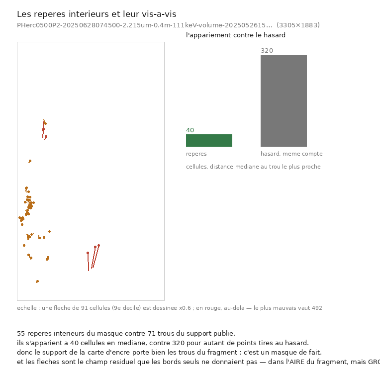

Figure : `src/figures/figure_les_reperes_apparies.py`, depuis
`docs/mesures/les_reperes_apparies.json`.

| | |
|---|---:|
| repères du masque, utilisables | 314 |
| dont transportables à l'échelle de la carte (3305 × 1883) | **55** |
| trous intérieurs du **support publié** | **71** |
| distance d'appariement, médiane | **40,3** cellules |
| ... au 1er décile | 16,1 |
| **témoin — autant de points tirés au hasard dans la même empreinte** | **319,6** |

⭐⭐⭐ **Huit fois mieux que le hasard.** Le témoin est obligatoire et il est de **même compte** :
sur une empreinte trouée, n'importe quel semis tombe parfois près d'un trou, donc 40 cellules
ne veulent rien dire sans les 320 qu'un semis aléatoire obtient sur la **même** empreinte.

```
uv run python src/encre/les_reperes_apparies.py \
    --json docs/mesures/les_reperes_apparies.json
uv run python src/figures/figure_les_reperes_apparies.py
```

⚠⚠ **Et la figure a attrapé une sur-affirmation de la prose que j'avais écrite** : j'y disais
les repères « répartis à l'intérieur », et le dessin montre qu'ils sont **groupés d'un côté** —
**12 sur 55** dans la boîte centrale. Ils sont dans l'**aire** du fragment et non sur son
contour, ce qui est déjà ce que les 34 carreaux de bord n'étaient pas ; ils ne sont pas
**étalés** pour autant, et la prose le dit maintenant.

⚠ Le contrôle négatif du module est un **décalage d'une demi-maille** et non « des trous
ailleurs » : ma première version mettait les repères dans les coins et ils **battaient quand
même** le témoin, parce que sur une empreinte dont les cibles sont sur une grille, un coin reste
systématiquement plus proche qu'un point tiré n'importe où. Le négatif juste est la panne
qu'on veut exclure — un recalage faux d'un demi-pas.

⚠ L'échelle des flèches est prise au **neuvième décile** (91 cellules) et non au maximum : un
appariement raté à **492** cellules — un repère accroché à un trou lointain — écrasait toutes
les autres flèches à l'invisible. **Le maximum n'est pas le champ, c'est son échec.**

> ⭐⭐ **Ce que C1 gagne** : 55 repères appariés, dans l'aire du fragment, avec un écart mesuré
> de 40 cellules en médiane. C'est la matière que ni le modèle lisse ni l'agrégation locale
> n'avaient — et elle vient d'une géométrie, pas de l'encre, donc la mesure d'encre qui suivra
> ne sera pas circulaire.

### ⚠⚠ Et ça corrige un de mes propres chiffres

J'ai écrit plus haut que le résidu vaut « **1,1 mm en médiane** ». C'est la norme du décalage
**entier** par carreau — or une bonne moitié de ce décalage est dans la direction **non
contrainte**. La composante réellement **mesurée** vaut **17 cellules, soit ~0,3 mm** en médiane.

⚠⚠⚠ **ET LE PARAGRAPHE QUI SUIVAIT EST ANNULÉ PAR LA SECTION SUIVANTE, PAS NUANCÉ.** J'écrivais :
*« près de la fenêtre mesurée, le résidu est grand — un décalage de (−104, −120) cellules y
remonte la carte publiée de 0,418 à 0,711 […] le résidu est donc très variable dans l'espace :
petit en médiane, de l'ordre de deux millimètres là où il compte. »* Les deux affirmations
tombent : **(−104, −120) était un maximum au BORD de son balayage**, donc une borne et non un
déplacement ; et sur **127 fenêtres** de l'empreinte les optima se serrent autour de
**(−24, 0)**, à 27 cases près. Ce qui reste vrai est que la fenêtre du régime du prix est
**atypique** — pas que le résidu varie.

### ⚠⚠⚠ Posée sur TOUTE l'empreinte, la question se renverse : le résidu est une TRANSLATION

> Mesure : `src/encre/le_residu_est_une_translation.py` (39 contrôles) →
> `docs/mesures/le_residu_est_une_translation.json`. Figure :
> `src/figures/figure_le_residu_est_une_translation.py` (16 contrôles), le 2026-09-05.
>
> ```
> uv run python src/encre/le_residu_est_une_translation.py --json docs/mesures/le_residu_est_une_translation.json
> uv run python src/figures/figure_le_residu_est_une_translation.py --sortie docs/images/75_le_residu_est_une_translation.png
> ```

⚠⚠⚠ **Tout ce qui précède a été jugé sur UNE fenêtre** — celle du régime du prix, retenue parce
qu'elle est la plus encrée. Une fenêtre n'est pas une mesure, et la même validation refaite sur
**127 fenêtres** de l'empreinte ne dit pas la même chose.

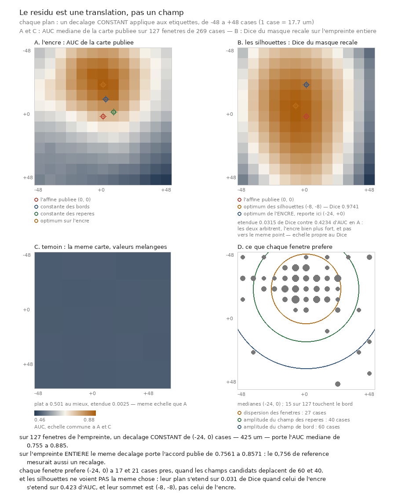

#### 1. Ce que chaque fenêtre demande, quand on la laisse choisir

| | valeur |
|---|---:|
| décalage préféré, **médiane** sur 127 fenêtres | **(−24, 0)** cases, soit **425 µm** |
| **dispersion** de ces préférences | (16,8 ; 20,6) cases, soit **471 µm** |
| optima touchant le bord du balayage | 15 sur 127 |
| amplitude du **champ de bord** (norme médiane) | **60,4** cases |
| amplitude du **champ des repères** | **40,3** cases |

⭐⭐⭐ **Les fenêtres s'accordent ; les champs bougent plus qu'elles ne le demandent.** Les deux
champs candidats déplacent de **40** et **60** cases là où les fenêtres ne divergent que de
**27** — un champ dont l'amplitude dépasse le désaccord qu'il corrige n'en corrige pas un, il en
**invente** un.

#### 2. Une CONSTANTE bat les deux champs, et de loin

AUC médiane de la carte publiée, sur les **127** fenêtres de l'empreinte :

| décalage constant | AUC médiane | fenêtres améliorées |
|---|---:|---:|
| aucun — l'affine publiée | 0,7547 | — |
| **médiane du champ de bord**, (−13, +2) | **0,8523** | **116 sur 127** |
| médiane du champ des repères, (−3,2 ; +8,2) | 0,7776 | 81 sur 127 |
| **optimum balayé sur l'encre**, (−24, 0) | **0,885** | — |

⚠ Ce maximum-là est **intérieur** au balayage (±48 cases), contrairement au (−104, −120) publié
plus haut qui touchait sa borne. `maximum_au_bord` est **asserté**, pas noté.

Et le champ contre **sa propre constante**, sur les 42 fenêtres où le champ de bord répond :

| | AUC médiane | gain | améliorées |
|---|---:|---:|---:|
| champ de bord | 0,6534 | +0,0354 | 25 sur 42 |
| **sa constante** (−13, +2) | **0,7382** | **+0,0669** | **36 sur 42** |

#### 3. Et ça déplace le 0,756 de référence

L'accord de la carte publiée avec les étiquettes, sur **toute** l'empreinte et non par fenêtre :

| | AUC |
|---|---:|
| l'affine publiée | **0,7561** |
| avec la constante des bords (−13, +2) | 0,8254 |
| avec l'optimum des fenêtres (−24, 0) | **0,8571** |

⚠⚠ **Le 0,756 qui sert de référence à tout ce lot mesurait donc aussi un défaut de recalage.**
Translater les étiquettes de 425 µm — un demi-caractère — le porte à **0,857**.

#### 4. Les deux témoins obligatoires

| témoin | ce qu'il donne | ce qu'il exclut |
|---|---|---|
| la **carte d'encre mélangée**, même plan | plat : 0,4989 à 0,5014, étendue **0,0025** | que le relief du plan A soit celui de l'**empreinte** et non de l'encre |
| les **positions des repères mélangées** | 42,8 au mieux de 20 tirages | que le champ des repères soit une **constante déguisée** |

#### 5. Ce que les repères gagnent, et ce que les bords perdent

Laisser-un-dehors à 300 cases, chacun contre **son** champ nul et **ses** positions mélangées :

| | erreur médiane | champ nul | meilleur mélange | verdict |
|---|---:|---:|---:|---|
| **champ des repères** (55) | **31,8** | 40,2 | 42,8 | ✅ bat les deux |
| champ de bord (34 carreaux) | 77,5 | 60,5 | 58,8 | ❌ échoue aux deux |

⭐⭐ **Les repères sont bel et bien prédictifs dans l'espace, les carreaux non** — ce que
`le_recalage_local` avait établi sur la composante normale, retrouvé ici par un autre chemin.

⚠⚠ **Et pourtant c'est la constante des BORDS qui gagne sur l'encre, pas celle des repères** :
(−13, +2) est à **11** cases de l'optimum quand (−3,2 ; +8,2) est à **22**. La raison est
géométrique — les repères sont **groupés d'un côté**, donc leur médiane est le déplacement de
**leur** quartier ; les 34 carreaux sont mauvais un par un mais **répartis**, donc leur médiane
échantillonne le fragment. ⭐ **Quand ce qu'on cherche est une constante, la couverture bat la
précision.**

#### 6. Et le plan des SILHOUETTES dit pourquoi les bords ont échoué

Le même plan de décalages, jugé cette fois sur le Dice du masque recalé contre le support publié :

| plan | étendue | sommet |
|---|---:|---|
| **A**, l'**encre** (AUC) | **0,4234** | (−24, 0) |
| **B**, les **silhouettes** (Dice) | 0,0315 | (−8, −8) |
| **C**, le **témoin** mélangé (AUC) | 0,0025 | — |

⚠⚠⚠ **Les silhouettes arbitrent — leur étendue vaut douze fois le plancher de bruit — mais
treize fois moins fort que l'encre, et elles pointent ailleurs.** C'est l'explication de tout le
programme des bords : un champ ajusté sur les silhouettes est ajusté sur le **moins** informatif
des deux signaux, et **biaisé** d'une quinzaine de cases par rapport à celui qui compte.

#### 7. Ce que ça change pour C1

1. ⭐ **Le recalage des deux aplatissements se corrige d'abord par une TRANSLATION**, pas par un
   champ : (−24, 0) cases, **425 µm**, et ça vaut **+0,10 d'AUC** sur toute l'empreinte. ⚠ Elle
   est **mesurée et pas appliquée** : rien dans le dépôt ne la retranche encore, et c'est la
   tranche suivante — `affine_par_boites` gagne un terme, ou l'appelle qui la veut la passe.
2. **Ce qui reste après elle est une dispersion de 471 µm** — l'ordre d'une lettre — et c'est
   *elle* qu'un champ devrait capturer. Les **55 repères** sont le seul matériau qui en prédise
   quelque chose, mais ils ne couvrent qu'un quartier : les densifier **ailleurs** est ce qui
   reste à faire, pas les remplacer.
3. ⚠ **Ce que ça ne dit PAS** : d'où vient la translation. Le plan B écarte que les silhouettes
   la voient de la même façon ; il ne dit pas si ce sont les **étiquettes** qui sont posées de
   travers dans leur aplatissement ou la **carte publiée** dans le sien. Les deux se corrigent
   pareil ici — pas ailleurs.

### ⚠⚠⚠ Et la question suivante n'est pas « laquelle est la meilleure » mais « laquelle a le DROIT d'être appliquée »

> Mesure : `src/encre/la_translation_applicable.py` (15 contrôles) →
> `docs/mesures/la_translation_applicable.json`. Figure :
> `src/figures/figure_la_translation_applicable.py` (9 contrôles), le 2026-09-05.
>
> ```
> uv run python src/encre/la_translation_applicable.py --json docs/mesures/la_translation_applicable.json
> uv run python src/figures/figure_la_translation_applicable.py --sortie docs/images/75_la_translation_applicable.png
> ```

⚠⚠⚠ **Appliquer le (−24, 0) trouvé sur l'encre serait circulaire.** L'accord de l'encre
deviendrait élevé **par construction**, et le chiffre cesserait de mesurer quoi que ce soit. La
règle est donc de **provenance** et non de valeur : une translation tirée de la géométrie —
silhouettes, carreaux, repères — n'a jamais vu d'encre, donc l'encre reste un arbitre extérieur
après qu'on l'a appliquée. Une translation tirée de l'encre est un **plafond**. `applicables()`
exclut la seconde **par construction**, pas par vigilance.

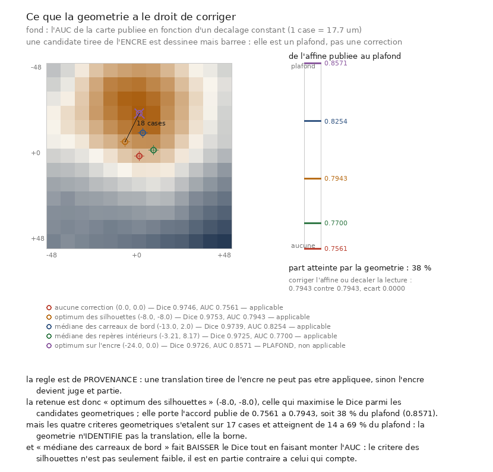

| candidate | provenance | décalage | Dice | AUC | part du plafond |
|---|---|---:|---:|---:|---:|
| aucune correction | géométrie | (0, 0) | 0,974601 | 0,7561 | 0 % |
| **optimum des silhouettes** ⭐ retenue | géométrie | (−8, −8) | **0,975255** | 0,7943 | **37,8 %** |
| médiane des carreaux de bord | géométrie | (−13, +2) | 0,973854 | **0,8254** | 68,6 % |
| médiane des repères intérieurs | géométrie | (−3,2 ; +8,2) | 0,972523 | 0,7700 | 13,7 % |
| optimum sur l'encre | **encre** | (−24, 0) | 0,97263 | **0,8571** | 100 %, ⛔ non applicable |

⚠ La retenue est celle qui **maximise le Dice** parmi les applicables, et ce critère est déclaré
**avant** de regarder l'encre — sinon « la meilleure candidate géométrique » serait choisie sur
l'encre et la règle de provenance ne servirait à rien.

#### ⚠⚠ La géométrie n'IDENTIFIE pas la translation, elle la borne

Quatre critères sans encre donnent quatre réponses étalées sur **16,9 cases**, qui atteignent de
**13,7 %** à **68,6 %** du plafond. La retenue en atteint **37,8 %**, et il reste **17,9 cases**
— **317 µm** — entre elle et l'optimum de l'encre. Ce n'est donc pas un nombre que la géométrie
rend, c'est un **intervalle**, et sa largeur est du même ordre que la translation elle-même.

#### ⚠⚠⚠ Et le fait qui explique tout : le critère des silhouettes est CONTRAIRE

**Les trois translations qui font monter l'AUC font toutes baisser le Dice** — y compris
l'optimum de l'encre, qui rend le meilleur accord d'encre (0,8571) avec un Dice (0,97263)
**inférieur** à celui de l'affine non corrigée (0,974601).

> Le recouvrement des silhouettes n'est pas seulement **treize fois moins sensible** que l'encre
> (`0,0315` d'étendue contre `0,4234`) : dans la plage qui compte, il pointe **dans l'autre
> sens**. Toute procédure de recalage pilotée par le recouvrement des contours s'éloigne donc de
> la bonne réponse en croyant s'en approcher — et c'est, en une phrase, pourquoi le champ de
> bord, le modèle lisse et l'agrégation locale ont tous échoué.

#### ✅ Le contrôle de signe, au dernier chiffre

Corriger l'**affine** et décaler la **lecture** sont deux façons d'appliquer la même translation.
Elles doivent donner le même accord, et elles le donnent : **0,79431 contre 0,79431, écart
0,0000**. Une correction appliquée à l'envers ne lève rien — elle rend simplement un accord plus
bas, ce qui ressemble à une mauvaise candidate et non à un bug — donc ce contrôle n'était pas
remplaçable par une relecture.

#### Ce que ça change pour C1

1. ⭐ **Une correction géométrique est disponible et légitime** : `corriger(affine, −8, −8)`,
   Dice **0,975255** contre 0,974601, et l'encre le confirme de l'extérieur (**0,7943** contre
   0,7561). Elle est publiée dans `la_translation_applicable.json` avec sa provenance.
2. ⚠⚠ **Elle ne suffit pas, et on sait de combien** : 317 µm de résidu que les silhouettes ne
   voient pas, soit un demi-caractère.
3. ⚠⚠⚠ **Et il ne faut PAS chercher mieux du côté des contours.** Le critère y est contraire :
   ce qui reste ne se gagnera qu'avec de la matière **intérieure**, c'est-à-dire les repères,
   qui sont le seul champ prédictif mesuré — et qui doivent être densifiés **ailleurs** que dans
   leur quartier.

### ⚠⚠⚠ Le goulot n'était pas le fragment, c'était le FICHIER — et les 71 trous du support étaient du bruit de compression

> Mesure : `src/encre/les_reperes_a_pleine_resolution.py` (20 contrôles) →
> `docs/mesures/les_reperes_a_pleine_resolution.json`. Figure :
> `src/figures/figure_les_reperes_a_pleine_resolution.py` (10 contrôles), le 2026-09-05.
>
> ```
> uv run python src/encre/les_reperes_a_pleine_resolution.py --json docs/mesures/les_reperes_a_pleine_resolution.json
> uv run python src/figures/figure_les_reperes_a_pleine_resolution.py --sortie docs/images/75_les_reperes_a_pleine_resolution.png
> ```

⭐⭐⭐ **Le segment publie AUSSI la carte d'encre à sa résolution native** — `ink-detection`,
**26 440 × 15 060**, un `.tif` de **20,5 Mo** — à côté du `ink-detection-downsampled` réduit ×8
en `.jpg` que tout ce lot lisait par habitude. L'échelle du transport passe de **0,12** à
**0,97**, donc un trou de 64 pixels du masque reste un trou de 64 pixels.

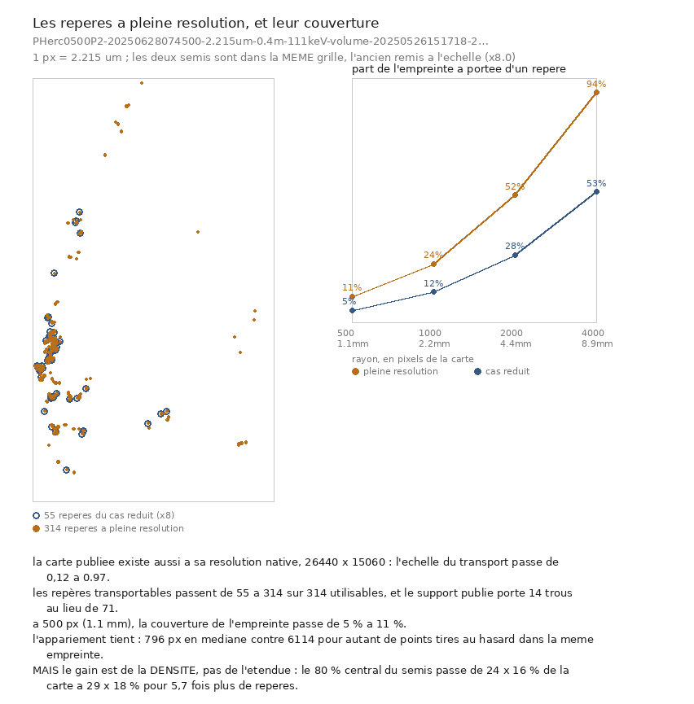

**Côté source, le goulot disparaît d'un coup** : les **314** trous utilisables du masque sont
**tous** transportables, contre **55** au réduit.

#### ⚠⚠⚠ Mais côté cible il s'effondre, et le compte brut dit pourquoi

| support | composantes de fond | intérieures | d'aire ≥ 4 |
|---|---:|---:|---:|
| le réduit publié (`.jpg`) | **420** | 419 | **153** |
| **témoin** : le plein réduit ×8 par la même règle | **19** | 18 | 15 |
| le plein (`.tif`) | 37 | 36 | 31 |

⚠⚠⚠ **Réduire le support à pleine résolution par la même règle ne rend pas 420 composantes, il
en rend 19.** Les trous du support réduit ne sont donc pas dans la **matière**, ils sont dans le
**fichier** : un `.jpg` est compressé avec perte et crénelle les bords à fort contraste,
c'est-à-dire précisément le pourtour des vrais trous. Le témoin est monté en faveur de ce qu'il
conteste — la règle de réduction est « plein dès qu'il y a de la matière », la plus généreuse.

> **Ce qui est corrigé, et c'était publié six heures plus tôt** : « le support de la carte
> publiée porte les trous du fragment, donc il est un masque de fait » est **faux**. Il en porte
> **36**, quand le masque en a **348**. Le support n'est pas un masque du fragment ; c'est une
> carte de détecteur qui en montre une poignée.

#### ⛔ Ce que je croyais survivre, et qui ne survit pas non plus

J'ai écrit ici que les **314** repères se posent **7,7 fois plus près** de ces 36 vides que le
hasard — **796 px** contre **6 114 px** — et que « les vides qui existent sont ceux du fragment,
c'est le compte qui était faux, pas l'appariement ». ⚠⚠⚠ **Faux aussi.** Le témoin uniforme casse
la place ET le groupement ; le témoin qui ne casse que la place met la vraie position **6ᵉ sur
21** (p = 0,29). Il n'y a pas d'appariement. Voir la section suivante.

#### ⚠⚠ Et la figure impose une seconde nuance : le gain est de la DENSITÉ, pas de l'étendue

| | 55 repères (réduit) | 314 repères (plein) |
|---|---:|---:|
| couverture à 500 px (1,1 mm) | 4,9 % | **10,5 %** |
| … à 1 000 px (2,2 mm) | 12,3 % | 23,9 % |
| … à 2 000 px (4,4 mm) | 27,6 % | 52,1 % |
| … à 4 000 px (8,9 mm) | 53,5 % | **94,0 %** |
| **étendue du 80 % central** | 24,1 × 16,1 % de la carte | **28,7 × 18,1 %** |

⚠ **Cinq fois et demie plus de repères pour un cinquième d'étendue en plus.** Le dessin le montre
sans ambiguïté : les 314 suivent **la même bande** que les 55. Multiplier la densité là où il y
avait déjà de la matière ne donne rien à un recalage qui manque de matière **ailleurs**.

#### Ce que ça change pour C1

1. ✅ **Le côté source est réglé** : 314 repères au lieu de 55, sans rien demander à personne —
   il suffisait de lire l'autre fichier. ⚠ Et c'est une leçon de méthode : le fichier par
   défaut d'un index n'est pas le meilleur fichier de l'index.
2. ⚠⚠⚠ **Le goulot a DÉMÉNAGÉ, il n'a pas disparu.** Il est maintenant du côté **cible** — 36
   vides publiés contre 348 dans le masque — et du côté **étendue** : une seule bande du
   fragment.
3. ⚠⚠ **Et la voie « le support est un masque de fait » est fermée.** Ce qui reste ouvert est ce
   que `68` §4 nommait déjà : demander un **masque de surface publié** au régime du prix, ou les
   étiquettes rendues dans son repère.

### ⛔⛔ Et le témoin JUSTE enterre l'appariement : la vraie place des repères n'a rien de particulier

> Mesure : `src/encre/le_temoin_de_meme_forme.py` (14 contrôles) →
> `docs/mesures/le_temoin_de_meme_forme.json`. Figure :
> `src/figures/figure_le_temoin_de_meme_forme.py` (8 contrôles), le 2026-09-05.
>
> ```
> uv run python src/encre/le_temoin_de_meme_forme.py --json docs/mesures/le_temoin_de_meme_forme.json
> uv run python src/figures/figure_le_temoin_de_meme_forme.py --sortie docs/images/75_le_temoin_de_meme_forme.png
> ```

⚠⚠⚠ **LE TÉMOIN DES DEUX TRANCHES PRÉCÉDENTES ÉTAIT TROP FACILE, ET C'EST MA FAUTE.** Elles
jugeaient l'appariement contre un semis tiré **uniformément** dans l'empreinte. Or les repères
sont **groupés** — leur 80 % central tient sur 29 % × 18 % de la carte — et les vides du support
sont eux aussi peu nombreux et localisés. Un semis uniforme est donc plus loin de tout **par
construction** : il casse **deux** choses à la fois, la place et le groupement, donc il ne peut
pas dire laquelle des deux explique un bon score.

⭐⭐⭐ **Le témoin juste garde la forme et ne casse que la place** : le même nuage de 314 repères,
sa géométrie interne intacte au bit près, posé ailleurs dans l'empreinte, vingt fois.

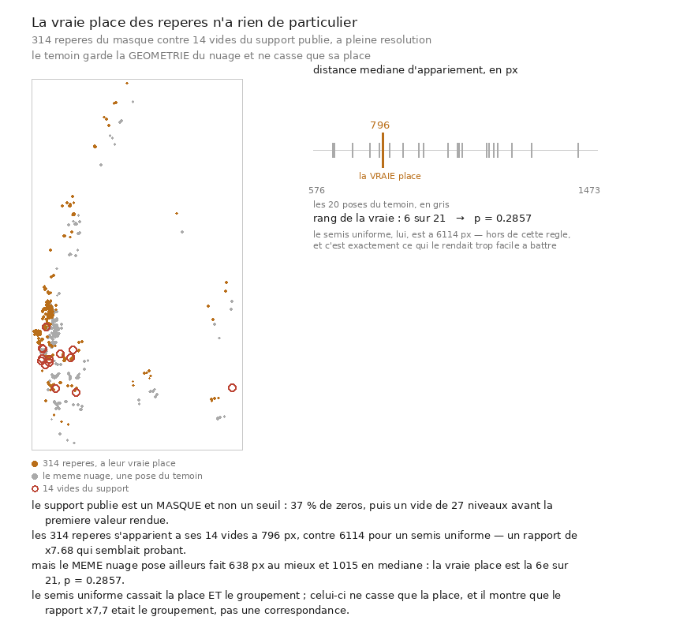

| | distance médiane d'appariement |
|---|---:|
| **la vraie place** | **796 px** |
| le témoin de MÊME FORME, meilleure des 20 poses | **638 px** |
| … sa médiane | 1 015 px |
| … sa pire pose | 1 411 px |
| le témoin **uniforme** d'avant | 6 114 px |

> ⛔ **Rang de la vraie place : 6ᵉ sur 21. p = 0,29.** Cinq poses au hasard font mieux qu'elle.
> Il n'y a **pas de correspondance** entre les trous du masque et les vides du support : le
> « ×8 » de la première tranche et le « ×7,7 » de la deuxième étaient le **groupement**, pas un
> appariement.

⚠ Le semis uniforme est à **6 114 px**, c'est-à-dire **hors** de l'étendue des vingt poses
(576 à 1 473). C'est la mesure de sa facilité : il ne pouvait pas ne pas être battu.

#### ⭐ Ce qui reste établi, et c'est solide

Le support publié **est un masque**, et ça se lit dans l'histogramme sans ambiguïté :
**37,5 %** des pixels exactement à zéro, puis un **vide de 27 niveaux** avant la première valeur
rendue (28). Un détecteur qui prédirait peu d'encre occuperait 1, 2, 3 ; un pipeline qui
**masque** écrit un zéro franc. ⚠ C'est donc bien un masque — celui du **régime du prix** — et
c'est pour ça qu'il n'a que 36 vides intérieurs : sa segmentation n'a pas les trous de l'autre
aplatissement, elle a les siens.

#### Ce que ça change pour C1

1. ⛔ **La voie « prendre les cibles dans la carte publiée » est FERMÉE**, et pas faute de
   résolution : à pleine résolution il y a 314 repères d'un côté et 14 cibles utilisables de
   l'autre, sans correspondance mesurable.
2. ⚠⚠⚠ **Et une leçon de méthode qui vaut pour tout le dépôt** : un témoin doit casser **une
   seule** chose. Celui qui en casse deux ne peut pas dire laquelle comptait, et il rend un
   rapport flatteur — ici **×7,7** — qui ne mesure que le confond qu'on a oublié de contrôler.
3. ⭐ Ce qui reste ouvert est ce que `68` §4 nommait déjà, et c'est maintenant la **seule** voie :
   un **masque de surface publié** au régime du prix, ou les étiquettes rendues dans son repère.

### Ce qui reste de C1, et c'est maintenant précis

1. ✅✅ **Ce n'était pas un champ, c'était une TRANSLATION — et sa part applicable est
   PUBLIÉE.** ⚠ Ce qu'on a le droit de retrancher est la translation **géométrique**
   (−8, −8), pas celle de l'encre : `la_translation_applicable.json` la porte avec sa
   provenance, elle gagne 0,7561 → **0,7943** d'accord publié, soit **37,8 %** du plafond, et il
   reste **317 µm** que les silhouettes ne voient pas. ⚠⚠⚠ Et il ne faut pas chercher mieux du
   côté des contours : dans la plage qui compte, leur recouvrement pointe **dans l'autre sens**.
   Le champ à
   34 carreaux, le modèle lisse et l'agrégation locale ont tous échoué, et la mesure sur
   **127 fenêtres** dit pourquoi : les fenêtres s'accordent toutes sur **(−24, 0)** cases
   (**425 µm**) à 27 cases près, quand les champs candidats déplacent de **40** et **60**. Une
   simple constante porte l'AUC médiane de **0,755 à 0,852** en améliorant **116 fenêtres sur
   127**, et l'accord publié sur toute l'empreinte de **0,756 à 0,857**. ⚠⚠ Le plan des
   **silhouettes** explique l'échec des bords : il arbitre **treize fois moins fort** que celui
   de l'encre et pointe ailleurs — un champ ajusté dessus l'est sur le mauvais signal.
   ⭐ **Ce qui reste à faire est plus petit et mieux défini** : après la translation il subsiste
   une dispersion de **471 µm**, l'ordre d'une lettre. Les **55 repères** sont le seul matériau
   qui en prédise quelque chose — laisser-un-dehors **31,8** contre **40,2** au champ nul et
   **42,8** au meilleur mélange de positions, là où les 34 carreaux échouent aux deux (77,5
   contre 60,5 et 58,8). ⭐ **Et ils sont désormais 314 et non 55** : il suffisait de lire la
   carte publiée à sa résolution native au lieu de sa réduction ×8. ⛔⛔ **Mais ils n'ont PAS de
   vis-à-vis** : contre un témoin qui garde la forme du nuage, la vraie place est la **6ᵉ sur
   21** (p = 0,29), donc l'appariement mesuré aux deux tranches précédentes était le
   **groupement** des repères. Le support publié est bien un **masque** — 37,5 % de zéros puis un
   vide de 27 niveaux — mais c'est celui du **régime du prix**, avec **36** vides à lui et non les
   348 de l'autre aplatissement. **La voie est fermée ; il faut un masque de surface publié.**
2. **Une fenêtre choisie dans un repère COMMUN**, pas dans la grille de chaque régime : les deux
   campagnes ont atterri sur deux régions différentes (27,8 % et 91,1 % d'encre), donc leurs
   nombres ne se comparaient pas même sans le problème de recalage.
3. **≥ 40 tuiles** pour un intervalle (`64` §1, σ = 0,2243), au lieu d'une fenêtre.
4. ⚠ **L'unité de notation reste à choisir séparément de la fenêtre du modèle** : 256 px valent
   **2 397 µm** au régime du prix contre 614 en production — près de quatre lettres au lieu d'une.
   La tuile équivalente à une lettre y ferait **66 px**.
- **≥ 40 tuiles** au lieu d'une fenêtre : l'intervalle de `64` §1 (σ = 0,2243) demande 40 tuiles
  pour séparer une AUC de 0,599 de 0,5. Une fenêtre unique ne donne pas d'intervalle.
- ⚠ **Et l'unité de notation reste à choisir séparément de la fenêtre du modèle** : une tuile de
  256 px vaut **2 397 µm** au régime du prix contre 614 en production — près de quatre lettres au
  lieu d'une, donc la garantie anti-hallucination ne se transporte pas. La tuile équivalente à une
  lettre y ferait **66 px**.

### ⭐⭐⭐ Et l'index publiait TREIZE SPIRES de ce fragment, que rien n'avait jamais ouvertes

> Mesure : `src/nappe/les_wraps_publies.py` (10 contrôles) →
> `docs/mesures/les_wraps_publies.json`. Figure :
> `src/figures/figure_les_wraps_publies.py` (9 contrôles), le 2026-09-05.
>
> ```
> uv run python src/nappe/les_wraps_publies.py --json docs/mesures/les_wraps_publies.json
> uv run python src/figures/figure_les_wraps_publies.py --sortie docs/images/75_les_wraps_publies.png
> ```

⚠⚠⚠ **L'index connaît 39 segments pour `PHerc0500P2`, dont TREIZE nommés `wrap01` à `wrap13`**,
chacun publiant sa surface en `tifxyz` **sur les trois volumes** (2,215 / 4,317 / 9,362 µm), plus
sa carte d'encre pleine résolution. **Aucune mesure du dépôt ne les avait jamais ouvertes.** Tout
le travail sur la chaîne, la spire et l'écart inter-feuilles a été fait en reconstruisant depuis
le volume brut, alors qu'une **vérité de terrain du déroulement** était publiée à côté.

⭐ **C'est la cinquième fois que cet angle mort coûte quelque chose**, et cette fois c'est l'auteur
qui l'a rouvert : *« regarde sur les autres serveurs au cas où »*. Le référent avait été déclaré
absent faute d'avoir interrogé un serveur ; ici c'est un dossier de l'index qu'on n'avait jamais
énuméré. **Ce qu'on croit absent doit être cherché avant d'être reconstruit.**

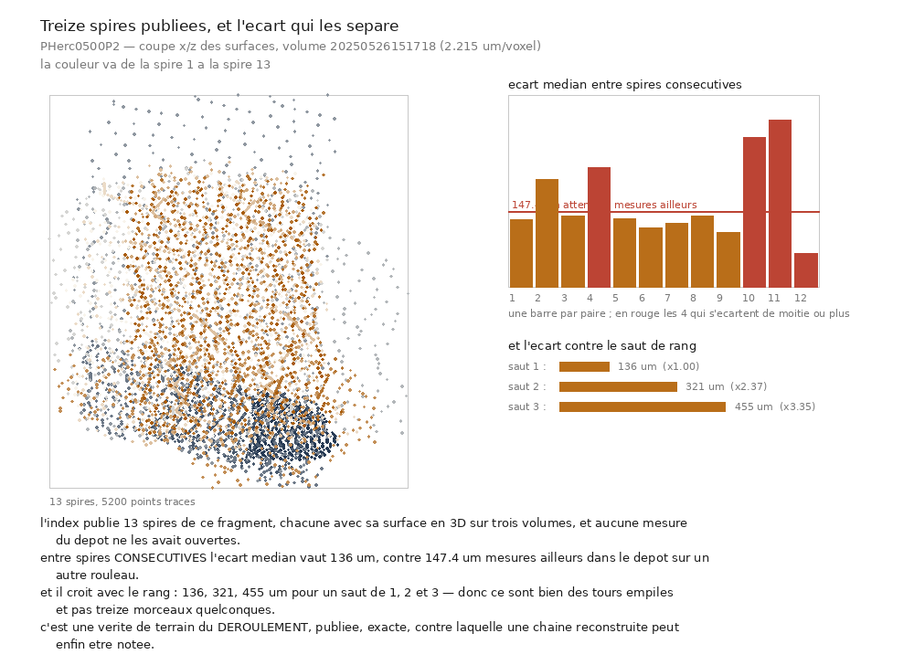

#### Est-ce que ce sont vraiment des spires consécutives ? — oui, et c'est mesuré

| saut de rang | paires | écart médian |
|---:|---:|---:|
| **1** (voisines) | 12 | **135,5 µm** |
| 2 | 11 | 320,7 µm  (×2,37) |
| 3 | 10 | 454,6 µm  (×3,35) |

⭐⭐⭐ **L'écart croît avec le rang**, donc ce sont bien des tours **empilés** et non treize
morceaux quelconques. Et l'écart entre voisines, **135,5 µm**, tombe à **8 %** de l'attendu
**147,4 µm** — mesuré ailleurs dans le dépôt (`la_surface_et_la_feuille`), **sur un autre
rouleau**. Un accord avec une prédiction extérieure vaut mieux qu'un accord avec soi-même.

⚠ **Quatre paires sur douze s'écartent de moitié ou plus** et elles sont dessinées comme les
autres, pas gommées : 4→5 à 232 µm, 10→11 à 292, 11→12 à 327, et 12→13 à **65** — plus près
qu'une feuille. La numérotation n'est donc pas géométriquement parfaite partout, et les p90
montent jusqu'à 3 mm là où deux spires ne se recouvrent que par un bord.

#### Ce que ça ouvre

1. ⭐⭐⭐ **Une vérité de terrain du DÉROULEMENT, publiée et exacte**, sur laquelle une chaîne
   reconstruite peut enfin être **notée** au lieu d'être seulement cohérente avec elle-même.
2. ⭐⭐ **Un repère commun entre les deux régimes, gratuit** : chaque spire publie son `tifxyz`
   sur le volume de production **et** sur celui du prix. La tâche « une fenêtre choisie dans un
   repère COMMUN » cesse d'être un problème d'estimation ; c'est une lecture.
3. ⚠ Et une question à poser avant de s'en servir : les treize spires couvrent-elles la même
   région que le segment `500P2_front` sur lequel tout C1 a été bâti, ou une autre ?

#### ⭐⭐ Et l'angle mort est désormais outillé, parce qu'il a coûté cinq fois

> Mesure : `src/depot/ce_que_les_serveurs_publient.py` (13 contrôles) →
> `docs/mesures/ce_que_les_serveurs_publient.json`, le 2026-09-05.
>
> ```
> uv run python src/depot/ce_que_les_serveurs_publient.py --fragment PHerc0500P2
> ```

L'inventaire compare les deux serveurs à l'index **en cache** du dépôt, et le résultat corrige
mon hypothèse : **39 segments sur S3, 39 dans l'index, 0 écart**. L'angle mort n'était donc pas
la péremption du cache — c'était que **personne ne l'avait énuméré**.

⭐⭐⭐ **Et la vraie cause structurelle est là** : les deux serveurs ne publient pas la même chose.

| | S3 | `dl.ash2txt.org` |
|---|---|---|
| `segments/` (dont les 13 spires) | **oui** | non |
| `paths/` (dont les étiquettes et le masque) | non | **oui** |
| `photos/` | **oui** | non |
| `cases/`, `multispectral/` | non | **oui** |
| `representations/`, `volumes/` | oui | oui |

Les étiquettes viennent de `dl`, les segments de `S3`, et **personne n'avait jamais croisé les
deux listages**. « Regarder sur les autres serveurs » cesse d'être une superstition : c'est une
règle avec une base mesurée, et elle est maintenant une commande.

⚠ Le refus fait partie de l'outil : un serveur injoignable rend une liste vide, et comparer une
liste vide à un index plein dirait « l'index a tout inventé ». Un listage vide est **refusé**,
pas interprété — c'est la panne qui ressemble le plus à un résultat.

⚠⚠ Et un défaut de mon propre outil, attrapé avant publication : `index_local` ignorait son
argument et rendait les **311** segments des quarante-cinq objets du catalogue, d'où un faux
« 272 segments à l'index seulement ». Un inventaire qui crie faux est un inventaire qu'on cesse
d'écouter. Le filtre par objet est désormais **asserté dans les deux sens**.

#### ⛔ Et les treize spires ne sont PAS la région de C1 : elles en sont une seconde

> Mesure : `src/nappe/lemprise_des_spires.py` (15 contrôles) →
> `docs/mesures/lemprise_des_spires.json`. Figure :
> `src/figures/figure_lemprise_des_spires.py` (9 contrôles), le 2026-09-05.
>
> ```
> uv run python src/nappe/lemprise_des_spires.py --json docs/mesures/lemprise_des_spires.json
> uv run python src/figures/figure_lemprise_des_spires.py --sortie docs/images/75_lemprise_des_spires.png
> ```

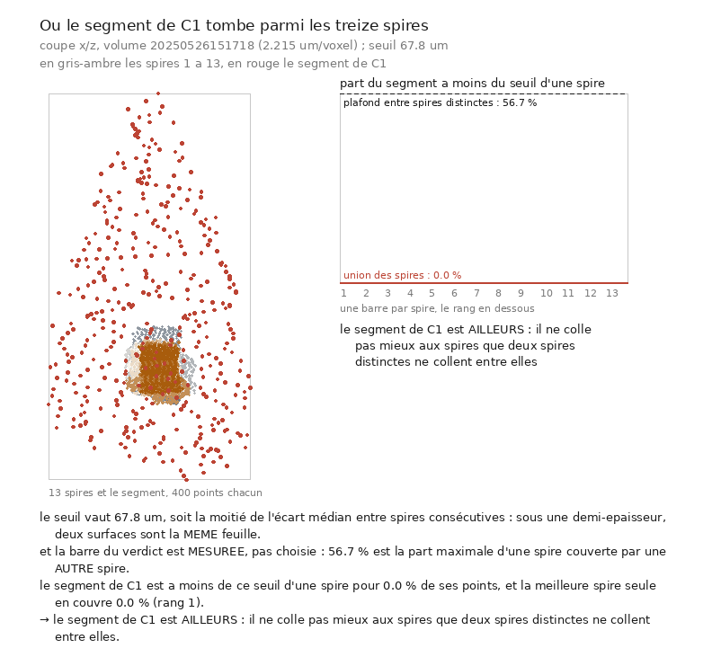

⚠⚠ **Deux seuils, et aucun n'est choisi.** Le seuil de coïncidence vaut **67,75 µm**, la moitié
de l'écart mesuré entre spires consécutives : sous une demi-épaisseur, deux surfaces sont la
**même** feuille. Et la barre du verdict est le **plafond entre spires distinctes** — la part
maximale d'une spire couverte par une **autre** spire, **56,74 %**, mesurée sur les 156 paires.
Franchir ce que deux feuilles différentes atteignent au mieux, c'est être la même feuille.

| | valeur |
|---|---:|
| part du segment à moins du seuil d'**une** spire | **0,0 %** sur les treize |
| … de leur **union** | **0,0 %** |
| barre mesurée (plafond entre spires distinctes) | 56,74 % |
| **distance minimale** segment → union | **2 134 µm** |
| … soit, en épaisseurs de feuille | **15,7** |
| distance médiane | 8 458 µm |

⛔ **Le segment `500P2_front`, sur lequel toute la colonne C est bâtie, est AILLEURS** : il ne
colle pas mieux aux spires que deux spires distinctes ne collent entre elles, et sa surface la
plus proche est à **seize épaisseurs**. Les treize spires ne donnent donc **aucun voisinage** à
C1 — elles sont une **seconde région** du fragment.

⭐⭐ **Ce qui reste, et c'est un gain net** : le corpus double. Treize surfaces de plus, avec une
géométrie exacte **sur les trois volumes**, là où `500P2_front` n'en couvrait qu'une région — et
elles portent chacune leur carte d'encre pleine résolution.

⚠ Une nuance que la calibration a rendue visible : **les spires publiées ne sont pas disjointes**.
La meilleure paire se recouvre à **56,7 %** sous une demi-épaisseur, donc « treize tours
consécutifs » ne veut pas dire treize feuilles séparées — certaines partagent largement une même
feuille. Le compte de tours et le compte de feuilles ne sont pas le même nombre.

#### ⭐⭐⭐ Et la PRIMITIVE du déroulement est validée sur cette vérité de terrain

> Mesure : `src/nappe/le_pas_normal_atteint_la_spire.py` (11 contrôles) →
> `docs/mesures/le_pas_normal_atteint_la_spire.json`. Figure :
> `src/figures/figure_le_pas_normal.py` (9 contrôles), le 2026-09-06.
>
> ```
> uv run python src/nappe/le_pas_normal_atteint_la_spire.py --json docs/mesures/le_pas_normal_atteint_la_spire.json
> uv run python src/figures/figure_le_pas_normal.py --sortie docs/images/75_le_pas_normal.png
> ```

⚠⚠⚠ **Toute la colonne « chaîne » repose sur une supposition jamais confrontée à autre chose
qu'elle-même** : *depuis une feuille, avancer d'un écart inter-feuilles le long de la normale
tombe sur la feuille voisine*. C'est ce que fait un dérouleur, pas après pas, et si c'est faux
tout ce qui suit dérive. Les treize spires publiées la rendent **falsifiable**.

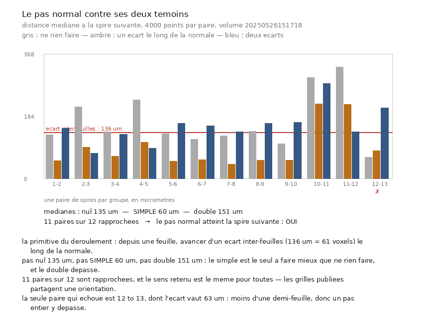

| | distance médiane à la spire suivante |
|---|---:|
| **ne rien faire** (pas nul) | **135 µm** |
| **un** écart le long de la normale | **60 µm** |
| **deux** écarts | 151 µm |

⭐⭐⭐ **Le V est là, et c'est lui qui prouve quelque chose.** Le pas nul retombe sur l'écart
inter-feuilles mesuré (135 contre 135,5 µm) — donc les spires sont bien voisines. Le pas simple
le divise par plus de deux. Et le **double dépasse** : la distance franchie est donc bien celle
d'**une feuille**, pas une quantité quelconque qui améliorerait tout.

**11 paires sur 12** sont rapprochées, et ⭐ **le sens retenu est le même pour les douze** — les
grilles publiées partagent une orientation, ce qu'aucune mesure n'avait établi.

⚠ **La seule paire qui échoue est 12 → 13**, dont l'écart vaut **63 µm**, soit moins d'une
demi-feuille : un pas d'une feuille entière y dépasse forcément. C'est la même paire anormale que
la tranche précédente avait déjà signalée, et elle échoue pour la raison qu'on lui connaît.

⚠⚠ **Ce que ça ne dit pas** : le pas ne tombe pas *sur* la feuille suivante, il tombe **à 60 µm**
d'elle — 44 % d'un écart. C'est la précision réelle de la primitive, et elle suffit exactement à
ce qu'il faut : ne pas confondre une feuille avec sa voisine. Elle ne suffit pas à se passer d'un
recalage local ensuite.

#### ⭐⭐⭐ Et le graal, ramené à une mesure : un dérouleur aveugle tient DEUX tours

> Mesure : `src/nappe/derouler_par_le_pas_normal.py` (9 contrôles) →
> `docs/mesures/derouler_par_le_pas_normal.json`. Figure :
> `src/figures/figure_derouler_par_le_pas_normal.py` (11 contrôles), le 2026-09-06.
>
> ```
> uv run python src/nappe/derouler_par_le_pas_normal.py --json docs/mesures/derouler_par_le_pas_normal.json
> uv run python src/figures/figure_derouler_par_le_pas_normal.py --sortie docs/images/75_derouler_par_le_pas_normal.png
> ```

⚠⚠⚠ **Dérouler, ce n'est pas faire un pas, c'est les enchaîner.** La primitive vaut 60 µm sur un
pas ; la question qui décide est *au bout de combien de tours l'erreur dépasse une feuille* — car
à ce moment-là le dérouleur ne sait plus **sur laquelle** il est, et tout ce qu'il écrit ensuite
est faux.

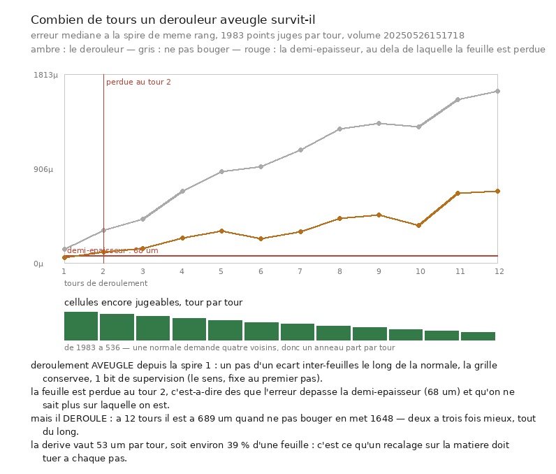

Le protocole est **aveugle par construction** : la grille est conservée à chaque pas, donc les
normales du tour suivant se calculent sur la surface **prédite**. ⚠ Un **seul bit de
supervision**, déclaré et compté : le sens de la normale, fixé au premier pas. Le rechoisir à
chaque tour en regardant la cible reviendrait à souffler la route.

| tours | erreur | ne pas bouger |
|---:|---:|---:|
| 1 | **52 µm** | 129 µm |
| 2 | **102 µm** | 311 µm |
| 3 | 135 µm | 418 µm |
| 6 | 230 µm | 920 µm |
| 12 | **689 µm** | 1 648 µm |

⛔ **La feuille est perdue au tour 2** : l'erreur dépasse la demi-épaisseur (67,75 µm), donc le
dérouleur ne peut plus dire sur quelle feuille il se trouve.

⭐⭐ **Et pourtant il déroule.** Il bat l'immobilité à **chacun des douze tours**, deux à trois
fois — à douze tours il est à 689 µm quand ne rien faire en met 1 648. Ce n'est pas un échec du
pas normal, c'est la mesure de ce qui lui manque.

⭐⭐⭐ **La dérive vaut 53 µm par tour**, soit **39 % d'une feuille — ajustée par moindres carrés
sur toute la marche**, pas prise entre deux extrémités. C'est *le* chiffre à battre : **c'est
exactement ce qu'un recalage sur la matière doit tuer à chaque pas.** La feuille suivante est
toujours dans la bonne direction ; elle est juste un peu plus loin ou un peu plus près que
l'épaisseur nominale, et personne ne recale.

⚠ La grille fond de **1 983 à 536** cellules sur douze tours — une normale demande quatre voisins
valides, donc un anneau part par tour. Le compte est rendu **à côté** de l'erreur : un dérouleur
qui « réussirait » en ne gardant que trois cellules n'aurait pas déroulé, il aurait rétréci.

⚠ Et la marche n'est pas monotone (306 µm au tour 5, 230 au tour 6) : les spires publiées ont
elles-mêmes leurs irrégularités, déjà signalées.

#### ⭐⭐ Et la dérive est à UN CINQUIÈME un biais, le reste une dispersion

> Mesure : `src/nappe/la_derive_est_elle_un_biais.py` (9 contrôles) →
> `docs/mesures/la_derive_est_elle_un_biais.json`. Figure :
> `src/figures/figure_la_derive_est_elle_un_biais.py` (9 contrôles), le 2026-09-06.
>
> ```
> uv run python src/nappe/la_derive_est_elle_un_biais.py --json docs/mesures/la_derive_est_elle_un_biais.json
> uv run python src/figures/figure_la_derive_est_elle_un_biais.py --sortie docs/images/75_la_derive_est_elle_un_biais.png
> ```

⚠⚠⚠ **Cette question vient avant tout recalage lourd.** Un raccrochage à la matière demande de
lire le volume ; il serait absurde de le construire si les 53 µm par tour venaient simplement
d'une **longueur de pas mal estimée**. Un biais est une constante — il se retranche une fois et
disparaît. Une dispersion, non.

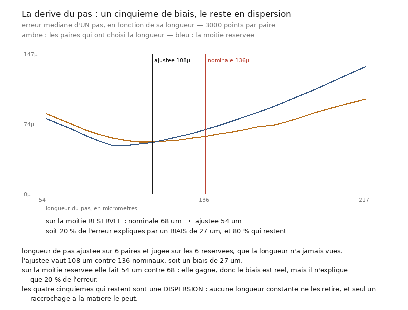

⚠ Le piège est évident et il est évité : choisir la longueur qui minimise l'erreur **sur les
spires qu'on mesure ensuite**, c'est ajuster sur la réponse. Elle est donc ajustée sur **six**
paires et jugée sur les **six réservées**, qu'elle n'a jamais vues — et la coupure se fait **sur
le rang**, parce que deux spires voisines partagent leur géométrie et qu'un tirage au hasard
mettrait la même région des deux côtés.

| | valeur |
|---|---:|
| longueur **nominale** (écart médian publié) | 135,5 µm |
| longueur **ajustée** sur six paires | **108,4 µm** |
| biais entre les deux | **27,1 µm** |
| erreur sur la moitié réservée, nominale | 67,6 µm |
| … **ajustée** | **54,1 µm** |
| part de l'erreur expliquée par le biais | **20 %** |

⭐ **Le biais est réel** : la longueur ajustée gagne sur des spires qu'elle n'a jamais vues, ce qui
est le seul sens acceptable de « elle gagne ». ⚠⚠ **Mais elle n'explique qu'un cinquième.** Le
plancher de la courbe réservée est à **50,5 µm** : aucune longueur constante ne descend en
dessous.

> ⛔ **Les quatre cinquièmes qui restent sont une dispersion locale**, et c'est la réponse à la
> question posée : **un meilleur nombre ne remplacera pas un raccrochage à la matière.** La
> tranche qui suit est donc justifiée, et elle a maintenant son étalon — passer sous **50 µm**
> par pas.

⚠ Le minimum du balayage est **intérieur** (54 à 217 µm, optimum à 108,4), donc il désigne bien
une longueur. Et ⚠ la première fixture de la batterie a échoué pour la bonne raison : elle
balayait 20 à 40 µm pour une cible à 30 **voxels**, soit 60 µm — c'est le drapeau `au_bord` qui
l'a dit.

#### ⛔ Et le raccrochage ne peut PAS se bâtir sur ce qui est publié : il manque 5,9 µm

> Mesure : `src/nappe/la_portee_des_piles_publiees.py` (8 contrôles) →
> `docs/mesures/la_portee_des_piles_publiees.json`. Figure :
> `src/figures/figure_la_portee_des_piles.py` (8 contrôles), le 2026-09-06.
>
> ```
> uv run python src/nappe/la_portee_des_piles_publiees.py --json docs/mesures/la_portee_des_piles_publiees.json
> uv run python src/figures/figure_la_portee_des_piles.py --sortie docs/images/75_la_portee_des_piles.png
> ```

⚠⚠⚠ **Cette question évite de construire la mauvaise chose.** Un raccrochage lit l'intensité
**autour de la position prédite**, qui est à une épaisseur de feuille du départ. Chaque spire
publie un `surface-volumes` en **(couche, u, v)** — donc l'indice de couche **est** une distance
signée le long de la normale. Reste à savoir si la pile va assez loin.

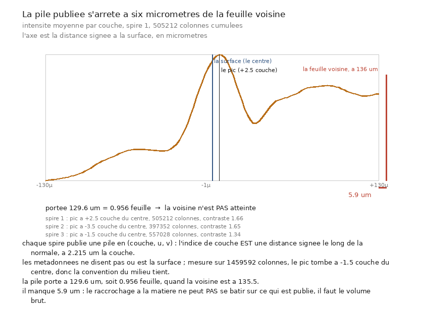

⭐ **Les métadonnées ne disent pas où est la surface** — `num_slices`, `slice_step`, translation
nulle, rien d'autre. Ça se mesure, et c'est mesuré : sur **1 459 592 colonnes** cumulées de trois
spires, le pic d'intensité tombe à **−1,5 couche** du centre (tolérance : une demi-feuille, soit
30,6 couches). **La convention du milieu tient**, donc l'axe des distances est bon.

⚠⚠ Et c'était un piège : sur trois blocs voisins pris isolément, le pic tombait à **66, 78 et
85**. Un bloc de 128 × 128 colonnes ne voit qu'un morceau de feuille — le profil n'a de sens que
cumulé, et le compte de colonnes est rendu pour qu'un profil bâti sur trois d'entre elles ne passe
pas pour une mesure.

| | valeur |
|---|---:|
| couches de la pile | 118 à 2,215 µm |
| portée autour de la surface | **129,6 µm** |
| … en épaisseurs de feuille | **0,956** |
| écart inter-feuilles | 135,5 µm |
| **ce qui manque** | **5,9 µm** |

> ⛔ **La pile publiée s'arrête à quatre pour cent de la feuille voisine.** Le raccrochage à la
> matière ne peut donc **pas** se bâtir sur ce qui est publié : il faut le **volume brut**. Le
> savoir maintenant coûte une mesure ; l'apprendre après avoir écrit le raccrochage aurait coûté
> le raccrochage.

⚠ La surface retenue reste le **centre** et non le pic : le pic la *confirme*, mais la prendre
ferait dépendre la géométrie d'un contraste local, et une pile un peu plus dense d'un côté
déplacerait la surface.

#### ✅✅ Sur le VOLUME BRUT, le raccrochage passe sous l'étalon : 33,3 µm

> Mesure : `src/nappe/le_raccrochage_a_la_matiere.py` (42 contrôles) →
> `docs/mesures/le_raccrochage_a_la_matiere.json`. Figure :
> `src/figures/figure_le_raccrochage_a_la_matiere.py` (17 contrôles), le 2026-09-06.
>
> ```
> uv run python src/nappe/le_raccrochage_a_la_matiere.py --json docs/mesures/le_raccrochage_a_la_matiere.json
> uv run python src/figures/figure_le_raccrochage_a_la_matiere.py --sortie docs/images/75_le_raccrochage_a_la_matiere.png
> ```

Le volume de scan de `PHerc0500P2` est publié : `20250526151718-2.215um-0.4m-111keV-masked.zarr`,
**28096 × 18209 × 18209 voxels, blocs de 128³ NON compressés**. ⚠⚠ Le nom porte l'horodatage du
volume *et* sa taille de voxel, et les deux sont **confrontés à ce que les spires déclarent**
avant qu'un octet ne soit lu — lire les bonnes coordonnées dans le mauvais volume est la panne
qui a coûté treize rendus noirs (`54`).

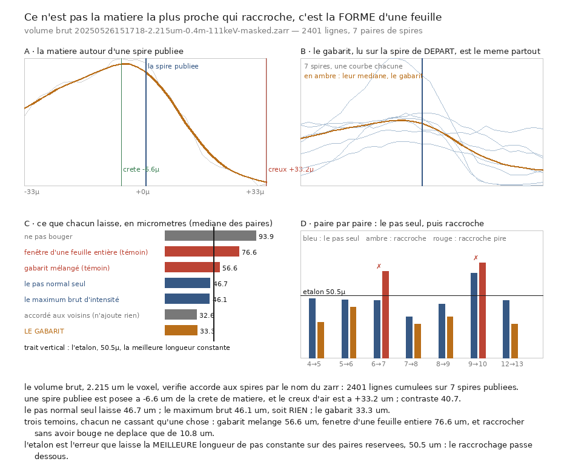

⭐⭐ **La convention se mesure avant qu'aucun raccrochage n'ait lieu.** Une spire publiée est-elle
posée sur une **crête** de matière ou dans un **creux** entre deux feuilles ? Rien ne le dit, et se
tromper enverrait le raccrochage chercher l'air. Sur **2401 lignes** cumulées de sept spires : la
crête est à **−6,6 µm** de la surface publiée, le creux d'air à **+33,2 µm**, contraste **40,7**.

⚠⚠ **Et ma première version a trouvé un pas de crêtes de 8,9 µm** — quatre voxels, c'est-à-dire
l'ondulation de l'échantillonnage. Chercher un pic sur un profil **non lissé** trouve du bruit, et
le rend avec toute la précision d'une mesure. ⚠ Un créneau seul ne suffit pas non plus : une ride
d'un échantillon est **exactement la fréquence de Nyquist**, et seul un noyau de longueur paire
— ici le `[1, 2, 1]` ajouté au créneau — l'annule à zéro. C'est la batterie qui l'a dit, pas
l'usage réel.

| ce qu'on essaie | ce qu'il reste, en médiane |
|---|---:|
| ne pas bouger | 93,9 µm |
| fenêtre d'une **feuille entière** (témoin) | 76,6 µm |
| **gabarit mélangé** (témoin) | 56,6 µm |
| le pas normal seul | 46,7 µm |
| le **maximum brut** d'intensité | 46,1 µm |
| **le gabarit** | **33,3 µm** |
| … accordé aux voisins de grille | 32,6 µm |

⛔⛔ **Le maximum brut ne fait RIEN** — 46,1 contre 46,7 pour le pas seul. La crête est large de
trente voxels ; un maximum d'intensité se pose n'importe où sur ce plateau. Ce qui raccroche n'est
pas la matière la plus proche, c'est **la forme d'une feuille entière** : la corrélation normalisée
de la ligne avec le profil lu **sur la spire de départ**.

⚠⚠⚠ **Le gabarit ne sait rien de la cible**, et c'est ce qui rend la mesure honnête : on se tient
sur la spire `k`, donc son profil est une donnée qu'on a ; celui de la spire `k+1` serait la
réponse. ⚠ Ce qui reste circulaire est dit : les spires publiées ont elles-mêmes été segmentées
dans ce volume, donc l'accord n'est pas une découverte indépendante — ce qui est neuf est **la
part de l'erreur résiduelle qu'un raccrochage local enlève**, le pas géométrique ne lisant, lui,
aucun voxel.

**Trois témoins, chacun ne cassant qu'une seule chose :**

| témoin | ce qu'il casse | ce qu'il rend |
|---|---|---:|
| gabarit **mélangé** | le lien entre le décalage et la matière, rien d'autre | 56,6 µm |
| fenêtre d'une **feuille entière** | la fenêtre dérivée, la voisine devient atteignable | 76,6 µm |
| raccrocher **sans avoir bougé** | rien — le gabarit doit retrouver SA propre feuille | déplace de **10,8 µm** |

> ✅✅ **33,3 µm par pas, contre un étalon de 50,5.** L'étalon n'est pas choisi : c'est l'erreur que
> laisse la **meilleure longueur de pas constante** sur des paires réservées (section précédente).
> Le raccrochage fait donc ce qu'aucun nombre transporté ne peut faire — parce qu'il redemande à
> la matière, à chaque pas, où la feuille se trouve.

⚠⚠ **Deux paires sur sept empirent, et elles sont dessinées comme les autres.** Elles n'ont pas la
même cause, et les deux se nomment : pour 9→10 le pas seul laisse déjà **70,1 µm**, au-delà de la
demi-fenêtre de 67,8 — la bonne feuille n'est **pas à portée**, et aucun gabarit ne rattrape ça ;
pour 6→7 le gabarit ne retrouve pas sa propre feuille de départ (30,5 µm de déplacement sur place).
⚠ Ce déplacement sur place est calculable **sans la réponse**, donc ce serait le bon signal de
confiance — sauf qu'il **ne sépare pas** les deux échecs ici (12→13 déplace de 37,9 µm et gagne
quand même). Dit plutôt que vendu.

⚠ **L'accord des voisins n'ajoute rien**, et c'est son témoin qui le dit : une feuille est lisse,
donc la médiane des décalages du voisinage 3×3 devrait corriger l'isolé — elle reprend **0,7 µm**,
et son propre témoin (la médiane de **neuf décalages sans rapport**) en reprend déjà 8,6 sur la
même queue. Ce qui travaillait était la médiane, pas le voisinage. ⚠ La mesure a d'ailleurs exigé
un **sous-rectangle** de grille et non un tirage aléatoire : un tirage garde la même erreur médiane
et détruit le voisinage, donc rend l'accord inmesurable.

⚠ **Une paire n'est retenue que si la spire d'arrivée passe dans la boîte**, et le critère est
**géométrique**. Sans lui, 10→11 entrait avec mille micromètres d'erreur — non parce que le
raccrochage échoue, mais parce que la spire 11 publiée ne couvre pas cette région. Écarter sur
l'erreur aurait été choisir sur le résultat.

⚠ Le coût est rendu parce qu'un bloc fait **2 Mio non compressés** : **197 Mio** en cache pour
toute la boîte, 3 blocs neufs à la dernière exécution. Le cache est sur disque, sinon le chiffre
publié dépendrait de la patience de qui le rejoue.

> ⭐⭐⭐ **La tranche suivante est le déroulement ITÉRÉ raccroché.** Le dérouleur aveugle perd la
> feuille au tour 2 avec 53 µm de dérive par tour ; le raccrochage vaut 33,3 µm sur **un** pas.
> Ce qu'il reste à mesurer est la seule chose qui décide : **est-ce que l'erreur cesse de
> s'accumuler**, ou est-ce qu'elle s'accumule seulement plus lentement.

#### ⛔⛔ Et à l'ITÉRATION rien ne déroule — le gain du raccrochage ne survit pas à UN tour

> Mesure : `src/nappe/derouler_en_raccrochant.py` (47 contrôles) →
> `docs/mesures/derouler_en_raccrochant.json` (boîte de 640 voxels) et
> `docs/mesures/derouler_en_raccrochant_balayage.json` (trois tailles). Figure :
> `src/figures/figure_derouler_en_raccrochant.py` (17 contrôles), le 2026-09-06.
>
> ```
> uv run python src/nappe/derouler_en_raccrochant.py --cote 640 --json docs/mesures/derouler_en_raccrochant.json
> uv run python src/nappe/derouler_en_raccrochant.py --balayer 384,512,640 --json docs/mesures/derouler_en_raccrochant_balayage.json
> uv run python src/figures/figure_derouler_en_raccrochant.py --sortie docs/images/75_derouler_en_raccrochant.png
> ```

⚠⚠⚠ **Les deux nombres précédents ne se composaient pas, et c'est la mesure qui a tranché.** Un
dérouleur aveugle perd la feuille au tour 2 ; un raccrochage reprend un tiers de l'erreur sur
**un** pas. Enchaînés, ils ne s'additionnent pas — et la raison est maintenant chiffrée.

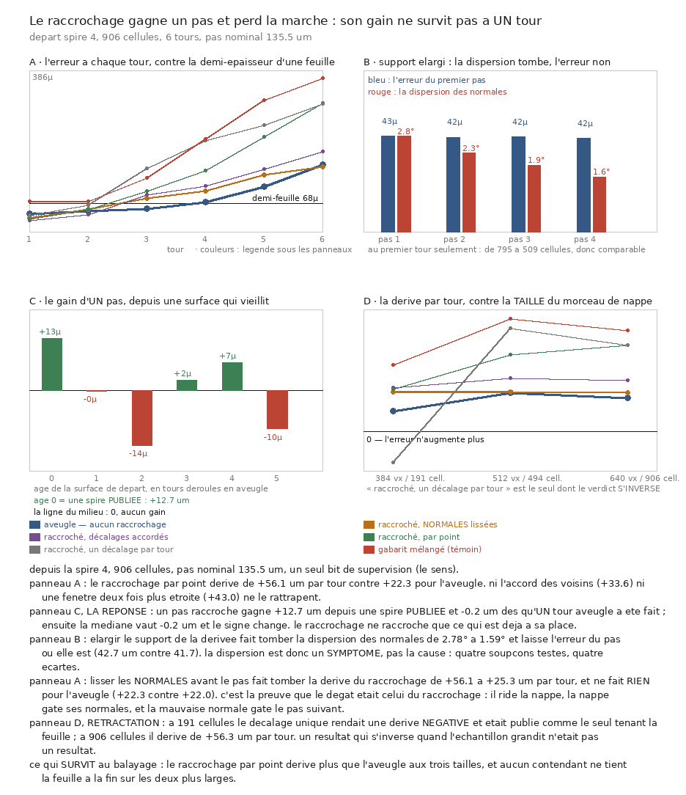

##### ⛔⛔⛔ RÉTRACTATION : « un décalage UNIQUE par tour déroule » est retiré

La première version de cette section, publiée le matin même, mesurait sur **191 cellules et
quatre tours** et concluait que le décalage unique par tour rendait une dérive **négative** et
qu'il était **le seul des six à tenir encore la feuille**. Refait sur des morceaux de nappe plus
larges, au **même endroit**, avec le **même code** :

| côté de la boîte | cellules | tours | par point | accordé | étroite | **décalage unique** | aveugle | hasard |
|---:|---:|---:|---:|---:|---:|---:|---:|---:|
| 384 vx | 191 | 4 | +27,8 | +28,9 | +22,0 | **−19,5** | +13,3 | +43,6 |
| 512 vx | 494 | 6 | +49,9 | +35,1 | +43,2 | **+67,3** | +25,5 | +73,6 |
| 640 vx | 906 | 6 | +56,1 | +33,6 | +43,0 | **+56,3** | +22,3 | +65,7 |

*(dérive en µm par tour, ajustée par moindres carrés sur toute la marche)*

⛔ **Un résultat qui s'inverse quand l'échantillon grandit n'était pas un résultat.** Et il
s'inverse à **deux** tailles indépendantes, pas une. Une seconde revendication tombe avec :
la « longueur de pas équivalente » du décalage global valait 114,7 µm à 191 cellules — *« à six
micromètres de la longueur ajustée sur les cibles »* — et vaut **161,3 µm** à 906. C'était une
coïncidence de boîte, pas un fait sur la nappe.

⚠⚠ **La boîte n'était pas un choix de résultat, elle était un choix de COÛT** : un bloc de ce
volume fait 2 Mio non compressés, et 384 voxels était ce qui tenait dans le cache du jour. C'est
exactement pour ça qu'il fallait la balayer avant de conclure — un paramètre choisi pour sa
facture n'a aucune raison d'être neutre sur la mesure.

##### La marche, sur le plus grand morceau mesuré (906 cellules, 6 tours)

| tour | cell. | par point | accordé | étroite | décalage unique | aveugle | hasard | rugosité | perdues |
|---:|---:|---:|---:|---:|---:|---:|---:|---:|---:|
| 1 | 795 | **30 µm** | 28 | 43 | 40 | 43 | 72 | 6 µm | 0,30 |
| 2 | 692 | 53 | 40 | 55 | 64 | **51** | 73 | 17 µm | 0,38 |
| 3 | 596 | 97 | 89 | 76 | 152 | **55** | 129 | 25 µm | 0,64 |
| 6 | 349 | 309 | 192 | 256 | 306 | **161** | 368 | 25 µm | 0,87 |

⛔ **Aucun contendant ne tient la feuille au dernier tour, et le moins mauvais est celui qui ne
lit rien** : l'aveugle dérive de **+22,3 µm par tour** quand le meilleur raccrochage — l'accordé
aux voisins — en fait +33,6. ⭐ Le seul ordre stable aux trois tailles est celui-là : **le
raccrochage par point dérive plus que l'aveugle partout**, et le gabarit mélangé est pire que
tout partout.

##### ⭐⭐⭐ Et la RAISON est mesurée : le gain ne survit pas à un seul tour

L'expérience qui manquait tient en une phrase : la mesure d'**un** pas part toujours d'une spire
**publiée**, dont les normales sont propres ; une marche part de sa propre reconstruction, qui ne
l'est plus. Ici la trajectoire de référence est la marche **aveugle** — une surface qui vieillit
sans que le raccrochage y soit pour rien — et à chaque tour on en tire **deux pas depuis le même
point** : un aveugle, un raccroché. Une seule variable change.

| âge de la surface | pas aveugle | pas raccroché | **gain** |
|---:|---:|---:|---:|
| **0 tour — une spire publiée** | 42,7 µm | **30,0 µm** | **+12,7** |
| 1 tour | 50,8 | 51,0 | **−0,2** |
| 2 tours | 54,8 | 68,3 | −13,5 |
| 3 tours | 71,0 | 68,5 | +2,5 |
| 4 tours | 108,3 | 101,4 | +6,8 |
| 5 tours | 161,3 | 170,8 | −9,5 |

> ⛔⛔⛔ **Le raccrochage ne raccroche que ce qui est déjà à sa place.** Il gagne **12,7 µm**
> depuis une spire publiée et **plus rien** dès qu'un seul tour aveugle a été fait — ensuite la
> médiane vaut **−0,2 µm** et le signe change quatre fois. Les 33,3 µm de la tranche précédente
> sont donc un gain **conditionnel au point de départ**, pas une capacité de la méthode.

⚠⚠ **Le critère est structurel, pas un seuil.** Ma première version demandait « moins de la
moitié du gain initial » et elle est tombée sur **6,8 contre 6,35** — un verdict décidé au dixième
de micromètre par un nombre que j'avais choisi. Ce qui distingue un effet d'un bruit n'est pas sa
taille, c'est que le bruit **change de signe** et qu'un effet non.

⚠ La rugosité dit la même chose autrement : le champ de décalages par point ride la nappe de
**6 à 25 µm** au fil des tours, et la rugosité mesurée **depuis la surface aveugle** monte elle
aussi (6 → 22 µm). Ce n'est pas le raccrochage qui abîme la surface au point de se saborder — la
surface se dégrade toute seule, et le raccrochage cesse simplement d'y voir une feuille.

##### ⭐⭐⭐ Le MÉCANISME, trouvé en éliminant : ce sont les NORMALES

Trois soupçons ont été testés et écartés avant celui qui tient, et chacun ne cassait qu'une chose.

| soupçon | ce qui a été changé | dérive par tour |
|---|---|---:|
| les cellules sautent sur la feuille voisine | fenêtre deux fois plus **étroite** | +43,0 µm |
| le champ de décalages est bruité | décalages **accordés** au voisinage 3×3 | +33,6 µm |
| le gabarit se dégrade avec la surface | gabarit **figé**, lu une fois sur la spire de départ | **+54,2 µm** |
| — | *raccrochage par point, sans remède* | +56,1 µm |
| **la direction de recherche se dégrade** | **normales lissées** avant le pas | **+25,3 µm** |
| — | *le pas aveugle, qui ne raccroche rien* | **+22,3 µm** |
| la même chose, sans raccrochage du tout | aveugle + **normales lissées** | **+22,0 µm** |

⛔ **Le gabarit n'était pas la panne** : le figer ne change rien (+54,2 contre +56,1), et son
**contraste ne s'effondre pas** — 51, 78, 53, 40, 47, 51 au fil des tours. La surface continue de
ressembler à une feuille ; c'est la **direction** dans laquelle on la cherche qui se perd.

> ⭐⭐⭐ **Lisser les NORMALES divise par deux la dérive du raccrochage — et ne fait RIEN pour
> l'aveugle.** C'est la seconde moitié qui prouve la première : si les normales étaient
> simplement mauvaises pour tout le monde, les lisser aiderait les deux marches. Elles ne sont
> mauvaises que là où le raccrochage est passé. **Il ride la nappe, la nappe gâte ses normales,
> et la mauvaise normale gâte le pas suivant.**

⚠⚠ **Ce n'est pas le même geste que l'accord des voisins**, et la distinction est tout le sujet :
accorder lisse **de combien** on bouge, lisser les normales lisse **dans quelle direction** on
cherche. Les deux ensemble donnent **+29,4**, soit *moins bien* que les normales seules — ils ne
s'additionnent pas, ils se recouvrent et finissent par sur-lisser.

⭐⭐ **Et c'est le contendant le plus STABLE des dix au balayage** : normales lissées rend
**+26,0 · +25,8 · +25,3** aux trois tailles de boîte, quand le pas aveugle lui-même oscille de
+13,3 à +25,5. Aux deux plus grandes tailles les deux sont donc **à égalité** — le raccrochage
réparé ne coûte plus rien, il ne rapporte simplement toujours rien.

⚠ La dispersion angulaire du champ de normales est mesurée à chaque tour et **ne demande aucune
cible** : 2,8° puis 2,7 · 3,7 · 6,9 · 10,1 · 10,9. Un dérouleur peut donc la calculer sur
lui-même en marchant — c'est le seul signal de confiance de toute la tranche qui n'exige pas de
connaître la réponse.

⛔⛔ **Et malgré tout ça, aucun raccrochage ne bat l'aveugle** : le meilleur, normales lissées, est
à **+25,3** contre **+22,3**. Le mécanisme est réparé aux deux tiers et le geste ne se paie
toujours pas — ce qui est cohérent avec la mesure du vieillissement, puisqu'il n'y a de gain à
récupérer qu'au tout premier pas.

##### ⛔⛔ Et la dispersion des normales est un SYMPTÔME — quatre soupçons, quatre écartés

Une normale est une **dérivée**, et une dérivée estimée entre voisins immédiats divise le bruit de
position par la maille : ici seize voxels, donc une erreur d'un voxel fait déjà quatre degrés.
Élargir le support de la différence centrée divise ce bruit d'autant — et coûte le bord, une
cellule de plus de chaque côté **par tour**. Les deux effets sont opposés, donc le support se
**balaye**.

| support | tours | cellules (1er → fin) | dérive/tour | dispersion finale | écart latéral attendu |
|---:|---:|---:|---:|---:|---:|
| 1 | 6 | 795 → 349 | +22,3 µm | **10,9°** | **26 µm** |
| 2 | 6 | 693 → 41 | +32,7 µm | **1,5°** | 4 µm |
| 3 | 4 | 597 → 41 | +23,1 µm | 1,4° | 3 µm |
| 4 | 3 | 509 → 41 | +25,4 µm | 1,4° | 3 µm |

⭐ **Un support de deux divise la dispersion par sept** (10,9° → 1,5°), et l'écart latéral qu'elle
prédit — un pas de longueur `L` le long d'une normale fausse de θ atterrit à `L·sin θ` de côté —
passe de **26 µm à 4**. Ce 26 µm est du même ordre que la dérive mesurée, ce qui faisait de la
dispersion une cause parfaitement plausible.

⚠⚠ **La comparaison des dérives est CONFONDUE par l'érosion** : au sixième tour il reste 349
cellules à support 1 contre 41 aux autres, donc les marches ne sont plus jugées sur la même
population. La seule comparaison honnête est celle du **premier tour**, où tous partent de cinq à
huit cents cellules :

| support | cellules | erreur du pas | dispersion |
|---:|---:|---:|---:|
| 1 | 795 | **42,7 µm** | 2,78° |
| 2 | 693 | 42,2 µm | 2,29° |
| 3 | 597 | 42,3 µm | 1,93° |
| 4 | 509 | **41,7 µm** | **1,59°** |

> ⛔⛔ **La dispersion tombe de 43 %, l'erreur du pas ne bouge pas d'un micromètre.** La dispersion
> angulaire des normales est donc un **symptôme**, pas la cause de la dérive. Quatre soupçons
> testés, quatre écartés : la fenêtre, les décalages, le gabarit, les normales.

⚠ Le seuil du verdict est un vingtième de l'erreur, soit l'ordre de l'arrondi publié, et non un
nombre choisi pour que la phrase passe. Et les deux moitiés sont exigées ensemble : « la
dispersion baisse » seul dirait que ça marche, « l'erreur ne suit pas » seul dirait que ça ne sert
à rien — c'est leur conjonction qui dit *symptôme*.

⚠ Un contrôle de cette tranche **ne pouvait pas échouer** et a été réécrit : il vérifiait que
60·sin(10°) vaut 10,42, c'est-à-dire mon arithmétique contre elle-même. Ce qui se teste vraiment
est que les **deux colonnes publiées s'accordent** — un écart latéral calculé sur une autre
dispersion que celle rendue à côté serait un chiffre plausible et faux. ⚠ Et sa fixture de bruit
avait une **période de trois**, que le support trois annulait exactement : le contrôle passait à
0,00°, vrai pour une raison qui n'était pas celle qu'on teste.

> ⭐⭐⭐ **Ce que cette tranche laisse à la suivante.** Le raccrochage sur la matière est **clos
> comme moteur de déroulement** — il gagne 12,7 µm depuis une spire publiée, plus rien après un
> tour, et aucune de ses variantes ne bat le pas aveugle — et **les quatre soupçons sur la
> mécanique du pas sont tous écartés** : la fenêtre, les décalages, le gabarit, les normales.
> Ce qui n'a **jamais** été essayé est la seule quantité que toutes ces marches tiennent pour
> acquise : **la LONGUEUR du pas, une par cellule.** Le corpus dit qu'elle varie d'un facteur
> cinq d'un endroit à l'autre — les écarts entre spires consécutives vont de 60,5 µm au premier
> décile à 295,1 au neuvième — et tout ce qui a été mesuré ici avance de la **même** médiane de
> 135,5 µm partout. `la_derive_est_elle_un_biais` avait ajusté une constante **globale** et n'en
> avait tiré qu'un cinquième ; une longueur **locale**, lue dans le volume, n'a pas d'équivalent
> mesuré. Et elle est lisible sans cible : la crête suivante le long de la normale **est** la
> longueur du pas.

#### ⛔⛔ Et la LONGUEUR locale ne se lit pas non plus : ce qui revient est un tirage dans la fenêtre

> Mesure : `src/nappe/la_longueur_locale_du_pas.py` (18 contrôles) →
> `docs/mesures/la_longueur_locale_du_pas.json`. Figure :
> `src/figures/figure_la_longueur_locale_du_pas.py` (10 contrôles), le 2026-09-06.
>
> ```
> uv run python src/nappe/la_longueur_locale_du_pas.py --cote 640 --json docs/mesures/la_longueur_locale_du_pas.json
> uv run python src/figures/figure_la_longueur_locale_du_pas.py --sortie docs/images/75_la_longueur_locale_du_pas.png
> ```

C'était la dernière quantité que toutes les marches tenaient pour acquise. La crête suivante le
long de la normale **est** la feuille voisine, et elle se lit **sans la cible** : le gabarit dit à
quoi ressemble une feuille, une fenêtre ouverte vers l'extérieur dit à quelle distance est la
prochaine. ⚠⚠ La fenêtre est **dérivée** — d'une demi-longueur nominale à une et demie : en deçà
on retrouve la feuille de départ, au-delà on saute la voisine.

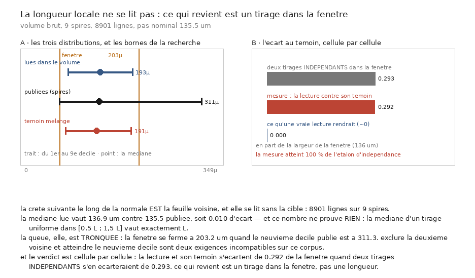

⚠⚠⚠ **Le nombre qui trompe est la médiane** : **136,9 µm lus contre 135,5 publiés**, un accord à
un centième. Il ne prouve **rien** — la médiane d'un tirage uniforme dans `[0,5 L ; 1,5 L]`
vaut exactement `L`. Et le témoin du gabarit mélangé rend **131,1**.

| | p10 | médiane | p90 |
|---|---:|---:|---:|
| lues dans le volume | 82,7 µm | **136,9** | 193,0 |
| publiées (spires) | 67,2 | **135,5** | **311,3** |
| témoin mélangé | 78,2 | 131,1 | 190,6 |

⛔ **La queue haute est TRONQUÉE, et par construction** : la fenêtre se ferme à **203,2 µm** quand
le neuvième décile publié est à **311,3**. Exclure la deuxième voisine et atteindre le neuvième
décile sont **deux exigences incompatibles** sur ce corpus — ce n'est pas un réglage à corriger,
c'est un fait sur la nappe : ses écarts varient trop pour qu'une fenêtre bien posée les couvre.

> ⛔⛔ **Et le verdict est cellule par cellule.** La lecture et son témoin s'écartent de **0,292**
> de la largeur de la fenêtre, quand deux tirages **indépendants** s'en écarteraient de
> **0,293** — la médiane de `|X − Y|` pour deux uniformes sur `W` vaut `W(1 − 1/√2)`, un étalon
> qui se **calcule** et ne se choisit pas. La mesure en atteint **99,7 %**. Ce qui revient n'est pas
> une longueur, c'est un tirage dans la fenêtre où on la cherche.

⭐⭐ **Et une seconde preuve, qui ne demande AUCUNE cible** : les grilles publiées partagent une
orientation — mesuré ailleurs, le sens retenu est le même pour les douze paires. Une lecture qui
porterait du signal choisirait donc le même sens partout. Elle en change : **trois spires sur neuf**
au sens minoritaire.

⚠⚠⚠ **Et le sens était CODÉ EN DUR derrière un commentaire qui prétendait le dériver.** Le code le
choisissait par le nombre de lignes lisibles — presque toujours égal des deux côtés — donc son
`max` retombait sur le premier sens essayé, et les neuf spires rendaient « + ». Corrigé par la
**force de la corrélation**, ce qui a changé les sens retenus *et* renforcé le verdict : l'écart au
témoin passe de 0,277 à **0,292** pour un étalon de 0,293.

⚠⚠ **Ma première version comparait à 0,15**, un nombre que j'avais posé — et il rendait le verdict
inverse. Le remplacer par une quantité dérivée a retourné la conclusion, ce qui est exactement ce
qu'un seuil choisi permet de ne jamais voir.

⚠⚠ **Et la comparaison des DÉCILES ne tranche rien** : la lecture et son témoin rendent les mêmes
trois quantiles à quelques micromètres près. Un verdict bâti dessus aurait été vrai
arithmétiquement et faux au sens qui compte ; le champ qui l'annonçait a été retiré du JSON, parce
que deux verdicts contradictoires dans un même fichier sont un piège.

⚠ Deux fixtures de ma batterie ne pouvaient pas discriminer, et pour deux raisons différentes.
La première avait des feuilles **régulièrement espacées** : la ligne entière est alors périodique,
donc n'importe quel motif y trouve la période et le gabarit mélangé rendait 59,9 pour une vraie
réponse de 60. La seconde était constante en `x` et en `y` : les vingt-quatre lignes étaient **la
même ligne**, donc le témoin avait un échantillon de **un**.

⚠⚠⚠ **Et le témoin du gabarit mélangé a une limite, mesurée plutôt qu'invoquée** : contre une
crête **isolée et très piquée**, il la retrouve quand même — une permutation garde la distribution
des valeurs du gabarit, et presque n'importe quel vecteur de cette distribution corrèle au maximum
sur la crête. Il discrimine sur la donnée réelle, bruitée et peu piquée ; il ne discrimine pas sur
une fixture propre. Le témoin qui tranche là est un volume **sans feuille dans la fenêtre** : les
longueurs lues s'y étalent sur **30,4** contre **0,7** avec une feuille.

> ⛔⛔⛔ **Cinq soupçons, cinq écartés.** La fenêtre, les décalages, le gabarit, les normales, et
> maintenant la longueur du pas. Le volume brut donne **un** gain, à un pas, depuis une surface
> déjà juste — et rien d'autre. ⭐ Ce qui reste n'est plus une variante de la même marche : c'est
> que **la marche elle-même part d'une seule spire et n'a que sa propre reconstruction pour se
> juger**. Les treize spires publiées offrent douze départs indépendants ; personne n'a encore
> mesuré si un dérouleur qui part de **plusieurs** endroits à la fois — et dont les branches
> doivent s'accorder là où elles se rencontrent — fait mieux qu'un seul qui part d'un bout.

#### ⭐⭐⭐ DEUX ANCRES VALENT BIEN MIEUX QU'UNE — espacées régulièrement, et PONDÉRÉES

> Mesure : `src/nappe/derouler_des_deux_bords.py` (32 contrôles) →
> `docs/mesures/derouler_des_deux_bords.json`. Figure :
> `src/figures/figure_derouler_des_deux_bords.py` (19 contrôles), le 2026-09-06.
>
> ```
> uv run python src/nappe/derouler_des_deux_bords.py --cote 640 --json docs/mesures/derouler_des_deux_bords.json
> uv run python src/figures/figure_derouler_des_deux_bords.py --sortie docs/images/75_derouler_des_deux_bords.png
> ```

Cinq soupçons écartés portaient tous sur **la même marche** : une qui part d'une seule spire et
n'a que sa propre reconstruction pour se juger. Celle-ci change la **structure** : la spire `m` est
reconstruite depuis une ancre `a < m` **et** une ancre `b > m`.

⭐⭐ **Et là, pour la première fois, deux reconstructions se rencontrent.** Des spires concentriques
ne se croisent jamais, donc « plusieurs départs » ne veut rien dire tant qu'on marche tous dans le
même sens ; **encadrer**, si. **56 encadrements** mesurés, portée 4, dont 14 symétriques.

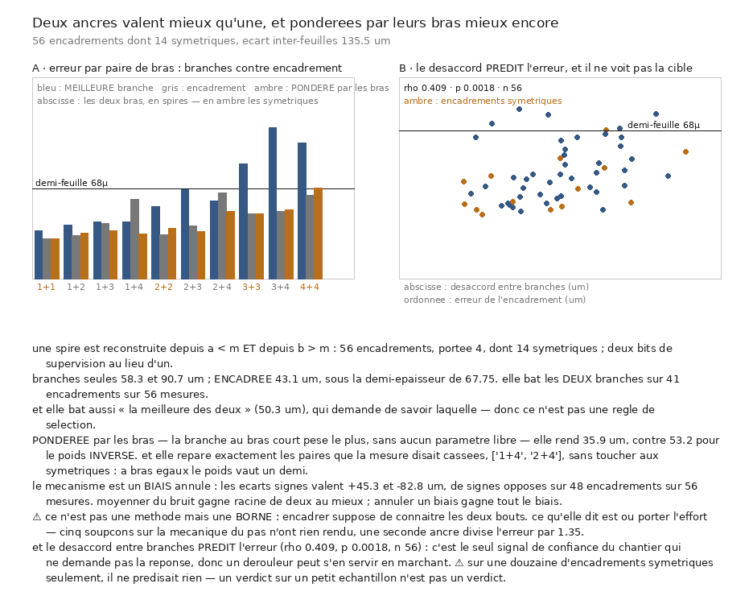

| | erreur médiane |
|---|---:|
| branche montante seule | 58,3 µm |
| branche descendante seule | 90,7 µm |
| « la meilleure des deux » *(demande de savoir laquelle)* | 50,3 µm |
| **encadrée** | **43,1 µm** |

> ⭐⭐⭐ **L'encadrement bat les DEUX branches sur 41 encadrements sur 56**, et sa médiane est
> **sous la demi-épaisseur** (67,75 µm) : la feuille est tenue. ⚠⚠ Battre la plus mauvaise serait
> gratuit — « prendre la meilleure » y suffirait, et savoir laquelle demande la réponse. Il bat
> aussi celle-là.

##### ⭐⭐ Où poser la seconde ancre : régulièrement

| bras | cas | encadrée | meilleure branche | |
|---|---:|---:|---:|---|
| 1+1 | 5 | **30,1 µm** | 36,1 | symétrique |
| 1+2 | 10 | 32,7 | 40,0 | |
| 1+3 | 9 | 41,3 | 42,7 | |
| **1+4** | 7 | **59,9** | 42,7 | ⛔ **nuit** |
| 2+2 | 4 | **33,2** | 54,5 | symétrique |
| 2+3 | 7 | 39,4 | 66,8 | |
| **2+4** | 5 | **64,6** | 58,3 | ⛔ **nuit** |
| 3+3 | 3 | 48,6 | 86,2 | symétrique |
| 3+4 | 4 | 50,4 | **113,8** | |
| 4+4 | 2 | 62,6 | 102,3 | symétrique |

> ⭐⭐ **À somme de bras égale — donc à même écartement d'ancres — la symétrie gagne** : `2+2`
> rend **33,2 µm** contre **41,3** pour `1+3`, et `3+3` rend **48,6** contre **64,6** pour `2+4`.
> C'est une réponse pratique à « où poser la seconde ancre » : **espacer régulièrement**, pas
> grouper.

⛔ **Et il y a une limite : un encadrement trop déséquilibré NUIT.** Sur `1+4` et `2+4`,
l'encadrement rend **pire** que sa meilleure branche — la branche lointaine a tellement dérivé que
la moyenne tire la bonne avec elle. ⚠⚠ **Le chiffre qui serait trompeur n'est pas publié** : le
déséquilibre minimal des paires fautives vaut deux, mais `1+3` a exactement ce déséquilibre et ne
nuit pas. Ce que les deux fautives partagent est leur **bras long**, et il vaut la portée mesurée —
donc ce corpus ne dit **pas** si c'est la longueur absolue ou le déséquilibre qui casse. Les deux
faits sont rendus, la conclusion non.

##### ⭐⭐⭐ Et PONDÉRER les deux branches par leurs bras répare exactement ce qui était cassé

Le désaccord entre branches est **symétrique** — c'est le même nombre pour les deux — donc il ne
peut pas dire laquelle croire. Ce qui les distingue **sans regarder la réponse** est la longueur de
leur bras, et la mesure a établi que l'erreur croît avec elle. Si elle croît **linéairement**,
l'estimateur qui annule deux erreurs de signes opposés est l'**interpolation linéaire entre les
deux ancres** : la branche au bras court pèse `bras_long / (somme)`. ⭐ **Aucun paramètre libre.**

| | erreur médiane |
|---|---:|
| encadrée à parts égales | 43,1 µm |
| **pondérée par les bras** | **35,9 µm** |
| témoin : poids **inversé** | 53,2 µm |

> ⭐⭐⭐ **Et elle répare EXACTEMENT les deux paires que la mesure avait dites cassées** — `1+4` et
> `2+4` — **sans toucher aux symétriques**, parce qu'à bras égaux le poids vaut un demi et rend le
> milieu. Un remède qui ne peut pas abîmer les cas qui marchaient n'a pas besoin qu'on le vérifie
> sur eux ; celui-ci ne le peut pas **par construction**.

⚠⚠ Les quatre verdicts sont exigés **ensemble** : elle bat le milieu, elle bat son témoin de poids
inversé, elle laisse les symétriques intacts, et elle répare **toutes** les paires cassées. Sans le
dernier, « ça améliore la médiane » pourrait vouloir dire qu'elle a déplacé des cas déjà sains.

⚠ L'hypothèse dont le poids est tiré — l'erreur croît linéairement avec le bras — est **vérifiée
dans la batterie** plutôt que supposée : sur deux branches dont les dérives valent `d` et `4d` de
part et d'autre, l'interpolation les annule exactement, la moyenne à parts égales non, et le poids
inversé fait bien pire.

##### ⭐⭐ Le mécanisme est mesuré : c'est un BIAIS qui s'annule, pas du bruit qu'on moyenne

Une distance est toujours positive, donc deux branches qui se trompent en sens contraires ont
exactement le même profil d'erreur qu'une qui se trompe deux fois dans le même sens. Le **signe**
les sépare, et il est mesuré en projetant l'écart de chaque branche sur la direction de marche de
la montante : **+45,3 µm** contre **−82,8 µm**, de **signes opposés sur 48 encadrements sur 56**.

> ⭐ Moyenner du bruit gagne √2 au mieux ; annuler un biais gagne **tout le biais**. Les deux
> mécanismes rendent la même médiane et ne promettent pas du tout la même chose ailleurs.

⚠ Le contrôle qui rend ça vérifiable est dans la batterie : **deux branches du MÊME côté** de la
cible ont un milieu qui reste du même côté, donc pas meilleur que la plus proche.

##### ⭐⭐⭐ Et le désaccord entre branches PRÉDIT l'erreur — le premier signal sans cible qui sert

Le désaccord entre les deux branches (162,5 µm médian) est la **seule** mesure de tout le chantier
qui ne demande pas la réponse : un dérouleur pourrait la calculer **en marchant**. Elle prédit
l'erreur de l'encadrement — **ρ = 0,409, p = 0,0018 sur 56**.

⚠⚠⚠ **Et ce verdict s'est INVERSÉ avec l'échantillon, dans le bon sens.** Sur les douze
encadrements **symétriques** seuls, il ne prédisait rien (ρ = 0,28, p = 0,38) et la première
version de cette section l'écrivait comme un échec. Élargir aux 56 encadrements — symétriques et
non — le rend significatif. C'est la même leçon que la boîte, dans l'autre sens : **un verdict sur
un petit échantillon n'est pas un verdict**, qu'il soit positif ou négatif.

⚠⚠ **CE QUE CETTE MESURE EST, ET CE QU'ELLE N'EST PAS.** Un vrai dérouleur n'a qu'une ancre :
encadrer suppose de connaître les deux bouts et coûte **deux** bits de supervision au lieu d'un.
Ce n'est donc pas une méthode, c'est une **borne**. Mais elle répond à la question qui décide de
l'effort : cinq soupçons sur la mécanique du pas n'ont rien rendu, et une **seconde ancre** divise
l'erreur par **1,35**, avec un gain qui se creuse jusqu'à **×2,3** au bras 3+4.

⚠ Aucune lecture du volume dans cette tranche : le pas aveugle est le meilleur dérouleur mesuré et
il ne lit rien. ⚠ Chaque branche marche le nombre de tours de **son** bras — avec des encadrements
asymétriques les deux n'en font plus autant, et un compte commun ferait marcher l'une trop loin.
⚠ L'appariement des deux nuages se fait dans l'**espace**, par plus proche voisin : les deux
branches viennent de deux spires publiées, donc de deux paramétrages, et les moyenner cellule à
cellule apparierait des points sans rapport.

⚠ Deux défauts de ma prose de figure, tous deux attrapés par ses propres contrôles : elle
**calculait** un rapport absent du JSON — une figure ne doit pas inventer de nombre, donc le
rapport est publié dans la mesure — et elle portait une **étoile** que la police ne rend pas, qui
serait sortie en carré vide.

> ⭐⭐⭐ **Ce que cette tranche laisse à la suivante.** Le corpus publie **treize** spires, donc
> douze ancres, et la mesure dit qu'elles valent bien plus qu'un meilleur pas — mais aussi qu'un
> bras de quatre est déjà trop long. La question suivante est donc **ce qui se passe entre
> ancres** : le désaccord prédit l'erreur, faiblement (ρ = 0,41) ; s'en servir pour **pondérer**
> les deux branches au lieu de les moyenner à parts égales est le geste que cette mesure rend
> possible, et il ne demande toujours aucune cible.

#### ⛔⭐⭐⭐ LA TROISIÈME ANCRE NE PAIE PAS — et la piste des ancres est refermée

> Mesure : `src/nappe/combien_dancres.py` (38 contrôles) → `docs/mesures/combien_dancres.json`.
> Figure : `src/figures/figure_combien_dancres.py` (18 contrôles), le 2026-09-06.
>
> ```
> uv run python src/nappe/combien_dancres.py --cote 640 --portee 4 --kmax 4 \
>     --json docs/mesures/combien_dancres.json
> uv run python src/figures/figure_combien_dancres.py --sortie docs/images/75_combien_dancres.png
> ```

La tranche précédente avait ouvert **une** piste et une seule : *« ce n'est pas une méthode,
c'est une borne — elle dit si l'effort doit aller vers une meilleure propagation ou vers PLUS
D'ANCRES »*. Cette tranche la referme. **431 jeux d'ancres sur 9 cibles**, même boîte (640) et
même portée (4) que l'étude qu'elle prolonge, donc les chiffres se comparent.

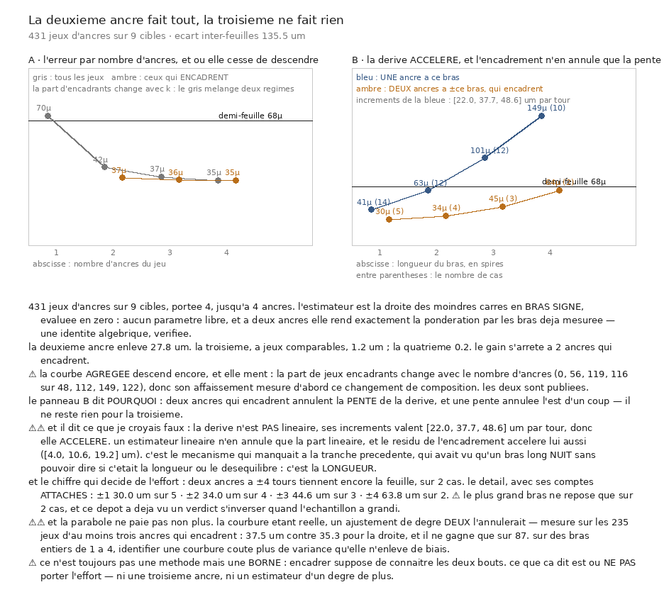

##### L'estimateur, et pourquoi il n'a aucun paramètre libre

Si l'erreur d'une ancre croît linéairement avec son bras, la prédiction de l'ancre $i$ vaut
$p_i \simeq p + \beta s_i$ où $s_i$ est son bras **signé**. Ce qui annule $\beta$ est la droite
des moindres carrés en $s$, évaluée en $s = 0$.

> ⭐⭐ **À deux ancres de signes opposés, elle rend EXACTEMENT la pondération par les bras déjà
> mesurée.** Pour $s = (-a, +b)$ on obtient $w = (b, a)/(a+b)$ : ce n'est pas une ressemblance de
> forme, c'est une **identité algébrique**, et la batterie la vérifie sur six paires de bras.
> La généralisation ne remplace pas le résultat précédent, elle le **contient**.

⚠⚠ **Les poids ne dépendent que des bras, jamais des données** — l'ordonnée à l'origine d'une
régression s'écrit $\sum_i w_i p_i$ avec des $w_i$ qui ne contiennent que les $s_i$. Aucun bit de
la cible n'entre donc dans la combinaison : un dérouleur pourrait l'appliquer sans jamais regarder
où il doit arriver.

##### ⛔ Le verdict : le gain s'arrête à DEUX ancres qui encadrent

| ancres | jeux | ajusté | *dont ceux qui encadrent* |
|---|---:|---:|---:|
| 1 | 48 | 70,3 µm | — |
| 2 | 112 | 42,5 µm | **36,7 µm** *(56 jeux)* |
| 3 | 149 | 37,2 µm | **35,5 µm** *(119)* |
| 4 | 122 | 35,3 µm | **35,3 µm** *(116)* |

⚠ Le contendant sans information de bras — la **moyenne plate** des mêmes nuages — rend 53,3 /
45,7 / 38,4 µm : l'ajustement le bat en médiane à tous les nombres d'ancres, mais **jeu par jeu**
seulement 191 fois sur 291 chez les encadrants. Il gagne **gros** quand il gagne et perd **petit**
quand il perd, et un seul compte agrégé laisserait croire à un ex æquo.

> ⛔⭐⭐ **La deuxième ancre enlève 27,8 µm. La troisième, à jeux comparables, en enlève 1,2 ; la
> quatrième, 0,2.** Le problème n'est **pas** le nombre d'ancres — cette piste est refermée.

⚠⚠ **UN CHIFFRE PUBLIÉ SUR UNE POPULATION CONFONDUE, CORRIGÉ.** J'avais d'abord calculé la
saturation sur la courbe **agrégée**, qui descend encore — et elle ment : la part de jeux qui
encadrent passe de **0 à 50, 80 puis 95 %** avec le nombre d'ancres, donc son affaissement mesure
d'abord ce **changement de composition**. Les deux courbes sont publiées, la seconde est celle qui
tranche.

##### ⛔ Le panneau B a porté une affirmation RETIRÉE le jour même

| bras | 1 | 2 | 3 | 4 |
|---|---:|---:|---:|---:|
| **une** ancre | 41,1 µm | 63,1 | 100,8 | **149,4** |
| incréments *depuis le bras zéro* | **+41,1** | +22,0 | +37,7 | +48,6 |
| coût **par tour** | 41,1 | 31,6 | 33,6 | 37,4 |
| **deux** ancres à ±ce bras | 30,0 µm | 34,0 | 44,6 | **63,8** |
| coût **par tour** | 30,0 | 17,0 | 14,9 | 16,0 |

> ⛔⚠⚠ **J'avais publié « la dérive ACCÉLÈRE », et c'était faux.** Le critère employé — *« les
> incréments consécutifs croissent »* — **omettait le plus grand incrément de tous** : celui du
> bras zéro, dont l'erreur est nulle **par définition**, au bras un. La suite complète est
> **41,1 puis 22,0 / 37,7 / 48,6** : le premier pas est le plus cher, et il n'y a pas de tendance
> après lui. Retiré par `pourquoi_la_derive_accelere` le même jour, section suivante.

⭐⭐ **Ce qui est vrai et reproduit sur deux populations** : l'erreur au bras `k` reste **SOUS**
`k` fois celle du bras un, et le **coût par tour est stable** — 31,6 / 33,6 / 37,4 µm ici, 31,4 /
34,5 / 33,5 sur l'autre population. La dérive est donc à peu près **linéaire** avec un premier pas
plus cher. C'est exactement la prémisse dont l'estimateur a besoin — et c'est **pourquoi la
parabole ne trouve rien à annuler**, ce qui rend l'ensemble cohérent au lieu de contradictoire.

⚠ **Et l'explication que j'avais donnée à `1+4` et `2+4` qui nuisent tombe avec elle.** Ce n'est
pas la courbure. L'encadrement divise le coût par tour par deux (17 contre 33 µm), donc la pente
est bien annulée ; ce qu'un bras de quatre injecte est la **variance** de sa branche — 149 µm
d'erreur, même à 20 % de poids, font ±30 µm de bruit. La question *« longueur ou déséquilibre »*
reste donc **ouverte**, et la retirer d'ici est plus honnête que la laisser répondue à tort.

##### Ce que ça donne comme consigne

> ⭐⭐ **Deux ancres à ±2 tours tiennent la feuille à 34,0 µm** (4 cas), la moitié de la
> demi-épaisseur. À ±4, encore **63,8 µm** — sous les 67,75 —, mais sur **2 cas** seulement, et ce
> dépôt a déjà vu un verdict s'inverser quand l'échantillon a grandi.

⚠ Une différence de méthode avec la tranche précédente, qui explique l'écart entre **36,7** et
**35,9 µm** sur ce qui est presque la même chose : là-bas la combinaison était faite **dans les
deux sens** et les distances mises en commun ; ici le nuage de référence est celui de l'ancre la
plus basse. Deux populations de points, deux médianes voisines — et le dire vaut mieux que
laisser croire à une contradiction.

##### ⛔ Et la parabole ne paie pas non plus — mesurée avant d'être écrite comme une piste

La courbure étant réelle, l'estimateur qui l'annulerait n'est plus une droite mais une
**parabole** — ce qui demande **trois** ancres pour être identifiée, et redonnerait donc un rôle à
la troisième : non plus moyenner, mais **mesurer la courbure**. J'allais l'écrire comme la seule
lecture qui ouvre quelque chose. Elle est mesurée à la place.

> ⛔ **Sur les 235 jeux d'au moins trois ancres qui encadrent — les MÊMES jeux, pas deux
> populations — le degré deux rend 37,5 µm contre 35,3 pour la droite, et il ne gagne que sur 87.**
> Sur des bras entiers de 1 à 4, identifier une courbure coûte plus de **variance** qu'elle
> n'enlève de **biais**.

⚠ Ce que ce négatif dit exactement, et pas plus : la courbure est réelle et mesurée, mais elle
n'est pas **estimable** depuis trois ou quatre bras entiers. Un corpus qui offrirait des bras plus
fins, ou plus nombreux, poserait la question autrement — et ce n'est pas ce corpus.

> ⭐⭐⭐ **Ce que cette tranche laisse à la suivante, et c'est un inventaire de portes fermées.**
> Le bilan des cinq soupçons avait laissé **deux** pistes : une meilleure propagation du pas, ou
> plus d'ancres. La première était déjà close (cinq soupçons éliminés). Cette tranche ferme la
> seconde — la troisième ancre ne paie pas — **et** la troisième piste que la mesure elle-même
> avait suggérée, l'estimateur d'un degré de plus. Ce qui reste debout est le fait, pas le
> remède : **la dérive accélère avec le bras**, et deux ancres qui encadrent en annulent la pente.
> Toute suite qui prétend faire mieux devra s'attaquer à ce qui produit cette accélération, pas à
> la façon de la combiner après coup.

#### ⭐⭐ L'ITÉRATION NE PAIE QUE DE LA NAPPE — un seul grand pas fait aussi bien

> Mesure : `src/nappe/pourquoi_la_derive_accelere.py` (24 contrôles) →
> `docs/mesures/pourquoi_la_derive_accelere.json`. Figure :
> `src/figures/figure_pourquoi_la_derive_accelere.py` (15 contrôles), le 2026-09-06.
>
> ```
> uv run python src/nappe/pourquoi_la_derive_accelere.py --cote 640 --bras-max 4 \
>     --json docs/mesures/pourquoi_la_derive_accelere.json
> uv run python src/figures/figure_pourquoi_la_derive_accelere.py \
>     --sortie docs/images/75_pourquoi_la_derive_accelere.png
> ```

Cette tranche devait écarter deux artefacts qui auraient pu **fabriquer** l'accélération publiée
juste avant. Elle en a trouvé un troisième, et il était dans le critère lui-même.

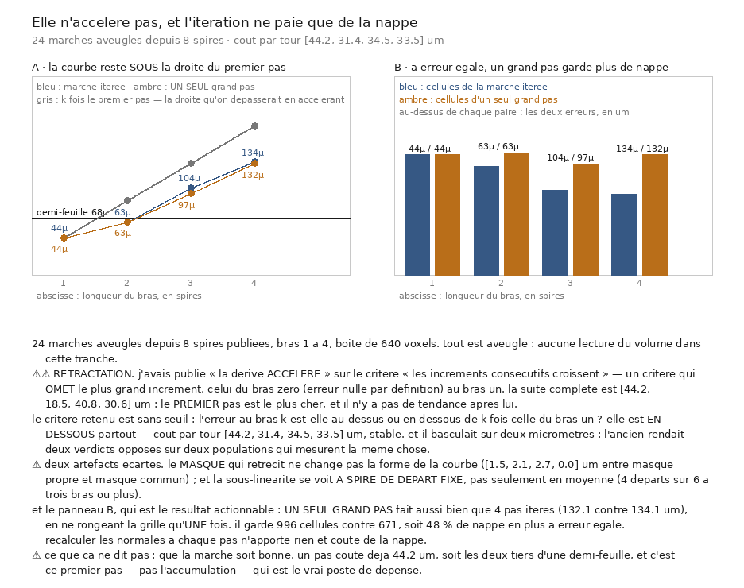

##### Les deux artefacts, écartés

| suspect | mesure | verdict |
|---|---|---|
| le **masque** qui rétrécit (996 → 671 cellules) | erreur sur le sous-ensemble commun à tous les bras | ⛔ **il n'y est pour rien** — 1,5 / 2,1 / 2,7 / 0,0 µm d'écart |
| la **spire de départ**, différente à chaque bras | la forme de la courbe à départ **fixe** | ✅ elle tient — 4 départs sur 6 à trois bras ou plus |

##### ⛔ Le troisième était le critère

> ⛔⚠⚠ **« Les incréments consécutifs croissent » omet le plus grand incrément de tous** : celui
> du bras **zéro**, dont l'erreur est nulle par définition, au bras un. Et il bascule sur deux
> micromètres — il rend **OUI** sur une population et **NON** sur l'autre, alors que les deux
> mesurent la même chose.

Le critère retenu est **sans seuil** et il a un sens : *l'erreur au bras `k` est-elle au-dessus ou
en dessous de `k` fois celle du bras un ?* Elle est **en dessous partout**, et le coût par tour
est **stable** : 44,2 puis 31,4 / 34,5 / 33,5 µm. Il vit dans un seul endroit, `sous_lineaire`,
et `combien_dancres` l'**importe** — deux implémentations d'une même règle finiraient par rendre
deux verdicts, ce qui est exactement ce que le critère précédent a fait.

##### ⭐⭐ Et le résultat actionnable : l'itération ne sert à rien

La marche libre de `k` pas est comparée à **un seul pas de longueur `k` fois le pas**, pris le
long des normales de la surface de départ. Les deux vont au même endroit et ne diffèrent que par
une chose : la seconde ne recalcule **jamais** ses normales, donc elle ne peut pas dégrader sa
propre surface — ni ronger la grille plus d'une fois.

| bras | marche itérée | un seul grand pas | cellules gardées |
|---|---:|---:|---:|
| 1 | 44,2 µm | 44,2 µm | 996 contre 996 |
| 2 | 62,7 | 62,8 | 996 contre 896 |
| 3 | 103,5 | **96,6** | 996 contre 698 |
| 4 | 134,1 | **132,1** | **996 contre 671** |

> ⭐⭐ **À erreur égale, un seul grand pas rend 48 % de nappe en plus au bras 4.** Recalculer les
> normales à chaque tour n'apporte **rien** — la marche libre n'est meilleure que sur 8 marches
> sur 24 — et coûte un anneau de cellules par tour. Le dérouleur itéré peut donc être remplacé
> par un pas unique, plus simple et qui rend plus de surface.

⚠ Ce que ça ne dit **pas** : que la marche soit bonne. **Un seul pas coûte déjà 44,2 µm**, soit
les deux tiers d'une demi-feuille — et c'est ce premier pas, pas l'accumulation, qui est le vrai
poste de dépense.

> ⭐⭐⭐ **Ce que cette tranche laisse à la suivante.** Le tableau des pistes est enfin cohérent :
> la dérive est **linéaire à ~33 µm par tour** avec un **premier pas à 44**, l'estimateur linéaire
> est donc le bon (d'où l'échec de la parabole), l'encadrement divise ce coût par deux (d'où son
> gain), et une troisième ancre n'a rien de plus à annuler (d'où son inutilité). Le seul poste qui
> reste est **le premier pas** : 44 µm pour un tour, là où l'accumulation n'en coûte que 33. C'est
> lui qu'il faut attaquer, et c'est une question sur **un** pas — donc mesurable sans marcher.

#### ⭐⭐⭐ LE TIERS DU COÛT D'UN PAS EST UNE LONGUEUR PRISE SUR LA MAUVAISE POPULATION

> Mesure : `src/nappe/le_cout_dun_seul_pas.py` (25 contrôles) →
> `docs/mesures/le_cout_dun_seul_pas.json`. Figure : `src/figures/figure_le_cout_dun_seul_pas.py`
> (18 contrôles), le 2026-09-06.
>
> ```
> uv run python src/nappe/le_cout_dun_seul_pas.py --cote 640 \
>     --json docs/mesures/le_cout_dun_seul_pas.json
> uv run python src/figures/figure_le_cout_dun_seul_pas.py \
>     --sortie docs/images/75_le_cout_dun_seul_pas.png
> ```

La tranche précédente avait laissé **un seul poste** : le premier pas coûte 42,7 µm là où
l'accumulation n'en coûte que 33 par tour. C'est une question sur **un** pas, donc mesurable sans
jamais marcher.

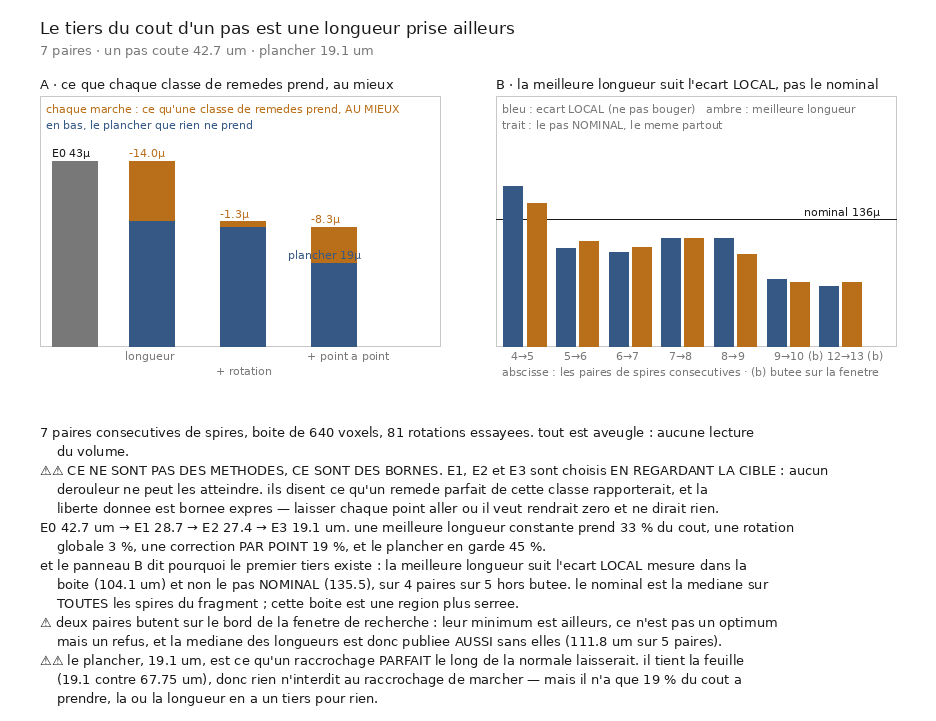

##### La décomposition est une hiérarchie de LIBERTÉS

Chaque niveau donne à la marche **un paramètre de plus**, et l'écart entre deux niveaux est
exactement ce qu'une classe de remèdes rapporterait **au mieux**.

| niveau | ce qu'on donne | erreur | ce que l'écart mesure |
|---|---|---:|---|
| `E0` | rien — pas nominal, normales calculées | 42,7 µm | *(le départ)* |
| `E1` | **une** longueur, la meilleure | 28,7 | **14,0 µm — 33 %** |
| `E2` | plus **une** rotation globale | 27,4 | 1,3 µm — 3 % |
| `E3` | une longueur **par point**, le long de sa normale | 19,1 | 8,3 µm — 19 % |
| — | *le plancher, que rien ne prend* | **19,1** | 45 % |

> ⚠⚠⚠ **CE NE SONT PAS DES MÉTHODES, CE SONT DES BORNES.** `E1`, `E2` et `E3` sont choisis **en
> regardant la cible** : aucun dérouleur ne peut les atteindre. Et la liberté donnée est bornée
> **exprès** — laisser chaque point aller où il veut rendrait zéro et ne dirait rien.

⚠⚠ **Un défaut de conception attrapé par une sonde.** Ma première version mesurait `E3` le long de
la normale **de départ**, donc elle ne contenait pas la liberté de `E2` : les niveaux n'étaient pas
emboîtés, et une paire avait `E2` **meilleur** que `E3`. Une décomposition dont les niveaux ne
s'emboîtent pas ne décompose rien — ses écarts cessent de nommer une classe de remèdes. `E3` se
mesure désormais sur la normale **tournée**. ⚠ Et le contrôle « les quatre parts se somment à un »
**ne pouvait pas échouer** : la somme télescope par construction, et elle était verte sur la
version cassée, avec une part négative. Ce qui se vérifie est que chaque part soit **positive**.

##### ⭐⭐⭐ Et pourquoi le premier tiers existe : le pas nominal vient d'ailleurs

| paire | 4→5 | 5→6 | 6→7 | 7→8 | 8→9 | 9→10 | 12→13 |
|---|---:|---:|---:|---:|---:|---:|---:|
| écart **local** *(ne pas bouger)* | 171,0 | 104,1 | 100,3 | 115,4 | 114,5 | 70,9 | 63,9 |
| meilleure **longueur** | 152,4 | 111,8 | 105,0 | 115,2 | 98,2 | ⛔ 67,8 | ⛔ 63,9 |

> ⭐⭐⭐ **L'écart inter-feuilles mesuré DANS LA BOÎTE vaut 104,1 µm, pas les 135,5 µm du pas
> nominal.** Le nominal est la médiane sur **toutes** les spires du fragment ; la boîte où toute
> cette campagne mesure est une région plus serrée. La meilleure longueur suit l'écart **local**
> plutôt que le nominal sur **4 paires sur 5** hors butée. Ce tiers du coût n'est donc pas un
> réglage à trouver, **c'est un nombre à mesurer**.

⚠ **Deux paires butent sur le bord de la fenêtre de recherche** : leur minimum est ailleurs, ce
n'est pas un optimum mais un **refus**, et la médiane des longueurs est publiée **aussi** sans
elles — 111,8 µm sur 5 paires.

⚠⚠ **Une comparaison à seuil, retirée.** J'avais d'abord exigé que la meilleure longueur **égale**
l'écart local à deux pas de balayage près (3,4 µm) — un seuil qui demande plus de précision que la
médiane d'un nuage n'en a, et qui rendait **NON** pour 7,7 µm sur 110. La question qui se pose
vraiment est comparative et **sans seuil** : la meilleure longueur ressemble-t-elle plus à l'écart
local qu'au nominal ? Oui, 4 fois sur 5.

##### Ce que les autres niveaux disent

⛔ **La rotation globale ne prend rien** — 1,3 µm sur 42,7, soit 3 %. Il n'y a pas de biais
systématique de direction à corriger, et cette piste est fermée avant d'avoir été ouverte.

⭐ **Le plancher tient la feuille** : 19,1 µm contre 67,75. Un raccrochage **parfait** le long de
la normale laisserait donc largement de quoi tenir — rien n'interdit au raccrochage de marcher. Mais
il n'a que **19 %** du coût à prendre, là où la longueur en a **33 %** pour rien.

> ⭐⭐⭐ **Ce que cette tranche laisse à la suivante, et c'est enfin une piste positive.** Un
> dérouleur réel ne connaît pas l'écart local — c'est justement ce qu'il cherche. Mais il connaît
> l'écart entre les spires qu'il a **déjà**, et la question devient : *l'écart local se prédit-il
> depuis les précédents ?* Douze paires consécutives sont publiées, donc la corrélation entre
> l'écart d'une paire et celui de la suivante se mesure **tout de suite et sans rien lire**. Si
> elle existe, le tiers du coût est récupérable sans regarder la cible.

#### ⛔ L'ÉCART DÉJÀ FRANCHI NE DIT PRESQUE RIEN DU SUIVANT — la dernière piste, fermée

> Mesure : `src/nappe/lecart_deja_franchi.py` (16 contrôles) →
> `docs/mesures/lecart_deja_franchi.json`. Figure : `src/figures/figure_lecart_deja_franchi.py`
> (16 contrôles), le 2026-09-06.
>
> ```
> uv run python src/nappe/lecart_deja_franchi.py --cote 640 \
>     --json docs/mesures/lecart_deja_franchi.json
> uv run python src/figures/figure_lecart_deja_franchi.py \
>     --sortie docs/images/75_lecart_deja_franchi.png
> ```

Un tiers du coût d'un pas vient d'une longueur prise sur la mauvaise population, et un dérouleur
ne peut pas mesurer l'écart qu'il n'a **pas encore** franchi. Il peut mesurer celui qu'il **vient
de** franchir : un dérouleur parti d'une paire d'ancres `r − 1` et `r` connaît, en chaque point,
la distance entre ces deux surfaces. C'était la seule piste positive qui restait, et elle est
mesurée sur **5 triplets, 5163 cellules**.

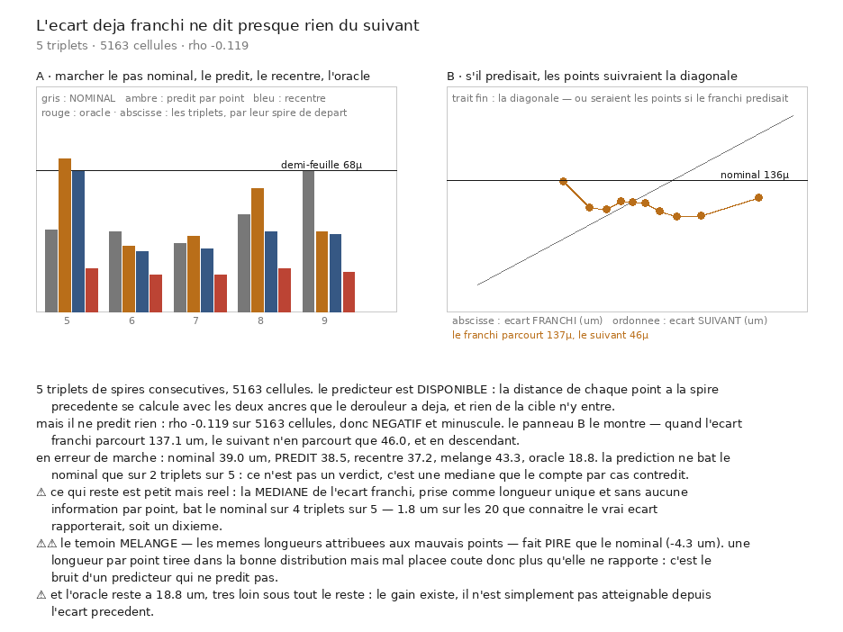

##### ⛔ Il ne prédit pas, et ce qu'il prédit va dans le mauvais sens

| | | | | | | | | | |
|---|---:|---:|---:|---:|---:|---:|---:|---:|---:|
| écart **franchi** *(décile)* | 60 | 78 | 90 | 100 | 109 | 118 | 128 | 140 | 197 |
| écart **suivant** *(médiane)* | 135 | 101 | 98 | 108 | 108 | 106 | 96 | 89 | 113 |

> ⛔ **Quand l'écart franchi parcourt 137 µm, le suivant n'en parcourt que 46 — et en
> descendant.** ρ = **−0,119** sur 5163 cellules (p = 9·10⁻¹⁸) : négatif, significatif seulement
> parce que l'échantillon est grand, et minuscule. Si le premier prédisait le second, les points
> suivraient la diagonale du panneau B ; ils sont plats.

##### En erreur de marche, les quatre contendants

| | erreur médiane | bat le nominal sur |
|---|---:|---|
| pas **nominal** | 39,0 µm | *(la référence)* |
| **prédit** par point | 38,5 | **2 triplets sur 5** |
| **recentré** *(la médiane du franchi)* | **37,2** | **4 triplets sur 5** |
| témoin **mélangé** | 43,3 | 0 — il fait **pire** |
| *oracle (demande la réponse)* | *18,8* | — |

⚠⚠ **Un verdict sur la médiane que le compte par cas contredit n'est pas un verdict**, et c'est
une correction : la première version rendait « la prédiction bat le nominal : **OUI** » sur un
écart de **0,5 µm** alors qu'elle ne gagnait que sur deux triplets sur cinq. Les deux conditions
sont désormais exigées ensemble.

⚠⚠ **Le témoin mélangé fait PIRE que le nominal** (−4,3 µm). Une longueur par point tirée dans la
bonne distribution mais attribuée au mauvais point coûte donc plus qu'elle ne rapporte : c'est le
bruit d'un prédicteur qui ne prédit pas.

⚠ **Une part à dénominateur négligeable, retirée.** La première version publiait « la part
vraiment locale est **9,6** » — un rapport supérieur à un, qui n'a aucun sens comme part, parce
qu'il divisait par un gain de 0,5 µm. Aucune part n'est publiée quand son dénominateur est plus
petit que la marge de la mesure.

##### ⭐ Ce qui reste, petit mais réel

> ⭐ **Le RECENTRAGE seul** — la médiane de l'écart franchi, prise comme longueur unique et sans
> aucune information par point — bat le nominal sur **4 triplets sur 5**, pour **1,8 µm** des
> **20,2** que connaître le vrai écart rapporterait. Un dixième, gratuit et sans regarder la
> cible.

##### ⚠⚠⚠ Et un contrôle du dépôt qui était en retard par construction

Le `⛔` de la première version de cette figure est sorti en **carré vide**, et le contrôle de
traçabilité l'a laissé passer : `GLYPHES_ABSENTS` est une **liste écrite à la main**, donc en
retard sur tout caractère que personne n'y a ajouté.

> ⭐⭐ **La question est désormais posée à la POLICE.** Un caractère absent rend toujours le même
> dessin, celui du glyphe de secours : il suffit de comparer chaque caractère à un point de code
> de la zone à **usage privé**, où aucune police générale ne met de dessin. La liste ne sert plus
> que de **sonde** — elle vérifie que la question rend au moins les réponses déjà connues.

⚠ Et sa docstring **affirmait** écrire ces caractères en séquences d'échappement alors que le
fichier les portait **en clair** : un commentaire qui dit l'inverse de son code. Corrigé, et
vérifié par un contrôle sur la ligne de la constante — ⚠ resserré après une première version qui
les interdisait dans **tout** le fichier, où `✅` et `❌` servent légitimement à l'affichage du
terminal. Un contrôle trop large refuse du travail correct.

> ⭐⭐⭐ **Ce que cette tranche laisse à la suivante.** Les trois postes du coût d'un pas sont
> maintenant chiffrés et leurs remèdes évalués : la **longueur** vaut 33 % et n'est récupérable
> qu'à un dixième depuis ce qu'un dérouleur possède ; la **direction** vaut 3 % ; le **point à
> point** vaut 19 % et c'est le domaine du raccrochage, dont le plancher (19,1 µm) tient
> largement la feuille. Le seul poste qui garde une marge inexpliquée est donc celui-là — et la
> question devient : **pourquoi le raccrochage mesuré n'en prend-il rien**, alors que sa borne
> parfaite en prendrait 19 % ?

### C2 ⭐ — le nul verso (H7)

Un rendu décalé par segment, sur les mêmes couches et sur trois segments `w` de `0139`. C'est
le nul **propre** — parallèle à une face, sans arête de feuille — que `46` n'est pas.

⚠ **Plus urgent depuis `46`, pas moins** : le détecteur y rend *plus* de dispersion sur la
surface sans face que sur une face. Tant qu'on ne sait pas ce qu'il rend sur une face
**vierge**, « l'encre valide le déroulage » n'est pas utilisable.

### ✅✅ C2 — le nul verso : MESURÉ sur TROIS segments le 2026-09-05, et le résultat s'est INVERSÉ en cours de route

> Mesure : `src/encre/le_nul_verso.py` (20 contrôles par segment + 5 contrôles joints),
> `docs/mesures/le_nul_verso_*.json`. Figure : `src/figures/figure_le_nul_verso.py` (15 contrôles).
>
> ```
> uv run python src/encre/le_nul_verso.py --tous          # les trois segments, l'un après l'autre
> uv run python src/encre/le_nul_verso.py --verifier       # la batterie, sur tout ce qui est mesuré
> uv run python src/figures/figure_le_nul_verso.py --tous --sortie docs/images/75_le_nul_verso.png
> ```

⭐⭐⭐ **Aucun rendu n'était nécessaire.** Les `layers-zarr` publiés de `PHerc0139` font
**109 couches** (`shape [109, 23280, 32160]`) là où le détecteur n'en lit que **26**. Décaler
`--start-layer` donne donc le nul dans **la même pile** : même volume, même segment, même région,
même modèle, même pas — un seul paramètre bouge, ce qui est la conception appariée que `46`
réclame.

### ⚠⚠⚠ La première campagne était FAUSSE, et sa cause était écrite dans le module qu'elle appelait

Elle plaçait sa fenêtre « face » sur le pic de **contraste local**. Or `depth_profile.py` dit
lui-même que *« sur un volume à 2,4 µm le contraste devient un U — maximal aux DEUX bords,
minimal dans la feuille — parce qu'il suit les interfaces et le bruit, pas la matière »*, et le
§10 de [`12`](12_profondeur_de_surface.md) porte cette correction depuis le 2026-08-18.

Mesuré : sur `w058` et `w056` le contraste pique aux couches **0** et **104** d'une pile de 109,
**avec son minimum au milieu**. La fenêtre « face » tombait donc sur une **spire voisine** et la
fenêtre « nulle », choisie au minimum, tombait **dans la feuille**. Le couple était **inversé**,
et il rendait une AUC de **0,50** que j'ai failli publier comme « le détecteur ne distingue pas
le papyrus du vide ».

⭐ **Deux gardes plutôt qu'une vigilance** : le choix se fait désormais sur l'**intensité**, et
un pic hors de la **moitié centrale** de la pile fait **refuser** la mesure — avant de payer deux
inférences, pas après. Le chercheur de tuiles score sur **le même critère** que la garde :
chercher sur l'un et refuser sur l'autre garantit de trouver ce qui sera refusé.

### La mesure, sur les trois segments

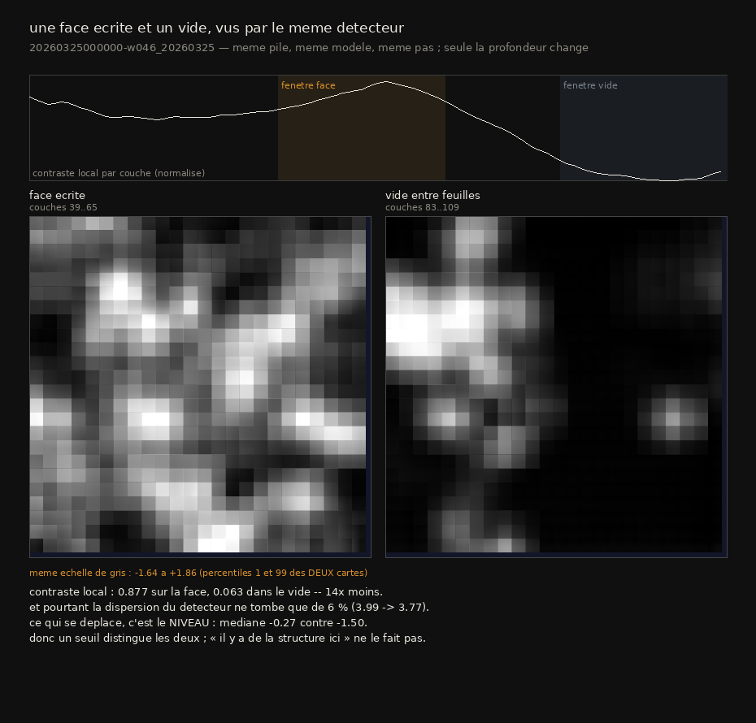

*Même échelle de gris **par segment**, prise sur les percentiles 1 et 99 des deux cartes : rendre
chacune à sa propre plage ferait paraître le vide aussi structuré que la face, c'est-à-dire
illustrerait la panne au lieu de la montrer. ⚠ L'échelle n'est pas commune aux trois — deux
campagnes n'ont pas la même plage de sortie, et une échelle globale comparerait des campagnes au
lieu de comparer face et vide.*

| segment | fenêtres | **AUC face/vide** | médiane face | médiane vide | matière face/vide | contraste face/vide |
|---|---|---:|---:|---:|---:|---:|
| `w056` | 39–65 contre 83–109 | **0,519** | −0,839 | −0,869 | **5,9×** | 0,717 / 0,191 |
| `w058` | 60–86 contre 5–31 | **0,371** | −0,665 | **−0,240** | **2,6×** | 0,187 / **0,639** |
| `w046` | 35–61 contre 61–87 | **0,382** | −0,812 | **−0,394** | **3,6×** | 0,245 / **0,383** |

> ⚠⚠⚠ **Le détecteur ne sépare la feuille du vide sur AUCUN des trois.** Le mieux qu'il fasse est
> **0,519**, c'est-à-dire le hasard. Et sur deux segments il fait **pire que le hasard** : le vide
> se lit **plus encré** que la feuille, alors que la face y porte **2,6 à 5,9 fois** plus de
> matière.

⭐⭐ **Ce qui prédit la réponse n'est pas la matière, c'est le CONTRASTE.** Le signe de
`AUC − 0,5` suit celui de `contraste_face − contraste_vide` sur les **trois** segments, tandis que
le rapport de matière — qui penche partout du côté de la face — ne prédit rien. ⚠ Trois points :
un accord de signe sur trois vaut une chance sur huit sous une règle tirée au hasard. C'est une
observation **compatible avec** « le détecteur suit le contraste local et non la feuille », pas
une preuve — et le contrôle est écrit pour **tomber** si un quatrième segment ne suivait pas.

### ⚠⚠⚠ Et la cause probable est une erreur d'échelle qui touche TOUT le dépôt

Le modèle lit **26 couches**. Ce qui compte n'est pas ce compte mais l'**épaisseur** :

| pile | taille de voxel | 26 couches couvrent |
|---|---:|---:|
| Scroll 1 `20230909121925`, où le modèle atteint 0,925 | 7,91 µm | **206 µm** |
| segments officiels de `PHerc1447` | 8,64 µm | 225 µm |
| **volumes de surface de `PHerc0139`** | **2,399 µm** | **62 µm** |

**62 µm, c'est moins qu'une épaisseur de feuille** (~100 µm). Sur ces volumes le détecteur ne voit
donc pas « une feuille et ses voisines » comme à l'entraînement : il voit une tranche **intérieure**
à une feuille — où il n'y a aucune surface — pendant que la fenêtre « nulle », posée entre deux
spires, en contient une. **Cela expliquerait exactement le renversement mesuré.**

⚠⚠ `infer_ink.py` portait le contraire, et à l'envers : *« à 8,64 µm, 26 couches couvrent 225 µm là
où l'entraînement en voyait 62 »*. Or 62 = 26 × 2,4, c'est-à-dire précisément la ligne que
[`36`](36_lorigine_de_la_pile.md) §5bis **déclare fausse** depuis le 2026-08-27. Corrigé.

⭐⭐⭐ **La prédiction, écrite AVANT la mesure.** `load_layer_stack` prend depuis août un pas de
profondeur qui épaissit la fenêtre sans changer le nombre d'images — et **aucun drapeau ne
l'exposait**, donc la seule grandeur capable de corriger la profondeur lue était injoignable
depuis la ligne de commande. Il l'est désormais (`--pas-couches`). À **pas 3** les 26 couches
couvrent **187 µm**, soit le régime d'entraînement à 9 % près, et la fenêtre « face » contient
alors la surface **et** ses voisines.

> **Si la fenêtre trop mince est la cause**, l'écart-type de la sortie doit monter avec le pas et
> la face doit cesser d'être moins encrée que le vide. **Sinon**, la profondeur est innocentée et
> cet axe est clos — ce qui vaut d'être écrit aussi.

### ✅ Mesuré le même jour : **la prédiction est RÉFUTÉE, et l'axe est clos**

> Mesure : `src/encre/la_profondeur_lue.py` (15 contrôles), `docs/mesures/la_profondeur_lue.json`.
> Figure : `src/figures/figure_profondeur_lue.py` (5 contrôles).
>
> ```
> uv run python src/encre/la_profondeur_lue.py --segment 20260325000000-w046_20260325 \
>     --json docs/mesures/la_profondeur_lue.json
> uv run python src/figures/figure_profondeur_lue.py --sortie docs/images/75_la_profondeur_lue.png
> ```

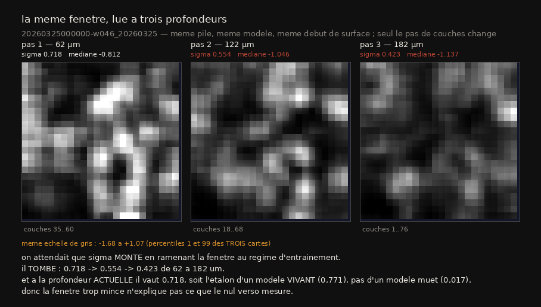

| pas | profondeur lue | couches | **σ** | médiane |
|---:|---:|---|---:|---:|
| 1 | **62 µm** (le régime actuel) | 35–60 | **0,718** | −0,812 |
| 2 | 122 µm | 18–68 | 0,554 | −1,046 |
| 3 | **182 µm** (le régime d'entraînement) | 1–76 | **0,423** | −1,137 |

⚠⚠⚠ **σ TOMBE, de façon monotone, au lieu de monter.** Ramener la fenêtre au régime
d'entraînement rend la carte **plus terne**, pas plus riche — c'est visible sur la figure, où
elle ne devient pas bruitée mais s'éteint.

⭐⭐ **Et à la profondeur actuelle le modèle est VIVANT** : σ = **0,718**, soit l'étalon de `36`
§5bis là où le modèle atteint 0,925 (**0,771**), et non son étalon muet (**0,017**). L'incapacité
mesurée en `C2` à séparer la feuille du vide n'est donc **pas** « le détecteur ne répond pas sur
ce rouleau » — il répond normalement, et sa réponse ne suit simplement pas la feuille.

> **Donc la fenêtre trop mince n'explique pas `C2`, et cet axe est clos.** C'est la **troisième**
> élimination indépendante de l'échelle comme explication, après `58` (émulation sur Scroll 1) et
> `63` (contre de vraies étiquettes) — et la première qui porte sur la **profondeur** et non sur
> le pas en plan.

⚠⚠ **Le confond, nommé plutôt que tu** : épaissir la fenêtre ne change pas que sa profondeur. À
pas 3 elle couvre les couches **1 à 76** d'une pile de 109, donc elle contient la feuille **et**
l'interstice que `C2` utilise comme vide. Ce n'est pas un défaut de montage — c'est ce qu'une
fenêtre de 182 µm contient physiquement à cet endroit — mais ça interdit de lire la baisse comme
« le modèle aime moins la profondeur » : il voit aussi autre chose.

⭐ Ce qui reste acquis quoi qu'il en soit : `--pas-couches` **existe désormais sur la ligne de
commande**. Le paramètre était pris par `load_layer_stack` depuis août, testé par sa batterie, et
joignable par personne — donc la seule grandeur capable de corriger la profondeur lue était hors
d'atteinte de toute campagne.

### ⚠⚠ Ce que ce contrôle ne peut pas faire, et ce qu'il ne dit pas

- **Il ne dit pas que la feuille est vierge.** Les fenêtres sont choisies sur la **matière**, pas
  sur l'encre : rien ici ne sait si ces trois faces portent de l'écriture. « Le détecteur ne les
  distingue pas d'un vide » est ce qui est mesuré ; « il n'y a rien à lire » ne l'est pas.
- **Il ne peut pas écarter la spire voisine.** La corrélation entre les deux cartes vaut
  **−0,102 / +0,105 / −0,009** : la carte du vide n'est donc **pas un décalque** de celle de la
  face, pas une transparence de la même colonne. Elle ne dit **rien** de la spire d'à côté, dont
  l'encre n'a aucune raison de tomber là où celle de cette face-ci tombe.
- **À ce pas de balayage la carte est trop petite pour porter une typographie** (`46` le dit déjà
  de lui-même). On compare le **niveau**, la **dispersion** et l'**AUC**, jamais l'interligne.

### ⚠ Ce qui est retiré de la version publiée le matin même

La version précédente annonçait que *« le NIVEAU, lui, se déplace franchement (−0,27 contre
−1,50), donc une lecture par seuil distingue les deux »* — la moitié rassurante du résultat. Sur
des fenêtres réellement posées sur la feuille, cet écart tombe à **−0,03 / −0,43 / −0,42** : nul,
puis **négatif** deux fois. Le niveau ne sauve rien, et la batterie l'asserte désormais dans ce
sens-là.

⚠ Un piège d'outillage payé au passage, pour la troisième fois dans ce dépôt : **deux campagnes ont
tourné en parallèle** sur les mêmes cartes, parce qu'un `nohup` survivant était invisible à
`ps -C python` — le processus s'appelle `python3`. Le remède est un **verrou `flock`** dans l'outil,
pas une vigilance : il est relâché par le noyau quand le processus meurt, quelle que soit la façon
dont il meurt.

---

### C3 ⚠⚠⚠ — le courriel à l'ESRF (ex-H2) : **conditionnel, et sa condition est testable**

~~Coût nul, aucune expérience à monter avant la réponse.~~ Argument géométrique : à 4,7 µm une
feuille fait 8 à 10 voxels au lieu de 4 à 5, donc `d′` monterait pour les treize — au prix de
×8 en volume (20 → 160 To), que le lecteur par fenêtres absorbe.

> ⚠⚠⚠ **2026-09-04 — DEUX DOCUMENTS DE CE DÉPÔT SE CONTREDISENT ICI, et c'est `73` qui a
> sur-affirmé.** Sa formulation — « coût nul, aucune expérience à monter avant la réponse » —
> tient un argument **géométrique** (plus de voxels par feuille). Or [`69`](69_reponse_dun_chercheur_exterieur.md)
> §1.2 donne l'argument **physique** contraire, et il est marqué `[établi]` : à 1,2 m le papier
> rend deux verdicts pour la **même acquisition** — 4,317 µm *haze-limited*, 9,362 µm
> *pixel-limited* — donc la résolution physique y est bornée par la **décohérence** entre 4,3 et
> 9,4 µm, et le binning ×2 a coûté peu. Prédiction chiffrée : le débinage rendrait **au plus
> 1,3–1,5×** de résolution effective.
>
> **Plus de voxels échantillonnant un signal déjà flou ne relèvent pas `d′`.** L'argument
> géométrique de `73` ne suit donc pas de la physique de `69`, et `69` écrit sa condition en
> toutes lettres : *« Cette prédiction est testable sur des données publiques (H2), et **si elle
> est fausse**, la donnée manquante la plus précieuse du prix est une demande à l'ESRF. »*
>
> ⭐⭐ **Et la condition est testable aujourd'hui.** `uv run python src/volume/ou_vit_ce_rouleau.py PHerc0500P2`
> rend `scans publiés → 0.550, 2.215, 4.317, 9.362` et **`volumes reconstruits → les mêmes`** :
> le même objet est publié et téléchargeable aux **deux** échantillonnages, et le lecteur par
> fenêtres (`src/volume/couches_distantes.py`) l'absorbe sans rapatrier 20 To.
>
> **Ordre corrigé** : H2 d'abord, sur données publiques, puis le courriel **seulement si** H2
> réfute la prédiction. Envoyer une demande de 160 To sur un argument que la physique de ce
> dépôt prédit faux coûterait un contact, pas rien.

### ✅✅ H2 est MESURÉ, et la condition du courriel n'est PAS remplie

> 2026-09-04. Mesure : `src/encre/le_debinage_rend_il_quelque_chose.py` (8 contrôles),
> `docs/mesures/le_debinage.json`. Figure : `src/figures/figure_le_debinage.py` (14 contrôles).

Le même objet, `PHerc0500P2`, aux deux échantillonnages natifs, même bras de 1,2 m :

| volume | `d′` médian | IC 95 % | fenêtres |
|---|---:|---|---:|
| natif **fin**, 4,317 µm, 111 keV | **1,44** | [1,25 ; 1,71] | 36 / 700 |
| natif **grossier**, 9,362 µm, 113 keV | **1,43** | [1,32 ; 1,67] | 51 / 700 |
| *fin biné ×2, 8,634 µm (contrôle)* | *1,25* | *[1,18 ; 1,40]* | *39 / 700* |

**Rapport = 1,01**, là où `69` prédisait au plus 1,3–1,5×. Et **les intervalles des deux natifs
se recouvrent largement** — [1,25 ; 1,71] contre [1,32 ; 1,67] — donc rien ne les sépare.

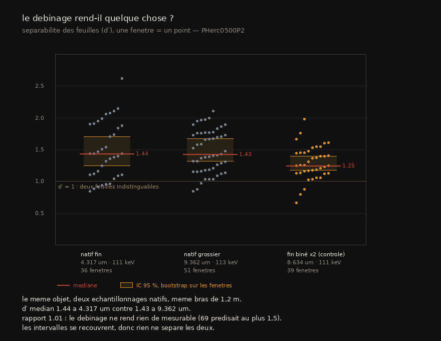

*Une fenêtre = un point. La bande claire est l'IC 95 % de la médiane, par bootstrap sur les
fenêtres — `64` §1 établit qu'un résumé sans sa dispersion **ne peut pas établir** une
différence, donc trois traits seuls auraient refait cette faute en image.*

> ⭐⭐⭐ **La physique de `69` tient, l'argument géométrique de `73` ne se vérifie pas**, et la
> condition que `69` posait — *« si elle est fausse »* — **n'est pas remplie**. Le courriel à
> l'ESRF n'est donc pas justifié par cette voie.

⚠ **Trois réserves, dites plutôt que tues.**

1. **Ce ne sont pas une acquisition binée deux fois** mais deux acquisitions (mai / 111 keV,
   août / 113 keV). Le bras est le même et 2 keV sur 112 font 1,8 %, dans la plage où `66` §3
   mesure une sensibilité *douce* — le confond est petit et nommé, pas absent.
2. **Le contrôle du binage logiciel donne 1,25**, plus bas que les deux natifs. Son intervalle
   [1,18 ; 1,40] touche celui du grossier, donc il n'est pas non plus séparé — mais il n'appuie
   pas l'idée que biner *n'enlève rien*.
3. **`d′` n'est pas l'AUC d'encre.** C'est la grandeur que l'argument de `73` invoque, et elle
   est sans dimension donc comparable entre campagnes ; une AUC répondrait à une question plus
   large, et c'est `C1`.

⚠ **Ma propre lecture intermédiaire était fausse**, et c'est la leçon de méthode : à 5 et
7 fenêtres j'avais lu 1,18 contre 1,64 et conclu *« le scan fin est pire »*. À 36 et 51, c'est
1,44 contre 1,43. Le piège nº27 du dépôt — **un volume est surtout du remplissage**, 93 % des
sondes tombent dans le vide — et `33` §3–4 bis qui exige 50 à 100 fenêtres.

⚠ **Et l'envoi appartient à l'auteur.** Un courriel à un tiers est un acte vers l'extérieur ;
ce registre peut en préparer la matière, pas le poster.

⚠⚠ **Et un outil disait que le test était impossible.** `corpus_par_energie.py` collectait les
résolutions en filtrant sur `scans[*].properties.pixel_size_um` — or **un seul scan de tout le
corpus** n'a pas cette propriété, et c'est `PHerc0500P2 / 20250507210011-4.317um-1.2m-111keV`,
celui dont H2 a besoin. Il disparaissait donc en silence, et le relevé publiait **trois**
résolutions pour ce rouleau au lieu de quatre. Corrigé (repli sur le `long_id`, en réutilisant
l'analyseur de `ou_vit_ce_rouleau`) : le fichier publie désormais `[0.55, 2.215, 4.317, 9.362]`.

**Première mesure de H2, la moins chère et la plus directe** : `src/encre/separabilite_scan.py`
rend un `d′` **sans dimension, donc comparable entre campagnes** — c'est exactement la grandeur
que l'argument de `73` invoque. Le lancer sur les deux volumes de `PHerc0500P2`, **même région
physique**, décide.

⚠ Deux précautions pour que la comparaison soit appariée : la même région physique n'est pas le
même index de morceau (les voxels n'ont pas la même taille), et `--level` doit être choisi pour
comparer **le natif au natif**, pas un niveau de pyramide d'un volume à un autre.

**Sortie de C** : deux nombres avec leur intervalle. Si l'AUC native à 9,362 µm ne se sépare
pas de 0,5 avec 40 tuiles, la règle ne lit pas à ce régime, et « colonnes visibles partout »
devra être jugé par la typographie (`45`) et le juge à condition vierge (`09`). C'est une
conclusion sur la **méthode de validation**, pas sur le prix.

---

## D. Dette

### D1 ⚠⚠ — re-fonder l'arc d'excision (`03`, `04`, `05`, `07`) — **débloqué**

La conclusion de tête de `07` est **détruite par notre propre mesure** : la réparation fait
passer la proximité de 1,464 → 0,735 % et 3,483 → 2,707 % (−50 % et −22 %), contre son
« 0,37 → 0,38 %, ça ne bouge pas ».

⭐⭐⭐ **Débloqué le 2026-09-04** (`07` §8), et par deux trouvailles :

1. ⚠⚠⚠ **La mesure qui a renversé `07` n'avait AUCUN producteur** dans l'arbre — faite au
   terminal. Le pire cas de `D3` : une mesure qui renverse une conclusion et qu'on ne peut pas
   relancer. `src/excision/reparation_et_proximite.py` existe désormais.
2. ⭐⭐ **Le blocage venait d'une généralisation depuis le mauvais rouleau.** `07` §7 conclut que
   le cas discriminant n'est pas montable ; c'est vrai de `PHerc0172` (10 traces éligibles) et
   **faux de Scroll 1**, qui en a **34**, curatées, span médian 2,70 tours.

**Et à provenance égale, le SIGNE change** : `w010-027` **+398 %**, `w028-037` **−17 %**.

3. ⚠⚠⚠ **Puis la mesure passée à n = 10 a détruit ce résultat-là aussi, et le contrôle que
   j'avais écrit pour l'en protéger ne pouvait pas échouer** (`07` §10). J'avais vérifié que
   trois runs de la *même* commande rendent le *même* nombre — c'est-à-dire la
   **reproductibilité** — et j'en avais conclu la **stabilité sous ré-échantillonnage**, qui est
   une autre propriété. Or `proximity.py` tire `choice(points.shape[0], …)` : la réparation
   change le nombre de points, donc le tirage, donc « avant » et « après » ne portent pas sur les
   mêmes cellules. Balayage de 12 graines sur le **même fichier** : `fraction_below_third` bouge
   de **35 à 229 %**, soit plus que la réparation sur **9 traces sur 10**. Et son numérateur
   tient sur un chiffre — les +398 % sont **une cellule qui en devient cinq**.

⭐⭐ **Ce que ça laisse debout, et c'est plus que ça n'en a l'air.** Le premier §8 de `07` valide
cette colonne par un rho de +0,769 **entre traces**, où le signal (403 %) écrase le bruit (82 %) :
ce classement tient. Ce qui tombe est son transport vers une **différence appariée**, où l'effet
médian (35 %) est plus petit que le bruit. Et `proximity.py` publie déjà la colonne qu'il fallait
lire — `shortfall`, sans seuil, dont l'étendue de graine reste **sous 5 %**.

⭐⭐⭐ **Rejouée sur `shortfall`, la réparation ne déplace RIEN de mesurable** : zéro paire sur
dix au-delà du bruit de graine (±5 %), signe mélangé (3 en hausse, 7 en baisse), et face au bruit
de sa *propre* trace la majorité reste dedans. **Le titre d'origine de `07` est donc restauré**,
pour une bien meilleure raison que celle qu'il donnait. ⚠ *Ne déplace rien de mesurable* n'est pas
*ne fait rien* : ce qui est établi est une **borne** — un effet inférieur à ~5 %, la dispersion
d'un tirage de 20 000 cellules. Le distinguer demanderait un tirage **apparié**, c'est-à-dire
mesuré sur les cellules qui survivent à la réparation, des deux côtés.

4. ⚠⚠⚠ **Et la réparation elle-même n'est pas déterministe.** Le même `windcheck transform`, sur
   la même trace, a retiré **3 696** quads puis **3 698** — donc le Δ de cette trace passe de
   −3,5 % à **+21,2 %** entre deux exécutions du même pipeline. Un signe qui s'inverse quand rien
   n'a changé est la démonstration la plus courte que la table du §8 ne portait pas d'information.
   ⭐ Le dépôt a déjà rencontré cette forme (`44` : rng semé par l'horloge + 22 fils), et son
   remède est connu — une graine posée et `thread_limit: 1`.

5. ⭐⭐⭐ **Et le balayage `--population` a trouvé bien plus que ça : le premier §8 de `07` est
   PÉRIMÉ.** Le §9 a corrigé le rayon de recherche (4× trop grand, il trouvait la spire voisine
   et noyait l'anomalie dedans) et n'a re-mesuré **qu'une colonne**. Le §8, qui compare les
   grandeurs entre elles et conclut que le seuil *« n'est ni arbitraire ni supprimable »*, porte
   encore l'ancien rayon. Au bon rayon : l'écart entre `fraction_below_third` et `shortfall`
   tombe de **0,429 à 0,054**, et le « plateau puis effondrement » qui justifiait le seuil devient
   un plateau **sur toute la plage** (chute 0,477 → **0,025**). **Le seuil ne sélectionne aucun
   régime.**

6. ⚠⚠⚠ **Et personne ne l'avait rejoué parce que le producteur ne tournait plus.**
   `run_proximity.sh` appelait `python -m excision.proximity`, qui ne résout plus, et avalait
   l'erreur : un run qui ne mesurait **rien** rendait « 0 mesurées, 55 sans mesure » **et sortait
   en 0**. La panne totale ressemblait à une population vide. Corrigé, et un run qui ne mesure
   rien ne sort plus en 0.

7. ⚠⚠⚠ **Trois passages sur la même affirmation, tranchés par la mesure à chaque fois.**
   (1) J'écris que `windcheck transform` n'est pas déterministe, depuis **deux sorties de
   terminal** (3 696 puis 3 698 quads). (2) Le mode `--determinisme` à trois répétitions rend
   trois certificats **identiques** : je rétracte. (3) À **six** répétitions — 3698, 3696, 3696,
   3696, **3691**, 3696 — **trois certificats distincts**. La première affirmation était juste,
   la rétractation était fausse, et elle l'était **par chance**. ⭐ Son propre commentaire disait
   pourtant que trois répétitions sont une preuve faible de déterminisme : **une réserve écrite
   ne dispense pas de la mesure qu'elle appelle**. Variation bornée à **0,19 %** des quads
   retirés, cause inconnue, forme déjà rencontrée dans `44` (rng semé par l'horloge, 22 fils).

⭐ **Conséquence pratique** : `shortfall` devient la colonne de référence de l'arc. Elle ordonne
aussi bien (médiane +0,765 contre +0,780) et son bruit est **4,5 fois plus serré**. Pour toute
question de **différence** — celle que la chaîne de déroulage pose en boucle — c'est la seule des
deux qui puisse répondre.

8. ⭐⭐⭐ **Et la cause est COMMUNE aux trois familles.** Rejoué au bon rayon, `06` §3.2 aussi :
   boule 400 **+0,560 → +0,803**, boule 200 **+0,474 → +0,738**. Le verdict survit (la bande
   reste devant) mais l'écart tombe de **0,209 à 0,036**, sous le bruit du rho, et la **largeur**
   de la bande cesse aussi de compter (étendue 0,050 → **0,010**). Donc **trois** paramètres
   cessent de compter ensemble : aucun n'était mal choisi, c'est le **rayon** qui les faisait
   paraître importants. Les fichiers le disent eux-mêmes — une distance est plafonnée par le
   rayon, donc l'ancien impose **≥ 382,6 µm = 2,7 pas de feuille**, contre **0,88** au corrigé.

9. ✅ **Mais l'explication du §6 de `07` SURVIT, plus forte.** Le mécanisme (« l'anomalie
   normalise sa propre référence ») tient au rayon corrigé sur **34 traces sur 34** au lieu de
   43 sur 45, Wilcoxon **1,2e-10**. Ce n'était donc pas un artefact du rayon ; c'est sa
   **conséquence** sur la corrélation qui a disparu. ⚠ Cette mesure n'avait **aucun
   consommateur** : le lecteur existe et retrouve **exactement** les quatre nombres publiés.

10. ⚠ **Ce qui reste une vraie différence après correction est la COUVERTURE**, pas le rho : la
    boule de rayon 100 ne mesure que **20,7 %** des cellules, et aucun rayon ne répare ça.

11. ✅ **Et la leçon d'outillage du §9 est enfin appliquée** : `proximity.py` n'écrivait pas son
    instrument, `baseline_sweep.py` l'écrivait depuis août sous le nom `echelle`. Les deux
    écrivent désormais le **même** bloc. Conséquence immédiate : la question que `07` §9 déclarait
    insoluble est **tranchée par l'artefact** — `sweep_PHerc1667.jsonl` déclare
    `voxel_um 7,91`, donc 18 voxels y font **142,4 µm** et la ligne PHerc1667 était bien appariée.

⭐⭐ **La marche suivante est identifiée ET rendue possible par une mesure.** La borne de 5 % vient
du tirage **non apparié** : `proximity.py` tire dans l'index des cellules *valides*, dont le nombre
change avec la réparation. Or **la grille de paramétrisation, elle, ne change pas** — mesuré sur
`w064-068` : `756 × 2940` des deux côtés, 1 999 850 → 1 999 708 cellules valides, soit **142
perdues sur deux millions**. Donc la cellule (i, j) d'avant EST celle d'après, et un tirage par
**position de grille** (plutôt que par index de cellule valide) serait apparié par construction —
le bruit d'échantillonnage disparaîtrait du comparatif au lieu d'être borné.

⚠ Ce doit être un mode **opt-in** (`--tirage-par-position`) : changer le tirage par défaut
déplacerait toute mesure déjà publiée.

12. ✅✅ **D1 EST FERMÉ — la conclusion-titre de `07` est confirmée par un instrument capable de
    la contredire.** Le tirage apparié est écrit et mesuré (`07` §12) : effet médian sur
    `shortfall` **1,58 % → 0,07 %**, facteur **22**, et **10 traces sur 10** sous leur propre
    bruit de graine contre 4 qui en sortaient. ⭐ Le plus parlant n'est pas le pourcentage mais
    le **compte** : à échantillon égal, **7 traces sur 10 comptent exactement les mêmes cellules
    sous le tiers avant et après**. La réparation retire des centaines à des milliers de quads et
    ne déplace **aucune** des cellules que la métrique signale. La borne passe de ~5 % à
    **0,6 %** au pire.

⚠ Ce n'est pas « la réparation ne fait rien » : elle supprime bien les contacts d'auto-intersection
(`07` §3, 11 673 → 0). Ce qu'elle ne déplace pas, c'est la **proximité anormale entre régions non
adjacentes**, qui est une autre propriété du même maillage.

⚠ **Restant** : les `sweep_PHerc*.jsonl` des **autres rouleaux** sans déclaration
(`sweep_PHerc0139`, `sweep_0139_*`, `sweep_s1_pas`) n'ont aucune trace commune avec Scroll 1, donc
`le_rayon_des_mesures.py` ne peut ni les dater par comparaison ni lire leur déclaration — il
faudrait les régénérer, ce qui les fera déclarer. ✅ **Et la non-reproductibilité de la réparation est ÉLUCIDÉE** (`07` §10) : ce n'est
pas un défaut mais une propriété déclarée. L'excision est une optimisation résolue composante par
composante sous un **budget d'horloge par segment** (`improvement_budget_s_per_segment: 120.0`,
*« never a per-component budget »*), donc combien de composantes atteignent le solveur exact
dépend de la vitesse de la machine. Corrélation mesurée : `(163 exact, 18 glouton) → 3 696`,
`(164, 17) → 3 691`. La `failure_rule` de `windcheck` dit qu'un dépassement *« costs an
optimality claim, never an artifact »* — la sortie est toujours **valide**. ⚠ Le remède de `44`
(graine + un fil) a été **testé et réfuté**. Aucun drapeau utilisateur ne peut rendre la
réparation bit-reproductible ; il faut **réparer une fois et garder la sortie**, ce que fait déjà
chaque paire du §12.

### ✅✅ D2 — le contrôle P1 bis : **FAIT le 2026-09-05, et l'hypothèse TIENT**

> ⚠⚠⚠ **Ce n'était pas bloqué, et le blocage était mon erreur de recherche.** Ce registre
> annonçait « le rapport *budget* n'est ni dans `docs/`, ni dans `src/`, ni dans `store/` ». Il
> **est** dans l'arbre, à `docs/registres/anteriorite_resultats_de_tete.md:593`. J'avais cherché
> un fichier **nommé** « budget » au lieu de chercher le **concept** — la règle que ce dépôt
> écrit partout, enfreinte par celui qui l'écrit.

> Mesure : `src/tracecheck/modele_de_proprete.py` (15 contrôles), `docs/mesures/p1bis.json`.
>
> ```
> uv run python src/tracecheck/modele_de_proprete.py --json docs/mesures/p1bis.json
> uv run python src/tracecheck/modele_de_proprete.py --verifier
> ```

⚠⚠ **Et le ×15,9 n'avait pas de producteur non plus.** Le rapport annonce *« Vérification
reproductible : `scratchpad/check_windcheck_model.py` (calcul dans l'arbre, pas en ligne de
commande) »* — **ce fichier n'existe pas**. Un nombre publié dont le calcul n'est nulle part est
exactement ce que ce dépôt refuse ailleurs. Il est désormais dans l'arbre, et il reproduit les
trois nombres du rapport : **12 085 → 192 541 cellules, ×15,93**.

⭐ Le facteur exigé est **indépendant de `q`** — c'est un rapport de deux logarithmes — donc le
résultat survit à une révision du modèle publié par `windcheck`.

### Le contrôle lui-même : « cellules ∝ aire » — **oui, à 1,6 % près**

Le rapport laissait l'hypothèse ouverte : *« cellules ∝ aire est une hypothèse que l'article n'a
pas vérifiée et qu'il peut trancher sur ses propres grilles »*. Les grilles sont sur le disque aux
**deux** plafonds (`data/tirages/` à 120, `data/tirages_plafond/` à 400).

| rouleau | cellules valides | aire | rapport des deux croissances |
|---|---:|---:|---:|
| `PHerc0125` | 56 644 → 202 591 (**×3,58**) | 19,83 → 71,31 cm² (**×3,60**) | **0,99** |
| `PHerc0191` | 56 644 → 227 528 (**×4,02**) | 19,83 → 80,39 cm² (**×4,05**) | **0,99** |

⭐⭐ **Et la forme forte, qui est celle qui tranche** : sur les **24 tirages** des deux rouleaux et
des deux plafonds, la densité vaut **2 812 à 2 857 cellules par cm²** — une étendue relative de
**1,6 %**. « Proportionnel » n'est plus une hypothèse ; un rapport de médianes aurait pu coïncider
pour deux raisons, une densité constante sur vingt-quatre tirages non.

> **Donc P1 bis tient.** Le modèle publié exige **×15,9** de cellules pour passer de 1 tirage sale
> sur 12 à 9 sur 12 ; l'observé est **×4,0 au plus**. Le basculement de propreté est **plus raide
> que la seule arithmétique de taille**, donc le budget fait quelque chose au-delà de grandir la
> surface — et ça, `windcheck` ne le dit pas.

⚠ **La seconde réserve du rapport reste entière** : 1/12 et 9/12 sur n = 12 portent des intervalles
larges. Ce qui est levé est l'hypothèse (a), pas (b).

### ⚠⚠⚠ Un fait trouvé en chemin : au plafond d'origine, les DOUZE tirages ont le même compte

**56 644 cellules valides exactement**, pour les six tirages de `PHerc0125` **et** les six de
`PHerc0191`, sur une grille 242 × 242 remplie à 96,7 %. Les aires, elles, diffèrent légèrement
(19,823 à 19,981 cm²) : les traces sont bien différentes, mais leur **compte de cellules est fixé
par le plafond**, pas par la trace. C'est *« la stabilité était une troncature »* (`35` §3bis) vu
d'un angle plus net — et ça rend le point de départ **dégénéré**, ce que la batterie assère plutôt
que de le masquer. Le contrôle ne tient donc pas par ce point-là mais par la **densité**, mesurée
des deux côtés.

⚠ **Deux sondes n'ont rien trouvé, et c'est ce qui a produit le contrôle suivant.** Compter
**toutes** les cellules de la grille, puis n'en lire qu'**un seul** plan : la batterie est restée
verte les deux fois. Non par faiblesse — sur ces grilles les trois plans déclarent les mêmes
absents (`x = y = z = 56 644`) et le remplissage est de 96,7 %, donc les trois comptages
coïncident. Mais « ils coïncident ici » est une **propriété des données**, et s'y fier sans la
mesurer est le piège habituel : `concordance_des_plans` la mesure désormais.

---

### D4 ⚠⚠⚠ — 67 batteries vertes sur 158 n'atteignent pas le nombre qu'elles publient

Document dédié : [`80`](80_la_batterie_natteint_pas_le_nombre.md). Suite de
[`61`](61_les_batteries_qui_ne_pouvaient_pas_echouer.md), dont il franchit la limite finale —
*« ce contrôle dit qu'une batterie peut échouer, jamais qu'elle teste quelque chose d'utile »*.

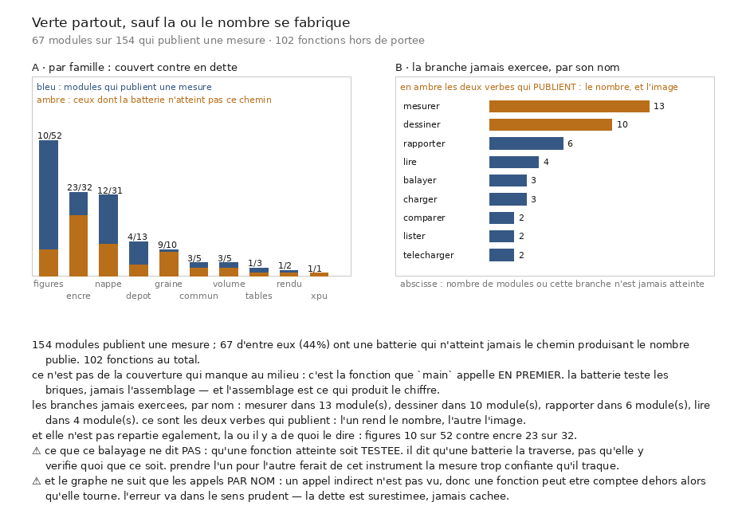

**Le défaut, payé le 2026-09-05** : un de mes patchs a échoué à mi-course et n'a écrit que son
dernier bloc, laissant l'enregistrement de `derouler_des_deux_bords.py` référencer trois
variables inexistantes — **et la batterie est restée verte**, parce qu'elle n'appelle pas
`mesurer`. Une batterie verte sur un module dont le seul chemin non testé est celui qui produit
le nombre publié est une batterie qui ne peut pas échouer **là où ça compte**.

⚠ La raison n'est pas de la négligence, elle est mécanique : ce chemin **lit le dépôt distant**,
et `temoins.sh` exige que ses batteries tournent hors ligne. Le chemin le plus important du
module était le seul qu'on ne pouvait pas exercer.

**Le balayage** (`src/depot/le_chemin_du_nombre_publie.py`, propriété du graphe d'appels, lue
sans rien exécuter) :

| | |
|---|---:|
| modules qui publient une mesure ou une figure | **158** |
| dont la batterie n'atteint pas ce chemin | **67** (44 %) |
| fonctions hors de portée | **102** |

⚠⚠ **La portée a été resserrée après le premier chiffre**, et il était trop large : la règle
comptait comme publieur tout module *mentionnant* `docs/mesures`, donc aussi les purs lecteurs.
Le signe retenu est l'**écriture**, sous ses deux formes — sérialiser et écrire un fichier (une
mesure), ou enregistrer une image (une figure).

⭐ **La branche laissée dehors porte toujours le même nom** : `mesurer` dans **13** modules,
`dessiner` dans **10**, `rapporter` dans **6**. Ce sont les deux verbes qui publient — l'un rend
le nombre, l'autre l'image. Par famille : `graine` **9/10**, `encre` **23/32**, `nappe`
**12/29** (elle était à 15), `figures` **10/50**.

⚠⚠ **Un chiffre calculé puis retiré** : « les modules dont la tête de chemin est dehors », 67 sur
67. C'est une **identité** — la couverture se propage vers le bas — donc un nombre qui ne peut
prendre qu'une valeur et se lirait comme une découverte.

**Réparé, cinq modules et une matière fabriquée.** `derouler_des_deux_bords`,
`derouler_par_le_pas_normal`, `le_raccrochage_a_la_matiere`, `la_longueur_locale_du_pas` et
`derouler_en_raccrochant` reçoivent leur matière par paramètre, le défaut restant le dépôt
distant (donc les nombres publiés ne bougent pas d'une virgule). Ce qui est injectable est la
**matière**, pas le découpage : boîte, seuil de cellules, encadrements, marche, combinaison,
pondération et enregistrement restent dans `mesurer`. Les batteries : 32 → **46**, 9 → **17**,
46 → **54**, 20 → **30**, 63 → **75**.

⭐ Et la matière est **promue dès le deuxième appelant** : `src/nappe/le_corpus_des_spires.py`
(**16 contrôles**) porte l'unique lecteur du corpus, l'unique fixture de spires **et** le volume
fabriqué. Cinq modules de `src/nappe/` avaient chacun leur copie du lecteur, et deux dérouleurs
comparés sur deux lectures différentes mesurent d'abord leur désaccord de lecture.

⚠⚠⚠ **DEUX VUES D'UN MÊME OBJET, PAS DEUX OBJETS.** Un dérouleur lit les spires comme des
**surfaces** et le volume comme une **intensité** : décrire l'objet deux fois ferait un corpus
dont les feuilles ne sont pas là où le volume les met, et le raccrochage snapperait sur de la
matière qui contredit ses ancres — en rendant des nombres parfaitement stables. La géométrie est
dite **une fois**, l'intensité en est **dérivée**. Le contrôle qui lie les deux : le gabarit lu
autour d'une spire doit avoir sa **crête sur zéro**.

**Trois ronds-trips** : on injecte des feuilles à 135,5 µm, la mesure rend 136,3 µm (ne pas
bouger), 136,1 µm (longueur lue) et 63,0 voxels contre 61,2 (pas entre crêtes). Tolérance
**dérivée** de l'ondulation, jamais choisie. Et les trois réponses du lecteur de volume — une
absence se mémorise, un incident se réessaie, un incident qui persiste **lève** — sont exercées
pour la première fois, alors qu'elles avaient été écrites après un incident réel.

⚠⚠⚠ **La fixture doit être ONDULÉE** : des spires parfaitement décalées du pas sont atteintes
*exactement* par un pas normal, donc toutes les erreurs vaudraient zéro et chaque comparaison
serait satisfaite par des zéros. **Dix sondes** remettent chacune un défaut — fixture aplatie,
spires collées, boîte qui ne découpe plus, seuil qui ne filtre plus, corpus qui gagne une clé,
affichage lisant une clé renommée, figure lisant une clé absente, spire absente non refusée,
demi-épaisseur devenue épaisseur, témoin du pas nul figé — et toutes font rougir la batterie
qu'elles visent. ⚠ Une sonde reste **verte** à bon droit : le contrôle de forme du corpus a
déménagé chez son propriétaire, et le dupliquer chez ses cinq appelants ferait cinq copies d'une
même exigence, libres de diverger.

⚠⚠ **Et un second constat, trouvé en cherchant où inscrire la batterie corrigée : 44 batteries
que `temoins.sh` ne lançait pas** — toute la campagne de déroulage et ses figures. Le harnais
rendait « 184 batteries ALL PASS » sans les voir. Le garde-fou qui les nomme existait déjà ; il
n'avait pas tourné, le harnais complet étant long. Un contrôle qu'on ne lance pas est, pour la
durée où on ne le lance pas, exactement un contrôle absent. Les 44 ont été lancées **une par une
avant d'être inscrites** : toutes vertes, la plus lente en soixante secondes.

⚠⚠ **Deux de mes contrôles ne pouvaient pas échouer, et ce sont les sondes qui l'ont dit.** Un
refus « hors de la boîte » où seules les spires étaient déplacées : le volume n'ayant rien à lire
là-bas, la mesure refusait pour **absence de matière**, et retirer le découpage laissait le
contrôle vert. Et une inégalité **large** (« pas moins de cellules ») qu'un découpage inerte
satisfait, devenue stricte. Les deux sont le même défaut de méthode : un contrôle dont on n'a pas
cherché par quelle autre voie il pourrait passer au vert.

**Reste à faire** : 67 modules. L'ordre suit la mesure — `mesurer` d'abord (13), puis `dessiner`
(10), c'est-à-dire le nombre puis l'image. La famille `graine` (**9 sur 10**) et `encre`
(**23 sur 32**) sont les prochaines par densité.

```
uv run python src/depot/le_chemin_du_nombre_publie.py   # le balayage, par famille et par nom
```

### D3 ⚠ — 41 → **33** scripts sans appelant, et aucune des huit réparations n'était une formalité

> Entamé le 2026-09-04. `src/depot/appelants.py` juge **307 scripts**. La méthode : demander
> pour chaque orphelin *« son résultat est-il publié quelque part ? »*.

⭐⭐ **Un script cité sans commande n'est pas du code mort — c'est une mesure NON
REPRODUCTIBLE**, ce qui est pire, parce que ça ne se voit pas.

**Les huit réparées, et ce qu'elles cachaient :**

| quoi | ce qui n'était pas refaisable |
|---|---|
| `figure_comparaison`, `figure_deux_axes` | deux images **affichées dans un doc** sans leur commande de régénération — la règle du dépôt. ⚠ Vérifié qu'elles régénèrent **à l'identique** |
| `couches_distantes` | la fenêtre de Scroll 1 du `77` §10, mentionnée sans sa commande |
| `apprendre/04` à `08` | le README documente **8 épisodes** et n'en montrait que **2** à fabriquer |
| **`run_proximity.sh`** | ⚠⚠ produit `proximity_scroll1.jsonl`, la mesure de **tout l'arc d'excision** (D1), citée dans deux documents — **sa commande n'était nulle part** |

**Ce qui reste, mesuré plutôt que supposé :**

| catégorie | n | constat |
|---|---:|---|
| **cités dans un doc, sans leur commande** | **9** | même défaut que les huit ci-dessus — à traiter pareil |
| cités nulle part, aucune sortie JSON | 4 | ⭐ **LUS — aucun n'est mort**, voir ci-dessous |
| figures sans sortie par défaut | 5 | l'image est passée en argument, donc rien ne dit laquelle |
| reste | 15 | non classé |

#### ⭐⭐ Les quatre « candidats à déclarer morts », lus — et aucun ne l'est

La règle disait *« à lire avant : un script de 122 lignes peut porter un savoir »*. Elle a payé :
les quatre portent une **question ouverte**, et ils sont orphelins parce que leur **résultat**
n'a jamais été publié, pas parce qu'ils ne valent rien.

| script | ce qu'il demande |
|---|---|
| `campagne_prediction_paris4` | **laquelle des deux prédictions de surface** de `PHercParis4` vaut-il mieux tracer ? (`48` monte l'expérience là ; ce rouleau en publie **deux**) |
| `sens_de_la_normale` | la pile est-elle rendue **du bon côté** de la surface ? (`38` mesure que le pic est au bord **à toutes les fenêtres**, même sur une trace posée sur la graine d'un segment officiel) |
| `tracer_tous_candidats` | et si la graine choisie était la **moins bien soutenue** de celles qu'on avait ? (`trouver_graine` classe sur la planéité **seule**) |
| `juger_nappe` | ⚠⚠⚠ cas à part — voir ci-dessous |

#### ⚠⚠⚠ `juger_nappe.sh` : une déduplication écrite, jamais adoptée, et devenue une 3ᵉ copie

Son en-tête dit pourquoi il existe : `spire_suivante.sh` et `etendre_nappe.sh` portaient chacun
une copie **verbatim** de la fonction de jugement, et les deux **avaient déjà divergé** — la
réserve `--au-bord` câblée dans l'une avant l'autre, si bien qu'*« un verdict de campagne portait
le complément et l'autre non »*.

**Vérifié aujourd'hui** : ni l'un ni l'autre ne l'appelle. La divergence a été réparée **dans
chaque copie** — les trois passent maintenant `--au-bord`. Donc :

- ✅ la divergence de l'époque est **corrigée** ;
- ⚠⚠ mais la déduplication n'a **pas** été adoptée, et il y a désormais **trois** exemplaires de
  la même logique de jugement. L'argument de son propre en-tête — *deux chemins de jugement sont
  deux occasions de ne pas s'accorder* — vaut à trois.

> ⭐ **Le remède n'est pas de le déclarer mort**, c'est de l'**adopter** dans les deux appelants.

#### ✅ **Fait le 2026-09-04, et l'équivalence est PROUVÉE avant l'adoption**

⚠⚠⚠ **Les trois copies n'étaient pas équivalentes** : `spire_suivante` **n'avait pas la garde
`REPLIEE`** — le plafond de croisements par cm² vérifié *avant de payer les rendus*. Il payait
donc des rendus sur des surfaces manifestement repliées que les deux autres abandonnaient.

**Un refactor ne change pas le comportement.** Le plafond est donc devenu **désactivable** par
une chaîne vide, et `spire_suivante` le désactive — l'activer est une décision à prendre à part,
puisqu'il a produit des résultats publiés.

**La preuve, statique et insensible à l'ordre** (un jugement complet paie un rendu, donc une
preuve par exécution coûterait vingt minutes par cas) :

| appelant | chemin adopté | ancienne fonction | différences |
|---|---:|---:|---|
| `spire_suivante` | 41 lignes | 41 lignes | **0** |
| `etendre_nappe` | 54 | 55 | **5, toutes expliquées** |

Les cinq d'`etendre_nappe` : le `if` gagne un test `-n "$PLAFOND"` qui est **vrai** chez lui, et
l'`echo` passe de deux arguments à un. ⚠ **Ce dernier change la sortie d'un espace** — l'ancien
écrivait `cm²,␣␣au-dessus` (espace final + espace de jointure), le nouveau `cm²,␣au-dessus`.
Cosmétique, et dit plutôt que passé sous silence.

⚠ Un piège payé en chemin : `VAR=x . fichier` a une sémantique subtile — un test a montré que
`PLAFOND` prenait et `LIGNES_VERDICT` non. Les deux sont sur leurs **propres lignes**.

#### ⭐⭐ Et le détecteur ne voyait pas le sourcing — un vrai manque, pas un cas à contourner

`appelants.py` ne reconnaissait aucune forme `. fichier` / `source fichier`. Or **sourcer une
bibliothèque shell, c'est l'exécuter** : son code de premier niveau tourne et ses fonctions
deviennent disponibles. Toute bibliothèque shell du dépôt passait donc pour orpheline — ce qui
est exactement arrivé à `juger_nappe.sh`, écrit pour dédupliquer et signalé comme exécuté par
personne.

La forme est **ancrée en début de ligne**, ce qui sépare une exécution d'une mention. ⚠ Sonde :
un document qui cite le fichier au fil d'une phrase rend `[]`, un `.` à chemin calculé et un
`source` littéral sont détectés. Les 21 contrôles du détecteur restent verts.

**24 orphelins** (41 au départ). ⭐ Huit de plus rattachés le **2026-09-05**, et aucun n'était
une formalité :

| quoi | ce qui n'était pas refaisable |
|---|---|
| `figure_profondeur` (`12` §1bis) | l'image **ne se régénérait plus depuis les données de l'arbre** : trois nombres du document avaient dérivé, et la version publiée montrait deux panneaux là où les mesures en donnent trois |
| `figure_difficulte` (`16`) | vérifié **octet pour octet** (md5 `a163cd18…`) |
| `campagne_temoin_typographique` (`46`) | tous ses réglages sont des variables d'environnement, donc la commande nue reproduit la campagne — encore fallait-il l'écrire |
| **`excision/measure.py` + `analyse.py`** (`04`) | ⚠⚠ le `p = 0,859` est cité dans **quatre** documents et `analyse.py` n'est nommé dans **aucun**. Vérifié hors ligne : rend le tableau publié à l'identique |
| `table_pas` (`26` §9) | la colonne « mauvaise graine » n'était atteignable qu'en lisant le code, la bonne étant le défaut de l'outil |

### ⚠⚠⚠ Et le registre de lecture avait un point aveugle de dix documents

`src/depot/fiches_a_jour.py` (17 contrôles) compare chaque fiche au document qu'elle résume —
rien ne le faisait, donc une fiche pouvait décrire un fichier qui avait bougé de trente-cinq
lignes. Trois avaient dérivé, et **dix fiches sur soixante-trois portaient une remarque derrière
leur nombre** (« ⚠ (438 quand la fiche a été écrite…) ») qui les rendait invisibles à ma première
version du motif — le contrôle était aveugle à la population la plus à risque.

Puis le point aveugle **symétrique**, qui vaut plus cher : **les dix documents les plus récents —
`69` à `78` — n'ont aucune fiche**. Le registre se lit *à la place* des documents, donc son silence
sur eux se lisait comme une couverture complète.

> ⚠ **Non fait le 2026-09-04, et volontairement** : écrire dix fiches demande de lire dix
> documents pour de bon. Une fiche bâclée est pire que pas de fiche — elle a l'air d'une lecture.
> C'est une tâche à part ; ce qui était fait, c'est qu'elle ne pouvait plus être **oubliée en
> silence**.
>
> ✅✅ **FAIT le 2026-09-05** : les onze documents sans fiche en ont une, celui-ci compris, chacune
> avec ses deux lignes de preuve de lecture intégrale. **81 fiches, 0 document sans fiche.**
>
> ⚠⚠⚠ **Et le contrôle lui-même avait un TROISIÈME point aveugle, plus silencieux que les deux
> précédents.** Les fiches `43` à `49`, écrites d'un même lot, séparent leur titre de leur compte
> par une **ligne vide**, et le motif exigeait l'enchaînement immédiat : ces **sept fiches
> n'étaient pas « en dérive », elles étaient INVISIBLES**. `48` annonçait 342 lignes pour un
> document qui en faisait 405 pendant que le registre disait « 0 en dérive », et **trois** des
> sept dérivaient réellement — dont deux documents auxquels la session n'avait pas touché.
> ⭐ Un garde-fou ne doit pas dépendre d'un blanc : le séparateur est désormais **capturé et
> recopié** plutôt que normalisé, parce que réécrire sept fiches pour satisfaire une regex serait
> laisser le contrôle changer les données.
```
uv run python src/depot/fiches_a_jour.py            # dérives + documents sans fiche
uv run python src/depot/fiches_a_jour.py --corriger  # les comptes seulement, jamais le résumé
```

⚠ Une fausse alerte à moi : j'ai cru `proximity_scroll1.json` manquant, il existe en `.jsonl`.
Mon motif cherchait la mauvaise extension.

⚠⚠ La règle reste celle du registre : **rattaché à un appelant ou déclaré mort**, jamais laissé
dans l'entre-deux — un script gardé « au cas où » est un script que personne ne relancera et qui
pourrira sans que rien ne le dise.

---

## E. Ce qui est HORS registre, et pourquoi

- **La soumission Progress Prize** — l'auteur l'a mise hors périmètre (*« fait tout sauf la
  soumission »*).
- **Le second papier (`72`)** — ⚠⚠⚠ c'est une **occasion de publication, pas un progrès vers
  le prix**, et sa mesure porteuse est C1. Il n'avance qu'avec C.
- **H3 et H6 de `69`** — répondues par le dépôt (`73` §1) : la carte locale de qualité existe
  déjà sous deux formes, et le prior n'est pas universel.
