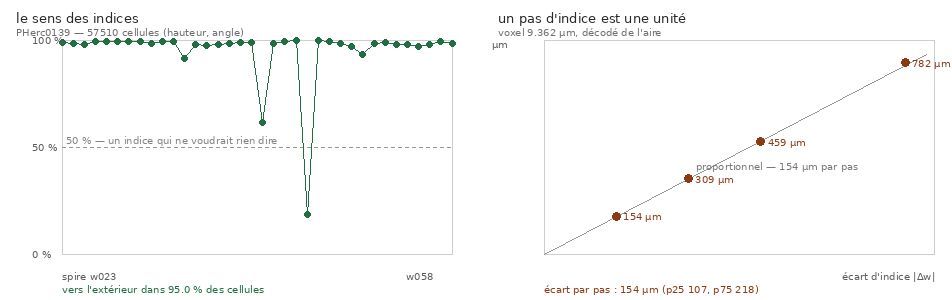

# 76 — Le sens des indices de spire, et l'écart inter-feuilles qu'ils mesurent

> Écrit le 2026-09-04. Tâche **A1** du registre `75`. Mesure dans l'arbre :
> `src/excision/le_sens_des_indices.py` (13 contrôles, 3 sondes qui mordent), figure
> `src/figures/figure_sens_des_indices.py`.

---

## 0. La question, et pourquoi elle bloquait tout

`73` §4 a relevé que les segments publiés portent leur numéro de spire, `74` §3 les a comptés
(101 sur trois rouleaux, dont 81 spires consécutives sans trou). Restait la question que `73`
§5 déclarait honnêtement `[je ne sais pas]` :

> **`w` compte-t-il depuis le centre ou depuis l'extérieur ?**

Tant qu'on l'ignore, « consécutif » est une propriété des **noms**, pas de la géométrie. Un
test d'identité bâti dessus pourrait tourner à l'envers sans que rien ne le dise — et un
prédicat d'identité qui se trompe de sens ne rate pas la moitié des cas, il les rate tous.

**Réponse : depuis le centre vers l'extérieur.** Sur `PHerc0139`, `w_{k+1}` est plus loin de
l'axe que `w_k` dans **95,0 %** de **57 510** cellules (hauteur, angle).

*Régénérer : `uv run python src/excision/le_sens_des_indices.py --json
docs/mesures/le_sens_des_indices.json && uv run python src/figures/figure_sens_des_indices.py`*

---

## 1. ⚠⚠⚠ Le piège qui aurait tout faussé — et pas d'un facteur constant

La taille de voxel ne se lit **pas** dans le nom du volume. Les 37 segments d'un même rouleau
en déclarent **trois différents**, et aucun n'est le bon :

| segments | `volume` déclaré | ce que la lecture du nom donnerait |
|---:|---|---:|
| 26 | `2um_srf_ds2` | 2,000 µm |
| 10 | `4.681um_113keV_1.2m_binmean_2_PHerc_0139_110_surf` | 4,681 µm |
| 1 | `.vc3d_rasterize_20260313123342` | *rien du tout* |

Le nom porte la résolution **avant** sous-échantillonnage ; le maillage vit dans la grille
**après**. Un lecteur qui parse le nom ne se tromperait donc pas d'un facteur constant — il se
tromperait **d'un facteur différent par segment**, ce qui rendrait les spires incomparables
entre elles pendant que chaque nombre resterait parfaitement plausible.

**Le voxel se décode du meta lui-même**, qui publie la même aire dans deux unités :

$$\text{voxel} = \sqrt{\frac{\text{area\_cm2} \times 10^8}{\text{area\_vx2}}} = 9{,}3620\ \mu\text{m}$$

soit **9,3620 µm**. ⚠ Et c'est un **décodage**, pas une mesure physique indépendante : `area_cm2` a été calculée à
partir de `area_vx2` et du voxel, donc le rapport rend exactement le voxel de l'éditeur. C'est
ce qu'on veut. Ce qui le **valide** est extérieur : **9,362 µm est une résolution de scan
publiée pour ce rouleau** (`20250720065842-9.362um-1.2m-113keV`), donc le décodage tombe sur un
régime réel et non sur un nombre commode.

**Sonde** : remplacer le décodage par une lecture du nom fait tomber deux contrôles, et l'écart
inter-feuilles devient **32,9 µm** — un nombre qu'aucune alarme ne déclencherait.

---

## 2. La mesure est appariée, et elle doit l'être

Deux faits interdisent un rayon absolu :

1. **Un rouleau d'Herculanum est écrasé.** L'étendue p10–p90 du rayon d'une seule spire,
   autour d'un cercle ajusté, vaut **566 voxels** — soit ~17 feuilles. Un rayon médian n'est
   donc pas une propriété de la spire.
2. **L'axe erre.** Mesuré ici sur une spire de `PHerc0139` : le centre passe de
   **(3625, 3526)** en bas à **(3366, 3029)** en haut, soit 2,6 mm sur 30 mm de hauteur. C'est
   le même fait que `laxe_nest_pas_une_ligne.py` établit sur Scroll 1 (21,6 mm sur 108 mm).

Deux spires ne se comparent donc qu'**à la même hauteur et au même angle** — 24 tranches ×
72 secteurs — avec un centre ajusté sur **l'union** des deux. Un centre par spire ferait
dépendre l'écart de deux ajustements indépendants.

**Sonde** : un centre par spire au lieu de l'union fait tomber le sens de 95,0 à **87,0 %**.

---

## 3. ⭐⭐ Le second résultat, qu'on ne cherchait pas : un écart inter-feuilles sans traceur

La même mesure rend l'**écart radial médian par pas d'indice** :

$$\Delta r = 154{,}1\ \mu\text{m} \quad (p_{25} = 107,\ p_{75} = 218)$$

C'est un **écart inter-feuilles mesuré sur des surfaces approuvées par des humains, sans aucun
paramètre de traceur**. À comparer avec ce que le dépôt avait :

| source | valeur | ce dont elle dépend |
|---|---:|---|
| article §2.1 / `44` §4 | 113 µm | ⚠ **`neighbor_step`** — 116 → 102 µm quand le pas est halvé 3× (`43`) |
| `16`, `PHerc1447` | 156 µm (p10 138) | une prédiction de surface |
| atlas `winding-ruler`, `PHerc1447` | 172,8 µm | ⚠ quantifié à 17,28 µm, IQR 121–251 |
| **ici, `PHerc0139`** | **154,1 µm** | **rien — des spires approuvées** |

⭐ **Et la linéarité rend « consécutif » vérifiable au lieu d'hypothétique.** Si un pas d'indice
est une unité constante, l'écart doit croître proportionnellement à `|Δw|` :

| Δw | écart médian | rapport à Δw = 1 |
|---:|---:|---:|
| 1 | 154,1 µm | — |
| 2 | 308,9 µm | ×2,00 |
| 3 | 458,7 µm | ×2,98 |
| 5 | 782,4 µm | ×5,08 |

⚠ La droite du panneau de droite n'est **pas ajustée** sur les quatre points : elle est
construite sur le seul point Δw = 1, donc elle **pose une prédiction** que les trois autres
confirment. Une régression passerait au mieux par tous et ne pourrait rien contredire.

**Confirmation indépendante** : le discriminant du dépôt (`carte_segments.ecart_entre`,
distance médiane au plus proche voisin — aucun cercle ajusté, aucun secteur) rend **155,0 /
157,4 / 177,8 µm** sur trois paires consécutives. Deux méthodes sans rien en commun s'accordent.

---

## 4. ⚠⚠⚠ Le référent a des défauts, et c'est en REGARDANT la figure qu'ils sont apparus

Le panneau de gauche porte deux plongeons que rien dans les chiffres agrégés ne signalait :

| paire | vers l'extérieur | écart apparié | plus proche voisin | verdict du dépôt |
|---|---:|---:|---:|---|
| **w045 → w046** | **18,4 %** | **0,0 µm** | **0,0 µm** | ⚠⚠ **MÊME FEUILLE** |
| **w041 → w042** | 61,4 % | 10,4 µm | 88,1 µm | ⚠ une demi-feuille |
| w030 → w031 | 99,7 % | 155 µm | 155,0 µm | voisines |
| w025 → w026 | 99,1 % | 157 µm | 157,4 µm | voisines |

**`w045` et `w046` sont la même surface publiée sous deux indices.** Confirmé par les deux
méthodes indépendamment, et par les seuils que le dépôt utilise déjà (`< 40 µm` = même
feuille, `< 250 µm` = voisines).

⚠⚠ **Ce que ça change pour A2 et A3.** Un test d'identité qui supposerait que **chaque** paire
consécutive vaut une feuille compterait ces deux-là comme des échecs du **prédicteur** alors
que ce sont des défauts du **référent**. Sur 36 paires, ça suffit à faire passer un bon
prédicteur pour un prédicteur à 94 %.

⭐ Un référent approuvé par des humains n'est pas un référent parfait. Le seul moyen de le
savoir est de **le mesurer contre lui-même** — ce que personne n'avait fait parce que personne
ne lisait ces indices.

Le contrôle est écrit dans le sens « **il y en a** », pas « il n'y en a pas » : un référent
sans défaut serait une bonne nouvelle, un référent dont on n'a pas cherché les défauts est une
hypothèse.

---

## 5. Ce que ce document N'établit PAS

1. **Que le sens soit le même sur les quatre rouleaux indexés.** Mesuré sur `PHerc0139`.
   `PHerc0172` publie ses maillages sous un autre chemin (`mesh/*-on-*.tifxyz`, pas
   `tifxyz_original`) et n'est pas rapatrié ici. ⚠ C'est la première extension à faire, et elle
   est bon marché.
2. **Que l'écart de 154 µm vaille pour un autre rouleau.** `16` mesure 156 à 225 µm selon le
   rouleau : c'est une propriété du rouleau, pas une constante.
3. **Qu'aucune feuille n'ait été sautée ailleurs dans la numérotation.** La linéarité rend
   l'hypothèse testable et elle passe globalement ; les deux défauts du §4 montrent qu'elle
   n'est pas exacte partout.
4. ⚠ **Une sonde sur quatre ne mord pas** : retirer le filtre des points invalides laisse tous
   les contrôles verts (95,0 → 94,6 %, 154,1 → 152,3 µm). Il est gardé parce qu'il est juste,
   **pas** parce que le résultat en dépend — et le dire vaut mieux que le laisser croire.

---

## 6. Ce que ça débloque

- **A1 est fermée.** Le sens est connu, donc A2 (le test d'identité) a une vérité terrain
  orientée, et A3 (le masque d'approbation) a de quoi être noté.
- **B3 gagne un appui.** L'article corrigeait déjà son label de 113 µm ; il peut maintenant
  citer un écart inter-feuilles qui ne dépend d'aucun réglage de traceur.
- **A5 gagne son étalon, et il est publié.** Chaque meta porte `area_cm2` : une spire
  approuvée de `PHerc0139` fait **38,4 cm² médian** (de 15,5 à 75,7 sur 34 spires), contre le
  point fixe de **6,02 cm²** vers lequel le cycle rogner-étendre converge (article §5.6). Soit
  **×6,4**, et **même la plus petite spire publiée dépasse le point fixe**.

  ⚠ Ce second contrôle n'est pas décoratif : sans lui, « une spire vaut plusieurs extensions »
  serait vrai en médiane et pourrait être faux pour le cas qui compte.

  ⚠ Ma première rédaction annonçait « 21 à 39 cm² » — un chiffre lu à l'œil sur une liste
  tronquée, et faux dans le sens qui minimise le résultat. Il est désormais **calculé dans le
  script**, pas dans un terminal.
