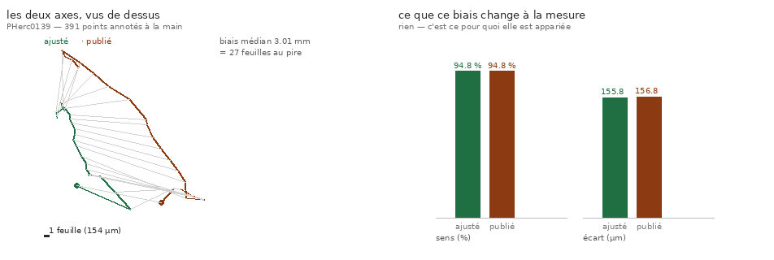

# 78 — Cinq rouleaux publient leur axe, et la mesure appariée n'en bouge pas

> Écrit le 2026-09-04, en cherchant de quoi construire **A2 bis** (le champ d'identité dérivé
> du volume). Mesure dans l'arbre : `src/excision/lombilic_publie.py` (5 contrôles),
> figure `src/figures/figure_ombilic_publie.py`.

---

## 0. ⚠⚠⚠ Une affirmation du dépôt, corrigée — et c'est le même angle mort pour la 3ᵉ fois

`laxe_nest_pas_une_ligne.py` écrivait :

> « La dérive mesurée est celle de **Scroll 1**. C'est le **seul** rouleau qui publie un
> ombilic — vérifié le même jour sur les cinq répertoires `umbilici/` de `dl.ash2txt.org`. »

**La vérification était juste et sa conclusion fausse.** Elle portait sur **un** serveur et
**une** convention de chemin. Sur le bucket ouvert, l'axe vit sous
`<rouleau>/representations/umbilicus/`, et **5 rouleaux en publient un** — balayés sur les
**46 préfixes de premier niveau**, pas sur une liste écrite à la main :

| rouleau | points de contrôle | voxel | annotateur |
|---|---:|---:|---|
| `PHerc0125` | 83 | 9,362 µm | — |
| **`PHerc0139`** | **391** | 2,399 µm | David Josey |
| `PHerc0211` | 87 | 9,362 µm | — |
| `PHerc0332` | 169 | 2,399 µm | David Josey |
| `PHerc0826` | 49 | 9,362 µm | — |

C'est l'angle mort de `59` — *interroger une vue du corpus et conclure sur le corpus* — commis
ici **pour la troisième fois**, et sur le **même objet** que la deuxième. La correction est
écrite dans le fichier fautif, pas seulement ici.

⚠ Et les deux serveurs se **complètent** : Scroll 1 publie bien son ombilic sur
`dl.ash2txt.org`, où il n'y en a pas d'autre. Le mot faux était « seul », pas la mesure.

---

## 1. ⭐⭐⭐ Ce que l'axe publié permet de vérifier vaut mieux que l'axe lui-même

`76` et `77` ajustent un centre par tranche **sur les spires elles-mêmes**. Un ajustement de
cercle sur un **arc partiel** est biaisé — défaut connu de la méthode, dont la mesure exigeait
un axe indépendant. On l'a : 391 points annotés **à la main**.

*Régénérer : `uv run python src/excision/lombilic_publie.py --json docs/mesures/lombilic_publie.json
&& uv run python src/figures/figure_ombilic_publie.py`*

**Le biais est réel et il est grand** : médiane **3,01 mm**, jusqu'à **27 écarts inter-feuilles**. Les deux axes errent de la même façon — même forme, même sens — mais ne se
superposent pas.

### Et la mesure appariée n'en bouge pas

| | vers l'extérieur | écart inter-feuilles |
|---|---:|---:|
| axe **ajusté** (`76`) | **94,8 %** | **155,8 µm** |
| axe **publié** | **94,8 %** | **156,8 µm** |

**Un axe faux de 4 mm déplace le verdict de zéro point et l'écart d'un micromètre.**

C'est exactement ce pour quoi la mesure a été conçue appariée — comparer deux spires *au même
endroit, autour du même centre*, de sorte qu'un biais commun s'annule — et c'est désormais
**mesuré** au lieu d'être argumenté. Tout `76` et tout `77` reposent dessus.

### ⚠ Le contrôle vient en paire, et l'ordre compte

« La mesure ne bouge pas » serait vrai **pour la mauvaise raison** si les deux axes étaient
identiques. Le fichier asserte donc **d'abord** qu'ils diffèrent de plusieurs feuilles, et
**ensuite** que la mesure n'en bouge pas. La sonde qui rend les deux axes égaux fait tomber le
premier contrôle.

### ⚠ Et une sonde localise l'immunité, ce que je n'aurais pas su dire sans elle

Remplacer le centre par tranche par un centre **global** ne change rien non plus (94,6 %
contre 94,5 %). **L'immunité ne vient donc pas de la qualité du centre** mais du fait que les
deux spires sont comparées **dans la même cellule angulaire autour du même centre, quel qu'il
soit**. Un centre par tranche améliore les rayons **absolus** ; la comparaison, elle, était
déjà immunisée.

---

## 2. Ce que ça ouvre pour A2 bis

Le champ d'enroulement de `77` a une limite dure : il **interpole entre spires connues** et
refuse au-delà, donc il ne sort pas de la bande publiée (37 spires sur ~110). Un axe publié
change la donne, parce qu'un nombre d'enroulement se construit **à partir de l'axe et d'un
champ d'orientation**, pas à partir de spires déjà tracées.

⚠ Ce que le dépôt sait déjà et qui borne l'espoir (`26` §7) : les `.normal-grids` publiées sont
**dérivées de la prédiction de surface** que le traceur suit déjà — les lui redonner est une
tautologie, mesurée (×29 de ralentissement, trajectoire identique au centième). Un champ
d'enroulement bâti dessus hériterait donc de la prédiction, pas d'une information neuve.

Ce qui reste ouvert, et c'est A2 bis : **un nombre d'enroulement construit sur l'axe publié et
l'orientation des fibres** (`representations/predictions/fibers/`), qui répondrait partout et pas
seulement dans la bande.

> ⚠⚠⚠ **CORRIGÉ le 2026-09-05 — la phrase ci-dessus annonçait `nx`/`ny`/`nz`, et il n'y a PAS de
> `nz`.** Vérifié à la source (`src/nappe/le_champ_de_fibres.py`, 13 contrôles,
> `docs/mesures/le_champ_de_fibres.json`) : le préfixe publie **trois** canaux — `nx`, `ny`,
> `presence` — et le manifeste `.lasagna.json` n'en déclare pas d'autre, alors que
> `inference.json` annonce `artifact_kind: fiber3d-prediction` et
> `output_schema.output_channels = 7`. Le modèle prédit en 3D, le corpus publie deux composantes.
>
> ⭐⭐ **Mais ce n'est pas le champ 2D que `26` §7 met en garde**, et c'est mesuré plutôt que
> supposé : sur **trois** fenêtres portant de la matière, $n_x^2 + n_y^2$ vaut **0,797 / 0,806 /
> 0,309** en médiane — jamais collé à un. Ces deux canaux sont donc la **projection d'un vecteur
> à trois composantes**, et la troisième se récupère **en module** :
> $|n_z| = \sqrt{1 - n_x^2 - n_y^2}$, soit **0,451 / 0,441 / 0,831**. ⚠ Le **signe**, lui, est
> définitivement perdu.
>
> ⚠ Et l'encodage n'est pas deviné : la somme des carrés plafonne à **1,013–1,014** sur les trois,
> ce qui est exactement l'arrondi d'une quantification sur huit bits. Un facteur d'échelle faux
> l'aurait fait plafonner à 2, à 4 ou à 0,25 — et « le champ n'est pas unitaire » aurait alors été
> une affirmation sur notre lecture, pas sur le champ.
>
> ⚠⚠ **Ce qui borne réellement `A2 bis` n'est pas le `nz` manquant, c'est la RÉSOLUTION** : le
> niveau 0 n'est **pas publié**. Les seuls niveaux présents sont **3 et 4**, soit **19,2 et
> 38,4 µm** par cellule — donc un écart inter-feuilles (~150 µm) tient en **7,8 cellules** au plus
> fin. Assez pour voir une feuille, pas pour en séparer deux qui se touchent.

---

## 3. Ce que ce document N'établit PAS

1. **Que l'axe publié soit juste et l'ajusté faux.** Il établit qu'ils **diffèrent** et que la
   conclusion n'en dépend pas. L'axe publié est un jugement humain, pas une vérité — mais un
   jugement **indépendant** du nôtre, ce qu'il fallait pour tester une robustesse.
2. **Que les cinq axes soient de même qualité.** De 49 à 391 points de contrôle, et seuls deux
   nomment leur annotateur.
3. **Que la conversion de repère soit exacte.** Elle est un facteur d'échelle lu dans le champ
   `volume` du meta et **validé** contre les résolutions de scan publiées. Deux des cinq axes
   sont en 2,399 µm et trois en 9,362 µm ; les mélanger sans conversion donnerait un axe faux
   d'un facteur 3,9.

---

## 4. ⚠⚠⚠ Et l'axe ne suffit pas — le résultat négatif qui fixe le cahier des charges d'A2 bis

> Mesure : `src/excision/laxe_ne_suffit_pas.py` (4 contrôles).

L'espoir était raisonnable : un nombre d'enroulement se construit **en principe** depuis l'axe
et le pas seuls — le modèle d'Archimède, $w = (r - r_0)/\lambda + \theta/2\pi$ — et un tel
champ répondrait **partout**.

**Mesuré : ça ne marche pas, et de très loin.**

| | erreur d'indice |
|---|---:|
| dispersion radiale d'**une seule** spire, autour de l'axe publié | **44,5 feuilles** |
| modèle d'**Archimède** (axe + pas) | **11,36 feuilles** |
| champ bâti sur les spires (`77`) | **0,088 feuille** |

⭐⭐ La forme des spires vaut donc un facteur **130** — deux ordres de grandeur. C'est le vrai
contenu de cette mesure : elle chiffre ce qu'un champ dérivé du volume devra **retrouver**.

**La cause est mesurée, pas supposée** : un rouleau d'Herculanum est **écrasé**. Le rayon d'une
seule spire varie de 44 feuilles autour de l'axe, donc aucun modèle en $(r, \theta)$ à section
circulaire ne peut séparer des feuilles distantes d'une seule.

⚠ Le modèle n'est pas inutile pour autant : il fait **mieux** que la dispersion brute (11,4
contre 44,5), donc il capte bien la spirale. Il est **quatre fois trop grossier** pour une
question qui se joue à une feuille près.

⚠⚠ **Ça ne condamne pas A2 bis, ça en fixe le cahier des charges.** Un champ dérivé du volume
n'a pas à supposer une section circulaire : il peut suivre les feuilles là où elles sont. Ce
qui est établi ici, c'est qu'il devra fournir **la forme** — donc que l'axe publié, à lui seul,
ne débloque rien.

⚠ **Le contrôle est écrit dans le sens « ça échoue ».** Si un jour le modèle passait sous une
feuille, il tomberait — et ce serait une excellente nouvelle à lire immédiatement, parce
qu'A2 bis serait résolu par trois lignes de trigonométrie.

⚠ Une nuance de mesure à ne pas confondre : les 44,5 feuilles sont prises autour de l'**axe
publié** ; autour du centre **ajusté par tranche** la dispersion vaut ~17 feuilles. Ce n'est
pas une contradiction — l'ajustement minimise cette dispersion **par construction**. Les deux
axes restent équivalents pour la mesure **appariée** du §1, qui ne lit jamais un rayon absolu.
