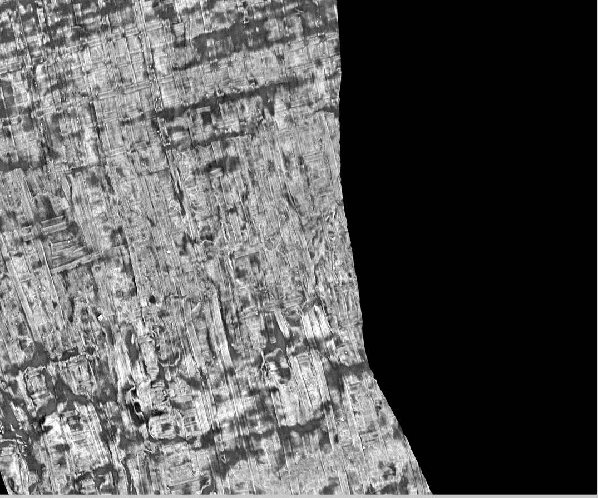
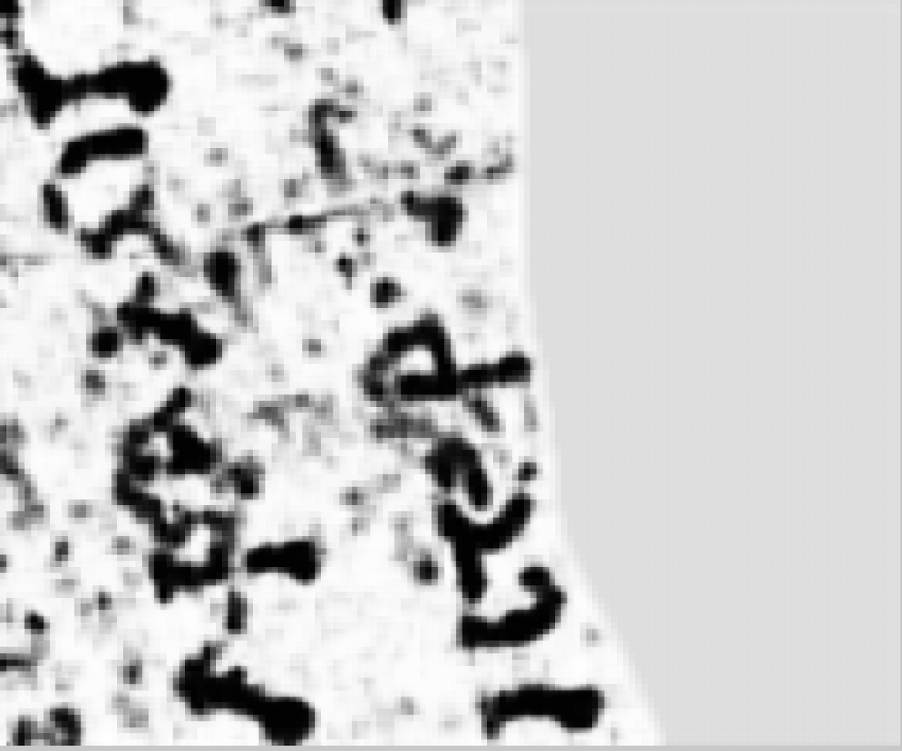
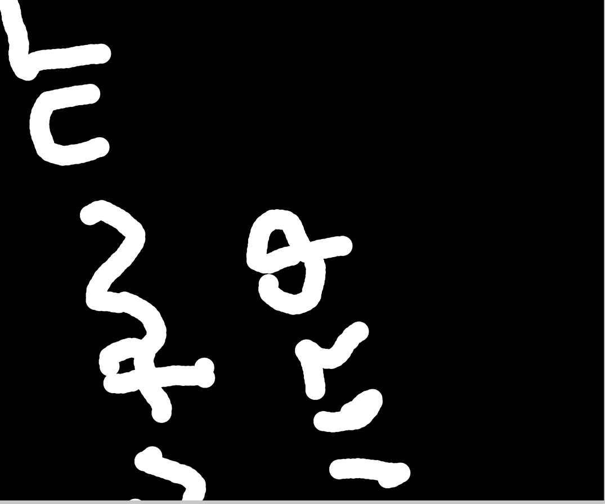
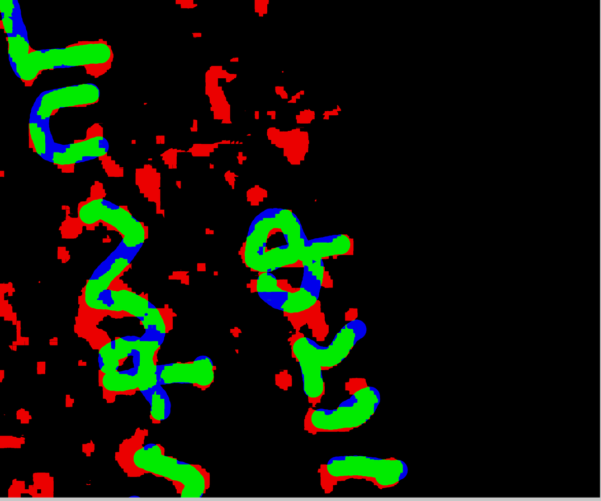

# Première passe complète : des couches au texte lisible

2026-08-17. Premier bout-en-bout du pipeline, avec vérité terrain publiée.
Rejouable : `src/xpu/infer_ink.py`.

---

## 1. Ce qui a débloqué la chaîne

L'étage « rendu » n'a jamais été manquant : **il est déjà publié**. `download.sh` du
dépôt Grand Prize révèle que les **couches rendues** sont sur `dl.ash2txt.org`, et
l'accès y est désormais **libre** (les identifiants du script datent d'une époque où
l'inscription était requise). Donc ni `vc_render_tifxyz` à construire, ni volume de
2,1 Tio à streamer.

⚠ **Mesure qui a évité 16 Go de gâchis** : une couche pèse 474 Mo, donc 65 couches
feraient 31 Go. Les modèles n'en lisent que **26** (`start_idx=15`, `in_chans=26`).

## 2. Le matériel

| voie | verdict |
|---|---|
| **iGPU Arc via `torch 2.9.1+xpu`** | ✅ **×4,5** (104 → 23 ms/fenêtre) |
| CPU seul, réglé | 104 ms/fenêtre (16 fils, lot 4) |
| NPU | ❌ non exposé à WSL2 (`/dev/accel` absent) |
| OpenVINO | ❌ ne convertit pas ce modèle (einsum des *rotary embeddings*) |

⚠ **Le GPU n'a été retenu qu'après vérification numérique** : sortie identique au
CPU à **4,9e-6** près (bruit fp32). Un résultat rapide et faux ne vaut rien.

⚠ Ce qui a débloqué le GPU sous WSL2 : `intel-opencl-icd libze-intel-gpu1 libze1`.
Le nom `intel-level-zero-gpu` n'existe pas sous Ubuntu 26.04, et **apt annule toute
la transaction** sur un nom inconnu. Le GPU fonctionne **sans `/dev/dri`**, par
`/dev/dxg`.

**Coût final** : 4 cm² en **5,6 min**, segment entier en **3,4 h**.

## 3. Le pas de balayage : mesuré, puis rendu caduc

Question posée : passer de 21 à 32 divise le travail par 2,3 — à quel prix ?

| | valeur |
|---|---|
| corrélation des deux cartes | 0,941 |
| désaccord au seuil médian | **17,9 %** |
| désaccord sur l'encre franche (p90) | 3,0 % |

**Pas gratuit** : les détections fortes s'accordent, les zones marginales divergent
— et c'est là que se joue une lettre à demi effacée. Le GPU rendant le pas 21
abordable, on garde **21**.

## 4. Résultat, sur un segment JAMAIS VU par le modèle

`20230909121925` — étiqueté, **absent du jeu d'entraînement** (vérifié contre
`download.sh`).

⚠ **Contrôle d'alignement fait avant toute comparaison** : étiquettes en 11776×4096,
couches en 11591×3882. Un décalage aurait produit un chiffre parfaitement faux. Ce
sont des multiples de 512 dont le remplissage est **entièrement vide** — donc
alignement en (0,0), vérifié et non supposé.

| région | pixels | AUC | précision @0,5 | rappel |
|---|---|---|---|---|
| 1024² | 1,0 M | 0,893 | 0,712 | 0,751 |
| **2560×3072** | **7,8 M** | **0,919** | 0,553 | 0,777 |

À comparer au segment d'entraînement `20231022170901` : AUC **0,874**. **Le modèle
fait aussi bien sur du papyrus inconnu** — ce qui ne prouve pas une généralisation
remarquable, mais prouve qu'on ne mesurait pas du sur-apprentissage.

## 5. ⚠⚠ L'étiquetage est PARTIEL, donc la précision est une borne inférieure

Constaté en **regardant les images** : la prédiction montre nettement plus de
lettres que la vérité terrain, et ces lettres ont des formes cohérentes, une
épaisseur de trait régulière et un alignement en colonnes — ce n'est pas du bruit.

Mesuré : **50 % des lignes du segment ne portent aucune étiquette**, et des bandes
entières sont vides.

| évaluation | précision |
|---|---|
| toute la région | 0,553 |
| lignes annotées seulement | 0,585 |
| lignes densément annotées | 0,587 |

L'étiquetage partiel explique donc **une partie** des faux positifs apparents, pas
la majorité. **L'AUC reste 0,919 dans tous les découpages** — c'est le chiffre
robuste ; la précision, elle, est un plancher.

⚠ Et la restriction par lignes est grossière : les images montrent que la zone non
annotée est surtout faite de **colonnes**, pas de lignes. Une évaluation propre
demanderait le masque d'annotation, que ce jeu ne fournit pas.

## 5bis. Les images

Toutes portent la **même région** de `20230909121925` (2560 × 3072 px, soit
20 × 24 mm à 7,91 µm/px), réduites à 35 % pour le dépôt. Le gris uni est la zone
que le balayage n'atteint pas : ni fond, ni absence d'encre — **pas regardé**.

### La donnée brute, et pourquoi le problème existe

Une tranche du volume, à mi-épaisseur de la feuille. On distingue nettement les
**deux couches de fibres perpendiculaires** du papyrus — c'est ainsi qu'il est
fabriqué. Et on ne voit **aucune encre** : l'encre au carbone a une densité presque
identique à celle du support carbonisé. C'est exactement pour ça qu'il faut un
modèle.

### Ce que le modèle produit

Des lettres grecques, lisibles à l'œil. Le flou vient de la sortie du modèle, qui
est **au 1/16** de l'entrée (4×4 par fenêtre de 64×64) puis ré-agrandie.

### La vérité terrain publiée

⚠ **Nettement plus clairsemée que la prédiction**, et c'est le fait qui a déclenché
la §5 : l'annotation est partielle, donc la précision mesurée est un plancher.

### La superposition

Vert = encre détectée et étiquetée · rouge = détectée non étiquetée · bleu =
étiquetée non détectée.

Ce qu'il faut y lire : **le vert dessine les lettres**, et les erreurs sont
massivement sur les **bords des traits** — un effet du ré-agrandissement ×16, pas
une confusion sur la présence d'une lettre. Le rouge isolé, lui, est ambigu : faux
positif, ou encre réelle non annotée.

## 6. Ce que ça établit, et ce que ça n'établit pas

**Établi** : la chaîne complète fonctionne — trace → couches publiées → modèle →
carte d'encre → **lettres grecques visibles à l'œil**, sur du papyrus que le modèle
n'a jamais vu, en ⚠ **84 secondes par cm²** — corrigé le 2026-08-19 : le §2 donne
« 4 cm² en 5,6 min », soit 336 s / 4 = **84**, pas 52. Les deux chiffres ne pouvaient pas
être vrais en même temps.

**Non établi** : que ce soit *lisible* au sens d'un papyrologue. Des lettres
reconnaissables ne font pas un texte suivi, et personne de compétent ne l'a encore
regardé. C'est exactement la barre fixée en `06` §1bis, et elle n'est pas franchie.

⚠ **Ne pas confondre** : *le modèle retrouve les traits encrés* (mesuré, AUC 0,92)
et *le texte est lisible* (non mesuré, demande un expert). Les deux se ressemblent
assez pour qu'on prenne le premier pour le second.

---

## 7. ⚠ Corrigé et étendu par `10` — 2026-08-17

Le segment **entier** a été passé depuis (`10_segment_complet.md`). Deux
rectifications à ce document :

1. **L'AUC tient et monte légèrement** : **0,925** sur 44,7 M de pixels (contre 0,919
   sur 7,8 M ici), avec un contrôle mélangé à 0,500 exactement. Le chiffre est donc
   confirmé à l'échelle du segment.
2. ⚠ **La §5 de ce document manquait sa ligne de base.** Restreindre l'évaluation aux
   zones annotées relève la précision — mais la densité d'encre y passe de 3,3 % à
   24,4 %, donc **le hasard lui-même y est plus précis**. Comparé à cette ligne de
   base, le gain **décroît** de 10,8× à 2,8× quand on restreint. La hausse de
   précision est donc largement un effet de taux de base et non la preuve que les
   faux positifs sont des trous d'annotation.

Ce qui remplace cet argument est plus fort et vient de la longueur : sur 23 bandes,
la densité prédite suit la densité étiquetée à **rho = +0,796** (p = 5,7 × 10⁻⁶), et
les bandes que l'humain laisse vides sont, pour la plupart, **vides aussi pour le
modèle** (0,35 à 1,66 %). Un détecteur qui fabriquerait de l'encre les remplirait.
