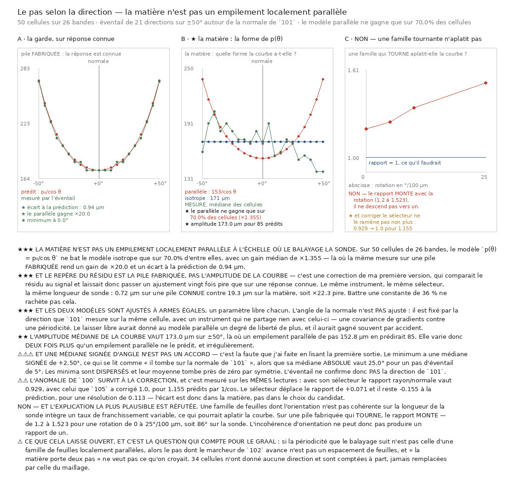

# 106 — Le pas selon la direction : la matière n'est pas un empilement localement parallèle

> ⛔⛔⛔ **À l'échelle où le balayage la sonde, la matière ne se comporte pas comme un empilement de
> feuilles parallèles.** Le même instrument, le même sélecteur, la même longueur de sonde ajustent
> une pile **fabriquée** à **0,72 µm** et la matière à **19,3 µm** — soit **×22,3** pire. Battre une
> constante de 36 % ne rachète pas cela.
>
> ⛔⛔ **Et l'anomalie de `100` SURVIT à la correction du sélecteur.** Sur les mêmes lectures, le
> rapport rayon/normale passe de **0,929** à **1,000** quand on remplace le sélecteur biaisé de
> `105` par le corrigé — pour **1,155** prédits par `1/\cos`. Il reste **−0,155** d'écart pour une
> résolution de **0,113**.
>
> ⚠⚠⚠ **Et une médiane SIGNÉE d'angle n'est pas un accord** : le minimum a une médiane signée de
> **+2,50°**, ce qui se lit « il tombe sur la normale de `101` », alors que sa médiane **absolue**
> vaut **25,0°** pour un pas d'éventail de 5°. Les minima sont **dispersés** et leur moyenne tombe
> près de zéro par symétrie. *C'est la faute que j'ai faite en lisant la première sortie.*



## 1. Pourquoi ce fichier, et deux tranches l'imposent

`100` a balayé la période dans **deux** directions — le rayon et la normale du maillage, séparées de
34° — et rend un rapport médian de **1,018** là où un empilement parallèle en prédit **1,184**. Or
un empilement de feuilles **parallèles** ne peut pas avoir la même période dans deux directions
écartées de 34° : sa période apparente vaut $p_0/\cos\theta$, minimale le long de sa normale et plus
grande partout ailleurs.

⛔ Et `105` a montré que cette mesure a été faite avec un **sélecteur biaisé**, qui lit un cran trop
haut. Refaire la comparaison avec le sélecteur corrigé est donc la première chose à faire, et elle
est faite ici, **appariée** sur les mêmes lectures.

⭐⭐ **Mais deux directions ne décident pas d'une courbe.** $p_0/\cos$ demande plus de deux points
pour se distinguer d'une constante. On balaie donc un **éventail** de 21 directions sur **±50°**
dans le plan qui contient le rayon et la normale, et on lit la **forme** de $p(\theta)$.

⚠ Le demi-angle est **imposé** par la fenêtre du balayage (86,5 à 346,0 µm), pas choisi : au-delà de
50°, $p_0/\cos$ en sort et la réponse serait une **butée** lue comme une mesure.

## 2. ⭐⭐⭐ La garde, sur une pile dont la réponse est connue

Sans elle, une courbe plate sur la matière ne prouverait pas que la matière est isotrope — seulement
que l'instrument est aveugle.

| pile fabriquée | gain du modèle parallèle | minimum | écart à $p_0/\cos$ |
|---|---:|---:|---:|
| obliquité 25° | **×20,0** | **0,0°** | **0,94 µm** |
| obliquité 40° | **×20,0** | **0,0°** | **0,94 µm** |

Et une **fausse normale** (décalée de 40°) fait **perdre** le modèle parallèle : sans ce contrôle
négatif, sa victoire ne dirait rien, une courbe à un paramètre battant souvent une constante par
accident.

## 3. ⭐⭐⭐ Les deux modèles, à armes égales

Le modèle parallèle s'écrit $p(\theta) = p_0/\cos(\theta - \theta_n)$, et **$\theta_n$ n'est pas
ajusté** : il vaut zéro parce que l'éventail est déjà repéré depuis la normale que `101` mesure sur
la même cellule, avec un instrument qui ne partage rien avec celui-ci — une covariance de gradients
contre une périodicité. Les deux modèles n'ont donc qu'**un** paramètre libre : $p_0$. Le laisser
libre aurait donné au parallèle un degré de liberté de plus, et il aurait gagné souvent par
accident.

⚠⚠ L'ajustement est **médian** et non par moindres carrés : le balayage est discret (cran de
8,65 µm) et une butée produit une valeur aberrante qu'une somme de carrés suivrait.

## 4. ⛔⛔⛔ Le résultat, et son repère

50 cellules sur 26 bandes, **34 cellules sans direction** (l'accord des demi-blocs de `101` les
refuse), 40 cellules décidables, **2393 s** de mesure.

| | ∥ gagne | gain | résidu ∥ | résidu iso | $p_0$ ajusté | amplitude |
|---|---:|---:|---:|---:|---:|---:|
| sélecteur de `100` | 65,0 % | ×1,272 | 20,93 µm | 25,92 | **173,6** µm | 186,0 µm |
| **sélecteur corrigé** | **70,0 %** | **×1,355** | **19,30 µm** | 25,90 | **152,8** µm | **173,0 µm** |

⚠ Le $p_0$ ajusté descend de **173,6** à **152,8 µm** quand on corrige le sélecteur, ce qui est
cohérent avec le biais de **+18,4 %** que `105` a mesuré.

⚠⚠⚠ **Et le repère du résidu est la pile fabriquée, pas l'amplitude de la courbe** — c'est une
correction de ma première version, qui comparait le résidu au signal et laissait donc passer un
ajustement vingt fois pire que sur une réponse connue. *Le repère d'un instrument est ce que ce même
instrument obtient sur du connu.*

$$ \frac{19{,}30}{0{,}72} = 22{,}3 $$

⭐ **Le modèle parallèle décrit-il la matière ? Non**, à un facteur trois près déclaré d'avance.

⚠ Et l'amplitude confirme l'irrégularité plutôt que l'anisotropie : **173,0 µm** mesurés sur ±50° là
où un empilement de pas 152,8 µm en prédirait **85**. La courbe varie **deux fois plus** qu'un
empilement parallèle ne le prédit, et sans en suivre la forme.

## 5. ⚠⚠⚠ Deux façons de se tromper que j'ai commises, et une seule les a attrapées

### La normale n'était pas orientée

Un **vecteur propre n'a pas de sens** — `101` compare ses directions au produit scalaire **absolu**
pour cette raison. Je prenais la direction du tenseur telle quelle, donc une cellule sur deux voyait
son éventail basculé dans le mauvais demi-plan : **61 %** des cellules avaient le rayon **hors** de
l'éventail, et l'angle médian sortait à **67,8°** là où `101` publie 34,59.

⭐ Ce qui l'a attrapé est un chiffre absurde : `1/\cos` sortait à **1,556**, soit un rayon à
exactement 50° — le bord de mon éventail. Et mon code l'**écrêtait** silencieusement sur la
direction du bord : *une limite de grille publiée comme une limite matérielle*, la faute que ce
dépôt recense, écrite par moi.

⭐⭐ **Et la correction se vérifie sur les données déjà lues, avant de la repayer** : replié dans
[0°, 90°], l'angle médian donne **33,6°** contre les **34,59°** de `101` — un accord à un degré près
par une route entièrement différente. Un éventail de ±50° couvre alors **74,5 %** des cellules ; les
autres sont désormais **refusées** et comptées, jamais écrêtées (**12** cellules).

### Une médiane signée d'angle n'est pas un accord

Le minimum a une médiane **signée** de **+2,50°** et une médiane **absolue** de **25,0°**, pour un
pas d'éventail de 5°. J'ai lu la première comme « le minimum tombe sur la normale de `101` ». Elle
ne dit que la **symétrie de la dispersion**.

> ⛔ **L'éventail ne confirme donc PAS la direction de `101`.** Il fallait l'écart absolu pour le
> voir, et il est publié à côté de la médiane signée exactement pour ça.

## 6. ⛔ L'explication la plus plausible, réfutée

Une famille de feuilles dont l'orientation n'est pas **cohérente** sur la longueur de la sonde
(346 µm, alors que `101` mesure la cohérence à ~100 µm) intègre un taux de franchissement variable —
$\cos(\text{angle})/p$ — ce qui pourrait aplatir la courbe.

| rotation | sur la sonde | $p$(normale) | $p$(à 34°) | rapport |
|---:|---:|---:|---:|---:|
| 0°/100 µm | 0° | 173,0 | 207,6 | **1,200** |
| 5°/100 µm | 17° | 173,0 | 216,2 | 1,250 |
| 10°/100 µm | 35° | 173,0 | 233,6 | 1,350 |
| 25°/100 µm | 87° | 181,7 | 276,8 | **1,523** |

> ⛔ **Le rapport MONTE.** L'incohérence d'orientation ne peut pas produire un rapport de un.

⚠ Ma première fixture avait le défaut que `102` documente — départ non recalé sur la famille de
plans — et elle mesurait sa propre mise en place. La phase est intégrée **analytiquement** et non
sommée pas à pas, pour qu'une erreur de sommation ne se lise pas comme un effet de la rotation.

## 7. ⭐⭐⭐ Ce que cela veut dire pour le graal

Si la périodicité que le balayage suit n'est pas celle d'une famille de feuilles localement
parallèles, alors **le pas dont le marcheur de `102` avance n'est pas un espacement de feuilles au
sens géométrique**, et « la matière porte deux pas » ne veut pas ce qu'on croyait.

⭐ Cela s'enchaîne avec les deux tranches précédentes, et les trois disent la même chose sous trois
angles :
- `104` : un pas **confirmé** peut franchir entre 0,68 et 1,38 feuille, et rien ne le signale ;
- `105` : le pas dont le marcheur avance est **+18,4 %** trop grand ;
- `106` : la quantité que ce pas mesure **n'est pas** l'espacement d'un empilement parallèle.

## 8. Ce que cette tranche ne dit pas

- Elle ne dit **pas** que la matière est isotrope. Les deux modèles restent sous le seuil de
  description en amplitude (57,67 µm), et le parallèle bat la constante sur 70 % des cellules — mais
  ×22,3 plus mal que sur du connu. Le verdict est **« pas un empilement parallèle »**, pas
  **« isotrope »**.
- Elle ne dit **pas** ce que la matière est. Une périodicité irrégulière, une famille de feuilles
  froissée sous la résolution du balayage, un empilement dont le pas varie sur 346 µm : rien ici ne
  les sépare.
- ⚠ Elle ne reproduit **pas** le 1,018 de `100` : l'éventail est repéré depuis la normale de `101`
  et non celle du maillage, donc c'est la même **question** posée avec une meilleure direction, pas
  la même mesure. Le rapport rendu ici est **1,000** pour **1,155** prédits.
- ⚠ Le verdict porte sur **cette** longueur de sonde (346 µm, imposée par le plus long candidat).
  Une sonde plus courte ne peut pas représenter $p_0/\cos(50°)$ ; la question « que voit-on à
  100 µm » demande une autre fenêtre de balayage, donc un autre nul par candidat.

## Reproduire

```bash
uv run python src/nappe/le_pas_selon_la_direction.py --verifier
uv run python src/nappe/le_pas_selon_la_direction.py --cellules 3 \
    --json docs/mesures/le_pas_selon_la_direction.json
uv run python src/figures/figure_le_pas_selon_la_direction.py --verifier
```
