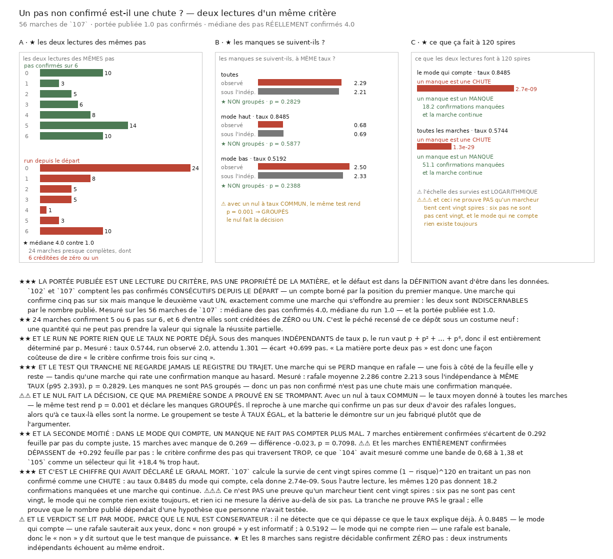

# 109 — Un pas non confirmé n'est pas une chute

> ⭐⭐⭐ **La portée publiée par `102` et `107` est une LECTURE du critère, pas une propriété de la
> matière.** Les deux comptent les pas confirmés **consécutifs depuis le départ** — un compte borné
> par la position du premier manque. Sur les **56** marches de `107` : médiane des pas réellement
> confirmés **4,0**, médiane du run **1,0**, et la portée publiée est **1,0**.
>
> ⭐⭐ **24** marches confirment **5** ou **6** pas sur **6**, et **6** d'entre elles sont créditées
> de **zéro ou un**. Une marche qui confirme cinq pas sur six mais manque le deuxième vaut **un**,
> exactement comme une marche qui s'effondre au premier : les deux sont **indiscernables** par le
> nombre publié.
>
> ⭐⭐⭐ **Et les manques ne sont PAS groupés** : rafale moyenne **2,286** contre **2,213** sous
> l'indépendance à même taux, **p = 0,2829**. Un pas non confirmé n'est donc pas une **chute** mais
> une **confirmation manquée** — et c'est l'hypothèse inverse qui portait le chiffre ayant déclaré
> le graal mort.
>
> ⚠⚠⚠ **Ce document ne prouve PAS qu'un marcheur tient cent vingt spires.** Six pas ne sont pas
> cent vingt, le mode qui ne compte rien existe toujours, et rien ici ne mesure la dérive au-delà
> de six pas.



## 1. Le défaut est dans la DÉFINITION, avant d'être dans les données

`102` publie « la matière porte deux pas confirmés » et `107` le refait avec le pas corrigé. Les
deux comptent les pas confirmés **consécutifs depuis le départ**.

Ce compte est **borné par la position du premier manque**. Il se démontre sans aucune donnée :

| suite de confirmations | pas confirmés | run depuis le départ |
|---|---:|---:|
| `O . O O O O` | **5** | **1** |
| `O . . . . .` | 1 | **1** |
| `. O O O O O` | 5 | **0** |
| `O O O O O O` | 6 | 6 |

> ⭐⭐⭐ **Les deux premières lignes sont indiscernables par le nombre publié**, et ce sont deux
> marches qui n'ont rien à voir : l'une traverse cinq fois, l'autre une.

⚠⚠ C'est le péché déjà recensé de ce dépôt sous un costume neuf : **une quantité qui ne peut pas
prendre la valeur qui signale la réussite partielle**. Le run ne peut jamais dire « cinq sur six ».

## 2. ⭐⭐⭐ Ce que la lecture consécutive jette, mesuré

| pas confirmés sur 6 | 0 | 1 | 2 | 3 | 4 | 5 | 6 |
|---|---:|---:|---:|---:|---:|---:|---:|
| marches | 10 | 3 | 5 | 6 | 8 | **14** | **10** |

| run depuis le départ | 0 | 1 | 2 | 3 | 4 | 5 | 6 |
|---|---:|---:|---:|---:|---:|---:|---:|
| marches | **24** | 8 | 5 | 5 | 1 | 3 | **10** |

Médiane des confirmés **4,0**, médiane du run **1,0**. **24** marches confirment 5 ou 6 pas sur 6,
et **6** d'entre elles sont créditées de zéro ou un.

## 3. ⭐⭐ Et le run ne porte rien que le taux ne porte déjà

Sous des manques **indépendants** de taux `p`, le run depuis le départ vaut
$p + p^2 + \dots + p^6$ — donc il est **entièrement déterminé par `p`**.

| | valeur |
|---|---:|
| taux de confirmation | **0,5744** |
| run moyen observé | **2,0** |
| run moyen attendu sous l'indépendance | **1,301** |
| écart | **+0,699** pas |

> ⭐ « La matière porte deux pas » est donc une façon coûteuse de dire « le critère confirme trois
> fois sur cinq ».

⚠ L'écart est **positif** — le run observé dépasse l'attendu — parce que le corpus mêle deux modes
de taux très différents. Par mode, l'accord est meilleur.

## 4. ⭐⭐⭐ Le test qui tranche, et il ne regarde jamais le registre du trajet

Une marche qui **se perd** manque en rafale : une fois à côté de la feuille, elle y reste. Une
marche qui **rate une confirmation** manque au hasard. La question « un manque est-il une chute ? »
devient donc une question sur le **groupement**, mesurable sans circularité.

| jeu | marches | taux | confirmés / run | rafale observée | sous l'indépendance | p95 du nul | p | groupés ? |
|---|---:|---:|---:|---:|---:|---:|---:|---|
| toutes | 56 | 0,5744 | 4,0 / 2,0 | **2,286** | **2,213** | **2,393** | **0,2829** | **non** |
| mode haut | **22** | **0,8485** | **5,0** / **3,0** | **0,682** | **0,693** | **0,909** | **0,5877** | **non** |
| mode bas | **26** | **0,5192** | **3,0** / 1,0 | **2,5** | **2,334** | **2,692** | **0,2388** | **non** |

> ⭐⭐⭐ **Un pas non confirmé n'est pas une chute.** Dans aucun des deux modes les manques ne se
> suivent plus qu'un tirage indépendant de même taux n'en produirait.

⚠⚠ **Le nul est CONSERVATEUR, donc « non groupé » ne veut pas dire « aucun groupement ».** Il ne
détecte que ce qui dépasse ce que le taux de la marche explique déjà. À **0,8485** — le mode qui
compte — une rafale sauterait aux yeux, donc le « non » y est informatif ; à **0,5192** une rafale
est banale, donc le « non » y dit surtout que le test manque de puissance.

⭐ Et les **8** marches sans registre décidable confirment **zéro** pas : deux instruments
indépendants échouent au même endroit.

## 5. ⚠⚠ Le nul fait la décision, et ma première sonde l'a prouvé en se trompant

Avec un nul à taux **commun** — le taux moyen donné à toutes les marches — le même test rend
**p = 0,001** et déclare les manques **groupés**.

Il reproche à une marche qui confirme un pas sur deux d'avoir des rafales longues, **alors qu'à ce
taux-là elles sont la norme**. Le groupement se teste **à taux égal**.

> ⚠⚠⚠ Et la batterie le **démontre** sur un jeu fabriqué plutôt que de l'argumenter : six marches
> entièrement confirmées à côté de six marches qui ne confirment qu'un pas sur six. Le nul à taux
> commun les déclare groupées (**p = 0,0205**) ; celui qui conserve chaque taux ne les déclare pas
> (**p = 0,1534**).

## 6. ⭐⭐ La seconde moitié : un manque ne fait pas compter plus mal

Dans le **mode qui compte**, à l'intérieur duquel l'appartenance au mode est la même pour les deux
groupes — donc sans circularité :

| | marches | feuilles par pas | écart à un |
|---|---:|---:|---:|
| entièrement confirmées | **7** | **1,292** | **0,292** |
| avec au moins un manque | **15** | **1,005** | **0,269** |

Différence des écarts **−0,023**, **p = 0,7098** : aucune.

⚠⚠⚠ **Et ma première version de ce test lisait « plus de feuilles » comme « mieux »**, donc rendait
le verdict à l'envers. La cible d'un pas juste est **exactement une feuille** : franchir 1,29 est
aussi faux que franchir 0,71, dans l'autre sens.

> ⚠⚠ **Les marches ENTIÈREMENT confirmées dépassent de +0,292 feuille par pas** : le critère
> confirme des pas qui traversent **trop**. C'est ce que `104` avait mesuré comme une bande de
> **0,68 à 1,38** et `105` comme un sélecteur qui lit **+18,4 %** trop haut, retrouvé ici par une
> troisième route.

## 7. ⭐⭐⭐ Ce que ça change pour le chiffre qui avait déclaré le graal mort

`107` calcule la survie de cent vingt spires comme $(1 - \text{risque})^{120}$, **en traitant un
pas non confirmé comme une chute**.

| | mode qui compte (taux 0,8485) | toutes les marches (taux 0,5744) |
|---|---:|---:|
| si un manque est une **chute** | **2,74e-09** de survie | **1,28e-29** |
| si un manque est un **manque** | **18,2** confirmations manquées | **51,1** |

> ⭐⭐⭐ **Le nombre publié dépendait d'une hypothèse que personne n'avait testée**, et le test la
> réfute : les manques ne sont pas groupés.

⚠⚠⚠ **Ce que ce document ne prouve PAS :**

- qu'un marcheur tient cent vingt spires — **six pas ne sont pas cent vingt** ;
- que le mode qui ne compte rien a disparu — il fait **26 marches sur 48** décidables ;
- que la marche ne dérive pas au-delà de six pas — **rien ici ne le mesure** ;
- que le compte de feuilles est juste — l'écart à un vaut **0,269** dans le meilleur groupe, soit
  un quart de feuille par pas.

## 8. Ce que ça désigne comme suite

⭐ La bonne question n'est plus « combien de pas la matière porte » mais **« de combien le compte
dérive quand la marche est longue »** — parce qu'un manque isolé ne l'arrête pas. C'est la mesure
que `104` appelait déjà : *le retard est-il un biais, qui coûte `n`, ou un jitter de moyenne nulle,
qui coûte `√n` ?*

⚠ Et elle demande des marches **longues**, pas nombreuses : le plafond de six pas de `107` est
exactement ce qui empêche de la poser.

## ⭐⭐⭐ Ce que `110` a trouvé en posant la question que ce document désignait

> ⭐⭐⭐ **Dans le mode qui compte, le compte SUIT le pas** : `110` relit les mêmes marches sur les
> PRÉFIXES de leur polyligne et rend **1.012** feuille par pas à deux pas, **1.085** à six — dérive
> **+0.073**, aucun biais.
>
> ⭐⭐⭐ **Et les deux populations de `107` n'existent pas à deux pas** : écart **+0.004** feuille par
> pas au plus court contre **+0.965** au plus long. La bimodalité naît entre le deuxième et le
> troisième pas.
>
> ⚠⚠⚠ **Et une dérive SEULE reproduit la falaise du mode bas**, sur une périodicité intacte
> (**0.128** contre **0.12** observé) : l'observation ne distingue pas « la marche a quitté la
> feuille » de « une composante plus forte a masqué la périodicité ».

## Reproduire

```bash
uv run python src/nappe/un_pas_manque_nest_pas_une_chute.py --verifier
uv run python src/nappe/un_pas_manque_nest_pas_une_chute.py \
    --json docs/mesures/un_pas_manque_nest_pas_une_chute.json
uv run python src/figures/figure_un_pas_manque_nest_pas_une_chute.py \
    --sortie docs/images/109_un_pas_manque_nest_pas_une_chute.png
```

⚠ Aucune lecture distante : la tranche entière se calcule sur
`docs/mesures/le_marcheur_avec_le_bon_pas.json`, déjà payé par `107`.
