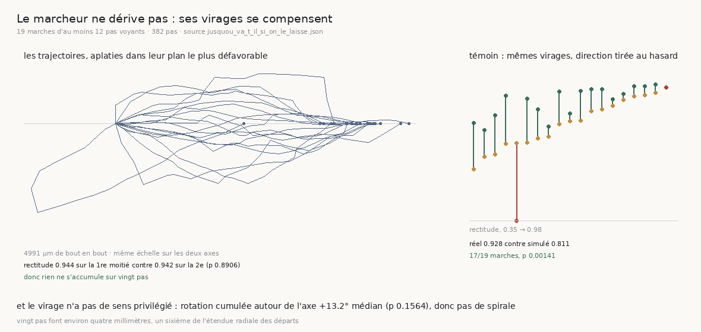

# 119 — Le marcheur ne dérive pas : ses virages se compensent

> ⭐⭐⭐⭐ **UN PAS CONFIRMÉ N'EST PAS UN PAS DROIT, ET C'EST LA SEULE CHOSE QU'AUCUNE TRANCHE
> N'AVAIT REGARDÉE.** `117` a montré que le **taux** ne baisse pas avec la profondeur. Une marche
> peut pourtant confirmer ses vingt pas en tournant lentement pour longer la feuille au lieu de la
> traverser : chaque pas serait parfait pendant que la marche s'en va. C'est exactement la panne que
> l'humain corrige d'une spire à l'autre.
>
> ⭐⭐⭐⭐ **LA MARCHE N'ACCUMULE RIEN.** La rectitude — le déplacement net rapporté au chemin
> parcouru — vaut **0,944** sur la première moitié et **0,942** sur la seconde (p **0,8906**, 19
> marches appariées). Le virage d'un pas au suivant ne grandit pas (**11,5°** → **13,6°**,
> p **0,3736**), et la rotation cumulée autour de l'axe du rouleau n'a pas de sens privilégié
> (médiane **+13,2°**, p **0,1564**) : pas de spirale.
>
> ⭐⭐⭐⭐ **ET MIEUX QUE ÇA : SES VIRAGES SE COMPENSENT.** Contre un tirage qui garde **exactement**
> le virage de chaque pas mais en tire la direction au hasard, la marche réelle est plus droite —
> **0,928 contre 0,811**, sur **17 marches sur 19**, p **0,00141**. Le marcheur ne se contente pas
> de ne pas empirer : il revient.
>
> ⚠⚠ **Vingt pas font environ quatre millimètres**, un sixième de l'étendue radiale des départs.
> Rien ici ne dit que ça tient sur les cent et quelques transferts d'un rouleau entier.
>
> ⭐ **Zéro lecture distante** : la trajectoire est reconstruite exactement depuis les directions et
> les avances que `113` a gardées.



## 1. Pourquoi ce fichier

La question du graal est *qu'est-ce qui remplace l'humain qui corrige le transfert de spire à
spire ?* Les quatre tranches précédentes ont mesuré **combien** de pas sont confirmés (`115`, `117`),
**quand** le marcheur ne lit plus rien (`116`) et **ce qui** refuse un pas (`117`, `118`). Aucune n'a
regardé **où le marcheur va**.

C'est pourtant là que vit la panne que l'humain corrige : une trajectoire qui tourne lentement sort
de la feuille sans qu'aucun pas n'ait l'air faux.

## 2. ⚠⚠ La garde : c'est bien la trajectoire de la course

Le chemin est reconstruit en sommant `direction × avance` à chaque pas. La garde est qu'il retrouve
le `parcouru_um` que la course a écrit : **écart maximal 0,5 µm** sur 382 pas, pour une tolérance de
**1,0 µm**.

⚠ La tolérance n'est pas un réglage : `avance_um` est écrit à la décimale, donc vingt pas portent au
plus un micromètre d'arrondi cumulé. Plus large accepterait un vrai désaccord, plus étroit
refuserait l'écriture du JSON. Les directions sont par ailleurs vérifiées unitaires.

⚠ La marche est **coupée à son premier pas aveugle**, comme `116` l'impose : les pas qui suivent ont
une direction choisie sans rien lire, et les garder mesurerait la trajectoire d'un marcheur aveugle
en l'appelant une dérive.

## 3. ⭐⭐⭐⭐ Rien ne s'accumule

| | |
|---|---:|
| marches d'au moins 6 pas voyants | **19** |
| rectitude, première moitié | **0,944** |
| rectitude, seconde moitié | **0,942** |
| Wilcoxon apparié | p **0,8906** |
| angle entre les deux moitiés | **20,5°** médian (140,0° au pire) |
| virage par pas, premier tiers → dernier | **11,5°** → **13,6°** (p **0,3736**) |

⚠ La comparaison est **appariée à l'intérieur d'une marche** : deux marches n'ont ni le même départ
ni la même matière, donc comparer la première moitié des unes à la seconde des autres mesurerait
surtout laquelle est tombée dans quelle bande.

⚠ Une marche sur dix-neuf tourne de **140°** entre ses deux moitiés. Le maximum est publié à côté de
la médiane plutôt que caché derrière : « rien ne s'accumule » est un énoncé sur la population, pas
une promesse sur chaque marche.

## 4. ⭐⭐⭐ Et pas de spirale

| | |
|---|---:|
| rotation cumulée autour de l'axe, médiane | **+13,2°** |
| min – max | −99,6° – +147,3° |
| Wilcoxon contre zéro | p **0,1564** |

Un virage **systématique** est la signature d'une spirale : une marche qui tourne toujours du même
côté finit par longer la feuille. Le test ne trouve pas de sens privilégié.

⚠ n = 19 : il **cesse de rejeter** l'absence de sens, il ne la prouve pas.

⚠ Et un Wilcoxon sur une série **dégénérée** — des rotations toutes nulles — rend un p de 1,0 sur
une division invalide, ce qui se lit exactement comme un vrai « pas d'écart ». Le code refuse la
série au lieu de rendre ce 1,0, et une sonde l'exige.

## 5. ⭐⭐⭐⭐ Le témoin : la différence entre « ne pas empirer » et « corriger »

Une rectitude de 0,93 ne dit rien toute seule : une marche dont les pas ne virent presque pas serait
droite sans rien corriger, et le nombre serait le même.

Le témoin garde donc **exactement** le virage de chaque pas et ne tire au hasard que sa **direction**
dans le plan normal au pas précédent.

| | |
|---|---:|
| rectitude réelle | **0,928** |
| rectitude simulée, mêmes virages | **0,811** |
| marches où le réel est plus droit | **17 / 19** |
| Wilcoxon apparié | p **0,00141** |

⭐ La marche réelle est donc plus droite que le hasard de mêmes virages : **ses virages se
compensent**. Un marcheur qui dériverait aurait exactement la rectitude du tirage.

⚠ Sonde inverse, dans la batterie : sur une marche **parfaitement droite**, le témoin doit répondre
« rien à compenser » plutôt que d'inventer un écart. C'est ce qui distingue *corriger* de *ne pas
virer*.

## 6. ⚠ Ce qui est rendu comme description et pas comme résultat

L'angle au radial **de départ** croît le long d'une marche — **49,1°** sur le premier tiers,
**54,8°** sur le dernier (p **0,3321**).

⚠⚠ Il est **confondu**, et c'est pourquoi il n'est pas un résultat : une marche qui avance aussi
circonférentiellement voit le radial **local** tourner sous elle, donc l'angle au radial initial
croîtrait même sur une trajectoire parfaite. Le mesurer contre le radial local demanderait l'axe du
rouleau, qui est une **courbe** (`laxe_est_une_courbe.py`) et pas une droite — donc une autre mesure
et un autre lot.

## 7. Ce que ça change pour le graal

- L'humain corrige le transfert de spire à spire parce qu'on suppose que la machine dérive. **Sur
  vingt pas et sur matière lisible, elle ne dérive pas** — et elle fait mieux que ne pas dériver,
  elle revient.
- ⭐ Avec `117` (la matière seule refuse 28 pas sur 382) et `116` (le marcheur sait s'arrêter
  gratuitement), ce qui restait à remplacer se réduit : non pas une correction continue de
  trajectoire, mais **un arrêt honnête et une fenêtre de pas qui sait exprimer l'espacement local**
  (`118`).
- ⚠ Ce qui n'est pas acquis : **la portée**. Vingt pas sont un sixième du chemin, et dix-sept
  marches sur vingt-huit touchent encore le plafond. `R4-P20` reste ouverte, et c'est elle qui
  décidera si la compensation tient sur cent transferts.

## 8. Les registres

Faits : `R4-F47` (rien ne s'accumule sur vingt pas, et pas de spirale), `R4-F48` (les virages se
compensent contre un tirage de mêmes virages). Aucune porte ouverte : la seule question que ce
document laisse est celle que `R4-P20` pose déjà.

## Reproduire

```bash
uv run python src/nappe/le_marcheur_derive_t_il.py --verifier             # 35 contrôles
uv run python src/nappe/le_marcheur_derive_t_il.py \
    --json docs/mesures/le_marcheur_derive_t_il.json                      # une seconde
uv run python src/figures/figure_le_marcheur_derive_t_il.py --verifier    # 16 contrôles
uv run python src/figures/figure_le_marcheur_derive_t_il.py
```

⚠ **Aucune lecture distante.** La projection des trajectoires est faite chez le **producteur** et
pas dans la figure : un dessin qui calculerait sa propre projection, avec sa propre graine pour le
témoin, serait un second producteur des mêmes nombres.
